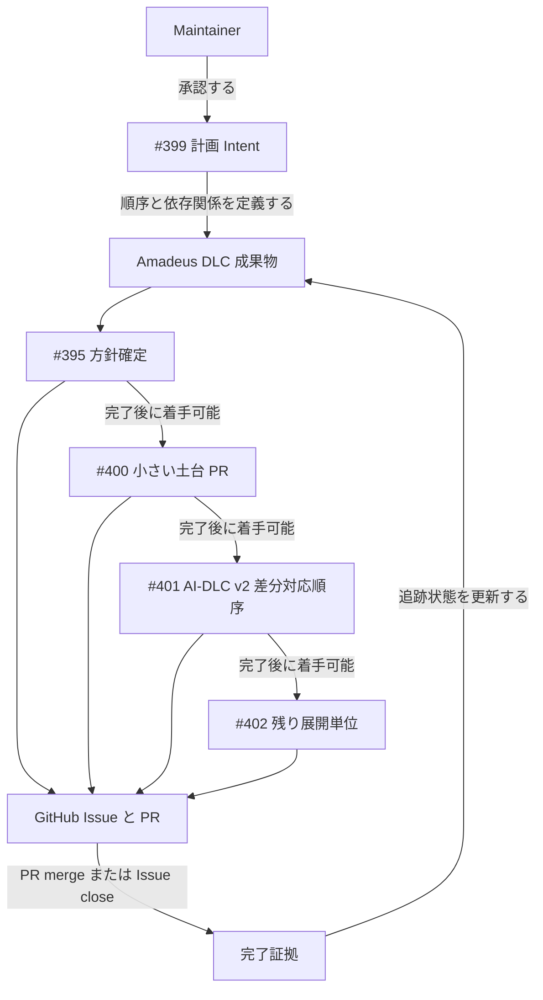
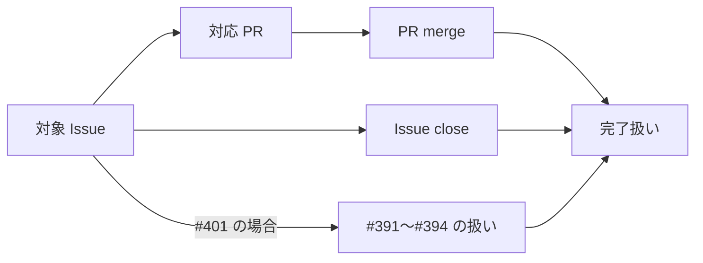

# Wireframes：Amadeus skill 英語化実施計画

この Intent は UI を対象にしない。

そのため、「Wireframes」は #399 親 Issue と #395、#400、#401、#402 の完了証拠を追跡するシステム相互作用図として扱う。

## Issue 完了追跡の相互作用

Maintainer は #399 の計画 Intent を承認する。

Amadeus DLC 成果物は、子 Issue の順序、依存関係、完了証拠を記録する。

GitHub は PR merge または Issue close の状態を提供する。

Agent は、GitHub 上の状態を確認し、Amadeus DLC 成果物の追跡情報へ反映する。

## 完了証拠の扱い

完了証拠は、対応 PR の merge または明示的な Issue close とする。

#401 は、#391、#392、#393、#394 の扱いが追跡できることを追加の確認点として持つ。

