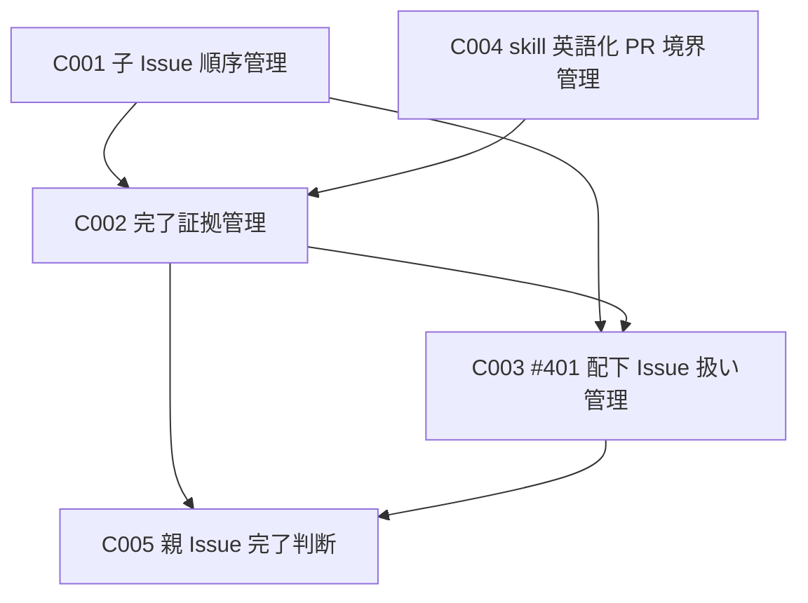

# Component Dependency：Amadeus skill 英語化実施計画

## 概要

この成果物は、論理コンポーネント間の依存関係を整理する。

依存は成果物上の参照関係を表す。

## 依存関係

| From | To | 理由 |
|---|---|---|
| C002 完了証拠管理 | C001 子 Issue 順序管理 | 完了証拠は子 Issue の順序に沿って確認するため。 |
| C003 #401 配下 Issue 扱い管理 | C001 子 Issue 順序管理 | #401 の位置づけを子 Issue 順序から参照するため。 |
| C003 #401 配下 Issue 扱い管理 | C002 完了証拠管理 | #401 の完了証拠に配下 Issue の扱いを含めるため。 |
| C004 skill 英語化 PR 境界管理 | C002 完了証拠管理 | PR merge を完了証拠として扱う前に、PR の境界を確認するため。 |
| C005 親 Issue 完了判断 | C002 完了証拠管理 | 子 Issue の完了証拠から #399 の完了判断可否を示すため。 |
| C005 親 Issue 完了判断 | C003 #401 配下 Issue 扱い管理 | #401 の完了証拠に配下 Issue の扱いが含まれるため。 |

## 依存図

## 外部依存

GitHub Issue、Pull Request、CI、レビューボット、merge 状態は外部依存として扱う。

外部依存の状態は、PR 説明、traceability、audit から追跡できるようにする。
