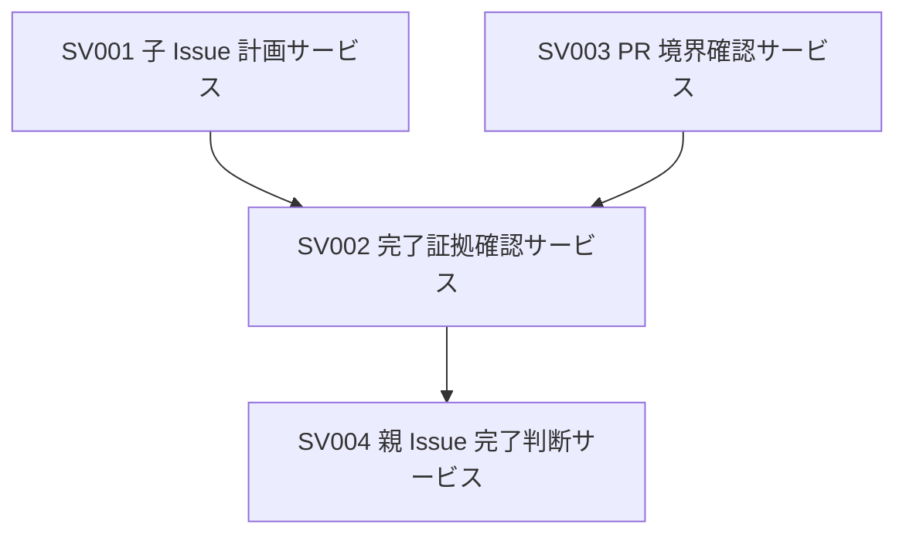

# Services：Amadeus skill 英語化実施計画

## 概要

この成果物は、Issue #399 の完了追跡に必要なサービス境界を整理する。

実装サービスは定義しない。

## サービス一覧

| ID | サービス | 責務 | 関連コンポーネント |
|---|---|---|---|
| SV001 | 子 Issue 計画サービス | #395、#400、#401、#402 の順序と依存関係を後続成果物へ渡す。 | C001 |
| SV002 | 完了証拠確認サービス | GitHub 上の PR merge または Issue close を完了証拠として扱う。 | C002、C003 |
| SV003 | PR 境界確認サービス | skill 英語化 PR の変更範囲、昇格フロー、検証結果を確認する。 | C004 |
| SV004 | 親 Issue 完了判断サービス | 子 Issue の完了証拠から #399 の完了判断可否を示す。 | C005 |

## サービス連携

## 非機能的な前提

サービス境界は成果物上の責務分担を表す。

実行時サービス、API、データベースは導入しない。
