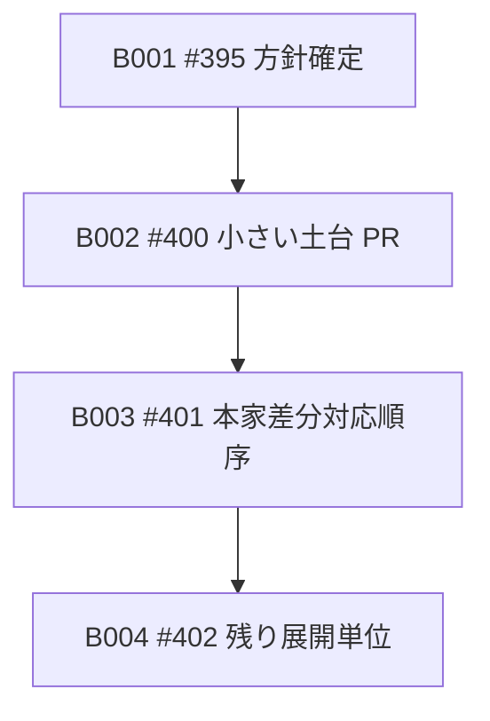

# Bolt Plan：Amadeus skill 英語化実施計画

## 概要

この成果物は、Unit の依存 DAG に対して Bolt 計画を定義する。

Bolt は Unit 1 個ずつ束ねる。

最初の Bolt は U001 を扱う B001 とし、walking skeleton とする。

順序付けは依存先行とする。

## Bolt 一覧

| ID | Bolt | 束ねる Unit | 実行順序 | walking skeleton | Definition of Done | Confidence Hypothesis |
|---|---|---|---:|---|---|---|
| B001 | #395 方針確定 Bolt | U001 | 1 | yes | #395 の対応 PR merge または明示的な Issue close を確認できる。英語化方針、対象範囲、検証方法が追跡できる。 | 子 Issue 完了追跡の最小経路として、方針と検証基準を先に固定できる。 |
| B002 | #400 小さい土台 PR Bolt | U002 | 2 | no | #400 の対応 PR merge または明示的な Issue close を確認できる。代表 skill の小さい土台 PR の変更範囲と検証結果を追跡できる。 | 小さい土台 PR で、翻訳変更、意味変更、昇格フロー、検証結果の境界を確認できる。 |
| B003 | #401 本家差分対応順序 Bolt | U003 | 3 | no | #401 の対応 PR merge または明示的な Issue close を確認できる。#391、#392、#393、#394 の扱いを #401 の完了証拠として追跡できる。 | 本家差分対応順序を確定し、#401 配下 Issue を親 Intent の直接完了条件へ広げずに扱える。 |
| B004 | #402 残り展開単位 Bolt | U004 | 4 | no | #402 の対応 PR merge または明示的な Issue close を確認できる。#395、#400、#401、#402 の完了証拠から #399 の完了判断へ進める。 | 残り skill の段階的英語化単位を決め、親 Issue の完了判断に必要な証拠をそろえられる。 |

## 依存順序

## Inception から Construction への申し送り

B001 は walking skeleton として、子 Issue 完了追跡の最小経路を通す。

各 Bolt は対応する子 Issue の完了証拠を持つ。

merge 操作は Maintainer が行う。

Agent は PR 作成後、CI、レビューボット、コメントを監視し、目的と異なる有効な指摘は後続 Issue 候補として扱う。
