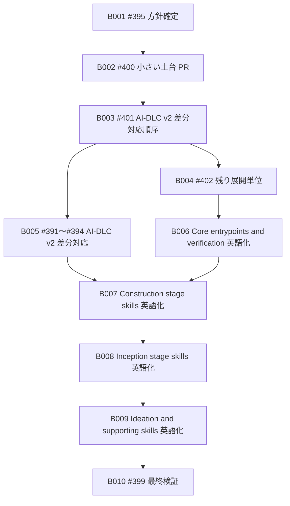

# Bolt Plan：Amadeus skill 英語化実施計画

## 概要

この成果物は、Unit の依存 DAG に対して Bolt 計画を定義する。

B001〜B004 は、#395、#400、#401、#402 の計画・追跡単位を扱う。

B005 以降は、Issue #399 の残タスクとして、差分対応と Amadeus 系 `SKILL.md` の全面英語化を扱う。

最初の Bolt は U001 を扱う B001 とし、walking skeleton とする。

順序付けは依存先行とする。

## Bolt 一覧

| ID | Bolt | 束ねる Unit | 実行順序 | walking skeleton | Definition of Done | Confidence Hypothesis |
|---|---|---|---:|---|---|---|
| B001 | #395 方針確定 Bolt | U001 | 1 | yes | #395 の対応 PR merge または明示的な Issue close を確認できる。英語化方針、対象範囲、検証方法が追跡できる。 | 子 Issue 完了追跡の最小経路として、方針と検証基準を先に固定できる。 |
| B002 | #400 小さい土台 PR Bolt | U002 | 2 | no | #400 の対応 PR merge または明示的な Issue close を確認できる。代表 skill の小さい土台 PR の変更範囲と検証結果を追跡できる。 | 小さい土台 PR で、翻訳変更、意味変更、昇格フロー、検証結果の境界を確認できる。 |
| B003 | #401 AI-DLC v2 差分対応順序 Bolt | U003 | 3 | no | #401 の対応 PR merge または明示的な Issue close を確認できる。#391、#392、#393、#394 の扱いと実施順序を追跡できる。 | AI-DLC v2 差分対応順序を確定し、B005 の個別完了確認へ接続できる。 |
| B004 | #402 残り展開単位 Bolt | U004 | 4 | no | #402 の対応 PR merge または明示的な Issue close を確認できる。残り skill の段階的英語化単位、優先順位、検証コマンドを追跡できる。 | 残り skill の段階的英語化単位を決め、後続の全面英語化 PR に接続できる。 |
| B005 | #391〜#394 AI-DLC v2 差分対応 Bolt | U005 | 5 | no | #391、#393、#392、#394 の完了または対象外判断を確認できる。 | 英語化前に意味差分の判断を固定し、後続の翻訳で契約を落とさない。 |
| B006 | Core entrypoints and verification 英語化 Bolt | U006 | 6 | no | `amadeus`、`amadeus-steering`、`amadeus-validator` の source skill と昇格先 skill が英語化され、検証が pass している。 | 単一公開入口、Space 初期化、検証の語彙を先にそろえられる。 |
| B007 | Construction stage skills 英語化 Bolt | U007 | 7 | no | 残り Construction stage skill の source skill と昇格先 skill が英語化され、検証が pass している。 | 代表 skill の知見を同じ phase に展開できる。 |
| B008 | Inception stage skills 英語化 Bolt | U008 | 8 | no | Inception stage skill の source skill と昇格先 skill が英語化され、検証が pass している。 | Construction へ渡す語彙をまとめてそろえられる。 |
| B009 | Ideation and supporting skills 英語化 Bolt | U009 | 9 | no | Ideation stage skill、補助分析、review 系 skill の source skill と昇格先 skill が英語化され、検証が pass している。 | 入口と補助 skill の語彙を、Core と phase skill に合わせられる。 |
| B010 | #399 最終検証 Bolt | U010 | 10 | no | Amadeus 系 `SKILL.md` の全面英語化、昇格先同期、検証結果、#399 の完了条件を確認できる。 | 全面英語化が終わった後にだけ、親 Issue の完了判断へ進める。 |

## 依存順序

## Inception から Construction への申し送り

B001 は walking skeleton として、子 Issue 完了追跡の最小経路を通す。

B001〜B004 は対応する子 Issue の完了証拠を持つ。

B005 以降は、#399 の残タスクとして、差分対応、英語化 PR、昇格先同期、検証結果を完了証拠にする。

merge 操作は Maintainer が行う。

Agent は PR 作成後、CI、レビューボット、コメントを監視し、目的と異なる有効な指摘は後続 Issue 候補として扱う。
