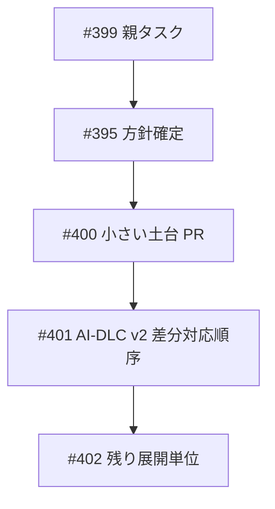
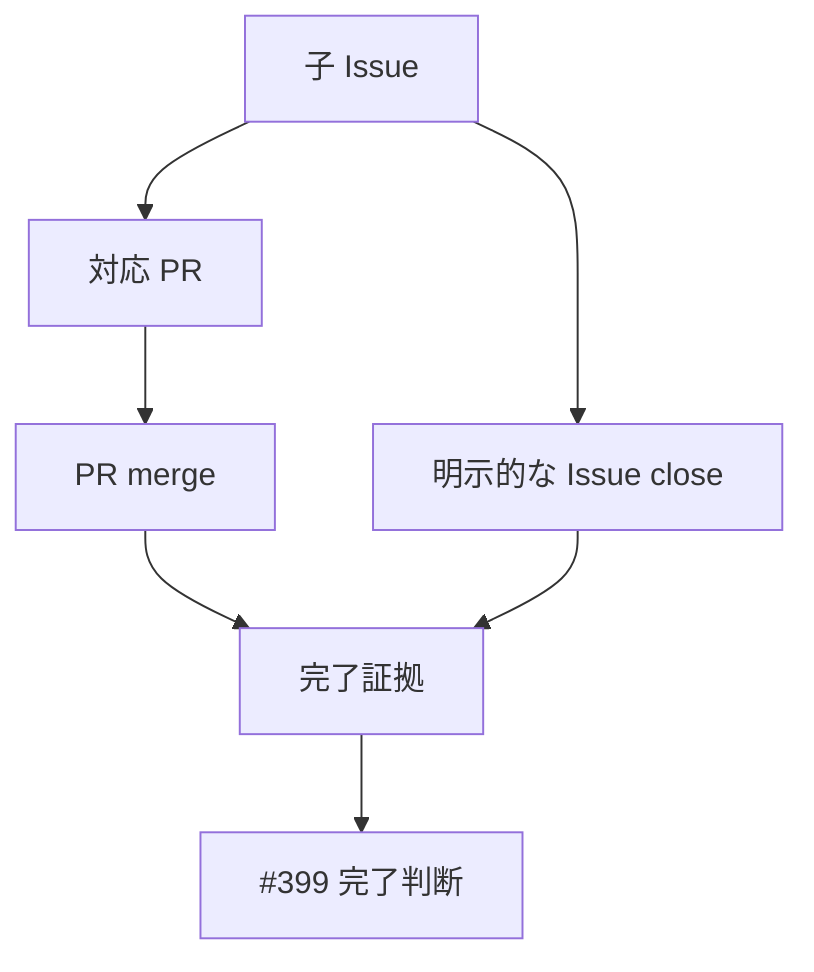
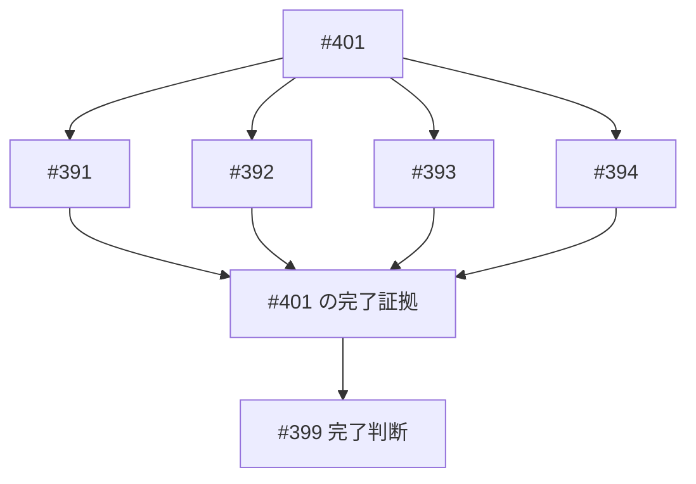
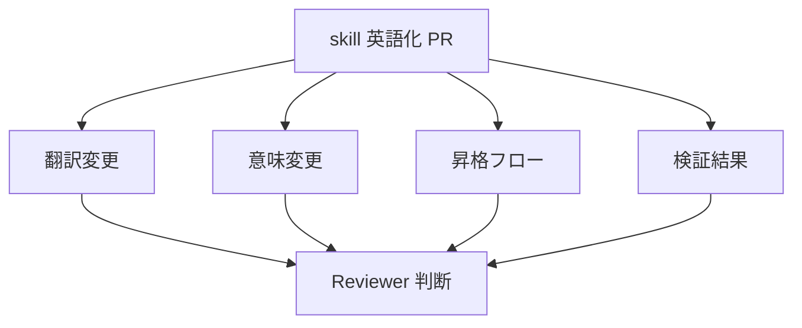
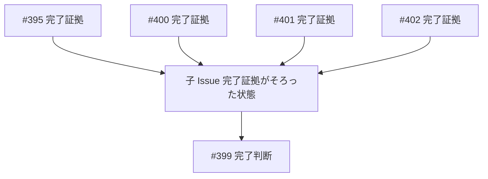

# Mockups：Amadeus skill 英語化実施計画

## 概要

この成果物は、Ideation の rough mockups を要求とストーリーに対応づけて精緻化する。

この Intent は UI を対象にしないため、mockup は Issue 完了追跡の相互作用図として扱う。

## M001：子 Issue の順序と依存

対応要求は R001 である。

対応ストーリーは S001 である。

## M002：完了証拠の確認

対応要求は R002 と R005 である。

対応ストーリーは S002 と S005 である。

## M003：#401 配下 Issue の扱い

対応要求は R003 である。

対応ストーリーは S003 である。

## M004：skill 英語化 PR の確認境界

対応要求は R004 である。

対応ストーリーは S004 である。

## M005：完了判断

対応要求は R005 である。

対応ストーリーは S005 である。

