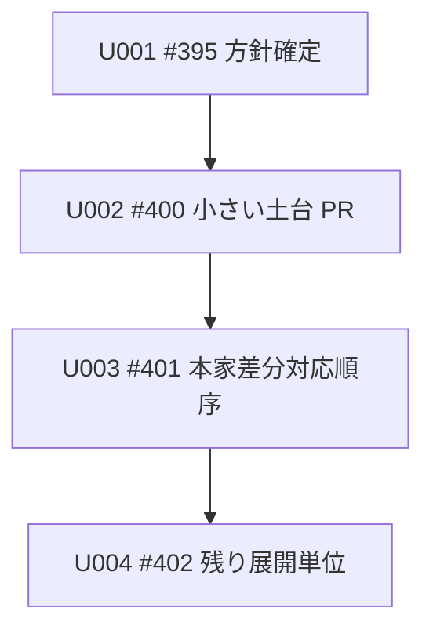

# Unit of Work Dependency：Amadeus skill 英語化実施計画

## 概要

この成果物は、Unit 間の依存 DAG を定義する。

依存は、ある Unit が別の Unit の成果を前提にする関係を表す。

実施順序の決定は Delivery Planning の責務である。

## 依存一覧

| From | To | 理由 |
|---|---|---|
| U002 #400 小さい土台 PR | U001 #395 方針確定 | 土台 PR は、英語化方針、対象範囲、検証方法を前提にするため。 |
| U003 #401 本家差分対応順序 | U002 #400 小さい土台 PR | 本家差分対応順序は、小さい土台 PR の結果を前提にするため。 |
| U004 #402 残り展開単位 | U003 #401 本家差分対応順序 | 残り展開単位は、#401 と #391、#392、#393、#394 の扱いを前提にするため。 |

## DAG

## 循環確認

依存 DAG に循環はない。

U004 から U001、U002、U003 へ戻る依存は定義しない。
