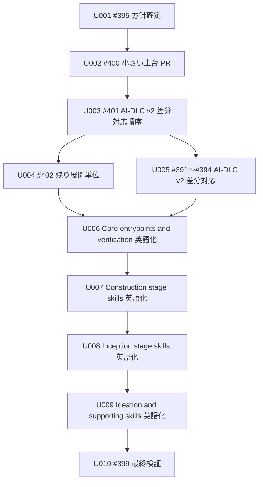

# Unit of Work Dependency：Amadeus skill 英語化実施計画

## 概要

この成果物は、Unit 間の依存 DAG を定義する。

依存は、ある Unit が別の Unit の成果を前提にする関係を表す。

実施順序の決定は Delivery Planning の責務である。

## 依存一覧

| From | To | 理由 |
|---|---|---|
| U002 #400 小さい土台 PR | U001 #395 方針確定 | 土台 PR は、英語化方針、対象範囲、検証方法を前提にするため。 |
| U003 #401 AI-DLC v2 差分対応順序 | U002 #400 小さい土台 PR | AI-DLC v2 差分対応順序は、小さい土台 PR の結果を前提にするため。 |
| U004 #402 残り展開単位 | U003 #401 AI-DLC v2 差分対応順序 | 残り展開単位は、#401 と #391、#392、#393、#394 の扱いを前提にするため。 |
| U005 #391〜#394 AI-DLC v2 差分対応 | U003 #401 AI-DLC v2 差分対応順序 | 実際の差分対応は、#401 で確定した順序と PR 境界を前提にするため。 |
| U006 Core entrypoints and verification 英語化 | U004 #402 残り展開単位 | Core 系の英語化は、#402 の RU002 方針を前提にするため。 |
| U006 Core entrypoints and verification 英語化 | U005 #391〜#394 AI-DLC v2 差分対応 | Core 系の英語化は、#394 を含む差分対応判断を前提にするため。 |
| U007 Construction stage skills 英語化 | U006 Core entrypoints and verification 英語化 | Construction stage skill の英語化は、Core entrypoints and verification の語彙を前提にするため。 |
| U008 Inception stage skills 英語化 | U007 Construction stage skills 英語化 | Inception stage skill は Construction へ渡す語彙と整合させる必要があるため。 |
| U009 Ideation and supporting skills 英語化 | U008 Inception stage skills 英語化 | Ideation と補助 skill は、Inception までの語彙を前提にできるため。 |
| U010 #399 最終検証 | U009 Ideation and supporting skills 英語化 | 最終検証は、全英語化 PR と昇格先同期が完了した後にだけ実施できるため。 |

## DAG

## 循環確認

依存 DAG に循環はない。

U010 から U001〜U009 へ戻る依存は定義しない。
