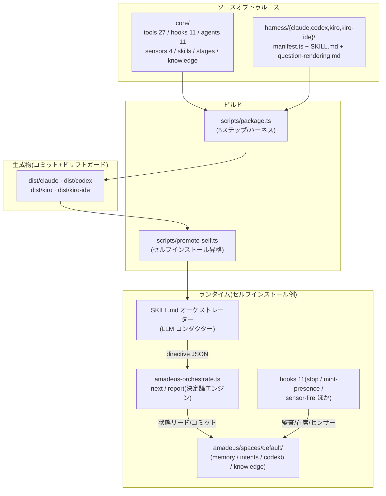
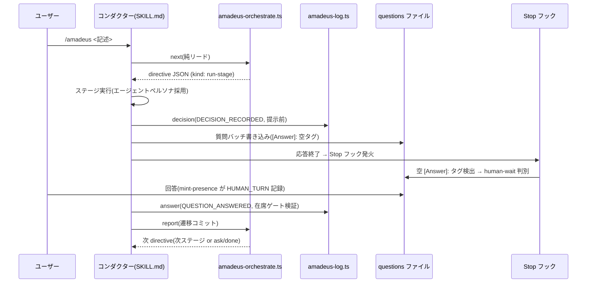
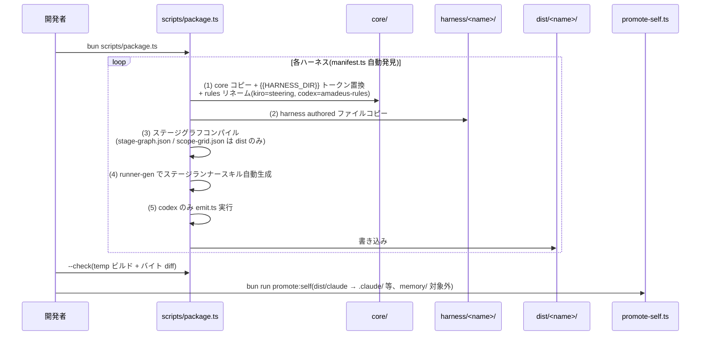

# Architecture

> Reverse Engineering 成果物 — 分析対象: main @ 14c40c9c(現 HEAD e2c28731、2026-07-07 鮮度リフレッシュ)

## アーキテクチャ概観

Amadeus は「**単一ソース → 多ハーネス配布**」のビルドパイプラインと、「**決定論エンジン + LLM コンダクター**」のランタイム分離という2つの軸で構成される。

**テキストフォールバック**: `core/`(全成果物の唯一の編集対象)と `harness/<name>/`(ハーネス別表層)を `scripts/package.ts` が結合・変換して `dist/<4ハーネス>/` を生成する。dist はコミットされ `--check` でドリフト検査される。このリポジトリ自身は `promote-self.ts` で dist/claude をルートの `.claude/` 等へ昇格して使う。ランタイムでは SKILL.md(LLM)が `amadeus-orchestrate.ts`(決定論エンジン)を呼び、directive JSON を受け取って実行し、11 個のフックが監査・在席・センサーを担う。状態はすべて `amadeus/spaces/<space>/` 配下に永続化される。

## 主要アーキテクチャパターン

| パターン | 適用箇所 | 意図 |
|---|---|---|
| **Generated Distribution(生成物コミット)** | `dist/` ×4 | ユーザーはコピーだけで導入可能。`--check` のバイト diff がドリフトを CI 相当で防ぐ |
| **Manifest-driven Discovery** | `harness/<name>/manifest.ts` | manifest の存在だけでハーネスが自動発見される。新ハーネス追加 = ディレクトリ追加 |
| **Command/Query 分離** | `orchestrate next`(純リード)/ `report`(遷移コミット) | LLM の再試行・クラッシュに対して状態遷移を冪等・原子的に保つ |
| **凍結契約(directive JSON)** | `amadeus-directive.ts` | kind: run-stage / ask / print / error / done / parked / invoke-swarm + 予約2。エンジンと LLM の境界を型で固定 |
| **イベントホワイトリスト** | `amadeus-audit.ts` VALID_EVENT_TYPES | 監査イベント型を静的に列挙し、勝手な型の混入を拒否 |
| **Strict-additive レイヤー解決** | memory 5層(org→team→project→phase→stage) | 狭いレイヤーが広いポリシーと矛盾する学習は §13 ゲートで却下 |
| **Pull-import センサー** | stage frontmatter `sensors:[...]` → コンパイル時解決 | PostToolUse フックは compile 済み `sensors_applicable` を読むだけ |
| **Read-only スキル規律** | session-cost / replay / outcomes-pack | ステージポインタ不進行・監査不発行・数値は runtime summary --json のみ |

## Interaction Diagrams

### /amadeus forwarding loop(ステージ実行トランザクション)

**テキストフォールバック**: コンダクターは `orchestrate next` で directive を受け取りステージを実行する。ユーザーへ質問を提示する前に `log decision` で DECISION_RECORDED を発行し、questions ファイルへ空の `[Answer]:` タグ付きで質問を書く。Stop フックがこの空タグを検出して human-wait 状態と判別する。ユーザーの回答時に mint-presence フックが HUMAN_TURN を刻み、`log answer` は「最後の QUESTION_ANSWERED 以降に HUMAN_TURN が存在すること」を在席ゲートとして検証する(autonomous Construction とテストスイッチは例外、台帳なしは fail-open)。ステージ完了後 `orchestrate report` が遷移をコミットし、ループが次の directive へ進む。

### package.ts 配布パイプライン

**テキストフォールバック**: package.ts はハーネスごとに5ステップを実行する — (1) core を dist へコピーし `{{HARNESS_DIR}}` トークン置換(唯一の変換)と rules ディレクトリのリネーム、(2) harness 手書きファイルの上書きコピー、(3) ステージグラフのコンパイル(生成 JSON は dist のみに存在)、(4) runner-gen による per-stage ランナースキルの自動生成、(5) codex のみ emit.ts。`--check` は一時ディレクトリへの再ビルドとバイト単位 diff によるドリフトガード。`promote:self` は dist/claude の内容をリポジトリルートの `.claude/` / `.codex/` / `.agents/` / `CLAUDE.md` へ昇格するが、手編集ソースである `amadeus/spaces/default/memory/` は対象外。`scope-grid.json` はキー単位マージであり、composed scope(動的登録されるスコープ定義)は昇格処理の保護対象として上書きされない。

## コンポーネント関係と結合の要点

- **エンジン(orchestrate)⇄ コンダクター**: directive JSON のみで結合。エンジンは会話内容を知らず、コンダクターは状態ファイルを直接書かない
- **フック ⇄ 台帳**: Stop / mint-presence / log の三者は questions ファイルと監査台帳を介した暗黙のプロトコルで結合(空 `[Answer]:` タグ規約が要)。**grilling 統合時はこの規約の継承が必須**
- **スキル配布 ⇄ manifest**: read-only スキルは4ハーネスの manifest `coreDirs` へ手動行追加(N×M の抜け漏れリスク — 既知の負債)
- **stage-protocol.md(1000行)**: 対話モード契約の単一ファイル。第4モード挿入点は L258-298(mode 選択 question ブロック + Step 3d 新設)で、変更の影響面が広い
