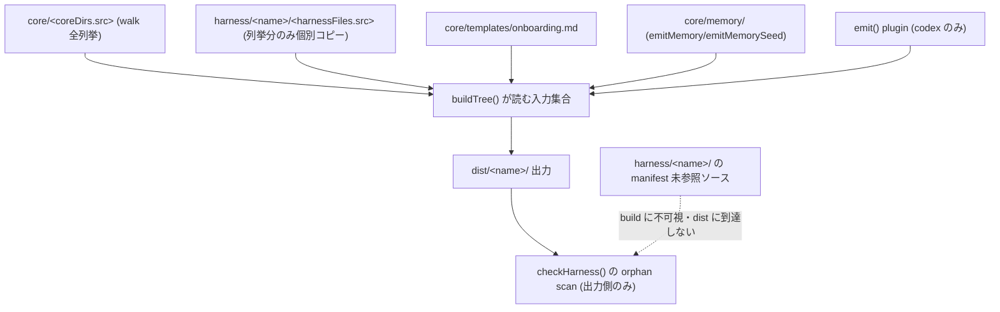
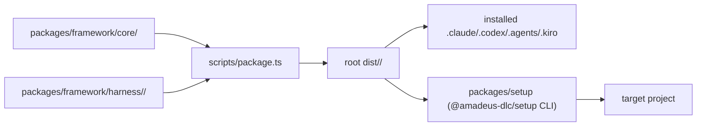
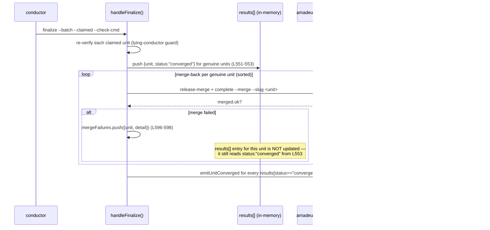
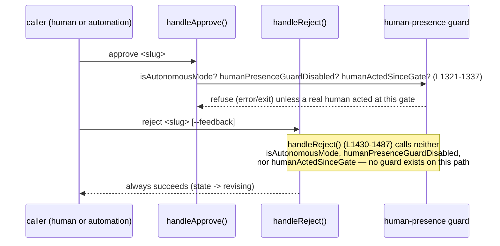
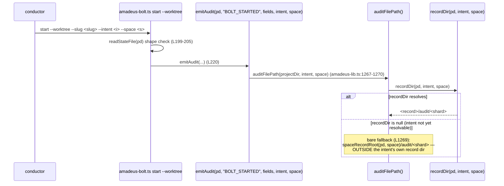
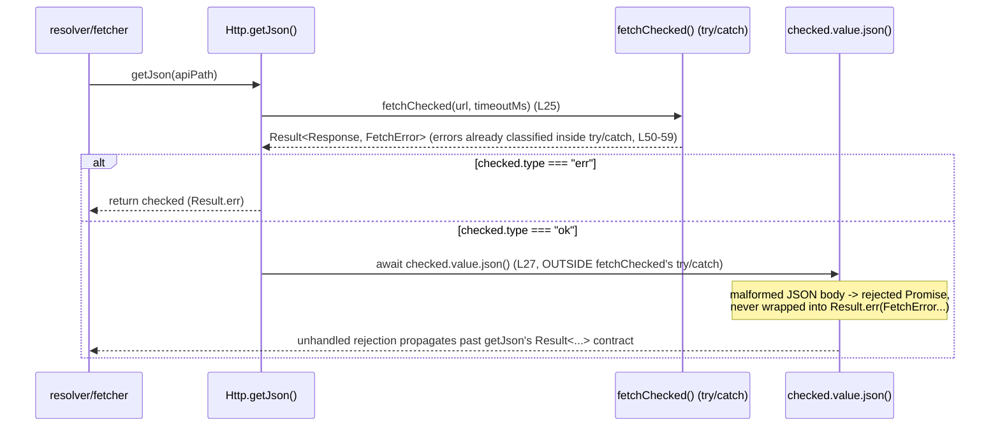
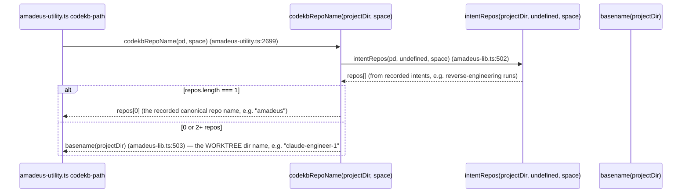

# アーキテクチャ

> **2026-07-10 更新(intent 260710-source-unreferenced-check)**: 前回 intent 対象の2バグは出荷済み — **#685 delegate-rejection は #729(`14d1146e0`)で解消**(`DELEGATED_REJECTION` イベント + `delegate-rejection` subcommand を追加、verb-scoped presence に分離)、**#670 sibling-worktree guard は #727(`20c2e9674`)で解消**(write パスをメインチェックアウトへアンカーする方式に変更)。以下の「#685」「#670」の相互作用図は**歴史的記録**であり現状コードとは一致しない。本 intent は packaging の source 側 unreferenced 検査(#735)を対象とし、下記の新設節を主眼とする。

## packaging 入力集合と source 側 unreferenced 検査(intent 260710、#735 の中核理解)

`scripts/package.ts` は one-core-many-harnesses の唯一の変換器であり、「build が何を入力として読むか」がここで確定する。#735 が塞ごうとする欠陥は「manifest からどの行にも参照されない authored ソースファイルが、build に不可視のまま(dist へ出荷されないまま)残存しても、既存の検査が何も鳴らない」ことである。



<!-- text fallback: buildTree (scripts/package.ts:307) が build の入力集合を確定する。(1) coreDirs の各 src を walk() で全列挙してコピー(L322-344)、(2) harnessFiles の各 src を「列挙された分だけ」個別コピー(L357-363、ディレクトリ全体は walk しない)、(3) onboarding skeleton をレンダリング(L370-376)、(4) core/memory/ を emitMemory/emitMemorySeed で emit(L382-395)、(5) codex のみ emit() プラグイン(L446-458)。checkHarness (L554) の orphan 検出はすべて「committed dist vs 再ビルド dist」の出力側で働く(harness-dir orphan L574-582、#711 で追加された dist 全域 orphan scan L605-628)。harness ソースは harnessFiles に列挙された src だけがコピーされるため、未列挙のソースファイルは build に一切読まれず dist にも現れず、出力側の orphan scan では検出不能。これが #735 の source 側 unreferenced 検査ギャップ。#737(#719)がこのギャップの実害例: kiro CLI harness に7個の .kiro.hook が manifest 未参照のまま残存していた。 -->

### build 入力集合の確定点(file:line)

| 入力 | 確定点 | 備考 |
| --- | --- | --- |
| core dirs(全列挙) | `buildTree` L322-344 `for (const { src, dst } of m.coreDirs)` → `walk(srcDir)` | core は dir 単位で全ファイル walk |
| harness authored files | `buildTree` L357-363 `for (const { src, dst, projectRoot } of m.harnessFiles)` | **列挙された src のみ**。未列挙ソースは不可視 |
| onboarding | `buildTree` L370-376 | skeleton からレンダリング |
| memory(method tree) | `buildTree` L382-383(`emitMemory`)/ L395(`emitMemorySeed`) | 出力は `<harnessDir>` 外 |
| emit プラグイン出力 | `buildTree` L446-458(codex のみ) | 出力パスを返し `--check` で byte-diff |
| **dist 出力側 orphan scan** | `checkHarness` L574-582(harness-dir)/ L605-628(dist 全域、#711) | source 側は検査対象外 |
| harness の発見 | `discoverHarnessNames` L68-73(`harness/*/manifest.ts` の存在で発見)/ CLI L660 | 1 manifest = 1 harness |

### dist 全域 orphan scan(#711、`37b295598`)

`checkHarness` の orphan scan は #711 で「ハードコードされた `[".agents","amadeus"]` ルート限定」から「`dist/<name>/` 全域 walk」へ拡張された(L605-628)。期待出力集合 = harness-dir subtree(L574-582 の pass で `authoredExempt` 込みで検査)+ 宣言済み projectRoot 出力(`harnessFiles`/`onboarding`)+ emit 出力集合(`committedEmitSet`)。これにより `dist/<name>/` 直下や未宣言サブディレクトリに残った stale ファイル(削除/改名された projectRoot 出力など)を検出できる。ただしこれは**出力側**の検査であり、source 側の未参照は依然として守備範囲外。

### 後続ステージ向け合成ビュー(#735 検査の設計空間)

以下は requirements/design が使う事実整理であり、**設計決定は含まない**(どの案を採るかは後続ステージの仕事)。3つの独立した設計軸がある。

**(a) 参照集合の導出点 — buildTree の実読み込み vs manifest 静的導出**

| 案 | 参照集合の作り方 | build 機構3種の扱い | トレードオフ |
| --- | --- | --- | --- |
| A: `buildTree` が実際に読んだ src を記録 | `buildTree`(L307-460)実行中に「コピー対象として列挙・消費した src」を集合化し、`harness/<name>/` の実ファイル walk との差集合を未参照とする | 記録集合に現れないため別途除外が必要 | build の実挙動と定義上一致。write/check の両経路で走る(下記 (c))。ただし `buildTree` に集合記録の副作用を足す侵襲がある |
| B: manifest から参照集合を静的導出 | `m.harnessFiles[].src` + `m.onboarding` + `emit` 宣言を静的に読み、実ファイル walk との差集合を取る | harnessFiles に無いので静的許可リストか import グラフ追跡で除外 | `buildTree` を触らず独立実装可能。ただし「buildTree が実際に読む集合」と manifest 記述が将来乖離すると検査自体がズレる |

事実(誤検出除外の設計根拠): 3種の build 機構ファイルは **harnessFiles に列挙されない(=dist へ非コピー)が、manifest.ts を起点とする import グラフからは到達可能** — `manifest.ts` は `package.ts` が `require()`(L514)、`onboarding.fills.ts` は各 `manifest.ts` が `import`(例 `harness/claude/manifest.ts:18`)、codex `emit.ts` は `package.ts` の `require()`(L651)+ `harness/codex/manifest.ts:19` の `import`。よって除外は「静的ファイル名許可リスト」でも「manifest.ts からの import グラフ追跡」でも実現でき、これ自体が (a) の派生選択肢になる。

**(b) 誤検出リスクの分類**

| 分類 | 例 | 検査上の位置づけ |
| --- | --- | --- |
| build 機構3種 | `manifest.ts` / `onboarding.fills.ts` / codex `emit.ts` | **正当に未参照**(dist 非コピーだが build が import で読む)。恒久的な除外対象 |
| 将来の authored 追加 | harnessFiles へ配線する前の新規ソース | **真の検出対象**(未配線=#735 が鳴らしたい状態)。ただし実装作業中は一時的偽陽性になりうる |
| harness dir 外の fixture/docs 類 | `harness/<name>/` の外(`tests/` 等) | **対象外**(検査範囲を harness-dir subtree に限れば自然に除外) |

**(c) 検査の発火点**

| 発火点 | 経路 | 特性 |
| --- | --- | --- |
| `checkHarness` 内に追加 | `--check`(= `dist:check`)経由でのみ発火(CLI L658/L673) | 既存 drift guard と同一ゲートに乗る。write 単独時は走らない |
| `buildTree` 内に追加 | write(L544)と check(L561)の両方が `buildTree` を呼ぶため常時発火 | 常に走る。ただし write 経路を検査ロジックで汚す |
| 独立サブコマンド新設 | 例 `package.ts --check-source`(新規) | 関心分離が明確。ただし CI/`package.json` script への配線を別途要する |

<!-- text fallback: #735 の検査には3つの独立設計軸がある。(a) 参照集合の導出点: 案A=buildTree が実際にコピー列挙した src を記録して実ファイル walk と差集合、案B=manifest の harnessFiles/onboarding/emit 宣言を静的に読んで差集合。build 機構3種(manifest.ts/onboarding.fills.ts/codex emit.ts)は harnessFiles 非列挙で dist へコピーされないが manifest.ts 起点の import グラフから到達可能(manifest.ts=package.ts が require L514、onboarding.fills.ts=各 manifest.ts が import、emit.ts=package.ts require L651 + codex manifest import)なので、除外は静的許可リストか import 追跡で実現でき、それ自体が派生選択肢。(b) 誤検出リスク3分類: build 機構3種=恒久除外、将来の未配線 authored ソース=真の検出対象(WIP 中は一時偽陽性)、harness dir 外の fixture/docs=検査範囲を harness-dir subtree に限れば対象外。(c) 発火点: checkHarness 内=dist:check 経由のみ(write では走らない)、buildTree 内=write(L544)/check(L561)両方が呼ぶので常時発火だが write を汚す、独立サブコマンド=関心分離だが CI 配線を別途要する。いずれの軸も設計決定は requirements/design ステージが行う。 -->

## 現在の全体構造

Amadeus は one-core-many-harnesses 型の architecture を維持している。`packages/framework/core/` と `packages/framework/harness/<name>/` が物理 source、`scripts/package.ts` が `dist/<name>/` を生成する。独立配布パッケージ `packages/setup/`(`@amadeus-dlc/setup`)は前々回 intent で完成済み。本 intent はこの全体構造を変更せず、内部の6件の欠陥を修理する。



<!-- text fallback: packages/framework/{core,harness} が scripts/package.ts に取り込まれ root dist/<name>/ を生成する。dist はこのリポジトリの自己 install(Runtime)と、packages/setup の CLI が第三者プロジェクトへ配布する内容の両方の元になる。 -->

## 相互作用図 — 260709-gate-mechanics(前 intent、履歴)対象2バグの実装経路

## 差分リフレッシュ(260709-packaging-repair-batch、`a1c79dc12..22e3eb5aa`)

全体構造(one-core-many-harnesses、staged layout)は不変。本 intent の2バグ(#701 `scripts/package.ts`、#702 `scripts/release-version-sync.ts`)は上図の `Packager --> Dist` 検査経路(#701)と `release.yml → after:bump → release-version-sync` バージョン同期経路(#702)に属する既存欠陥であり、この差分区間では両正本とも変更されていない。差分区間で観測されたアーキテクチャ関連の変化は以下。

- **コアツール6件(`packages/framework/core/tools/`、全 M)**: `amadeus-audit.ts`・`amadeus-bolt.ts`・`amadeus-lib.ts`・`amadeus-sensor-type-check.ts`・`amadeus-state.ts`・`amadeus-swarm.ts`。前 intent(bug-zero-batch)の修理に加え、(a) delegated-approval provenance の第一級化(human-presence gate 周辺、テスト `t112-delegated-approval`)、(b) `amadeus-sensor-type-check.ts` の tsc launcher 化(テスト `t202-sensor-type-check-tsc-launcher`)、(c) hook の project-dir/worktree marker 解決(テスト `t202-hook-project-dir-worktree-marker`)が反映されている。これらは `Packager --> Dist --> Runtime` 経路を通じて `dist/{claude,codex,kiro,kiro-ide}/` に再生成反映済み。
- **setup src 3件(`packages/setup/src/`、M)**: `ports/http.ts`・`internal/tar-archive-extractor.ts`・`domain/installation.ts`。`Dist --> Setup` とは独立した npm 配布経路(`@amadeus-dlc/setup`)に属し、`dist:check`/`promote:self:check` の対象外。
- **tests/ の hermeticity 再編(PR #703、class-B 14ファイル)+ test-size ドリフトガード新設**(`tests/lib/test-size.ts`、`tests/unit/t-test-size-drift.test.ts`): テスト資産の決定性を守る品質機構の追加であり、production tree のトポロジには影響しない。

## 相互作用図 — 修理対象6バグの実装経路

### #674 amadeus-swarm.ts finalize の merge-back 失敗と results/audit の分離



<!-- text fallback: handleFinalize (amadeus-swarm.ts:484-631) builds `results[]` during the re-verify loop (L531-582), fixing each genuine unit's status to "converged" at L551-553. The merge-back loop (L588-599) runs afterward and only appends to a separate `mergeFailures` array (L596-598) on failure; it never mutates the corresponding `results` entry. The audit-emission loop (L603-610) iterates `results` alone, so a merge failure never demotes a unit to "failed" there, and `emitUnitConverged` (L605) still fires for it. `merge_failures` is exit-code-gated (L630: exit 2 if mergeFailures.length > 0) but the audit trail and per-unit `results` array both misreport the unit as converged. -->

### #675 amadeus-state.ts の approve/reject 非対称な human-presence guard



<!-- text fallback: handleApprove (amadeus-state.ts:1286-1379) gates the [x] transition behind isAutonomousMode(content) / humanPresenceGuardDisabled() / humanActedSinceGate(pd) at L1321-1337, refusing via error() when no real human acted at the gate since it opened. handleReject (amadeus-state.ts:1430-1487) performs validateSlugInState, increments Revision Count, and writes STATE_REVISING without calling any of those three guard functions — confirmed by grep: none of isAutonomousMode/humanPresenceGuardDisabled/humanActedSinceGate appear between L1430 and L1487. Anything (or anyone) that can invoke `amadeus-state.ts reject <slug>` can force a stage back into "revising" state with no human-presence check at all. -->

### #676 amadeus-bolt.ts start --worktree と auditFilePath の bare fallback



<!-- text fallback: amadeus-bolt.ts start (L196-220) validates the state file shape only when --worktree is set (L199-205), then emits BOLT_STARTED via emitAudit(pd, "BOLT_STARTED", fields, flags.intent, flags.space) at L220. emitAudit resolves its write target through auditFilePath (amadeus-lib.ts:1267-1270), which itself calls recordDir(projectDir, intent, space). When recordDir returns null — e.g. the intent named by flags.intent has not yet been created, or resolution is ambiguous — auditFilePath falls back at L1269 to `spaceRecordRoot(projectDir, space)/audit/<shard>`, a location outside any specific intent's record dir. Because intent-scoped readers only glob `<record>/audit/*.md`, a BOLT_STARTED written to the bare space-level fallback is invisible to them. -->

### #677 packages/setup/src/ports/http.ts getJson の json() 未保護



<!-- text fallback: getJson (ports/http.ts:23-28) awaits fetchChecked(url, options.apiTimeoutMs) at L25, which returns a Result already narrowed by its own try/catch (fetchChecked body, L46-59). On the ok branch, getJson immediately does `return Result.ok(await checked.value.json())` at L27 — this second await sits inside getJson's own function body, past fetchChecked's try/catch boundary, and has no try/catch of its own. A 200 response with an invalid JSON body throws inside `.json()`, and that rejection is not caught anywhere in getJson, breaking the Http port's stated contract (`Promise<Result<unknown, FetchError>>`, L10) that every path should resolve to a Result rather than reject. -->

### #678 packages/setup/src/internal/tar-archive-extractor.ts の PAX/GNU longname 状態

```mermaid
sequenceDiagram
  participant Gunzip as gunzip stream (async iterator)
  participant Extract as extractTarGz() outer loop
  participant Drain as drain(final) (closure over carry/pendingLongName/current)
  participant State as pendingLongName / current (module-local closure vars)

  Gunzip->>Extract: chunk 1
  Extract->>Drain: drain(false)
  Drain->>State: parse PAX ('x') or GNU ('L') header, set pendingLongName (L103, L113)
  Note over State: pendingLongName persists across drain() calls<br/>because it is a closure variable, not re-initialised per chunk
  Gunzip->>Extract: chunk 2 (arrives in a LATER for-await iteration)
  Extract->>Drain: drain(false)
  Drain->>State: consume pendingLongName as rawName (L118), reset to null (L119)
  Note over Drain,State: the design relies on carry (Buffer) also spanning chunks (L43: Buffer.concat) —<br/>chunk-boundary loss would only occur if `carry`/`pendingLongName` were re-created per chunk,<br/>which they are not; verification of actual runtime behavior is deferred to code-generation/build-and-test
```

<!-- text fallback: extractTarGz (tar-archive-extractor.ts:33-148) declares `carry`, `pendingLongName`, and `current` (L36-38) OUTSIDE the `for await (const chunk of gunzip)` loop (L41), and `drain()` is an inner function closing over those same three variables. Each incoming chunk is concatenated into `carry` (L43) before drain() runs, and drain() only clears `pendingLongName` once it is actually consumed by a following non-PAX/non-GNU header (L118-119). This means the state that survives a chunk boundary is `carry` and `pendingLongName` together — as coded, they are not reset per chunk. The reported risk (a PAX/GNU header split across two `chunk`s, or a long-name header in one chunk and its associated file-entry header in a later chunk) needs an actual failing-input reproduction to confirm whether the current code handles it correctly or not; this scan confirms the mechanism (module-local closure state, not a per-chunk-local buffer) but does not itself prove a defect. -->

## 相互作用図 — #668 codekb-path の `<repo>` セグメント導出



<!-- text fallback: codekbRepoName (amadeus-lib.ts:501-504) prefers the single recorded repo name from intentRepos, but falls back to `basename(projectDir)` whenever intentRepos returns anything other than exactly one entry — including the very first reverse-engineering run in a fresh worktree, before any repo name has been recorded. In a git worktree checkout, `projectDir`'s basename is the worktree directory name (e.g. `claude-engineer-1`, `claude-engineer-2`), not the underlying repository's name (e.g. `amadeus`). codekb-path (amadeus-utility.ts:2690-2699) calls codekbRepoName directly, so its printed `<repo>` segment — and therefore the codekb output directory this reverse-engineering stage writes to — is worktree-name-derived rather than repo-derived on the fallback path. This scan itself writes to `codekb/claude-engineer-1/`, which is direct, reproduced evidence of the fallback in effect. -->

## 修理時の波及範囲 — core→dist→self-install 同期義務の有無

6件のバグは物理的にどちらの source tree に属するかで、修理後に必須となる同期作業が異なる。冒頭の全体構造図のとおり `FrameworkCore --> Packager --> Dist --> Runtime` という経路と `Dist --> Setup` という経路は別の下流を持つため、修理の「正本」がどちらの側かで波及先が変わる。

| バグ | 正本ファイル | 属する tree | 修理後に必須の同期 |
| --- | --- | --- | --- |
| #674 | `packages/framework/core/tools/amadeus-swarm.ts` | `packages/framework/core/` | `bun scripts/package.ts`(全 harness の `dist/<name>/` 再生成)+ `bun run promote:self`(このリポジトリ自身の `.claude/`/`.codex/`/`.agents/` への反映)を同一コミットに含める(team.md Mandated) |
| #675 | `packages/framework/core/tools/amadeus-state.ts` | 同上 | 同上 |
| #676 | `packages/framework/core/tools/amadeus-bolt.ts` + `amadeus-lib.ts` | 同上 | 同上 |
| #668 | `packages/framework/core/tools/amadeus-lib.ts` + `amadeus-utility.ts` | 同上 | 同上 |
| #677 | `packages/setup/src/ports/http.ts` | `packages/setup/`(独立 npm パッケージ `@amadeus-dlc/setup`) | `dist:check`/`promote:self:check` の対象外。`packages/setup/dist/cli.js` を再ビルドしてから検証する(project.md 是正事項の stale-binary 回避)。バージョンバンプ・npm publish は release.yml の workflow_dispatch 一本のみ(本 intent の PR ではバージョンに触れない) |
| #678 | `packages/setup/src/internal/tar-archive-extractor.ts` | 同上 | 同上 |

4件(#674/#675/#676/#668)は同じ `packages/framework/core/tools/` 配下に集中しており、`amadeus-lib.ts` を共有部品として跨いでいる(前掲の相互作用図参照)。これらは1つの construction Bolt にまとめて実装した場合、`bun scripts/package.ts` と `bun run promote:self` を4件分ではなく1回のパスで済ませられる — ただし個別 Bolt に分割する場合は、Bolt ごとに dist 再生成・self-install 反映を行わないと、直前の Bolt での修理が dist/self-install に反映されないまま次のバグ修理を評価してしまうリスクがある。

残り2件(#677/#678)は `packages/setup/` という別の配布経路(npm 単独 publish)に属し、`dist:check`/`promote:self:check` の対象ではない。この2件を同じ Bolt に混ぜて「4件の dist 再生成」と「2件の npm ビルド確認」を同時にチェックリスト化すると、どちらか一方の検証コマンドを取り違えて省略するリスクがあるため、Bolt 分割時にこの tree の境界を意識する価値がある(delivery-planning 引き継ぎ事項)。

## 正規化の影響(既存の判断の帰結)

architecture の骨格(one-core-many-harnesses、staged layout)自体は変更しない。修理は各コンポーネント内部の実装の是正であり、architecture decision を新たに要さない。#674 と #675 はいずれも `amadeus-state.ts`/`amadeus-swarm.ts` という同じ「監査/ゲートの正確性」を担うコンポーネント群にまたがる欠陥であり、修理方針を requirements-analysis で揃えて検討する価値がある。

---

## 差分リフレッシュ(`a1c79dc12..162553b99`、15コミット・227ファイル)で反映した構造変化

前回スキャン(bug-zero-batch、observed `a1c79dc12`)以降、今回 intent(integrity-batch)の焦点コードは未着手だが、周辺インフラに次の構造変化が入り、うち codekb 一本化は #707 の前提となる。

### codekb ストアの一本化(#693 の後始末)

`codekb/claude-leader/`(9ファイル)と `codekb/claude-engineer-1/`(9ファイル)が削除(D)され、`codekb/amadeus/` 単一ストアに集約された。`codekbRepoName`(`amadeus-lib.ts:556-565`)が origin remote 由来(`originRepoSlug`)に統一されたため、全 worktree/clone が同一 `codekb/amadeus/` を指す。これにより codekb は「per-worktree に分裂した複数ストア」から「origin リポジトリ単位の単一共有ストア」へ変わった。

この単一化は codekb-path の決定性(#668 修正の狙い)を達成する一方、**並行 intent が別ブランチから同一 `codekb/amadeus/` を書く新しい共有面**を生んだ。#707(単一 `reverse-engineering-timestamp.md` の base/observed 相互上書き)はこの共有面の一貫性欠如として顕在化する。

### テストピラミッド整備(#696 Phase A / #700)

`7da09f0c7` で derived-size classifier + drift guard が入り、`tests/` が 66ファイル規模で更新された。テスト層構造は `tests/run-tests.ts:31` の `Level = "smoke" | "unit" | "integration" | "e2e"` を軸に、`levelFiles`(L577-587)が各 Level ディレクトリ直下を tier discovery する構造。**この discovery が `tests/harness/` を含まないことが #705 の「ランナー管理外」の構造的根拠**(下記位置づけ参照)。

### ランナー計測ライフサイクルと #699 Phase D の結合点(dynamic-test-size intent)

#684 Phase D(#699「継続的動的計測」)が土台にする既存アーキテクチャを、現行 HEAD(`24197d755`)の実コードから確定した。テストサイズは3層構造で扱われている:

1. **静的分類層**(`tests/lib/test-size.ts`): `classifyTestSize(source)` が spawn/fs/net/timer API 参照を検出して `SizeClassification { size; signals }`(`:42-45`)を返す Phase A の静的プロキシ。**出力形状は後方安定契約**(`:10-14` が「Phase D layers dynamic observation on top; output shape stays stable」と明言)であり、#699 の動的観測はこの形状を壊さず"重ねる"。
2. **per-file 実行・計測層**(`tests/run-tests.ts`): 1ファイル=1子プロセス(`runBunTestFile` `:685-797`)で `Date.now()` 差分(`:724`/`:762`)と JUnit root `time`(`bun-junit-to-meta.ts:182`、bun 1.2.22 で唯一実 wall-clock を持つ属性)を計測し `.meta`(6行、DURATION フィールド有り)へ書く。**ただし `aggregateTierResults` `:430` が集約後に全 `.meta` を `rmSync` 削除し、非 verbose では `logDir` 一時ディレクトリごと消える** → duration の永続化経路が現状不在。これが #699 が新規永続化を要する構造的理由。
3. **静的レポート層**(`printSizeMatrix` `:895-948`): ディスク走査 → `classifyTestSize` の scope×size マトリクスを出力。**duration 非消費**・`try/catch` で exit-code から隔離(`:882-886`)= t112 の「exit == failed-FILE 数」不変条件を守る。#699 の動的計測を SUMMARY に足す際も同じ隔離が必須。

**アーキテクチャ制約**: run-tests.ts が新たに static import するモジュールは t112(`t112.serial.test.ts:91-94`、`REAL_SIZE` `:52` パターン)の scratch runner copy リストへ伝播必須。coverage registry(`gen-coverage-registry.ts`)は `covers:` join 軸で size/duration と直交するため、#699 のレジストリ化は既存機構への相乗りではなく別アーティファクト新設が現実的。CI は `ubuntu-latest`(`ci.yml:22`)確定で coverage artifact upload(`:75-84`)は既存だが size/duration 専用 artifact は未設置。詳細な file:line は code-quality-assessment.md「本 intent(dynamic-test-size)の観測面」節を参照。

### class-B テストの standalone-green 化(#698 / #703)

`611dd1ef8` で class-B テストが standalone で緑になるよう整備された。#705 の `tests/harness/sdk-drive.calibration.test.ts` はこの整備対象と隣接するが、依然として tier discovery の外に置かれている。

## 委任 presence 機構の verb-scoped 構造(#685 実装後 / delegate-answer-consume intent)

差分区間 `24197d755..5e9040cda` の実体は #685(verb-scoped provenance + `DELEGATED_REJECTION`)であり、委任 presence 機構が verb スコープ化された現状構造を現行 HEAD(`5e9040cda`)の実コードから確定した。委任経路は「発行側(リーダー ledger 検査)」と「消費側(conductor gate 判定)」の2面を持ち、両者が共通の `humanActedSinceGate` 述語を使う:

1. **境界述語**(`amadeus-lib.ts` `humanActedSinceGate`、`:1507-1546`): resolution 境界集合 `GATE_RESOLUTION_EVENTS = {GATE_APPROVED, GATE_REJECTED, QUESTION_ANSWERED}`(`:1506`)と human 行為(`HUMAN_TURN` および検証済み委任)を時系列比較し `lastHuman > lastResolution` を返す。委任は verb でスコープされ、`DELEGATED_APPROVAL` は approve verb・`DELEGATED_REJECTION` は reject verb のときだけ `verifyDelegatedProvenance`(`:1585-1611`、両 verb 共用の grounding 真正性検証子)で human として数える(`:1519-1524`)。**verb スコープは委任 type にのみ効き、QUESTION_ANSWERED には直交する**。
2. **消費側(conductor gate)**: `assertHumanPresentForGateResolution`(`amadeus-state.ts:1446-1471`)が approve/reject 双方から呼ばれ、**verb を forward**(`:1456` `humanActedSinceGate(pd, verb)`)。DELEGATED_APPROVAL は approve gate のみ、DELEGATED_REJECTION は reject gate のみを開ける(#685 で approve/reject のドリフト解消)。
3. **発行側(リーダー ledger)**: `handleDelegateApproval`(`amadeus-state.ts:1607-1689`)と `handleDelegateRejection`(`:1701-`)がミラー構造で、issuer 座標(space/intent/shard + 最新 HUMAN_TURN の timestamp)を組んで TARGET intent の audit dir へ委任イベントを append する。両者の grounding gate は **verb 無し** `humanActedSinceGate(pd)`(`:1625` / `:1719`)でリーダー自身の ledger を検査する。

**アーキテクチャ上の非対称**: 消費側(2)は verb-scoped だが発行側(3)は verb 無し。この非対称と QUESTION_ANSWERED の resolution 境界性(1)が交差する点が #736 の機構 — 発行側の verb 無し検査が interview 応答の QUESTION_ANSWERED に先食いされる。詳細な file:line と修理方向は code-quality-assessment.md「本 intent(delegate-answer-consume)の観測面」節を参照。audit event の正本レジストリは `packages/framework/core/knowledge/amadeus-shared/audit-format.md`(DELEGATED_APPROVAL `:78` / DELEGATED_REJECTION `:79`)、`t28-audit-event-sync` が2ファイル間 taxonomy sync を強制する。

## 4バグ焦点領域のアーキテクチャ上の位置づけ

| バグ | 焦点領域(アーキテクチャ層) | 正本ファイル | 前提機構 |
| --- | --- | --- | --- |
| #708 | **presence 機構**(hook → audit → gate 判定) | `packages/framework/core/hooks/amadeus-mint-presence.ts`(mint)+ `amadeus-lib.ts` `humanActedSinceGate`/`verifyDelegatedApproval`(gate) | #671 delegate provenance(`1289608c6`) |
| #707 | **codekb 永続化**(単一共有ストアの並行書き込み) | `.claude/amadeus-common/stages/inception/reverse-engineering.md` + `amadeus-lib.ts` `codekbRepoName` | #693 origin 由来 repo 名(`909e590d4`) |
| #705 | **テストハーネス**(tier discovery / substrate skip / trust anchor) | `tests/harness/sdk-drive.calibration.test.ts` + `tests/run-tests.ts` + `amadeus-utility.ts`(doctor) | #696/#700 pyramid 整備 |
| #706 | **knowledge 配布**(agent ロードパスと tree 外参照) | `packages/framework/core/knowledge/amadeus-delivery-agent/workflow-planning-guide.md` | core→dist→self-install 伝播 |

#708 と #705 は「検証機構の正しさ」(偽陽性ゲート / trust anchor drift)、#707 と #706 は「共有ストア/参照の一貫性」に分類できる。詳細な file:line と修理方向は code-quality-assessment.md「既知の欠陥 — 今回 intent」節を参照。
