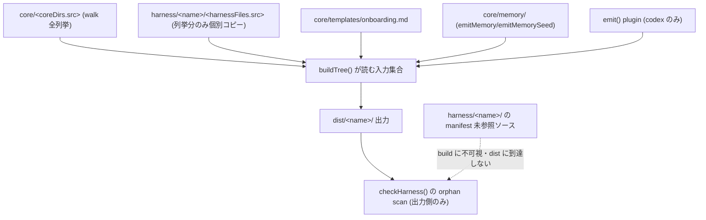
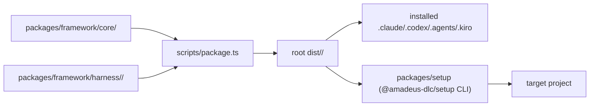
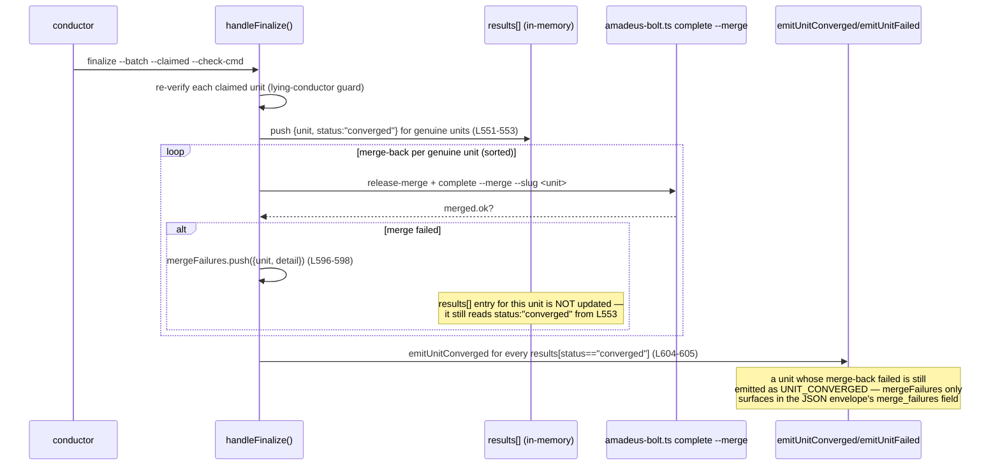
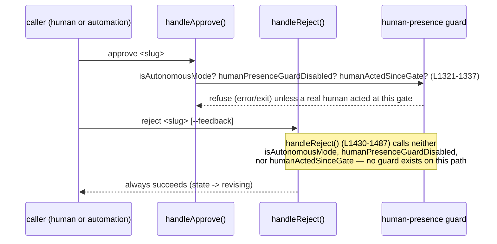
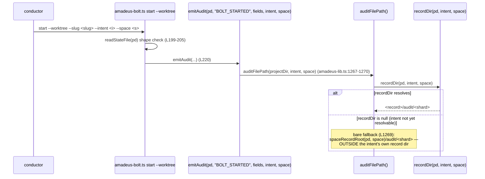
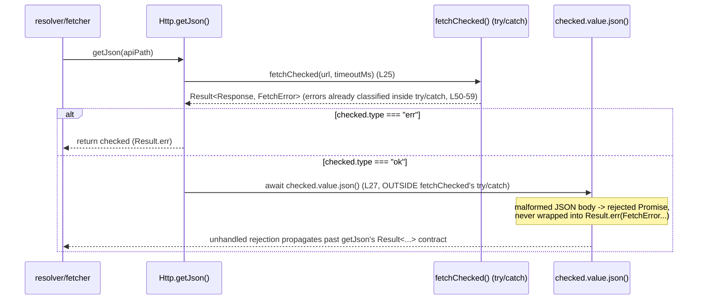
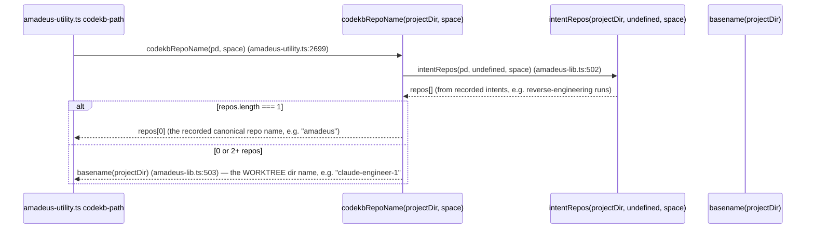

# アーキテクチャ

> **2026-07-11 更新(intent 260711-p3-cleanup-batch8、最新)**: P3 修理7件(#843 / #846 / #850 / #851 / #876 / #877 / #878)を対象とする docs/tools/tests 横断の内部欠陥修理。うち #843/#846/#850/#851 は旧 `.agents/`・`aidlc/` 系譜 → `packages/framework/` 移行境界で復元漏れした restart-loss(差分区間 `9738580ef..60f5e1edf` の**外**)、#876/#877/#878 は区間内で導入・変更された面。構造面の主眼は下記「orchestrate エラー監査経路の部分配線(#879/#878)」節(#879 導入 recordEngineError と default 出口未配線の非対称)。他6件は挙動/docs 欠陥で構造変化を伴わないため code-quality-assessment.md の同名節に接地。
>
> **2026-07-11(intent 260710-core-repair-batch3、履歴)**: バッチ3(#746 / #786 / #742 / #743 / #747 / #741 / #751 / #744 / #749 / #750)を対象とする core/setup/tests 横断の内部欠陥修理。焦点は swarm/bolt の worktreePath read/write 非対称(#746)、learnings emitKey の生 NUL バイト(#786)、setup の err swallow(#742)/ 非アトミック書き込み(#743)/ prerelease 順序無視(#747)、t90 test 13 の wallclock フレーク(#741)、codex adapter のレガシー flat root 参照(#751)、orchestrate の PHASE_NUMBERS prototype-chain(#744)/ single skeleton-gate 詰み(#749)/ Branch 0 除外欠落(#750)。**焦点コードは base→observed(`da1611a9a..58f3453ad`、14コミット)でいずれも無変更**(バッチ D #774/#785/#787/#788/#789 が着地したが焦点面に非関与、全件現存)のため下記はすべて現行コード直読に基づく静的分析。主眼は末尾「core-repair-batch3(2026-07-11)の観測面」節。
>
> **2026-07-10(intent 260710-tools-dispatch-batch、履歴)**: バッチ D(#774 / #785 / #787 / #788 / #789)を対象とする tools ディスパッチ/照合系の内部欠陥修理。焦点は setup version resolver のページング欠落(#774)、runner-gen prune の非対称(#785)、jump execute の direction 非再導出(#787)、graph・runtime の生 object-index dispatch(#788)、state advance の nextSlug 方向盲目(#789)。**焦点5ファイルは base→observed でコード diff 空**(`amadeus-runtime.ts` のみ #781 で改変されたが dispatch site を含む hunk は無し)のため下記はすべて現行コード直読に基づく静的分析。主眼は「tools-dispatch-batch(2026-07-10)の観測面」節。
>
> **2026-07-10(intent 260710-learnings-audit-batch、履歴)**: バッチ C(#754 / #745 / #761)を対象とする §13 learnings 系の内部欠陥修理。焦点は `amadeus-learnings.ts` の persist 判定マトリクス(#754 = cid 衝突で書き込みスキップ + RULE_LEARNED emit、#745 = 複数 destination 同一 cid で二重 emit)と `amadeus-runtime.ts` の per-unit stage learnings 集計の窓(#761)。**両焦点ファイルは base→observed でコード diff 空**(最終変更 `0801d2100`、2026-07-07)のため下記はすべて現行コード直読に基づく静的分析。主眼は末尾「§13 learnings persist 判定マトリクスと audit 整合」「runtime learnings 集計の窓(per-unit)」の2新設節。
>
> **2026-07-10(intent 260710-source-unreferenced-check、履歴)**: packaging の source 側 unreferenced 検査(#735)を対象とした記録。「packaging 入力集合と source 側 unreferenced 検査」節を参照。
>
> **履歴**: 前々 intent 対象の2バグは出荷済み — **#685 delegate-rejection は #729(`14d1146e0`)で解消**(`DELEGATED_REJECTION` イベント + `delegate-rejection` subcommand を追加、verb-scoped presence に分離)、**#670 sibling-worktree guard は #727(`20c2e9674`)で解消**(write パスをメインチェックアウトへアンカーする方式に変更)。以下の「#685」「#670」の相互作用図は**歴史的記録**であり現状コードとは一致しない。

> **2026-07-10 更新(intent 260710-source-unreferenced-check)**: 前回 intent 対象の2バグは出荷済み — **#685 delegate-rejection は #729(`14d1146e0`)で解消**(`DELEGATED_REJECTION` イベント + `delegate-rejection` subcommand を追加、verb-scoped presence に分離)、**#670 sibling-worktree guard は #727(`20c2e9674`)で解消**(write パスをメインチェックアウトへアンカーする方式に変更)。以下の「#685」「#670」の相互作用図は**歴史的記録**であり現状コードとは一致しない。この直下の packaging source 側 unreferenced 検査(#735)節は intent `260710-source-unreferenced-check` の記録(履歴)。最新 intent の記録は本ページ末尾の swarm-worktree-batch 節群(worktree anchor WRITE/READ 非対称 #746 ほか)を参照。

## orchestrate エラー監査経路の部分配線(#879/#878、intent 260711-p3-cleanup-batch8、2026-07-11)

`amadeus-orchestrate.ts` のエラー監査経路は #879(observed HEAD `60f5e1edf`)で導入されたが、CLI ディスパッチの全出口には配線されておらず**部分配線**の状態にある。

- **導入**: `recordEngineError`(定義 `:195`)は `runEngineMain` の try/catch(`:3017`)で捕捉した例外を `ERROR_LOGGED` 監査イベントとして記録する。throw 経由でエンジンを抜ける失敗はこの catch を通り監査される。
- **未配線の出口(#878)**: `main()` の `default:` ブロック(`:2995-3001`)は Unknown subcommand を `console.error` + `process.exit(1)` で処理し、**throw しない**。このため `runEngineMain` の catch を通過せず `recordEngineError` が呼ばれない。不正サブコマンド起動が監査に残らない非対称が残る。
- **構造的含意**: エラー監査を「例外を投げて上位 catch で一元記録する」規約に統一するなら、default 出口も throw 化して `runEngineMain` catch へ流すのが対称。あるいは default 出口で `recordEngineError` を直接呼ぶ2案が候補。いずれも process.exit を経由する早期出口が監査経路をバイパスしうる、という一般パターン(検証劇場でない実 result 由来の監査を全出口で保つ)の一事例。

## ゲート系ツールの正準テンプレートと CI ジョブ構成(intent 260710-complexity-gate、2026-07-10)

複雑度ゲート導入(feature スコープ)の diff-refresh(フォーカス5面: `ci.yml`・`tests/coverage-project-gate.ts`・`gen-coverage-registry.ts`・`biome.json`・`package.json`)で確定した、再利用元アーキテクチャ。base `584262c1a` → observed 現 HEAD。

### `coverage-project-gate.ts` が確立した「ゲート系ツールの正準テンプレート」

`tests/coverage-project-gate.ts`(#762 で新規、236行)は自前の PROJECT カバレッジゲートであり、複雑度ゲートを含む後続のゲート系ツールが踏襲すべき構造の完成形として確立している。5つの設計要素が正準テンプレートを成す:

1. **env seam(呼び出し時解決)**: `AMADEUS_COVERAGE_TOTALS` / `AMADEUS_COVERAGE_PROJECT_BASELINE` を `totalsPath()`/`baselinePath()` が module load 時でなく**呼び出し時**に解決する(:38-54)。in-process テストが単一 import を temp ツリーへ差し向けられる(`gen-coverage-registry.ts` の `AMADEUS_COVERAGE_RATCHET` パターンと同型)。
2. **parse-don't-validate**: `parseTotalsText` が `ParseOutcome`(ok/detail 判別ユニオン)を返し(:83-113)、schemaVersion===1・非負整数・hits<=lines を検査。成功パースが不変条件を証明として運ぶ。
3. **fail-closed 5値 FailReason**: `FailReason = DROP_EXCEEDED|MISSING_CURRENT|MISSING_BASELINE|MALFORMED|EMPTY_POPULATION`(:59-77)。`evaluateGate(current, base)` が上から MISSING_CURRENT → MALFORMED → MISSING_BASELINE → EMPTY_POPULATION → DROP_EXCEEDED の順で fail を返し、ファイル欠落・不正はすべて fail(fail-closed、:132-170)。
4. **BigInt 厳密判定**: `passesThreshold` は除算を排した整数比較で float 丸めを排除(:119-126)。表示専用の `pct()` と分離。
5. **`--check`/`--update` CLI 形**: `main(args)` が `--check`(fail で stderr + exit1)/ `--update`(baseline 再書き込み)のみ受理、他は USAGE + exit2(:175-236)。`evaluateGate`/`main`/`runCheck`/`runUpdate`/型をエクスポートして in-process seam でテスト可能。committed baseline は `tests/.coverage-project-baseline.json`。

複雑度ゲート(lizard CCN の baseline ラチェット)はこのテンプレートを直接踏襲する: committed baseline JSON + env seam + `--check` 単調非減少 + `--update` 更新 + fail-closed 診断。`gen-coverage-registry.ts` のクラス別カウント非減少ラチェット(:1242-1266)も同型で、「CCN 上限を上げさせない」用途に最も近い。

### `.github/workflows/ci.yml` の現行4ジョブ構成(#777/#801 の変更点)

現行 ci.yml(238行)は `check` → `coverage` → `codecov-status` → `ci-success` の4ジョブ DAG。

- **`check`**(typecheck・lint・dist:check・promote:self:check・test:ci): 複雑度ゲートの lizard ステップは lint 直後(typecheck/lint の直後)に置く配置が確定(E-CX1 Q3=A)。トップレベル `permissions: contents:read` のまま完結(外部サービス不要)。
- **`coverage`**: `needs:[check]`、`coverage:ci` → 自前 project ゲート(`coverage-project-gate.ts --check`)→ Codecov upload。
- **#777 の変更点(concurrency)**: `concurrency.group` が `main` は per-SHA グループ(`github.sha`)で誰も cancel されず、PR は ref-keyed で `cancel-in-progress` が main=false/PR=true。
- **#801/#791 の変更点(Codecov flags 削除)**: `coverage` ジョブの Codecov upload から flags が削除された(`use_oidc:true`/`disable_search:true`/`fail_ci_if_error:true` は維持、flags なし)。
- **`ci-success`**: `needs:[check,coverage,codecov-status]`、`require_result` で3ジョブ result が全て success かを検査(実 result 由来、検証劇場でない)。新ステップを既存ジョブ内に置けば集約への追加配線は不要。

## packaging 入力集合と source 側 unreferenced 検査(intent 260710、#735 の中核理解)

`scripts/package.ts` は one-core-many-harnesses の唯一の変換器であり、「build が何を入力として読むか」がここで確定する。#735 が塞ごうとする欠陥は「manifest からどの行にも参照されない authored ソースファイルが、build に不可視のまま(dist へ出荷されないまま)残存しても、既存の検査が何も鳴らない」ことである。



<!-- text fallback: buildTree (scripts/package.ts:307) が build の入力集合を確定する。(1) coreDirs の各 src を walk() で全列挙してコピー(L322-344)、(2) harnessFiles の各 src を「列挙された分だけ」個別コピー(L357-363、ディレクトリ全体は walk しない)、(3) onboarding skeleton をレンダリング(L370-376)、(4) core/memory/ を emitMemory/emitMemorySeed で emit(L382-395)、(5) codex のみ emit() プラグイン(L446-458)。checkHarness (L554) の orphan 検出はすべて「committed dist vs 再ビルド dist」の出力側で働く(harness-dir orphan L574-582、#711 で追加された dist 全域 orphan scan L605-628)。harness ソースは harnessFiles に列挙された src だけがコピーされるため、未列挙のソースファイルは build に一切読まれず dist にも現れず、出力側の orphan scan では検出不能。これが #735 の source 側 unreferenced 検査ギャップ。#737(#719)がこのギャップの実害例: kiro CLI harness に7個の .kiro.hook が manifest 未参照のまま残存していた。 -->

### build 入力集合の確定点(file:line)

| 入力 | 確定点 | 備考 |
| --- | --- | --- |
| core dirs(全列挙) | `buildTree` L322-344 `for (const { src, dst } of m.coreDirs)` → `walk(srcDir)` | core は dir 単位で全ファイル walk |
| harness authored files | `buildTree` L357-363 `for (const { src, dst, projectRoot } of m.harnessFiles)` | **列挙された src のみ**。未列挙ソースは不可視 |
| onboarding | `buildTree` L370-376 | skeleton からレンダリング |
| memory(method tree) | `buildTree` L382-383(`emitMemory`)/ L395(`emitMemorySeed`) | 出力は `<harnessDir>` 外 |
| emit プラグイン出力 | `buildTree` L446-458(codex のみ) | 出力パスを返し `--check` で byte-diff |
| **dist 出力側 orphan scan** | `checkHarness` L574-582(harness-dir)/ L605-628(dist 全域、#711) | source 側は検査対象外 |
| harness の発見 | `discoverHarnessNames` L68-73(`harness/*/manifest.ts` の存在で発見)/ CLI L660 | 1 manifest = 1 harness |

### dist 全域 orphan scan(#711、`37b295598`)

`checkHarness` の orphan scan は #711 で「ハードコードされた `[".agents","amadeus"]` ルート限定」から「`dist/<name>/` 全域 walk」へ拡張された(L605-628)。期待出力集合 = harness-dir subtree(L574-582 の pass で `authoredExempt` 込みで検査)+ 宣言済み projectRoot 出力(`harnessFiles`/`onboarding`)+ emit 出力集合(`committedEmitSet`)。これにより `dist/<name>/` 直下や未宣言サブディレクトリに残った stale ファイル(削除/改名された projectRoot 出力など)を検出できる。ただしこれは**出力側**の検査であり、source 側の未参照は依然として守備範囲外。

### 後続ステージ向け合成ビュー(#735 検査の設計空間)

以下は requirements/design が使う事実整理であり、**設計決定は含まない**(どの案を採るかは後続ステージの仕事)。3つの独立した設計軸がある。

**(a) 参照集合の導出点 — buildTree の実読み込み vs manifest 静的導出**

| 案 | 参照集合の作り方 | build 機構3種の扱い | トレードオフ |
| --- | --- | --- | --- |
| A: `buildTree` が実際に読んだ src を記録 | `buildTree`(L307-460)実行中に「コピー対象として列挙・消費した src」を集合化し、`harness/<name>/` の実ファイル walk との差集合を未参照とする | 記録集合に現れないため別途除外が必要 | build の実挙動と定義上一致。write/check の両経路で走る(下記 (c))。ただし `buildTree` に集合記録の副作用を足す侵襲がある |
| B: manifest から参照集合を静的導出 | `m.harnessFiles[].src` + `m.onboarding` + `emit` 宣言を静的に読み、実ファイル walk との差集合を取る | harnessFiles に無いので静的許可リストか import グラフ追跡で除外 | `buildTree` を触らず独立実装可能。ただし「buildTree が実際に読む集合」と manifest 記述が将来乖離すると検査自体がズレる |

事実(誤検出除外の設計根拠): 3種の build 機構ファイルは **harnessFiles に列挙されない(=dist へ非コピー)が、manifest.ts を起点とする import グラフからは到達可能** — `manifest.ts` は `package.ts` が `require()`(L514)、`onboarding.fills.ts` は各 `manifest.ts` が `import`(例 `harness/claude/manifest.ts:18`)、codex `emit.ts` は `package.ts` の `require()`(L651)+ `harness/codex/manifest.ts:19` の `import`。よって除外は「静的ファイル名許可リスト」でも「manifest.ts からの import グラフ追跡」でも実現でき、これ自体が (a) の派生選択肢になる。

**(b) 誤検出リスクの分類**

| 分類 | 例 | 検査上の位置づけ |
| --- | --- | --- |
| build 機構3種 | `manifest.ts` / `onboarding.fills.ts` / codex `emit.ts` | **正当に未参照**(dist 非コピーだが build が import で読む)。恒久的な除外対象 |
| 将来の authored 追加 | harnessFiles へ配線する前の新規ソース | **真の検出対象**(未配線=#735 が鳴らしたい状態)。ただし実装作業中は一時的偽陽性になりうる |
| harness dir 外の fixture/docs 類 | `harness/<name>/` の外(`tests/` 等) | **対象外**(検査範囲を harness-dir subtree に限れば自然に除外) |

**(c) 検査の発火点**

| 発火点 | 経路 | 特性 |
| --- | --- | --- |
| `checkHarness` 内に追加 | `--check`(= `dist:check`)経由でのみ発火(CLI L658/L673) | 既存 drift guard と同一ゲートに乗る。write 単独時は走らない |
| `buildTree` 内に追加 | write(L544)と check(L561)の両方が `buildTree` を呼ぶため常時発火 | 常に走る。ただし write 経路を検査ロジックで汚す |
| 独立サブコマンド新設 | 例 `package.ts --check-source`(新規) | 関心分離が明確。ただし CI/`package.json` script への配線を別途要する |

<!-- text fallback: #735 の検査には3つの独立設計軸がある。(a) 参照集合の導出点: 案A=buildTree が実際にコピー列挙した src を記録して実ファイル walk と差集合、案B=manifest の harnessFiles/onboarding/emit 宣言を静的に読んで差集合。build 機構3種(manifest.ts/onboarding.fills.ts/codex emit.ts)は harnessFiles 非列挙で dist へコピーされないが manifest.ts 起点の import グラフから到達可能(manifest.ts=package.ts が require L514、onboarding.fills.ts=各 manifest.ts が import、emit.ts=package.ts require L651 + codex manifest import)なので、除外は静的許可リストか import 追跡で実現でき、それ自体が派生選択肢。(b) 誤検出リスク3分類: build 機構3種=恒久除外、将来の未配線 authored ソース=真の検出対象(WIP 中は一時偽陽性)、harness dir 外の fixture/docs=検査範囲を harness-dir subtree に限れば対象外。(c) 発火点: checkHarness 内=dist:check 経由のみ(write では走らない)、buildTree 内=write(L544)/check(L561)両方が呼ぶので常時発火だが write を汚す、独立サブコマンド=関心分離だが CI 配線を別途要する。いずれの軸も設計決定は requirements/design ステージが行う。 -->

## 現在の全体構造

Amadeus は one-core-many-harnesses 型の architecture を維持している。`packages/framework/core/` と `packages/framework/harness/<name>/` が物理 source、`scripts/package.ts` が `dist/<name>/` を生成する。独立配布パッケージ `packages/setup/`(`@amadeus-dlc/setup`)は前々回 intent で完成済み。当該スキャン intent(260709-bug-zero-batch)はこの全体構造を変更せず、内部の6件の欠陥を修理する。以降の一連の bugfix intent(バッチ D 含む)もこの全体構造を変更しない。



<!-- text fallback: packages/framework/{core,harness} が scripts/package.ts に取り込まれ root dist/<name>/ を生成する。dist はこのリポジトリの自己 install(Runtime)と、packages/setup の CLI が第三者プロジェクトへ配布する内容の両方の元になる。 -->

## 相互作用図 — 260709-gate-mechanics(前 intent、履歴)対象2バグの実装経路

## 差分リフレッシュ(260709-packaging-repair-batch、`a1c79dc12..22e3eb5aa`)

全体構造(one-core-many-harnesses、staged layout)は不変。当該 intent(260709-packaging-repair-batch)の2バグ(#701 `scripts/package.ts`、#702 `scripts/release-version-sync.ts`)は上図の `Packager --> Dist` 検査経路(#701)と `release.yml → after:bump → release-version-sync` バージョン同期経路(#702)に属する既存欠陥であり、この差分区間では両正本とも変更されていない。差分区間で観測されたアーキテクチャ関連の変化は以下。

- **コアツール6件(`packages/framework/core/tools/`、全 M)**: `amadeus-audit.ts`・`amadeus-bolt.ts`・`amadeus-lib.ts`・`amadeus-sensor-type-check.ts`・`amadeus-state.ts`・`amadeus-swarm.ts`。前 intent(bug-zero-batch)の修理に加え、(a) delegated-approval provenance の第一級化(human-presence gate 周辺、テスト `t112-delegated-approval`)、(b) `amadeus-sensor-type-check.ts` の tsc launcher 化(テスト `t202-sensor-type-check-tsc-launcher`)、(c) hook の project-dir/worktree marker 解決(テスト `t202-hook-project-dir-worktree-marker`)が反映されている。これらは `Packager --> Dist --> Runtime` 経路を通じて `dist/{claude,codex,kiro,kiro-ide}/` に再生成反映済み。
- **setup src 3件(`packages/setup/src/`、M)**: `ports/http.ts`・`internal/tar-archive-extractor.ts`・`domain/installation.ts`。`Dist --> Setup` とは独立した npm 配布経路(`@amadeus-dlc/setup`)に属し、`dist:check`/`promote:self:check` の対象外。
- **tests/ の hermeticity 再編(PR #703、class-B 14ファイル)+ test-size ドリフトガード新設**(`tests/lib/test-size.ts`、`tests/unit/t-test-size-drift.test.ts`): テスト資産の決定性を守る品質機構の追加であり、production tree のトポロジには影響しない。

## 相互作用図 — 修理対象6バグの実装経路

### #674 amadeus-swarm.ts finalize の merge-back 失敗と results/audit の分離



<!-- text fallback: handleFinalize (amadeus-swarm.ts:484-631) builds `results[]` during the re-verify loop (L531-582), fixing each genuine unit's status to "converged" at L551-553. The merge-back loop (L588-599) runs afterward and only appends to a separate `mergeFailures` array (L596-598) on failure; it never mutates the corresponding `results` entry. The audit-emission loop (L603-610) iterates `results` alone, so a merge failure never demotes a unit to "failed" there, and `emitUnitConverged` (L605) still fires for it. `merge_failures` is exit-code-gated (L630: exit 2 if mergeFailures.length > 0) but the audit trail and per-unit `results` array both misreport the unit as converged. -->

### #675 amadeus-state.ts の approve/reject 非対称な human-presence guard



<!-- text fallback: handleApprove (amadeus-state.ts:1286-1379) gates the [x] transition behind isAutonomousMode(content) / humanPresenceGuardDisabled() / humanActedSinceGate(pd) at L1321-1337, refusing via error() when no real human acted at the gate since it opened. handleReject (amadeus-state.ts:1430-1487) performs validateSlugInState, increments Revision Count, and writes STATE_REVISING without calling any of those three guard functions — confirmed by grep: none of isAutonomousMode/humanPresenceGuardDisabled/humanActedSinceGate appear between L1430 and L1487. Anything (or anyone) that can invoke `amadeus-state.ts reject <slug>` can force a stage back into "revising" state with no human-presence check at all. -->

### #676 amadeus-bolt.ts start --worktree と auditFilePath の bare fallback



<!-- text fallback: amadeus-bolt.ts start (L196-220) validates the state file shape only when --worktree is set (L199-205), then emits BOLT_STARTED via emitAudit(pd, "BOLT_STARTED", fields, flags.intent, flags.space) at L220. emitAudit resolves its write target through auditFilePath (amadeus-lib.ts:1267-1270), which itself calls recordDir(projectDir, intent, space). When recordDir returns null — e.g. the intent named by flags.intent has not yet been created, or resolution is ambiguous — auditFilePath falls back at L1269 to `spaceRecordRoot(projectDir, space)/audit/<shard>`, a location outside any specific intent's record dir. Because intent-scoped readers only glob `<record>/audit/*.md`, a BOLT_STARTED written to the bare space-level fallback is invisible to them. -->

### #677 packages/setup/src/ports/http.ts getJson の json() 未保護



<!-- text fallback: getJson (ports/http.ts:23-28) awaits fetchChecked(url, options.apiTimeoutMs) at L25, which returns a Result already narrowed by its own try/catch (fetchChecked body, L46-59). On the ok branch, getJson immediately does `return Result.ok(await checked.value.json())` at L27 — this second await sits inside getJson's own function body, past fetchChecked's try/catch boundary, and has no try/catch of its own. A 200 response with an invalid JSON body throws inside `.json()`, and that rejection is not caught anywhere in getJson, breaking the Http port's stated contract (`Promise<Result<unknown, FetchError>>`, L10) that every path should resolve to a Result rather than reject. -->

### #678 packages/setup/src/internal/tar-archive-extractor.ts の PAX/GNU longname 状態

```mermaid
sequenceDiagram
  participant Gunzip as gunzip stream (async iterator)
  participant Extract as extractTarGz() outer loop
  participant Drain as drain(final) (closure over carry/pendingLongName/current)
  participant State as pendingLongName / current (module-local closure vars)

  Gunzip->>Extract: chunk 1
  Extract->>Drain: drain(false)
  Drain->>State: parse PAX ('x') or GNU ('L') header, set pendingLongName (L103, L113)
  Note over State: pendingLongName persists across drain() calls<br/>because it is a closure variable, not re-initialised per chunk
  Gunzip->>Extract: chunk 2 (arrives in a LATER for-await iteration)
  Extract->>Drain: drain(false)
  Drain->>State: consume pendingLongName as rawName (L118), reset to null (L119)
  Note over Drain,State: the design relies on carry (Buffer) also spanning chunks (L43: Buffer.concat) —<br/>chunk-boundary loss would only occur if `carry`/`pendingLongName` were re-created per chunk,<br/>which they are not; verification of actual runtime behavior is deferred to code-generation/build-and-test
```

<!-- text fallback: extractTarGz (tar-archive-extractor.ts:33-148) declares `carry`, `pendingLongName`, and `current` (L36-38) OUTSIDE the `for await (const chunk of gunzip)` loop (L41), and `drain()` is an inner function closing over those same three variables. Each incoming chunk is concatenated into `carry` (L43) before drain() runs, and drain() only clears `pendingLongName` once it is actually consumed by a following non-PAX/non-GNU header (L118-119). This means the state that survives a chunk boundary is `carry` and `pendingLongName` together — as coded, they are not reset per chunk. The reported risk (a PAX/GNU header split across two `chunk`s, or a long-name header in one chunk and its associated file-entry header in a later chunk) needs an actual failing-input reproduction to confirm whether the current code handles it correctly or not; this scan confirms the mechanism (module-local closure state, not a per-chunk-local buffer) but does not itself prove a defect. -->

## 相互作用図 — #668 codekb-path の `<repo>` セグメント導出



<!-- text fallback: codekbRepoName (amadeus-lib.ts:501-504) prefers the single recorded repo name from intentRepos, but falls back to `basename(projectDir)` whenever intentRepos returns anything other than exactly one entry — including the very first reverse-engineering run in a fresh worktree, before any repo name has been recorded. In a git worktree checkout, `projectDir`'s basename is the worktree directory name (e.g. `claude-engineer-1`, `claude-engineer-2`), not the underlying repository's name (e.g. `amadeus`). codekb-path (amadeus-utility.ts:2690-2699) calls codekbRepoName directly, so its printed `<repo>` segment — and therefore the codekb output directory this reverse-engineering stage writes to — is worktree-name-derived rather than repo-derived on the fallback path. This scan itself writes to `codekb/claude-engineer-1/`, which is direct, reproduced evidence of the fallback in effect. -->

## 修理時の波及範囲 — core→dist→self-install 同期義務の有無

6件のバグは物理的にどちらの source tree に属するかで、修理後に必須となる同期作業が異なる。冒頭の全体構造図のとおり `FrameworkCore --> Packager --> Dist --> Runtime` という経路と `Dist --> Setup` という経路は別の下流を持つため、修理の「正本」がどちらの側かで波及先が変わる。

| バグ | 正本ファイル | 属する tree | 修理後に必須の同期 |
| --- | --- | --- | --- |
| #674 | `packages/framework/core/tools/amadeus-swarm.ts` | `packages/framework/core/` | `bun scripts/package.ts`(全 harness の `dist/<name>/` 再生成)+ `bun run promote:self`(このリポジトリ自身の `.claude/`/`.codex/`/`.agents/` への反映)を同一コミットに含める(team.md Mandated) |
| #675 | `packages/framework/core/tools/amadeus-state.ts` | 同上 | 同上 |
| #676 | `packages/framework/core/tools/amadeus-bolt.ts` + `amadeus-lib.ts` | 同上 | 同上 |
| #668 | `packages/framework/core/tools/amadeus-lib.ts` + `amadeus-utility.ts` | 同上 | 同上 |
| #677 | `packages/setup/src/ports/http.ts` | `packages/setup/`(独立 npm パッケージ `@amadeus-dlc/setup`) | `dist:check`/`promote:self:check` の対象外。`packages/setup/dist/cli.js` を再ビルドしてから検証する(project.md 是正事項の stale-binary 回避)。バージョンバンプ・npm publish は release.yml の workflow_dispatch 一本のみ(当該 intent の PR ではバージョンに触れない) |
| #678 | `packages/setup/src/internal/tar-archive-extractor.ts` | 同上 | 同上 |

4件(#674/#675/#676/#668)は同じ `packages/framework/core/tools/` 配下に集中しており、`amadeus-lib.ts` を共有部品として跨いでいる(前掲の相互作用図参照)。これらは1つの construction Bolt にまとめて実装した場合、`bun scripts/package.ts` と `bun run promote:self` を4件分ではなく1回のパスで済ませられる — ただし個別 Bolt に分割する場合は、Bolt ごとに dist 再生成・self-install 反映を行わないと、直前の Bolt での修理が dist/self-install に反映されないまま次のバグ修理を評価してしまうリスクがある。

残り2件(#677/#678)は `packages/setup/` という別の配布経路(npm 単独 publish)に属し、`dist:check`/`promote:self:check` の対象ではない。この2件を同じ Bolt に混ぜて「4件の dist 再生成」と「2件の npm ビルド確認」を同時にチェックリスト化すると、どちらか一方の検証コマンドを取り違えて省略するリスクがあるため、Bolt 分割時にこの tree の境界を意識する価値がある(delivery-planning 引き継ぎ事項)。

## 正規化の影響(既存の判断の帰結)

architecture の骨格(one-core-many-harnesses、staged layout)自体は変更しない。修理は各コンポーネント内部の実装の是正であり、architecture decision を新たに要さない。#674 と #675 はいずれも `amadeus-state.ts`/`amadeus-swarm.ts` という同じ「監査/ゲートの正確性」を担うコンポーネント群にまたがる欠陥であり、修理方針を requirements-analysis で揃えて検討する価値がある。

---

## 差分リフレッシュ(`a1c79dc12..162553b99`、15コミット・227ファイル)で反映した構造変化

前回スキャン(bug-zero-batch、observed `a1c79dc12`)以降、当該 intent(integrity-batch)の焦点コードは未着手だが、周辺インフラに次の構造変化が入り、うち codekb 一本化は #707 の前提となる。

### codekb ストアの一本化(#693 の後始末)

`codekb/claude-leader/`(9ファイル)と `codekb/claude-engineer-1/`(9ファイル)が削除(D)され、`codekb/amadeus/` 単一ストアに集約された。`codekbRepoName`(`amadeus-lib.ts:556-565`)が origin remote 由来(`originRepoSlug`)に統一されたため、全 worktree/clone が同一 `codekb/amadeus/` を指す。これにより codekb は「per-worktree に分裂した複数ストア」から「origin リポジトリ単位の単一共有ストア」へ変わった。

この単一化は codekb-path の決定性(#668 修正の狙い)を達成する一方、**並行 intent が別ブランチから同一 `codekb/amadeus/` を書く新しい共有面**を生んだ。#707(単一 `reverse-engineering-timestamp.md` の base/observed 相互上書き)はこの共有面の一貫性欠如として顕在化する。

### テストピラミッド整備(#696 Phase A / #700)

`7da09f0c7` で derived-size classifier + drift guard が入り、`tests/` が 66ファイル規模で更新された。テスト層構造は `tests/run-tests.ts:31` の `Level = "smoke" | "unit" | "integration" | "e2e"` を軸に、`levelFiles`(L577-587)が各 Level ディレクトリ直下を tier discovery する構造。**この discovery が `tests/harness/` を含まないことが #705 の「ランナー管理外」の構造的根拠**(下記位置づけ参照)。

### ランナー計測ライフサイクルと #699 Phase D の結合点(dynamic-test-size intent)

#684 Phase D(#699「継続的動的計測」)が土台にする既存アーキテクチャを、現行 HEAD(`24197d755`)の実コードから確定した。テストサイズは3層構造で扱われている:

1. **静的分類層**(`tests/lib/test-size.ts`): `classifyTestSize(source)` が spawn/fs/net/timer API 参照を検出して `SizeClassification { size; signals }`(`:42-45`)を返す Phase A の静的プロキシ。**出力形状は後方安定契約**(`:10-14` が「Phase D layers dynamic observation on top; output shape stays stable」と明言)であり、#699 の動的観測はこの形状を壊さず"重ねる"。
2. **per-file 実行・計測層**(`tests/run-tests.ts`): 1ファイル=1子プロセス(`runBunTestFile` `:685-797`)で `Date.now()` 差分(`:724`/`:762`)と JUnit root `time`(`bun-junit-to-meta.ts:182`、bun 1.2.22 で唯一実 wall-clock を持つ属性)を計測し `.meta`(6行、DURATION フィールド有り)へ書く。**ただし `aggregateTierResults` `:430` が集約後に全 `.meta` を `rmSync` 削除し、非 verbose では `logDir` 一時ディレクトリごと消える** → duration の永続化経路が現状不在。これが #699 が新規永続化を要する構造的理由。
3. **静的レポート層**(`printSizeMatrix` `:895-948`): ディスク走査 → `classifyTestSize` の scope×size マトリクスを出力。**duration 非消費**・`try/catch` で exit-code から隔離(`:882-886`)= t112 の「exit == failed-FILE 数」不変条件を守る。#699 の動的計測を SUMMARY に足す際も同じ隔離が必須。

**アーキテクチャ制約**: run-tests.ts が新たに static import するモジュールは t112(`t112.serial.test.ts:91-94`、`REAL_SIZE` `:52` パターン)の scratch runner copy リストへ伝播必須。coverage registry(`gen-coverage-registry.ts`)は `covers:` join 軸で size/duration と直交するため、#699 のレジストリ化は既存機構への相乗りではなく別アーティファクト新設が現実的。CI は `ubuntu-latest`(`ci.yml:22`)確定で coverage artifact upload(`:75-84`)は既存だが size/duration 専用 artifact は未設置。詳細な file:line は code-quality-assessment.md「dynamic-test-size(intent、履歴)の観測面」節を参照。

### class-B テストの standalone-green 化(#698 / #703)

`611dd1ef8` で class-B テストが standalone で緑になるよう整備された。#705 の `tests/harness/sdk-drive.calibration.test.ts` はこの整備対象と隣接するが、依然として tier discovery の外に置かれている。

## 委任 presence 機構の verb-scoped 構造(#685 実装後 / delegate-answer-consume intent)

差分区間 `24197d755..5e9040cda` の実体は #685(verb-scoped provenance + `DELEGATED_REJECTION`)であり、委任 presence 機構が verb スコープ化された現状構造を現行 HEAD(`5e9040cda`)の実コードから確定した。委任経路は「発行側(リーダー ledger 検査)」と「消費側(conductor gate 判定)」の2面を持ち、両者が共通の `humanActedSinceGate` 述語を使う:

1. **境界述語**(`amadeus-lib.ts` `humanActedSinceGate`、`:1507-1546`): resolution 境界集合 `GATE_RESOLUTION_EVENTS = {GATE_APPROVED, GATE_REJECTED, QUESTION_ANSWERED}`(`:1506`)と human 行為(`HUMAN_TURN` および検証済み委任)を時系列比較し `lastHuman > lastResolution` を返す。委任は verb でスコープされ、`DELEGATED_APPROVAL` は approve verb・`DELEGATED_REJECTION` は reject verb のときだけ `verifyDelegatedProvenance`(`:1585-1611`、両 verb 共用の grounding 真正性検証子)で human として数える(`:1519-1524`)。**verb スコープは委任 type にのみ効き、QUESTION_ANSWERED には直交する**。
2. **消費側(conductor gate)**: `assertHumanPresentForGateResolution`(`amadeus-state.ts:1446-1471`)が approve/reject 双方から呼ばれ、**verb を forward**(`:1456` `humanActedSinceGate(pd, verb)`)。DELEGATED_APPROVAL は approve gate のみ、DELEGATED_REJECTION は reject gate のみを開ける(#685 で approve/reject のドリフト解消)。
3. **発行側(リーダー ledger)**: `handleDelegateApproval`(`amadeus-state.ts:1607-1689`)と `handleDelegateRejection`(`:1701-`)がミラー構造で、issuer 座標(space/intent/shard + 最新 HUMAN_TURN の timestamp)を組んで TARGET intent の audit dir へ委任イベントを append する。両者の grounding gate は **verb 無し** `humanActedSinceGate(pd)`(`:1625` / `:1719`)でリーダー自身の ledger を検査する。

**アーキテクチャ上の非対称**: 消費側(2)は verb-scoped だが発行側(3)は verb 無し。この非対称と QUESTION_ANSWERED の resolution 境界性(1)が交差する点が #736 の機構 — 発行側の verb 無し検査が interview 応答の QUESTION_ANSWERED に先食いされる。詳細な file:line と修理方向は code-quality-assessment.md「delegate-answer-consume intent(260710、#736)の観測面」節を参照。audit event の正本レジストリは `packages/framework/core/knowledge/amadeus-shared/audit-format.md`(DELEGATED_APPROVAL `:78` / DELEGATED_REJECTION `:79`)、`t28-audit-event-sync` が2ファイル間 taxonomy sync を強制する。

## 機械注入ターン分類カタログの非共有(#755 / mint-presence-vectors intent)

human-presence 判定に関わる「機械注入ターンの分類」ロジックは 2 箇所に分散し、注入シグネチャのカタログが共有されていない構造事実がある(現行 HEAD `fc5a34cf1` 直読で確定):

- **mint hook**(`amadeus-mint-presence.ts` `isMachineInjectedTurn` `:51-66`): `prompt.startsWith("<task-notification>")`(prefix `:47`、判定 `:62`)の**単一プレフィックス**のみを抑止シグネチャに持つ。teammate-message(`Another Claude session sent a message:` 開頭、形式 D)は一致せず素通りして `HUMAN_TURN` を鋳造する。
- **stop.ts tier-3**(`amadeus-stop.ts` `transcriptIsConversational` `:581-737`): 除外ヘルパ `isInjectedHookFeedback`(`:568-`)は `"Stop hook feedback:"` の自己注入のみを弾き、注入 marker チェックを**一切持たない**。形式 A(task-notification)・D(teammate-message)の双方を「genuine human prompt」に採用する(`:721-728`)。

両者は「注入ターンを人間ターンと誤認する」同根の欠陥で、抑止カタログ(最低でも task-notification と teammate-message)を共有する単一ソースが存在しない。mint 側が消費される gate 経路(`humanActedSinceGate` `:1544` → `assertHumanPresentForGateResolution` `amadeus-state.ts:1456`、および #671 委任 provenance grounding `:1645`)への波及を含む詳細な file:line と修理方向は code-quality-assessment.md「mint-presence-vectors の観測面(前 intent、履歴)」節を参照。

## 4バグ焦点領域のアーキテクチャ上の位置づけ

| バグ | 焦点領域(アーキテクチャ層) | 正本ファイル | 前提機構 |
| --- | --- | --- | --- |
| #708 | **presence 機構**(hook → audit → gate 判定) | `packages/framework/core/hooks/amadeus-mint-presence.ts`(mint)+ `amadeus-lib.ts` `humanActedSinceGate`/`verifyDelegatedApproval`(gate) | #671 delegate provenance(`1289608c6`) |
| #707 | **codekb 永続化**(単一共有ストアの並行書き込み) | `.claude/amadeus-common/stages/inception/reverse-engineering.md` + `amadeus-lib.ts` `codekbRepoName` | #693 origin 由来 repo 名(`909e590d4`) |
| #705 | **テストハーネス**(tier discovery / substrate skip / trust anchor) | `tests/harness/sdk-drive.calibration.test.ts` + `tests/run-tests.ts` + `amadeus-utility.ts`(doctor) | #696/#700 pyramid 整備 |
| #706 | **knowledge 配布**(agent ロードパスと tree 外参照) | `packages/framework/core/knowledge/amadeus-delivery-agent/workflow-planning-guide.md` | core→dist→self-install 伝播 |

#708 と #705 は「検証機構の正しさ」(偽陽性ゲート / trust anchor drift)、#707 と #706 は「共有ストア/参照の一貫性」に分類できる。詳細な file:line と修理方向は code-quality-assessment.md「既知の欠陥 — integrity-batch(intent 260709-integrity-batch、履歴)」節を参照。

## §13 learnings persist 判定マトリクスと audit 整合(intent 260710-learnings-audit-batch、#754 / #745)

`amadeus-learnings.ts` の `handlePersist`(`:411-608`)は §13 learnings ritual の決定論的 WRITER で、`withAuditLock` の**単一ボディ内**(`:429-577`)で「method file への practice 行追記」と「RULE_LEARNED audit 行の emit」を行う。#754 と #745 は**この同じ dedup 判定マトリクスの2つの穴**であり、共通根は「重複判定の入力が実装の書き込みと乖離している」ことにある。

### dedup 判定の2入力(実データフロー)

selection ごとに2つの真偽値で書き込み/emit を決める(`:474-504`):

- **`hasRow`** = `priorAuditRow(auditContent, "RULE_LEARNED", stageSlug, sel.candidate_id)`(`:474`)。`auditContent` は**ロック取得直後に1回だけ読んだ静的スナップショット**(`:431`)。`priorAuditRow`(`:348-358`)は audit 行を `(Stage, Candidate-ID)` の2フィールドのみで照合し、**Destination(scope / heading)は見ない**。ループ内の `appendAuditEntryUnlocked`(`:492`)がディスクへ行を書いても、この `auditContent` スナップショットは**再読込されない**。
- **`hasLine`** = `content.includes(marker)`(`:475`)。`marker` = `cidMarker(stageSlug, candidate_id)` = `<!-- cid:<slug>:<cid> -->`(`:407-409`)。`content` は宛先 method file ごとに `ensureFile` が返す**その file の累積内容**(`fileContent` Map、`:449-461`)。同一 file への先行 selection の書き込みは反映されるが、**別 file への書き込みは反映されない**。

### 真理値表(1 selection あたり、`:478-504`)

| `hasRow`(静的 snapshot) | `hasLine`(file 累積) | 実行される動作 | 整合性 |
| --- | --- | --- | --- |
| T | T | no-op(`continue`、`:478`) | ✅ 正 |
| T | F | 行のみ書き込み(recovery: 行欠落を補完)、emit なし | ✅ 正 |
| F | F | 行書き込み + RULE_LEARNED emit(fresh) | ✅ 正 |
| **F** | **T** | **行書き込みスキップ(`if (!hasLine)` `:483`)+ RULE_LEARNED emit(`if (!hasRow)` `:491`)** | ❌ **#754 の穴** — audit 行のみ増え、対応する新規 practice 行がない(row/line 不一致) |

### #754 の穴(同一 file・cid 衝突 → 書き込みスキップ + emit)

同一 persist 呼び出し内で**同じ `candidate_id` かつ同じ scope(= 同じ method file)**を持つ2 selection、または既存の practice 行と cid が衝突する selection では、2番目の `hasLine=T`(marker が既にその file に存在)で行書き込みが `if (!hasLine)` によりスキップされる一方、`hasRow` は静的スナップショット由来で `F` のままなので **RULE_LEARNED を emit する**。結果、cid が指すテキストは最初の1行しか残らないのに audit 行だけが増える(#754「cid 衝突で書き込みスキップ + RULE_LEARNED emit」)。

### #745 の穴(別 file・同一 cid → 二重 emit)

同一 cid を**異なる scope(project と team = 別 file)**へ振り分けた2 selection では:

1. Selection A(`scope=project`): `hasRow=F`(snapshot)、`hasLine=F`(project file に marker なし)→ project へ行書き込み + emit。`auditContent` は更新されない。
2. Selection B(`scope=team`、同一 cid): `hasRow=F`(snapshot は依然 A の emit を見ない)、`hasLine=F`(team file は別 file で A の marker を持たない)→ team へ行書き込み + **再び emit**。

同一 `(Stage, Candidate-ID)` に対し RULE_LEARNED が**2行** emit される(#745「複数 destination への同一 cid で二重 emit」)。`hasLine` は per-file なので cross-file の cid 再利用を捕捉できず、静的スナップショットも同一ループ内の先行 emit を捕捉できないため、両盲点が重なる。

**共通根**: `auditContent` が `:431` の静的スナップショットのまま(in-loop emit で更新されない)+ `priorAuditRow` が Destination を無視する + `hasLine` が per-file。フラッシュは全 selection 処理後に file ごと1回 `writeFileAtomic`(`:508-511`)。要求で凍結すべき不変条件は「1 (Stage, Candidate-ID) につき RULE_LEARNED は最大1行、かつ audit 行があれば必ず対応する practice 行が存在する」。

### テスト面(現状カバレッジと欠落)

- `tests/integration/t99-learnings-gate-flow.test.ts`: surface→persist ラウンドトリップを実 CLI で駆動。Case 1 は project + team の**異なる cid**(`cid:user-stories:c1` / `c2`)で2 RULE_LEARNED を pin(`:294-323`)、Case 5 は**逐次 concurrent persist が直列化して1行1行**(同一 selection の再実行)を pin。**同一 cid を複数 destination へ振る #745 / cid 衝突 #754 の経路は未カバー**。
- `tests/unit/t112-learnings-distribution-guard.test.ts`: sensor manifest の framework-distribution guard のみ(`isFrameworkDistributionPath`)。learnings dedup 判定は非対象。

## runtime learnings 集計の窓(per-unit、intent 260710-learnings-audit-batch、#761)

`amadeus-runtime.ts` の `learnings_captured` は compile が runtime-graph.json に materialise し、summary(session-cost / replay / outcomes-pack)が集計消費する(`:974-976`)。#761 は **per-unit(instance-bearing)construction stage の `learnings_captured` が常に `{0,0}` になる**欠陥で、根は集計窓の終端時刻の取得経路にある。

### 親 stage `completed_at` の3段データフロー(実測)

1. **rollup**(`:364-386`): stage 行を作り `completed_at = entry.completed_at`(`pairStartedCompleted` が返す親 slug の **STAGE_COMPLETED タイムスタンプ**)。`learnings_captured` は `approved ? {0,0} : null`(`:382-385`)。
2. **BoltInstance populator**(`:461-560`): construction phase かつ window 内に STATE_FORKED の distinct slug が **≥2** ある stage で、親行の `started_at` / **`completed_at` を `null` に上書き**(`:550-551`)。`learnings_captured` は `parentOutcome !== "approved"` のときだけ null 化(`:556-558`)、approved のときは `{0,0}` のまま残る。**この時点で親の STAGE_COMPLETED 時刻は行から失われ、`RuntimeStage` スキーマ上どこにも保存されない**(`:83-105` のスキーマに保持フィールドなし)。
3. **sensor_firings + learnings populator**(`:702-755`):
   - **instance-bearing 分岐**(`:703-739`): `parentStart` = 最早 instance の `started_at`、`parentEnd` = 最遅 instance の `completed_at`(全 open なら null)を**sensor_firings 用にのみ**算出(`:717-738`)。`learnings_captured` は **`countLearnings` で再計算されず**、「rollup が残したまま」= approved 親では `{0,0}` 固定(`:739` のコメントが明示)。→ **per-unit stage は実際に RULE_LEARNED 行があっても learnings を数えない(#761)**。
   - **single-instance 分岐**(`:740-753`): approved なら `learnings_captured = countLearnings(slug, started_at, completed_at)`(`:747-752`)。窓 = `[started_at, completed_at)`(`completed_at` = STAGE_COMPLETED)。

### `countLearnings` の窓境界(`:684-700`)

`ev.timestamp < windowStart` を除外(`:692`)、`windowEnd !== null && ev.timestamp >= windowEnd` を除外(`:693`)。すなわち**窓終端は半開区間の上限**で、`windowEnd` に該当時刻以降の RULE_LEARNED は集計から落ちる。

### e6 レビュー訂正の妥当性(親 STAGE_COMPLETED or null が正、parentEnd は誤り)

per-unit stage の §13 learnings ritual は**親 stage の承認ゲート**(全 Bolt マージ後、親 slug に STAGE_COMPLETED が付く時点)で走り、RULE_LEARNED 行は `Stage=<親 slug>` で **STAGE_COMPLETED 近傍**にタイムスタンプされる。これは最後の STATE_MERGED(= `parentEnd`)より**後**。よって窓終端を `parentEnd`(instance 由来)にすると、ゲート承認時に emit された RULE_LEARNED が `ev.timestamp >= windowEnd` で**全て除外**され、集計は 0 のまま是正されない。したがって e6 訂正のとおり**窓終端は親 stage の STAGE_COMPLETED 時刻(まだ mid-flight なら null = open)**が正しい。

**実装上の含意(要求へ引き継ぐ)**: 正しい窓終端(親 STAGE_COMPLETED)は現状 `:551` で `null` 上書きされ**行に残らない**。`maxInstanceCompletedAt`(`:1034-1043`、summarize が `:978` で使用)は instances の `completed_at` 最大値を返す = **parentEnd と同じく instance 由来**(開区間の扱いだけ差がある — parentEnd は `anyOpen` で null、maxInstanceCompletedAt は open を無視して最大値を返す)。どちらもゲート承認時刻ではなく instance 完了時刻なので、e6 が誤りと断じたソースと同型であり、#761 修理でこれを窓終端に流用してはならない。親 STAGE_COMPLETED は現状 `pairStartedCompleted` の `entry.completed_at`(`slugsByStartTime`)にのみ存在し、null 上書き前に別途保持するか行スキーマに保存フィールドを足す必要がある。

## 修理の設計空間(要求へ引き継ぐ・事実ベース、決定は requirements/選挙で行う)

> 本節は Architect 合成の観測事実のみ。**どの案を採るかは決めない** — 各軸の選択肢・トレードオフ・実測制約を列挙し、requirements の選挙質問の種を確定するためのもの。

### 軸1 — #754/#745: 同一実行内の emit 追跡(`hasRow` の盲点の閉じ方)

共通根は「`auditContent` が `:431` の静的スナップショットのまま in-loop emit を見ない」+「`priorAuditRow` が Destination を無視」+「`hasLine` が per-file」。追跡方式の観測される選択肢は2系統:

- **(A-1) in-memory Set で実行内 emit を追跡** — ループ手前で `emittedThisRun = new Set<string>()` を用意し、emit 時に dedup キーを add、判定を `hasRow || emittedThisRun.has(key)` に拡張する。コスト事実: Set 参照は O(1)、ロック保持時間への追加負荷は無視可能。`withAuditLock` は既に**単一ボディ**(`:429-577`)なので実行内 emit は必ず同一ロック内で観測でき、追加の再読込 I/O は発生しない。
- **(A-2) 各 selection の後に `auditContent` を再読込** — `appendAuditEntryUnlocked`(`:492`)の直後に `readAllAuditShards`(`amadeus-lib.ts:1763`)を呼び直してスナップショットを更新する。コスト事実: `readAllAuditShards` は**全 per-clone シャードを毎回 `readFileSync`** する(`:1767-1773`)ため、selection 数 × シャード数の再読込を**ロック内**で行う。共通ケースはシャード1枚だが、監査肥大時はロック保持時間が selection 数に比例して伸びる。A-1 と同じ整合を得るのに I/O コストだけ高い。

いずれの方式でも「dedup キーに何を含めるか」は軸2で決まる(Set のキー / 再読込後の照合キーが同一問題)。

### 軸2 — dedup キーへの Destination 組込みの意味論(cid の粒度)

現行キーは `(Stage, Candidate-ID)` の2フィールドのみ(`priorAuditRow` `:355-357`、Destination 非参照)。**「1学習 = 1 cid」か「1学習 × 宛先 = 1行」か**は、live method ファイルの cid 運用実態から観察できる:

- **観測: live corpus では 1 cid marker = 1 method file = 1 行**。`org.md` に marker 0、`team.md` に 51、`project.md` に 26。**同一 cid marker が2つの異なる method ファイルに現れる例は皆無**(cross-file 重複 grep = 0)。同一ファイル内の marker 重複も皆無(`team.md` の見かけ上の `cid:code-generation:c2` 2件は、片方が別ルール本文中の**散文クロス参照** `(cid:code-generation:c2)` であり marker ではない)。
- **観測: 汎用連番 cid(`c1`/`c6` 等)は intent をまたいで再利用される**が、`priorAuditRow` が読む `readAllAuditShards` は **active-intent の record 配下のシャードのみ**(`auditShards(projectDir, intent, space)` `:1764`)を対象とするため、cid の一意性スコープは**アクティブ intent の record 単位**。よって過去 intent での `requirements-analysis:c1` 再利用は現行判定に衝突しない。
- **発火証跡の実測(結論: 静的経路のみ確定、実発火は非確定)**: 全 intent record の RULE_LEARNED 68 行を走査。#745 のシグネチャ(単一 persist 呼び出しで同一 (Stage,Candidate-ID) を2宛先へ二重 emit)は**検出されず** — 見つかった (Stage,cid) 重複ペア(`requirements-analysis:c1`、`code-generation:c6`)はいずれも**別 record・別 clone**(engineer-2 / installer-distribution / engineer-3 の team.md・project.md)由来の正規な再利用で、単一呼び出しの二重 emit ではない。#754 のシグネチャ(audit 行に対応する marker が Destination file に不在)の走査は**確定判定不能** — audit の Destination は**他 clone の record 絶対パス**(claude-leader 等)を指し、かつ 2026-07-09 のノルム整理が live marker を audit と独立に書き換えているため、cross-record の marker 照合は本バグ由来の欠落と手動整理由来の乖離を区別できない。したがって「アクティブ intent の record 単位」では #745/#754 の実発火は**未確認**であり、修理の根拠は**静的コード経路**(真理値表の `F×T` セル、cross-file `hasLine` 盲点)に置く。
- **含意(決定せず提示)**: 「1学習 = 1 cid」を不変条件とするなら dedup キーは現行の `(Stage, Candidate-ID)` のままでよく、#745 の cross-file 二重 emit は**「同一 cid を2宛先へ振ること自体を禁止/是正」**する方向になる。「1学習 × 宛先 = 1行」を許すなら dedup キーに Destination(scope/heading)を**加える**方向になり、`priorAuditRow` と `hasLine` の両方を宛先込みキーへ揃える必要がある。両者は #745 の望ましい振る舞い(1宛先へ畳むのか、複数宛先を正規に許すのか)を分岐させる。

### 軸3 — #754 衝突時の挙動(cid 衝突で `hasLine=T` ∧ `hasRow=F` に至った場合)

真理値表の `F×T` セル(`:354`)に落ちたとき、現状は「行スキップ + emit」で row/line 不一致を作る。是正方向の選択肢(観測されるもの、決定せず):

- **(C-1) エラー化** — 同一 record 内で同一 cid が別テキスト/別宛先に衝突したら persist を fail させ、orchestrator に cid の振り直しを要求する。`handlePersist` は既に fail 経路(`:585` 系)を持つ。
- **(C-2) 一意 cid 強制** — 衝突検知時に cid を自動サフィックスして一意化し、行と audit を新規 cid で揃える。live の doubled-slug 形(`cid:code-generation:code-generation:bolt-pr-taskization`)が示すとおり cid 文字列は任意長セグメントを許容するため、サフィックス付与はフォーマット上可能。
- **(C-3) emit を書込に従属させる** — emit 条件を `!hasRow` から **「今回この行を実際に書いた場合のみ」**(= `wrote && !hasRow`)へ変更し、`hasLine=T` でスキップした selection は emit しない。row/line 不一致は原理的に消えるが、「既存行に対応する audit 行が欠落しているケースの recovery」(現行の `T×F` セル `:352`)との相互作用を要求で確認する必要がある。

3案は「衝突を異常として弾く(C-1)/一意化して両方残す(C-2)/emit を書込に一致させる(C-3)」で不変条件の表現が異なる。凍結すべき不変条件は共通: **「1 (record, Stage, Candidate-ID) につき RULE_LEARNED は最大1行、かつ audit 行があれば必ず対応する practice 行が存在する」**。

### 軸4 — #761: 親 STAGE_COMPLETED の保持方法とスキーマ波及

窓終端(親 STAGE_COMPLETED)を instance-bearing 分岐に届ける手段の選択肢:

- **(D-1) null 上書き前にローカル変数へ退避** — `:551` の `stage.completed_at = null` の**前**に親の `entry.completed_at` を別変数(またはローカル Map)へ退避し、`:702-739` の instance-bearing 分岐で `countLearnings(slug, parentStart?, savedParentCompletedAt)` に渡す。**`RuntimeStage` スキーマ不変** → **docs への波及なし**。窓始端をどう採るか(親 started_at も `:550` で null 化済み)は別途要確認だが、`countLearnings` の窓始端は「その stage 最初の instance start」= `parentStart`(`:717-719`)で足りる(§13 emit は STAGE_COMPLETED 近傍なので始端の緩さは無害)。
- **(D-2) `RuntimeStage` にフィールド追加** — 例 `parent_completed_at: string | null` を足して `:375` で設定・`:551` で温存し、populator と summarize が読む。**スキーマ変更は `docs/reference/13-runtime-graph.md` と `13-runtime-graph.ja.md` の `interface RuntimeStage` 定義(英 `:55-74` / ja `:39-58`)へ波及する**(両ファイルがスキーマをフィールド単位で pin している — 実測確認済み)。runtime-graph.json はバイト等価性契約(doc `:144` 系)を持つため、フィールド追加は既存スナップショットの再 compile 差分も生む。

**付随観測(doc 約束との齟齬)**: 現行 doc は `learnings_captured` を「null on pending rows; **populated on transition to approved**」と記す(英 `:70` / ja `:54`)。しかし instance-bearing の**approved 親**は `{0,0}` に固定される(#761)ため、doc の約束と実挙動が既に乖離している。#761 修理が「approved 親でも実カウントする」挙動を回復するなら doc 文言は追随可能だが、D-1/D-2 いずれを採っても**この doc 記述の正誤は要確認**(修理で真になる/ならないが分岐)。

### テスト面の引き継ぎ(#761 の t99 ギャップ)

`t99-learnings-gate-flow.test.ts` は #745(同一 cid × 複数宛先)/#754(cid 衝突)/#761(instance-bearing 親の learnings カウント)の3経路をいずれも未カバー(前掲「テスト面」節 + `:294-323`/Case 5)。#761 は integration では BoltInstance を持つ construction stage の runtime-graph populate を要するため、t99 の CLI ラウンドトリップだけでは届かず、`amadeus-runtime.ts` の compile populator に対する unit 級テスト(instance-bearing 分岐で approved 親が実 RULE_LEARNED をカウントすること、窓終端が STAGE_COMPLETED 近傍の emit を取りこぼさないこと)が要求で必要になる。

## tools-dispatch-batch(2026-07-10)の観測面 — caller 供給パラメータの照合欠落と dispatch/prune の非対称(#774 / #785 / #787 / #788 / #789)

現行 HEAD で確定(焦点5ファイルは base→observed でコード diff 空。詳細な file:line 一次記録は intent `260710-tools-dispatch-batch`(2026-07-10)の `inception/reverse-engineering/scan-notes.md`)。バッチ D の5欠陥は「caller が供給した遷移/ディスパッチ/ページング境界のパラメータを、enum・SKIP・存在チェックのみで受理し、index・方向・prototype-own・全件走査の照合をしない」という共通クラスに整理でき、いずれも導出版(権威経路)が併存するのに実際の経路がそれを迂回する非対称として現れる。

### (a) caller 供給遷移パラメータの照合欠落 — #787(jump direction)/ #789(state advance nextSlug)

`amadeus-jump.ts` の `handleExecute`(`:220-`)は `direction = flags.direction`(`:228`)を **enum メンバーシップのみ**(`:229-235`、`forward`/`backward`/`redo` 以外を弾く)で受理し、target と current の **index 関係を再検証しない**。同ハンドラ内で scope 側は `findStageBySlug`(`:250`)+ `effectiveAction === "SKIP"` 拒否(`:256`)で再検証しており、**scope は再検証するのに direction は再導出しない非対称**が生じている(コメント `:253-255` は "mirrors resolve" と主張するが direction 面は mirror していない)。対照的に `handleResolve`(`:173-180`)は direction を index から導出(`targetIdx > currentIdx → forward` / `< → backward` / `=== → redo`、`:177-180`)= 権威経路。orchestrator が resolve を迂回して `--target <過去stage> --direction forward` を渡すと、実際は後退なのに前進の skip 副作用(`:289-297` の in-flight `[S]` 化・`:301-311` の current skip)が走る。

`amadeus-state.ts` の advance ハンドラは同型で、2 引数 `nextSlug = positional[1]`(`:1006-1007`)を **`nextAction === "SKIP"` の拒否のみ**(`:1010-1018`)で受理し、forward 隣接性・index 関係を検証しない。引数省略時は `nextInScopeStage(...)`(`:1019-1028`)で導出する権威経路が併存する。さらに `crossesPhaseBoundary = completedStage.phase !== nextStage.phase`(`:1077`)は **方向(前進/後退)を見ない**単なる phase 不一致判定で、真だと `PHASE_COMPLETED`/`PHASE_VERIFIED`/`PHASE_STARTED`(`:1103-1126`)を emit する。caller が別 phase(たとえ前 phase)の nextSlug を渡すと、後退/横断でも**前進の phase 完了として phase 境界イベントを鋳造**する。#787 と #789 は resolve / 単一引数 advance という導出版を持つ点まで含めて同型。

### (b) CLI dispatch の prototype-chain lookup — #788(graph / runtime、全 tools 中2サイトのみ)

`amadeus-graph.ts` の `COMMANDS: Record<string, Handler>`(`:1670`、プレーンオブジェクト)を `const handler = COMMANDS[cmd]`(`:1901`、`cmd` はユーザー供給の生文字列)で引くブラケット index は **prototype chain を辿る**。`cmd === "constructor"` / `"toString"` / `"hasOwnProperty"` 等で Object.prototype のメンバー(truthy な関数)が返り、`if (!handler)` ガード(`:1902`)を通過して `await handler(args)`(`:1910`)で非ハンドラ関数を呼ぶ。`amadeus-runtime.ts` の `SUBCOMMANDS`(`:1412`)を `SUBCOMMANDS[cmd]`(`:1453`)で引く経路も同型(`:1454` ガード → `:1459` 呼び出し)。**この生 object-index dispatch は全 tools 中この2サイトのみ**で、他ツール(`amadeus-jump.ts:71`・`amadeus-state.ts:228`/`:2406`・`amadeus-orchestrate.ts:2869`・`amadeus-swarm.ts:694`・`amadeus-runner-gen.ts:565`)はすべて **switch 方式**(prototype 汚染に無縁)。防御手法の候補は `Object.hasOwn(COMMANDS, cmd)` / `Object.create(null)` マップ / switch 化で、いずれも現状未適用。なお同型の `PHASE_NUMBERS[…]` 生 index が `amadeus-orchestrate.ts:2194`・`amadeus-jump.ts:148`・`amadeus-state.ts:2481` に実在するが、これは #744 として既知でバッチ D スコープ外。

### (c) runner-gen write/check の走査源非対称 — #785(prune=graph 現存限定 vs check=FS 走査)

`amadeus-runner-gen.ts` の `handleWrite`(`:279-302`)末尾の prune ループ(`:295-300`)は `loadGraph()` の**現存ノードのみを走査**し、非 runnable(init 系)ノードの stale dir は消せるが、**graph から完全に消えたステージ(loadGraph に含まれない slug)の orphan runner dir は反復対象にすら入らず write では永久に到達不能**。一方 `handleCheck`(`:343-365`)は `onDiskRunnerSlugs()`(`:324-336`、`--single` 署名を持つ dir を FS 走査で収集)を `compiledSet` と突き合わせ `orphans = onDisk − compiledSet`(`:349`)を**正しく検出**し flag する(`:361`)。その修復案内(`:363`)は `... amadeus-runner-gen.ts write` を指すが、その write は上記 prune 制約で当該 orphan を消せない → **ドリフトガードが赤のまま解消できない詰み**。走査源(prune=graph 現存 / orphan 定義=FS 実在 − compiled)の非対称が核。

### (d) setup version resolver のページネーション欠落と BR-F09 の設計緊張 — #774

`packages/setup/src/modules/resolver.ts` は `RELEASES_PATH`/`TAGS_PATH`(`:13-14`)に **`?per_page=…` クエリを持たず**、GitHub API 既定ページサイズ(releases/tags とも30件)で最初の1ページしか取得しない。`fetchNames()`(`:22-37`)は `http.getJson(apiPath)` を**1回だけ**呼び、戻り配列を filter/map するのみで **Link ヘッダ追従・ページ番号ループが一切ない**。`resolveVersion()`(`:57-79`)は `exact`(`:59-64`、tags の31件目以降にある狙った版を notFound で誤失敗)・`latest`(`:66-77`、最新安定版がページ1の外だと取りこぼす)とも単一ページ制約を継承する。ポート側 `packages/setup/src/ports/http.ts` の `Http` 型(`:9-12`)は `getJson` が **JSON body のみ返しヘッダを露出しない**(`:23-33` は `checked.value.json()` を返すだけ)ため、呼び出し側は Link ヘッダを読めずページング機構を実装できない。欠陥の核は (i) URL に per_page がなく既定30件、(ii) getJson がヘッダ非露出で Link 追従不能、(iii) **BR-F09(`:12` コメント、1 resolve 当たり最大2 API call)が全件走査より優先**され、リポの版数が30を超えると新版を発見できない。BR-F09 と全件走査要件の緊張が設計上の争点(修理は requirements で「上限を保ったページングの再定義」か「上限緩和」かを確定する)。

→ **横断結論**: prototype-chain dispatch の新規サイトは #788 の2件で網羅、caller 供給遷移パラメータの照合欠落は #787/#789 の2ハンドラ、走査源非対称は #785、外部ページング境界の欠落は #774。いずれも導出版/正しい対称物が同一ツール内に併存しており、修理は「権威経路への合流(direction/nextSlug を index から導出)」「prototype-own 検査への切替」「prune 走査源を FS 側へ拡張」「ヘッダ露出 + per_page/Link の再設計」という既存機構への配線で局所化できる見込み。決定は requirements/選挙で行う。

## core-repair-batch3(2026-07-11)の観測面 — read/write 非対称・prototype-chain 残余・非アトミック書き込み・時間依存テスト(#746 / #786 / #742 / #743 / #747 / #741 / #751 / #744 / #749 / #750)

現行 HEAD `58f3453ad` で確定(焦点コードは base `da1611a9a`→observed でいずれも無変更。差分区間14コミットはバッチ D と周辺 hooks/presence 修理が着地したが焦点面に非関与、10 Issue 全件現存)。詳細な file:line 一次記録は本 intent の `inception/reverse-engineering/scan-notes.md`、品質観点整理は code-quality-assessment.md の同名節。バッチ3の10欠陥は単一クラスに収斂しないが、**書き手と読み手の規則が食い違う非対称**(#746 の anchor 対応 write / 生 read)・**prototype-chain 残余サイト**(#744、バッチ D #788 の未完部分)・**統合境界のエラー握りつぶし/非アトミック性**(#742/#743)・**時間依存の脆さ**(#741 の wallclock / #747 の prerelease 順序)・**レガシー定数への stale 参照**(#751)という既知アンチパターンの再発として分類できる。

### (a) #746 — worktreePath の read/write 非対称(anchor 概念の片側適用)

swarm/bolt の worktree 解決は**書き側が anchor 対応済みなのに読み側が生 `projectDir` 基準のまま**という非対称欠陥。`amadeus-lib.ts:1905-1907` の `worktreePath(projectDir, boltSlug)` は素朴に `join(projectDir, ".amadeus", "worktrees", "bolt-<slug>")` を組み anchor 概念を持たない(Issue の :1694-1696 から presence/audit 領域の #779/#775 改変で行番号のみ移動、本体無変更)。読み手 `amadeus-swarm.ts:233`(`verdictFor` 内、呼び出しは :489 check / :608 finalize)はこの生 `worktreePath(projectDir, unit)` を使う。対して write 側 `amadeus-worktree.ts:316/403/621` は `worktreePath(worktreeBaseDir(pd, gitCwd, anchored, …), slug)` と **anchor 対応済み**(`resolveMainCheckout` :155 / `worktreeBaseDir` :214)。sibling セッションから駆動すると write は main checkout の sibling を作るが read は駆動元 `projectDir` 基準を見るため両者が乖離する。同型の生呼び出し消費者は `amadeus-bolt.ts:653`・`amadeus-audit.ts:456/:570`・`amadeus-runtime.ts:1200/:1291`・`amadeus-state.ts:2600/:2754`(いずれも `flags["target-dir"] ?? worktreePath(pd, slug)` で target-dir 明示時のみ回避可)・`amadeus-utility.ts:960/:1074`。修理方向は write/read を単一 anchor 規則へ統一(`worktreeBaseDir` 規則を lib へ昇格して共有、または prepare の `worktree_path` を下流へ引き回す)だが、**lib への昇格は下記 (b) の U6/U1 交差に直結する**ため設計選択が並行度を左右する。

### (b) #744 — PHASE_NUMBERS の prototype-chain 参照(#788 前例とローカルガード方式の設計含意)

`canonicalisePhase` が非 phase 入力で crash する欠陥で、**バッチ D #788 が graph/runtime に施した own-key ガードの未適用部分**。`PHASE_NUMBERS`(`amadeus-lib.ts:86`、object literal)への生インデックスアクセスが3サイト現存し、いずれも `Object.hasOwn` ガードなし: `amadeus-orchestrate.ts:2194`(`canonicalisePhase` :2191-2197)・`amadeus-jump.ts:176`(#787 でシフト)・`amadeus-state.ts:2512`(#789 でシフト)。クラッシュ経路は orchestrate: `:2040` init-jump ガード通過 → `:2090` `canonicalisePhase(flags.phase)` が `constructor`/`__proto__` で truthy な Object/proto を返し `!canonical` ガードすり抜け → `:2097` `firstInScopeStageOfPhase(canonical, scope)` → `amadeus-lib.ts:4124` `phase.toLowerCase()` で **TypeError: phase.toLowerCase is not a function**。`input.toLowerCase()`(:2192)により大文字含みメンバーは回避され、全小文字 `constructor`/`__proto__` のみ漏れる。

**設計含意(#788 前例との整合と並行度への波及)**: #788(`bfbf7fe69`)は `resolveOwnHandler(table, cmd) = Object.hasOwn(table, cmd) ? table[cmd] : undefined` を導入したが、そのコメントは「Kept local to this tool rather than shared via amadeus-lib.ts to avoid cross-file churn with concurrent work」と明記し、**lib への共有化を意図的に避けてローカル保持した**。#744 も同型の values 面欠陥であり、この前例に倣うなら**各サイト(orchestrate/jump/state)にローカルな own-key ガードを置く**のが整合する。この設計選択は並行度に直結する: #744 の対処を lib 内 helper でなく各呼び出しサイトにローカル適用すれば **U6(#744/#749/#750)は `amadeus-lib.ts` を触らずに済み、U1(#746)の lib.ts 編集面との交差(§4 交差表)が消えて両者を並行ディスパッチ可能になる**。逆に `PHASE_NUMBERS` の own-key 化を lib helper へ昇格すると U1/U6 が `amadeus-lib.ts` で確実に交差し直列化を強いる。この設計トレードオフは delivery-planning へ引き継ぐ。

### (c) #749 / #750 — orchestrate の single/Kiro 境界欠陥(#744 と同一 Unit・別領域)

いずれも `amadeus-orchestrate.ts` 内で #744 とは別領域の分岐欠陥。**#749**(`--single` が skeleton-gate ステージで詰み): `computeGate`(`:1017-1031`)は `:1024` `readSkeletonStance(stateContent)` → `:1027` `if (stance === null) return GATE_UNRESOLVED`。`emitSingleRunStage`(`:1948-`)は `:1970` で第5引数 stateContent=null を明示的に渡す(コメント :1968-1969「stateContent: null → no skeleton round-trip」)ため、single で construction 先頭(skeleton-gate)ステージ → stance=null → `GATE_UNRESOLVED` を emit するが、single には解決往復(`report --skeleton-stance`)が state 不在で存在しない → 詰み。対象は feature の functional-design / bugfix の code-generation 等、各スコープ construction 先頭。修理方向は single では skeleton ゲート概念不適用として determinate boolean(素直には `true`)を emit。**#750**(Branch 0 除外リストから `--new-intent` が漏れ、Kiro 限定): `:1115-1117`(Branch 0、Kiro read-only latch no-op ガード)の除外条件が13フラグを列挙するが `!flags.newIntent` が不在。`flags.newIntent` 実在(`:258` 型 / `:313` パース / `:1355` Branch 4a birth 分岐)にもかかわらず、Kiro で latch がターン一致時に素の `next --new-intent` が birth に至らず `done` へ飲まれる(`--new-intent --scope feature` は `flags.scope` で除外され正常 birth = 対照)。修理方向は除外条件に `!flags.newIntent` を追加。3 Issue とも同一ファイルの別領域で Unit 内直列 or 慎重な region 分割が要る。

### (d) #742 / #743 / #747 — setup の統合境界3欠陥(err swallow / 非アトミック / prerelease 境界、#774 による #747 参照 stale 化)

setup パッケージの3欠陥は独立ファイルだが manifest read/write の連鎖で相互作用する。**#742**(`Installation.detect` が manifest 読み取りエラーを握りつぶす): `packages/setup/src/domain/installation.ts:28-45` で `:29` `manifestIo.read(target)` の結果を `:30` `if (manifestResult.type === "ok" && manifestResult.value !== null)` でのみ分岐し、**`err` は分岐に入らずフォールスルー**(`type !== "ok"` の err と absent を同一視)→ `:42` `scanEvidence` へ落ち `:44` paths 空なら `noneInstallation()`(=「install してください」誤案内)。`manifest-io.ts:19-30` は absent→`ok(null)` / I/O・malformed→`err` を区別しているのに detect でその区別が消滅する(err チャネルは detect 戻り型 `Installation` に存在しない)。現行 ok 分岐は FR-656-2 の `missingRequiredFiles` チェックを含むが err swallow とは無関係。**#743**(manifest 書き込みが非アトミック): `packages/setup/src/ports/fsops.ts:63-71` `createFsWrite().writeText` の `:66` `await writeFile(path, content, "utf8")` は mkdir 後の直接 writeFile で temp→rename なし。**本行は #773 の区間変更で無変更**(#773 は同ファイルの `TmpWrite`/`resolveUnderRootPath` traversal guard 側のみ改変)。`manifest-io.ts:33-38` の `write()` が唯一の manifest 書き込み経路でこの port を使い、kill-mid-write で truncated JSON が残ると **#742 がちょうど誤処理する入力を生成**(2件連鎖)。**#747**(upgrade 境界判定が prerelease 順序を無視、潜在): `packages/setup/src/domain/upgrade.ts:42` `UpgradeAssessment.of` が `resolved.semver.isLaterThan(installed)` で分岐するが、`internal/semver-factory.ts:15-21` `isLaterThan` は major/minor/patch のみ比較し `:20` `return false`(prerelease 順序は out of scope)。結果 installed=`1.0.0-rc.1`, resolved=`1.0.0` で非 proceed → latest は "installed-newer-than-latest"(事実と逆)、exact は "downgrade-unsupported"。リポに prerelease タグ非存在(v0.1.0/v0.1.1 のみ)ゆえ現時点は潜在、prerelease タグ発行時に顕在化。**#774 による参照 stale 化注記**: バッチ D の #774(`5f468832e`)が `resolver.ts` の exact 解決経路を全面書き換え(旧 `parseAllStable(tagNames).find(admits)` :60-65 → 新 `spec.exactTag()` → `http.getJson(git/ref/tags/…)` → `SemVer.parse(tag)` :64-74)したため、**#747 Issue 本文が引用する「resolver.ts:60-65 の parseAllStable が prerelease を解決対象に含む」は現行コードで stale**。ただし #747 の**根本原因(`semver-factory.ts:15-21` の isLaterThan)は無変更で完全現存**し、prerelease pin install 可能性も新 exact 経路が `SemVer.parse`(stability チェックなし)で成立するため維持される。修理の主戦場は依然 semver-factory / upgrade で、resolver 変更は参照面にのみ影響する。

### (e) #751 — codex adapter の SESSION_ENDED reconcile がレガシー flat root を参照

`packages/framework/harness/codex/hooks/amadeus-codex-adapter.ts`(dist/codex 同一内容)の D-4 SESSION_ENDED reconcile が**マイグレーション専用レガシー定数を参照して常に不発**。`:193` `heartbeatFile = join(projectDir, "amadeus-docs", ".amadeus-hooks-health", "codex-session.json")` と `:198` `if (!existsSync(join(projectDir, "amadeus-docs"))) return;` は、現行レイアウト(`amadeus/spaces/...`)では常に真 → **常に early-return、reconcile 不発**(`:200-217` の heartbeat read/write も同 stale パス)。`amadeus-docs` は `FLAT_MIGRATION_ROOT`(`amadeus-lib.ts:850`)= マイグレーション専用レガシー定数で、正準は `hooksHealthDir()` = `docsRoot()/.amadeus-hooks-health`(`amadeus-lib.ts:2120`)。**内部不整合の証左**: `:59` `import { stateFilePath } from "../tools/amadeus-lib.ts"` は存在するが reconcile では未使用(HUMAN_TURN mint :354 側でのみ使用)。実害は全 codex セッションの SESSION_ENDED が監査から欠落(観測性のみ、ゲート正しさ無影響)。修理方向はガード+heartbeat パスを正準解決へ更新。

### (f) #786 / #741 — 生 NUL バイト混入と wallclock 依存フレークの機序

**#786**(learnings emitKey に生 NUL): `amadeus-learnings.ts:571` `const emitKey = ` + "`${stageSlug}\\x00${sel.candidate_id}`"。**python 実測で blob 内 NUL は1個(offset 22828、line 571)**、grep -a では NUL が空白様に表示され不可視。emitKey は同ファイル :574(`emittedKeys.has`)/ :603(`emittedKeys.add`)で **in-memory Set 専用**に使用され永続化されず、bun/tsc は受理(typecheck/テスト green)→ **ランタイム実害なし・検証規律(grep binary 誤判定)への実害あり**。全7コピー(core / .claude / .codex / dist×4)へ dist:check のバイト一致強制で伝播。導入は PR #780(`3770c7f51`)、intent `260710-learnings-audit-batch` Unit 1。修理方向は区切りを可視表記(半角スペース or `JSON.stringify([stageSlug, sel.candidate_id])`)へ、挙動不変。**#741**(t90 test 13 のフルスイート並列負荷フレーク): `tests/integration/t90.test.ts:503` `test("13: re-approve still-empty -> fresh MEMORY_EMPTY …")` の機序は、本体で **`setTimeout(2000)` を2回**(compile#1 の MEMORY_EMPTY Timestamp を跨ぐ wallclock 前進待ち)+ `new Date().toISOString()` の秒精度比較。並列負荷下でスケジューラ遅延が絡むと `prior MEMORY_EMPTY @ T < new completed_at` の境界が不安定化 → 間欠 fail(timeout 30000ms)。**プロダクト側(runtime compile の MEMORY_EMPTY 計数)か、テストの決定性欠如(wallclock 依存)かは未切り分け**でテスト本体無変更。

→ **横断結論(delivery-planning への含意)**: バッチ3の fix site は core tools(#746 lib/swarm、#744/#749/#750 orchestrate+jump+state、#786 learnings)・setup(#742/#743/#747)・codex(#751)・tests(#741)に分散し、CI 設定/biome/root package.json のいずれにも触れない(別 intent の complexity-gate 面と非交差)。**U1(#746)と U6(#744/#749/#750)は `amadeus-lib.ts` で file 交差**する唯一の直列化圧力だが、上記 (b) のとおり #744 を各サイトへローカル own-key ガード適用(#788 前例)すれば U6 は lib を触らず交差が消えて並行可能になる。他 Unit(#786 / setup / #741 / #751)は相互に file 非交差で隔離並行ディスパッチ可(cid:code-generation:c6)。
