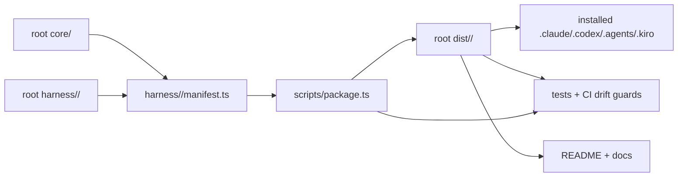
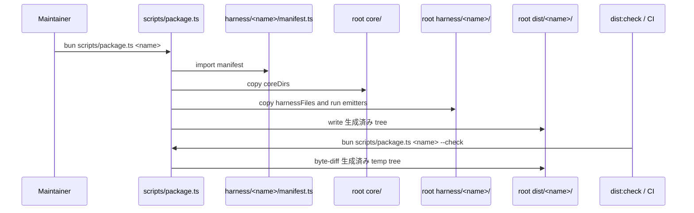
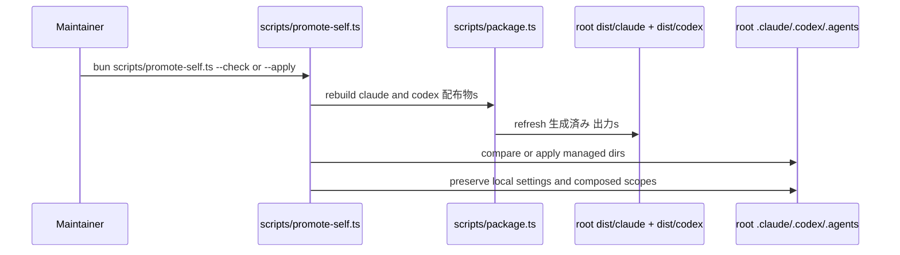

# アーキテクチャ

## 現在の全体構造

Amadeus リポジトリ は one-core-many-harnesses 型の architecture である。root-level の `core/` を source of truth とし、`harness/<name>/manifest.ts` が各 harness の projection を定義し、`scripts/package.ts` が `dist/<name>/` を生成する。

`core/`, `harness/`, `scripts/`, `dist/` は独立した package 内部の private detail ではなく、repository root に現れる first-class concept として扱われている。

## レイアウト結合

主要な hardcoded root assumptions は次の通り。

- `scripts/package.ts` は `REPO_ROOT`, `CORE_ROOT = <root>/core`, `HARNESS_ROOT = <root>/harness` を定義する。
- `scripts/package.ts` は `../core/tools/amadeus-version.ts` を直接 import する。
- `scripts/package.ts` は `harness/<name>/manifest.ts` を scan して harness 一覧を解決する。
- `scripts/package.ts` は 出力 を `<root>/dist/<name>` に書き込む。
- `scripts/promote-self.ts` は `<root>/dist/claude/.claude`, `<root>/dist/codex/.codex`, `<root>/dist/codex/.agents` を root `.claude`, `.codex`, `.agents` へ promote する。
- tests と docs は root `dist/` を user-visible install source として参照する。

このため full workspace normalization は directory move だけではなく、source root abstraction、manifest contract、dist 出力 contract、self-install preservation、CI drift guard、docs mental model を同時に扱う architecture change になる。

## 相互作用図

### パッケージ生成トランザクション

### 自己昇格トランザクション

## 正規化の影響

`packages/<name>/{core,harness,dist,scripts}` へ寄せる場合、少なくとも次の architecture decision が必要になる。

- Framework package name を何にするか。例: `packages/amadeus`。
- `dist/` を package-local に移すか、root に public install 出力 として残すか。
- `.claude/.codex/.agents` の self-install target は root に残すか、package workspace から root へ promote するか。
- manifest の `src` を package-local relative path にするか、repository-wide logical path にするか。
- CI の drift guard を新 layout に合わせるだけか、互換期間を設けて両方検証するか。

現時点の architecture は root-centric だが一貫している。したがって、正規化の価値が `packages/setup` との MECE 性だけであるなら staged layout 継続が最も低リスクである。一方、将来複数の independently releasable package を増やすなら、source root abstraction を先に入れた段階移行が必要である。
