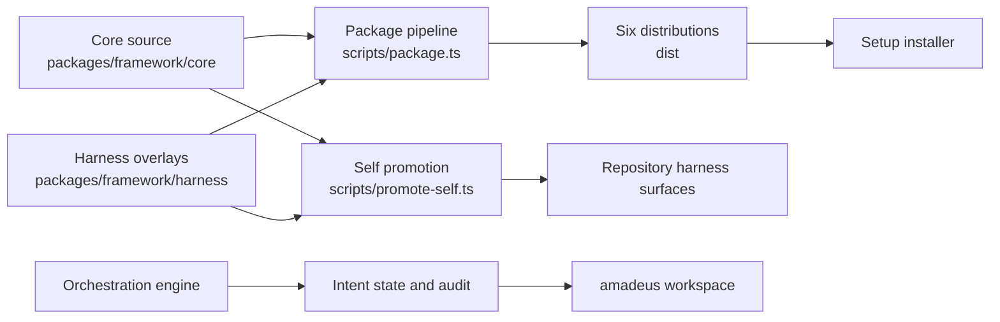
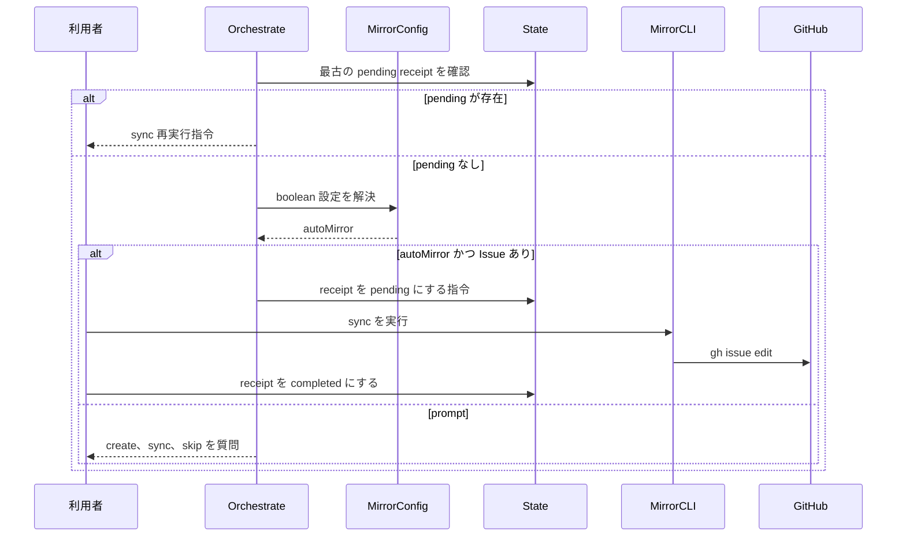
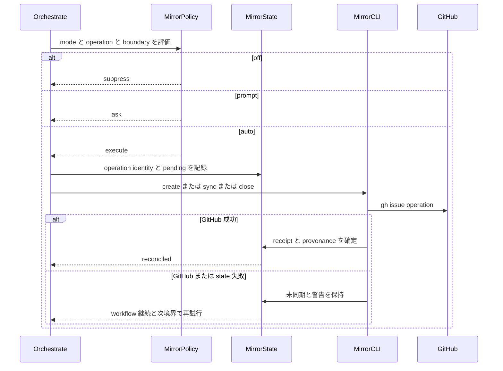

# アーキテクチャ

## 全体アーキテクチャ

Amadeus は、単一リポジトリ内のモジュール型 CLI フレームワークである。正本は `packages/framework/core/`、ハーネス差分は `packages/framework/harness/{name}/` に置かれる。`scripts/package.ts` が両者を合成して `dist/{harness}/` を生成し、`scripts/promote-self.ts` が開発リポジトリ自身のハーネス面へ反映する。実行時の正本データは `amadeus/spaces/{space}/` 配下の Intent record、memory、CodeKB、knowledge である。

<!-- Text fallback: core と harness overlay を package pipeline が6つの dist へ生成し、setup installer が利用者環境へ配布する。promote-self は同じ正本を開発リポジトリ自身へ反映する。orchestration engine は Intent state、audit、amadeus workspace を更新する。 -->

アーキテクチャ上の主要な境界は、(1) engine の決定、(2) state/audit の永続化、(3) 外部 GitHub 操作、(4) 生成・配布である。GitHub は optional dependency であり、認証情報は `gh` credential store に委譲する。

## Mirror サブシステムの現状

Mirror は次の4要素で構成される。

1. `amadeus-mirror-config.ts`: Global、Space、Intent の3層設定を読む。現状は `boolean`、既定値 `false`。
2. `amadeus-orchestrate.ts`: verified phase 境界で receipt を調べ、ask または auto-sync の directive を出す。
3. `amadeus-mirror.ts`: create、sync、close、status と `gh auth status`、`gh issue create/edit/close/view` を実行する。
4. `amadeus-state.ts`: `Mirror Boundary Receipts` を `pending` / `completed` として永続化する。

現状の処理は「phase 境界 sync」に偏っている。`handlePark` と workflow complete 経路には auto sync/close の配線がなく、Intent Capture 承認直後の auto create seam もない。

## Interaction Diagrams（相互作用図）

### 現行の phase 境界同期

<!-- Text fallback: engine は最初に pending receipt を回収し、なければ設定を解決する。auto かつ Issue ありなら pending、sync、completed の順で進み、それ以外は利用者へ create、sync、skip を質問する。 -->

### 目標の三モード・ライフサイクル

<!-- Text fallback: policy は mode、operation、boundary から suppress、ask、execute を決める。auto では操作 identity と pending を先に記録し、GitHub 成功後に receipt と provenance を確定する。失敗時は未同期と警告を保持して workflow を継続し、次境界で再試行する。 -->

## 主要な構造リスク

### 配布レイアウトの project root

`amadeus-mirror.ts` の `projectDirFromToolsDir()` は tools ディレクトリから4階層上を project root とみなす。core source 配置では成立するが、配布後の `.codex/tools` などでは深さが異なり、誤った root を返す。`amadeus-lib.ts` には環境 seam、明示パス、script-path を扱う `resolveProjectDir()` が既にあり、root 解決の正準候補である。

### provenance と ownership

state が保持するのは `Mirror Issue` 番号だけであり、Amadeus 作成か外部リンクかを識別できない。`handleClose` は landing と最終 sync を検証するが ownership を検証しないため、誤った Issue を edit/close する可能性がある。自動 close は provenance 欠落・不一致時に fail-closed とする必要がある。

### 部分成功と再入

`gh issue create` 成功後に state 書込みが失敗すると、GitHub 側には Issue が存在するがローカルには番号がない。現行の duplicate guard はローカル番号だけを見るため、再試行で重複作成し得る。操作 identity または再発見可能な provenance を GitHub 操作前後で整合させる必要がある。

### receipt と mode 変更

pending receipt の回収は config 解決より先に評価される。pending 後に mode を `off` へ切り替えても sync が再提示される可能性があり、「off は外部操作を発火しない」という目標契約と衝突する。pending の意味、off の優先度、明示的な cancel/settle 規則を設計で確定すべきである。

### space の所有境界

mirror snapshot の record 解決に default space 固定の経路があり、non-default space で誤った record を参照するリスクがある。space は config、intent registry、state、receipt、mirror operation の全経路で同じ selector を使う必要がある。

## 設計判断への示唆

三モードの判断は、`mode × operation × boundary` を受けて `suppress | ask | execute` と理由を返す小さな policy decision/result 型へ集約するのが妥当である。これは設定値の解釈を engine の複数 seam へ散らさず、完全な決定表テストを可能にする。一方、GitHub 以外の tracker は対象外であり、汎用 transport adapter や新しい分散処理基盤は導入しない。

provenance、operation identity、receipt、warning は Intent record が所有する。外部 Issue 本文を正本にせず、record から Issue への一方向同期を維持する。
