# アーキテクチャ

## Issue #3029 の blocking sensor 経路（最新観測）

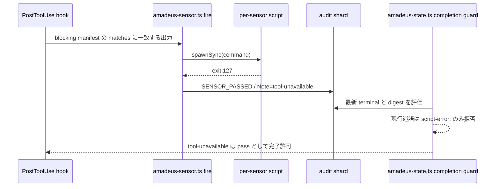
```mermaid
sequenceDiagram
    participant H as PostToolUse hook
    participant D as amadeus-sensor.ts fire
    participant S as per-sensor script
    participant A as audit shard
    participant G as amadeus-state.ts completion guard
    H->>D: blocking manifest の matches に一致する出力
    D->>S: spawnSync(command)
    S-->>D: exit 127
    D->>A: SENSOR_PASSED / Note=tool-unavailable
    G->>A: 最新 terminal と digest を評価
    G-->>G: 現行述語は script-error: のみ拒否
    G-->>H: tool-unavailable は pass として完了許可
```

`amadeus-sensor.ts:772-778` は exit 127 を `kind: "passed"` と `tool-unavailable` note に変換し、`amadeus-state.ts:2008-2014` は `SENSOR_PASSED`、receipt 一致、digest 一致、`script-error:` でないことを pass 条件にしている。この二つの境界が Issue #3029 の欠陥面であり、sensor schema の severity は compiled graph 経由で gate に到達するが、exit 127 の意味は audit note と guard predicate の間で別扱いになっている。

### 設計裁定の境界

RE は fail-closed 化を選択しない。requirements が exit 127 を「blocking evidence 不成立」と定義するか、「診断付き advisory pass」として維持するかを決める。選択に応じて、dispatcher の分類、guard の pass predicate、t511 の unit/integration 回帰、audit-format と plugin sensor schema の説明を同じ契約へ揃える必要がある。

## park の provenance 境界: 拒否点・受理材料・承認境界の切り分け（260814-park-provenance、履歴、observed `1d08374cd`。**現在時制マーカーのみ降格**（`cid:reverse-engineering:c1`、260814-priority-bug-batch の差分リフレッシュ時。本節の file:line は本節が宣言する observed 断面の値として保存する））

**観測 ref**: observed = `1d08374cd7e4ef89637b4a8000bab3fcf1a0f780`（`origin/main`、PR #3037 着地）。差分 base = `cd64486a68c6a1144db50fbe3fde8273f5e18455`（observed の祖先で距離 **6**）。本 worktree HEAD は observed を merge した conductor tree で、非 `amadeus/` ツリーは observed とバイト等価（`git diff --stat 1d08374cd HEAD -- ':!amadeus/'` 空 / exit 0）。検索述語と全数列挙は `re-scans/260814-park-provenance.md` を正本とし、本節は構造だけを転記する。

### B-1. 患部の構造は base から不変、隣接面だけが動いた

`amadeus-state.ts` / `amadeus-stop.ts` / `amadeus-bolt.ts` / `amadeus-intent-autonomy-production.ts` / `t17` / `t122` は base..observed で無変更。動いたのは `amadeus-orchestrate.ts`（#3011、+57/-8）と規範面（#3037）。したがって直前節（下の 260814-autonomy-stop-fixes 節）の **state / hook 側の構造記述はそのまま有効**で、orchestrate 側の行ピンだけが drift している（対応表は re-scan §3）。

### B-2. 「停止」語彙は3機構に分裂し、`Parked` マーカーを書くのは1経路だけ

- `Parked` / `Parked At Stage` を書くのは `amadeus-state.ts:1579` `handlePark` **のみ**（engine の `amadeus-orchestrate.ts:6597` は `spawnState(pd, ["park"])` への委譲）。
- `parkedDirective` は `amadeus-orchestrate.ts` に全数 **7 hit**（定義 `:1100` + park verb 自身の成功発行 `:6618` + 他 5 経路 `:3108` `:3279` `:4076` `:5995` `:6591`）。他 5 経路は `handlePark` を通らず autonomy を問わず発行され、`Parked` マーカーも `WORKFLOW_PARKED` も残さない。
- Intent autonomy の suspended projection（`REPAIR_STALLED` / `NORM_CONFLICT`）はさらに別機構。

→ 「autonomous な run は park できない」という不変量は observed では**成立していない**。禁じられているのは `Parked` マーカーを伴う明示 park verb だけである。

### B-3. hook の案内と tool の拒否が同一断面で矛盾する

`amadeus-stop.ts:806` `continuationReason()` は `:823` で `amadeus-orchestrate.ts park` を「クリーンな一時停止」として案内し、呼出は `:1047` の唯一のブロック経路のみ（autonomy 条件なし）。その park を `amadeus-state.ts:1583-1587` が拒否する。加えて `amadeus-state.ts:1573` の「Stop hook の同一ガード」というコメントは反証済み（hooks に `Construction Autonomy Mode` 0 hit / exit 1、`amadeus-stop.ts:947` は `parked` を全モード allow）。

### B-4. PR #3037 は #3016 の劣化を「固定」した

`stage-protocol.md:1041` §11b（`:1047` 逐語 `Print \`directive.message\` verbatim and STOP. … do not invent a new question or a new gate`）が 8 ハーネス表層へ同期済み（全域 9 hit = core 1 + harness 8）。park 拒否は `kind:error`（`amadeus-orchestrate.ts:6604`）で返るため、conductor は**回避策の自動適用を禁じられ**、逐語出力して停止するほかない。

§11c（`:1057`、正本 `docs/reference/24-intent-autonomy.md:122`）の承認境界は `a push, opening a PR, replying to or resolving a review thread, and filing an Issue` を対象とする remote write 限定であり、ローカル state 書込である park には**直接適用されない**。ただし「grant が認可できない 5 分類」（`24-intent-autonomy.md:137`）は park 設計にも及ぶ — park の受理根拠を grant に置いてはならない。

### B-5. 受理材料は既存だが、fail-open / fail-closed で層が割れている

| 部品 | 位置 | 空 ledger | consume-once |
| --- | --- | --- | --- |
| `humanActedSinceGate` | `amadeus-lib.ts:3858` | **fail OPEN**（active scope） | 暗黙 |
| `outstandingHumanTurns` | `amadeus-lib.ts:3904` | fail CLOSED | 未消費のみ列挙 |
| `selectLifecycleHumanTurn` | `amadeus-lib.ts:2954` | fail CLOSED（throw） | **有**（`Human Turn Timestamp` を消費印に使う） |
| `humanTurnGroundsTakeover` | `amadeus-state.ts:5067` | fail CLOSED | 位置比較 |
| `latestHumanTurnAfter` | `amadeus-goal.ts:100` | `null` | 呼出側が audit へ刻む |

`handlePark` は active record 専用（`--intent` / `--space` を取らない）ため、`humanActedSinceGate` を使うと必ず fail-open 側に落ちる。**受理述語の選択がそのまま完了条件1（unattended は依然拒否）の成否を決める。**

### B-6. `Construction Autonomy Mode` は依然として認可の正本ではない

`stage-protocol.md:126` / `packages/framework/core/memory/org.md:44` の規範は変わらず、書込点は `amadeus-intent-autonomy-production.ts:713` の派生投影。かつ `amadeus-lib.ts:5167` の `isAutonomousMode` は「既存 open-coded サイトの寄せは tracked follow-up」と明記しており（`:5160-5164`）、`amadeus-state.ts:1583` はその未寄せサイトの1つ（全域 `=== "autonomous"` は 6 hit）。

## 停止境界のアーキテクチャ: park ガードと `error` directive の受け方（260814-autonomy-stop-fixes、履歴、observed `cd64486a6` — 260814-park-provenance 時点でも state / hook 側の構造は有効、orchestrate 側の行ピンのみ drift）

**観測 ref**: observed = `cd64486a68c6a1144db50fbe3fde8273f5e18455`（`git rev-parse HEAD` = `git rev-parse origin/main`）。差分 base = `d7ffaa5442266508d8e67babc3e0b947fb4c1637`（HEAD の祖先で距離 **4**）。焦点領域は base..observed で**全面無変更**。検索述語と全数列挙は `re-scans/260814-autonomy-stop-fixes.md` を正本とし、本節は構造だけを転記する。

### A-1. park 拒否は 1 点のみで、二層防御は実在しない

`packages/framework/core/tools/amadeus-state.ts:1579` `handlePark` のガード（`:1583-1587`）が唯一の拒否点で、判定入力は `Construction Autonomy Mode` **のみ**。人間 turn の有無も park 要求の起点（人間 / hook / スクリプト）も参照しない。

直上コメント（`:1565-1578`）は逐語 `defence-in-depth beside the Stop hook's identical guard` と述べるが、observed の Stop hook に park ガードは**存在しない**（`git grep -n "Construction Autonomy Mode" -- packages/framework/core/hooks/` = 0 hit / exit 1）。hook は逆に `amadeus-stop.ts:947-949` で `parked` を**全モード終端 allow** し、`:943-946` が逐語 `A parked directive is terminal for the current turn in every mode.` / `The Intent grant remains a separate projection and is not revoked by this allow.` と宣言する。hook 側の autonomy ガードは park ではなく tier-3 会話カーブアウト（`:518-540`）と tier-2 系（`:976-981`, `:994-999`）に掛かっている。

### A-2. 「autonomous な run は park しない」は observed では既に成り立っていない

park 経路は 3 系統に分かれ、`handlePark` を通るのは 1 系統だけである。

| 経路 | 位置 | ガード通過 |
| --- | --- | --- |
| generic park（`orchestrate park` → `spawnState(["park"])`） | `amadeus-orchestrate.ts:6499-6506` / `:6566-6582` | **通る**（非 0 exit を `errorDirective` として逐語中継、`:6573`） |
| Abort 後の Construction park | `amadeus-orchestrate.ts:4050-4052` | 通らない（directive を直接 emit） |
| REPAIR_STALLED park | `amadeus-orchestrate.ts:5944-5969` | 通らない。**full grant を保持したまま park する第一級経路** |

再送とクリアは Branch 2.5（`:3223-3257`、`Parked At Stage === Current Stage` のときだけ再送）と Branch 2.6（`:3261-3277`、`--resume` で明示クリア）が担う。**park→`--resume` 再開の機構は既存であり、未固定なのは grant の保持・失効方針だけ。**

### A-3. ガードの判定入力は「認可の正本ではない」と明文化されたフィールド

`stage-protocol.md:126` 逐語: `The canonical authorization is the Intent audit. `Construction Autonomy Mode` is only an internal scheduling projection; legacy values never authorize a gate.`（同旨 `packages/framework/core/memory/org.md:44`）。書込点は `amadeus-intent-autonomy-production.ts:713` の派生投影（`full → autonomous` / それ以外 → `gated`）。

一方で `amadeus-orchestrate.ts:6171-6182` は、`report` が前進のみ・generic park が autonomous 下で拒否されるため typed failure に admission 経路がない、と設計制約として明記している。**park ガードの緩和は、この経路の前提を同時に検査する必要がある。**

### A-4. 「fresh な人間 turn」を判定する既成部品は揃っている

`packages/framework/core/tools/amadeus-intent-autonomy-production.ts` に provenance 機構が既にある。

| 機構 | 位置 | 役割 |
| --- | --- | --- |
| `latestHumanTurnId` | `:320-344` | `humanActedSinceGate` が偽なら null。真なら全 shard の `HUMAN_TURN` 最新を digest 化 |
| `AutonomyProvenanceScope` | `:346-362` | `intent` / `launch-chain` の判別ユニオン。`launch-chain` は参照 turn の識別子を**型に含む**（名指しのない launch-chain を表現不能にする） |
| `launchChainHumanTurnId` | `:452-478` | 実在 / 未消費 / record 誕生時刻以前 / fingerprint 一致の 4 条件で解決 |
| `resolveDeclarationProvenance` | `:486-500` | `launch-chain` × `full` は `PROVENANCE_SCOPE_FORBIDDEN`、turn 不在は `PROVENANCE_REQUIRED` |
| `freshHumanRetryTurn` | `:1163-1185` | REPAIR_STALLED 以後の `HUMAN_TURN` だけを fresh と認める**先例** |

「使い回し・古い turn を拒否する」要求は `freshHumanRetryTurn` と同型（基準時刻より後の turn だけを採る）で実装可能。**基準時刻をどこに置くかが設計裁定事項。**

### A-5. `error` directive の受け方は core に正本を持たない開放集合

engine 側の `error` は汎用の fail-closed 表現で、`amadeus-orchestrate.ts` 内 **98 箇所**が `errorDirective` を呼ぶ。成果物欠落による report 拒否は degrade-unit 経路（`:4270-4293`）の 3 分岐すべてがこれを返す。

受け手側の契約（「message を逐語出力して停止、recover しない」）は**8 ハーネス表層に手書きで散在し、core に正本がない**（`git grep -rn "Print \`directive.message\` verbatim" -- packages/framework/core/` = 0 hit）。observed の分岐は 3 系統:

| 系統 | 面 | 文言 |
| --- | --- | --- |
| 完全形（5） | claude `:59` / codex `:57` / kimi `:59` / kiro `:55` / kiro-ide `:55` | `Print \`directive.message\` verbatim and STOP. Do not recover, retry, or smooth it over — the message is the user-facing error.` |
| 短縮形（2） | cursor `commands/amadeus.md:67` / opencode `commands/amadeus.md:67` | `Print \`directive.message\` verbatim and STOP. Do not recover or smooth it over.`（`retry` と「message は user-facing error」が欠落） |
| 散文・逐語出力の指示なし（1） | pi `skills/amadeus/SKILL.md:68-71` | 停止集合の列挙のみ |

**文言でこの受け方を強化する修正は、この 8 面すべてを同一変更で同期する必要がある。**

### A-6. remote write の承認境界は参照されるだけで定義がない

`plugins/pr-convergence/stages/pr-convergence.md` は remote write の人間承認をステージ契約として明文化する（`:78-80` `Commit and push under the workspace's approval boundary for remote writes.` / `:378-382` `**Ask before writing to the remote.** ... never merge: merging is a separate human decision and no convergence verdict authorises it.` / `:363`）。

しかし「approval boundary」の**定義は存在しない**（全域述語で 5 hit、うち定義 0 件）。`stage-protocol.md` 側の `existing approval boundary`（`:313`, `:380`, `:399`, `:415`）は「新しいゲートを作らず既存の承認境界へ回せ」の意で、**ステージゲートを指す別概念**であり、両者の関係も未定義。

一方 `docs/reference/24-intent-autonomy.md:79-84` は、grant が決して認可できない 5 分類（`new-permission` / `irreversible` / `scope-out` / `norm-waiver` / `quality-waiver`）を定め、逐語 `Autonomy therefore cannot widen its own permissions, waive quality, or take an irreversible action, regardless of mode.` と結ぶ（対訳 `.ja.md:76`）。→ **remote write を一律 grant 認可にする解はこの分類と正面衝突する。**

矛盾しない経路は `decide-question` 梯子（`amadeus-bolt.ts:1019-1035`、五段は `24-intent-autonomy.md:92-113`、手順の正本は `stage-protocol.md:135`（full）/ `:137`（semi））で、`human-required` のときだけ人間へ回る。`stage-protocol.md:139-141` の無条件 halt は **Bolt の code-generation 失敗のみ**を対象とし（`:141` 逐語 `This is the one case where \`autonomous\` mode stops to consult.`）、remote write は対象外。

## coverage-patch-quick は advisory 近似であり CI gate の代替ではない（260814-coverage-quick-norm、履歴、observed `d7ffaa544` — 260814-autonomy-stop-fixes 時点でも構造は有効）

**観測 ref**: observed = `d7ffaa5442266508d8e67babc3e0b947fb4c1637`（`git rev-parse HEAD`）。差分 base = `5f6b5bf97068f59dee53dcd4a2f6564967c3d164`。詳細と検索述語は `re-scans/260814-coverage-quick-norm.md` を正本とする。

`coverage-patch-quick` は targeted lcov を scratch に書き、`tests/coverage-patch-gate.ts` を `AMADEUS_PATCH_LCOV` 差し替えで spawn する。判定ロジックの複製はない。完了時の exit は常に 0（`EXIT_ADVISORY`、`coverage-patch-quick-cli.ts:254-255`）。バナーは CI Patch Coverage Gate が正本であると逐語で述べる（同 `:266-284`）。

CI の正本入力はフル `bun run coverage:ci -- -P 4`（`ci.yml:466` / `:550`）。判定 3 秒に対し合流 lcov 生成は job 94095568607 で 11 分 03 秒（`gh api .../jobs/94095568607`）。

既存の coverage single-owner（`project.md:136`）と数値転記規律（`team.md:68`）を緩めない。quick は既定 `coverage/` を使わない。Learnings Inbox に「quick を内側ループの標準とする」運用ノルムは未存在（re-scan の不在述語、exit 1 / 0 行）。

## Lifecycle Guard Runtime の着地と formal-model-check の provider 選択構造（260814-fmc-macos-provider、履歴、observed `5f6b5bf97` — 260814-coverage-quick-norm 時点でも構造は有効）

**観測 ref**: すべて observed = `5f6b5bf97068f59dee53dcd4a2f6564967c3d164`（= 本 worktree HEAD = `origin/main`、`git rev-parse HEAD`）。差分 base = `89532174c30ef9cc7ff29496cd6916586fdda00a`（`git merge-base --is-ancestor 89532174c HEAD` = exit 0、`git rev-list --count 89532174c..HEAD` = **9**）。検索述語と患部の全数列挙は `re-scans/260814-fmc-macos-provider.md` を正本とし、本節は構造だけを転記する。

### Lifecycle Guard Runtime は着地した（直前節の「不在」は base 断面の記録）

直下の 260813-lifecycle-guard-runtime 節は observed `89532174c`（**実装前**の断面）で「Guard Runtime は存在しない」を実測した記録である。base..observed の `0fbbec42b`（#2986）がこれを実装し、observed `5f6b5bf97` では `packages/framework/core/tools/amadeus-lifecycle-guard.ts`（**236 行**、`wc -l`）が 4 つの authoritative checkpoint を共通型で扱う。

`LifecycleCheckpoint`（`:42-46`）は `"intent-birth" | "stage-completion" | "phase-transition" | "workflow-completion"` の 4 値。checkpoint はハンドラの identity ではなく**コミット経路の identity** であることを宣言コメント（`:39-41`）が明示する — 逐語: `four CLI handlers complete a stage and five cross a phase boundary, and all of them evaluate the same checkpoint.`

判定は `LifecycleGuardVerdict`（`:74-78`）の 4 値 — `allowed`(receipt 付き可) / `denied` / `unknown` / `not-applicable` — に統一され、`evaluateLifecycleGuards`（`:208`）が **最初の blocking verdict で停止**して `LifecycleGuardDecision`（`:96-111`、`allowed` / `blocked` の判別ユニオン）を返す。`unknown` は `denied` と同じく blocking である（時間予算の失効を持つ adapter は `unknown` を報告して同じ規則でブロックする、`:25-28`）。

**登録面は module-level の frozen 配列で、登録 API を持たない**（`:36-38` 逐語: `there is no registration API, so a project cannot remove a system-invariant guard`）。observed の registry は 5 本:

| registry | 位置 | adapter id（order 昇順） |
| --- | --- | --- |
| `INTENT_BIRTH_WORKSPACE_GUARDS` | `amadeus-utility.ts:4123` | `intent-birth.workspace-scan`(10) |
| `STAGE_COMPLETION_GUARDS` | `amadeus-state.ts:329` | `stage-completion.artifacts`(10) / `stage-completion.unit-review`(20) / `stage-completion.blocking-sensors`(30) |
| `PHASE_TRANSITION_GUARDS` | `amadeus-state.ts:353` | `phase-transition.phase-check-artifact`(10) |
| `WORKFLOW_COMPLETION_PREPARATION_GUARDS` | `amadeus-state.ts:369` | `workflow-completion.prepared`(10) / `workflow-completion.mandatory-plugin-stages`(20) |
| `WORKFLOW_COMPLETION_AUTHORIZATION_GUARDS` | `amadeus-state.ts:387` | `workflow-completion.record-resolution`(10) / `workflow-completion.goal-receipt`(20) |

Workflow 完了だけが **2 ラウンド**に分かれる。context の構築が 2 段（state 文書のみで判じる準備段 → completion instance と Intent record を解決した後の認可段）であるためで、移行前のハンドラの報告順を保存する意図が宣言コメント（`amadeus-state.ts:362-367`）に明示されている。

拒否の合流点は `refuseBlockedTransition`（`amadeus-state.ts:405-412`）1 箇所で、`error(formatGuardRefusal(decision.refusal))` により **`writeStateFile` の前に exit** する。これが「メモリ上の content 反転が半端な遷移ではなく破棄可能」であることの構造的根拠である（同 `:402-404` のコメント）。receipt を持つ checkpoint は `guardReceipt(decision, policyId)`（`amadeus-lifecycle-guard.ts:153`）で取り出す — 例は workflow-completion の `GoalReconciliationReceipt`（`amadeus-state.ts:3249`）と intent-birth の `ClassifiedWorkspaceScan`。

呼出側は `evaluateLifecycleGuards` の 4 箇所（`amadeus-state.ts:582` phase-transition / `:2738` stage-completion / `:3208` workflow 準備段 / `:3232` workflow 認可段）と `amadeus-utility.ts` の intent-birth 面。**hook 層（`amadeus-subagent-model-guard.ts`）は Runtime の外に残る**（`git grep -l "amadeus-lifecycle-guard"` の 8 ヒットに hooks 配下は含まれない）。直前節が「単一 Runtime を名乗るなら hook 層の扱いが主要論点」と記した点は、observed でも未決のままである。

内部契約の詳細は `docs/reference/26-lifecycle-guard-runtime.md`（222 行）/ `.ja.md`（214 行）が正本。

### チームモードのランチャ面は撤去された

`8b6089275`（#2975）が `packages/framework/core/tools/team-up.sh` / `team-up-codex-safety-wait.ts` / `team-msg.sh` を削除した。observed で `git ls-files | grep -iE "team-up|team-msg"` が返す tracked ファイルのうち**現行コード面は `tests/integration/t-remove-team-up-absence.test.ts`（不在を固定する回帰テスト）1 件のみ**で、残りは intent record と re-scan の履歴である。`docs/guide/20-team-mode{,.ja}.md` と `docs/guide/team-messaging{,.ja}.md` は残存するが大幅に縮小した（`git diff --numstat 89532174c..HEAD -- docs`: team-mode `+30 −77` / `.ja` `+49 −96`、team-messaging `+13 −67` / `.ja` `+12 −66`）。8 harness への `coreDirs.tools` 無条件投影という配布構造そのものは不変で、投影元から 3 ファイルが消えただけである。

### 本 intent の焦点 — formal-model-check の provider 選択は「可用性を見ない同期選択」である

[Issue #2361](https://github.com/amadeus-dlc/amadeus/issues/2361)（ミラー [#2995](https://github.com/amadeus-dlc/amadeus/issues/2995)）の患部領域は base..observed で**変更ゼロ**（`git diff --name-only 89532174c..HEAD -- plugins/formal-model-check tests/unit/t-formal-verif-tlc-spawn-planner.test.ts mise.toml` が空出力）。以下は observed 断面の構造である。

`selectTlcSpawnPlanner`（`plugins/formal-model-check/tools/tlc-spawn-planner.ts:520-539`）は **同期関数で、可用性判定を一切持たない**。`provider === "auto"` は `platform === "darwin" ? "sandbox-exec" : "docker"` を選び、あとは planner のコンストラクタを返すだけである（`:533` / `:537`）。JDK 検出・`sandbox-exec` バイナリ・docker CLI の実在は、いずれも後段の `snapshotEnvironment` まで判明しない。

```text
run-model-check-execution.ts:225  selectTlcSpawnPlanner   ← 同期・可用性検査ゼロ
   ↓
run-model-check-execution.ts:238  toolchain.preparePlanned({…, planner})
   ↓
fs-tlc-toolchain.ts:1831          await planner.snapshotEnvironment(…)
   ↓
tlc-spawn-planner.ts:131-191      NodePlannerEnvironmentPort.inspectDarwin
     :132 platform 不一致 / :134 JAVA_HOME 不在 / :150-166 JDK version 不一致
     / :167-168 sandbox-exec 不在 / :177-179 network-deny 未 deny → throw
   ↓ catch（:316-321）→ ENVIRONMENT_UNAVAILABLE
fs-tlc-toolchain.ts:1838          if (!environmentSnapshot.ok) return environmentSnapshot;
```

Docker 側も対称で、可用性は `DockerTlcSpawnPlanner.snapshotEnvironment`（`:415`）→ `inspectDocker`（`:193`）→ `docker image inspect`（`:261`）まで判明しない（**デーモン起動の独立検査は存在せず**、image inspect の失敗としてのみ観測される）。

構造上の帰結は 2 点である。(1) **フォールバックを差し込める自然な合流点は「選択時」ではなく `snapshotEnvironment` 失敗の直後**であり、選択時に倒すなら `selectTlcSpawnPlanner` の async 化(= referee 経路 `tla-referee-toolchain.ts:224` への signature 波及)が要る。(2) `provider === "auto"` の分岐は repo 全体で **2 箇所のみ**（`:526` の選択と `:68` の `createNotRunPlannerReceipt` 内 receipt plan 選択）で、**片方だけ変えると receipt が実際に走った planner と異なる inspection plan を名乗る**。env-receipt スキーマ（`amadeus.env-receipt.v1`、`run-model-check-domain.ts:93-98`）自体は provider 中立なので、フォールバックのための schema 変更は不要である。

## projectDir 解決の段構造と in-process 呼出における ambient 逸出（260814-t528-ambient-isolation、履歴、observed `5f6b5bf97`。**現在時制マーカーのみ降格**（`cid:reverse-engineering:c1`）。observed `1d08374cd` では PR #3011 が `amadeus-orchestrate.ts:3046` `refuseAmbientProjectDir` を導入し `:3060`（`handleNext` 経由）/ `:6037`（`handleReport`）/ `:6536`（`handleFailureRuling`）の **3 箇所**へ配線済み（述語 `git grep -n "refuseAmbientProjectDir" -- packages/framework/core/tools/amadeus-orchestrate.ts` → 4 hit = 定義 1 + 呼出 3、exit 0）。本節が列挙する他の面が #3011 で閉じたか否かは本 intent では未検証であり、本節の file:line はその節が宣言する observed `5f6b5bf97` 時点の値として保存する）

対象: [Issue #2981](https://github.com/amadeus-dlc/amadeus/issues/2981)。測定 ref = observed `5f6b5bf97068f59dee53dcd4a2f6564967c3d164`。file:line はすべて observed 断面で verbatim 実読して採取した。

### 解決ラダー（`packages/framework/core/tools/amadeus-lib.ts:232-269`）

`resolveProjectDir(explicitDir?: string): string` は 6 段の open-set ラダーである。

| 段 | 位置 | 述語 | 設計意図（宣言コメントより） |
|---|---|---|---|
| 1 | `:234` | `if (explicitDir) return explicitDir;` | 明示引数が最優先 |
| 2 | `:241` | `if (process.env.CLAUDE_PROJECT_DIR) return process.env.CLAUDE_PROJECT_DIR;` | 「cwd とは別の workspace を指すテスト fixture / ツールがこれに依存する」ため marker 段より**上**に置くことが `:236-240` で明示されている |
| 3 | `:250-251` | `const markerDir = findWorkspaceMarkerAncestor(process.cwd()); if (markerDir) return markerDir;` | worktree セッションで段 4 が本線 checkout を指してしまう問題（#2352 / #641）への対処 |
| 4 | `:256-258` | script path から `<harness>/tools` を剥がす | open-set。任意の harness dir 名に対応 |
| 5 | `:262-266` | cwd 直下に既知 harness dir | dev repo 向け |
| 6 | `:269` | `return cwd;` | フォールバック |

**アーキテクチャ上の含意**: 段 2〜6 はいずれも「呼出側が何も渡さなくても必ず何かを返す」設計であり、`undefined` は**エラーではなく ambient 解決の要求**として扱われる。CLI プロセスの entry point ではこれが正しい（引数省略時に開発者の意図する workspace を拾う）。しかし **in-process にハンドラを直接呼ぶテストドライバでは、同じ `undefined` が「テスト用プロジェクトではなく開発者の実 workspace」を意味してしまう**。段 3 の存在により、`CLAUDE_PROJECT_DIR` を削除しても cwd 祖先の workspace marker で実 record に着地するため、env 清掃では閉じない。

### 2つの ambient 逸出点

`handleReport` は先頭（`amadeus-orchestrate.ts:5851`）で `_handlerProjectDir = projectDir;` を実行する。宣言コメント（`:5849-5850`）は逐語で `Record the project this handler operates on so emit()'s ERROR_LOGGED lands here, not the ambient CLAUDE_PROJECT_DIR, under in-process drivers (#1389).` と述べ、**この代入自体が ambient 逸出の防止機構であることを明言している**。しかし代入されるのは正規化前の `projectDir` そのものであり、呼出側が `undefined` を渡した場合はガードが素通りする。

| 逸出点 | 位置 | 帰結 |
|---|---|---|
| E1: 制御フロー分岐 | `amadeus-orchestrate.ts:6020-6023` — `const failureAdmissionDir = resolveProjectDir(projectDir);` の直後に `if (flags.result === "failed" && runsQualityRepair(failureAdmissionDir))` | ambient 解決先の実 record の autonomy projection（`runsQualityRepair`、`:5780-5783`）が**どの分岐へ入るかを決める**。この分岐は `FORWARD_RESULTS` 検査（`:6039-6045`）より上にあるため、`Unknown --result "failed"` へ到達するか否かが実環境の設定に依存する |
| E2: 副作用の着地先 | `amadeus-orchestrate.ts:802-804` の `emit()` 集約点 → `recordEngineError(directive.message, _handlerProjectDir)` → `recordEngineError`（`:941-968`）が `projectDir === undefined` のとき `process.argv` の `--project-dir` を探し、無ければ `resolveProjectDir(undefined)` へ落ちる | 唯一のガードは `:958` の `if (!existsSync(stateFilePath(pd))) return;` のみ。in-process テストでは ambient 先が実 intent record でありこのパスは実在するため、`emitErrorAuditRow`（`:962`）が**実 record の監査シャードへ `ERROR_LOGGED` 行を書く** |

E2 の汚染は監査シャード1行に限定される。`admitProductionStageFailure`（`:5840`）へは `--failure` 未指定ガード（`:5834-5839`）で到達せず state 本体は書かれない（制御フローの実読による判定であり、実行による確認ではない）。

**設計上の要点**: E1 と E2 は同じ根（`undefined` を ambient 要求として解釈する）から出るが、**閉包点が異なる**。E1 はハンドラの引数契約（呼出側が explicit を渡す、または `handleReport` が `undefined` を拒否する）で閉じる。E2 は `_handlerProjectDir` を `resolveProjectDir` 適用後の値で埋めるか、`recordEngineError` の ambient 段を fail-closed にするかで閉じる。**テスト側の呼出だけを直しても E2 の経路は production コードに残る。**

### explicit projectDir 経路上に残る ambient 依存の全数

`handleReport` 本体（`:5848-6338`、終端 `}` は `awk 'NR>=5848 && /^}/{print NR; exit}'` で実測）の直接 `process.env` 参照は 1 箇所のみ（`:5863` `resolveOperatingMode(process.env.AMADEUS_OPERATING_MODE)`）。呼出先経由の ambient 依存は以下。

| 面 | 位置 | 性質 |
|---|---|---|
| `AMADEUS_STAGE_GRAPH` | `amadeus-lib.ts:6924` / `amadeus-graph.ts:231` | explicit projectDir を渡しても効く。テストが `dist/` を指すため worktree 隔離で破れる（本 intent の機序 B） |
| `pluginHostRoot()` | `amadeus-orchestrate.ts:1801-1809`（`process.env.AMADEUS_PLUGINS_HOST_ROOT ?? dirname(TOOLS_DIR)`） | **projectDir を引数に取らない**。常に実 repo の `packages/framework/core` を指し、`advisoryReportHoldReason(pd, slug, pluginHostRoot())` で消費される。テストプロジェクトの plugin 構成ではなく実 repo の構成が効く |
| `detectHarnessType()` | `amadeus-harness.ts:123-133` | `report` では kimi caller 判定にのみ使用 |
| `refuseUnauthorizedKimiCaller` | `amadeus-orchestrate.ts:2969-2976`（`authorizeMainConductor(resolveProjectDir(projectDir))`） | explicit を渡す呼出では ambient に落ちない |
| 子プロセス spawn の env | `amadeus-orchestrate.ts:5094` `env: process.env` | ただし `cmd`（`:5093`）が `"--project-dir", projectDir` を明示付与し段 1 が勝つため、子プロセスの解決先は汚染されない |

**`pluginHostRoot()` が projectDir を取らない点は、テスト隔離の観点では未閉のシームである**（本 worktree では発火していないが、plugin 構成の異なる worktree では別の不安定要因になりうる。**未検証**）。

### 差分区間での患部の安定性

`git diff --stat 89532174c..HEAD` は本節が引く 5 ファイルのうち `amadeus-orchestrate.ts` のみ変更（+30 / −6、単一コミット `86feb2ee5` #2980 の `applyPendingAdvisoryGuard` 周辺）。`git diff 89532174c..HEAD -- packages/framework/core/tools/amadeus-orchestrate.ts | grep -c "^[+-].*\(resolveProjectDir\|runsQualityRepair\|failureAdmission\|handleStageFailureReport\)"` = **0**（rc=1、空一致）。**患部行は差分ベース以降まったく変更されていない。**

### 適用範囲外（明示）

E1 / E2 の閉包方式の選定、`undefined` を引数契約から排除するか実行時に拒否するか、`pluginHostRoot()` に projectDir を通すか否かは requirements-analysis / application-design の所掌である。

## ライフサイクル進行ガードの集約構造と分散（260813-lifecycle-guard-runtime、履歴、observed `89532174c`。**本節は #2986 着地前の断面**であり、Runtime の不在はこの断面の事実。着地後の構造は上の 260814 節を参照）

**観測 ref**: すべて observed = `89532174c30ef9cc7ff29496cd6916586fdda00a`（= 本 worktree HEAD = `origin/main`）。差分 base = `854692fd7a11b124236b0427fe3d59e2fe6bf785`（`git merge-base --is-ancestor` exit 0、`git rev-list --count` = 35 commits / 233 files）。全数列挙・検索述語 P1〜P13・G1〜G40 の棚卸しは `re-scans/260813-lifecycle-guard-runtime.md` を正本とする。本節はそこから**構造だけ**を転記する。

### Guard Runtime は存在しない（不在の実測）

`GuardRuntime` / `guard-runtime` / `guardRuntime` / `LifecycleGuard` / `lifecycle-guard` / `lifecycleGuard` / `before-intent-birth` / `beforeIntentBirth` / `registerGuard` / `Guard Runtime` の **10 パターンすべてが rc=1 / hits=0**（1 パターン 1 実行・rc 個別採取、re-scan §2 P1）。observed のガードは共通 Runtime を持たず、checkpoint ごとに独立配線されている。

### 4 checkpoint の集約度は一様でない

| checkpoint | 集約点 | 集約状態 |
| --- | --- | --- |
| Intent 生成前 | なし（`handleIntentBirth` `amadeus-utility.ts:4387` 内に直列で 4 ガード G1〜G4） | **未集約** |
| Stage 完了 | `verifyStageCompletionGuards`（`amadeus-state.ts:2539`） | **集約済み**。呼出 4 経路 `:2763` advance / `:2877` finalize / `:3054` complete-workflow / `:3998` approve |
| Phase 境界 | `verifyPhaseCheckArtifact`（`amadeus-state.ts:392`、export） | 単一関数だが呼出側で個別配線。呼出 5 箇所 `:2775` / `:2926` / `:3059` / `:4009` + `amadeus-jump.ts:581` |
| Workflow 完了 | なし（`completeWorkflowForTarget` `amadeus-state.ts:2963` 内に G13 `:3002` / G14 `:3008` / G15 `:3030` / G16 `:3010-3013` が直列） | **未集約** |

`amadeus-state.ts:2520-2526` の宣言コメント verbatim: `FOUR handlers mark a stage [x] — approve, advance, finalize and complete-workflow — each under its own lock, with no shared transition function between them. ... this function is the fix for that gap and the place any fifth guard goes.` — **Issue #2771 が「新設」と書く集約点は、Stage 完了に限りすでに存在する**。不足しているのは共通 Interface と、残り 3 checkpoint への水平展開である。

**jump は第 5 の権威ある遷移**である（`amadeus-jump.ts:581` `if (hasExecuted) verifyPhaseCheckArtifact(pd, phase);`、`:576` コメント `on disk, the same gate advance / approve apply. verifyPhaseCheckArtifact`）。ただし jump は `verifyStageCompletionGuards` を通さない — `[S]` / `pending` 化であって完了ではないため、**設計上正しい非対称**である。

### ガードは 2 層に分かれる

1. **CLI ツール層** — G1〜G39（`packages/framework/core/tools/`）。`error()` による process exit を主たる拒否手段とする。
2. **harness hook 層** — G40（`packages/framework/core/hooks/amadeus-subagent-model-guard.ts:89` `permissionDecision: "deny"`）。CLI ツール層の外にあり、`permissionDecision` を持つのはこの 1 箇所のみ（re-scan §2 P10）。加えて G30（park 拒否）は state.ts と Stop hook に**同一ガードの二重実装**を持つ（`amadeus-state.ts:1390-1398` コメント verbatim: `This is defence-in-depth beside the Stop hook's identical guard`）。

単一 Runtime を名乗るなら **hook 層の扱いが主要論点**になる。

### checkpoint 語彙の全体像は 4 点より広い

`amadeus-state.ts` の verb dispatch は **15 verb**（`:1034`〜`:1108`、re-scan §2 P9）。Issue の 4 checkpoint はこの部分集合であり、外側にさらに jump（`amadeus-jump.ts:581`）、Bolt batch gate（`amadeus-bolt.ts:1197-1214`）、swarm retry（`amadeus-swarm.ts:763` ほか `kind: "retry-refused"`）がある。移行対象集合は **G1〜G40** を正本とする。

### base 以後に増えたガード（G22）

`16d94927d`（#2945）が `admitProductionStageFailure`（`amadeus-intent-autonomy-production.ts:1102`）+ `stageFailureDirective`（`amadeus-orchestrate.ts:5779`、`:5816` で emit）を追加し、full autonomy の型付き stage failure を Quality Repair / REPAIR_STALLED へ接続した。**Issue #2771 の「ガードを追加するたび手作業配線」premise の追加実例であり、同時に移行対象の増加でもある。**

## patch coverage ゲートの判定パイプラインと免除の適用段（260811-allowlist-semantic-audit、履歴、observed `854692fd7`）

**観測 ref**: すべて observed = `854692fd7a11b124236b0427fe3d59e2fe6bf785`。差分 base = `ce3c3ccfdb3f93e619a081386a70c8185b84f1db`（34 commits）。正本は `re-scans/260811-allowlist-semantic-audit.md`。

### 消費者グラフ（全数、実測）

`tests/.coverage-patch-allowlist.json` を**解釈する**実装は `tests/coverage-patch-gate.ts` の **1 箇所のみ**（述語 `grep -rn "coverage-patch-allowlist" . --exclude-dir=node_modules --exclude-dir=.git --exclude-dir=dist --exclude-dir=amadeus -l` = `tests/coverage-patch-gate.ts` と `tests/README.md` の 2 件、後者は文書）。CI 配線は `.github/workflows/ci.yml` の `Patch coverage gate` ステップ（`bun tests/coverage-patch-gate.ts --check`、`github.event_name == 'pull_request'` 限定）。

### 判定パイプラインの段構成（`evaluatePatch` `:438-461` の実読）

```
diff の追加行（parseDiffAddedLines）
  → LCOV に当該 file が在るか（無ければ skip）
  → LCOV に当該 line の DA が在るか（h === undefined なら skip = 計測不能行）
  → h > 0 なら covered
  → allowlisted(allowlist, file, line) なら allowlistedCount
  → いずれでもなければ violation（ゲート赤）
```

免除は**最終段**にのみ現れ、判定は `allowlisted`（`:421-426`）の**行番号包含**（`e.file === file && line >= e.start && line <= e.end`）だけである。

### 2 つの信頼境界と、その非対称

台帳には性質の異なる 2 つの契約が同居しており、observed ではその**片方だけ**が機械で守られている。

| 契約 | 守る機構 | 向き |
|---|---|---|
| **セレクタが一意に解決すること** | `resolveSemanticSelector` `:288-313` — スコープ名の非一意（`:294-298`）・指紋の非一意（`:306-310`）で throw。ソース不在も throw（`:391`）。`runCheck` `:552` が exit 1 | **fail-closed** |
| **範囲が測定可能行に当たること** | `findStaleAllowlistEntries` `:407-419` — DA レコードの存在検査 | fail-closed（存在ゼロで赤） |
| **`reason` が解決先の実コードを説明していること** | **無し** | **fail-open**（無検査） |

`findStaleAllowlistEntries` は引数が `entries` と `lcov` のみで `reason` を受け取らない。したがって「指紋は一意に解決し、範囲には測定可能行が在り、しかし `reason` は別の関数の別の分岐を説明している」という状態が、ゲートを green のまま通過する。

### PR #2127 の移行が変えた面と変えなかった面

PR #2127 は台帳を「絶対行番号ピン → 関数スコープ名 + ソース指紋」へ移行した（observed で旧形式 `lines` キーのエントリは **0 件**）。アーキテクチャ上の帰結:

- **消えた失敗モード**: 行シフトによる stale 化。指紋は関数スコープ内を走査して一致点を探すため、対象行が上下へ移動しても追従する（`:301-305`）。
- **消えなかった失敗モード**: 指紋が**誤った行から採取されている**場合、その誤りは指紋ごと固定され、以後シフトを跨いで正確に追従する。実測: `amadeus-election.ts` のエントリは Issue 報告時 `:317` → observed `:417`（+100 行）で、指紋は同一。
- したがって移行は**転位の可視性を下げた**。行ピン時代は行ズレが stale として赤くなる経路があったが、意味的セレクタではそれも起きない。

### 変更影響の直列化点としての台帳

台帳は 106 ファイルへ 623 エントリを張る**横断的な結合点**であり、`packages/framework/core/tools/` の主要モジュールへの変更はほぼ必ず接触する（上位: `amadeus-orchestrate.ts` 63 / `amadeus-state.ts` 61 / `amadeus-quality-repair-runtime.ts` 19 / `amadeus-advisory-choice.ts` 18 / `amadeus-intent-completion.ts` 18 / `amadeus-utility.ts` 18）。区間 `ce3c3ccfd..854692fd7` でもゲート実装は無変更のまま台帳のみ `+109/−10`（614 → 623）で、**台帳だけが動き続ける**構造が続いている。

## receipt 信頼境界の二重欠陥（260812-tla-proof-receipt、履歴、observed `854692fd7`）

**観測 ref**: 本節の file:line はすべて observed = `854692fd7a11b124236b0427fe3d59e2fe6bf785`（= 本 worktree HEAD、`origin/main` 系譜）時点。差分 base = `ce3c3ccfdb3f93e619a081386a70c8185b84f1db`（HEAD の祖先のうち距離最小 = **34 commits**）。currency 根拠・全述語・全数列挙の正本は `re-scans/260812-tla-proof-receipt.md`。

**Focus**: [Issue #2913](https://github.com/amadeus-dlc/amadeus/issues/2913)（ミラー #2917）— `tla-authoring` ステージの proof が receipt 検証で止まり、TLC 実行に到達しない。クロスレビュー 2 名成立済み。

### 中核: 「レジストリ照合器」を「自己完結 receipt 検証器」として使っている

`validateVerifiedTlaModelReceipt`（`plugins/formal-model-check/tools/tla-model-receipt.ts:142`）は、入力 receipt を **登録済み model-map と突き合わせる照合器**である。検証の基準値 `expected` は、引数からではなく loader が返す登録済みソースから作られる（`:154` `const loaded = loadVerifiedTlaSources();` / `:156` `const selected = selectVerifiedModel(loaded.value, input.modelName);` / `:158` `const expected = createVerifiedTlaModelReceipt(selected.value);`）。

一方 referee は、**登録されていないディスク上のバイト列**から receipt を作る（`tla-referee-toolchain.ts:158` `const receipt = createVerifiedTlaModelReceipt(described.value.source);`）。この receipt は登録済み model-map に存在しないため、照合器は構造的に「一致する登録モデルがない」として拒否する。すなわち**生成器と検証器の契約が食い違っている**のであって、どちらか一方の実装バグではない。

### 欠陥は 2 つあり、独立している

| ID | 欠陥 | 所在 | 効果 |
|---|---|---|---|
| **D1** | 検証器が model-map に直接結合している（DI seam なし） | `tla-model-receipt.ts:154` / `:156` | 未登録モデルの receipt は `verified model is unavailable: <name>`（`:157`）で拒否 |
| **D2** | identity のエンコーディングが producer 間で分裂している | `tla-referee-toolchain.ts:47` vs `tla-model-loader-internal.ts:279` / `fs-tlc-toolchain.ts:731` | 登録済みモデルでも identity 比較が不一致になり `receipt differs from the selected verified model`（`:169`）で拒否 |

**D2 の内訳**（3 サイトのうち 2 形式が併存）:

| サイト | `canonicalIdentity` への入力 | file:line |
|---|---|---|
| referee | **オブジェクト** `{ bytes: <base64> }` | `tla-referee-toolchain.ts:47` `return canonicalIdentity({ bytes: Buffer.from(bytes).toString("base64") }, domain).sha256;` |
| loader | **デコード済み文字列** | `tla-model-loader-internal.ts:279` `canonicalIdentity(source, domain).sha256` |
| toolchain のバイト照合 | **デコード済み文字列** | `fs-tlc-toolchain.ts:731` `if (canonicalIdentity(source, domain).sha256 !== expectedIdentity) {` |

分裂が検出されないまま共存できる理由は、`createVerifiedTlaModelReceipt`（`tla-model-receipt.ts:89-130`）が **identity を再計算せず呼び出し元の値をコピーする**ことにある（`:104-112` `moduleBytesIdentity: source.moduleIdentity,` / `cfgBytesIdentity: source.cfgIdentity,` / `auxIdentities.map(...)`）。エンコーディングは receipt 構築器ではなく `VerifiedModelSource` の**生産者**が決めるため、referee 経路と loader 経路で別々の形式がそのまま receipt に載る。

**D2 は D1 の修正の前提条件である。** 現在のバイト照合は loader 形式どうしの比較で自己整合しているが（`verifyPlannedModelSources` が `model.value.moduleBytesIdentity` を `readVerifiedSourceBytes` へ渡す — `fs-tlc-toolchain.ts:1645` / `:1651`、補助モジュールは `:1777`。`model.value` は `tla-model-receipt.ts:177` `...expected.value` 由来 = loader 形式）、D1 だけを直して自己完結 receipt 経路を通すと、referee 自身の object 形式 identity が同じバイト照合へ渡り、`MODEL_RECEIPT` の代わりに `SOURCE_IDENTITY` で落ちる。失敗が 1 層下へ移動するだけになる。

### `validateModelCheckReceipt` の消費者は 2 つある

片方だけを直しても失敗は解消せず、発生箇所が移動する。

| 消費者 | 段階 | 失敗の出方 |
|---|---|---|
| `fs-tlc-toolchain.ts:1641` `const model = validateModelCheckReceipt(input.modelReceipt);`（`verifyPlannedModelSources`、宣言 `:1635`） | **準備段**（TLC 実行前） | `:1643` `toolchainAbort("PreparationError", "MODEL_RECEIPT", model.error.message);` — #2913 が現に発火している箇所 |
| `tlc-toolchain.ts:647` `const model = validateModelCheckReceipt(input.modelReceipt);`（`parseTlcOutput174`） | **出力解析段**（TLC 実行完了後） | `GRAMMAR` `TLC output model receipt is invalid: ...`。準備段で止まる現状では**到達しない**が、同じ model-map 依存を持つ第 2 の実例 |

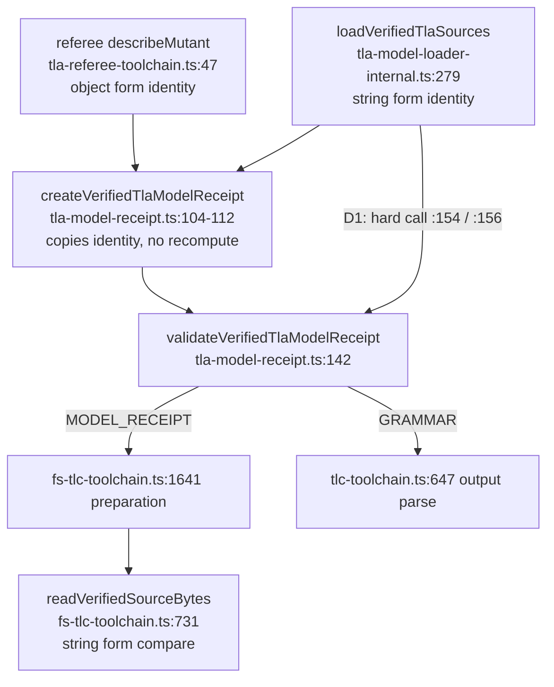
```mermaid
flowchart TD
    Referee["referee describeMutant<br/>tla-referee-toolchain.ts:47<br/>object form identity"] --> Ctor["createVerifiedTlaModelReceipt<br/>tla-model-receipt.ts:104-112<br/>copies identity, no recompute"]
    Loader["loadVerifiedTlaSources<br/>tla-model-loader-internal.ts:279<br/>string form identity"] --> Ctor
    Ctor --> Validator["validateVerifiedTlaModelReceipt<br/>tla-model-receipt.ts:142"]
    Loader -->|"D1: hard call :154 / :156"| Validator
    Validator -->|"MODEL_RECEIPT"| Prep["fs-tlc-toolchain.ts:1641 preparation"]
    Validator -->|"GRAMMAR"| Parse["tlc-toolchain.ts:647 output parse"]
    Prep --> ByteCheck["readVerifiedSourceBytes<br/>fs-tlc-toolchain.ts:731<br/>string form compare"]
```
<!-- Text fallback: referee(object形式) と loader(string形式) の双方が createVerifiedTlaModelReceipt へ流れ込むが、構築器は identity を再計算せずコピーする(D2)。検証器は loader を直接呼んで基準値を作る(D1)。検証器の下流には準備段(fs-tlc-toolchain.ts:1641)と出力解析段(tlc-toolchain.ts:647)の 2 消費者があり、さらに準備段の先には string 形式のバイト照合(:731)がある。 -->

### loader 内部 seam は「能力の欠如」ではなく「方針の禁止」

`loadVerifiedTlaSourcesInternal`（`tla-model-loader-internal.ts:463`）の直上コメント `:461-462` は逐語で `// Internal/test-only seam. Production callers must use the no-argument wrapper` / `// in tla-model-loader.ts so runtime input cannot select a root or filesystem.` である。ただしこの seam は **root を選択する能力を実際に持つ**（`findRepositoryRoot` `:151-168` が `moduleUrl` から `.git` + `package.json` を持つ最初のディレクトリまで遡る）。`tests/integration/t403-tla-loader-generalization.test.ts:94-100` は合成ワークスペースから fixture モデルを読ませるためにこの能力を使っている。

したがって `:461-462` は**方針上の禁止**であって能力上の制約ではない。設計段でこの区別を明示しておかないと、「seam を開ければ簡単に直る」という再発見が起きる。

## PR 収束ゲートのアーキテクチャと bypass 経路（260811-pr-convergence-gate、履歴、observed `854692fd7`）

### System Overview

Amadeus は単一リポジトリから複数ハーネス向け配布物を生成する、layered modular monolith 型の CLI フレームワークである。source of truth は `packages/framework/core/` と `packages/framework/harness/<name>/` にあり、plugin は `plugins/<name>/` から compose される。workflow state、audit、stage artifacts は `amadeus/spaces/<space>/` 配下へ永続化される。

Issue #2838 の変更面は4つの境界に分かれる。

1. **Selection boundary** — host config と compiled scope grid が self-* workflow に `pr-convergence` stage を含める。
2. **Delivery boundary** — plugin CLI が `gh` process boundary を通じて PR を作成・観測する。
3. **Evidence boundary** — CLI が per-unit `code-generation/pr-convergence-report.md` を生成する。
4. **Completion boundary** — orchestrator と state machine が required artifacts と blocking sensors を検査して stage/workflow completion を許可する。

現行実装は 1 と通常 engine path の 4 を部分的に閉じるが、2→3→4 を不可偽造の一連の証拠として結合していない。

### Architectural Style and Boundaries

- **Core layer**: graph compile、scope binding、orchestration、state transition、artifact/sensor guards。plugin 固有の GitHub 意味論を import しない。
- **Plugin layer**: GitHub I/O、PR lifecycle、review ledger、convergence predicate、report rendering、provenance parsingを所有する。
- **Harness layer**: core/plugin の同じ stage graph と tools を各 AI host の filesystem convention へ投影する。
- **Record layer**: Intent state、audit、per-unit artifacts を append/read する永続化境界。
- **External adapter**: `gh` CLI を shell なし argv で spawn し、GitHub GraphQL/PR create を呼び出す。

この依存方向は妥当である。問題は component boundary ではなく、report writer と completion verifier の contract が shape validation に留まり、execution provenance を所有する component が存在しない点にある。

### Component Relationships

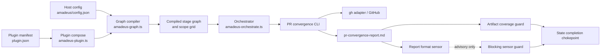
```mermaid
flowchart LR
  HC["Host config\namadeus/config.json"] --> GC["Graph compiler\namadeus-graph.ts"]
  PM["Plugin manifest\nplugin.json"] --> PC["Plugin compose\namadeus-plugin.ts"]
  PC --> GC
  GC --> SG["Compiled stage graph\nand scope grid"]
  SG --> OR["Orchestrator\namadeus-orchestrate.ts"]
  OR --> CLI["PR convergence CLI"]
  CLI --> GH["gh adapter / GitHub"]
  CLI --> RP["pr-convergence-report.md"]
  RP --> AG["Artifact coverage guard"]
  RP --> FS["Report format sensor"]
  FS -. "advisory only" .-> BG["Blocking sensor guard"]
  AG --> ST["State completion chokepoint"]
  BG --> ST
```

テキスト代替: host config と plugin manifest を graph compiler が統合し、orchestrator が compiled plan に従って plugin CLI を起動する。CLI は GitHub を読み、report を書く。report は artifact guard と format sensor に読まれるが、format sensor は advisory のため blocking guard へ実効的に接続されず、state completion は report の真正性を保証しない。

### Interaction Diagrams

#### 正常な convergence report 生成

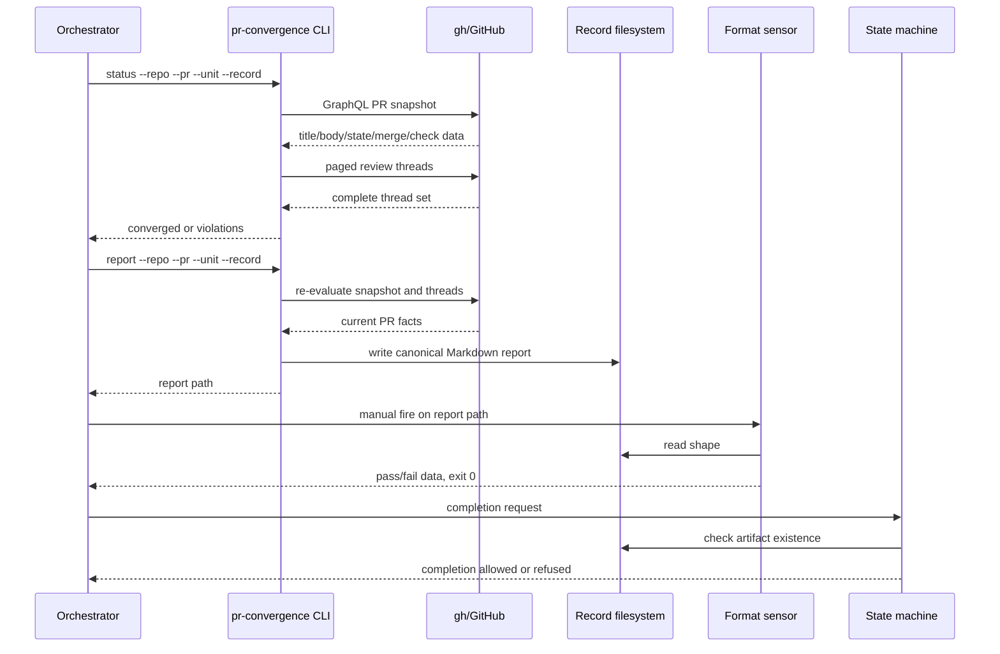
```mermaid
sequenceDiagram
  participant O as Orchestrator
  participant C as pr-convergence CLI
  participant G as gh/GitHub
  participant R as Record filesystem
  participant S as Format sensor
  participant M as State machine

  O->>C: status --repo --pr --unit --record
  C->>G: GraphQL PR snapshot
  G-->>C: title/body/state/merge/check data
  C->>G: paged review threads
  G-->>C: complete thread set
  C-->>O: converged or violations
  O->>C: report --repo --pr --unit --record
  C->>G: re-evaluate snapshot and threads
  G-->>C: current PR facts
  C->>R: write canonical Markdown report
  C-->>O: report path
  O->>S: manual fire on report path
  S->>R: read shape
  S-->>O: pass/fail data, exit 0
  O->>M: completion request
  M->>R: check artifact existence
  M-->>O: completion allowed or refused
```

テキスト代替: status の後、report verb は GitHub を再評価して Markdown を書く。orchestrator は sensor を手動 fire し、最後に state completion を要求する。現状、sensor failure は data でしかなく、state machine は CLI が report を書いたという receipt を検証しない。

#### 手書き report bypass

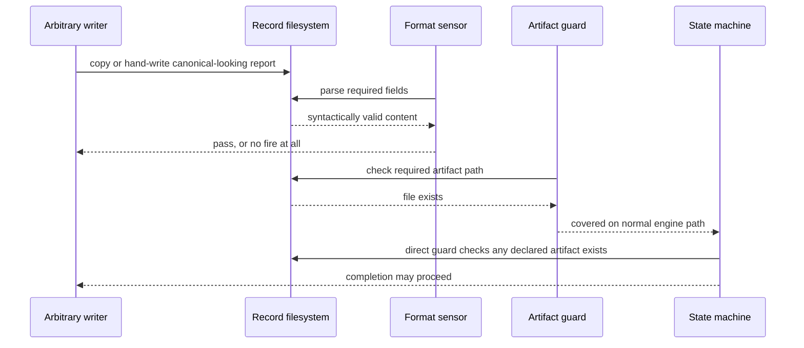
```mermaid
sequenceDiagram
  participant W as Arbitrary writer
  participant R as Record filesystem
  participant F as Format sensor
  participant A as Artifact guard
  participant M as State machine

  W->>R: copy or hand-write canonical-looking report
  F->>R: parse required fields
  R-->>F: syntactically valid content
  F-->>W: pass, or no fire at all
  A->>R: check required artifact path
  R-->>A: file exists
  A-->>M: covered on normal engine path
  M->>R: direct guard checks any declared artifact exists
  M-->>W: completion may proceed
```

テキスト代替: 任意の writer が正規 field を模倣すると、format sensor は writer identity を区別できない。sensor が未実行でも blocking precondition はなく、artifact guard は path existence を見る。direct state guard は全成果物ではなく少なくとも1件の存在で通り得るため、bypass が残る。

### Key Design Decisions Observed

- plugin stage は `scopes: []` を維持し、host-owned `plugin.scope-bindings` で self-* にだけ加算する。非 self scope の opt-in を壊さない可逆な設計である。
- report artifact は `pr-convergence` stage の own produce ではなく、plugin seam で先行 `code-generation.produces` に overlay される。既存 per-unit coverage を再利用できる一方、責任の所在が stage と artifact owner で分離する。
- plugin は core を import せず、`gh` と `amadeus-log` を process boundary で呼ぶ。配布独立性を守るが、attestation verification をどこに置くか明示的な契約が必要になる。
- GitHub snapshot は title/body/state/merge/check を1 queryで取得し、Intent/Bolt/Unit provenance を同じ snapshot から検証する。PR content provenance は閉じているが report writer provenance は別問題として未解決である。

### Architectural Risks

- **BLOCKER**: report に execution receipt、content digest、audit identity、signature がなく、正規 content の copy/tamper/replay を識別できない。
- **BLOCKER**: sensor manifest は `default_severity: advisory`、stage は `sensors: []`、手動 fire、failure exit 0 であり completion boundary に接続されていない。
- **BLOCKER**: direct state completion guard は declared artifacts の全件ではなく最低1件の存在を検査するため、orchestrator の per-unit all-artifact coverage と強度が一致しない。
- **FOLLOW-UP**: stage `produces: []` / `requires_stage: []` と code-generation overlay の分離は、責任・順序・resume semantics を下流設計で明文化する必要がある。
- **FOLLOW-UP**: `create` は `--head` を gh に渡すだけで、clean branch、local commit、push、remote head SHA 一致を検証しない。

## テスト時間係数の未接続境界（260810-test-time-factor、履歴、observed `ce3c3ccfd`）

現行は `.github/workflows/*.yml` からテスト runner へ環境能力を渡す境界がない。`tests/lib/run-tests-args.ts` が固定の既定 timeout を解決し、`tests/run-tests.ts` が各 Bun child へ `--timeout` として配布する。一方、テスト内の `Bun.sleep`、poll、settle、child process timeout は各ファイルの固定値であり、runner の上限だけを伸ばしても内部待機は伸びない。

設計候補は `tests/lib/test-time-factor.ts` をテスト時間解決の正本とし、`scaleTestTime(baseMs)` を runner と負荷依存 wait から共用する形である。既存 `AMADEUS_TEST_TIMEOUT` は live driver の明示 override として意味が異なるため、二重乗算にしない。

### Interaction Diagrams

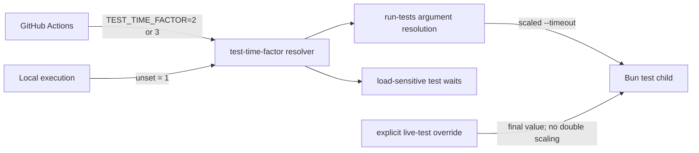
```mermaid
flowchart LR
    CI["GitHub Actions"] -->|"TEST_TIME_FACTOR=2 or 3"| Factor["test-time-factor resolver"]
    Local["Local execution"] -->|"unset = 1"| Factor
    Factor --> Runner["run-tests argument resolution"]
    Runner -->|"scaled --timeout"| BunChild["Bun test child"]
    Factor --> Waits["load-sensitive test waits"]
    Explicit["explicit live-test override"] -->|"final value; no double scaling"| BunChild
```
<!-- Text fallback: GitHub Actions は TEST_TIME_FACTOR=2/3、ローカルは未指定=1として共通 resolver へ渡し、runner timeout と負荷依存 wait を拡張する。明示 live-test override は最終値として二重乗算しない。 -->

## plugin manifest 解決の所在非対称と advisory 消費者グラフ（260810-plugin-manifest-resoluti、履歴、observed `7b9391be2`）

**観測 ref**: 本節の file:line はすべて observed = `7b9391be2db4fad791d637293ea442d5a1462bac`（= repo HEAD）時点。差分 base = `df1c874cfb397fafe877a72f00a82664a59689ae`（HEAD の祖先、**13 commits / 302 files**、**PR #2811 を含む**）。currency 根拠・全述語・全数列挙の正本は `re-scans/260810-plugin-manifest-resoluti.md`。

**Focus**: [Issue #2823](https://github.com/amadeus-dlc/amadeus/issues/2823)（ミラー #2829）— plugin manifest 所在非対称 + evaluator argv root-relative。クロスレビュー 2/2 ESTABLISHED_WITH_REFINEMENTS（run `xrev-2823-20260810T094918Z`）。

### 直下の履歴節からの差分（PR #2811、PROVEN）

base..observed で PR #2811（`c51afbd0a`、staging seed での `{{HARNESS_DIR}}` 解決）が着地し、直下の履歴節（observed `df1c874cf`）の次の記述は**更新済み**である:

- `copyPluginSource` / `copyRealFiles` は **`amadeus-plugin.ts:702-741`**（旧 `:659-688`）。`copyRealFiles` は `harnessDir` パラメータを取り、staging 宛てコピーでは `seedBytesForHarness`（`:669-675`）が `{{HARNESS_DIR}}` を解決する（`stagingHarnessDirOf` `:659-664`、authoring 宛ては意図的に除外）。**「self-install 5 面は置換を一度も通らない」という旧 N-3 の帰結は解消済み**。
- `collectPluginSources` / `seedStaging` は **`:874-906`**（旧 `:821-853`）。
- ガード `t531-plugin-harness-literal-guard` が新設され、plugin **散文**のハーネスリテラルは走査済み。**`plugins/**/plugin.json` の argv は依然として誰も走査しない**。
- compose 本体に置換器が無い事実、`plugin.json` が composed ツリーに配送されない事実（旧 N-9）は**不変**。

### 所在非対称の構造（PROVEN）

欠陥は**契約の継ぎ目**にある。配送側 — compose が manifest から集めるのは `stages`/`tools` のみ（`amadeus-plugin-compose.ts:895` の `ownedPaths`、書き出しは `:1390-1408` `composeWriteSet`）。消費側 — advisory 宣言の唯一の読み点は `pluginManifestPath(projectRoot, plugin)` = `<projectRoot>/plugins/<name>/plugin.json`（`amadeus-advisory-declaration.ts:295-297`、読み手は `:312` / `:392` の 2 箇所のみ）。manifest 不在は `:312-313` で**無音 fail-open**（`return []`、監査・ログなし）。`projectRoot` は `projectRootForHost(hostRoot) = dirname(hostRoot)`（`amadeus-plugin-activation.ts:110-112`）。

evaluator argv（`plugins/formal-model-check/plugin.json:59-65`）の第 2 要素 `:61` は repo ルート相対で、`spawnEvaluator`（`:347-357`）が `cwd: projectRoot`・shell なしで spawn するため、**projectRoot に authoring ツリーが在る環境でのみ解決する**。engine 側双子は `amadeus-advisory-choice.ts:925`。

### install 経路の全列挙（mechanism settlement、PROVEN）

| 経路 | project supply（`<projectRoot>/plugins/<name>/`） | advisory の運命 |
|---|---|---|
| folder-drop（installDoc primary、`plugin-projection.ts:634`） | 作られない | (a) 無音で全滅 |
| `install <path>` verb + dot-dir ホスト（`amadeus-plugin.ts:1117-1118`/`:1160`、persistentInstall=true） | **FULL bundle が永続化される** | (c) both-working |
| marketplace / native-manifest（installDoc `:622-631`） | repo 内に証拠なし（`CLAUDE_PLUGIN_ROOT` 0 hit） | せいぜい (a)、UNMEASURED |
| self-install / promote-self | 常に存在 | (c) dogfood masking |

**新規知見**: install verb の persistent 腕は両レビュアの共有前提（「repo ルート `plugins/` を作らせる文書化経路は無い」）と、前 intent `requirements.md:90` を falsify する。installDoc（`:636`）は verb に言及するが project supply 永続化は未開示。分岐 (b)（hold-without-clean-release）は手作り hybrid（manifest のみ供給）でのみ到達可能。詳細は re-scan 正本 §mechanism settlement。

### 消費者グラフの要点（PROVEN）

`advisoriesForHost`（`:366-383`）→ `declaredAdvisoriesForPlugin`（`:305-329`）→ `spawnEvaluator`（`:347-357`）の checkpoint 発火経路と、`amadeus-advisory-choice.ts:948-978`（`declaredFormalCheckRoute`）/ `:729-741`（`directiveItemFor` → `declaredHandoffStage`）/ `:980-986`（`DECLARED_RELEASE_RULE`）の run-now/handoff 経路が、すべて同じ `pluginManifestPath` 解決に依存する。**全経路で degradation は無音**であり、t445-advisory-declaration-supply `:155-160` がその無音 fail-open を契約として pin している。

## plugin 散文のパス規約と rename データ源の二重化（260810-plugin-prose-seed-guard、履歴、observed `c51afbd0a`）

**観測 ref**: 本節の file:line はすべて observed = `c51afbd0a99b2eb3f0b9c1ee4e2cef2772378131`（`origin/main` 系譜。worktree HEAD `ff06d945b` は record-only merge なので observed には採らない — `cid:reverse-engineering:c2-observed-mainline-commit`）時点。差分 base = `df1c874cfb397fafe877a72f00a82664a59689ae`（直前 intent の observed）。区間は **8 コミット**、非 record 面で **16 files / +721 / -101**（`git diff --shortstat "${B}" "${S}" -- . ':(exclude)amadeus/'`）。全述語・全数列挙の正本は `re-scans/260810-plugin-prose-seed-guard.md`。

**Focus**: [Issue #2810](https://github.com/amadeus-dlc/amadeus/issues/2810)（plugin 散文の repo ルート相対ツール参照 11 行）+ [#2812](https://github.com/amadeus-dlc/amadeus/issues/2812)（`transform()` と `seedBytesForHarness()` の規則集合乖離）。兄弟欠陥 `plugin.json:61` は [#2823](https://github.com/amadeus-dlc/amadeus/issues/2823)（S2-CRITICAL）へ分離済みで本 intent の射程外。**Scan mode**: xrev differential scan（run `xrev-2810-20260810T080817Z` / `xrev-2812-20260810T080817Z`、いずれも 2 名 ESTABLISHED_WITH_REFINEMENTS）。

### ⭐ 直前節の中核前提は解消された — 経路B に置換器が入った

直前節（`260810-plugin-harness-dir-token`、`df1c874cf`）の N-3 は「経路B（runtime compose）に置換器は存在せず、self-install 5 面は `transform()` を一度も通らない」ことを中核所見としていた。**この非対称は PR #2811（`c51afbd0a`）で解消されている。**

`packages/framework/core/tools/amadeus-plugin.ts:669-675` 逐語:

```ts
export function seedBytesForHarness(relPath: string, bytes: Buffer, harnessDir: string | null): Buffer {
  if (harnessDir === null) return bytes;
  if (!relPath.endsWith(".md") && !relPath.endsWith(".md.example")) return bytes;
  const rules = rulesSubdirFor(harnessDir);
  const text = bytes.toString("utf-8").replace(HARNESS_TOKEN, harnessDir);
  return Buffer.from(text.replaceAll(`${harnessDir}/rules/`, `${harnessDir}/${rules}/`), "utf-8");
}
```

配線は `copyRealFiles` の書き出し点 `:738` — `writeFileSync(join(outDir, name), seedBytesForHarness(toPosixRel(srcRoot, abs), readFileSync(abs), harnessDir))`。`harnessDir` は**書き出し先**から導かれる（`stagingHarnessDirOf(dst)`、`:659-664`）。`seedStaging`（`:894-900`）の宛先は常に `pluginSourceRootOf(hostRoot)/<name>` = `<harnessTree>/.amadeus-plugin-src/<name>` なので、ソースが authoring `plugins/` でも staging でも解決は効く。`null` を返すのは authoring `plugins/<name>` **へ書き戻す**場合（`install --force`）だけで、これは意図的な設計である（`:656-658` 逐語「The authoring `plugins/<name>` dir (an install --force write target) is deliberately NOT a match: the authoring tree must stay harness-neutral.」）。`HARNESS_TOKEN` は core 側のローカル定義 `:653`（`scripts/` は core から import できないため、正規表現は packager と別実体）。

### 新しい非対称 — 規則の**形**は同一だが**データ源**が二重

置換器の並置により、非対称は「置換器の有無」から「rename 値の出所」へ移動した。

| 面 | トークン置換 | rename のデータ源 | 適用ゲート |
|---|---|---|---|
| 経路A `transform()`（`scripts/harness-transform.ts:33-45`） | `substituteToken`（`:14`） | **呼び出し元が渡す引数 `rulesRename`**（`:37`。実体は harness manifest） | `isMarkdownProsePath`（`:27-29`、`.md` / `.md.example`） |
| 経路B `seedBytesForHarness()`（`amadeus-plugin.ts:669-675`） | `.replace(HARNESS_TOKEN, harnessDir)`（`:673`） | **`rulesSubdirFor(harnessDir)`**（`:672`）= `KNOWN_RULES_SUBDIR` 表 | 同形の inline 判定（`:671`） |

規則の形（token → rename の順序、`replaceAll` によるアンカー `${harnessDir}/rules/`）は逐語で同一であり、設計コメント `:666-668` も「Mirrors the packager's transform()」と自称する。**差はデータ源のみ**である。

### この二重化はすでに乖離している（PROVEN）

`amadeus-harness.ts:59-65` の表は **5 キー**、`KNOWN_HARNESS_DIRS`（`:38-46`）は **7 個の相異なるディレクトリ**。差分 2 個（`.opencode` / `.cursor`）は `:72` の `?? "rules"` fallback に落ちる。一方 harness manifest 側の実測値（述語 `git show "${S}:packages/framework/harness/<h>/manifest.ts" | grep -n 'rulesRename\|harnessDir:'`、8 面）:

| harness | harnessDir | manifest `rulesRename` | `rulesSubdirFor` | 一致 |
|---|---|---|---|---|
| claude | `.claude` | `null`（`:112`） | `rules` | ✅ 双方 no-op |
| codex | `.codex` | `"amadeus-rules"`（`:74`） | `amadeus-rules` | ✅ |
| **cursor** | `.cursor` | **`"amadeus-rules"`（`:74`）** | **`rules`** | ❌ **乖離** |
| kimi | `.kimi-code` | `null`（`:109`） | `rules` | ✅ |
| kiro | `.kiro` | `"steering"`（`:91`） | `steering` | ✅ |
| kiro-ide | `.kiro` | `"steering"`（`:111`） | `steering` | ✅ |
| **opencode** | `.opencode` | **`"amadeus-rules"`（`:76`）** | **`rules`** | ❌ **乖離** |
| pi | `.pi` | `null`（`:114`） | `rules` | ✅ |

すなわち #2812 は「将来ドリフトしうる」という予防的懸念ではなく、**着地時点ですでに 2 面が乖離している現存欠陥**である（Issue の reframe と一致。S3-MAJOR / P2）。

### `KNOWN_RULES_SUBDIR` の消費点は 3 つ（1 つは両レビュー未指摘）

述語 `git grep -n 'rulesSubdirFor' "${S}"` の非 record ヒットは **3 件のみ**（定義 `amadeus-harness.ts:71`、import `amadeus-plugin.ts:32`、呼び出し `:672`）。**しかし表そのものを直接読む第二の消費者が存在する** — `amadeus-harness.ts:191-197`:

```ts
export function rulesSubdir(): string {
  if (process.env.AMADEUS_RULES_SUBDIR) return process.env.AMADEUS_RULES_SUBDIR;
  if (process.env.AMADEUS_HARNESS_DIR) {
    return KNOWN_RULES_SUBDIR[process.env.AMADEUS_HARNESS_DIR] ?? "rules";   // :194
  }
  return shippedRulesSubdir() ?? KNOWN_RULES_SUBDIR[harnessDir()] ?? "rules"; // :196
}
```

したがって 2 キー追加が効く観測点は (1) `rulesSubdirFor` → `seedBytesForHarness`、(2) `:194` の env 分岐 — **descriptor を一切見ない**、(3) `:196` の descriptor 欠落時 fallback、の 3 つ。(2) を「descriptor 優先 + map fallback」と記述するのは誤りで、env 分岐に descriptor 優先は無い。これはクロスレビュー両名が指摘していない第 4 の面である。

方向性の評価（事実に接地）: (2)(3) は `.cursor` / `.opencode` で現在 `"rules"` を返すが、実インストールの descriptor は `"amadeus-rules"` を出荷しており（`tests/smoke/t149-opencode-cursor-dist-structure.test.ts:81` / `:87` が両面の `harness.json` の `rulesSubdir` を pin。**scan 報告の `tests/integration/t149-…` はパス誤りで、Architect 独立再実測により `tests/smoke/` へ訂正**）、`cursor/manifest.ts:44` の `{ src: "rules", dst: "amadeus-rules" }` が実ディレクトリ名も `amadeus-rules` であることを示す。**2 キー追加は (2)(3) をより正しい値へ寄せる**方向である。

### #2810 — 11 行は両経路の実測済み通過面に乗る

述語 `git grep -nE '(^|[^/A-Za-z0-9._-])plugins/[a-z0-9-]+/(tools|stages|specs|hooks)/' "${S}" -- plugins/` → **16 hits**（対象は observed の tracked plugin ファイル 44 件すべて、除外なし）。うち患部本体は **11 行**（`pr-convergence.md:54/:80/:162/:214`、`formal-model-check.md:48`、`tla-authoring.md:65/:68/:110/:113/:116`、`formal-model-check/README.md:111`）。

トークン化が両経路で解決することは実証済みである。

- **経路A**: `t-plugin-projection-packaging.test.ts:171` のコメントが逐語で「the consumer install bundle is path A (build-time packager), which DOES run harness-transform's transform()」と述べ、`:180-196` が患部 4 行を含む `pr-convergence.md` を全 8 面で `installArtifacts` から取り出しトークン解決を assert する。
- **経路B**: `copyPluginSource`（`:702`）→ `copyRealFiles(..., stagingHarnessDirOf(dst))`（`:710`）→ `:738` の seed 適用。`t2790-plugin-staging-seed-harness-dir.integration.test.ts:104-120` が実 CLI で compose を駆動し、合成後 `<harnessDir>/plugins/pr-convergence/stages/pr-convergence.md` でのトークン解決・生トークン残存ゼロ・foreign dir リテラルゼロを assert する。

すなわち **11 行の `{{HARNESS_DIR}}/plugins/<name>/tools/…` 化は新しい機構を必要とせず、既存の 2 置換器にそのまま乗る**。直前節が指摘した `pr-convergence.md:180`（ハーネス**固定**側）は #2811 で既に `{{HARNESS_DIR}}/tools/…` へ置換済みで、残るのはハーネス接頭辞**欠落**側 11 行である。

### トークンが構造的に届かない面（#2823 と同クラス）

`.ts` / `.json` はどちらの置換器でも拡張子分岐により Buffer 素通しになる（`harness-transform.ts:39`・`amadeus-plugin.ts:671`）。したがって以下は `{{HARNESS_DIR}}` トークン化という手段自体が届かない:

- `plugins/formal-model-check/plugin.json:61`（**#2823** へ分離済み）
- `plugins/formal-model-check/tools/node-ci-model-check-port.ts:223`（spawn argv）
- `plugins/formal-model-check/tools/run-skeleton-ci.ts:19`（`// Usage:` コメント）と `:60`（`"usage: …"` 実文字列）

後者 3 件の consumer 実挙動は本 RE では未計測であり、患部に含めるかは要件段の裁定事項。

### UNMEASURED（本 intent で測っていない。設計段へ持ち越し）

- #2810 の中核主張「consumer ワークスペースで解決しない」は依然 **DEDUCED**。reviewer-1 が repo 外の同型レイアウトで A/B 対照（A: exit 1 Module not found / B: exit 2 CLI 到達）を取り measured-supported へ昇格させたが、`INSTALL.md → compose → 実行` の end-to-end は本 scan でも未実行。
- `rulesSubdir():196` fallback の到達条件（descriptor 不在ツリーの実在形態）
- `.cursor` / `.opencode` が plugin staging の compose 対象として実運用されるか（`SELF_INSTALL_HARNESSES` への所属は `plugin-projection.ts:20` で実測済み、実運用は未確認）
- `.ts` 内 usage 文字列 3 件の consumer 実挙動

## plugin 配布の二経路と非対称なトークン置換器（260810-plugin-harness-dir-token、履歴、2026-08-10、observed `df1c874cf`）

**観測 ref**: 本節の file:line はすべて observed = `df1c874cfb397fafe877a72f00a82664a59689ae`（= repo HEAD = `origin/main`）時点。差分 base = `91f37ec8589cdf468599b4787e27e5125d4d16e8`（HEAD の祖先、`git rev-list --count base..HEAD` = **20 commits / 117 files**）。currency 根拠・全述語・全数列挙の正本は `re-scans/260810-plugin-harness-dir-token.md`。

**Focus**: [Issue #2790](https://github.com/amadeus-dlc/amadeus/issues/2790)（ミラー Issue #2799）— ハーネス中立であるべき plugin stage doc に Claude 固有リテラルが焼き込まれている。クロスレビュー 2/2 CONFIRMED（run `xrev-2790-20260810T033737Z`）。**Scan mode**: xrev differential scan。

### 患部（PROVEN）

`plugins/pr-convergence/stages/pr-convergence.md:180` = `bun .claude/tools/amadeus-sensor.ts fire pr-convergence-report-format \`。この行を含むブロックの散文は逐語で次を宣言する — "The manual fire IS the normal delivery path, not a fallback: the report is written by the CLI through Bash, so the harness's write-time hook (which watches Write/Edit turns of the active stage) never observes it."

述語 `grep -rn "\.claude/\|\.codex/\|{{HARNESS_DIR}}" plugins/` → **ちょうど 1 hit**（この行のみ）。`plugins/` 配下の `.md` は **4 ファイル**。すなわち **`plugins/` にはトークンが 1 件も存在しない**。

### 二経路の構造（本 intent の中核）

plugin の権威ソースは repo ルートの `plugins/<name>/`（`PLUGIN_AUTHORING_DIR_NAME`、`amadeus-plugin.ts:578`）。ここから配布先へ至る経路は**2 本あり、トークン置換器は片方にしか存在しない**。

**経路A — build-time packager（置換器あり）**

- `scripts/harness-transform.ts:11` `const HARNESS_TOKEN = /\{\{HARNESS_DIR\}\}/g;` / `:14` `substituteToken` / `:23` `applyRulesRename`（`${harnessDir}/rules/` にアンカー。claude は `rulesRename === null` で no-op）/ `:27` `isMarkdownProsePath` は `.md` と `.md.example` のみ / `:33-46` `transform()` は**拡張子だけで分岐**し、`.json` / `.ts` / `.snippet` は Buffer のまま素通しする。設計意図は header `:8-9` に逐語で書かれている。
- `scripts/plugin-projection.ts:262-278` `projectPluginArtifacts` が `:274` で `transform` を適用し、出力を `pluginHostPrefix(name)` = `plugins/<name>`（`:148-150`）配下へ名前空間化する。`:283-293` `buildPluginBundle` は逐語（中立バンドル）、`:304-307` `buildPluginProjection`、`:670-685` `installArtifacts`、`:696-714` `projectPluginForHarness`、`:718-731` `buildHarnessTree`、`:786-800` `checkHarnessTree`。

**経路B — runtime compose（置換器なし）**

- 述語 `grep -rn "substituteToken\|HARNESS_DIR\|harness-transform" packages/framework/core/tools/amadeus-plugin*.ts` → **1 hit**、`amadeus-plugin.ts:32` のみ。これは `KNOWN_HARNESS_DIRS`（名前の列挙）の import であって置換器ではない。**compose 側に置換器は存在しない**。
- `amadeus-plugin.ts:659-671` `copyPluginSource`（tmp + rename swap）、`:676-688` `copyRealFiles`、`:686` `writeFileSync(join(outDir,name), readFileSync(abs))` が**バイト逐語**コピー、symlink は `:681-684` で skip。
- `amadeus-plugin-compose.ts:381-386`（tools）/ `:407-412`（stages）が生バイトを `posix.join("plugins", pluginName, rel)` へ push する。
- ソース探索は `amadeus-plugin.ts:821-838` `collectPluginSources` — repo ルートの `plugins/` を優先し、次に各ツリーの staging root `.amadeus-plugin-src`（`:563`、`pluginSourceRootOf` `:570-572`）。`:841-853` `seedStaging` も逐語コピー。

### 経路図

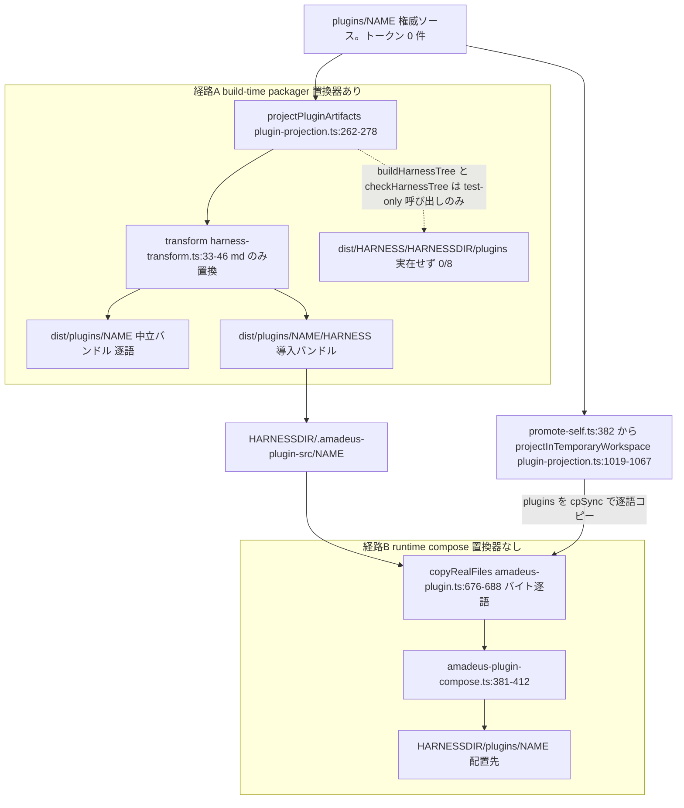
```mermaid
flowchart TD
    SRC["plugins/NAME 権威ソース。トークン 0 件"]

    subgraph PATH_A["経路A build-time packager 置換器あり"]
        PPA["projectPluginArtifacts plugin-projection.ts:262-278"]
        TRANS["transform harness-transform.ts:33-46 md のみ置換"]
        NEUTRAL["dist/plugins/NAME 中立バンドル 逐語"]
        FACES["dist/plugins/NAME/HARNESS 導入バンドル"]
        TREE["dist/HARNESS/HARNESSDIR/plugins 実在せず 0/8"]
    end

    subgraph PATH_B["経路B runtime compose 置換器なし"]
        COPY["copyRealFiles amadeus-plugin.ts:676-688 バイト逐語"]
        COMPOSE["amadeus-plugin-compose.ts:381-412"]
        OUT["HARNESSDIR/plugins/NAME 配置先"]
    end

    SELF["promote-self.ts:382 から projectInTemporaryWorkspace plugin-projection.ts:1019-1067"]
    STAGING["HARNESSDIR/.amadeus-plugin-src/NAME"]

    SRC --> PPA
    PPA --> TRANS
    TRANS --> NEUTRAL
    TRANS --> FACES
    PPA -.->|buildHarnessTree と checkHarnessTree は test-only 呼び出しのみ| TREE
    FACES --> STAGING
    STAGING --> COPY
    SRC --> SELF
    SELF -->|plugins を cpSync で逐語コピー| COPY
    COPY --> COMPOSE
    COMPOSE --> OUT
```

**テキスト代替**: 権威ソース `plugins/<name>` から出る枝は 2 本ある。経路A は `projectPluginArtifacts` → `transform` → 中立バンドル `dist/plugins/<name>` と各ハーネス導入バンドル `dist/plugins/<name>/<harness>`。`buildHarnessTree` / `checkHarnessTree` が作るはずの `dist/<harness>/<harnessDir>/plugins/` は実在しない（8 面すべてで 0）。経路B は `copyRealFiles` のバイト逐語コピー → `amadeus-plugin-compose` → `<harnessDir>/plugins/<name>`。経路B の入力は導入バンドル経由の staging（`.amadeus-plugin-src`）と、self-install では `projectInTemporaryWorkspace` が `plugins/` を temp workspace へ逐語 `cpSync` した結果の2系統。置換器は経路A にしかない。

### N-1 / N-2 — 経路A の実効は現状 no-op（PROVEN）

- **N-1**: 述語 `diff -r plugins/pr-convergence dist/plugins/pr-convergence/<h>/plugins/pr-convergence` を 8 面すべてで実行 → **8/8 IDENTICAL**。`sed -n '180p'` を中立バンドル + 8 面に適用 → **9/9 が `.claude/tools/` を運ぶ**。`plugins/` にトークンが 0 件であるため、**`transform()` は plugins コーパスに対して現状 100% no-op**であり、置換器はこのコーパスで一度も発火していない。
- **N-2**: `buildHarnessTree` / `checkHarnessTree` の呼び出し元は**テストのみ**。`scripts/package.ts` は `pluginBundleExpected` だけを import する（`:67`、`:873`）。述語 `find dist/<harness> -maxdepth 3 -name plugins` を 8 面すべてに適用 → **0 hit**。すなわち `dist/<harness>/<harnessDir>/plugins/` は**一度も生成されない**。これは `plugin-projection.ts:4-5` の header コメントと矛盾する。実際に生成されるのは `dist/plugins/<name>/`（中立・逐語）と `dist/plugins/<name>/<harness>/`（導入バンドル・transform 適用）の 2 つだけ。

### N-3 — self-install は build script の中から経路B に乗る（PROVEN、本節で最重要）

`plugin-projection.ts:1019-1067` `projectInTemporaryWorkspace` は、`:1025` で `dist/<harness>` を temp workspace へコピーし、`:1031` `cpSync(pluginsSource, join(workspace,"plugins"))` で**権威 `plugins/` を逐語コピー**し、`:1035` で `amadeus-plugin.ts compose` を spawn する。呼び出し元は `scripts/promote-self.ts:382` `buildSelfInstallProjection`。

したがって **`.claude/` / `.codex/` / `.cursor/` / `.opencode/` / `.kimi-code/` の plugin ツリーは 100% 経路B の産物であり、`transform()` を一度も通らない**。「build-time = 置換済み / runtime = 逐語」という素直な二分法は**成立しない** — build script が経路B を起動しているためである。修正案を「packager 側だけ直す」形で置くと self-install 5 面には届かない。

### N-4 — 生きた漏洩（PROVEN）

self-install 5 面 × {`plugins/…`, `.amadeus-plugin-src/…`} = **10 ファイル**すべてが同一ブロックを運ぶ。例: `.codex/plugins/pr-convergence/stages/pr-convergence.md:180` が `.claude/tools/` を指す。述語 `git ls-files` → `dist/` の tracked ファイル **0**、self-install `plugins/` の tracked ファイル **0**（すべてマシンローカル生成物）。**修正が触るのはソースと、必要なら transform ロジックのみ**である。

### 同根の兄弟欠陥 — 計 12 行、機序は1つ

述語 `grep -rn "amadeus-sensor.ts\|bun plugins/\|bun \.claude" plugins/ --include="*.md"` → **12 行**。内訳は patient `pr-convergence.md:180` と、repo ルート相対 `bun plugins/<name>/tools/<tool>.ts` 形の 11 行（`pr-convergence.md:54/:80/:162/:214`、`formal-model-check.md:48`、`tla-authoring.md:65/:68/:110/:113/:116`、`formal-model-check/README.md:111`）。

**DEDUCED（強）**: この 11 行は消費者ワークスペースでは解決しない。compose の書き出し先は `<harnessDir>/plugins/<name>/tools/…` であり（上記経路B）、`installDoc`（`plugin-projection.ts:620-664`）は消費者ワークスペースに repo ルート `plugins/` を作る指示を**一度も出さない**（指示は導入バンドルを `<harnessDir>/.amadeus-plugin-src/<name>/` へ置くか `bun <harnessDir>/tools/amadeus-plugin.ts install <path>` を実行する形のみ）。本 repo で動いているのは権威ソースがルートに在るからにすぎない。

構造的含意: patient はハーネスを**固定**し、他 11 行はハーネス接頭辞を**落とした**。**両者が要求する機構は同一の `{{HARNESS_DIR}}` 置換である** — 入れれば 12 行すべてが射程に入り、入れなければ 12 行すべてが壊れたまま残る。（`formal-model-check/README.md` は `plugin.json` の stages/tools に無く compose 対象外だが、導入バンドルには同梱される。）

### N-7 — compose 側へ置換を移す場合の隠れ結合（PROVEN な所在、影響は DEDUCED）

`amadeus-plugin-compose.ts:921-972` の `pluginContentDigest` / `digestBytes` は `plugin.manifest.stages` / `.tools` の**バイト**を sha256 する。置換を compose 内へ移す場合、digest を置換前に取るか置換後に取るかで**クロスハーネスの staleness 意味論**が変わり、t416 の determinism テストの意味も変わる。設計段で明示裁定を要する。

### N-8 / N-9 — 先例と配送範囲（PROVEN）

- **N-8**: 述語 `grep -rn "{{HARNESS_DIR}}/tools/" packages/framework/core/ --include="*.md" | wc -l` → **92**。散文中のツール呼び出しに対するトークン形は core で確立している（`conductor.md:105`、`reverse-engineering.md:139` 等）。ただし **core には散文中の手動センサー fire の先例が無い**（`grep -rn "amadeus-sensor.ts fire" packages/framework/core/` は `.ts` / hooks のみにヒットし `.md` は 0）。
- **N-9**: `plugin.json` は composed ツリーへ配送されない。`.claude/plugins/pr-convergence/` は `stages/` と `tools/` のみを持ち、manifest は staging `.amadeus-plugin-src/` にのみ存在する。

### harnessDir 実測値（`packages/framework/harness/*/manifest.ts`）

| harness | harnessDir | 定義 |
|---|---|---|
| claude | `.claude` | `:45` |
| codex | `.codex` | `:24` |
| cursor | `.cursor` | `:30` |
| kimi | `.kimi-code` | `:35` |
| kiro | `.kiro` | `:27` |
| kiro-ide | `.kiro` | `:24` |
| opencode | `.opencode` | `:35` |
| pi | `.pi` | `:15` |

**8 ハーネス / 7 個の相異なるディレクトリ**（`.kiro` が共有）。`amadeus-harness.ts:38-46` `KNOWN_HARNESS_DIRS` と一致。self-install 面は 5（claude / codex / cursor / opencode / kimi）。

### UNMEASURED（本 intent で測っていない。設計段へ持ち越し）

- 実際にトークンを挿入して `bun run build` / `promote-self` を通した end-to-end 挙動
- dogfood でない実消費者ワークスペースでの試行
- `dist/pi` / `dist/kimi` / `.pi` / `.kimi-code` が `SCAN_ROOTS` に無いことの blast radius
- `harnessStageEntry` がホスト側 stage 読み取りをどう解決するか
- `resolveHarnessToolsDir`（`amadeus-plugin.ts:368`）が非散文ランタイム経路のハーネス差をどこまで吸収するか

## 観測可能区間集計のアーキテクチャ（260809-cg-attribution-stats、履歴、observed `82e2f30c0`）

### 現行構造と変更境界

現行 `amadeus-stage-stats.ts` は、監査シャードを直接列挙し（`:847-872`）、`intent×stage` ごとの FIFO で `STAGE_STARTED → STAGE_COMPLETED` を窓化し（`:132-176`）、idle 区間を clip/union して差し引き（`:200-321`）、単一 `StageStatsReport`（`:515-527`）から3 renderer（`:632-723`, `:935-939`）へ出力する、Bun 上の単一プロセス read-only CLI である。

本 intent はこの流れを置換せず、既存 report の後方互換フィールドへ **attribution section を append-only で追加**する。設計境界は次の2層で分ける。

1. **既存 measured 層**: `scanCorpus → buildWindows → subtractIdle` と既存 stage duration/sensor/model/reviewBuckets の意味・母集団を保存する。
2. **新規 attribution 層**: measured window に stable internal identity と FIFO collision metadata を結び、`netSeconds > 0` かつ identity が一意な窓だけを lifecycle interval 会計へ送る。

この分離により、`zero-net-attribution` と `ambiguous-window-identity` は attribution から fail-closed で除外・報告できる一方、既存の measured population を改変しない。`buildWindows` は現在 pending queue を `shift()` するだけで collision を記録しない（`:135-176`）ため、window identity の診断 metadata は window 構築時に採取し、意味的な対応推定は行わない。

### 正準データフロー

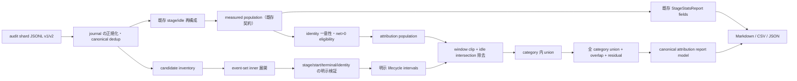
```mermaid
flowchart LR
    A["audit shard JSONL v1/v2"] --> B["journal の正規化・canonical dedup"]
    B --> C["既存 stage/idle 再構成"]
    B --> D["candidate inventory"]
    D --> E["event-set inner 展開"]
    C --> F["measured population（既存契約）"]
    F --> G["identity 一意性・net>0 eligibility"]
    E --> H["stage/start/terminal/identity の明示検証"]
    G --> I["attribution population"]
    H --> J["明示 lifecycle intervals"]
    I --> K["window clip + idle intersection 除去"]
    J --> K
    K --> L["category 内 union"]
    L --> M["全 category union + overlap + residual"]
    M --> N["canonical attribution report model"]
    F --> O["既存 StageStatsReport fields"]
    O --> P["Markdown / CSV / JSON"]
    N --> P
```

監査 codec の正本は mixed v1/v2 reader と shard merge/dedup を持つ `amadeus-journal.ts`（`:30-35`, `:99`, `:109-110`, `:130-143`, `:481-497`, `:534-549`, `:608-640`）である。現 `scanCorpus` は shard ごとに `readJournalRecords` を呼ぶが `mergeShards` を使わない（`amadeus-stage-stats.ts:827-872`）。したがって **事実**として duplicate clone/idempotency の扱いが正本と分離している。**設計判断**として、attribution は journal 正準 dedup 後の列を入力にし、その後に同一 lifecycle identity の重複 start/terminal を fail-closed で理由計数する。canonical dedup と lifecycle collision を混同しない。

### event eligibility と interval 会計

event は intent が window と一致し、event 自身または同じ event-set envelope 内の canonical `Stage` / `Stage slug` / `origin.stage` が対象 stage と完全一致するときだけ eligible である。containment や同一 timestamp は stage identity に使わない。候補 inventory は全て保持し、区間化できないものも candidate×reason に残す。

| candidate | 対応 | identity | category | 現断面での根拠・扱い |
| --- | --- | --- | --- | --- |
| `SENSOR_*` | `FIRED → PASSED/FAILED/BUDGET_OVERRIDE` | `Fire id` | `sensor-execution` | `Stage slug` が明示される（`amadeus-sensor.ts:521-536`, `:819-865`）。現 corpus で唯一すぐ区間採用可能 |
| `EXECUTION_EVENT_SET_COMMITTED` | inner `operation-started → operation-finished` | `operationId` | `execution-lifecycle` | contract は ID と `origin.stage` を持つ（`amadeus-execution-contract.ts:30-46`, `:101-154`）が現 corpus の terminal は0。missing terminal を報告 |
| `UNIT_POOL_EVENT_SET_COMMITTED` | inner `unit-acquired → unit-settled` | `attemptId` | `unit-pool-lifecycle` | inner lifecycle は存在（`amadeus-unit-pool.ts:80-93`, `:130-148`）するが outer の stage 明示が現 corpus で0。不採用理由 `stage-identity-missing` |
| `BOLT_*` / `SWARM_*` / `SUBAGENT_*` / `LOOP_MONITOR_*` / `MERGE_DISPATCH_*` | event 固有 | event 固有 | event 固有 | stage/start/terminal/identity の全条件が揃うまで inventory のみ。runtime の containment 補完は再利用しない |
| transaction envelope | envelope 固有 | envelope 固有 | envelope 固有 | 同じ fail-closed 規則で inventory。不足理由を出す |
| `GATE_*` | 対象外 | 対象外 | 対象外 | approval wait は既存 idle subtraction 済みで category に二重計上しない |

区間は整数秒の半開区間 `[start,end)`。terminal が start より後でない、identity がない、開始/終端が欠ける、同一 identity が重複する、malformed/digest/duplicate event set は区間化しない。採用区間は measured window へ clip し、既存 idle span との交差を除き、category 内 union を取る。category 間は独立軸なので単純加算せず、全 category の別 union を `observableSeconds` とする。

各 attribution window で次を不変条件にする。

```text
0 <= observableSeconds <= netSeconds
unattributableSeconds = netSeconds - observableSeconds
coverage = observableSeconds / netSeconds
unattributableRate = unattributableSeconds / netSeconds
observableSeconds + unattributableSeconds = netSeconds
coverage + unattributableRate = 1
```

`netSeconds > 0` が attribution の前提なので NaN/Infinity は生成しない。category `n` は union が正の窓数、duration median/p95 はその集合、category share median/p95 は0秒窓を含む attribution population 全体を母集団にする。overlap は category 合計と全体 union の差を観測するが、category share 合計100%は要求しない。

## Interaction Diagrams

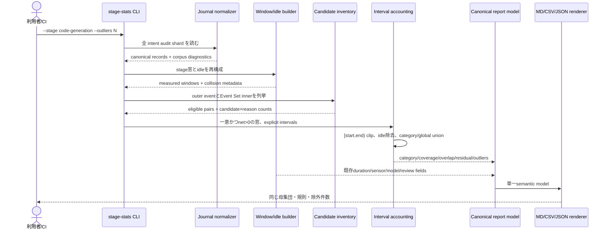
```mermaid
sequenceDiagram
    actor Operator as 利用者/CI
    participant CLI as stage-stats CLI
    participant Journal as Journal normalizer
    participant Window as Window/idle builder
    participant Inv as Candidate inventory
    participant Ledger as Interval accounting
    participant Model as Canonical report model
    participant Render as MD/CSV/JSON renderer

    Operator->>CLI: --stage code-generation --outliers N
    CLI->>Journal: 全 intent audit shard を読む
    Journal-->>CLI: canonical records + corpus diagnostics
    CLI->>Window: stage窓とidleを再構成
    Window-->>CLI: measured windows + collision metadata
    CLI->>Inv: outer eventとEvent Set innerを列挙
    Inv-->>CLI: eligible pairs + candidate×reason counts
    CLI->>Ledger: 一意かつnet>0の窓、explicit intervals
    Ledger->>Ledger: [start,end) clip、idle除去、category/global union
    Ledger-->>Model: category/coverage/overlap/residual/outliers
    Window-->>Model: 既存duration/sensor/model/review fields
    Model->>Render: 単一semantic model
    Render-->>Operator: 同じ母集団・規則・除外件数
```

別 stage の同秒 event は `Stage` 完全一致で落ち、stage 属性のない Bolt/Swarm/Subagent 等は window 内にあっても落ちる。runtime graph が行う latest-wins/containment attribution（`amadeus-runtime.ts:498-760`）は snapshot 用の別意味論であり、`RuntimeStage` 自体も terminal/interval を持たない（`:71-110`）。したがって本レポートの一次資料には使わず、raw normalized journal から再構成する。

### 出力境界と後方互換

`--stage` は attribution target の選択であり、既存 `stages[]` の全 stage 統計を削らない。`--outliers` は表示件数だけを制御し、集計母集団を変えない。全 renderer は `StageStatsReport` の同じ attribution section を読む。現在の JSON-only oversized pipe 証明（`t487:337-389`）を3形式へ広げ、Markdown/CSV は consumer 完走、JSON は `jq empty` まで証明する。

### 事実と推論の区別

- **事実**: 現 corpus probe は eligible 102窓すべてで帰属不能率50%超、execution terminal 0、unit-pool outer stage 0を示した。
- **推論**: sensor 以外の明示 lifecycle 区間を採れるようにするには、event-set の終端/stage identity など追加計装候補がある。ただし本 intent は計装を追加せず、`candidateBoundary` 仮説として observed facts と別フィールドに出す。
- **決定**: category 名を業務フェーズへ読み替えず、観測不能残余を保持する。これが Issue #2695 の「推定しない」境界を守る。

## 監査 journal の v1/v2 二重スキーマとリーダー面の構造（260807-intent-2328-tests-e2e-au、履歴、2026-08-07、observed `a5621236c`）

Issue #2328 の患部は「テストが1スキーマを決め打ちで読む」ことにあり、書き手側の欠陥ではない。監査 journal は **v1 と v2 が現役で共存する設計**であり、リーダーはその両方を受理しなければならない。

### スキーマ2形の正準定義

| 版 | 定数 | wire 形 | 定義 |
|---|---|---|---|
| v1 | `JOURNAL_SCHEMA_VERSION = 1` | `event` / `heading` / `fields` | `amadeus-journal.ts:30` |
| v2 | `JOURNAL_SCHEMA_VERSION_V2 = 2` | `eventName` / `attributes`（`attributes.Event` が旧 `event` 相当） | `amadeus-journal.ts:34`、serializer `:329-345` |

`amadeus-journal.ts:28-30` のコメントは v1 の現役性を逐語で宣言する — 「v1 is the switchover wire format still produced by the live writers (amadeus-audit.ts / amadeus-state.ts); keep this constant at 1 for them.」`JOURNAL_SCHEMA_VERSION_MAX = JOURNAL_SCHEMA_VERSION_V2`（`:36` 相当）が示すとおり、リーダーは MAX 以下の全版を受理する契約である。

### 書き手の2経路（v1 は削除されていない）

**v2 経路**（OTel 由来）: `amadeus-worktree.ts:635` `emitAudit` → `:95` `emitAuditEvent` → `packages/framework/core/otel/audit-emit.ts:48` → `appendAuditEntryViaEvents`。`WORKTREE_DISCARDED` はこの経路で v2 として書かれる。移行コミットは `771afe2a2`（#1850、HEAD 祖先であることを `git merge-base --is-ancestor` で実測確認）。

**v1 経路（現役3箇所）**: `amadeus-audit.ts:534`（lifecycle writer、`schemaVersion: JOURNAL_SCHEMA_VERSION`）/ `amadeus-audit.ts:597`（raw body 経路、`event: null`）/ `amadeus-state.ts:3193`。`INTENT_ARCHIVED` が v1 で書かれることを scan が実測している。

この2経路併存が本 intent の設計上の中核制約である — **v1 キーを v2 キーへ機械置換する修正は誤り**であり、リーダーは両形を正規化して受理する形でなければならない。

### リーダー面の正準様式

共有ハーネス `tests/harness/audit-records.ts` が canonical な正規化を提供する。

- `normalizeAuditRecord`（`:26`）— `schemaVersion !== 2` なら素通し、v2 なら `attributes.Event` を `event` へ、`EVENT_HEADINGS` 経由で `heading` を復元
- `auditRowsFrom`（`:49`）— shard 本文を行分割して全行正規化（空行のみ skip、他は parse 必須の loud 失敗）
- `countAuditEvent`（`:57`）— 両スキーマ横断のイベント計数

ヘッダコメントが設計意図を逐語で宣言する — 「a test that hand-parses the JSONL should do the same rather than pin one schema」。既に 59 ファイルがこのハーネスを消費している（`t118.test.ts:219` / `t45-revision-loop.test.ts:161` 等）。

**採用時の構造的注意**: `audit-records.ts:18` は `EVENT_HEADINGS` を `../../dist/claude/.claude/tools/amadeus-audit.ts` から import する。理由はコメントに明記されており、このハーネスが dist + docs + tests のみを持つ sandbox へコピーされるため `packages/` からの import が解決しないことによる。**e2e 層がこのハーネスを採用すると `bun run build` 前提が e2e へ持ち込まれる** — これは設計判断であり、requirements で裁定を要する。

### 検証面の非対称（CI 死角）

`--ci` プロファイルは `tests/lib/run-tests-args.ts:95-100` で `runSmoke` / `runUnit` / `runIntegration` のみを立てる（e2e は含まない）。`.github/workflows/ci.yml:224-227` がこの事実を逐語で認識している — 「The e2e tier is NOT part of `test:ci` (run-tests --ci is smoke+unit+integration), so the shipped plugin install journey would otherwise never run on a PR — which is how #1569 reached a release.」

CI 上で実行される e2e は `ci.yml:252` の `t341-plugin-conformance-journey.serial.test.ts` **1本のみ**であり、全層を回す nightly ジョブは存在しない。したがって **e2e 17ファイルの赤は CI から構造的に不可視**であり、これが #2328 が潜伏した機序である。

## 監査イベント面と読み手の生態（260807-stage-perf-report、履歴、observed `4a3da7d62`）

本節の file:line はすべて observed `4a3da7d62c3cc3dadda2dfb6225d30cfa985a8d0` 時点。差分 base は `b8e3e664f08185e0bd3e3b6d9b7f2dfb60c0ad7d`（祖先性 exit 0、距離 12 commits / 108 files）。全数列挙は `re-scans/260807-stage-perf-report.md` を正本とする。

### 2世代のスキーマ、1つのエンベロープ

監査ジャーナルは2つのスキーマ世代を同一のエンベロープで運ぶ。`packages/framework/core/tools/amadeus-journal.ts:30,34-35`:

```ts
export const JOURNAL_SCHEMA_VERSION = 1;
export const JOURNAL_SCHEMA_VERSION_V2 = 2;
export const JOURNAL_SCHEMA_VERSION_MAX = JOURNAL_SCHEMA_VERSION_V2;
```

`:28-29` のコメントは読み手にとって load-bearing である（verbatim）: `// v1 is the switchover wire format still produced by the live writers` / `// (amadeus-audit.ts / amadeus-state.ts); keep this constant at 1 for them.`

**v1 は単なるレガシーではない** — 一部の書き手は現在も v1 で新規行を書く。読み手が「v1 = 過去 / v2 = 現在」と時系列で分けることはできない。

v2 行は **v1 の監査イベント名を `attributes.Event` へ刻印**し、`eventName` は OTel 名（例 `amadeus.stage.started`）を運ぶ。したがって両スキーマとも `Stage` を同一キーで露出し、**`Event` が両スキーマで信頼できる判別子**になる。この正規化規約は `:113-129` に文書化されている。

### イベントレジストリ（全件 `durability: "canonical"`）

| イベント | file:line | requiredAttributes | 主な optional |
| --- | --- | --- | --- |
| `amadeus.stage.started` | `packages/framework/core/otel/event-registry.ts:317` | `["Stage", "Agent"]` | `Workflow`（`--single` の合成 id） |
| `amadeus.stage.completed` | `:345` | `["Stage", "Details"]` | `Artifacts`、`Transaction Id`、`Workflow`、`Completion Instance` |
| `amadeus.stage.awaiting.approval` | `:327` | `["Stage"]` | `Artifacts`、`Details`、`Recovered`、`Transaction Id` |
| `amadeus.stage.revising` | `:336` | `["Stage", "Revision count"]` | — |
| `amadeus.gate.approved` | `:511` | `["Stage"]` | `User Input`、`Grant Id`、`Swarm batch` |
| `amadeus.gate.rejected` | `:520` | `["Stage"]` | `Feedback`、`Recovered` |
| `amadeus.workflow.parked` | `:119` | `["Stage"]` | `Timestamp` |
| `amadeus.workflow.unparked` | `:128` | **`[]`** | `Timestamp` |
| `amadeus.session.started` | `:382` | `["Source"]` | — |
| `amadeus.session.ended` | `:409` | `["Reason"]` | — |
| `amadeus.session.resumed` | `:391` | `["Source"]` | — |
| `amadeus.human.turn` | `:418` | **`[]`** | `Presence Reservation Id` |
| `amadeus.sensor.fired` | `:849` | `["Fire id","Sensor ID","Stage slug","Output path"]` | — |
| `amadeus.sensor.passed` | `:858` | 上記 + `["Duration ms"]` | `Note` |
| `amadeus.sensor.failed` | `:867` | 上記 + `["Detail path","Findings count"]` | — |

集計設計に効く構造事実3件:

1. **`Harness` を宣言するイベントは存在しない。** `Model` / `Model Source` は subagent イベント（`:616` / `:629`）にのみ現れる（レジストリ全域 grep で確定）。**ハーネス軸の集計は監査からは組めない。**
2. **`WORKFLOW_UNPARKED` と `HUMAN_TURN` は `Stage` を運ばない**（requiredAttributes が `[]`）。idle 減算はこれらを stage キーではなく **intent 内の時刻順序**で帰属させる必要がある。
3. **`SENSOR_*` は `Stage slug`、stage ライフサイクル系は `Stage`。** 別キーであり、正規化層はこの2つを混同してはならない。

### emit サイトと承認・完了の同時性

- `STAGE_STARTED` — `amadeus-state.ts:2335`（`{Stage: nextSlug, Agent: nextStage.lead_agent}`）、`amadeus-jump.ts:619`（jump）、`amadeus-orchestrate.ts:4633`（`--single`）
- `STAGE_COMPLETED` — `amadeus-state.ts:3431` / `:2165`、`amadeus-orchestrate.ts:4646`
- `STAGE_AWAITING_APPROVAL` — `amadeus-state.ts:2877, 4064, 4138`
- `GATE_APPROVED` — `amadeus-state.ts:3420`、`amadeus-bolt.ts:1142`

**アルゴリズムが織り込むべき事実:** `GATE_APPROVED`（`:3420`）と `STAGE_COMPLETED`（`:3431`）は**同一 try ブロック内**で emit される。承認と完了はほぼ同時刻であり、したがって idle 区間 `STAGE_AWAITING_APPROVAL → GATE_APPROVED` はゲート付きステージの窓の**末尾**に位置する（中間ではない）。

### タイムスタンプ粒度 — 秒未満は構造的に解像不能

`amadeus-lib.ts:7740-7742`:

```ts
export function isoTimestamp(): string {
  return new Date().toISOString().replace(/\.\d{3}Z$/, "Z");
}
```

**ミリ秒は書き込み時点で捨てられている。** 秒未満のステージは事後にどう集計しても解像できない。

### `intentId` degradation とパス基準帰属

observed で再計測: `intentId==="intents"` の v1 行が **86,744 / 96,269（90.1%）**、それらの行を保持する distinct な intent ディレクトリは **95**。**パス基準の帰属は必須であり、かつ機能する** — degraded な行は 95 の実 intent ディレクトリへ散っており、ディスク上のパスから intent を復元できる。

### 読み手の生態 — 既存3面はいずれも本用途を満たさない

| 面 | 性質 | 本用途に使えない理由 |
| --- | --- | --- |
| `amadeus-journal.ts` | スキーマ非依存の正規化層（export 済み） | **使える。ただし誰も使っていない** — `journalRecordField:130` / `readJournalRecords:534` ほか。doc `:113-129` が逐語で "so they never branch on the schema version" と述べる |
| `amadeus-runtime.ts summary` | runtime-graph.json のスナップショット集計 | **構造的に遡及不能**。`:982-984` が "never re-walks audit" と宣言、`:1067-1070` はグラフのみを読む。`.gitignore:71` によりグラフは untracked（`git ls-files | grep -c` → 0）で過去 intent のグラフは存在しない。per-stage 所要時間・モデル・レビューイテレーションを持たない |
| `amadeus-observability.ts` | opt-in の telemetry **書き手** seam | サブコマンド 0（`import.meta.main` / argv 処理なし）。ヘッダ `:1-19` が **fail-open**（"a buffer write failure never throws into the caller"）を宣言。読み手は fail-closed であり**契約が正反対** — 名前空間は使用不可 |

`amadeus-journal.ts` の共有には反対圧力がある: `amadeus-subagent-stats.ts:21-23` が逐語で "This module deliberately does NOT import amadeus-lib.ts (the FD fixes the dependency direction stats -> observability only)" と依存方向の裁定を記録している。**共有層の採用は設計判断であり、import 可能性だけで機械的に決まらない。**

### ⭐ idle 減算の実現可能性（D1、observed 実測）

クロスレビュー2名は idle 混入を**フィルタ**（idle マーカーを含む窓を捨てる）で測り「clean な窓は median 0 秒 = trivial なステージしか clean でない」と結論した。observed で**減算**（#2405 が規定するアルゴリズム: `[AWAITING→GATE_APPROVED/REJECTED] ∪ [PARKED→UNPARKED] ∪ [SESSION_ENDED→SESSION_STARTED/RESUMED]` を区間マージし窓へクリップ）により再計測した結果:

```
windows=1532
raw wall-clock: median=674s  p95=12188s  mean=3109.7s
net (idle-sub): median=458s  p95= 7486s  mean=2076.8s
減算で 0 になった窓 30 / 元から raw 0 の窓 394
raw 1323.4h → net 883.8h（減算率 33.2%）
```

ステージ別 net 中央値は `code-generation` 5,183s（n=123）／`functional-design` 1,885s（n=64）／`reverse-engineering` 1,192s（n=127）／`build-and-test` 737s（n=115）／`delivery-planning` 297s（n=58）と**一桁の判別力**を持つ。

**減算は 1,532 窓をすべて保持する**のに対し、フィルタは 74% を捨て、残差は `workspace-scaffold` / `workspace-detection` / `state-init` に支配される。すなわち idle 減算は #2405 の完了条件として充足可能であるだけでなく、**指標を機能させている当のもの**である。

⚠️ **主張していないこと:** これらの net 値が*実作業時間を近似する*ことは検証されていない。検証されたのは、アルゴリズムが永続化コーパスに対して実装可能で非退化な出力を生むことのみである（`cid:requirements-analysis:c7-upstream-universal-claim-unverified`）。

## SUBAGENT_STARTED の emit 経路と hook 配線の3面構造（260807-subagent-start-pair、履歴、2026-08-08、observed `5f2ad9195`）

本節の測定 ref はすべて observed `5f2ad9195d9ce3ea55d6bf3d34509f2c5ca2c12b`（= 本 worktree HEAD）。差分 base は `4a3da7d62c3cc3dadda2dfb6225d30cfa985a8d0`（distance 2 commits = #2413 修正 + record sync #2416）。全数列挙と行番号 currency の確定は `re-scans/260807-subagent-start-pair.md` を正本とする。

対象は [#2297](https://github.com/amadeus-dlc/amadeus/issues/2297)（live `.claude/settings.json` に PreToolUse 配線が無い）と [#2303](https://github.com/amadeus-dlc/amadeus/issues/2303)（dispatch tool 語彙が実 payload と不一致）の**ペア**。どちらか一方だけを直しても `SUBAGENT_STARTED` は 0 件のままであり、両者は同一の観測結果に対する**直列な2つの必要条件**として結ばれている。

### emit 経路 — seam から audit 行までの単一鎖

`SUBAGENT_STARTED` を書く経路は分岐を持たない。ハーネス側の start seam → core フック → フィールド導出 → 監査 append の一本鎖で、各段に代替経路が存在しない。

```
[Claude Code]  PreToolUse{matcher ^Task$}  ─┐
                                            ├→ core/hooks/amadeus-log-subagent-start.ts
[kimi]         SubagentStart（専用イベント）─┘        :64  subagentStartFields(parsed, <agentsDir>)
                                                     :65  if (started === null) process.exit(0);   ← 唯一の中断点
                                                     :98  appendAuditEntryViaEvents("SUBAGENT_STARTED", fields, projectDir)
```

verbatim（`packages/framework/core/hooks/amadeus-log-subagent-start.ts:64-65`）:

```ts
const started = subagentStartFields(parsed, join(projectDir, harnessDir(), "agents"));
if (started === null) process.exit(0);
```

同 `:98`:

```ts
  appendAuditEntryViaEvents("SUBAGENT_STARTED", fields, projectDir);
```

**構造上の帰結（事実）**: emit は `:98` の1箇所のみ、判定は `:64-65` の1箇所のみ、判定関数 `subagentStartFields` の消費者も repo 全域で `:65` の1箇所のみ（`re-scans` §定数消費者を参照）。⇒ **迂回路は存在しない**。したがって (a) seam が配線されていない、(b) 判定が実 payload を拒否する、のいずれか一方でも成立すれば emit は構造的にゼロになる。#2297 が (a)、#2303 が (b) にあたる。

### 2つの payload 形状の収斂点

同じ関数が2種類の payload を受ける。この収斂は `packages/framework/core/tools/amadeus-lib.ts:4149-4153` に設計意図として逐語で記されている:

```
// Two payload shapes converge here: the tool envelope (PreToolUse{Task}, which
// carries subagent_type/prompt inside tool_input) and a dedicated start event
// (kimi's SubagentStart, which carries them at the top level and has no
// tool_name at all). Absence of tool_name therefore means "a seam that only
// fires for subagents", not "unknown tool".
```

| 形状 | 供給元 | `tool_name` | 型情報・prompt の所在 |
|---|---|---|---|
| tool envelope | Claude Code の `PreToolUse` | 実在（dispatch tool 名） | `tool_input.subagent_type` / `tool_input.prompt` |
| dedicated start event | kimi の `SubagentStart` | **不在** | トップレベル `agent_type` / `prompt` |

kimi 側の payload 構築は `packages/framework/harness/kimi/hooks/amadeus-kimi-lib.ts:732-741` で、`hook_event_name` / `agent_type` / `prompt` の3キーのみを持ち **`tool_name` キーを含まない**（verbatim 実読、observed 断面）。⇒ ガードの `payload.tool_name !== undefined &&` 短絡は kimi 経路の**存在条件**であり、#2303 の語彙修正はこの短絡を必ず通過側に残さねばならない。

### hook 配線の3面と包含の破れ

Claude Code の hook 配線は3つの面を持ち、それぞれ tracked 状態と形式が異なる。

| 面 | パス | tracked | hook 件数 | 形式 |
|---|---|---|---|---|
| **正本** | `packages/framework/harness/claude/settings.json.example` | tracked（`git ls-files --error-unmatch` exit=0） | 13 | 直接パス形 `… /.claude/hooks/amadeus-<name>.ts` |
| **投影** | `.claude/settings.json.example` | **untracked**（exit=1、source-only 境界の生成物） | 13（正本と byte 一致） | 同上 |
| **live** | `.claude/settings.json` | tracked（exit=0）かつ非 gitignore | **11** | **100% dispatcher 形** `… amadeus-dispatch.ts <slug>` |

live の 11 件はすべて `bun "${CLAUDE_PROJECT_DIR:-.}/.claude/hooks/amadeus-dispatch.ts" <slug>` 形（`grep -c 'amadeus-dispatch.ts' .claude/settings.json` → 11）。`grep -c 'PreToolUse' .claude/settings.json` → **0 / exit=1**。

**包含の破れは2件**（例の distinct hook script 12 − dispatcher スロット 10 = 2、差集合が live 欠落と完全一致）:

1. `PreToolUse{^Task$}` → `amadeus-log-subagent-start.ts`（= #2297 本文が名指す欠落）
2. `SessionStart` の2本目 → `amadeus-plugin-compose.ts`（**#2297 本文の射程外**。正本 `settings.json.example:44` に実在、live は SessionStart 1本のみ）

⇒ **live 欠落は #2297 本文より1件広い**。両者は「dispatcher スロット不在」という単一の構造原因から出ており、`example の hook script 集合 ⊆ 配線済み集合` という**1本の包含述語**で同時に閉じる。この構造は要件段のスコープ裁定（plugin-compose を同梱するか）に直結する — 詳細と賛否材料は `re-scans/260807-subagent-start-pair.md` §同梱可否。

### dispatcher の fail-closed 契約が課す設計制約

`packages/framework/harness/claude/hooks/amadeus-dispatch.ts` は10スロットの静的テーブル `HOOK_PATHS`（`:4-15`）を持ち、次の2つの fail-closed 契約を課す:

- `parseHookSlug`（`:24-27`）は未知 slug を throw → `main` の catch（`:107-110`）が exit 1。
- `ensureCompleteHookTree`（`:50-57`）は**全スロットのファイル実在**を要求する。verbatim:

```ts
  const missing = KNOWN_SLUGS.filter((slug) => !existsSync(join(projectRoot, HOOK_PATHS[slug])));
  if (missing.length === KNOWN_SLUGS.length) return "not-built";
  if (missing.length > 0) {
    throw new Error(`hook tree is incomplete — missing: ${missing.join(", ")}; run \`bun run build\``);
  }
```

**設計上の重要制約（事実）**: 全欠なら `not-built` として exit 0（fresh clone 保護）だが、**部分欠は throw → exit 1**。この throw は slug を問わず**全フックを巻き込む**。⇒ スロット追加は、対応する `.claude/hooks/amadeus-<name>.ts` が build で必ず生成されることとセットでなければ、既存 11 フック全体を落とす。追加候補2件（`amadeus-log-subagent-start.ts` / `amadeus-plugin-compose.ts`）は `packages/framework/core/hooks/` と自己インストール面 `.claude/hooks/` の**両方に実在済み**であり、この実在要件は現状で満たせる。

`forwardToHook`（`:68-92`）は `[process.execPath, hookPath, ...args]` を spawn し、`env: process.env`・stdin/stdout/stderr すべて `inherit`、SIGINT/SIGHUP/SIGTERM を転送する。⇒ **stdin は素通し**であり、フック側の `readHookStdin()` は dispatcher 経由でも直接パス形でも同一に動く。配線方式の選択（dispatcher 形 / 直接パス形）は**フック実装の挙動に差を生まない** — 差は形式の一貫性と再発防止ガードの述語形にのみ現れる。

### 再発防止ガードの ground truth 選択

live 設定の hook 集合を検査する面は observed にも**存在しない**（既存6ガードはすべて `AMADEUS_SRC`（= `dist/claude/.claude`）の example か正本 example を読む。`re-scans` §検査面の不在を参照）。新設 drift ガードの設計には2つの構造的制約がある:

1. **ground truth は正本（tracked）側でなければならない** — 投影面 `.claude/settings.json.example` は untracked で、fresh clone の `bun run build` 前には存在しない。投影面を基準にすると build 依存の偽赤/未検出になる。
2. **テキスト等価では比較できない** — 正本は直接パス形、live は dispatcher 形。11/13 件すべてが差分に見える。正規化キーの候補は `(event, matcher, hook script 名)` の三つ組で、hook script 名は dispatcher 形なら `HOOK_PATHS[slug]` の basename、直接形なら command 中の `amadeus-*.ts` から抽出する。

**方式選択がガード述語に与える影響**: dispatcher スロットを追加して live を dispatcher 形で配線すると、検査は「example 集合 ⊆ スロット集合」の**単一述語**で閉じる。live に直接パス形を混在させると「⊆ スロット ∪ 直接配線」の**2項述語**が要る。この対比は要件段の材料であり、本節では裁定しない。

### #2297 と #2303 の直交性と閉包の非対称

| | Unit A（配線 / #2297） | Unit B（語彙 / #2303） |
|---|---|---|
| 変更面 | `.claude/settings.json`、`amadeus-dispatch.ts`（方式次第）、新規 drift ガード | `amadeus-lib.ts`、テスト15箇所、`amadeus-log-subagent-start.ts`、doc 群 |
| ファイル交差 | **なし**（2件の交差候補は `re-scans` §Unit 依存に記録） | 同左 |
| 閉包の実証 | **テスト内で構造的に不能** — 既存の閉包テストは `CLAUDE_PROJECT_DIR` を fixture へ向けフックを直接 spawn するため `.claude/settings.json` を読まない | 既存 `t-log-subagent-start.integration.test.ts` の形（フック spawn + 監査行読み）で決定的に実証可能 |

⇒ **worktree 隔離の並行実装は可能だが、真の end-to-end 閉包（live dispatch で監査行が1行出ること）は両方の着地後にしか観測できず、かつテスト内では担保できない**。Unit A の閉包は drift ガード（正本 ⊆ live の正規化包含）が代替的に担う設計になる。この未検証面は `cid:build-and-test:verdict-names-unverified-facets` の適用対象として build-and-test の verdict に明示されるべき事項。

## pr-convergence の landed 未対応と閉集合構造（260807-merged-pr-convergence、履歴、2026-08-07、observed `4a3da7d62`）

本節の file:line はすべて observed `4a3da7d62c3cc3dadda2dfb6225d30cfa985a8d0` 時点。差分 base は `b8e3e664f08185e0bd3e3b6d9b7f2dfb60c0ad7d`（祖先性 exit 0、距離 12 commits / 108 files）。全数列挙・verbatim 断片・実装上の注意 7 点は `re-scans/260807-merged-pr-convergence.md` を正本とする。

- **landed 未対応の機序**（Issue #2401）: `evaluateConvergence`（`plugins/pr-convergence/tools/pr-convergence-predicate.ts:180-192`）の CLEAN 必要条件は MERGED PR で恒久不成立。`MergeStateStatus` union（`:90-98`）に MERGED は無く未知値は throw（`:117-121`）。report の非収束 refuse（`pr-convergence-cli.ts:438-447`）と override の already-converged refuse（`:468-474`）のどちらにも乗らない**第3状態としての新分岐追加**が是正方向（既存2状態の pin と両立する非破壊追加）。
- **kind 閉集合の3面同期** — `ConvergenceReport` kind union（`cli.ts:61-76`）/ `renderReport`（`:89-129`）/ sensor の kind 閉集合＋整合分岐（`amadeus-sensor-pr-convergence-report-format.ts:69` / `:122-130`）。sensor は core→plugin import 禁止（ヘッダ `:16-20`）で drift 防止は t450 の renderReport 由来 fixture。
- **投影経路** — canonical は repo root `plugins/`（`scripts/package.ts:86-87` の pluginsRoot 解決）。opt-in は `amadeus/config.json:41` に `"pr-convergence"`（区間内 #2388 で着地）。`.claude/plugins` は未追跡生成物。**患部 `plugins/pr-convergence/` の区間内変更は 0 件**（observed から不変）。

## project-dir 解決の2梯子非対称（260807-projectdir-worktree-fix、履歴、2026-08-07、observed `4a3da7d62`）

本節の測定 ref はすべて observed `4a3da7d62c3cc3dadda2dfb6225d30cfa985a8d0`。差分 base は `b8e3e664f08185e0bd3e3b6d9b7f2dfb60c0ad7d`（12 commits）。全数列挙は `re-scans/260807-projectdir-worktree-fix.md` を正本とする。

### 構造 — 同一の責務に2つの梯子

`packages/framework/core/tools/amadeus-lib.ts` は project root の解決を**2つの独立した関数**で実装している。両者は同じ問い（このプロセスが書くべき workspace はどこか）に答えるが、段構成が異なる。

| 段 | CLI 側 `resolveProjectDir` `:226-250` | hook 側 `resolveProjectDirFromHook` `:310-347` |
|---|---|---|
| 1 | `if (explicitDir) return explicitDir;` `:228` | `if (payloadCwd && hasWorkspaceMarker(payloadCwd)) return payloadCwd;` `:317` |
| 2 | `if (process.env.CLAUDE_PROJECT_DIR) return ...` `:231` | `if (process.env.CLAUDE_PROJECT_DIR) return ...` `:320` |
| 3 | script path 由来（`stripHarnessLeaf(scriptDir, "tools")`）`:236-238` | `findWorkspaceMarkerAncestor(process.cwd())` `:329-330` |
| 4 | cwd に既知 harness dir があるか `:242-246` | script path 由来（`stripHarnessLeaf(scriptDir, "hooks")`）`:333-335` |
| 5 | （なし） | cwd に既知 harness dir があるか `:338-343` |

**非対称は2面ある**:

1. **marker 段の欠落** — hook 側の段1（marker 付き payload cwd）と段3（cwd 祖先の marker 探索）に対応する段が CLI 側に存在しない。
2. **段2 の相対順位** — hook 側は marker 付き payload cwd が env を**上回る**が、CLI 側は env が段2で無条件に勝つ。

hook 側の doc-comment `:306-309` はこの設計の理由を逐語で記す: `It outranks CLAUDE_PROJECT_DIR because that env var is pinned to the launch directory (the main checkout) and does NOT follow a session into a git worktree`。**同じ理由は CLI 側にもそのまま当てはまるが、CLI 側には適用されていない。**

### 導入経緯（`git log -L` 実測）

- `hasWorkspaceMarker` / `findWorkspaceMarkerAncestor` / hook 段3 → **`392a2d781`**（2026-07-09、#641/#682）
- hook 段1（payload cwd）→ **`e12259ba7`**（2026-07-26、#1482/#1493）

`392a2d781` は `resolveProjectDir` を**一切変更していない**（`git show 392a2d781 -- amadeus-lib.ts | grep -E "^[+-].*resolveProjectDir\b"` → 出力ゼロ、exit=0）。コミットメッセージも `resolveProjectDirFromHook` のみを名指しする。

**事実と仮説の分離**: 「CLI 側が検討されなかった」ことは断定できない（証拠の不在は不在の証拠ではない）。コミット記録が示すのは、**CLI 側への変更も検討の痕跡も残っていない**ことのみ — スコープ限定の帰結と読むのが自然だが、これは仮説である。

### workspace marker の定義と適用限界

`amadeus-lib.ts:283-286` verbatim:

```ts
function hasWorkspaceMarker(dir: string): boolean {
  if (!isDir(join(dir, "amadeus"))) return false;
  return KNOWN_HARNESS_DIRS.some((h) => isDir(join(dir, h, "tools")));
}
```

`amadeus/` と `<harness>/tools/` の**両方がディレクトリであること**を要求する（`isDir` `:266-272`。両半がディレクトリでなければならない旨は `:280-282` のコメントが #641 レビュー是正として明記）。

**構造的限界**: `.claude/**` は `.gitignore:24` で ignore され、`.claude/` 配下の tracked ファイルは3件のみ（`CLAUDE.md` / `hooks/amadeus-dispatch.ts` / `settings.json`）。`git ls-files .claude/tools` → **0件**。`.claude/tools/` は完全な未追跡生成物であり、`bun run build` 前の worktree は marker の後半を満たさない。**したがって marker ベースの drift ガードは build 前 worktree を構造的に検出できない** — `resolveProjectDir` に hook と同じ marker 段を足す設計は、この盲点を継承する。

### 設計上の帰結

- marker 段の追加だけでは**ケース C+env は閉じない**（env 段2 が上位に残る限り、worktree 内の正しい lib を読んでいても本線へ倒れる）。段順そのものの再設計が要る。
- 段順の再設計は [#1287](https://github.com/amadeus-dlc/amadeus/issues/1287)（OPEN、enhancement）と射程が重なる。
- 段1（明示 `--project-dir`）を正規形に据える案は新機構を要さない — core/tools の 18 ツールが既に `"--project-dir"` を parse し、共有ヘルパー `stripProjectDir`（`amadeus-lib.ts:212-224`）を runtime / sensor / learnings が使用する。

### 交差判定

`gh pr list --state open` → **0件**（exit=0）。resolver 周辺に交差する進行中変更なし。base→observed の 12 commits も resolver 領域を触っていない（`amadeus-lib.ts` の差分は `+143/-0` で全行が `:4983` 着地、患部区間 210-360 は review SHA `75a1c198d` と `cmp` IDENTICAL / exit=0）。


## fail-closed ガードの回復経路（260807-failclosed-recovery-path、履歴、observed `b8e3e664f`）

本節の測定 ref はすべて observed `b8e3e664f08185e0bd3e3b6d9b7f2dfb60c0ad7d`。差分 base は `7060956c5617125dd2f4e284957aa180cb306484`（祖先性 exit 0、距離 76 commits / 1223 files）。全数列挙は `re-scans/260807-failclosed-recovery-path.md` を正本とする。

### 3患部に共通する結線形

```
            検出                              回復
#2313  freshness 述語 → throw            currentBindingIsValidForEvent が
       (adapter:226-240)                 false を返したときだけ
                                         proveIdentityOnlyRebind へ（evidence.ts:162-171）
                                         → throw はどの回復分岐にも到達しない

#2330  parseStore が schema !== 2 で      readStore は「store 不在」のときだけ
       reject (advisory-choice:659-661)  空の schema 2 を返す（:681-691）
                                         → 既存 schema 1 ファイルは常に parse 失敗
                                         → 呼び出し側 !ok → fail-closed hold
                                         → hold を解く CLI verb が存在しない（:1516-1532）

#2358  uncovered.length === 0 →          「unit ディレクトリを作れ」の案内のみ
       errorDirective                    （orchestrate:3727-3731）
       (orchestrate:3707-3733)           → 作るべき仕事が残っていない状況では実行不能
```

**共通形**: いずれも「異常を検知して止める」側は結線済みで、「止まった状態を解消する」側が結線されていない。#2313 は throw と回復分岐が**排他**（throw すると回復条件の評価に到達しない）、#2330 は回復条件が**不在時のみ**に限定、#2358 は回復案内が**到達不能な行為**を指す。これは `cid:requirements-analysis:symmetric-pair-review` が言う対操作の非対称（write⇔check / emit⇔terminal）の、**detect⇔recover 面**である。

### #2313 — evidence reconcile の分岐構造

```
scripts/no-silent-drop-evidence.ts  reconcile
  └→ adapter.currentBindingIsValidForEvent(registry, eventRevision)
       ├ binding が event の祖先でない → false → 回復（proveIdentityOnlyRebind）へ
       └ binding が event の祖先       → freshness 述語（:226-240）
            ├ git diff --quiet が status 0（変更なし） → true（no-op で終了）
            └ status 1（変更あり） → throw REBIND_NON_IDENTITY_DRIFT   ← 現在ここで恒久停止
```

祖先性の実測（observed）: `git merge-base --is-ancestor fe8c701ba b8e3e664f` → **exit 0**。すなわち主分岐（freshness）へ入る。freshness 述語が読むパス集合は `packages/framework/core/tools` と `:(glob)tests/no-silent-drop/**/*.ts` の2要素で、前者は **gate が走査するコーパス**であってゲート実装ではない。区間 `fe8c701ba..b8e3e664f` で前者に3ファイルの変更があるため（`amadeus-lib.ts` / `amadeus-subagent-observability.ts` / `amadeus-subagent-stats.ts`）、drift が立って throw する。

**正準側は別集合を持つ**: `tests/integration/t413-no-silent-drop-ci-adoption.test.ts:181-195` の述語は `":(glob)tests/no-silent-drop/**/*.ts"` と `"tests/no-silent-drop-gate.ts"` の2要素で、`packages/framework/core/tools` を**意図的に除外**する。選定理由コメント逐語: "Freshness is asserted over the gate's own implementation only. packages/framework/core/tools is the corpus the gate scans, not the gate: … it needs an evidence-regeneration path, not a pin here." 同集合での実測は exit 0（drift なし）。**すなわち adapter の広域 set と t413 の narrow set は同じ意味論の2実装であり、片方だけが広い。**

第2段の tree 証明（`adapter:316-324`）は `pullRequestHead` と `eventRevision` の root tree 一致を要求する。第1段（`:305-315`）は既に `EVIDENCE_BUNDLE_PATHS` の3ファイル（`adoption-evidence-manifest.json` / `adoption-evidence.json` / `evidence/adoption-runs.json`、実体は `tests/no-silent-drop/evidence-rebind.ts:24-30`）を除外した tree 比較の形を持つ。**回復経路を設計するとき、この2段構えのどちらに乗せるかが結線上の分岐点になる。**

### #2330 — advisory choice store の schema 遷移

```
readStore(path)
  ├ ファイル不在        → 空の schema 2 store を返す（:681-691）
  └ ファイル実在        → parseStore
                            ├ schema === 2 → ok
                            └ schema !== 2 → reject（:659-661）→ 呼び出し側 !ok → hold
parsePending
  └ value.schema !== 1 を拒否（:640-651）= pending エントリ自体は schema 1 のまま
```

**設計コメントの明文**（`:653-657` 逐語）: "Schema 2 (#2253). A schema 1 store on disk is NOT translated: it fails to parse, and the caller's existing `!storeResult.ok` arm turns that into a fail-closed hold. …the safe answer to that question is to ask the human again — which the hold already does."

この設計は「hold が人間へ訊き直す」ことを前提に成立するが、**hold を人間の操作で解く入口が CLI に無い**。加えて `amadeus-orchestrate.ts:797-799` の `applyPendingAdvisoryGuard` は `if (pending.length === 0) return directive;` で早期 return するため、evaluator がもう advisory を raise しない intent では guard 経路自体が走らず、「訊き直し」も起きない。

結線上の要点: `parsePending` が schema 1 を**受理する**（`:640-651`）ため、**pending エントリは salvage 可能な形で残っている**。回復は「schema 1 の pending を読んで schema 2 の store を書き直す」形が結線的に成立しうる。

### #2358 — degrade 経路の unit 解決

```
degradeUnitResolutionError（orchestrate:3707-3733）
  ├ uncovered.length >= 1 → 通常の解決へ
  └ uncovered.length === 0 → errorDirective（:3727-3731）
        "Every one of them already holds this stage's required artifacts, so no unit is left to run."
        "Create the unit directory for this piece of work …, then re-run `next`."

unitCovered（:3746-3760）: produces の実在のみで判定。§12a Review の記録有無を見ない（= #2359 と共有する述語）
単一 unit の解決（:3807）: if (candidates.length === 1) return { unit: candidates[0], uncovered };  ← covered でも解決する
```

**非対称は意図的**: `t367-degrade-unitname-resolution.test.ts:411-420` が test 13（複数 unit 全被覆 → refuse）を pin し、直後の test 14（`:428-437`）が「a lone finished unit still resolves, carrying the stage gate」を pin する。`:422-426` のコメントが E-OBB2-CG1 を「INTENTIONAL と裁定した非対称」と明記する。**詰みは multi-unit 限定**であり、単一 unit では既にゲートが運ばれる。

したがって回復の結線は「multi-unit・全被覆の状態に対して、単一 unit と同じくゲートを運ぶ明示的な宣言入口を与える」形になる。`unitCovered` の述語自体（Review 記録を見ない点）は #2359 の射程であり、本 intent の宣言受理点はその hook を塞いではならない。

### 区間内の構造変化（患部に隣接するもの）

- **no-silent-drop の世代交代（#2338 / PR #2353 = `fe8c701ba`）**: `baseline.json` / `exemptions.json` を削除し、append-only ULID イベント台帳（`tests/no-silent-drop/events/`、observed で 217 ファイル）へ置換。畳み込みは `foldEvents`（`events.ts:213`）→ `FoldedLedger`（`:58`）で、旧 doc 形へは `baselineDocFromFold`（`:305`）/ `exemptionsDocFromFold`（`:319`）が射影する。custody 検証は `listEventUlidsAtRevision`（`:323`）と `assertEventCustody`（`:438`）。`previousDigest` によるバイト束縛は廃止され、残骸は `model.ts:69,76` の optional field と `evidence-rebind.ts:407` / `bootstrap.ts:337,433` のコメントのみ。
- **この世代交代が #2313 の仮説的な起点**（未確定）: ratchet の入力が `baseline.json` から events 台帳の custody 照合へ移ったことが、reconcile 側の freshness 前提とずれた可能性がある。observed では因果は確定していない。
- CI の3ワークフロー結線: `ci.yml:121-157`（trusted base ratchet、PR / push / dispatch で base 解決を分岐）、`no-silent-drop-evidence-reconcile.yml`（`push: [main]`、GitHub App token）、`no-silent-drop-retention.yml`（新規、週次 + dispatch、snapshot 書込は専用ブランチの auto-squash PR で feature PR には混ぜない）。


## ハーネス跨ぎ引き継ぎ（cross-harness resume）の結線構造（260805-cross-harness-resume、履歴、observed `7060956c5`）

本節の file:line はすべて observed `7060956c5617125dd2f4e284957aa180cb306484` 時点。差分 base は `b938898f364160d4b5857e153579b40b5ab18372`（祖先性 `git merge-base --is-ancestor` exit 0、距離 34 commits / 493 files、`+43826 / −217`）。全数列挙・実測手順は `re-scans/260805-cross-harness-resume.md` を正本とする。

### 引き継ぎに関与する3層

| 層 | 実体 | ハーネス跨ぎでの性質 |
| --- | --- | --- |
| ワークフロー状態 | intent record（`amadeus/spaces/<space>/intents/<slug>-<id8>/`）— state / audit shard / 成果物 | **version-controlled、ハーネス非依存**。`docs/guide/11-session-management.md:7` の "the state lives in the intent's record dir, not the harness" が指すのはこの層 |
| セッション carrier | `amadeus/.amadeus-sessions/.current-session`、Kimi の `kimi-active-subagents.json` と2種の deny ラッチ | **gitignored = per-clone / per-worktree**。ハーネスも worktree も跨いで共有されない |
| 認可判定 | `amadeus-caller-authorization.ts:72` `authorizeMainConductor` | carrier 層のみを読む。**状態層を一切見ない** |

引き継ぎの破綻はこの層構造から出る。状態層はハーネス非依存で移動できるが、**認可判定は per-clone な carrier 層にしか接地しておらず、carrier はハーネスごとに書き手が異なる**。

### 認可ゲートの結線

`authorizeMainConductor`（`amadeus-caller-authorization.ts:72-115`）は単一の判定関数で、消費点は2つのみ:

- `amadeus-orchestrate.ts:2400` `refuseUnauthorizedKimiCaller` → `handleNext :2446` / `handleReport :4543` / `handlePark :5099` / `handleGateReserve :5326` / `handleGateReject :5387`
- `amadeus-state.ts:902` `enforceCallerAuthorization` → `:908-912` で `get` / `count` / `lookup` のみ除外し、残る全27語彙をゲート。**`case "park"` `:1024` / `case "unpark"` `:1027` を含む**

判定の分岐は `:75` の早期 return（`detectHarnessType() !== "kimi"` なら無条件 `authorized`）と、Kimi 経路の4つの拒否枝（`:81-85` deny ラッチ3種 / `:94` marker 不読・不正 / `:105` `.current-session` 空・不一致 / `:108` 読取例外）＋ `:111-115` の role 枝で構成される。

**構造的帰結（所見A）**: 復旧に使える verb がすべて同じゲートの内側にあるため、**拒否状態からの in-band 復旧経路が存在しない**。park の復旧文言は unpark を案内するが、その unpark 自体がゲートされる。復旧を成立させるには、復旧手段が**ゲートの外側**に置かれることが設計上の必要条件になる。

**構造的帰結（所見A'）**: 4つの拒否枝がすべて `callerAuthorizationError("unknown")`（`:117-122`）に畳まれ、原因が判別できない。文言に復旧手順も含まれない。conductor の決定的再現 C1 / C2 / C3 / C6 が同一出力になることを実測で確定した。

### carrier の書き手分布（8ハーネス対照）

`.current-session` の書き手は core hook **`amadeus-session-start.ts:97` `if (sessionId) writeCurrentSessionId(projectDir, sessionId);` の唯一箇所**（実体 `amadeus-lib.ts:2170`）。同 hook の `:88-96` コメントは「session_id を見るのはこの hook だけであり、CLI switch からは供給できない」と明記する。

- **書く**: `claude` / `kimi`（session_id あり）、`codex` / `cursor` / `kiro`（session_id が来たときのみ）
- **書かない**: `kiro-ide`（`amadeus-kiro-adapter.ts:261,266,388` で core hook を起動するが session_id を転送しない）、`opencode`（`plugins/` 構成で core hook 呼出なし）、`pi`（`extensions/amadeus-pi-extension.ts:779` `case "session-started"` でネイティブに処理、core hook 不使用）

**構造的帰結（所見B）**: carrier を書かない3面のセッションが直前に走ると、`.current-session` は別ハーネスの ID のまま／不在のまま残り、次に Kimi が起動したとき `:105` / `:108` に落ちる。**ユーザー要件の「8ハーネスの任意の組み合わせで引き継ぎ可能」は現行 carrier 設計では成立しない。**

### projectDir 解決の非対称（carrier 分裂）

同じ workspace を指すはずの2経路が別の解決規則を持つ:

- **core hook**: `amadeus-lib.ts:298` `resolveProjectDirFromHook` — `:305` payload cwd は **workspace marker を持つときだけ**採用 → `:308` `CLAUDE_PROJECT_DIR` → `:317` marker 祖先探索 → `:322` script path 由来 → `:329` known harness dir の5段ラダー
- **Kimi adapter**: `packages/framework/harness/kimi/hooks/amadeus-kimi-lib.ts:704` `const dir = env.cwd ?? projectDir;` — **raw cwd をそのまま採用、marker 検証なし**

marker を持たない cwd（サブディレクトリ・別 worktree）から起動すると、adapter が書く carrier と core hook が読む carrier が別ディレクトリに分裂する（所見C）。決定的再現 C6 で確定。

### 認可バイパス面

`amadeus-harness.ts:113-123` の `detectHarnessType` は `:114-116` で `process.env.AMADEUS_HARNESS_TYPE` を最優先し、次に `:118` `CLAUDECODE === "1"`、最後に `resolveHarnessDir()` を見る。**env を kimi 以外にすれば `:75` の早期 return が発火し、Kimi の認可境界が丸ごと素通りする**（対照実験で C1-C6 全ケース `authorized` を実測）。この経路は docs で認可への影響として説明されていない。あわせて `kiro-ide` は harness dir が `.kiro` のため type `kiro` に畳まれ、`detectHarnessType` の戻り値には現れない。

### resume 経路に一致検査がない

- resume 時のハーネス一致検査は不在（state の `Harness` フィールドの読み手は migrate 系のみ）
- 別 project dir（worktree）からの resume 専用経路は不在（`resolveProjectDir` のラダー上、明示 `--project-dir` のみ）
- `Worktree Path` フィールドは装飾で読み手を持たない（`amadeus-state.ts:4878` / `:5006` のコメント）

`docs/guide/11-session-management.md:7` の "Session resume works on every harness" は状態層については正しいが、carrier 層と認可層は保証していない — **文書上の契約と実挙動の不整合**。

### 区間内の変化

session lifecycle / caller-authorization / harness detection のコード面は区間内で無変更（当該パスの区間内コミットは `fc862e879` の1件のみで kimi `SKILL.md` の docs 変更）。**本節の構造は区間の外側で導入済みであり、区間内の退行ではない。**

## plugin seam 機構の半実装状態と3層 trust（260805-pr-convergence-plugin、履歴、observed `8409c2039`）

本節の file:line はすべて observed `8409c2039c5281e533db88a637649276d8bc4a73` 時点。差分 base は `b938898f364160d4b5857e153579b40b5ab18372`（祖先性 `git merge-base --is-ancestor` exit 0、距離 27 commits / 474 files）。全数列挙・probe 手順・引用の再解決表は `re-scans/260805-pr-convergence-plugin.md` を正本とする。

### plugin が host へ寄与できる4面

`parsePluginManifest`（`amadeus-plugin-compose.ts:339-345`）が構築する manifest は `{ name, stages, seams, fragments, tools }` の4種のみである。**`sensors` は schema に存在しない**。未知の top-level キーは拒否されず無視される（strict rejection なし）。参照実装 formal-model-check の sensor manifest も plugin バンドル内ではなく core 側 `packages/framework/core/sensors/amadeus-model-completeness.md` にあり、`plugins/formal-model-check/plugin.json` の `sensors` 出現数は 0。すなわち **plugin stage の frontmatter が `sensors: [...]` を宣言し、manifest 実体は core が所有する**のが現行アーキテクチャである。`tools/` は `TOOLS_DIR_PREFIX`（`:350`）配下限定で、stage path 空間との非交差を `:488-493` が強制する。

### seam 機構は語彙・merge・台帳・drop まで実装され、host stage 認識面だけが未着地

| 層 | 実装 | 状態 |
| --- | --- | --- |
| seam 語彙 | `amadeus-plugin-compose.ts:74` `SEAM_NAMES = ["produces", "consumes", "sensors", "required_sections"]` | 実装済み。直上コメント `:70-73` が「StageFrontmatter の list フィールドに対応する単一の membership source」と明示 |
| merge | `mergeSeamEntries` `:424-435` | 実装済み |
| 適用 | `applySeamContributions` `:699-719` | 実装済み |
| drop 復元 | `rebuildStageSeams` `:567-580` | 実装済み |
| **host stage 認識** | `parseHostStageSeams`（`amadeus-plugin.ts:258-270`）が 1 行目に `/^stage: (.+)$/` を要求 | **未着地**。実ステージ Markdown の 1 行目は `---` のため、リポジトリ内のどの実ステージも HostStage にならない |
| serializer | `serializeStageSeams`（`:555`）は 4 行の合成バイト形のみを吐く | **未着地**。コメント `:552-554` が `the real frontmatter serializer is U11+` と自認 |

この制約はリポジトリ自身が記述している（`tests/unit/t301-plugin-cli-seams.test.ts:7-10` が「buildHostSnapshot in t299 only ever feeds parseHostStageSeams full-markdown stage files (which fail the `stage:` first-line match)」と明記）。挙動は**無音スキップではなく loud reject** で、実ステージへ produces seam を宣言した manifest は `inspectPlugin` が `unknown-seam` で拒否する（`collectSeamErrors` `:498-511`、probe 実測）。

**アーキテクチャ上の含意**: 既存ステージの produces を plugin から overlay する経路は、機構の後半（merge / 台帳 / drop）が完成している一方で前半（実 frontmatter の parse / serialize）が存在しない。ここを接続する場合、**frontmatter を保存したまま対象配列だけを追記する serializer** が必要になる（現行 serializer は 4 行の合成形しか吐かないため）。この点は実装が存在しないため机上の帰結であり観測ではない。

### opt-in stage は stock workflow の per-unit ループへ参加しない

`applyPluginScopeOptIns`（`amadeus-graph.ts:1484-1502`）は plugin stage を scope-grid transpose の**生産者にせず**、厳密に加算の overlay として後段適用する。設計コメント `:1466-1483` が理由を明記する（plugin が既存 composed scope を宣言すると当該 scope の plan を自分の stage だけに置換してしまった #1630 の是正）。したがって `scopes: []` の plugin stage は grid の行を1つも触らず、stock scope から自動選択されない（`plugins/formal-model-check/stages/formal-model-check.md:4` の `condition:` が同旨を逐語で述べる）。

**帰結**: 「install した環境では既存ステージの全 Bolt に成果物を必須化する」形の寄与は、opt-in stage 形では構造的に実現できず、seam による既存ステージへの produces overlay 経路にのみ依存する。上記の未着地面がこの経路の唯一のボトルネックである。

### 3層 trust（compose / compile / run）は実在

- **compose**: `TrustGrant { plugin, contentDigest, grantTimestamp }`（`amadeus-plugin-compose.ts:161-165`）、`PluginStageIndexEntry.contentDigest`
- **compile**: plugin stage 発見 = `plugins/<name>/stages/<slug>.md`（`amadeus-graph.ts:1784-1798`）、`plugin_source?: true` を stamp（`:140-146`）
- **run**: O_NOFOLLOW + 同一 inode 再読み（`amadeus-graph.ts:1889-1901` verbatim `throw new Error("platform does not support O_NOFOLLOW (fail-closed)")`、`:1971` `// or ancestor, then O_NOFOLLOW-read the exact same inode.`）、grant / entry digest の形式検査 `/^sha256:[0-9a-f]{64}$/`（`:2061-2074`）

区間内で **import-closure guard** が加わった（#2240、`scripts/plugin-projection.ts:880-946`、+77行/−1行）。plugin の `tools[]` から相対 import で到達可能な全モジュールが manifest 宣言かつ owned でなければ projection を write-0 で拒否する（`assertPluginImportClosure`）。symlink 脱出は `repoFileReader` の realpath 境界で封鎖される。**plugin が tools を出荷する際の import 閉包全数宣言が新たな設計制約となった。**

### install / drop の可逆性は FS 実測で判定される

`handleDrop`（`amadeus-plugin.ts:1137-1186`）は plan → apply → drops 記録の消去 → recompile → runner 再生成 → 選択設定の永続化を行い、失敗時は `createPluginInstallSnapshot` の `rollback()` へ落ちる。復元判定は台帳ではなく **FS 実測**で、所有パスの不在（`pluginArtifactsAbsent` `:1190-1198`）に加え「空の親ディレクトリ残骸ゼロ」（`hasEmptyAncestorDir` `:1202-1211`）まで検査する。runner は plugin stage も core stage と同条件で対象になり（`amadeus-runner-gen.ts:98-100` — 述語は provenance フィールドを読まない）、drop で対称に prune される（`:1176-1181`）。

### 未接続の第2候補 seam

`amadeus-quality-repair.ts` の `QualityRequiredOutputDescriptor { outputId, stageSelector, verifierId, verificationConditionId }`（`:125-130`）は「ステージへ必須成果物を宣言する」形そのものだが、`compileQualityContribution:242` が `if (contribution.requiredOutputs.length !== 0) return null;` で非空を拒否するため activation が失敗する。first-party contribution も `:211` で `requiredOutputs: []` を宣言し、消費者は repo 全域で 0 件である。**型は用意されているが engine 側で接続されていない。**
## advisory 人間選択の現行アーキテクチャ（260803-advisory-human-choice、履歴、observed `498c3034a`）

### 実測された境界

| 境界 | 現在の責務 | 確認された空白 |
| --- | --- | --- |
| plugin activation | `amadeus-plugin-activation.ts:247` でadvisory shapeを作り、`:290` で `(plugin, code)` をlatch keyにする | 人間選択を表す状態を持たない |
| orchestration | `amadeus-orchestrate.ts:1307` で発火し、`:1325` でmain / `--single` のdirectiveへ接続する | 発行前に選択receiptを要求する遷移がない |
| pending consumption | `amadeus-orchestrate.ts:697` でpending advisoryを消費する | 消費と人間選択の永続化が原子的に結ばれていない |
| directive wire | `amadeus-directive.ts:140` の `advisories` でplugin / code / message / stageを運ぶ | 選択入力・receipt参照を運ぶ契約がない |
| report | main `amadeus-orchestrate.ts:3955`、single `:4159` の受理flag群 | advisory固有の選択・receipt・鮮度を報告できない |
| presence / approval | `amadeus-state.ts:2811` のhuman presence、`:3322` の汎用 `GATE_APPROVED` | advisoryの意味と相関しないため代用不能 |
| protocol / audit | `stage-protocol.md:941` はadvisoryの提示と人間判断を要求。audit registryは81 event | 判断内容を機械検証できるcanonical receiptは存在しない |

3チェックポイントは同じ欠落を共有する。`requirements-analysis` と `build-and-test` はstage directive境界、`functional-design` はper-unit境界である。`functional-design.md:2` と orchestrator `:3470` / `:3607` の組合せでは、最初の `gate:false` directiveがadvisoryを消費・latchし、全unit完了後の `gate:true` には再掲されない。したがってreport時だけのguardは、最初のstage body開始を止められず遅い。

### 実測と未承認設計の分離

- **実測**: advisoryの発火、directive掲載、latch、generic presence / approval、report入力の欠落は現行コードから確認済みである。
- **未承認要件候補**: 最初の `gate:false` を含むstage body開始前に、相関した人間選択がなければholdすること、選択の鮮度をrun / spec / sessionのどこに結ぶか、再入・replayでstaleを拒否することをRequirements Analysisで決める必要がある。
- **未承認セキュリティ候補**: canonical audit eventを追加する場合、一般audit CLIからAIが自己発行できないprotected writerが必要になる。ただしreceiptの形式、保存先、event名はまだ決定しない。
- **不十分な代替**: protocol文だけに依存する案、report時だけ拒否する案、汎用 `HUMAN_TURN` / standing grant / `GATE_APPROVED` をreceipt扱いする案は、意味相関または発行前holdを満たさない。

### Interaction Diagrams

#### 現行のadvisory発行フロー

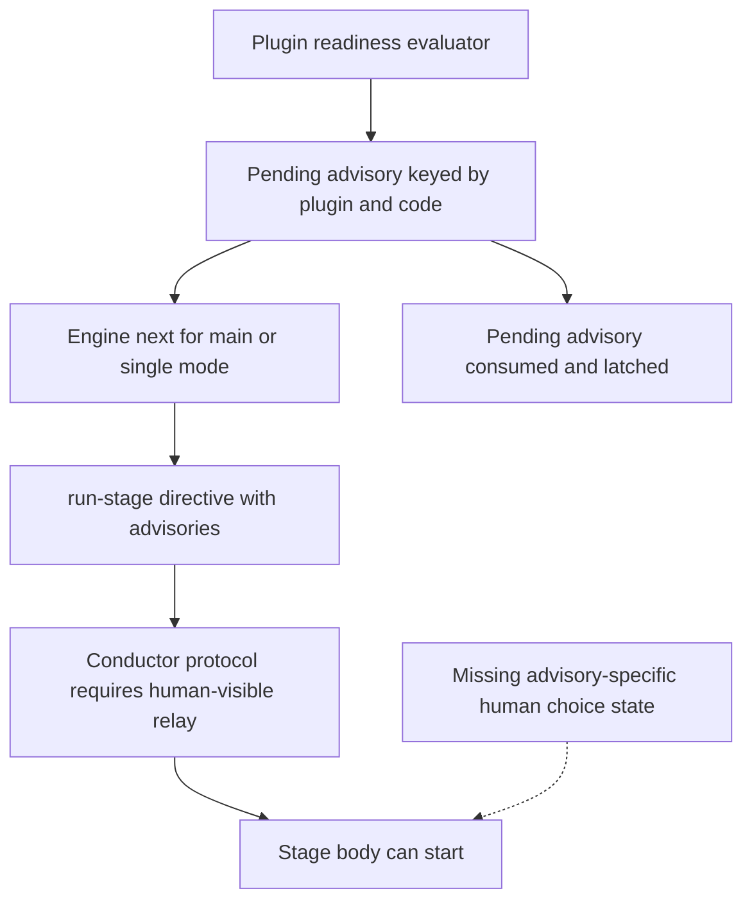
```mermaid
flowchart TD
  A["Plugin readiness evaluator"] --> B["Pending advisory keyed by plugin and code"]
  B --> C["Engine next for main or single mode"]
  C --> D["run-stage directive with advisories"]
  D --> E["Conductor protocol requires human-visible relay"]
  E --> F["Stage body can start"]
  B --> G["Pending advisory consumed and latched"]
  H["Missing advisory-specific human choice state"] -.-> F
```
<!-- Text fallback: plugin readiness evaluator が plugin と code をキーに pending advisory を作り、engine next が main または single の run-stage directive へ載せる。protocol は人間への提示を要求するが、stage body 開始前に advisory 固有の人間選択状態を検査する辺は存在せず、pending advisory は消費・latchされる。 -->

#### per-unit functional-design の時間順

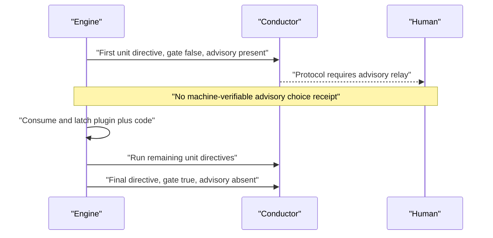
```mermaid
sequenceDiagram
  participant Engine as "Engine"
  participant Conductor as "Conductor"
  participant Human as "Human"
  Engine->>Conductor: "First unit directive, gate false, advisory present"
  Conductor-->>Human: "Protocol requires advisory relay"
  Note over Engine,Human: "No machine-verifiable advisory choice receipt"
  Engine->>Engine: "Consume and latch plugin plus code"
  Engine->>Conductor: "Run remaining unit directives"
  Engine->>Conductor: "Final directive, gate true, advisory absent"
```
<!-- Text fallback: functional-design の最初の gate:false directive で advisory は利用可能だが、機械検証可能な選択receiptはないまま消費・latchされる。残りのunit処理後に出る gate:true directiveでは同じadvisoryが再提示されない。 -->

## subagent 観測パイプラインの結線構造（260805-subagent-type-guard、履歴、observed `7060956c5`）

本節の file:line はすべて observed `7060956c5617125dd2f4e284957aa180cb306484` 時点。差分 base は `b938898f364160d4b5857e153579b40b5ab18372`（34 commits / 493 files）。実測手順・全数列挙・引用スポット再実測は `re-scans/260805-subagent-type-guard.md` を正本とする。

### 4層のデータフロー

```
[harness hook seam]                    [core 純関数]              [audit registry]        [集計 seam]
 Claude Code PreToolUse{tool_name}  ─┐
 kimi SubagentStart                 ─┼→ subagentStartFields  ──→ SUBAGENT_STARTED   ─┐
 （codex は start 配線なし）          ─┘   (:4128-4139)                                │
                                                                                     ├→ composeSubagentLifetimes
 Claude Code SubagentStop           ─┐                                               │   (:112、本番消費者 0)
 codex subagentStop（adapter 経由）  ─┼→ normalizeAgentType  ──→ SUBAGENT_COMPLETED ─┘
 kimi role-stop                     ─┘   (:4082-4084)
```

テキスト代替: start 側は3ハーネス系（Claude Code の `PreToolUse` / kimi の `SubagentStart` / codex は配線なし）が `subagentStartFields` に集約され `SUBAGENT_STARTED` を emit する。complete 側は `SubagentStop` 系が `normalizeAgentType` を経て `SUBAGENT_COMPLETED` を emit する。両イベントを唯一集約するのが `composeSubagentLifetimes` だが本番消費者はゼロである。

### 層ごとの現在の責務と欠陥

| 層 | 現在の責務 | 確認された欠陥 |
| --- | --- | --- |
| hook seam | ハーネス固有 payload を core hook の stdin へ渡す | Claude Code の `tool_name` は `"Agent"`（live 実測 `2.1.222`）だが core は `"Task"` を期待（D-1）。live `.claude/settings.json` に `PreToolUse` 自体が不在（D-2 = [#2297](https://github.com/amadeus-dlc/amadeus/issues/2297)）。codex は `model` を stdin まで運ぶが core が読まない |
| core 純関数 | `Agent Type` / `Agent ID` / `Purpose` / `Message` の導出 | **所属検査が 1 行も無い**。`normalizeAgentType`（`:4082-4084`）は `raw?.trim() ? raw : "unknown"` の空白判定のみで非空値を verbatim 返す |
| audit registry | イベント名・required / optional 属性の宣言 | `SUBAGENT_STARTED`（`core/otel/event-registry.ts:612-623`）/ `SUBAGENT_COMPLETED`（`:624-632`）とも required は `["Agent Type"]` のみ。model 属性の宣言なし |
| 集計 seam | START × COMPLETE のペアリング | `composeSubagentLifetimes`（`core/otel/subagent-lifetime.ts:112`）は本番消費者 0。入力の START が Claude Code で 0 件のため配線しても構造的に空になる |

### dispatch tool 名の照合（D-1 の機序）

`packages/framework/core/tools/amadeus-lib.ts`（verbatim）:

```
4102  export const SUBAGENT_DISPATCH_TOOL = "Task";
4129    if (payload.tool_name !== undefined && payload.tool_name !== SUBAGENT_DISPATCH_TOOL) return null;
```

live payload の `tool_name` は `"Agent"` であるため `:4129` が常に `null` を返し、**Claude Code では `SUBAGENT_STARTED` が永久に emit されない**。`:4133-4137` のコメントは照合の目的が `TaskUpdate` / `TaskCreate` の誤検知防止（settings の matcher が unanchored regex であること）だと明示しており、この防波堤が修正形の選択を制約する。

`tool_name` 不在の経路（kimi の `SubagentStart`）は `:4129` の `!== undefined` ガードにより通過するため、D-1 の影響を受けない。設計コメント（`:4120-4127`）が「Absence of tool_name therefore means 'a seam that only fires for subagents', not 'unknown tool'」と述べる二形状収束が、そのまま harness 別の分岐点になっている。

### model 供給のハーネス別非対称（C10 裁定）

| ハーネス | start seam の model | completion seam の model | 実測種別 |
| --- | --- | --- | --- |
| Claude Code | 明示指定時の `tool_input.model` のみ | **不在** | live（`2.1.222`） |
| Codex | start 配線なし | **`model` 実在**（`"openai.gpt-5.5"`） | fixture（CLI 0.137.0 捕捉） |
| Cursor / OpenCode / Kimi / Kiro / Kiro-IDE / Pi | 未実測 | 未実測 | — |

Codex 側の到達経路は `packages/framework/harness/codex/hooks/amadeus-codex-adapter.ts:349-352`（`case "log-subagent":` → `runCore("amadeus-log-subagent.ts", rawInput)`）が rawInput を verbatim pipe するため、**model は core hook の stdin まで到達しており core hook が読んでいないだけ**である（供給あり・消費なし）。アダプタ内の `model` grep ヒットは 0 件。

型面は非破壊: `ClaudeCodeHookInput`（`amadeus-lib.ts:4687-4707`）に `model?: string` の宣言は無いが `:4706` に `[key: string]: unknown;` があるため追加は既存消費者を壊さない。

### 実効 model の解決順と ③ の破断

```
① 明示指定（PreToolUse tool_input.model）      → 可（明示時のみ）
② persona ピン（.claude/agents/*.md の model:）→ 可（静的読取。14 ファイル全数にピン）
③ セッション継承（statusline → runtime-attrs） → 機構は在るが休眠かつ別プロセス
```

③ の経路は `core/hooks/amadeus-statusline.ts:232` `const modelId = input.model?.id ?? "";` → `:230-256` の `recordRuntimeAttrs` が `<telemetryDir>/runtime-attrs.json` へ書く（`:237` path、`:249-252` write）。破断点は3つ: `:234` の `if (!observabilityEnabled(projectDir)) return;`（本 repo の `amadeus/config.json` の `observability` は `null`）/ ディスク上の実体 0 件 / `runtime-attrs` の読み手 0 件（write-only）。加えて statusline はメインセッションのプロセスで動き、subagent hook とは別プロセス・別 payload であるため subagent 側へ直接届く経路が存在しない。

### 型規律の検査が存在する層と存在しない層

compile 時には agent ロスタ照合が存在する — `core/tools/amadeus-graph.ts:2191` `const knownAgents = loadAgents().map((a) => a.slug);` を `:2218` `validateStageFrontmatter(parsed, { agents: knownAgents })` へ渡し、stage frontmatter の `lead_agent` / `support_agents` が実在しない場合に compile を loud に落とす（コメント `:2186-2190`）。**しかしこの機構は dispatch の `subagent_type` を一切見ない。** すなわち「stage 宣言の agent 参照」は検査されるが「実行時 spawn の型」は無検査であり、Issue #2279 が指す空白はこの2層の非対称そのものである。
## semi 再定義と autonomy 起動宣言の結線構造（260805-semi-redefine-autonomy-f、履歴、observed `2f255bc69`）

本節の file:line・件数はすべて observed `2f255bc6993316f1a271bcd932fabf773096494e` 時点の実測。差分 base は `b938898f364160d4b5857e153579b40b5ab18372`（祖先性 exit 0、区間 19 commits / 464 files）。行番号は canonical 側 `packages/framework/core/` を記す（`.claude/` ミラーは同一内容）。全数列挙は `re-scans/260805-semi-redefine-autonomy-f.md` を正本とする。

### 承認・裁定経路の現行トポロジ

autonomy は**2つの独立した関門**を通る。第1関門 `authorizeInteraction`（`amadeus-intent-autonomy.ts:501-531`）が「そもそも自動裁定してよい occurrence か」を mode 別に判定し、第2関門が「何を選ぶか」を決める。`semi` は第1関門で phase 内 stage-gate 以外をすべて弾くため、第2関門の無人裁定梯子には**構造的に到達しない**。

`semi` の弾き位置（`:510-514`、verbatim）:

```
  if (projection.mode === "semi") {
    const internalGate = occurrence.kind === "stage-gate" && occurrence.phase !== "phase-boundary";
    if (!internalGate || projection.modeProvenance.kind !== "human-command") {
      return { kind: "human-required", occurrence, reason: "MODE_REQUIRES_HUMAN" };
    }
```

第2関門のルーティングは `amadeus-intent-autonomy-runtime.ts` の `selectDecision`（`:522-524`、verbatim）:

```
    if (authorization.kind === "semi-mode-gate") return createSelectedGateDecision(projection, input, "mode-semi");
    if (input.occurrence.kind !== "question") return createSelectedGateDecision(projection, input, "grant-gate");
    const resolved = resolveAutoDecision({
```

`semi-mode-gate` は `createSelectedGateDecision` で即座に決着し、`resolveAutoDecision` の梯子へは進まない。梯子へ進むのは `full` grant を持つ Intent の `question` occurrence だけである。

### 無人裁定梯子は5段（4段ではない）

`resolveAutoDecision`（`amadeus-intent-autonomy.ts:699-744`）は full ハードゲートの後、5段を順に試す。Issue #2253 が「4段」と述べているのは、先頭の confirmed-policy 段を数えていないためである。

| 順 | 段 | 実測 file:line | 失敗・競合時 | reviewState |
| --- | --- | --- | --- | --- |
| — | full ハードゲート | `:702` | `{kind:"invalid", reason:"full-grant-required"}` | — |
| 0 | confirmed-policy | `:706-707` | 競合は `confirmed-policy-conflict` | `reviewed` |
| 1 | norm | `:708-717` | 競合は `:713` の `{kind:"park", reason:"NORM_CONFLICT"}` | `reviewed` |
| 2 | history | `:718-725` | 競合は不採用（次段へ） | `reviewed` |
| 3 | solo-election | `:726-735` | 検証失敗は `invalid-election-result` | **`unreviewed`** |
| 4 | agent-recommendation（縮退） | `:736-744` | `unavailableReason` 未設定なら `invalid-recommendation-result`（fail-closed） | **`unreviewed`** |

`reviewState` の分岐は `:605-607`（`basisKind` が `solo-election` または `agent-recommendation` のときのみ `unreviewed`）。

> **注記（履歴節との差分）**: 直下の 260804 履歴節および本文書の旧節は observed `b938898f3` 時点の行番号で正しい。`amadeus-intent-autonomy.ts` は区間内で無変更のため行シフトは 0 だが、Developer scan が申告した梯子の行範囲（`:705-706` 等）は**1行ずつ低い**ため、本節の実測値を正とする。

### semi を梯子へ載せるときの最小介入点

再定義の実装面は3点に閉じる（いずれも observed 実測）。

| # | 介入点 | file:line | 現行の振る舞い |
| --- | --- | --- | --- |
| 1 | `authorizeInteraction` の semi 分岐 | `amadeus-intent-autonomy.ts:510-514` | phase 内 stage-gate 以外を `MODE_REQUIRES_HUMAN` で弾く |
| 2 | `selectDecision` のルーティング | `amadeus-intent-autonomy-runtime.ts:522-524` | `semi-mode-gate` を梯子へ渡さず即決 |
| 3 | `createGateAutoDecision` の入口ガード | `amadeus-intent-autonomy.ts:667-673` | `question` occurrence を throw で拒否（`gate-decision-requires-gate-occurrence`） |

介入点3の verbatim（`:667-673`）:

```
  if (input.occurrence.kind === "question") throw new Error("gate-decision-requires-gate-occurrence");
  if (input.basisKind === "mode-semi" && input.projection.mode !== "semi") {
    throw new Error("semi-gate-requires-semi-mode");
  }
  if (input.basisKind === "grant-gate" &&
    (input.projection.mode !== "full" || input.projection.currentGrant === null)) {
    throw new Error("grant-gate-requires-full-grant");
  }
```

さらに `resolveAutoDecision` の full ハードゲート（`:702`）が `mode !== "full"` を一律拒否するため、**`semi` を梯子へ載せるにはこの1行の条件そのものを緩める必要がある**。ここは grant 有無と mode を同時に見ており、`semi` は grant を持たない（`full` grant は `issue-full` / `replace-full` 経由でしか発行されない、`:250-257`）ため、緩和は「grant なしで梯子を回す」ことを意味する。これは現行アーキテクチャの前提を変える最大の構造点である。

semi 側の効果適用は `applySemiDecision`（`amadeus-intent-autonomy-runtime.ts:546-554`）が担い、効果が `workflow-reversible` でなければ `semi-gate-effect-not-authorized` を返す。**「不可逆な効果は semi では通さない」という判別軸は既に実在する**ため、「節目」の定義をこの分類へ寄せられるかが設計上の焦点になる。

### Interaction Diagrams

#### 現行: mode 別の裁定経路

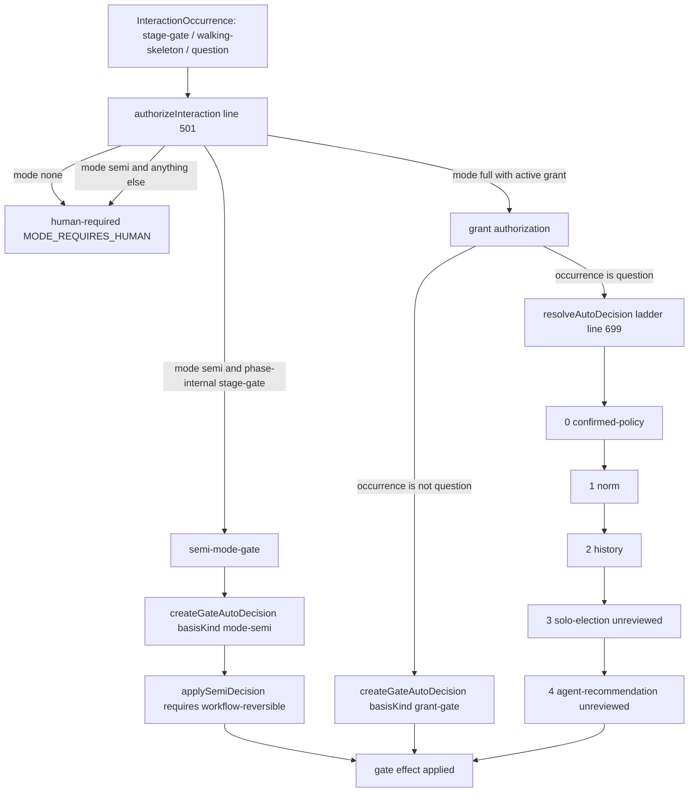
```mermaid
flowchart TD
  OCC["InteractionOccurrence: stage-gate / walking-skeleton / question"] --> AUTH["authorizeInteraction line 501"]
  AUTH -->|"mode none"| HUM["human-required MODE_REQUIRES_HUMAN"]
  AUTH -->|"mode semi and phase-internal stage-gate"| SEMI["semi-mode-gate"]
  AUTH -->|"mode semi and anything else"| HUM
  AUTH -->|"mode full with active grant"| FULL["grant authorization"]
  SEMI --> CGD["createGateAutoDecision basisKind mode-semi"]
  FULL -->|"occurrence is not question"| CGD2["createGateAutoDecision basisKind grant-gate"]
  FULL -->|"occurrence is question"| LADDER["resolveAutoDecision ladder line 699"]
  LADDER --> S0["0 confirmed-policy"]
  S0 --> S1["1 norm"]
  S1 --> S2["2 history"]
  S2 --> S3["3 solo-election unreviewed"]
  S3 --> S4["4 agent-recommendation unreviewed"]
  CGD --> EFF["applySemiDecision requires workflow-reversible"]
  EFF --> DONE["gate effect applied"]
  CGD2 --> DONE
  S4 --> DONE
```

<!-- Text fallback: occurrence は authorizeInteraction（:501）で mode 別に振り分けられる。none は常に human-required。semi は phase 内 stage-gate だけを semi-mode-gate として通し、それ以外は human-required。full かつ active grant のときだけ、question occurrence が resolveAutoDecision の5段梯子（confirmed-policy → norm → history → solo-election → agent-recommendation、後段2段は unreviewed）へ入る。semi の効果適用は applySemiDecision が workflow-reversible を要求する。 -->

#### 再定義後に変わる辺（設計候補、未確定）

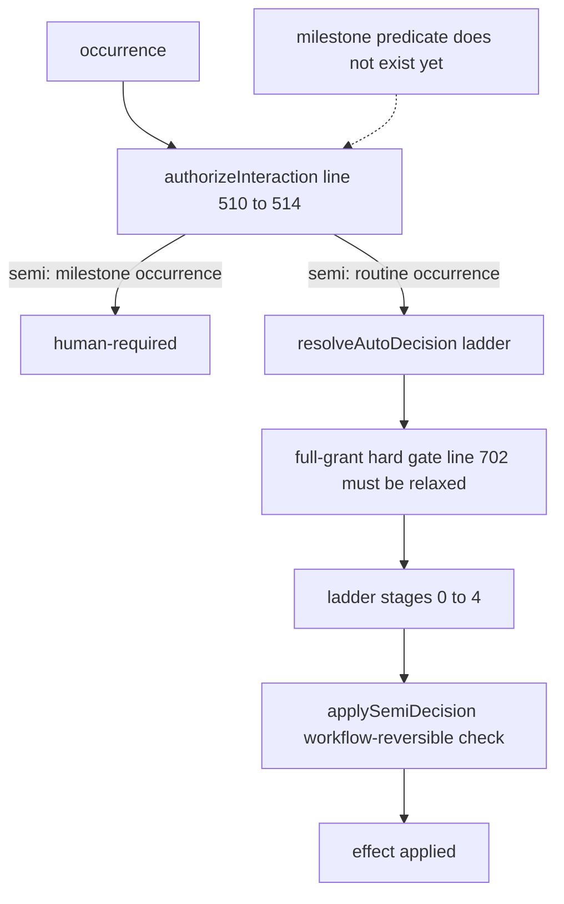
```mermaid
flowchart TD
  OCC["occurrence"] --> AUTH["authorizeInteraction line 510 to 514"]
  AUTH -->|"semi: milestone occurrence"| HUM["human-required"]
  AUTH -->|"semi: routine occurrence"| LADDER["resolveAutoDecision ladder"]
  LADDER --> GATE["full-grant hard gate line 702 must be relaxed"]
  GATE --> S0["ladder stages 0 to 4"]
  S0 --> EFF["applySemiDecision workflow-reversible check"]
  EFF --> DONE["effect applied"]
  MILE["milestone predicate does not exist yet"] -.-> AUTH
```

<!-- Text fallback: 再定義後は authorizeInteraction の semi 分岐が「節目 occurrence」と「日常 occurrence」を分け、日常側を resolveAutoDecision の梯子へ流す。その際 :702 の full-grant ハードゲートを緩和する必要がある。節目を判別する述語は observed 時点では存在せず、新設対象である。本図は設計候補であり承認された設計ではない。 -->

### stop hook 側の非対称（既存の伏線）

`amadeus-stop.ts` は既に `semi` を2つの軸で別々に扱っている。

| 軸 | 関数 | file:line | `semi` の扱い |
| --- | --- | --- | --- |
| 継続 cap | `stopContinuationDefaultCap` | `:147-151` | `full` と同じ `AUTONOMOUS_BLOCK_CAP = 8`（`:153`） |
| budget mode | `stopBudgetMode` | `:157-160` | `full`=`autonomous` / `semi`=`gated` / それ以外=`interactive` の3値 |
| 質問 carve-out | `isFullyAutonomousIntent` | `:167-178` | **`full` 限定**。`semi` は carve-out を得ない |

`isFullyAutonomousIntent` は mode に加えて production projection の grant が `active` であることも要求する（`:171-174`）。呼び出しは3箇所 — tier-2 質問 carve-out `:422`、tier-2b compose gate `:457`、tier-3 conversational `:716`。

つまり **cap の軸では `semi` は既に自律側**、**質問の軸では `semi` は非自律側**という非対称が observed 時点で実在する。再定義はこの非対称を解消する方向の変更であり、`isFullyAutonomousIntent` の述語名・分岐・3呼び出し点が改訂面になる。名前が `Fully` を含むため、改名すると `tests/.coverage-patch-allowlist.json:5268` の `"function": "isFullyAutonomousIntent"` エントリも同期対象になる。

### `--autonomy` 起動フラグの結線余地

`--autonomy` はコード面に**存在しない**（`grep -rn -- "--autonomy" packages tests docs .claude scripts specs plugins contrib` → 0 hit、observed 実測。repo 全体の 22 hit は全件が本 intent 自身の record 成果物）。

解釈点は `amadeus-orchestrate.ts:1044-1074` の flag parser if/else ladder。既存の値付きフラグは `--scope` `:1050` / `--stage` `:1053` / `--phase` `:1056` / `--depth` `:1059` / `--test-strategy` `:1062` / `--report` `:1067`。

**構造的な落とし穴**（`:1072-1073`）: 未認識の値付きフラグは、その値が `!a.startsWith("--")` 分岐で intent 自由文へ流れ込む。`--report` がわざわざ値を consume している理由がコメント `:1068-1069` に verbatim で残っている:

```
      // CONSUME the value: an unrecognized valued flag would leak its value
      // into the freeform intent text (the path would read as intent words).
```

したがって `--autonomy semi` を parser へ追加しないまま利用者が打つと、`semi` という語が intent 記述文へ混入する。

配置上の制約: read-only フラグは絶対優先の梯子（`:1014-1016`、Branch 1 は `:2483-2489`）で処理されるが、autonomy は**監査済みの状態変更**であるため `READ_ONLY_FLAGS` には入れられない。既存流儀に整合する形は、birth 経路の `birthPrintDirective`（`:2617-2646`）が先例となる「`amadeus-bolt set-autonomy` を名指しする print directive」である。ただしこれは設計候補であり、本 intent では未確定。

### mode の値域と永続化3面

- 型: `amadeus-intent-autonomy.ts:11` — `export type AutonomyMode = "none" | "semi" | "full";`
- 値域バリデータ4箇所: `amadeus-intent-autonomy.ts:952` / `amadeus-bolt.ts:1053` / `amadeus-stop.ts:162-165` / `amadeus-directive.ts:97`。**directive 面だけは `"semi" | "full"` の2値**で `none` を持たない（`none` の Intent には autonomy フィールドが載らないため）。
- 人間コマンドの値域は狭い（`:250-257`）— `set-mode` は `"none" | "semi"` のみ、`revoke-full` の `targetMode` も同じ。`full` は `issue-full` / `replace-full` 経由でしか到達できない。**`semi` は grant を持たない mode である**という構造がここに現れる。
- 永続化3面: (1) canonical = 監査 journal の replay（`amadeus-intent-autonomy-replay.ts:123` `replayIntentAutonomyAudit`、`:138` `createAuditIntentAutonomyRepository`、読み口は `amadeus-intent-autonomy-production.ts:133` `readProductionAutonomyProjection`）、(2) state の `Intent Autonomy Mode` / `Intent Grant`（書込 `amadeus-bolt.ts:1072-1078`）、(3) 互換投影 `Construction Autonomy Mode`（`amadeus-bolt.ts:1071` — `flags.mode === "full" ? "autonomous" : "gated"`）。

(3) により **`semi` と `none` はともに `gated` へ潰れ、互換投影面では区別できない**。再定義後に `semi` の意味が `full` 寄りへ移ると、この投影の妥当性が問い直される。

### `--policies-file` の無音破棄（隣接する既存の不整合）

`handleSetAutonomy`（`amadeus-bolt.ts:1051-1092`）は mode に依存せず `readDecisionPolicyInputs(flags["policies-file"])` を読む（`:1067`）。しかし `amadeus-intent-autonomy-production.ts:417` の分岐で `mode !== "full"` は `prepareNonFullCommand`（`:382-395`）へ進み、この関数は `policies` 引数を**取らない**。結果、`--mode semi --policies-file <json>` は警告もエラーもなく policies を破棄する。

再定義後に `semi` が裁定梯子（confirmed-policy 段を含む）を使うなら、この破棄はそのまま欠陥になる。observed 時点では `semi` が梯子を使わないため実害はないが、**再定義と同時に顕在化する**構造である。

## phase boundary verification と approval の結線構造（260804-phase-boundary-approval、履歴、observed `b938898f3`）

本節の file:line はすべて observed `b938898f364160d4b5857e153579b40b5ab18372` 時点。差分 base は `9458bbda85eb7257310a80882b4858dc6ce3d1fc`（祖先性 `git merge-base --is-ancestor` exit 0、距離 134 commits / 1041 files）。全数列挙・実測手順は `re-scans/260804-phase-boundary-approval.md` を正本とする。

> **行ピンの再解決（2026-08-14 追記、260813-lifecycle-guard-runtime）**: 本節の `:379-396` / `:3472` / `:3484` / `:2263` / `:2413` / `:2539` / `amadeus-jump.ts:545` は**本節が宣言する observed `b938898f3` 時点の値**であり、そのまま保存する（`cid:reverse-engineering:c1` — 履歴節の file:line はその節が宣言する observed で照合する）。observed `89532174c` での対応値は次のとおり。以後、現在断面の記述はこちらを引くこと。
>
> | 本節（`b938898f3`） | observed `89532174c` |
> | --- | --- |
> | `verifyPhaseCheckArtifact` 定義 `:379-396` | **`:392`**（コメントは `:384-391`） |
> | approve 経路の guard `:3472` → checkbox `:3484` | **`:4009` → `:4021`**（順序は不変） |
> | 呼出 advance `:2263` / finalize `:2413` / complete-workflow `:2539` | **`:2775` / `:2926` / `:3059`** |
> | jump 側 `amadeus-jump.ts:545` | **`amadeus-jump.ts:581`** |
>
> observed の `:2539` は `verifyPhaseCheckArtifact` の呼出ではなく **`verifyStageCompletionGuards` の定義**であり、同じ数字が別の機構を指す。混同しないこと。

### phase boundary verification の現行経路

`directive.phase_boundary` を起点に、engine → conductor → state guard の3者で閉じる。

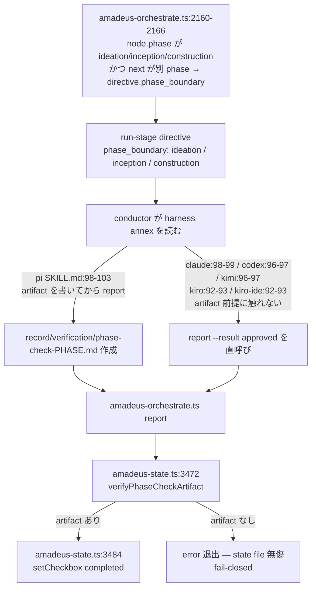
```mermaid
flowchart TD
    A["amadeus-orchestrate.ts:2160-2166<br/>node.phase が ideation/inception/construction<br/>かつ next が別 phase → directive.phase_boundary"] --> B["run-stage directive<br/>phase_boundary: ideation / inception / construction"]
    B --> C["conductor が harness annex を読む"]
    C -->|"pi SKILL.md:98-103<br/>artifact を書いてから report"| D["record/verification/phase-check-PHASE.md 作成"]
    C -->|"claude:98-99 / codex:96-97 / kimi:96-97<br/>kiro:92-93 / kiro-ide:92-93<br/>artifact 前提に触れない"| E["report --result approved を直呼び"]
    D --> F["amadeus-orchestrate.ts report"]
    E --> F
    F --> G["amadeus-state.ts:3472<br/>verifyPhaseCheckArtifact"]
    G -->|"artifact あり"| H["amadeus-state.ts:3484<br/>setCheckbox completed"]
    G -->|"artifact なし"| I["error 退出 — state file 無傷<br/>fail-closed"]
```

テキストフォールバック: engine（`amadeus-orchestrate.ts:2160-2166`）が phase 境界を検出して `directive.phase_boundary` を立てる → conductor が harness annex の手順に従う → pi annex だけが「artifact を書いてから report」と指示し、他5本は artifact 前提なしに `report --result approved` を直呼びさせる → `report` は `amadeus-state.ts` の approve 経路へ入り、`:3472` の `verifyPhaseCheckArtifact` が checkbox 書込 `:3484` より前に発火する → artifact 不在なら `error()` が exit し state file は無傷のまま承認が拒否される（fail-closed）。

### 3つの契約層とその現在地

| 層 | 位置 | 区間内の状態 |
| --- | --- | --- |
| (a) 規約 | `amadeus-common/protocols/stage-protocol-governance.md:14-18` | **是正済み**（`f7273b9ab` / #2166） |
| (c) ガード | `amadeus-state.ts:379-396` `verifyPhaseCheckArtifact` | **無変更**（fail-closed のまま） |
| (d) annex | 8ハーネスの `skills/amadeus/SKILL.md` ほか | **pi 1本のみ正、7本未追随** |

**(a) は区間内で解消した。** `stage-protocol-governance.md:14-18` は base 時点で「After the last stage of each phase is approved / Before the first stage of the next phase begins」であり、ガードが承認**前**に発火する事実と矛盾していた。observed では:

```
### When to verify
- After the last stage's outputs and review are complete
- Before reporting approval for the gate whose `run-stage` directive carries
  `phase_boundary`; the approval transition is fail-closed until the artifact exists
- On demand if the user requests verification via `/amadeus --status`
```

当該パスの区間内コミットは `f7273b9ab`（"feat(pi): add Pi agent core support (#2166)"）1件のみである。すなわち **#2143 の規約側の指摘は、Pi ハーネス追加 PR に相乗りする形で既に閉じている。**

**(c) は構造的に fail-closed である。** `verifyPhaseCheckArtifact`（`amadeus-state.ts:379`、export）は `amadeus-state.ts` 内4箇所（`:2263` advance / `:2413` finalize / `:2539` complete-workflow / `:3472` approveUnderLock）と `amadeus-jump.ts:545`（前進 jump、同一 export を再利用）から呼ばれる。approve 経路での順序は実読で確定している:

```
3461  verifyStageArtifacts(pd, stage);
3464  const authorization = authorizeApproval(pd, content, stage, override);
3467  const nextForPhaseGate = nextInScopeStage(slug, approveScope, content);
3468  if (deferWorkflowCompletion && nextForPhaseGate !== null) {
3469    error("--defer-workflow-completion is valid only for the final in-scope stage.");
3471  if (!nextForPhaseGate || nextForPhaseGate.phase !== stage.phase) {
3472    verifyPhaseCheckArtifact(pd, stage.phase);
3484    setCheckbox(validateStageState(content), slug, "completed"),
```

拒否文言は `:390-394`。`error()` は exit するため、拒否時に in-memory の内容反転は破棄され state file は無傷で残る。

**(d) が残余である。** そして Developer scan の判定に対する重大な訂正がある — **8ハーネス中 `pi` だけが正しい**:

| ハーネス | approval 条項 | phase-check 前提 |
| --- | --- | --- |
| `pi` | `skills/amadeus/SKILL.md:98-103` | **あり（唯一）** |
| `claude` | `skills/amadeus/SKILL.md:98-99` | なし（`:119` に弱いポインタのみ） |
| `codex` | `skills/amadeus/SKILL.md:96-97` | なし（`:117` に同上） |
| `kimi` | `skills/amadeus/SKILL.md:96-97` | なし（`:117` に同上） |
| `kiro` | `skills/amadeus/SKILL.md:92-93` | なし（`:119` に同上） |
| `kiro-ide` | `skills/amadeus/SKILL.md:92-93` | なし（同上） |
| `cursor` | `commands/amadeus.md`（82行） | approval 条項が実質なし |
| `opencode` | `commands/amadeus.md`（81行） | 同上 |

pi の記述（`harness/pi/skills/amadeus/SKILL.md:98-103`、verbatim）:

```
When a `run-stage` directive carries `directive.phase_boundary`, load the
governance companion and write
`<record>/verification/phase-check-<phase>.md` before reporting approval. The
field is computed after scope overrides, so it also covers an early phase exit
where the phase's usual final stage was skipped. Never report first and try to
repair a rejected transition afterward.
```

対して claude `:99` は `On approval, report --stage "<directive.stage>" --result approved` と、artifact 前提に一切触れない。5ハーネスが `:117` / `:119` に持つ governance protocol へのポインタは「load at phase boundaries」としか言わず、**`report` に対する相対順序を指定しない**。したがって是正の形は「annex に phase-check を新設する」ではなく「**pi の既存記述を残り5つの skill-bearing annex へ横展開する**」である。

### 新規交差 — autonomy runtime 層が phase boundary と交わる

区間内で autonomy runtime 層が追加され、`phase_boundary` と auto-approve が同一 directive 上に共存しうる構造が生まれた。

`amadeus-orchestrate.ts:2160-2166` が `directive.phase_boundary` を算出したのち、`:2181-2196` の `routeMainWorkflowDirective` が同じ directive へ autonomy を射影する:

```
2181  const phaseBoundary = directive.next_stage === null ||
2182    (next !== null && next !== undefined && next.phase !== directive.phase);
2183  const autonomy = productionStageAutonomy({ … phaseBoundary });
2192  if (autonomy.mode === "semi" || autonomy.mode === "full") {
2193    directive.intent_autonomy_mode = autonomy.mode;
2194    directive.autonomy_auto_approve = autonomy.autoApprove;
```

規約側の帰結:

- `stage-protocol.md:33` — auto-approve directive では「the conductor reports approval without presenting a human question or synthesizing `HUMAN_TURN`」。
- `stage-protocol.md:129` — 「`none` requires a human for stage and phase gates. `semi` auto-approves gates within a phase but requires a human at a phase boundary. `full` auto-approves both under the active Intent grant.」

`full` では phase boundary も auto-approve されるため、人間ターンなしに `report --result approved` へ到達する。一方ガード `:3472` は autonomy を一切参照しない。**artifact を書く主体が人間ターンだと暗黙に仮定されているのに、その人間ターンが存在しない経路が新設された。** ガードは fail-closed なので偽緑は生まないが、`full` × phase boundary は誰も artifact を書かないため**進行不能**になる。`full` grant 下の実 run を再現していないため、実損の有無は **UNCONFIRMED** である。

directive スキーマ側の宣言（`amadeus-directive.ts`）: `:97-100`（`intent_autonomy_mode` / `autonomy_auto_approve` / `intent_grant_id` / `quality_repair`）、`:143`（`next_stage`）、`:144-149`（`phase_boundary`。コメント `:144` は `the phase whose verification artifact must exist BEFORE this gate is approved`）。既知キー配列 `:403-411`、検証器 `:606-609` と `:633-637`。

### approval 権限層の置換 — grant-authorization → approval-authorization

区間内で `amadeus-grant-authorization.ts` が**削除**され、`amadeus-approval-authorization.ts`（80行）が後継となった。旧ファイルを参照する本文書の過去記述はすべて observed と不整合である。

- `:20-48` `classifyApprovalAuthority(input): ApprovalAuthority` — `normal` / `targeted-human` / `invalid` の3値。`targetIntentId` と `presenceReservationId` は**対で必須**（`:26-28` の `hasTarget !== hasReservation` → `"partial authorization carrier"`）。`targeted-human` はさらに `operatingMode === "solo"`、UUIDv7（target）/ UUIDv4（reservation）を要求する（`:30-37`）。
- `:55-80` `parseApprovalProcessResult(result)` — 承認サブプロセスの stdout を**単一 JSON 行**として解釈する。`exitCode !== 0` → `fatal-error`、stderr 非空 → `protocol-error`、複数行 → `protocol-error`、`{"kind":"approved"}` 以外のキー構成 → `protocol-error`。

消費側は `amadeus-orchestrate.ts:4445` `handleAuthorizedApprovalReport(pd, slug, authority)`、dispatch は `:4728`。

### Quality Repair / Loop Monitor / Intent Autonomy の三つ組構造

区間内で追加された autonomy 系は、いずれも `X.ts`（ドメイン）+ `X-runtime.ts`（ランタイム）+ `X-replay.ts`（replay）の同一命名規約をとる。

| 系統 | ドメイン | runtime | replay | 計 |
| --- | --- | --- | --- | --- |
| `amadeus-intent-autonomy` | 961 | 800 | 175 | 1936（+ `-production.ts` 900） |
| `amadeus-loop-monitor` | 795 | 816 | 553 | 2164 |
| `amadeus-quality-repair` | 838 | 951 | 190 | 1979 |
| `amadeus-goal` | 582 | — | — | 582（+ `-reconciliation.ts` 883） |

4系統・約7500行が同型の層構造を持ちながら共有抽象を持たない。これは構造的重複であり、負債シグナルとして記録する。

### 新ハーネス pi — 既存とは異なる構成

`packages/framework/harness/pi/` は既存7ハーネスの hook / plugin 構成をとらず、**driver / guardian / replay-store / extension** 構成をとる。

| ファイル | 行 | 役割 |
| --- | --- | --- |
| `extensions/amadeus-pi-extension.ts` | 1313 | Pi 側 extension 本体 |
| `drivers/amadeus-pi-driver.ts` | 659 | 子プロセス実行ドライバ |
| `drivers/amadeus-pi-guardian.ts` | 377 | ライフサイクル gate |
| `drivers/amadeus-pi-replay-store.ts` | 336 | replay 永続化 |
| `drivers/amadeus-pi-driver-contract.ts` | 231 | driver 契約 |
| `manifest.ts` | 97 | ハーネス manifest |
| `onboarding.fills.ts` | 31 | onboarding 差込 |
| `skills/amadeus/SKILL.md` | 200 | conductor annex（phase-check 記述を持つ唯一の annex） |

`package.json` には pi ブロックが追加された:

```json
"pi": {
  "extensions": ["./dist/pi/.pi/extensions/amadeus.ts"],
  "skills": ["./dist/pi/.pi/skills/amadeus"]
}
```

`amadeus-pi-doctor.ts`（392行、core tools 側）が診断を担う。

### config 層の破壊的再編

`amadeus-config.ts`（observed 771行）の canonical key はフラットキーから6本のドットパスへ正規化された（`:59-64`）:

```
"intent-mirror.github.issue.mode"
"intent-mirror.github.project.targets"
"solo-election.trigger.mode"
"finding.github.issue.creation.mode"
"swarm.unit.concurrency.limit"
"plugin.activation.names"
```

旧フラットキーは legacy 参照として残る（例: `:499` の `auto-solo-election`）が、canonical はドットパスのみである。`swarm.unit.concurrency.limit` は新規追加。この再編に伴いテスト2スイート（`t257-amadeus-config` / `t343-amadeus-mirror-project-config`）が削除された。

## no-silent-drop evidence registry の revision 束縛構造（260804-evidence-revision-rebind、履歴、observed `9458bbda8`）

本節は Developer Code Scan を observed `9458bbda85eb7257310a80882b4858dc6ce3d1fc`（= `origin/main`）で合成し、Architect が主要 seam を verbatim 実読で二重化した現在断面である。差分 base は `498c3034a78bd432dc426f9f807b79c8ae980762`（祖先性 exit 0、距離 11）。実測手順・全数列挙・引用 spot-check は `re-scans/260804-evidence-revision-rebind.md` を正本とする。

> **測定 ref の注意。** 本 intent の worktree（HEAD `668e88665`）は observed と同一ではなく、台帳3ファイルと t413 が内容差分を持つ（`cmp` 実測で DIFF）。本節の file:line・引用はすべて `git show "${OBS}:<path>"` で observed 断面から抽出した。zsh では `git show "${VAR}:path"` とブレース必須（`:t` / `:h` が履歴修飾子として解釈される）。

### 台帳3層とリビジョンフィールド（observed 実測）

| 台帳 | フィールド | 出現数 | 内訳 |
| --- | --- | --- | --- |
| `tests/no-silent-drop/adoption-evidence.json` | `currentRevision` | 24 | top-level 1 + receipt 23 |
| `tests/no-silent-drop/adoption-evidence-manifest.json` | `testedRevision` | 24 | top-level 1 + evidence entry 23 |
| `tests/no-silent-drop/evidence/adoption-runs.json` | `testedRevision` | 25 | run レコード 25（top-level なし） |

全出現が到達不能 SHA `3734885cbfc03aa97f655ca61da1cdd533fdea3e` で、`git grep -c <sha> 9458bbda8 -- .` はこの3ファイル（24 / 24 / 25 = 73箇所）のみをヒットする。

### 読み手と効く検査

| フィールド | 読み手（observed 行） | 効く検査 |
| --- | --- | --- |
| registry top-level `currentRevision` | `t413…test.ts:157`（`git cat-file -e`）、`:159-163`（`merge-base --is-ancestor`）、`:164`（`validateEvidenceRegistry(registry, registry.currentRevision)`）、`:168`（`git diff` の左端） | **到達性**（#2156）+ 鮮度 diff（#2153） |
| registry receipt `currentRevision` | `repository-adoption.ts:182` `if (candidate.currentRevision !== expectedRevision) problems.push(\`receipt ${candidate.id} revision mismatch\`)` | registry 内部整合 |
| registry receipt `evidenceDigest` | `repository-adoption.ts:183-187`（`expectedDigests.get(receiptId)` 一致） | 台帳↔manifest の digest 束縛 |
| manifest top-level `testedRevision` | `repository-adoption-evidence.ts:360` `if (rawManifest.testedRevision !== expectedRevision) problems.push("evidence manifest revision mismatch")` | manifest↔registry 束縛 |
| manifest entry `testedRevision` | `repository-adoption-evidence.ts:197` `if (value.testedRevision !== expectedRevision) problems.push(\`evidence ${value.id} revision mismatch\`)` | 同上 |
| `adoption-runs.json` run `testedRevision` | `repository-adoption-evidence.ts:268` `if (summary.testedRevision !== entry.testedRevision) problems.push(\`${label} revision mismatch\`)` | 成果物レコード↔manifest 束縛 |

**欠陥機序**: `t413…test.ts:157` / `:159` だけが「台帳に永続化した SHA を後日 git で解決する」検査である。スカッシュマージ運用では PR ブランチ tip は着地後 `main` に存在しないため、自ブランチ tip を記録して着地した瞬間に到達不能へ反転する。PR 上では記録 SHA が到達可能で緑になるため、**PR CI でもレビューでも構造的に捕捉できない**。原因の所在は #1979 の**設計**（`cid:requirements-analysis:bug-intent-linkage`）。

### digest 不動点（`canonicalBinding`）

`repository-adoption-evidence.ts:333-351` の `canonicalBinding()` は digest 入力に (a) `entry.testedRevision`（`:337`）と (b) 成果物ファイルの実測バイト digest（`:343`、`artifactDigests` は `readArtifactCollection` が `sha256(bytes)` で構成）を含む。したがって束縛は3層の**不動点**をなす:

1. `adoption-runs.json` の `testedRevision` 書き換え → ファイルバイトが変わる
2. → manifest の `artifact.sha256`（25エントリ）を更新しないと `artifact digest mismatch`
3. → `canonicalBinding` の入力が2面とも変わる → registry の `evidenceDigest`（23 receipt）を再計算しないと `evidence digest does not match repository evidence`

**この不動点は機械的に計算可能で閉じる。** repo 外 scratch clone（observed へ detach、`bun install --frozen-lockfile` exit 0）での段階実測:

| 段階 | 操作 | `validateEvidenceRegistry` の problems |
| --- | --- | --- |
| A | registry + manifest のみ SHA 置換 | **48 件**（run 単位 `revision mismatch` 25 + receipt 単位 digest 23） |
| B | + `adoption-runs.json` も置換し manifest の `artifact.sha256` を更新 | **23 件**（digest 面のみ） |
| C | + `evidenceDigestForReceipt()` で 23 receipt の `evidenceDigest` 再計算 | **0 件 / `ok: true`** |

段階 C で `bun test tests/integration/t413-no-silent-drop-ci-adoption.test.ts` → `10 pass / 0 fail`、`bun tests/no-silent-drop-gate.ts check --base-revision 9e699ea79…` → `NO_SILENT_DROP_OK`。機械的に書き換わるフィールドは **73 + 23 + 25 = 121 箇所**。

> **「修復不能」前提の反証。** Issue 本文と両クロスレビューが置いていた「evidence bundle の再 adoption に生成ツールが無いため修復不能」は成立しない（[Issue #2156 の訂正コメント](https://github.com/amadeus-dlc/amadeus/issues/2156)、2026-08-04T01:37:53Z）。**不在なのは再生成ロジックではなく書込経路**である。この評価は codekb 全体の前提として維持すること。

### 書込経路の不在

observed の `tests/no-silent-drop/` 配下 + `tests/no-silent-drop-gate.ts` の `.ts` は8ファイル（`gate` / `ast-scan` / `bootstrap` / `engine` / `ledger` / `model` / `repository-adoption-evidence` / `repository-adoption`）。各ファイルの `grep -cE 'writeFileSync|Bun\.write|appendFileSync|createWriteStream|writeFile\(|mkdirSync'` は **全8ファイルで 0**（Architect が observed で独立再計算）。CLI モードは `engine.ts:49` の `"check" | "census-evidence" | "approve-evidence" | "baseline-candidate"` の4種で、出力は `tests/no-silent-drop-gate.ts:35` の `process.stdout.write(...)` のみ。**正本3台帳を書く経路はリポジトリに存在しない**ため、再バインドの実施手段自体を本 intent が新設する必要がある。

### 同一設計クラスの3件目 — bootstrap fallback

`bootstrap-provenance.json` は同じ「台帳に永続化した値がマージ運用で陳腐化する」クラスで**既に恒久破損**している。

- `candidate.digest`（`607988a05…`）が現行 `baseline.json` のバイト（`9c1e72750…`）と乖離。乖離は `a2f08658e`（PR #2127）から始まり、provenance 側は導入コミット `7c29e33f7` 以降一度も更新されていない。
- `bootstrap.ts:331` の等値（`currentBaseline.generatedFrom.revision === provenance.postRevision`）も破れている（`69338a56f…` ≠ `fc49f8de2…`）。
- `postRevision` は mainline のみのクローンでは**オブジェクトとして存在しない**（`git cat-file -e` exit 128）。現時点で赤にならないのは、到達性検査（`bootstrap.ts:427-428` の `gitObjectExists` + `isAncestor`）が `preRevision` にのみ適用され、`postRevision` は `:331` と `:432` の等値比較にしか使われないため。
- さらに `validateBootstrap` 自体、`bootstrap.ts:493-495` により**信頼ベース SHA に `baseline.json` が存在しない場合だけ**呼ばれる。CI の実運用ベースは常にゲート導入後の SHA なので git 経路が選ばれ、この破損は顕在化しない。

**評価: fail-closed 側のため偽緑は生まないが、fallback は事実上死んでいる。** 本 intent の射程に含めるかは裁定事項。

### 設計含意（要件段へ）

- 即時の再バインドは `main` を緑に戻すが、**次に registry を更新する PR で必ず再発する**。恒久解は「着地後に main SHA へ再バインドする経路」か「PR ブランチ SHA を記録できない構造」のいずれかで、前者はマージ時点で台帳を更新する経路を要し、後者は `t413:157/:159` の到達性検査の意味論変更を伴う。
- `baseline-proof` receipt の再現性は再バインドの障害では**ない**（`--base-revision 9e699ea79…` は再バインド前後とも exit 0 / pass）。両レビュアーが INCONCLUSIVE とした未確定事項は解消済み。

## state integrity（audit lock 相互排他と `Completed` 定義）の対象機構（履歴: 260803-state-integrity、2026-08-03、observed `6c15af23a`）

本節は Developer Code Scan を observed `6c15af23af32c89ca2ab18738cbb01b849da634b` で合成し、Architect が主要 seam を verbatim 実読で二重化した現在断面である。実測手順・全数列挙・引用 spot-check は `re-scans/260803-state-integrity.md` を正本とする。差分 base は `a8e1ce025`（祖先性を `git merge-base --is-ancestor` exit 0 で確認）。

> **測定 ref の訂正（Step 1 preflight の後追い実施）。** 本 intent の RE は、ステージ Step 1 の preflight（差分リフレッシュ前に trunk を統合する）を**当初スキップしたまま**走った。preflight は事後に是正パスとして実施され、observed はその統合後の HEAD `6c15af23a` である。統合した 6 コミットは患部ソース 6 ファイルを **1 行も変更していない**（`git diff --stat 498c3034a..origin/main -- packages/framework/core/tools/{amadeus-lib,amadeus-state,amadeus-audit,amadeus-jump,amadeus-utility,amadeus-bolt}.ts` が空出力・exit 0。Architect が独立に再実測）。したがって本節の行番号・引用はいずれも preflight 前後で不変である。経緯の全文は `re-scans/260803-state-integrity.md` §実行メタデータ。

### 患部となる 2 つの機構

| 機構 | 現在の責務 | 欠陥 |
| --- | --- | --- |
| audit lock（`amadeus-lib.ts:5937-6600`） | mkdir ベースの相互排他 + stale lock の reap。`withAuditLock` が per-identity depth counter で再入を許す | reaper に 2 つの steal 分岐があり、うち 1 つは CAS 後検証が構造的に不活性。acquire の fail-open が 1 箇所 |
| `auditLockIdentity`（`:5960-5966`） | `intent` 有無で per-intent / workspace-sentinel の bucket を決定 | 同一 state file を 2 つの異なる bucket 下で変更する呼び出し点が併存する |
| `countCheckboxes`（`:5669`） | `[x]` 行の生カウント。EXECUTE/SKIP suffix に対して定義盲目 | `Completed` の定義 R を供給 |
| `rebuildDerivedPlanFields`（`:5781-5784`） | EXECUTE 実効の完了数と `Total Stages` を同時に導出 | `Completed` の定義 E を供給。R とは同一 state file 上で両立しない |
| `approvalNextStateIssue`（`amadeus-state.ts:3377`） | approve の fail-closed 検証 | 自分が書いたのと同じ定義で再計算するため乖離検出が構造的に不可能 |

### 相互排他破れの構造 — 2 つの steal 分岐

`reapStaleLockUnderMutex`（`amadeus-lib.ts:6284-6331`）が CAS steal へ落ちる経路はちょうど 2 つで、どちらも CAS 後の `stampMatches` 検証を持つが、その検証の強度が非対称である。

- **分岐 A（old-unstamped-dir、`:6285-6295`）** — 入口述語は「stamp なし かつ dir 齢 > `unstampedGraceMs()`（`:6294`）」。CAS 後の `stampMatches(dead, null)`（`:6144-6152`）は**同じ述語**を再評価するだけで、入口を通り変化していない dir を却下できない。ただし reaper が holder の `mkdir` 後に 2 回以上の追加 syscall を要するため、grace ノブ単独では実測到達しない（6/6 で損失ゼロ）。
- **分岐 B（live-owner-over-age、`:6296-6300` → `liveOwnerMayBeReaped:6274-6282`）** — 入口述語は「所有者が生存 かつ `now - owner.startedAtMs > lockStaleMs()`」。CAS 後の `stampMatches(dead, owner)`（`:6153-6154`）は同一 `pid + startedAtMs` を要求するが、**生きている holder は stamp を決して更新しない**（`writeOwnerStamp` は acquire 時 1 回のみ、`:6344`）。したがって stamp は常に一致し、**検証は守るべきケースそのものに対して必ず通過する。この CAS は構造的に不活性である。**

分岐 B が支配的な相互排他破れであり、必要条件は **critical section 継続時間 > `lockStaleMs()`** だけである（6/6 の scratch run が 20 増分中 14–16 を失い、全プロセスが exit 0）。コードベース自身が `amadeus-audit.ts:429-433` でこの挙動を "leaving the outer critical section running with no lock at all, silently" と記述しており、適用済みの緩和は nested-append ケースに対する depth counter だけである。

分岐 A は `finalizeAuditLockAcquire:6344-6345` の fail-open 経由で決定的になる — `writeOwnerStamp` が失敗しても `dead-or-over-age` 方針なら `true` を返すため、**stamp を永久に持たない live lock** が生まれ、grace 経過後は無条件に steal される。実測でも waiter が holder の critical section 内へ侵入し、双方 exit 0 で増分 1 件が無音消失した。

**既定ノブでの挙動は fail-CLOSED である。** 予算を使い切る競合下で 41 成功 + 19 の loud な非ゼロ終了 = 60、無音損失ゼロ。`withAuditLock` は予算枯渇で `AuditLockAcquireError` を throw する（`:6520-6521`）。Issue 原文の「全プロセスが exit 0 のまま増分が消える」という記述は既定構成を描写していない。

### heartbeat 不在（新規所見）

`owner.startedAtMs` は acquire 時刻であり、section 継続中に更新される経路が存在しない。その結果、**健全な長時間 holder と wedge した holder が観測上区別できない**。分岐 B のいかなる修正も、stamp heartbeat を導入するか、live PID の reap を禁じて wedge holder の回復を別機構へ移すかのどちらかを選ぶ必要がある。これは設計判断であり裁定を要する。

### ロック bucket の不整合（新規所見、code-derived・未実測）

`auditLockIdentity` は `intent === undefined` のとき identity を `projectDir + WORKSPACE_LOCK_SENTINEL` にする。したがって 2 引数の `withAuditLock(pd, fn)` は、body がどの record の state file を書こうと workspace bucket を取る。bucket 引数は callback の**閉じ行**に現れるため、開き行の grep では bucket を誤分類する。

- per-intent bucket: `handleSet`（`:1079`→`:1133`）、`handleCheckbox`（`:1444`→`:1460`）、`:5157`→`:5241`、`:5359`→`:5414`
- workspace sentinel bucket: `:1159`、`:1193`、`:1237`、`:1269`、`:2341`、`:3634`、`:4338`、`:5466`

`handlePark`（`:1269`）と `handleUnpark`（`:1334` → `withLockedIntentRegistry` → `amadeus-lib.ts:2289`）はアクティブ intent の state file を workspace bucket で変更し、`handleSet --intent X` は同じファイルを per-intent bucket で変更する。**1 つのファイルに 2 人の書き手がいて互いに異なる mutex を取るため、相互排他しない。** env ノブを必要としない点で reaper race とは独立した欠陥である。`handleSet` のコメント（`:1063-1064`、`:1076-1077`）が主張する "LOCK == WRITE" は当該関数単体では成立するが state CLI 全体では大域的に偽である。**この経路の lost update は実測再現していない（live record と 2 並行 CLI 起動が必要で repo state を変更するため）。**

### `Completed` の三定義

| 定義 | 導出 | 主な書き手 |
| --- | --- | --- |
| R（生カウント） | `countCheckboxes(content,"completed")` — SKIP 行の `[x]` も数える | `amadeus-state.ts:1455`、`:2286`、`:2367`、`:2536`/`:2554`、`:3422`、`amadeus-jump.ts:564` |
| E（EXECUTE 実効） | `parseCheckboxes(next).filter(c => c.state === "completed" && effective(c.slug) === "EXECUTE")` | `amadeus-lib.ts:5781`（共有書き手）、`amadeus-utility.ts:5236`（**独自 inline コピー**） |
| G（graph 由来） | `graph.filter(s => s.phase === "initialization").length` | `amadeus-utility.ts:4433` → テンプレート `:4513` → audit `:4568` |

3 定義すべてが append-only の audit 行と CLI JSON へ到達する。構造的帰結として、`rebuildDerivedPlanFields` は同一関数内で `Total Stages` を `executeStages.length` と定義する（`:5780`）ため、**定義 R の書き手は同一 state file 上で `Completed > Total Stages` を成立させうる**。`t394` の `Completed <= Total Stages` assert はこの不変条件を守る意図である。

`approvalNextStateIssue`（`amadeus-state.ts:3377`）は fail-closed な approve 検証として `getField(content,"Completed") !== String(countCheckboxes(content,"completed"))` を評価するが、直前の書き手と同じ定義 R で再計算するため、**定義の乖離を検出することが構造的に不可能**である。repo `Forbidden` の「検証劇場」— 検証結果を実行結果から導出せず自己参照比較で構築する形 — に該当する。

### 設計判断候補とトレードオフ

1. **推奨 — `:6345` の fail-open を閉じる（両方針で fail closed）**: 唯一の *決定的* な分岐 A 経路を消す最小 surgical な変更。影響範囲は `amadeus-lib.ts:6337-6356` に限局し、`t145` の fail-closed acquire 契約とも整合する。ただし分岐 B は残る。
2. **分岐 B — heartbeat 案**: section 継続中に `startedAtMs` を更新し、over-age 判定を実効化する。wedge holder の回復手段（`amadeus-audit.ts:429-433` が意図的と文書化）を保存できる一方、**新規機構の追加**であり、更新周期と失敗時の挙動を新たに設計する必要がある。
3. **分岐 B — live reap 廃止案**: `dead-owner-only` を普遍方針にする。機構は減るが、文書化済みの wedge holder 回復を削除するため代替手段を要する。`t161`/`t163`/`t-reap-mutex` が現行 steal 意味論を pin しており明示改訂が要る。
4. **bucket 統一案**: `withLockedIntentRegistry` は `intents.json` のため意図的に workspace スコープであり、単純な per-intent 化はできない。「registry ロック」と「state file ロック」を分離する設計変更となり、`t164` の bucket 意味論 pin 改訂を伴う。影響範囲が最も大きく、本 intent へ含めるかは裁定事項。
5. **`Completed` 定義の統一**: 単一関数へ全書き手を通す方向は一意だが、**どの定義を正準とするかは仕様判断**である。R は `t52`/`t-tui-kiro-fix-scope.serial` に、E は `t394` に矛盾して pin されており、いずれの裁定も既存テストの明示改訂を必然的に伴う（`cid:reverse-engineering:c1-pinned-behavior-ruling`）。

セキュリティ／コンプライアンス上、新しい外部 I/O・権限・個人情報は導入しない。主リスクは (i) ロックの fail-open を別の fail-open へ置き換えること、(ii) `Completed` の第 4 定義を作ってしまうこと、(iii) NSD001 ゲート（`ci.yml:154`）がロックの catch ブロック編集で再 fingerprint されて発火することである。

## Interaction Diagrams（履歴: 260803-state-integrity、2026-08-03）

### 分岐 B — 不活性 CAS 検証による相互排他破れ

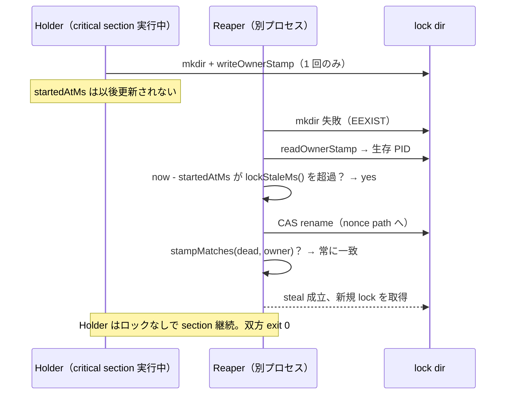
```mermaid
sequenceDiagram
  participant H as Holder（critical section 実行中）
  participant R as Reaper（別プロセス）
  participant D as lock dir
  H->>D: mkdir + writeOwnerStamp（1 回のみ）
  Note over H: startedAtMs は以後更新されない
  R->>D: mkdir 失敗（EEXIST）
  R->>D: readOwnerStamp → 生存 PID
  R->>R: now - startedAtMs が lockStaleMs() を超過？ → yes
  R->>D: CAS rename（nonce path へ）
  R->>R: stampMatches(dead, owner)？ → 常に一致
  R-->>D: steal 成立、新規 lock を取得
  Note over H,R: Holder はロックなしで section 継続。双方 exit 0
```

テキスト代替: holder は acquire 時に一度だけ stamp を書き、以後更新しない。reaper は「生存 PID かつ acquire から `lockStaleMs()` 超過」で steal 入口を通り、CAS 後の検証は同じ `pid + startedAtMs` の一致を見る。holder が stamp を更新しない以上この検証は必ず通過するため、守るべきケースを一切拒否できない。結果として holder はロックを失ったまま critical section を走り続け、両プロセスとも正常終了する。

### 分岐 A — acquire の fail-open が生む恒久 steal 可能 lock

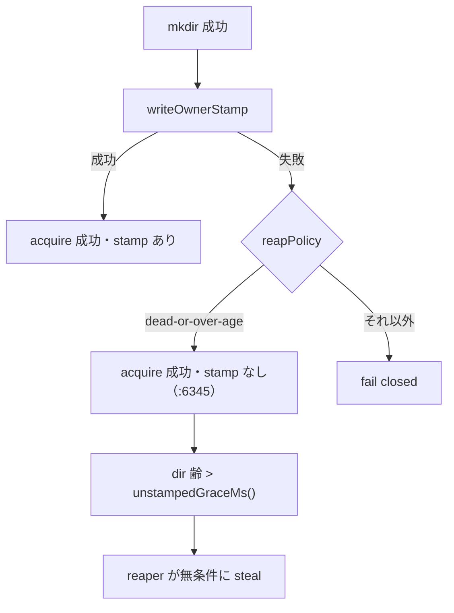
```mermaid
flowchart TD
  A["mkdir 成功"] --> B["writeOwnerStamp"]
  B -->|成功| C["acquire 成功・stamp あり"]
  B -->|失敗| D{"reapPolicy"}
  D -->|dead-or-over-age| E["acquire 成功・stamp なし（:6345）"]
  D -->|それ以外| F["fail closed"]
  E --> G["dir 齢 > unstampedGraceMs()"]
  G --> H["reaper が無条件に steal"]
```

テキスト代替: `finalizeAuditLockAcquire` は `writeOwnerStamp` が失敗しても `dead-or-over-age` 方針なら acquire 成功を返す。この lock は stamp を永久に持たないため、grace 経過後は分岐 A の入口述語を無条件に満たし、タイミングの幸運なしに steal される。fail closed に倒せば、この決定的経路は消える。

### `Completed` 定義の分岐と自己参照検証

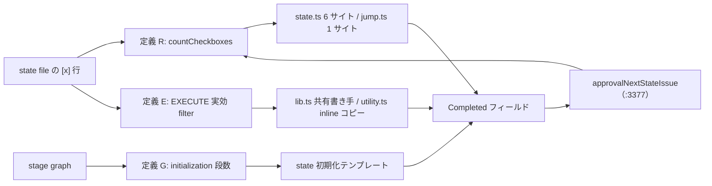
```mermaid
flowchart LR
  S["state file の [x] 行"] --> R["定義 R: countCheckboxes"]
  S --> E["定義 E: EXECUTE 実効 filter"]
  G["stage graph"] --> GG["定義 G: initialization 段数"]
  R --> W1["state.ts 6 サイト / jump.ts 1 サイト"]
  E --> W2["lib.ts 共有書き手 / utility.ts inline コピー"]
  GG --> W3["state 初期化テンプレート"]
  W1 --> F["Completed フィールド"]
  W2 --> F
  W3 --> F
  F --> V["approvalNextStateIssue（:3377）"]
  V --> R
```

テキスト代替: 同一の `Completed` フィールドへ 3 つの独立した定義が書き込み、いずれも audit 行と CLI JSON へ到達する。approve 検証器は定義 R を読み手として再計算するが、これは書き手の一部と同一の定義であるため、定義間の乖離を検出できない。検証器を正準定義へ接続することと、書き手を単一関数へ集約することは別々の是正である。

## registry drift guard の対象機構（260802-registry-drift-guard、履歴、observed `64b44a9f8`）

本節は Developer Code Scan を observed `64b44a9f8c8c79aff876d3275b194f39ead62a49` で合成した現在断面である。正本・テスト・文書の詳細は `re-scans/260802-registry-drift-guard.md` を参照する。

### 境界と責務

| 境界 | 現在の責務 | drift |
| --- | --- | --- |
| `amadeus-state.ts` dispatch | 33 verb を handler へ配送 | `Valid:` は手書き30件。dispatch-only 3件 |
| `amadeus-stage-schema.ts` | required 12 + optional 13 = 25 top-level field を受理・検証 | accepted 集合は非exportで、文書検査が正本を直接参照できない |
| `amadeus-lib.ts` emitter | `FIELD_ORDER` 25件で frontmatter を直列化 | schema との差分は0だが、一致を固定する registry test がない |
| `stage-definition.md` | 「schema が表を逐語コピー」と宣言する権威ある仕様 | `number`、`name`、`produces_kinds`、`sensors`、`reviewer`、`reviewer_max_iterations`、`bundle`、`when`、`required_sections` の9件欠落。`when` を reserved とする |
| `docs/reference/15-stage-definition*.md` | 利用判断が難しい field を英日で詳説 | H3 は top-level 9件相当であり、全25件表ではない。machine registry 不在 |
| `detect-ci-changes.sh` | 変更パスから full/drift/coverage 実行を決定 | `docs/**` のみでは full test が起動せず、docs-only drift が unit guard を迂回する |

設計境界は「抽出」「比較」「配線」の3つに分ける。抽出器は source text から集合を返す純粋関数、比較器は expected/actual の双方向差分・重複・空集合を返す純粋関数、テストと CI は実ファイルをこれらへ渡す adapter とする。schema の accepted 集合だけは既存 `REQUIRED_FIELDS` / `OPTIONAL_FIELDS` を readonly export して再利用し、新しい手書き25件リストを正本として増やさない。

### 設計判断候補とトレードオフ

1. **推奨 — machine registry + 詳細H3の二層文書**: 英日 Field reference 冒頭に全25件の machine-readable table/marker を置き、既存H3は判断を要する項目の narrative として維持する。完全性と可読性を分離できる一方、machine block の英日 parity を検査対象に含める必要がある。
2. **代替 — 全25件をH3化**: 見出し集合だけで完全性を検査できるが、16件分の薄い重複説明を作り、同文書が明示する「judgement-heavy narrative」という責務を壊すため不採用候補。
3. **代替 — schema source と docs を正規表現で直接比較する単一テスト**: 初期実装は短いが、抽出失敗が空集合同士の green になる危険と、CLI/docs の別registryへ再利用できないため不採用候補。
4. **代替 — docs lint のみ**: 文書漏れは捕捉できるが dispatch/help の同型欠陥と empty extraction を閉じず、再発防止の共通機構にならないため不採用候補。

セキュリティ／コンプライアンス上、新しい外部I/O・権限・個人情報は導入しない。リスクは検査の fail-open と診断の誤誘導であり、空抽出拒否、重複検出、negative tamper、source-derived expected により防御する。

## Interaction Diagrams（260802-registry-drift-guard、履歴）

### CLI verb registry の検査フロー

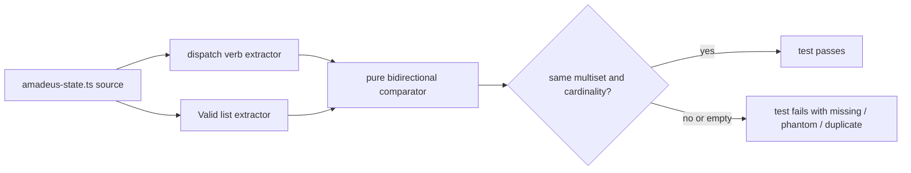
```mermaid
flowchart LR
  S["amadeus-state.ts source"] --> D["dispatch verb extractor"]
  S --> H["Valid list extractor"]
  D --> C["pure bidirectional comparator"]
  H --> C
  C --> R{"same multiset and cardinality?"}
  R -->|yes| P["test passes"]
  R -->|no or empty| F["test fails with missing / phantom / duplicate"]
```

テキスト代替: `amadeus-state.ts` の同じ source text から switch の実dispatch集合と `Valid:` の表示集合を独立抽出し、純粋比較器が双方向差分・件数・空抽出を判定する。どちらか一方だけの追加、phantom 表示、重複、抽出失敗は test failure になる。

### stage field registry の文書同期フロー

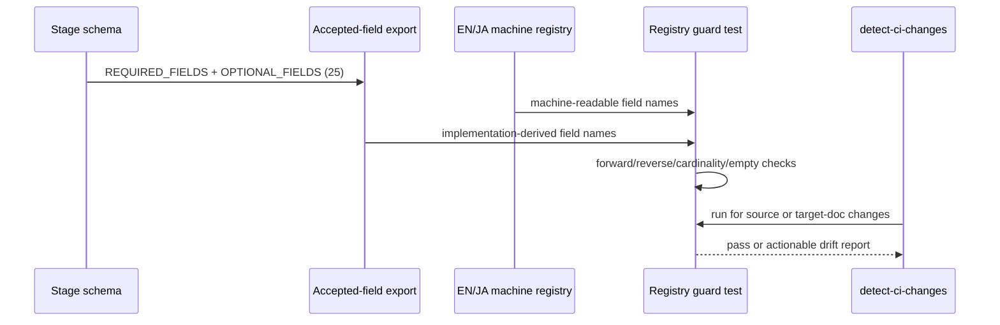
```mermaid
sequenceDiagram
  participant Schema as Stage schema
  participant Registry as Accepted-field export
  participant Docs as EN/JA machine registry
  participant Guard as Registry guard test
  participant CI as detect-ci-changes
  Schema->>Registry: REQUIRED_FIELDS + OPTIONAL_FIELDS (25)
  Docs->>Guard: machine-readable field names
  Registry->>Guard: implementation-derived field names
  Guard->>Guard: forward/reverse/cardinality/empty checks
  CI->>Guard: run for source or target-doc changes
  Guard-->>CI: pass or actionable drift report
```

テキスト代替: schema の既存2配列から accepted 集合を公開し、英日文書の machine registry と test で照合する。source変更だけでなく対象 docs-only 変更でも test が走るよう `detect-ci-changes.sh` を配線し、生成コピーの同期は既存 package/promote drift guard が担う。

## scope-grid 面間同期の対象機構（260802-scope-grid-face-sync、履歴、observed `47574fbab`）

本節の file:line はすべて observed `47574fbab` 時点。患部全数・引用再確認・ガード実行結果は `re-scans/260802-scope-grid-face-sync.md` を正本とする。

- **区間の構造変化（`33e196b80` → `47574fbab`、57 commits / 1,295 files / +74,640 −10,737）**: 患部（scope レジストリ 5 面・promote-self・graph compile・self-scope-consistency センサー）は区間内 0 コミットで無変更（`git log --oneline 33e196b80..47574fbab -- <path>` が 9 パスすべて 0 件）。区間の主な変化は患部外の 5 系統 — (1) `#2017` の `amadeus-layered-config` → `amadeus-config` 全域リネーム（167 ファイル）、(2) `#2012`（`f87cf9389`）formal-model-check の全登録 TLA モデル一般化（FormalElection 固定語彙を `model-map.json` 側へ移設）、(3) plugin compose 読取境界の fail-closed 化（`#1964`/`#1996`/`#2005`/`#1970`、新規 `t410`/`t411`）、(4) fatal-latch 系 loud fail 徹底（`#1959`/`#1961`/`#1966`/`#2000`）、(5) cg-plan-guard 3 Bolt（`#1928`/`#1939`/`#1948`）+ `#2016` mirror label 同期（`t412`）。残りは metrics スナップショット群。区間内で唯一患部近傍に触れたのは `.github/workflows/ci.yml`（`f87cf9389` 1 件）だが変更は `formal-model-check` ジョブのステップ名と echo 文言のみで、drift guard ステップ群（`ci.yml:243-255`）は無変更。

- **scope レジストリの 3 層構造**: scope は「prose（`<face>/scopes/amadeus-<scope>.md`）」と「grid セル（`<face>/tools/data/scope-grid.json`）」の 2 面を持ち、それが 5 つの dogfood ハーネス面（`.claude` / `.codex` / `.cursor` / `.opencode` / `.kimi-code`）に**複製**されて存在する。第 3 層の `dist/<harness>/<face>/tools/data/scope-grid.json` は 7 面すべてが stock 10 行のみで、`self-*` 行を 1 つも持たない（実測: 7 ファイルとも `total_rows=10`、`self_rows=NONE`）。`self-*` は dist に載らない composed / runtime データという位置づけであり、この「dist に正本がない」ことが後述する盲点の共通の根になっている。

- **乖離の現存（observed 実測）**: `self-feature` の 4 セル（`feasibility` / `approval-handoff` / `practices-discovery` / `nfr-requirements`）が `.claude` のみ `SKIP`、他 4 面は `EXECUTE`。EXECUTE 数は `.claude` 15/33 に対し他 4 面 18/32。prose 側も `.claude` だけが 2026-07-28 の lightening 記述を保持し、`amadeus-self-feature.md` は 17 行差、`self-document` / `self-refactor` は各 4 行差、`self-fix` は 0 行差（差分は 4 面とも同一）。すなわち 2026-07-28 の lightening 決定は `.claude` 1 面にしか着地しておらず、他 4 面は決定前の姿のまま 4 か月分の運用を通過している。

- **意図的非対称との切り分け（第 5 の差分）**: `formal-model-check` セルは `.claude` のみ `EXECUTE`、他 4 面は当該キー自体が不在。これは欠陥ではなく設計であり、一次根拠は `packages/framework/core/tools/amadeus-graph.ts` の `mergeComposedScopes` 直上コメント — `:1375` 「A folded row's CELLS are preserved verbatim, including a cell addressing a slug the graph being compiled does not hold.」および `:1387` 「the shipped grid carries `self-feature.formal-model-check`, so every workspace that has not composed that opt-in plugin holds one by design.」。opt-in plugin ステージ（`scopes: []`）はセルを mint しないため、compose 済みの `.claude` だけがセルを持つ。**面間比較を導入する検査はこの 1 セルを差分として報告してはならない** — 同期対象は lightening 由来の 4 セル + prose であり、`formal-model-check` は除外条件として明示的に扱う必要がある。`installer-distribution` scope も同種の非対称（`.claude` / `.kimi-code` のみ存在、他 3 面不在 = 32 セル全体が scope-absent 差分）だが、`self-` 接頭辞でないため現行センサーの対象外。

- **ガード 3 層が green のまま素通しする機序**: 3 層いずれも「面間のセル値」を見ない構造で、乖離を検出する責務がどこにも配置されていない。
  1. **`scripts/promote-self.ts`** — prose は `COMPOSED_SCOPE_RE`（`:124`）が比較経路から除外する（`:455` の `if (COMPOSED_SCOPE_RE.test(rel)) continue; // composed scope — runtime data, never in dist`）。grid は `scopeGridInSync`（`:132-134`、`mergeScopeGrid(got, want).equals(got)`）で判定するが、`mergeScopeGrid`（`:146-166`）は dist に無いキーを extras（`:151`）として拾い、`:156` の `.map((k) => [k, Object.hasOwn(w, k) ? w[k] : g[k]])` で **dst 側の値を verbatim 保持**するため、dist に `self-*` 行が 1 つも無い現状では `self-*` 行に対して恒真になる。`bun run promote:self:check` → exit 0（実測）。
  2. **`amadeus-graph.ts compile --check`** — `mergeComposedScopes`（`:1394-1421`）が `:1409` `if (name in merged) continue;` により folded row のセルを verbatim 保存するため、on-disk のセル値は compile 結果と衝突しない。加えて CI（`ci.yml:254-255`）は `.claude` の tool を起動し、`scopeGridPath()`（`:330-332`、`DATA_DIR` は `:197` の `__FILE_DIR/data`）が起動ファイル自身のディレクトリを基底にするため、**検査対象は起動した 1 面のみ**。exit 0（実測）。
  3. **`self-scope-consistency` センサー** — `packages/framework/core/tools/amadeus-sensor-self-scope-consistency.ts`（231 行）は `readGridScopes`（`:110-137`）が `:116-117` で `Object.keys(grid)` の**名前だけ**を収集し、値である `.stages`（= セル全体）を読み捨てる。`compareExpected`（`:153-172`）は定数 `EXPECTED_SELF_SCOPES`（`:12-17`）との名前集合比較のみで、**面間比較そのものが存在しない**。5 面のコピーは canonical と byte 一致（`cmp` 実測、5/5 IDENTICAL）なので、どの面から起動しても同じ盲点を持つ。直接実行 → `{"pass":true,"findings_count":0,"findings":[],"skipped":null}`。

- **manifest 文言が盲点を前提化している**: `packages/framework/core/sensors/amadeus-self-scope-consistency.md` は `:5` `default_severity: advisory`、`:8` `matches: "**/{scopes/amadeus-self-*.md,tools/data/scope-grid.json}"`、本文 `:37-38` で「The check is advisory at write time. Package and promotion drift guards remain the release-blocking verification surfaces.」と宣言する。しかし上記のとおり package / promotion drift guard は `self-*` 行を構造的に見ない。**advisory センサーが release-blocking と呼んだ相手が、当のセンサーが見ている領域を見ていない** — 責務の相互委譲による空白であり、本 intent の再発防止はこの委譲関係の是正を含む。

- **値比較拡張の設計含意（面間比較が構造的に安全な理由）**: 期待セル値を定数として持たせる案は、grid 本体と並ぶ第 2 の正本を作り、lightening のたびに 2 か所を同期する新しい drift 源になる。面間比較（多数決や canonical face 指定ではなく「全面一致」を不変条件とする）は期待値を持たないため第 2 正本を作らず、`formal-model-check` / `installer-distribution` のような意図的非対称だけを明示的な除外として扱えばよい。センサーは dormant 判定（`:180-185`、self-* が 1 つも無い通常プロジェクトでは `skipped: "no-self-scopes"`）を持つため、面間比較を足しても配布先プロジェクトへの影響はない。

## 2026-08-03 差分更新 — Issue #2018 projection parity 修復

- **決定**: `plugins/<name>/` を authoring 正本、`dist/plugins/<name>/` を全 package face 向け neutral bundle、root の5 self-install面を commit 済み project projection、startup compose を repair path とする。`scripts/package.ts` の 0-plugin harness baseline は維持し、neutral bundle を compile-visible host treeへ直接入れない。
- 現行の責務断線は `package/projection → promote-self → compose → graph compile → runner-gen` にある。`scripts/promote-self.ts` は既存 composition を preserve するだけで欠落面を materialize せず、startup compose が staging／composition／stage graph／runnerを生成して dirty を作る。project projection の生成・検査を明示的な所有者へ集約し、startup は byte-current なら書かない。
- Codex runner の正規先は `packages/framework/harness/codex/manifest.ts` と `emit.ts` が定める project-root `.agents/skills/amadeus-<slug>/SKILL.md` である。runtime compose が生成した `.codex/skills/...` は generic runner-gen の `tools/../skills` 既定値による誤投影であり、face-aware destination を runner生成契約へ渡す。
- 代替案の「起動時 compose だけを正規配布にする」は fresh worktree 初回利用と git-clean を満たさず不採用。「plugin を各 `dist/<face>/<host>` に常時compile-visibleで入れる」は0-plugin stage graph不変条件を壊すため不採用。既存の Interaction Diagrams は保持する。

## formal-model-check 複数モデル化の対象機構（260801-tla-multi-model、履歴、observed `33e196b8`）

本節の file:line はすべて observed `33e196b8` 時点。患部全数・引用再確認・降格確認は `re-scans/260801-tla-multi-model.md` を正本とする。

- **区間の構造変化（`c49e385ac` → `33e196b8`、40 commits / 1,396 files / +135,185 −15,633）**: 最大の構造変化は `54bf1f805`（intent 260731-formal-verif-value-chain、#1925）で、`scripts/formal-verif/` 30 ファイルを削除し `plugins/formal-model-check/tools/` へ 25 本を移設、canonical コピー `packages/framework/core/tools/amadeus-formal-verif-model-map.ts` を新設した（両コピー byte-identical、実測）。残りは otel 基盤拡張（resource-core / span-context / exception イベント / metrics 語彙配線）、mirror 系整備、#1922 修正（`33e196b8` 自身）と metrics スナップショット群。患部領域（`plugins/formal-model-check/` / `specs/tla/`）は `54bf1f805` 着地以降 observed まで無変更。
- **単一モジュール世界観 → 複数モデル一般化の露出面**: model-map v2 は `models[]` 配列スキーマ（`TLA_MODEL_MAP_SCHEMA_VERSION = 2`、`plugins/formal-model-check/tools/amadeus-formal-verif-model-map.ts:56`）で複数モデルを**登録**できるが、実行面は固定定数 `TLA_EXECUTION_MODEL_NAME = "FormalElection"` / `TLA_MODEL_PATH` / `TLA_CFG_PATH`（`:52-54`）に単一バインドする。一般化が触れる面は 6 系統: (1) **schema** — `parseModel` の `exactObject(value, ["cfg", "entries", "model", "name"])`（`:204`）が未知キーを拒否するため、補助モジュール配列（aux）の追加はこの許可リストの改訂を要する。(2) **loader** — `verifyRegisteredAssets`（`tla-model-loader-internal.ts:252-275`）は非実行モデルの model/cfg identity のみ照合し `:258` で実行モデルを skip、aux モジュール（MirrorLifecycleCore.tla 等）は照合対象に載らない（#1921 の hollow）。(3) **arm** — `TLA_NAMED_INVARIANTS`（`tla-arm.ts:322-330`）は FormalElection 固有の不変条件名 7 件。(4) **toolchain** — `tlc-toolchain.ts` の TRACE 解析が FormalElection 固定（`:418` TRACE_STATE_VARIABLES、`:434-436` ラベル正規表現 `of module FormalElection>`、`:439-440` / `:515-516` 変数数チェック、`:493-494` `hasFrozenModelOutputBinding`）。(5) **CI** — `.github/workflows/ci.yml:508-564`（`workflow_dispatch` 限定・timeout 30 分・`run-model-check-ci.ts run|verify`）に加え `node-ci-model-check-port.ts:200-202` / `run-model-check-diagnostic.ts:208-209` / `run-skeleton-ci.ts:82-83` が `FormalElection.tla/.cfg` を直書き。(6) **byte-pin 契約** — `run-model-check-source.ts:118-123` が model/cfg バイトを canonical U1 ソースと `sameBytes` 照合するため、**CLI 引数（`--model`/`--cfg`）を変えるだけでは複数モデル実行は成立しない**（別モデルを渡すと source 照合で SOURCE_DRIFT になる）。
- **identity 設計（aux 追加の整合条件）**: model/cfg identity は domain-tagged canonical（`canonicalIdentity :33-46`、`:40` で `sha256(domain ‖ "\0" ‖ bytes)`、domain = `amadeus.formal-verif.tla.module.v1` / `.cfg.v1`）、entries（implPath, sha256）は生 sha256（completeness sensor `amadeus-sensor-model-completeness.ts:194-195` / `:468`）。aux を optional キーとして追加する設計なら既存の identity 値・entries は不変に保てる。
- **MirrorLifecycle の wrapper/Core 構造**: `specs/tla/MirrorLifecycle.tla`（43 行）は `:31-32` `Core == INSTANCE MirrorLifecycleCore WITH CaptureBoundaryAlwaysCreates <- FALSE` の薄い wrapper で、検証本体は `MirrorLifecycleCore.tla`（648 行）。`specs/tla/model-map.json`（schemaVersion 2）は FormalElection（entries=5）と MirrorLifecycle（entries=4）の 2 モデルを登録済み — 登録面の複数モデル化は済んでおり、残るは実行・照合・CI 面である。

## no-silent-drop の静的検査アーキテクチャ（260801-silent-drop-gate、履歴、observed `d72f60b5a`）

本節の file:line は observed `d72f60b5a81fc6e45f99431d61b6561e91b2fc37` 時点。観測事実の全数は `re-scans/260801-silent-drop-gate.md` を正本とする。

### 観測された既存境界

- contributor-side の静的ゲートは `tests/callsite-guard.ts` に scan roots と allowlist（`:59-67`）、検出・census の純粋関数（`:115-149`）、shrink-only 判定（`:165-205`）を分離する先例がある。
- `tests/complexity-gate.ts:12-24` は測定失敗と baseline 不正を fail-closed にし、`:53-69` は root／baseline／tool command のテスト seam を持つ。
- `.github/workflows/ci.yml:93-143` の `lint` job は Biome、callsite guard、deletion gate、complexity gate を直列実行する。新 gate の blocking adapter はこの境界に属する。
- `packages/framework/core/tools/amadeus-mirror-executor.ts:77-129` の `applyTransition` は `StateResult` を返すが、`persistBlocked` は `:171-201` でその結果を破棄して常に `safety-blocked` を返す。
- `packages/framework/core/tools/amadeus-lib.ts:5399-5429` の `setCheckbox` / `setStageSuffix` は bare `String.replace` で、非一致を入力不変のまま返す。
- #1963 は共有 regex（`amadeus-lib.ts:5476-5493`）、置換後の再抽出・slug 検証（`:5591-5650`）、invalid graph の判別 union（`amadeus-plugin.ts:428-452`）として修正済み。

### 設計上の示唆

静的ゲートは既存 runtime に混ぜず、次の6責務を持つ contributor-side CLI とするのが境界上もっとも浅い。AST rule set は3 shape を独立 rule ID とし、scanner は authored roots と走査完全性だけを所有する。census normalizer、baseline ratchet、node-scoped exemption validator、typed renderer を分離し、CLI が最終的な exit code を一元決定する。baseline は既存債務、exemption は意図的 drop を表すため、同じ台帳へ統合しない。

### Interaction Diagrams

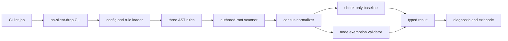
```mermaid
flowchart LR
  CI[CI lint job] --> CLI[no-silent-drop CLI]
  CLI --> CFG[config and rule loader]
  CFG --> AST[three AST rules]
  AST --> SCAN[authored-root scanner]
  SCAN --> CENSUS[census normalizer]
  CENSUS --> BASE[shrink-only baseline]
  CENSUS --> EXEMPT[node exemption validator]
  BASE --> RESULT[typed result]
  EXEMPT --> RESULT
  RESULT --> EXIT[diagnostic and exit code]
```

テキスト fallback: CI の lint job が単一 CLI を起動し、CLI は設定・rule を検証して3 authored roots を走査する。正規化済み census を shrink-only baseline と node 単位 exemption の両方へ照合し、typed result を1か所で stderr と exit code に変換する。設定、rule、tool、baseline、走査完全性のどこかが不成立なら比較前に fail-closed となる。

runtime 側は静的ゲートと別境界で直す。#1878 は `persistBlocked` が `StateResult` の `failed` を `MirrorOperationOutcome` へ昇格する。#1874 は helper または mutation 境界で `changed | not-found` を明示し、caller が不在を消費する。#1963 の resync 経路は [PR #1970](https://github.com/amadeus-dlc/amadeus/pull/1970) の loud-failure 契約を negative/regression fixture として固定し、同じロジックを作り直さない。

## kimi ハーネス bootstrap デッドロックの機構断面（260801-kimi-bootstrap-deadlock、履歴、observed `861688c31`）

本節の file:line はすべて observed `861688c31` 時点。患部全数・認可連鎖・テスト足場は `re-scans/260801-kimi-bootstrap-deadlock.md` を正本とする。

- **区間の構造変化（`c49e385ac` → `861688c31`、33 commits / 537 files / +28,879 −3,094）**: 大半は otel 基盤拡張（resource-core / span-context / exception イベント / metrics 語彙配線）、mirror 系（boundary 対称性・title バイトクランプ）、plugin scope opt-in、composed-scope drop、metrics snapshot 定期コミット群。患部領域では `packages/framework/core/hooks/amadeus-session-start.ts` に +14（otel resource seam の `supplyResourceAttribute("session.id", …)` 配線のみ、`:119-130`）が入ったが、early-exit ガード（`:70`）と `writeCurrentSessionId`（`:117`）の順序は不変 — Issue #1922 の機序は observed HEAD に生存する。
- **#1922 デッドロック連鎖**: (1) Kimi SessionStart → `~/.kimi-code/config.toml` 管理ブロック → `bun .kimi-code/hooks/amadeus-kimi-adapter.ts session-start`。(2) adapter 内部で `trackKimiRoleLifecycle`（`packages/framework/harness/kimi/hooks/amadeus-kimi-lib.ts:418-437`）が `establishKimiMainBaseline`（`:236-`）経由で `kimi-active-subagents.json` を書く（state-file 非依存で常に走る）。`routeTarget`（`:580-`）の `"session-start"` case（`:588-596`）が `normalizePayload`（`:491-500`）経由で core `amadeus-session-start.ts` を spawn。(3) core hook は `:67` `stateFilePath` → `:70` `if (!existsSync(stateFile)) process.exit(0)` で、アクティブ intent 無しのワークスペースではここで終了し、`:117` の `writeCurrentSessionId` に到達しない。(4) 認可 fail-closed: `authorizeMainConductor`（`amadeus-caller-authorization.ts:72-`）は `:75` 非 kimi 即 authorized、`:80-86` deny latch、`:88-94` marker 読めず denied、`:96-109` で `.current-session` ≠ `mainSessionId` → denied。bootstrap 状態では `.current-session` が永久に書かれないため、(2) の baseline marker が存在しても認可は恒久 fail-closed = デッドロック。呼出側は `amadeus-orchestrate.ts:2190` / `amadeus-state.ts:869`。(5) `isTrustedMainStop`（`amadeus-kimi-lib.ts:372-407`、`.current-session` 直読み `:399-403`）も同じ fail-closed。
- **`.current-session` の writer/reader**: writer は `amadeus-session-start.ts:117` のみ（全 repo で唯一。`writeCurrentSessionId` 定義 `amadeus-lib.ts:2170`、`CURRENT_SESSION_FILE` `:2152`）。readers は `amadeus-caller-authorization.ts:96-109`（直読み）、`amadeus-kimi-lib.ts:399-403`（直読み）、`readCurrentSessionId`（`amadeus-lib.ts:2159-2166`）経由 `amadeus-orchestrate.ts:230` / `amadeus-state.ts:853` / `amadeus-utility.ts:4843`。
- **最小修正方向**: `writeCurrentSessionId`（`:117`）を `:70` ガードより前へ移す。同ファイル内先例は `repointHarnessIncludes`（`:62`、コメント `:55-60` が「ガードより前に置く」理由を明記）。`supplyResourceAttribute`（`:119-130`）を一緒に動かすかは別論点（otel 属性は audit 経路）。

## CG 計画整合ガードの機構断面（260801-cg-plan-guard、履歴、observed `cb809c4de`）

本節の file:line は observed `cb809c4de` 時点。全数は `re-scans/260801-cg-plan-guard.md` を正本とする。

- 患部3点: `amadeus-orchestrate.ts:2919-` tryEmitSwarm（`:2937` の bolt_dag 不在無音 false = 並列計画→直列降格の主経路）、`amadeus-runtime.ts:300-313` computeBoltDag（parse 失敗の stderr advisory は spawnRecompile の stdio:ignore に飲まれ実質無音）、`amadeus-lib.ts:7823-` parseUnitsBlock（`- name:` 形式限定 — #1893 の `- id:` は throw→undefined）。
- 実績突合（M2）の一次証拠は audit SWARM イベント（amadeus-swarm.ts:325-327: STARTED/DEGRADED = prepare、COMPLETED = finalize）。成果物タイムスタンプは証拠にならない。
- 区間の構造変化: open-bug-batch-5 の6修正着地。患部3ファイルは touch されたが患部関数は不変（diff 0 を確認）。probe merge-aware 化（#1886）が AUDIT_FORKED/MERGED 観測の直近先例。

## オープンバグ一括修正バッチ第5弾の機構断面（260801-open-bug-batch-5、履歴、observed `c49e385ac`）
## formal-model-check 価値チェーンの対象機構（260731-formal-verif-value-chain、履歴、observed `da51af375`）

本節の file:line はすべて HEAD `16486d3c` 断面（= observed `da51af375` + 本 intent の record コミット1本のみ。ソース面は observed と同一）で実測した（`cid:reverse-engineering:measurement-ref-in-artifacts`）。対象は3 Issue — [#1738](https://github.com/amadeus-dlc/amadeus/issues/1738)（価値チェーン貫通）、[#1829](https://github.com/amadeus-dlc/amadeus/issues/1829)（配布自立化）、[#1510](https://github.com/amadeus-dlc/amadeus/issues/1510)（model-map 正規更新経路）。3件は**それぞれ別の機構層**（compose/projection の配布層、engine の advisory 層、sensor/loader の整合層）に所在し、共有する唯一の面は `plugins/formal-model-check/` の manifest スキーマである。

### 機構 A — plugin 配布の compose/projection 非対称（#1829）

`plugins/formal-model-check/` の正本は3点のみ（`plugin.json` / `README.md` / `stages/` — `ls` 実測、`tools/` は不在）。manifest 実体は次のとおりで、**`tools` フィールドはスキーマに存在しない**:

```json
{"name":"formal-model-check","stages":[{"slug":"formal-model-check","path":"stages/formal-model-check.md"}],"seams":[],"fragments":[]}
```

型と parser の両方が3フィールドで閉じている:

- `packages/framework/core/tools/amadeus-plugin-compose.ts:105-110` — `export type PluginManifest = { name; stages; seams; fragments }`
- 同 `:330-334` — `parseStages` / `parseSeams` / `parseFragments` の3本のみを呼び、他キーは構築されない

**非対称の実体は書込集合の差にある。**

| 経路 | 実装 | tools を運べるか |
| --- | --- | --- |
| projection（正本 → `dist/`） | `scripts/plugin-projection.ts:158` `discoverPluginSources` が `walkFs` で**全ファイル走査**（`:169-172`）、検証は構造安全性のみ（`:194`, `:207-215`）。`.json`/`.ts` は verbatim コピー（`:238-241`） | **運べる**（宣言不要） |
| compose（`dist`/staging → host） | `amadeus-plugin-compose.ts:1021` `composeWriteSet` の `hostWrites` は `plan.stageCopies` と `plan.sharedWrites` のみ | **運べない**（manifest 宣言経路が無い） |

この非対称は**生きた実測として観測できる**: `dist/plugins/formal-model-check/` には中立バンドル + 7 ハーネス面 = **8 変種 / 38 ファイル**（`find -type f` 実測）が存在し `plugin.json`・`README.md` が全変種に現れるのに対し、compose 済み host（`.claude/plugins/formal-model-check/`）には stage md 1本しか存在しない。composition record `.claude/.amadeus-plugin-composition.json` の `ownedPaths` も stage 1本に限定される（`amadeus-plugin-compose.ts:557`）。

したがって #1829 の「16 ファイルを plugin 配下へ移して自立させる」には **manifest スキーマ拡張（型 + parser + `composeWriteSet`）が必須**であり、projection 側は無改修で通る。

### 機構 B — 実行器 54 ファイルの到達可能性分類（#1829 のスコープ境界）

`scripts/formal-verif/*.ts` は 54 ファイル（`ls | wc -l` 実測）。相対 import の推移閉包で4群に分かれ、検算 16+7+1+30 = 54 が一致する。

| 群 | 数 | 到達元 | 内容 |
| --- | --- | --- | --- |
| A | 16 | `run-model-check.ts` の推移閉包 | `canonical` / `contract` / `fs-tlc-toolchain` / `run-model-check*`（6本）/ `tla-arm` / `tla-model-loader*`（2本）/ `tla-model-map` / `tlc-spawn-planner` / `tlc-toolchain` |
| B | 7 | `.github/workflows/ci.yml` から直接 | `run-model-check-ci` / `run-skeleton-ci` / `ci-model-check-runner` / `ci-model-check-domain` / `ci-model-check-artifacts` / `ci-docker-trace` / `node-ci-model-check-port` |
| C | 1 | 診断 CLI | `run-model-check-diagnostic`（閉包は A + 自身） |
| D | 30 | **どの CLI からも到達不能** | `arm-s-*`（5本）/ `dispatcher` / `eligibility*` / `evidence-*` / `fixture-*` / `fs-*`（3本）/ `full-matrix*` / `index` / `proof-policy` / `provenance` / `receipt` / `repository-path-policy` / `tla-skeleton*`（3本）ほか |

群 A の**外部依存はただ1本**: `scripts/formal-verif/canonical.ts:1-5` が `packages/framework/core/tools/amadeus-formal-verif-model-map.ts` から `canonicalIdentity` 等を re-export する。すなわち plugin 配下へ移設しても core 側への依存は1本だけ残る（移設設計上の最重要制約）。

**群 B は CI が消費するため「A の 16 本だけを抜き出して残余削除」は CI を壊す。** `.github/workflows/ci.yml:545` の job `formal-model-check` は `:584` `bun scripts/formal-verif/run-model-check-ci.ts run` と `:600` `... verify` を呼ぶ。B と C の帰属先は要件段の裁定対象（本 RE では確定しない）。

群 D は本番からは死んでいるが**テストからは広く参照**されており（`provenance.ts` 14件、`execution-evidence.ts` 10件）、削除範囲は独立の裁定を要する。

### 機構 C — activation advisory（#1738 の貫通点）

engine が formal-model-check の実行を促す唯一の面。**単一発火点・stderr 単線**で実装されている。

- `packages/framework/core/tools/amadeus-orchestrate.ts:1293` verbatim: `const ACTIVATION_ADVISORY_STAGE = "build-and-test";`
- ガード `:1306` verbatim: `if (slug !== ACTIVATION_ADVISORY_STAGE) return;`
- 呼出 `:1307` verbatim: `const line = activationAdvisoryForHost(hostRoot);` / `:1308` `if (line !== null) err(line);`

チャネル契約は `:1299-1300` のコメントが明示する — 「Writes ONLY stderr — the stdout directive JSON stays byte-pure」（`cid:code-generation:stdout-directive-stderr-advisory` と整合）。

判定本体は `packages/framework/core/tools/amadeus-plugin-activation.ts:272` `activationAdvisoryForHost`（全 295 行）。

- 第1ゲート = compose 済みか（`:230` 近傍のコメント「The advisory's FIRST gate: when false the engine does nothing (0-plugin zero-impact — BR-U6-4)」）
- 判定3値（`:56-57` コメント verbatim: 「`changed` and `never-run` fire the advisory; `current` is silent.」）— `changed` / `never-run` が発火、`current` は沈黙
- 文面2種: `:209` `advisory: ${ACTIVATION_PLUGIN} spec hash CHANGED (specs/tla) — run /amadeus --stage ${ACTIVATION_PLUGIN}` / `:211` `... has no recorded verdict (specs/tla) — ...`
- fail-closed（読取不能は `never-run` へ落ちる）、状態を書かない（`:272` 直上コメント「Never writes state (BR-U6-6). Never throws.」）

**前倒しの設計争点**: `:1296-1297` のコメント verbatim「single guarded call site — emitForSlug — so no latch is needed for BR-U6-8」。発火点を build-and-test より前へ動かす／複数化すると**この単一呼出し前提が崩れ、ラッチ（重複抑止）が新たに必要になる**。#1738 の設計はこの前提の扱いを明示的に裁定する必要がある。

### 機構 D — model-map 更新の詰み構造（#1510）

`specs/tla/model-map.json` は `schemaVersion 1` / model `specs/tla/FormalElection.tla`（identity `742b7785…`）/ cfg（`92656a5c…`）/ entries 5件（いずれも `amadeus-election*.ts` の `implPath` + `sha256`）。スキーマ検証は `packages/framework/core/tools/amadeus-formal-verif-model-map.ts`（`:158` `exactObject(["implPath","sha256"])`、`:186` `exactObject(["cfg","entries","model","schemaVersion"])`）。

**詰みは2つの機構の非対称から生じる**（因果を実測確定）:

1. **実行時は impl-hash ドリフトで fail-closed する。** `scripts/formal-verif/tla-model-loader-internal.ts:232` verbatim:
   `if (sha256 !== entry.sha256) return drift(entry.implPath, "implementation entry hash differs from model map");`
   （他3分岐 `:221` / `:224` / `:229` はファイル種別・可読性のドリフト。消費側は `:239` `loadVerifiedTlaSourceInternal`、`:236-237` に internal/test-only seam の注記）
2. **正規更新は model/cfg が変わっていないと拒否する。** `packages/framework/core/tools/amadeus-sensor-model-completeness.ts:650-659` — `assetFailure` フィルタ通過後、`assets.modelIdentity === loaded.map.model.identity && assets.cfgIdentity === loaded.map.cfg.identity` なら `{ ok: false, code: "MODEL_UNCHANGED" }`。**判定は model/cfg identity のみで、entries の impl-hash を一切見ない。**

結果、**impl だけを変更した場合（`amadeus-election*.ts` の編集）、実行は SOURCE_DRIFT で止まるのに model-map を正規手順で更新する経路が存在しない**。

センサー側はこの非対称をさらに際立たせる: `.claude/sensors/amadeus-model-completeness.md:8` verbatim
`matches: "**/{specs/tla/**,packages/framework/core/tools/amadeus-election*.ts}"`
— **impl 変更でセンサーは発火するが、その発火から更新に到達できない。** 文書化された唯一の更新手順は同ファイル `:37`（`:39-41` に MODEL_UNCHANGED 拒否の記述あり）。更新本体は `amadeus-sensor-model-completeness.ts:691` `updateModelMapInternal`、公開 API `:729`、CLI 分岐 `:778-779` / `:790`。

### 機構 E — mirror lifecycle 状態機械（新規 TLA モデル題材の有限ドメイン）

#1738 が「価値チェーンを貫通させる」ために必要な**新しい検証題材**の候補。`amadeus-mirror*.ts` は 25 ファイル / 12,174 行（`wc -l` 実測）で、語彙は `amadeus-mirror-types.ts`（608 行）に集中し、**有限ドメインが全列挙可能**。

| 型 | 濃度 | 値 |
| --- | --- | --- |
| `MirrorMode` `:13` | 3 | off / prompt / auto |
| `MirrorOperation` `:15` | 3 | create / sync / close |
| `MirrorBoundary.kind` `:23-33` | 6 | intent-initialized / intent-capture-approved / phase-verified / parked / workflow-completed / manual |
| `MirrorFailureClass` | 14 | configuration / not-installed / unauthenticated / permission / rate-limit / network / api … |
| `MirrorReceiptStatus` `:66-73` | 7 | prepared / attempted / succeeded / skipped-for-event / pending / safety-blocked / abandoned |
| `MirrorMutationEffect` | 3 | not-started / no-effect-confirmed / outcome-unknown |
| `MirrorPhaseKey` | 5 | ideation / inception / construction / operation / done |
| `MirrorProjectSyncState` | 3 | synced / pending / safety-blocked |
| `MirrorProjectMutation` | 2 | add-project-item / update-project-item-field |
| `MirrorRegistryStatus` | 4 | in-flight / parked / complete / archived |

遷移は `packages/framework/core/tools/amadeus-mirror-state-reducer.ts:55` の `MirrorTransition` union。**inline 18 種**（`prepare` / `mark-attempted` / `claim-create-attempt` / `retry-after-no-effect` / `claim-observed-retry` / `complete` / `complete-with-project-sync-hold` / `skip-for-event` の receipt 8 + `set-warning` / `set-global-warning` / `clear-global-warning` / `mark-pending` / `mark-safety-blocked` / `abandon-attempt` / `set-expected-prompt` / `consume-expected-prompt` / `repair-link` / `issue-repair-challenge` の補助 10）に加え、`:113` verbatim `| ProjectSyncTransition;` が入れ子で3種（`CommitProjectReconciliationTransition` / `HoldForProjectSyncTransition` / `RetireProjectSyncHoldTransition`、`amadeus-mirror-project-reconciliation-reducer.ts:45-48`）を持つため、**モデル化対象の遷移は計 21 種**。統合口は `:814` `reduceMirrorState`。

終端状態は4（`:127-132` `TERMINAL_STATUSES` = succeeded / skipped-for-event / safety-blocked / abandoned）、非終端3。ガードは4本（`:692-715` verbatim）:

- `guardMarkAttempted` — `status === "prepared" || status === "attempted"`
- `guardClaimCreate` — 上記 + `r.createIdentity`
- `guardRetryNoEffect` — `status === "pending" && lastEffect === "no-effect-confirmed"`
- `guardObservedRetry` — `status === "pending" && lastEffect === "outcome-unknown"`

**有限化定数**: receipts は可変長 Record だが `:42` `export const MAX_RECEIPTS = 1000;` が上限を与える。TLA モデル値では receipt 数の上限を小さい定数へ落とす必要がある（要件段の裁定対象）。

**boundary → operation 写像**（`amadeus-mirror-coordinator.ts:230-244` `operationForBoundary` verbatim）:

```ts
if (context.boundary.kind === "manual") return null;
if (context.boundary.kind === "intent-capture-approved") return "create";
if (context.boundary.kind === "workflow-completed") { return nextCompletionOperation({...}); }
return state.issueNumber === null ? "create" : "sync";
```

`intent-capture-approved` が **`state.issueNumber` を見ずに `create` 固定**である点は、本日実測の [#1838](https://github.com/amadeus-dlc/amadeus/issues/1838)（重複 create）の直接機序候補である。モジュール規模は state-codec 1946 / executor 1562 / lifecycle 1272 / coordinator 1004 / reducer 823 / types 608 — **骨格は reducer + types に閉じる**ため、model-map entries の正準 impl 集合の第一候補になる。

### 3機構の相互作用と分割可能性

| 面 | #1738 | #1829 | #1510 |
| --- | --- | --- | --- |
| `plugin.json` manifest スキーマ | 間接 | **改修必須** | — |
| `amadeus-plugin-compose.ts` | 間接 | **改修必須** | — |
| `amadeus-orchestrate.ts` advisory | **改修対象** | — | — |
| `amadeus-sensor-model-completeness.ts` | — | — | **改修対象** |
| `scripts/formal-verif/` 移設 | — | **改修対象** | — |
| `specs/tla/` 新モデル | **追加対象** | — | 間接（entries 更新） |

**共有ファイルはゼロ**であり、3件は独立 Bolt として並行実装できる。ただし #1829 の移設が `scripts/formal-verif/` のパスを変えると `tests/.coverage-patch-allowlist.json` と `tests/.complexity-baseline.json` の双方が影響を受けるため、この2台帳が唯一の直列化点になる。

## オープンバグ4件の対象機構（260731-open-bug-batch-4、履歴、observed `6e7a9d701`）
## perf 検証の CI 分離が触れる機構（260731-perf-ci-separation、履歴、observed `da51af375`）
## オープンバグ一括修正バッチ第5弾の機構断面（260801-open-bug-batch-5、履歴、observed `c49e385ac`）

本節の file:line はすべて observed `c49e385ac` 時点。患部全数・機構詳細・Bolt 交差判定は `re-scans/260801-open-bug-batch-5.md` を正本とする。

- **区間の構造変化（`da51af375` → `c49e385ac`、11 commits）**: (a) `771afe2a2`（#1850）で OTel API ファミリーが唯一の上流として着地 — `packages/framework/core/otel/` 18モジュール（bootstrap の logs arm `:84-104` / traces arm `:108-116` の二分、tracer-provider の二重登録 throw `:205`、fatal-latch、relay）が dist 7面+self-install へ投影された。(b) perf tier 分離（#1848/#1851/#1855/#1859）で `tests/perf/` と `perf.yml` が新設され、ci.yml からベンチマーク3 job が削除された。
- **本 intent の対象機構は5クラスタ**: (1) mirror 状態機械 — policy の applicable-operations 非対称（`amadeus-mirror-policy.ts:66`）と executor close 短絡の mark-attempted 欠落（`amadeus-mirror-executor.ts:1259-1266`）+mark-pending 死経路（`:527` × reducer `:557-558`）。(2) engine/state — birth scaffold の Construction Autonomy Mode 欠落（`amadeus-utility.ts:4461-`）と report の checkbox 行欠落 fail-closed（`amadeus-orchestrate.ts:4405-4411`、next 側 `:3622-3627` は寛容という非対称）。(3) OTel — fatal-latch の emit 経路不参照（`logger-provider.ts:67-110`）と session-end の seam 迂回直呼び（`hooks/amadeus-session-end.ts:80-81`、latent）。(4) graph 合成 — `mergeComposedScopes` の `knownSlugs` フィルタによる lossy drop→compose（`amadeus-graph.ts:1405-1411`）+実リポジトリ断面 `compile --check` の CI 不在。(5) metrics publication — TOCTOU 偽赤（`scripts/metrics-publication-github.ts:119-134` × `metrics-publication-domain.ts:453-462` の problems 無条件 terminal 化）と maintenance dispatch スキップ（`:536-540`）。

## OTel メタ情報スキーマ実装の技術断面（260801-otel-meta-schema、履歴、observed `9c8df859e`）

本節の file:line・件数はすべて observed `9c8df859e`（`git rev-parse HEAD`）時点（`cid:reverse-engineering:measurement-ref-in-artifacts`）。対象は Issue #1868（OTel メタ情報スキーマ v1 — resource 12属性 / span / log / exception / subagent / metrics の6面）。

### 全体像 — 3プロバイダ + 2ストア + 1リレー

OTel 実装は `packages/framework/core/otel/` の18モジュール（計 4,123 行）に閉じている。API は自前実装で、vendored OTel API（`core/vendor/opentelemetry/`）のインターフェースに直接実装している（NodeSDK・BatchSpanProcessor は不使用 — `tracer-provider.ts:1-10`）。

- **Logs arm**（canonical）: `logger-provider.ts` → `audit-log-exporter.ts`（監査ジャーナル、durability 契約の所有者）+ `local-log-exporter.ts`（機械ローカル）
- **Traces arm**（telemetry）: `tracer-provider.ts` → `local-span-exporter.ts`
- **Metrics arm**（telemetry）: `meter-provider.ts` → `local-metric-exporter.ts`
- **Relay**: `relay.ts` — Signal Store の JSONL を OTLP へ転送する専用モジュール（U11 で Projector から縮退）

### resource の現状 — 単一 literal、span record のみ

resource はプロセス全体で **1 箇所の literal** だけが組み立てる。`tracer-provider.ts:137`:

```
resource: { "service.name": "amadeus", "telemetry.sdk.language": "typescript" },
```

`AmadeusSpan.end()`（`:122-141`）がレコード組み立て時に埋めており、組み立て関数も定数も存在しない。canonical ツリー全体で `"service.name"` / `telemetry.sdk.language` の出現はこの1行のみ（`grep -rn 'telemetry.sdk.language\|"service.name"' packages/framework/core --include='*.ts' | grep -v vendor` → 1 hit）。

**logs / metrics には resource の概念自体が無い。** `CanonicalEventRecord`（`logger-provider.ts:87-105`）は `intentId` / `space` / `cloneId` / `traceId` / `spanId` を持つが resource フィールドを持たず、`MetricRecord`（`local-metric-exporter.ts`）も同様。Relay の `resourceAttributes()`（`relay.ts:298-312`）は `record.payload.resource` からのみ吸い上げるため、**logs / metrics の OTLP resource は現状ほぼ空**である。#1868 §1 の12属性を「全シグナル共通」にするには、span 以外の 2 ストアにも resource を載せる構造追加が要る。

### 一元組み立ての設計位置 — bootstrap seam

resource を1度だけ組み立てて3プロバイダへ配る位置として構造上最も自然なのは `bootstrap.ts`（Bolt M-P で新設、`fc94b38ba`）。理由は設計コメント `:1-22` が明示する既存契約そのものである：

- 「the single place that sequence lives」— 全 entry point が無条件に呼ぶ唯一の初期化点
- 「idempotent by construction」— API シングルトンへ問い合わせて判定し、シャドウフラグを持たない
- arm が分離済み: `ensureOtelBootstrap(projectDir)`（`:84-101`、logs + side-effect）/ `ensureTracerBootstrap(projectDir)`（`:108-116`、traces、side-effect なし）

両者とも引数は `projectDir` のみで、exporter を生成して register する形。resource を第2引数（または内部で1回解決）として通す拡張はこの形と整合する。

**metrics arm は bootstrap に存在しない。** `registerMeterProvider` の呼出しはテスト3ファイル（`t369-otel-metrics-subset` / `t-otel-exporter-contract` / `t-otel-credential-free-gate`）のみで、プロダクションコードからは一度も呼ばれていない（独立実測: `grep -rn 'registerMeterProvider' packages/framework/core --include='*.ts'` の hit は `meter-provider.ts` 内の定義・throw のみ）。#1868 §6 の計器を出すには **bootstrap の metrics arm 新設が前提**になる。

### redaction の二層構造と resource の位置

`redaction.ts` の1ポリシーを両層が共有する（`:1-13`）。default-deny で、safe-key は registry の required∪optional から機械導出（`:65-71` `REGISTRY_ATTRIBUTE_KEYS`、`Command` のみ opt-in tier へ隔離）。

- **write-time 層**: `logger-provider.ts:78`・`:119`（logs）、`subprocess-span.ts:82`（span 属性を call site 側で通す）
- **export-boundary 層**: `audit-log-exporter.ts:157`、`local-log-exporter.ts:87`、`local-metric-exporter.ts:71`、`local-span-exporter.ts:91-97`、`relay.ts:233`・`:310`

**独立検証で判明した非対称（scan 報告より精密化）**: span の export 境界 `redactRecord()`（`local-span-exporter.ts:88-99`）は `attributes` / `events[].attributes` / `links[].attributes` を通すが、**`resource` は通さない**（スプレッド `...record` でそのまま素通り）。一方 Relay の `resourceAttributes()`（`relay.ts:298-312`）は resource 値を `scrubCredentials` するが、**キーの default-deny admission は意図的に迂回する**（コメント `:294-297`「Resource is the exporter's own identity bag ... so it keeps its keys rather than passing the default-deny attribute filter — but its values are credential-scrubbed」）。

つまり resource は現在 **ローカルストアでは無処理・OTLP 送出時のみ値スクラブ** という一層構造である。#1868 設計原則4「resource / span attributes とも既存の二層 redaction の対象に含める」は、resource について現状を満たしていない。`host.name` / `vcs.*` / `session.id` を resource へ載せる変更は、この層の追加を伴う。

### exception 経路の拡張点

`AmadeusSpan.recordException()`（`tracer-provider.ts:145-157`）は registry def の durability を実行時検査し `telemetry` でなければ throw（`:151-154`、FR-EVT-7 の不変条件）したうえで、`exception.message` **のみ**を addEvent する（`:156`）。`err.name` / `err.stack` は受け取っても捨てている。

registry def（`event-registry.ts:827-837`）は `requiredAttributes: ["exception.message"]` / `optionalAttributes: []`。safe-key が registry から機械導出される構造（`redaction.ts:65-71`）のため、**`optionalAttributes` へ `exception.type` / `exception.stacktrace` を追加すれば redaction の admission は自動追従する** — これが #1868 §4 の最小改修経路である。

ただし `addEvent()`（`tracer-provider.ts:98-105`）は write-time のフィルタを一切通さず生の bag を `this.events` へ push する。守っているのは export 境界（`local-span-exporter.ts:93`）だけなので、stacktrace は **単層** の防御しか受けない。かつ `CREDENTIAL_SCRUB_PATTERNS`（`redaction.ts:35-45`）の6パターンは credential 形のみで、**ホームディレクトリ絶対パスを扱うパターンは存在しない** — #1868 §4 が要求するパス書換えは新規パターン（またはパス専用の正規化関数）の追加になる。

### subagent 観測のギャップ — started の発火点が無い

完了側のみ実装済み（`hooks/amadeus-log-subagent.ts`、`SubagentStop` で配線）。開始側は **hook イベント自体が未配線**である。独立実測（`grep -rn 'SubagentStop\|PreToolUse\|...' packages/framework/harness/claude/settings.json.example`）で確認した宣言イベントは `UserPromptSubmit`（:23）/ `SessionStart`（:34）/ `SessionEnd`（:49）/ `PostToolUse`（:60）/ `SubagentStop`（:113）/ `Stop`（:124）で、**`PreToolUse` セクションが存在しない**。`PostToolUse` の matcher は `Write|Edit` / `TaskUpdate` / `AskUserQuestion` / `Bash` で `Task` を含まず、かつ PostToolUse は完了後発火のため started の担い手にならない。

→ `amadeus.subagent.started` は `PreToolUse`（matcher: `Task`）セクションの新設が必要。#1868 §5 が指摘する「プロセス境界を跨ぐ」問題は、spawn 側（親プロセスの PreToolUse）と完了観測側（親プロセスの SubagentStop）が**どちらも親側 hook** であるため、スパン組み立ては親プロセス内で閉じられる構造にある。

### trace 連結は既に成立している

subagent 内のツール操作スパンは TRACEPARENT env 伝播（`context.ts:248`、W3C 形式を手実装 — `:12`・`:237` の `TRACEPARENT_RE`）で既に同一 trace へ連結済み。親不在時は `processParentSpanContext()`（`tracer-provider.ts:69`）が env carrier または復元済み intent anchor へフォールバックし、短命プロセスが孤児 trace を開かない（BR-3）。#1868 §5 の lifetime スパンは、この既成の連結の上に**親スパンを1段挿す**設計になる。

### intent 識別の現在位置 — 保存パス経由

span 側に intent 属性は無い。`local-span-exporter.ts` は `telemetryDir(options.projectDir)`（`amadeus-observability.ts:140-144` → `recordDir(projectDir)` 配下）へ書くため、**intent 識別は保存パスに符号化されている**だけである。logs 側は `CanonicalEventRecord.intentId`（`logger-provider.ts:97` が `activeIntent()` を解決）として行に直載り。#1868 §2 は span 側をこの行直載り形へ揃える変更にあたる。

## perf 検証の CI 分離が触れる機構（260731-perf-ci-separation、履歴、observed `da51af375`）

本節の file:line はすべて observed `da51af375` 時点（`cid:reverse-engineering:measurement-ref-in-artifacts`）。

### 区間の構造変化（`6e7a9d701` → `da51af375`、11 commits / 120 files / +3939 −102）

ソース面を触るのは4コミットのみで、いずれも**テスト側**（本番 core 正本の変更は #1823 の mirror 表示層1件のみ）。`.github/`・`scripts/`・`package.json`・`tests/run-tests.ts` は**区間内で無変更**であり、本 intent が対象とする CI/ランナー構造は base 時点から不変である。

| commit | 面 | 構造上の意味 |
| --- | --- | --- |
| `7ec3e0eae`（#1820） | `tests/integration/t224-upstream-v2-migration-cli.test.ts` | subprocess 終了チャネル3分類（`EXIT_CHANNEL_CASES` `:72`）と spawn 枯渇リトライ seam（`RETRYABLE_SPAWN_ERROR` `:90` = `/\b(?:EAGAIN\|EMFILE\|ENOMEM)\b/`、`SPAWN_RETRY_LIMIT` `:91`、`SPAWN_RETRY_BACKOFF_MS` `:92`、`runWithSpawnRetry` `:206`）。**integration tier が既に spawn 競合下にあることの直接証拠** |
| `20230b90d`（#1822） | `tests/integration/t259-guard-corpus.test.ts` | 2回の逐次 child spawn を単一プロセス内の交互計測へ集約。時間窓分離由来の偽赤を除去。テスト予算 `}, 90_000)` → `}, 180_000)`（`:121`、base 時点は `:125` で `90_000`） |
| `9008141df`（#1823） | `packages/framework/core/tools/amadeus-mirror-presentation.ts` | `mirrorSnapshotStatus` `:250-252` 新設（`return snapshot.completionInstance === undefined ? snapshot.status : "Completed";`）。表示層の canonical 1定義化 |
| `1a3087508`（#1821） | `tests/integration/t-team-up-codex-resume.serial.test.ts` | fixture の safety-wait supervisor を reap する。当該ファイルはスイート最遅（ローカル実測 105.54s） |

### 機構 A — テスト tier はディレクトリのみが軸で、除外は basename 集合で入る

`tests/run-tests.ts:71` verbatim: `type Level = "smoke" | "unit" | "integration" | "e2e";`。tier ごとのファイル集合は `levelFiles(level, excludes)` `:839-850` が `join(SCRIPT_DIR, level)` + `readdirSync` で**ディスクから列挙**する。ファイル単位の tier メタデータは存在せず、**ディレクトリが唯一の tier 軸**である。

除外の唯一の口は `levelFiles` 第2引数の `excludes`（basename 集合）で、`runFilesPartitioned(level, effectiveParallel, collector, excludes)` `:875-880` 経由で渡る。既存の利用例は t19 preflight（`:1161-1166`）と e2e TUI 分割（`:1186` / `:1204`）。**`runTier` `:900-909` は `excludes` を受け取らない**ため、smoke / unit を除外対象にするならシグネチャ変更が要る。integration / e2e は `runFilesPartitioned` を直接呼ぶ経路が既にある。

### 機構 B — `--ci` は smoke+unit+integration であり e2e は既に PR ブロック外

`tests/run-tests.ts:197-202` の `case "--ci"` は `runSmoke` / `runUnit` / `runIntegration` を立てるのみ。`--release` / `--all`（`:203-211`）だけが `runE2e` + `fullProfile` を追加する。したがって **e2e は既に PR ブロック対象外**であり、最小コストの分離レバーは新フラグではなく**ディレクトリ residency**である。

並列度は `DEFAULT_PARALLEL = Math.min(availableParallelism(), 4)` `:45`。smoke / unit は強制直列（`:881` `const pinnedSerial = level === "smoke" || level === "unit";`、`:901` `const effectiveParallel = level === "smoke" || level === "unit" ? 1 : args.parallel;`）で、integration は `-P 4` 帯で並列に走る — **perf テストはこの並列帯に同居している**。

### 機構 C — ci.yml のジョブグラフと2系統の perf

`.github/workflows/ci.yml` には性質の異なる2系統の perf 検証がある。

**(1) スイート内 perf（PR ブロックする、最大3回実行）**

| job | 行 | 条件 | timeout | perf 関連コマンド |
| --- | --- | --- | --- | --- |
| `tests` | `:167` | `full == 'true'` | 20分 | `:189` `run: bun run test:ci -- -P 4` |
| `coverage-head` | `:293` | `coverage == 'true'` | 20分 | `:320` `run: bun run coverage:ci -- -P 4` |
| `coverage-base` | `:353` | `coverage == 'true'` | 20分 | `:395` merge-base で `bun run coverage:ci -- -P 4` |

`package.json:19-20` verbatim: `"test:ci": "bun tests/run-tests.ts --ci"` と `"coverage:ci": "bun tests/run-tests.ts --ci --coverage --coverage-dir coverage"` — **両者は同じ3 tier を実行し、差は `--coverage` の有無だけである**。`scripts/detect-ci-changes.sh:19-32` は `tests/*` と `*.ts` を `full=true` かつ `coverage=true` に分類するため、テストファイルを1つ触るだけで3ジョブすべてが起動する。**integration tier は1 PR あたり最大3回走り、上記の perf 予算はそのたびに競合ランナー上で支払われる**（`coverage-base` はキャッシュヒット時にスキップ）。

**(2) mirror distribution ベンチマーク（既に `ci-success` の外）**

`distribution-benchmark` `:224`（matrix `replica: [1, 2, 3]`、`fail-fast: false`、timeout 宣言なし）→ `distribution-benchmark-aggregate` `:255`（**`if:` を一切持たず** `needs: distribution-benchmark` だけで走る）→ `distribution-release-gate` `:279`（`:290-291` verbatim `test "${CONTRACT_RESULT}" = "success"` / `test "${PERFORMANCE_RESULT}" = "success"`）。

`ci-success`（`:648`、name `CI Success`）の `needs` は `:651-659` の8件 = changes / typecheck / lint / distribution-contract / plugin-conformance-e2e / tests / drift-check / coverage であり、**`distribution-release-gate` は含まれない**。

さらに GitHub ruleset `18843917`（name `main`）の required status check は **`CI Success` の1件のみ**（`gh api repos/amadeus-dlc/amadeus/rulesets/18843917`、2026-07-31 実測）。したがって mirror ベンチマーク鎖は **de jure でも既に非ブロッキング**である。ただしランナー時間は依然として replica 3本 + aggregate（+ release gate）を消費する。

予算は `scripts/mirror-distribution-benchmark.ts:11-20` の `MIRROR_BENCHMARK_PROTOCOL`（warmups 3 / runs 20、`packageWrite` `packageCheck` p95 30_000ms、`promote` 20_000ms、`docsParity` `digestMatrix` 2_000ms、RSS 512MiB / digestMatrix のみ 128MiB）。

### 機構 D — 非ブロッキング／別トリガ workflow の既存様式

- `.github/workflows/metrics-maintenance.yml:3-5` verbatim: `on:` / `repository_dispatch:` / `types: [metrics-maintenance]`。`concurrency: group: metrics-maintenance` / `cancel-in-progress: false` `:10-12`。別 workflow のため `ci-success` に入らない。
- `ci.yml` `metrics-snapshot` `:475`、`:480` verbatim: `if: ${{ github.event_name == 'push' && github.ref == 'refs/heads/main' && needs.changes.outputs.coverage == 'true' && needs.coverage.result == 'success' }}` — 「main でだけ走り PR を塞がない」の in-CI 既存テンプレート。
- `release.yml` は `workflow_dispatch`（`bump` / `dry-run` 入力）による operator 起動様式。
- **`schedule:` トリガはリポジトリ内に1件も存在しない**（`grep -rn '^\s*schedule:' .github/workflows/` が 0 hit、2026-07-31 実測）。既存様式は `repository_dispatch` と `workflow_dispatch` の2つである。


## オープンバグ4件の対象機構（260731-open-bug-batch-4、履歴、observed `6e7a9d701`）

本節の file:line はすべて observed `6e7a9d701` 時点（`cid:reverse-engineering:measurement-ref-in-artifacts`）。4件は所有機構が「テストハーネスのプロセス寿命」「テストの診断設計」「ベンチマークの計測設計」「mirror の表示層」に分離しており、1 Issue = 1 Bolt = 1 PR で並行実装できる。**3件（#1811 / #1800 / #1797）は患部がテスト側にあり本番コードを触らない**という共通性質を持つ。

### 機構 A — fake supervisor stub が不死設計でテスト後もプロセスが残留する（#1811 P1/S2）

患部は本番コードではなく**テスト fixture の stub 設計**にある。`tests/integration/t-team-up-codex-resume.serial.test.ts` が生成する fake safety-wait supervisor は、終了条件を SIGTERM ひとつだけに委ねている。

- `:218` verbatim: `process.on("SIGTERM", () => process.exit(0));`
- `:219` verbatim: `setInterval(() => {}, 1_000);`

`setInterval` が event loop を無期限に保持するため、SIGTERM を明示的に送らない限りプロセスは終わらない。掃引の受け皿も無い — `afterEach`（`:39-41`）は一時ディレクトリの `rmSync` のみで、生成したプロセスの kill/reap を一切行わない。

**漏洩する経路は3本**（いずれも `--kill` を通らずに終端する）:

| 行 | テスト | 漏洩の理由 |
| --- | --- | --- |
| `:590` | `a fresh Codex launch pre-registers every role with agmsg` | launch のみで `--kill` を呼ばない |
| `:973` | `continue reuses the current run worktrees and restores its runtime` | `--kill` 後に `-c` で再開し、再開した supervisor を kill しない |
| `:1004` | `the first legacy resume requires a runtime and adopts fixed worktrees in place` | adopt 後に kill しない |

**本番側は fail-closed で実装済みである。** `packages/framework/core/tools/team-up-codex-safety-wait.ts` の supervise ループは run record の生存を毎周確認する — `:643` verbatim: `while (await runRecordIsActive(runRecord, run, session)) {`。`runRecordIsActive`（宣言 `:561`）は run record 3ファイルの読取に失敗すれば `:580-582` の `catch` で `false` を返し、ループを抜けて終了する。すなわち**実運用の supervisor は run record が消えれば自律終了する**のに対し、テスト stub はその契約を写していない。

**PID の追跡経路は既に存在する。** `packages/framework/core/tools/team-up.sh:508` verbatim: `printf '%s\n' "$pid" >"$member_record/safety-wait.pid"` が member record 配下へ PID を残すため、テスト側の掃引はこのファイルを読めば成立する。ただし `afterEach` の `rmSync` がディレクトリごと削除するため、**掃引は `rmSync` より前に行う必要がある**（順序が要件）。

**修正方式候補**:

| 案 | 内容 | 影響 |
| --- | --- | --- |
| A | stub へ record 実在ポーリングを付与し本番契約を写す | `:717` / `:774` / `:823` の3テストへの影響検証が必須。述語は「record ディレクトリ実在のみ」に弱めるのが安全（本番の3ファイル読取まで写すと fixture が過剰結合する） |
| B | `afterEach` に期限付き kill/reap 掃引を追加する | 既存テストへの影響なし |
| **C**（推奨） | A + B | 契約の写しと安全網の両立 |

**本番非改変を推奨する** — `packages/framework/core/` を触ると 7 dist + self-install の再生成が発生し、他3件の Bolt と生成面で交差する。

**同族の非該当**: `t267` の `nohup` は PATH リンク一覧の一要素（claude runtime 向け）であり本機構と無関係。ライブ実測では残留プロセス84本（全 PPID=1、1 launch = 7 role）を観測した。

### 機構 B — 診断の非対称がテスト失敗の原因特定を阻む（#1800 P3/S3）

`tests/integration/t224-upstream-v2-migration-cli.test.ts` は subprocess の終了チャネルを3種に分類する設計を**既に持っている**。ヘルパーは終了状態を `:170` / `:210` の同型行 verbatim: `status: result.status ?? -1,` で正規化し、`-1` を「exit status を持たない終了」（signal 終了 または spawn 失敗）のセンチネルとして使う。この3分類は `:311-313` の `test.each` で契約として固定済みである。

- `:311` verbatim: `["exit-status", { status: 1, signal: null, error: null }],`
- `:312` verbatim: `["signal", { status: -1, signal: "SIGTERM" as NodeJS.Signals, error: null }],`
- `:313` verbatim: `["spawn-error", { status: -1, signal: null, error: "spawn EAGAIN" }],`

成功系にはこの分類を活かす診断ヘルパー `expectSuccessfulMigration`（宣言 `:218`）があり、失敗時に exit path / status / signal / error / stdout / stderr を並べた多行メッセージを投げる（`:225-238`）。

**患部は、失敗系の一箇所だけがこのヘルパーを通らないことである。** `:1411` verbatim: `expect(collided.status).toBe(1);` — 素の等値比較のため、`-1` が返ったときの出力は `expected 1, received -1` に留まり、signal 終了なのか spawn 失敗なのかが**構造的に読めない**。第一容疑は負荷条件下の spawn `EAGAIN`（`:313` が既に固定している分類）である。

**修正候補**:

| # | 内容 | 位置づけ |
| --- | --- | --- |
| (i) | 診断の対称化 — `expectSuccessfulMigration`（`:218`）と同型のヘルパー経由へ寄せる | **必須**。既存の3分類設計を失敗系へ延長するだけで新規機構を要さない |
| (ii) | spawn-error 限定リトライ（`EAGAIN` / `EMFILE` / `ENOMEM` のみ・上限2回） | signal 終了と exit status はリトライしない。リトライ範囲の限定が要件 |
| (iii) | 並列度制御 | **スコープ外** |

再現不能な場合の扱い（修正の受理条件）は要件段で明示する — 「再現しなかったので閉じる」は無申告のスコープ縮小に当たる（`cid:build-and-test:no-silent-scope-narrowing`）。

### 機構 C — 逐次計測の別時間窓が比 assert を系統的にずらす（#1797 P3/S4）

`tests/integration/t259-guard-corpus.test.ts` は corpus のスケーリング特性を「2倍の入力で時間・RSS が 2.5倍以内」で検査する。

- `:101` verbatim: `const oneSamples = measure(1);`
- `:102` verbatim: `const twoSamples = measure(2);`
- `:108` verbatim: `expect(twoMedianMs / oneMedianMs).toBeLessThanOrEqual(2.5);`
- `:109` verbatim: `expect(rssMultiplier).toBeLessThanOrEqual(2.5);`

**median 化は既に適用済みである**（`median` 宣言 `:46`、本体 `:47-48`）。これは `#1424` 起点の t258 裁定の反映であり、本件はその先に残った別機序である。

**機序**: `measure(1)` と `measure(2)` は**逐次に別プロセスを spawn する**（`measure` 宣言 `:89`）。両者は異なる時間窓で計測されるため、窓の間にホスト負荷が変動すると比が系統的にずれる。実測 `2.5065` に対し閾値 `2.5` のマージンは **0.26%** しかない。閾値 `2.5` は初出（`2e157d7fe`、#1424）以来不変である。

**これは `cid:code-generation:c1-benchmark-baseline-correlation-verify` が禁じる「空ウィンドウ baseline」型ではない** — baseline（`measure(1)`）は対象（`measure(2)`）と同じ計算を1倍量で行うため負荷との相関は健全である。破れているのは相関ではなく**時間窓の共有**である。

**修正候補**:

| # | 内容 | 判定 |
| --- | --- | --- |
| (i) | 交互計測（interleave）— 子プロセス1本で `A, B, A, B` の順に計測し時間窓の共有を構造的に保証する | **推奨** |
| (ii) | 閾値の引上げ単独 | `cid` の要求（相関の健全性ではなく計測設計）を満たさない |
| (iii) | 環境係数の導入 | 検証劇場に近く非推奨（org.md Forbidden） |

**いずれの案でも、採用前に負荷スイープの実測で数値を導出する**（`cid:code-generation:c1-benchmark-baseline-correlation-verify`）。要件段では数値を固定せず「実測で決める」と書く。

**修正面**: `tests/integration/t259-guard-corpus.test.ts` と `tests/helpers/guard-corpus-benchmark-child.ts`。`tests/.coverage-patch-allowlist.json` の `t259` エントリ群は**別テスト由来のため触らない**。

### 機構 D — close 経路が body を書かず completion 境界の Status が構造的に Running のまま残る（#1816 P3/S4）

2つの独立した機序が重なっている。

**機序 D-1: close が body を書かない。** `packages/framework/core/tools/amadeus-mirror-executor.ts` の mutation 分岐は operation で二分される。

- `:1156` verbatim: `const mutated =`
- `:1157-1158` verbatim: `context.operation === "sync"` / `? await context.gateway.editIssue(permit, context.issueContent.body)`
- `:1159` verbatim: `: await context.gateway.closeIssue(permit);`

`closeIssue` は body を受け取らない。収束判定も同じ非対称を持つ（`:1038-1041` — sync は `issue.body === context.issueContent.body`、close は `issue.state === "CLOSED"`）。すなわち **close は状態遷移のみで、表示内容を一切更新しない**。

**機序 D-2: completion 境界の最終 body は Status が構造的に `Running` になる。** 完了時の最後の body 書込は `sync` operation で行われるが、その時点の lifecycle snapshot は `Running` を強制される — `packages/framework/core/tools/amadeus-mirror-lifecycle.ts:311-312` verbatim: `const completionMismatch = completion?.status === "pending" &&` / `(status !== "Running" || completion.stage !== currentStage);` — pending completion を持つ snapshot が `Running` 以外なら例外を投げる assert である。

表示層はこの `status` を逐語でレンダリングする — `packages/framework/core/tools/amadeus-mirror-presentation.ts:259-260` verbatim: `"## Status",` / `snapshot.status,`。

**`completionInstance` は presentation で未消費である**（`grep -rn 'completionInstance' packages/framework/core/tools/*.ts` の実測: executor `:394` / coordinator `:279` `:284` / policy `:254` / lifecycle `:339` / state-codec `:567` `:763` `:770` `:775` / types `:516` `:527` / state `:533` ほか — presentation は **0ヒット**）。したがって表示層は完了を知る手段を持たない。

**修正方式（案 (a) = 表示層での終端化）の実装面**:

- **導出キーは `snapshot.completionInstance` の存在**とする。boundary をキーにすると `buildMirrorStatusRecordView` の drift 診断が close 後に恒久的な偽 drift を報告する。
- `## Stage` / `## Phase` 行も終端化するかは**要件段の確定事項**。
- `amadeus-mirror-lifecycle.ts:311-316` の assert は**改訂不要** — これは record 断面の整合検査であり表示層の関心ではない。

**テスト契約**:

| ファイル | 判定 |
| --- | --- |
| `tests/integration/t361-amadeus-mirror-lifecycle-completion.integration.test.ts` | **改訂不要**（body assert を持たない。`:262` の `a prepared in-flight completion reaches Done and close before registry seal` は close 順序の契約） |
| `tests/unit/t281-amadeus-mirror-presentation.test.ts` | 既存2ケースは改訂不要（いずれも `completionInstance` を持たない fixture。body assert は `:52` `## Stage` / `:55` `## Status`）。**新規ケースの追加のみ** |
| `tests/unit/t232-amadeus-mirror.test.ts` | body assert あり（`:35` `## Status`）。影響確認の対象 |

**`tests/.coverage-patch-allowlist.json` の presentation 行ピン5件は機械 remap が必須**（`cid:code-generation:c1-allowlist-mechanical-remap`）: `193-194` / `230-234` / `237-239` / `245-247` / `266-271`。`renderMirrorIssueContent` は `:239-273` に位置するため、body 組立（`:245-267`）への挿入は `245-247`（直撃）と `266-271`（下方シフト）に効く。`193-194` / `230-234` / `237-239` は同関数より上方にあり、挿入位置が `:239` より下であれば不変である。remap 後は reason 記述と現行行内容の直読照合を併用する（`cid:code-generation:e-fspbts13` の趣旨）。

**ノルム乖離部分の切り分け**: 「record の main 着地前に close する」挙動は PR #1689 の設計帰結であり `t361:262` で契約として固定されている。これは**仕様裁定マター**であり、本 intent の実装スコープは**表示層に限定する**旨を要件段で申告する（`cid:reverse-engineering:c1-pinned-behavior-ruling`）。

### 区間 `3f73823b1..6e7a9d701` の構造変化（本 intent の患部外）

13コミット。ソース面は `26 files / +1040 / −118`（`git diff --numstat` の面別機械集計、測定 ref = observed `6e7a9d701`）。

| 変化 | 内容 |
| --- | --- |
| 選挙ストアの pending ballot lane（#1773 修正 `25f54b066`） | `amadeus-election-store.ts` `+168/−10`。collecting 中の票を voter ごとの `pending/<voter>.json` へ隔離し、tally 時に ledger へ統合する。`pendingDir` `:113` / `readPending` `:139` / `appendPending` `:161` / `ballotKey` `:187` / `pendingNotOnLedger` `:197` / `integratePending` `:205`、統合点 `:535` `:540` / `:601` / `:619` / `:663` |
| pending lane の非追跡化 | ルート `.gitignore` `+5`（`amadeus/spaces/*/elections/*/pending/`、コメントに Issue #1773 を明記）+ 7ハーネス `dot-gitignore` 各 `+5` |
| 選挙 view への question / description 搬送（#1772 修正 `75367ba67`） | `amadeus-election-model.ts` `+36/−9`。`DistributionView` のキー集合と `Choice` 型を拡張し、`SKILL.md` / docs を対訳同期 |
| mirror create 受理判定の反転（#1752 修正 `8a8abf567`） | `succeededMirrorCreateExists`（`amadeus-mirror-state-codec.ts:1731`）を新設し、`amadeus-orchestrate.ts:4249` で `const createRan = succeededMirrorCreateExists(stateContent);` として消費。従来の「Issue が存在するなら create を拒否」から「create receipt が成功していれば受理」へ判定を反転 |
| `release.yml` の再実行可能ジョブ分割（#1799 `b488466b8`） | `.github/workflows/release.yml` `+68/−22` |
| テスト | `t373-election-ballot-blind-storage.integration.test.ts` 新規 `+323`、`t265-engine-boundary.integration.test.ts` `+120/−17`、`t223-release-bot-bypass.integration.test.ts` `+76/−1`、`t234-election-model.test.ts` `+66/−2`、`t236-election-loop.integration.test.ts` `+55/−8`、`tests/.coverage-patch-allowlist.json` `+38/−38`（行ピン remap） |
| リリース | `v0.1.7`（`e06b8f601`）、model-map ±4、`metrics/` スナップショット4件 |

**含意**: 本区間は前 intent（260730-open-bug-batch-3）の3件（#1773 / #1772 / #1752）が**全件着地した**断面である。本 intent の4件はいずれもこれらと機構が重ならない。ただし `tests/.coverage-patch-allowlist.json` は本区間で全面 remap されており、#1816 が同ファイルへ再度触れる点だけが接触面である。

## オープンバグ3件の対象機構（260730-open-bug-batch-3、履歴、observed `3f73823b1`）

本節の file:line はすべて observed `3f73823b1` 時点（`cid:reverse-engineering:measurement-ref-in-artifacts`）。3件は所有機構が選挙層と mirror/engine 層に分離しており、1 Issue = 1 Bolt = 1 PR で並行実装できる。

### 機構 A — 未開票中の票本文が単一共有 tracked ファイルに平文で載る（#1773）

投票の受理は ledger への追記で完結する。`packages/framework/core/tools/amadeus-election-store.ts` の `appendBallot` が `:464` で `const next: LedgerFile = { ballots: [...ledger.ballots, ballot], late: ledger.late };` を組み、`:465` の `writeStoreFile(ledgerPath, …)` で選挙ディレクトリ直下の `ledger.json` へ**票オブジェクトそのまま**を書く。票の内容は `amadeus-election-model.ts` の `OriginalBallot` が持つ `goa`（`:134`）・`reservation`（`:135`）・`rationale`（`:136`）であり、選択と留保と根拠の全文が含まれる。

blind の保護は**開票時にしか働かない**。`Store.materialize`（宣言 `:500`、コメント `:498` verbatim: `// Materialize the full ballot set at tally time (blind lift) and fix the`）が tally 時に `ballots/<voter>.json` へ展開する設計であり、collecting 中の `ledger.json` は blind lift の対象外である。

露出面は2つある。

| 面 | 機序 | 実測 |
| --- | --- | --- |
| 直接読取 | voter subagent は選挙ディレクトリを直接触る運用。`packages/framework/core/skills/amadeus-election/SKILL.md:51` verbatim: `手順: 配布ビューを読む → 独立に証拠を実測する → ballot JSON(voterKind: "subagent", voter: <指定名>)を作成する → vote verb を自分の Bash で実行する` | 配布ビュー経由が指示だが、同一ディレクトリ内の `ledger.json` への到達を構造的に妨げるものが無い |
| git 露出 | `ledger.json` は git tracked（`git check-ignore` exit 1 = 非 ignore、tracked な `ledger.json` は **183件**） | `git status` / `git diff` に未開票の票本文が現れる |

`timeline.json` にも投票済み者が可視（`:468` `kind: "ballot"`、`:472` `voter: ballot.voter`）。これは「誰が投票済みか」の露出であり、票**内容**の露出とは別レイヤだが、独立性の観点では同じ方向に効く。

**Amadeus 側の寄与因子は格納設計と配置の2点に限られる。** 設計された配布面（`status` / `vote` 出力 / ShortNotification）は健全であり、`.claude/hooks/` に election ledger を配信する機構は **0件**（`grep -rn 'ledger' .claude/hooks/` の3ヒットはいずれも監査シャードの append-only ledger を指す語彙であり、選挙 ledger とは無関係）。流入 vector 自体はハーネス側にある。

**blind 性を assert するテストは 0件** — 退行が検知されない。

**修正面候補**: `amadeus-election-store.ts`（`appendBallot` / `ledger` / `materialize` / `status`）、`LedgerFile` 型、`.gitignore`、`SKILL.md`、および 13配布面の同期。**方式裁定（格納分離 vs 通知抑制）が未決**であり、修正面の広さが裁定で変わる。

### 機構 B — 配布ビューが設問文と選択肢説明を運ばない（#1772）

型そのものが情報を持たない。`amadeus-election-model.ts:48` verbatim: `export type Choice = { internalNo: number; label: string };` — description フィールドが存在しない。

parse はホワイトリスト再構成であり、**未知フィールドを無音で捨てる**。`parseChoices`（`:73`）は `:79` で `if (typeof cc.internalNo !== "number" || typeof cc.label !== "string") return null;` と型検査したうえで、`:80` verbatim: `choices.push({ internalNo: cc.internalNo, label: cc.label });` と2フィールドだけを再構成する。起草者が `description` を書いても exit 0 のまま消える（fail-open）。

配布ビューには設問文すら無い。`DistributionView`（`:306-310`）のフィールドは `electionId` / `voter` / `ordered`（`{ displayNo, internalNo, label }` の配列）の3つのみで、`question` は含まれない。この閉じた集合は**意図的な設計**として `:304-305` にコメントされている（verbatim: `// Structurally blind: exactly these fields exist — no recommendation marker,` / `// no prior votes, no peer status (BR-2 pins the key set).`）。

**3重固定**: 型宣言（`:306-310`）・設計コメント（`:304-305`）・テスト（`tests/unit/t234-election-model.test.ts:190` verbatim: `expect(Object.keys(v1).sort()).toEqual(["electionId", "ordered", "voter"]);`）。BR-2 は「推薦マーカー・先行票・peer status を載せない」ための blind 契約であり、question / description の追加がこの契約を破るかは**別の判断**である。要件段での仕様裁定とテスト契約の明示改訂をセットで行う（`cid:reverse-engineering:c1-pinned-behavior-ruling`、`cid:code-generation:cg-invariant-conflict-explicit-revision`）。

**同根パターン（`cid:code-generation:same-root-inventory` の棚卸し対象）**: Ballot 側にも write⇔read 非対称がある — `reservation` / `rationale` は書き込まれるが配布ビューには現れない。空 `label` の通過、未知フィールドの無音 drop は `Election.parse` 全体の方針であり、#1772 単体の欠陥ではなく設計方針の帰結である。

**修正面候補**: 型 / parse / view render（`shuffleView` `:338`）/ record render / tally の `choiceCounts`（`:488-496`）/ docs / `SKILL.md:18`（verbatim: `選挙定義 JSON(electionId・kind・question・choices・voters)を受け取り、次を実行する:` — question は入力契約に既に存在する）/ 13配布面同期。

### 機構 C — mirror boundary report の create 拒否条件が自己矛盾（#1752）

report 側は**実行時点の state を再評価**して受理可否を決める。`amadeus-orchestrate.ts:4242` verbatim: `const hasMirrorIssue = mirrorIssueNumberFromDocument(stateContent) !== null;` を読み、`:4252-4256` の拒否条件のうち `:4255` verbatim: `(answer === "create" && hasMirrorIssue)` が発火する。

ask 側は「先に create を実行してから report せよ」と指示する（`:519-529` の prompt 経路）。したがって**指示に従って create を実行した利用者は、自分の成功（= Issue が作られたこと）によって report を拒否される**。offered choices との照合が、offer 時点ではなく report 実行時点の state で行われていることが機序である。

**#1791（本区間 `ffb68c484` で着地）の後も再現経路は温存される。** 新設された初回 create 分岐（`:486-500`）は `:487` で `if (!initialCreateIsOutstanding(boundary)) return false;`、`:488` verbatim: `if (mode !== "auto" && boundary.initialCreate !== "pending") return false;` と **auto モード優先**で構成されている。prompt モードで `initialCreate` が pending でなければ `false` を返して従来の ask 経路へ落ちるため、機構 C の自己矛盾はそのまま残る。

**非対称**: `sync` / `skip` の answer には対応する state 照合が無い。拒否条件が `create` にだけ付いている片側実装であり、`cid:requirements-analysis:symmetric-pair-review` の対象クラスタに属する。

**修正面候補**: `:4219-4278` の report 分岐。方式は (a) create receipt の存在判定（`classifyReceipt` 語彙の再利用）か (b) ask 時の binding 永続化 — 後者は `amadeus-mirror-coordinator.ts` の `expectedPrompt` 照合（`:320` / `:560` / `:622` / `:742-746`）が既習様式として存在する。

**テスト契約の制約**: `tests/integration/t265-engine-boundary.integration.test.ts:793` verbatim: `["unoffered create", "inception", "create"],` の fixture は「offer されていない create」と「offer された create を実行済み」の2ケースを区別できない。修正には fixture の分岐が要る。

### 区間 `a38a1f4d3..3f73823b1` の構造変化（本 intent の患部外）

25コミット。core tools は base `79` → observed `88`（+9モジュール、`git diff --name-status` の `^A` 実測）。sensors `7` / hooks `12` / scopes `10` はいずれも不変。

| 変化 | 内容 |
| --- | --- |
| 自動起票 finding capability（#1744 `d56e76ddd`） | GitHub 汎用ゲートウェイ（`amadeus-github-gateway.ts` +953）と階層設定リゾルバ（`amadeus-layered-config.ts` +610）を mirror 専用実装から抽出。`gh` spawn の唯一の不純エッジを `amadeus-process-runner.ts`（+306）へ集約。新キー `auto-file-findings`（`:51`、`auto-mirror` と同一モード語彙・既定値）。mirror 側は `amadeus-mirror-config.ts` −689 / `amadeus-mirror-gateway.ts` −911 / `amadeus-mirror-runner.ts` −310 と縮小 |
| sensor 発火 scope の限定（#1758 / #1770） | `amadeus-sensor-invocation.ts`（+118）が宣言 outputs を `sensor-invocation.json` へ投影し、`hooks/amadeus-sensor-fire.ts:27` が exact-path allowlist として消費。前 intent の #1742（`matches` 単独判定）に対する構造的解決 |
| degrade unit 一意解決（#1774） | `unitDirsUnderConstruction`（`amadeus-orchestrate.ts:3054`、呼び出し `:3264`）による engine 側 `{unit-name}` 解決・非一意 fail-closed・`directive.unit` 搬送 |
| mirror initial-create boundary（#1791） | 新 boundary kind `intent-initialized`（`amadeus-mirror-types.ts:28`）、policy `"intent-initialized": ["create", "sync"]`（`amadeus-mirror-policy.ts:65`）、新 state フィールド `Mirror Initial Create Receipt`（`amadeus-state.ts:320`）と新サブコマンド `mirror-initial-create`（`:913`）。前 intent の #1750 に対応 |
| metrics 公開パイプライン（#1761） | `scripts/metrics-publication{,-domain,-github}.ts`（+114 / +701 / +656）、`metrics-maintenance.yml` 新設 |
| 契約の焼き込み（#1776 / #1782） | phase-check 正名化（protocol / docs 各1行 + 契約テスト `t368`）、auto-solo 選挙フックの `stage-protocol.md` への焼き込み（`:140-143` halt 2分岐 / `:1010-1019` §13 側、コード変更ゼロ）。いずれも前 intent（#1749 / #1735）に対応 |

**含意**: 本区間は前 intent（260730-open-bug-batch-2）の5件のうち #1750 / #1749 / #1742 / #1735 の4件が構造的に解決された断面である。本 intent の3件はいずれもこれらと機構が重ならない。

## オープンバグ5件の対象機構（260730-open-bug-batch-2、履歴、observed `c42ef4d77`）

本節の file:line はすべて observed `c42ef4d77` 時点。5件は所有機構が互いに独立しており、1 Issue = 1 Bolt = 1 PR で並行実装できる（`cid:code-generation:c6` の非交差判定を満たす）。

### 機構 A — mirror boundary の種別集合に「intent 誕生」が無い（#1750）

初回 mirror create の発火は boundary 種別の受理集合に閉じている。`packages/framework/core/tools/amadeus-mirror-lifecycle.ts` の `parseBoundaryArgs`（`:640-661`）が受理するのは4種のみ:

| 引数 | 生成される boundary | 所在 |
| --- | --- | --- |
| `intent-capture` | `{ kind: "intent-capture-approved" }` | `:647` |
| `phase --phase <p>` | `{ kind: "phase-verified", phase }` | `:651` |
| `park --stage <s>` | `{ kind: "parked", stage }` | `:655` |
| `completion` | `{ kind: "workflow-completed" }` | `:658` |

加えて `manual`（`:633`）。**intent 誕生に対応する種別は存在しない。**

発行側は2経路。(1) `intent-capture` boundary の発行元は report ハンドラ内の1箇所のみで、`amadeus-orchestrate.ts:4492` の `const intentCaptureMirror = slug === "intent-capture" ? … : ""` が唯一 — **`intent-capture` が SKIP されると発行機会が構造的に消える**（実装の不発ではなく契約上の不在）。(2) phase boundary は `currentMirrorBoundaryPhase()`（`:263`）が `PREVIOUS_BOUNDARY_BY_PHASE`（`:256`、`{ inception: "ideation", construction: "inception", operation: "construction" }`）を引き、「次フェーズの最初の in-scope ステージに立った瞬間」だけを boundary と見なす。

`self-fix` スコープの ideation は全 SKIP（`.codex/tools/data/scope-grid.json` の `self-fix` = EXECUTE が `workspace-scaffold` / `workspace-detection` / `state-init` / `reverse-engineering` / `requirements-analysis` / `code-generation` / `build-and-test` の7ステージのみ。`intent-capture` / `approval-handoff` はいずれも `SKIP`）。したがって最初の eligible boundary は Inception 完了時の `phase-verified` となり、Issue の症状と整合する。

**根因**: 初回 create の発火契約が「Ideation に `intent-capture` が EXECUTE で存在すること」に暗黙依存している。

**修正候補の挿入点**: 新種別 `intent-initialized` を `parseBoundaryArgs`（`:640-661`）と `MirrorBoundary` 型・受理側 contract に追加し、発行は `emitMirrorBoundaryIfNeeded`（`:452`）／`persistedMirrorBoundary`（`:341`）／`hasPersistedMirrorBoundary`（宣言 `:359`、呼び出し `:464`）の経路へ「初回 create 未実施」条件として足す。receipt 面は `MIRROR_BOUNDARY_PHASES`（`amadeus-state.ts:221`）が phase 3値の列挙であり intent 誕生 boundary は枠外のため、receipt スキーマを変えずに済ませるなら `provenance.createIdentity`（`amadeus-mirror-lifecycle.ts:423-425`）を初回 create のべき等キーに使う案が候補（**仮説** — 未検証）。

### 機構 B — phase boundary 成果物名の正本誤記（#1749）

engine は fail-closed で正準名を要求する。`packages/framework/core/tools/amadeus-state.ts:330` verbatim: `const artifactPath = join(rec, "verification", \`phase-check-${phase}.md\`);`、拒否メッセージは `:332`（同ファイル `:211` のコメント、`:327` / `:334` のメッセージも同名）。ステージファイル側も正準名を指示する（`approval-handoff.md:98` / `delivery-planning.md:127` / `ci-pipeline.md:81`、`knowledge/amadeus-shared/verification.md:25`）。

誤記 `[phase-boundary]-verification.md` は governance protocol 1行に由来し、生成面へ機械投影されている。**根因は正本1行**（`packages/framework/core/amadeus-common/protocols/stage-protocol-governance.md:22`）で、修正は正本1行 + `bun scripts/package.ts` + `bun run promote:self` + docs 2ファイルの日英同期。配置の全数は `code-structure.md` の対応節を参照。

drift guard（Issue 受入条件）の所在は**未確認**。本契約を検査する既存テストは grep で確認できておらず、不在主張ではない（`cid:requirements-analysis:absence-claim-grep-verify`）。

### 機構 C — センサー発火の対象決定が `matches` glob のみ（#1742）

`packages/framework/core/hooks/amadeus-sensor-fire.ts`（280行）は active stage の `sensors_applicable` を引き（`:174-187`）、フィルタを `matches` glob 1本で決める。`:199-202` verbatim:

```text
for (const entry of applicableSensors) {
  if (!entry.matches) continue;
  const glob = new Bun.Glob(entry.matches);
  if (!glob.match(filePathNorm)) continue;
```

`:192` のコメントが `G1 lock-in: matches IS the filter.` と設計意図を明示する。**全280行に `produces` / `optional_produces` の参照は 0**（`grep -c 'produces'` = `0`）。

manifest の glob（`.claude/sensors/`、正本 `packages/framework/core/sensors/` と同値、いずれも `:8`）: `amadeus-required-sections` / `amadeus-upstream-coverage` = `**/{amadeus-docs,intents}/**`、`amadeus-answer-evidence` = `**/*-questions.md`、`amadeus-linter` = `**/*.{ts,js}`、`amadeus-type-check` = `**/*.{ts,tsx}`。

→ record 配下の `memory.md`・`learnings-selections.json` は `**/intents/**` に一致して発火し、`codekb/` 配下の宣言済み成果物は一致せず発火しない。**過剰発火と欠落は同一機序**であり、宣言 produces との照合が無いことに帰着する。

**修正候補の挿入点**: `:186-202` の間に解決済み produces 集合との照合を挿入する。`GraphStage` は既に `produces: string[]`（`amadeus-graph.ts:144`）と `optional_produces?: string[]`（`:147`）を持つため、hook は追加ロードなしに宣言集合へ到達できる。ただし per-unit ステージの `{unit-name}` 解決が要り、**本区間で着地した #1760（`e839b20ce`）の `degradeUnitDirectories()` / `emitRunStageForSlug(…, unit)` がその解決ロジックの既存所在**である。hook が `amadeus-orchestrate.ts` を import する形は現状無いため、`amadeus-lib.ts` 側への seam 抽出が自然（**仮説**）。代替案（directive が解決した produces を一時ファイル/state へ落として hook が読む）は、Issue 受入条件「stage 遷移・resume・`--single` で過去 invocation の解決結果を再利用しない」を満たす失効管理を要する。

### 機構 D — auto-solo 発動指示がハーネス依存層にしか無い（#1735）

CLI 側は健全: `packages/framework/core/tools/amadeus-election.ts:350` `if (trigger !== "auto-solo")`、`:360` `out({ opened: null, reason: "auto-solo-election-disabled" })`。設定キーは `amadeus-mirror-config.ts:53` / `:82`。

「3類型（設計逸脱・ブロッカー・§13 学習選定）で自動発動せよ」の**唯一の指示所在は `packages/framework/core/skills/amadeus-election/SKILL.md:28`**（`grep -rn 'auto-solo' packages/framework/core/ packages/framework/harness/` のヒットは `amadeus-election.ts:66/350/360`、`amadeus-mirror-config.ts:6/53/82`、この SKILL.md の計7行のみ）。codex 固有面に同等物は無いが、**claude 固有面にも無い** — 差はハーネス固有ファイルの有無ではなく、メソッド層（team.md）の文脈投入方式にある。

- claude: `@`-import スタブが `org/team/project.md` 等を列挙し、**アンビエントに常時投入**。
- codex: `dist/codex/AGENTS.md:62` verbatim — 「Codex auto-merges the root `AGENTS.md` and the orchestrator injects an `@amadeus/spaces/default/memory/…` prompt mention to pull specific method files into context **on demand**」→ モデル駆動の `@`-mention 解決。conductor が読みに行かない限り team.md の発動ノルムが文脈に入らない。

加えて `stage-protocol.md` §13 には選挙への言及が皆無（同ファイル全域の `election|選挙` grep がヒット 0。手順は memory.md → surface → 構造化質問 → admission conflict-check → persist で完結し選挙フックが無い）。

**根因**: auto-solo 発動を、ハーネス非依存で必ず文脈に入る層（stage-protocol / engine directive）ではなく、ハーネス依存のアンビエント規範と「開くと決めた後にしか読まれない」選挙 SKILL にのみ置いた設計ギャップ。第一候補は stage-protocol §13 への明文化（全ハーネス配布面へ機械投影されるため codex 固有追記が不要になる）。codex 固有面への追記のみの単独採用は、他ハーネスで同じ穴が再発しうるため非推奨（**仮説** — 他ハーネスの include 方式は未実測）。

### 機構 E — promote:self の write⇔check 非対称（#1734）

`scripts/promote-self.ts`:

- `:125` — `export const SCOPE_GRID_RE = /^\.[^/]+\/tools\/data\/scope-grid\.json$/;`
- `:147-160` `mergeScopeGrid` — dist キーを先に置き、self 側だけの extras を末尾へ付ける。`const merged: Record<string, unknown> = { ...w }; for (const k of extras) merged[k] = g[k];` → **キー順の由来は JS のオブジェクト挿入順**（dist キー → extras）。ソートは無い。`extras.length === 0` なら `return want`。
- `:130-142` `scopeGridInSync` — `for (const key of Object.keys(w)) { if (!(key in g)) return false; if (JSON.stringify(g[key]) !== JSON.stringify(w[key])) return false; } return true;` → **比較は dist キーの包含+値一致のみの JSON 意味比較**。キー順も extras の有無も見ない。
- 適用側 `:504`、比較側 `:479`。

→ apply が書く順序を check が検分しない**非対称（write⇔check）**であり、Issue の指摘(b)は成立する。

**重要な訂正 — 「削除」ではなく「移動」**: Issue 本文の「amadeus-bugfix / amadeus-feature / amadeus-refactor のエントリが self-install ツリーから削除される」は、移動 diff の削除側半分の誤読である。Issue 記載の base `c48877451` の実バイトへ `mergeScopeGrid` 相当を適用した read-only シミュレーションでは insertions 144 / deletions 144、**extras 4件は全て merged に保存されている**。`.codex` 側で amadeus-* 4件が先頭（アルファベット順）にあり merge 後は末尾へ回るため、4エントリ × 36行 = 144行が移動する。修正スコープの縮小に直結する訂正。

**現 HEAD では churn は再現しない（実測）**: `.codex` = dist 10キー（`chore` / `enterprise` / `feature` / `fix` / `infra` / `mvp` / `poc` / `refactor` / `security-patch` / `workshop`）+ extras 4キー（`self-document` / `self-feature` / `self-fix` / `self-refactor`）で、既に dist 順 → extras 順に並ぶ。`mergeScopeGrid` 相当の再適用結果は現ファイルと**バイト一致**（16673 bytes 同士）。#1683 `dd8532d1c` で `amadeus-*` → `self-*` 改名と全ハーネス統一が着地し、一度 apply された結果が commit されているため。churn は「dist に無い extras が dist キーより前に並んでいる」状態でのみ発火する。

**修正候補**: (a) 書込側の正準化 = `mergeScopeGrid`（`:147-160`）で `merged` をキー名ソートして直列化する（冪等な正準順）。(b) 検査側の対称化 = `scopeGridInSync`（`:130-142`）を `mergeScopeGrid(got, want)` の出力と `got` の比較にすれば write⇔check が定義上対称になる。既存センサー `.claude/sensors/amadeus-self-scope-consistency.md:8`（`matches: "**/{scopes/amadeus-self-*.md,tools/data/scope-grid.json}"`、#1683 で新設）が本ファイルを既に監視対象にしているため、修正時は責務の重複／相補を確認する。

## SKILL/reviewer 2件の対象機構（260730-skill-reviewer-fixes、履歴、observed `278d61d8e`）

測定 ref: すべて observed `278d61d8e`。base `22ee27dbe`、距離 34 commits。

### 機構 A: SKILL new-work 経路と utility / orchestrate の verb 所有権（#1736）

**verb 所有権の実装事実**

`next` verb は `amadeus-orchestrate.ts` が単独で所有する。`amadeus-utility.ts` の main dispatch は `:6088` の `switch (subcommand) {` で始まり、受理 verb は `:6089-6181` の `help` / `version` / `status` / `doctor` / `migrate` / `intent-birth` / `intent` / `intent-select-response` / `space` / `space-create` / `codekb-path` / `detect` / `init` / `state-init` / `scope-change` / `recompose` / `config-change` / `set-status` / `detect-scope` / `resolve-env-scope` / `scope-table` / `plugin` である。`grep -c 'case "next"' packages/framework/core/tools/amadeus-utility.ts` = **0**。よって `next` は `:6182` の `default:` に落ち、直後の `die()` が verb 一覧付き Usage を出して終了する（一覧自体にも `next` は現れない）。実行プローブは行っていない（既知 mutating verb への探り実行を避ける `cid:code-generation:no-help-probe-on-mutating-verbs` に従い、switch の静的読解を根拠とした）。

`--new-intent` は orchestrate 側に完全実装されている。

- フラグ型宣言: `amadeus-orchestrate.ts:818` `newIntent?: boolean;`
- 引数パース: `:877-878` `} else if (a === "--new-intent") {` / `flags.newIntent = true;`
- 許可オプション集合: `:1995` `"--new-intent",`（`MIGRATION_WORKFLOW_OPTIONS`）
- 分岐本体: `:2405` `if (flags.newIntent) {` → `:2412` `emit(birthPrintDirective(flags.scope ?? scope, flags, flags.intent));` → `:2413` `return;`。直上コメント（`:2400-2404`）が「あらゆる継続分岐より前に置くことで、稼働中 intent の state が new-work birth を『現ステージを進める』へ迂回させない」旨を明記する。

**欠陥の形状**: 単一箇所のツール名誤りであり、経路設計そのものは正しい。同じ SKILL.md 内の通常の `next`（claude 面 `:40` `1. directive = bun .claude/tools/amadeus-orchestrate.ts next $ARGUMENTS`）と PLAN-RESHAPE（`:118` `amadeus-orchestrate.ts next compose`）は正しく orchestrate を指しており、new-work offer の CONFIRM 行だけが utility を指す。

**投影経路と患部の全数（13ファイル）**

SKILL.md は core からの投影ではなく harness ごとに authored された独立ファイルである。`packages/framework/harness/claude/manifest.ts:73` の `{ src: "skills/amadeus/SKILL.md", dst: "skills/amadeus/SKILL.md" },` を `scripts/package.ts:396` の `for (const { src, dst, projectRoot } of m.harnessFiles) {` が `harness/<name>/<src>` → `dist/<name>/<harnessDir>/<dst>` へコピーし、変換は `{{HARNESS_DIR}}` 置換のみ（`scripts/package.ts:11-14`）。

`git ls-files -z | xargs -0 grep -ln 'amadeus-utility\.ts next'` の全数 = **13ファイル**、各1箇所（同一文）:

| 面 | file:line |
| --- | --- |
| 正本 harness | `packages/framework/harness/claude/skills/amadeus/SKILL.md:116` |
| 正本 harness | `packages/framework/harness/codex/skills/amadeus/SKILL.md:112` |
| 正本 harness | `packages/framework/harness/kimi/skills/amadeus/SKILL.md:116` |
| 正本 harness | `packages/framework/harness/kiro/skills/amadeus/SKILL.md:118` |
| 正本 harness | `packages/framework/harness/kiro-ide/skills/amadeus/SKILL.md:118` |
| 生成物 dist | `dist/claude/.claude/skills/amadeus/SKILL.md:116` |
| 生成物 dist | `dist/codex/.agents/skills/amadeus/SKILL.md:112` |
| 生成物 dist | `dist/kimi/.kimi-code/skills/amadeus/SKILL.md:116` |
| 生成物 dist | `dist/kiro/.kiro/skills/amadeus/SKILL.md:118` |
| 生成物 dist | `dist/kiro-ide/.kiro/skills/amadeus/SKILL.md:118` |
| 自己インストール | `.claude/skills/amadeus/SKILL.md:116` |
| 自己インストール | `.agents/skills/amadeus/SKILL.md:112` |
| 自己インストール | `.kimi-code/skills/amadeus/SKILL.md:116` |

cursor / opencode は SKILL.md を持たず、薄い command 面（`packages/framework/harness/{cursor,opencode}/commands/amadeus.md:23`）のみで、そこは `amadeus-orchestrate.ts next` を指すため患部外。修正は正本5面の編集 → `bun scripts/package.ts`（7ハーネス全数再生成、`cid:build-and-test:bt-dist-regen-seven-harnesses`）→ `bun run promote:self` の3段。

**テスト面**: `tests/integration/t176-new-work-offer-second-intent.test.ts` はヘッダ `:1` に `// covers: subcommand:amadeus-utility:intent-birth, file:skills/amadeus/SKILL.md`、`:12-13` に「on CONFIRM the prose routes through `next --new-intent`」を持ち、SDK ドライバでライブに offer→birth を検証する。しかし assert は `:143` の `reg.length === 2` と `:157-166` の label 形状であり、**conductor がどのツールへ `next` を打つかは検査していない**。現行テストはこの誤りを構造的に検出しない。

### 機構 B: per-unit degrade と reviewer-runtime の produces 実在検査の非対称（#1711）

**degrade 分岐（発生源）**

`amadeus-orchestrate.ts:3050-3057`:

```text
  // No compiled unit DAG (a scope that SKIPs units-generation, refactor /
  // security-patch / infra / fix / poc, or a pre-compile moment): degrade to
  // today's single {unit-name} directive. Zero behaviour change off this path.
  const units = orderedUnits(projectDir);
  if (units.length === 0) {
    emitRunStageForSlug(node.slug, projectType, scope, stateContent, recordPrefix, codekbCtx);
    return;
  }
```

`emitRunStageForSlug`（定義 `:2888-2894`）は `:2904-2912` で `buildRunStageDirective(node, projectType, UNIT_NAME_PLACEHOLDER, scope, stateContent, recordPrefix, codekbCtx)` を呼び、`directive.unit` を一切設定しない。`unit` を設定するのは per-unit 経路の `:3086` `directive.unit = lastUnit;` と `:3110` `directive.unit = pickUnit;` のみである。

**プレースホルダがパスに残る経路**

- 定義: `:1588` `const UNIT_NAME_PLACEHOLDER = "{unit-name}";`（コメント `:1583-1587` が「unit が不在のときの忠実な発行形は文書化された `{unit-name}` プレースホルダ形状」と規定）
- 既定引数: `buildRunStageDirective`（`:1909`）の `:1912` `unit: string = UNIT_NAME_PLACEHOLDER,`
- パス注入: `resolveArtifactPath`（`:1645`）の `:1661-1663` — `if (isPerUnit(owner)) { return \`${prefix}/construction/${unit}/${owner.slug}/${name}.md\`; }`。consumes 側も `resolveConsumePath`（`:1687`）経由で同関数に入る。
- **非対称の核心**: `splitConsumesByPresence`（`:1762`）の `:1771-1774` が consumes を実在検査から明示除外する — `if (c.path.includes(UNIT_NAME_PLACEHOLDER)) { present.push(c.path); continue; }`（コメント `:1759-1760`「プレースホルダを残すパスは Bolt 前には実在が知りようがない → `consumes` に留まる」）。**produces 側にはこの逃がしが存在しない。**

**reviewer 側の拒否点**

`amadeus-reviewer-runtime.ts` の `runScope`（`:611-621`）→ `scopeForDirective`（`:224-246`）が directive の produces を `onDisk` 判定つきで `reviewerReadScope` に渡す（`:232-244`）。実際の throw は `packages/framework/core/tools/amadeus-reviewer.ts:71-75`:

```text
  for (const artifact of unit.produces) {
    if (!artifact.present) {
      if (artifact.optional) continue;
      throw new Error(`required review artifact is missing: ${artifact.path}`);
    }
```

> **所在の訂正**: missing throw は `amadeus-reviewer.ts:74` にある（`amadeus-reviewer-runtime.ts:74` ではない。reviewer-runtime は `:232` でこれを呼ぶ側）。project.md の `cid:code-generation:degrade-scope-unit-dir-layout` 追補が挙げる `amadeus-reviewer.ts:74` と一致する。

同関数 `:76-78` の unit 帰属チェック `if (unit.unit && !belongsToUnit(artifact.path, unit.unit))` は degrade 経路では `directive.unit` が undefined のため発火せず、返り値も `:87` `return unit.unit ? { unit: unit.unit, paths } : { paths };` の後者になる。すなわちプレースホルダパスは「unit 不明のまま存在しないファイル」として `:74` で落ちる。`runReviewerCommand`（`:623-641`）が throw を `:637-639` で捕捉し stderr 1行 + `exitCode = 1` にするため、conductor からは `exit 1` + `required review artifact is missing: …/construction/{unit-name}/code-generation/….md` として観測される。

**影響範囲**: units-generation を SKIP する全スコープの per-unit construction ステージ。`.claude/tools/data/scope-grid.json` 実測で `self-fix.stages` = `units-generation: SKIP` / `code-generation: EXECUTE`。同型は `fix` / `refactor` / `chore` / `security-patch` / `infra` / `poc` / `self-refactor` / `self-document` に及ぶ。

**修正候補と制約（評価は要件段の裁定に属する。ここでは所在と制約の実測のみ）**

| 候補 | 変更点 | テスト契約への影響 |
| --- | --- | --- |
| A: engine 側で degrade 時に実 unit 名へ解決 | `amadeus-orchestrate.ts:3053-3057` の degrade 分岐。実 unit ディレクトリは `<recordPrefix>/construction/<slug>/` に conductor が作るためそこを列挙して解決する形 | **現挙動をピンする複数テストの変更を伴う** — `tests/unit/t186-foreach-per-unit-iteration.test.ts:351-361`（test 5、`expect(d.unit).toBeUndefined()` と `{unit-name}` 入り produces を verbatim 期待）、同 `:490-503`（test 11、skeleton-unresolved）、`tests/unit/t116-directive-path-resolution.test.ts:380-403`（test 9/10/11）。さらに直上コメント `:3052` が「Zero behaviour change off this path」と明示する |
| B: reviewer-runtime 側で未解決テンプレートを検出・解決 | `amadeus-reviewer-runtime.ts:224-246`（`scopeForDirective`）。produces を `onDisk` にかける前にプレースホルダを実 unit へ解決するか、consumes と同じ exempt 扱い（`amadeus-orchestrate.ts:1771-1774`）へ寄せる | t186 / t116 は engine の directive 形状のみを見るため**無傷**。ただし reviewer-runtime は `directive.produces` を「解決済みパス」として受ける前提で書かれており、解決責務をここに置くと層の逆転になる |

**プロトコル面の制約（どちらの候補でも効く事実）**: `packages/framework/core/amadeus-common/protocols/stage-protocol.md:898` は「Before spawning the reviewer, pass the **unchanged** current `run-stage` directive JSON on stdin」と規定する。現行の運用回避（conductor が実 unit 名へ解決した directive JSON を渡す — project.md `cid:code-generation:degrade-scope-unit-dir-layout` 追補）はこの「unchanged」契約からの逸脱であり、プロトコル文言との整合という観点では engine 側解決が筋になる、というのが実測から言える構図である。

## Open bug 6件の修正境界と相互作用（260729-open-bug-batch、履歴、observed `22ee27dbe`）

Amadeus は常駐サービスやデータベースを持たない、Bun/TypeScript ESM のモジュラーモノリスである。ハーネス中立の正本 `packages/framework/core/`、repo-local の build/test `scripts/`・`tests/`、7ハーネスの生成 `dist/`、5面の self-install が主要境界となる。本 intent の6件は新しいコンポーネント境界を要求せず、既存の「実行結果を観測して成功を確定する」契約の欠落を各責務内で修復する。

| 境界 | 主コンポーネント | 欠陥クラス | 修正時に保存する不変条件 |
| --- | --- | --- | --- |
| Test execution | `tests/run-tests.ts`、book-pack verifier、t224 | timeout 包含関係と診断 envelope の欠落 | 親 runner が child の stdout/stderr/exit/timeout を失わない |
| Team launcher | `team-up.sh`、`team-up-codex-safety-wait.ts` | readiness の固定 sleep 推定、並列 worker status の未集約 | メンバー単位の結果が run 全体の成功条件へ伝播する |
| Coverage gate | `tests/coverage-patch-gate.ts` | diff と LCOV の snapshot identity 分裂 | diff と coverage が同一ソース断面を測る |
| Workflow completion | orchestrate/state/audit/mirror store | complete→seal→boundary の順序逆転 | 最終 mirror sync の receipt と audit が seal 前に耐久化される |

### Interaction Diagrams

```mermaid
flowchart LR
  subgraph TestBand["CI test band"]
    Runner["tests/run-tests.ts"]
    Book["book-pack verify test<br/>#1667"]
    Migrate["t224 migration/doctor<br/>#1664"]
    Coverage["patch coverage gate<br/>#1662"]
    Runner --> Book
    Runner --> Migrate
    Runner --> Coverage
  end
  subgraph TeamMode["Team Mode launcher"]
    Launch["team-up.sh"]
    Ready["safety-wait supervisor<br/>#1336"]
    Checkout["parallel checkout workers<br/>#1663"]
    Launch --> Ready
    Launch --> Checkout
  end
  subgraph Completion["Workflow completion"]
    Report["orchestrate report"]
    State["state complete-workflow"]
    Mirror["mirror completion boundary"]
    Ledger["audit journal and mirror store"]
    Report --> State
    State --> Mirror
    Mirror --> Ledger
  end
```
<!-- Text fallback: CI runner は book-pack、t224、patch coverage の3検証を駆動する。Team Mode launcher は safety-wait と並列 checkout を起動する。workflow completion は現状 report、complete-workflow、mirror boundary、ledger の順に進み、最後の経路が #1607 の破断点になる。 -->

```mermaid
sequenceDiagram
  participant C as Conductor
  participant O as Orchestrate report
  participant S as State transaction
  participant M as Mirror completion
  participant A as Audit and registry
  C->>O: final stage result
  O->>S: complete-workflow
  S->>A: WORKFLOW_COMPLETED
  S->>A: registry complete and cursor clear
  O-->>C: done
  C->>O: next
  O->>M: completion boundary
  M->>A: append receipt
  A-->>M: refused because audit is sealed
```
<!-- Text fallback: 現行は final report 内で state 完了、WORKFLOW_COMPLETED、registry complete、cursor clear が先に確定する。次の next で mirror completion を実行すると audit ledger が既に sealed のため receipt append が拒否される。 -->

### 修正後に必要な完了トランザクション境界

#1607 の修正では「final stage の成果物確認」「mirror の最終 sync/skip/close 判定」「mirror state と audit receipt の耐久化」「WORKFLOW_COMPLETED」「registry complete」「cursor release」を、再試行可能な単一の完了プロトコルとして順序付ける必要がある。単純に audit seal を緩和する案は post-complete append 禁止を壊し、mirror を完了後の特例として書く案は state/audit の真実源を二重化するため採らない。候補は次の2系統で、最終裁定は後続 Requirements Analysis が行う。

1. `report` 内で completion boundary を先行実行し、その receipt 成功後だけ `complete-workflow` を commit する。
2. state の completion transaction に mirror completion の prepare/commit を統合し、同一 lock と recovery token で再開する。

いずれも、remote GitHub 操作そのものと local durable commit の失敗を区別し、既存の fail-closed・idempotent receipt・post-complete audit seal を保存しなければならない。

### Bolt/PR 分離と依存トポロジー

```mermaid
flowchart TD
  B1607["Bolt #1607"] --> OTel["OTel Intent #1679 Construction"]
  B1664["Bolt #1664"] --> OTel
  B1336["Bolt #1336"] --> B1663["Bolt #1663"]
  B1662["Bolt #1662"] --> Final["横断 build and test"]
  B1667["Bolt #1667"] --> Final
  B1663 --> Final
  B1607 --> Final
  B1664 --> Final
```
<!-- Text fallback: #1607 と #1664 は OTel #1679 の Construction より先に置く。Team Mode 系は #1336 の後に #1663 を直列化する。全6 Bolt は個別検証後、最後に横断 build/test へ合流する。 -->

| 組合せ | 衝突度 | アーキテクチャ上の扱い |
| --- | --- | --- |
| #1336 ↔ #1663 | 高 | 同一 `team-up.sh` の起動・worker 制御面。#1336 → #1663 の順で直列 |
| #1664 ↔ #1607 | 中 | doctor/audit の terminal behavior。audit/journal 契約の逐語照合が必要 |
| #1667 ↔ #1662 | 低 | 主ファイルは分離。ただし coverage 実行負荷が book-pack timeout の観測条件に影響 |
| #1607 ↔ OTel #1679 | Critical | audit/journal/state entry と audit seal transaction が同一 |
| #1664 ↔ OTel #1679 | High | t224 の journal/audit expectation と診断 envelope が交差 |
| #1336 ↔ OTel #1679 | Medium | child context と launcher の起動契約が交差 |

## OTel/observability 面の現行アーキテクチャ（260729-otel-upstream、履歴、observed `22ee27dbe`）

差分リフレッシュ（2026-07-29、observed `22ee27dbef9027203658a6cd98bf97501c4b222c`（= 現 HEAD、`git rev-parse HEAD` 実測）、base `ca8ff0af40d6250edffe42246d3f5538819c22af`（`git merge-base --is-ancestor` **exit 0 = 祖先**）、距離 **13**、全区間 `git diff --shortstat` = **624 files changed, 71100 insertions(+), 26206 deletions(-)**、うち正本面（`packages/framework/core` + `packages/framework/harness` + `scripts` + `package.json` + `bun.lock`）は **40 files / +4433 / -1559**）。上流入力: Developer スキャン結果（差分サマリ、全文読了）+ Architect 段での focus モジュール直読による独立検証。

### Issue #1628 の 3 層構造（現行、#1672 置換対象の基点）

OTel/observability 面は Issue #1628 の Phase 1–3 が生んだモジュール群で構成され、設計裁定 Q8/Q9/Q12/Q18 の「Core stays OTel-free」を今も守る。行数は HEAD の `wc -l` 実測値。

| 層 | 正本モジュール | 行数 | 責務 | 区間 |
| --- | --- | --- | --- | --- |
| Journal codec（Phase 1 PR-2） | `packages/framework/core/tools/amadeus-journal.ts` | 236 | JSONL journal の serialize / parse / identity ヘルパ。FS アクセスなし | コメントのみ更新 |
| Audit writer | `packages/framework/core/tools/amadeus-audit.ts` | 1094 | append-only 監査台帳の writer。JSONL 化済み | 無変更 |
| 移行 converter | `packages/framework/core/tools/amadeus-journal-convert.ts` | 298 | Markdown shard → JSONL shard の one-shot 変換（fail-closed 自己検証） | 無変更 |
| Observability seam（Phase 2） | `packages/framework/core/tools/amadeus-observability.ts` | 325 | Core 向け telemetry seam。`.amadeus-otel/buffer-<clone>.jsonl` への fail-open 1 行 JSON append | dead field 削除 |
| OTLP projector（Phase 3） | `packages/framework/core/tools/amadeus-otel-projector.ts` | 609 | journal + buffer → OTLP/HTTP JSON 投影。**依存ゼロ**で ResourceSpans/ResourceMetrics を自前構築し fetch POST | 無変更 |

#1672 の将来構造（未着手）との対応: audit writer は OTel EventRecord → AuditLogExporter 経路へ、`observe()` / `observeSubprocess()` は Trace API spans へ、otel-projector は pure OTLP relay へ縮小される計画。現行コードに `@opentelemetry` 依存はゼロ（`package.json` / `bun.lock` grep 実測 0）で、本節はその置換 diff の基点断面である。

### 区間で変化した面

- **Journal codec の配線記述の是正**（前 intent 260728-slop-cleanup の着地分）: ヘッダコメントが「PR-3 まで未配線」という失効記述から、現行 5 消費者（`amadeus-audit.ts` / `amadeus-state.ts` / `amadeus-lib.ts` / `amadeus-journal-convert.ts` / `amadeus-otel-projector.ts`、`grep -l 'from "./amadeus-journal.ts"'` 実測）を説明する記述へ更新された。wire format・export 面は不変。なお配線自体は base 時点で既に存在し（base 版 `amadeus-audit.ts` が codec を import、audit は区間無変更）、区間で変わったのはコメントのみである。
- **Observability の状態二重表現の解消**（同上）: `ProcessObservation.registered`（宣言と `true` 初期化のみで読取なし）が削除され、登録状態の唯一の表現は `_processObservation !== null` に一本化。公開 export・first-caller-wins / flush / idempotence 契約は不変。
- **mirror-project サブシステムの新設**（focus 外、区間の主系統）: GitHub Projects ボード連携として 9 モジュール（`amadeus-mirror-project-{contract 46, diagnostics 314, executor 486, gateway 344, ledger-reducer 254, reconciliation-reducer 385, verification 483}.ts`、`amadeus-mirror-timestamp.ts` 81、`amadeus-mirror-warning-reducer.ts` 91、`wc -l` 実測）が追加され、`amadeus-mirror-executor.ts`（1553 行）/ `amadeus-mirror-gateway.ts`（908 行）/ `amadeus-mirror-lifecycle.ts`（1185 行）が大再編された。設定面では `amadeus/config.json` が新設され `mirror-projects` キーを持つ。
- **intent 選択ロジックの分離**: 純粋ロジック `amadeus-intent-selection.ts`（168 行）が新設され、`amadeus-orchestrate.ts`（4257 行、+289）/ `amadeus-lib.ts`（7975 行、+153）/ `amadeus-utility.ts`（6186 行、+91）が対応変更。

### Interaction Diagrams

```mermaid
flowchart LR
  J["amadeus-journal.ts<br/>JSONL codec (236)"]
  J --> A["amadeus-audit.ts<br/>writer (1094)"]
  J --> S["amadeus-state.ts"]
  J --> L["amadeus-lib.ts"]
  J --> C["amadeus-journal-convert.ts<br/>converter (298)"]
  J --> P["amadeus-otel-projector.ts<br/>OTLP projection (609)"]
  O["amadeus-observability.ts<br/>seam (325)"] --> B[".amadeus-otel/<br/>buffer-*.jsonl"]
  A --> SH["journal shards<br/>(JSONL)"]
  SH --> P
  B --> P
  P --> OTLP["OTLP/HTTP JSON<br/>fetch POST (依存ゼロ)"]
```

テキスト代替: JSONL codec は 5 モジュール（audit / state / lib / journal-convert / otel-projector）から直接 import される。observability seam は machine-local な telemetry buffer に 1 行 JSON を追記し、projector は journal shard と buffer の両方を読んで OTLP/HTTP JSON を fetch で POST する。Core は projector を import せず、projector は session-end hook と CLI から起動される。

```mermaid
sequenceDiagram
  participant E as Entrypoint (tool/hook)
  participant O as amadeus-observability.ts
  participant B as telemetry buffer (jsonl)
  participant H as amadeus-session-end.ts
  participant P as amadeus-otel-projector.ts
  participant X as OTLP endpoint
  E->>O: initProcessObservability(name, projectDir)
  Note over O: process exit で flushProcessObservation
  O->>B: appendTelemetryEvent (process span)
  E->>O: observe / observeSubprocess
  O->>B: appendTelemetryEvent (operation/subprocess span)
  H->>P: runExport (session-end / CLI)
  P->>B: buffer 読取 (torn line は drop)
  P->>P: journal shard 読取 + span 構築
  P->>X: OTLP/HTTP POST (fail-open)
```

テキスト代替: entrypoint は `initProcessObservability` でプロセス区間を登録し（first-caller-wins、exit handler から flush）、`observe` / `observeSubprocess` が同期区間を包む。すべての telemetry は fail-open で buffer へ 1 行 JSON 追記される。session-end hook（または CLI）が projector を起動し、buffer と journal shard を読んで決定論的 trace/span ID（sha256）で OTLP へ POST する。POST 失敗はワークフローを止めず、stderr 1 行と machine-local の diagnostics 記録に留まる。

## Slop cleanup の修正境界と相互作用（260728-slop-cleanup、履歴、observed `ca8ff0af4`）

本 intent は Bun/TypeScript の単一リポジトリ、ハーネス中立 core、7 ハーネスの生成 `dist`、5 面の self-install という既存トポロジーを変更しない。修正は次の 3 境界に閉じる。

| 境界 | 正本 | 修正 | 波及 |
| --- | --- | --- | --- |
| Journal codec | `packages/framework/core/tools/amadeus-journal.ts:9-13` | 「PR-3 まで未配線」という失効コメントを、現行 5 消費者を説明するコメントへ更新 | core 正本を `dist` 7 面・self-install 5 面へ同期（計 13 コピー） |
| Process observability | `packages/framework/core/tools/amadeus-observability.ts:240-255` | 読まれない `ProcessObservation.registered` と初期化子を削除 | 登録済み状態の唯一の表現 `_processObservation !== null` は不変。計 13 コピーを同期 |
| Markdown hygiene | code-generation plan 1 件、workspace-layout 日英 2 件 | trailing spaces / EOF blank line を除去 | 実行時依存・配布面への波及なし |

Journal codec は codec 導入コミット `65e551452` 後、PR-3 `748e693e3` で配線済みである。現行の canonical 消費者は `amadeus-audit.ts`、`amadeus-state.ts`、`amadeus-lib.ts`、`amadeus-journal-convert.ts`、`amadeus-otel-projector.ts` の 5 モジュールで、コメントだけが旧移行状態を示している。Observability は `_processObservation` の nullable singleton が first-caller-wins と flush 後の idempotence を担い、`registered` は宣言・`true` 初期化以外に読取がない。

### Interaction Diagrams

```mermaid
flowchart LR
  C["amadeus-journal.ts<br/>canonical codec"] --> A["amadeus-audit.ts"]
  C --> S["amadeus-state.ts"]
  C --> L["amadeus-lib.ts"]
  C --> J["amadeus-journal-convert.ts"]
  C --> O["amadeus-otel-projector.ts"]
  C --> P["package / promote"]
  P --> D["dist 7面 + self-install 5面"]
```

テキスト代替: Journal codec 正本を 5 canonical module が直接 import する。正本コメントの更新後は package / promote 経路で 7 dist 面と 5 self-install 面へ同期する。

```mermaid
sequenceDiagram
  participant E as Entrypoint
  participant O as Observability module
  participant X as Process exit
  E->>O: initProcessObservability(name, projectDir)
  alt _processObservation is null
    O->>O: singleton observation を設定
    O->>X: exit handler を登録
  else already initialized
    O-->>E: return (first caller wins)
  end
  X->>O: flushProcessObservation(exitCode)
  O->>O: singleton を null にしてから telemetry を出力
```

テキスト代替: 初回だけ nullable singleton を設定して exit handler を登録し、以後の初期化は無視する。flush は singleton を先に `null` へ戻すため再呼び出しは no-op になる。未使用の `registered` を除いてもこの状態遷移は変わらず、`t357` の first-caller-wins / flush / idempotence 契約が回帰境界となる。

## plugin CLI 動詞体系・ホストルート統一・スキル投影の現行アーキテクチャ（260727-plugin-verb-skills、履歴、差分リフレッシュ、observed `afb93a825`）

260727-plugin-verb-skills 差分リフレッシュ（2026-07-28、observed `afb93a825917220660a3d9bbfdb23d83474b94a6`、base `0c4709102cfa1d13e5aca6b49c65f31a903d72f2`（`git merge-base --is-ancestor` **exit 0 = 祖先**）、距離 **16**、区間 `git diff --shortstat` = **192 files changed, 5529 insertions(+), 956 deletions(-)**、record 除外 **161**）。上流入力: Developer スキャン結果（実測済みスキャンノート、全文読了）。

区間の主系統は `f1d561904`（[PR #1596](https://github.com/amadeus-dlc/amadeus/pull/1596) 積み残し 7 Issue バッチ）であり、**前節（履歴: 260727-e2e-plugin-conformance）が「未解消の欠陥所在」として記録した 4 Issue はいずれもこの区間で着地した**。以下は着地後断面のアーキテクチャである（測定 ref: observed `afb93a825`）。

### 正本モジュールと規模（`wc -l` 実測、Architect 段で再測定）

| モジュール | 行数 | 役割 |
| --- | --- | --- |
| `packages/framework/core/tools/amadeus-plugin.ts` | **678** | ハーネス中立 CLI（4 動詞）+ ホストルート解決 + host snapshot + 統合 doctor への投影 |
| `packages/framework/core/tools/amadeus-plugin-compose.ts` | **1488** | 合成エンジン（plan / apply / drop / journal / backend / DropsRecord） |
| `packages/framework/core/tools/amadeus-plugin-activation.ts` | 295 | activation policy（spec-hash advisory。TLC は起動しない） |
| `packages/framework/core/hooks/amadeus-plugin-compose.ts` | **25** | SessionStart auto-compose の薄いラッパ（合成ロジックを再実装しない） |

**従前成果物からの訂正**: 合成エンジンは 1469 行 → **1488 行**、hook 正本は 23 行 → **25 行**（いずれも本 scan の `wc -l` 実測。旧値は前区間の断面）。

### CLI 動詞体系（4 動詞。`install` は不在）

動詞集合は判別 union `PluginCliCommand`（`amadeus-plugin.ts:71-75`）で閉じており、`compose` / `doctor` / `drop` / `status` の **4 種のみ**である。`parsePluginCliArgs`（`:146-153`）は未知動詞を fail-closed で `unknown verb` に落とし、**`install` 動詞は定義されていない**（プラグイン導入は「バンドルを staging root へ置く」+ `compose` の 2 手であり、CLI 側に install 動詞を持たない設計）。USAGE は `:100-106`。

| 層 | 実体 | 責務 |
| --- | --- | --- |
| parse | `parsePluginCliArgs:146-153` | argv → `PluginCliCommand` or `CliParseError`（fail-closed） |
| dispatch | `runPluginCli:634-642` | 動詞 → `handleCompose:368` / `handleDrop:401` / `handleDoctor:457` / `handleStatus:472` |
| render | `renderPluginCliResult:645-670` | 結果 union → stdout/stderr + exit code |
| in-process seam | `handlePluginCli:674-676` | parse → run → render を返り値（exit code）で返す。テスト・hook が駆動する唯一の入口 |
| process 境界 | `:678` `import.meta.main` | `process.exit(handlePluginCli(process.argv.slice(2)))` |

結果 union `PluginCliResult`（`:87-94`）は 7 値 — `composed` / `noop` / `dropped` / `doctor` / `status` / `usage-error` / `failure`。`failure.stage` は `discover | trust | plan | apply | recover` の 5 値。exit code 規約（`:645-670` 直読）は **成功 0 / `doctor` は `degraded ? 1 : 0` / `usage-error` 2（stderr にメッセージ + USAGE）/ `failure` 1**。依存は `PluginCliDeps`（`:159-174`、14 フィールド）に集約され、実配線は `defaultPluginCliDeps:265-282`、テストはここへスタブを注入する（in-process seam）。

### ホストルート統一（#1591 裁定 B）

「CLI が書く先」と「エンジンが読む先」を同一のハーネスディレクトリへ収束させる解決規則が 3 箇所に置かれ、いずれも同じ根へ落ちる。

| 経路 | 解決関数 | 規則 |
| --- | --- | --- |
| CLI（`--project-root` 省略時） | `defaultPluginHostRoot:293-297` | 自身の `tools/` の親ディレクトリ名がハーネス名なら**そのハーネスディレクトリ**、そうでなければ `cwd`（正本レイアウトには harness leaf が無いため cwd が代替） |
| SessionStart hook | `pluginHostRootFromHook:305-311` | hook 共有ラダーで project dir を解決し、hook 自身の設置パスの harness leaf を付す（`<project>/.claude/hooks/` の hook は `<project>/.claude/` へ compose） |
| CLI 引数正規化 | `resolveProjectRoot:313-316` | `cmd.projectRoot ?? defaultPluginHostRoot()` を絶対パス化 |
| エンジン読取 | `amadeus-graph.ts:2021-2023` `pluginsHostRoot` | `AMADEUS_PLUGINS_HOST_ROOT ?? dirname(dirname(stagesDir()))`（env はテストシーム） |

この統一により、**出荷 INSTALL doc が印字する compose コマンド（プロジェクトルートから、ハーネス側 CLI コピー経由で実行）は cwd に依らず当該ハーネスディレクトリを host root にする**（`:284-292` の設計コメントが根拠を明記）。読取・書込の対応は次のとおり。

- **読取（staging）**: `PLUGIN_SOURCE_DIR_NAME = ".amadeus-plugin-src"`（`:322`、export）→ `pluginSourceRootOf:329-331` = `<hostRoot>/.amadeus-plugin-src`。パッケージャ側 `scripts/plugin-projection.ts:64` がこの定数を import して INSTALL doc の案内先を導出する（`:598`）ため、案内先と走査先はドリフト不能（#1569 の構造的封鎖）。
- **書込（owned stages）**: `<hostRoot>/plugins/<name>/stages/<slug>.md`（`amadeus-graph.ts:1666-1667` が landing path を宣言）。
- **snapshot 境界**: `buildHostSnapshot:206-228` はファイルのみを収集し、`isEngineDotfile:195-197` により `.amadeus-plugin-*` と `.git` をホストルート直下で除外する（staging 入力と engine dot-state を host surface から隔離）。

### 2 段 recompile（#1592）

`spawnRecompile:253-263` は `["amadeus-graph.ts", "amadeus-runtime.ts"]` を**この順で**各 1 回 `compile` 起動し、いずれかが非 0 なら `false` を返す。呼び出しは `handleCompose:395` と `handleDrop:419` の 2 経路。1 段（runtime graph のみ）では compose 済み plugin stage が **stage graph に載らず到達不能**のままだったのが #1592 の欠陥であり、graph → runtime の順序がこの依存を満たす。

### drop の FS 実測 baseline（#1586）

`handleDrop:401` の `baselineRestored` は composition record 単独ではなく **record 空 AND FS 実測**の合議になった（`:422` verbatim `const baselineRestored = backend.readComposition().plugins.size === 0 && pluginArtifactsAbsent(hostRoot, record);`）。`pluginArtifactsAbsent:432` は各 owned path の非在に加えて `hasEmptyAncestorDir:443`（host root までの祖先ディレクトリに空の殻が残っていないか）を検査する。設計コメント `:426-431` は境界を明示する — **内容を持つディレクトリは restore 失敗ではなく**、`.amadeus-plugin-drops.json` は engine dot-state として**射程外**。

### doctor レンダラの一本化（#1585）

`handleDoctor:457-470` は統合 doctor と同一の観測（`buildDoctorPluginSection`）を作り、`renderPluginCliResult` の `case "doctor"`（`:658-660`）が **`doctorPluginRows(result.section)` を通してから出力する**。これにより 0-plugin ホストでも `Plugins: 0 installed` の 1 行が standalone 経路に出る（設計コメント `:453-456` が「One vocabulary, one 0-plugin degrade」と宣言）。同一契約に対する 2 レンダラの非対称は解消済み（cid:code-generation:c1-drift-canonical-renderer の適用形）。

### 定数の一本化（#1575）

`scripts/promote-self.ts` は同名 `PACKAGE_HARNESSES` の独立定義をやめ、`:37` で `import { SELF_INSTALL_HARNESSES } from "./plugin-projection.ts";` し `:186` で消費する。canonical は `scripts/plugin-projection.ts:56`（5 値 = claude / codex / cursor / opencode / kimi）で、パッケージ面の `PACKAGE_HARNESSES:42-50`（7 値）と型 + ランタイムで分離される。**これは packager → core への新しい依存方向ではなく、`scripts/` 内の消費者統合**である（`plugin-projection.ts:64` が core の `PLUGIN_SOURCE_DIR_NAME` を import する既存エッジとは別）。

### E2E 検証面と blocking CI ジョブ（#1589）

`tests/e2e/t341-plugin-conformance-journey.serial.test.ts`（**234 行**）が「開発者が実際に歩く導入経路」を 1 本で通す。ヘッダ `:5-24` 直読による工程は (a) **出荷 `dist/claude` 面**から使い捨てワークスペースを構築し、**出荷 INSTALL doc が指す場所へ**バンドルを folder-drop (b) 出荷 `settings.json.example` から読み出した SessionStart hook コマンドを**実 spawn**して compose（手書きコマンド無し・in-process 呼び出し無し・recompile スタブ無し）(c) 合成ステージが **compiled stage graph** に載ったことを assert（#1592） (d) intent を birth し `next --stage <slug>`（**`--single` なし**）で run-stage directive が出ることを assert (e) `--project-root` を**与えずに** plugin CLI の doctor/status と統合 `amadeus-utility doctor` を駆動（#1591 裁定 B の既定ホストルートが被検体） (f) drop してバイト + 構造 baseline へ戻ることを assert。決定性はネットワーク無し・env ゲート無し・LLM 無しで担保される。

実行トリガーは既定 CI プロファイルの外にあるため、専用ジョブが新設された — `.github/workflows/ci.yml:146` `plugin-conformance-e2e`（`:165` `bun test tests/e2e/t341-plugin-conformance-journey.serial.test.ts`）。設計コメント `:141-145` が「e2e tier は `test:ci`（smoke+unit+integration）に含まれないため、このジョブが無ければ出荷 install journey は PR で一度も走らない — それが #1569 がリリースへ届いた経路」と根拠を述べる。**このジョブは集約ゲートの必須依存**（`:678` の `needs` 配列に列挙、`:704` `require_result "plugin-conformance-e2e"`）であり、`test:ci` プロファイル自体は変更していない。

### runner-gen の plugin 非識別（#1598 の機序、本 intent の設計前提）

stage-runner スキルの生成・検査は **compiled stage graph の `GraphStage` だけ**を入力とし、そこから `slug` と `phase` のみを消費する（`amadeus-runner-gen.ts:75-77` `runnerDirName` / `:118` `renderStageRunner`）。runnable 判定は `isRunnableStage:88-90` = `node.phase !== "initialization"` の**単一条件**で、**plugin 由来か否かを識別する語彙が無い**。`amadeus-graph.ts:1677-1678` の設計コメントは `PluginStageFile` に `pluginName` フィールドを持たない（path から導出可能）と宣言するが、その `path` はグラフノードに残らないため、runner-gen 側からは plugin stage と stock stage が区別できない。

帰結: **compose 済みホストでは plugin stage が graph に載る → `isRunnableStage` が true → 生成側は runner を作るが、on-disk には無い → `handleCheck:363-385`（compiled slug 集合 と `--stage`+`--single` 両マーカーを持つ on-disk runner 集合の等価検査）が MISSING を報告し exit 1**。加えて `tests/unit/t129-stage-runner-drift.test.ts` の硬い数値（`:206` `expect(runnable.length).toBe(29)`、`:208` `expect(graph.length - runnable.length).toBe(3)`、`:221` `expect(r.out).toContain("(29 runners)")`）も plugin stage 1 本で崩れる。本 repo には `.claude/plugins` が存在せず（`ls -d .claude/plugins` = No such file or directory）**未発火**であり、**compose 済みホストでのみ顕在化する**。なお `pruneOrphanRunners:342-356` は両マーカーを持たないディレクトリを保護するため、無関係なスキルを誤削除はしない。

### スキル投影行列（正本 → 面別、manifest の明示選択）

正本は `packages/framework/core/skills/` の 6 ディレクトリ（`amadeus-election` / `amadeus-grilling` / `amadeus-mirror` / `amadeus-outcomes-pack` / `amadeus-replay` / `amadeus-session-cost`、`ls` 実測）。**正本へ置くだけでは配布されない** — 投影は面ごとの明示的な列挙によって決まり、その機構が 3 系統に分かれている。

| 機構 | 実体 | 対象 |
| --- | --- | --- |
| 共有ヘルパ経由の coreDirs エントリ | `harness/projections.ts:300` `mirrorCoreSkillDirectory(surface)`（`:296` `mirrorSessionSkillName` が面別の投影名を引く） | claude `manifest.ts:65` / cursor `:44` / kiro `:43` / kiro-ide `:39` ほか |
| manifest への直書き coreDirs エントリ | `harness/claude/manifest.ts:60-66`、`harness/kimi/manifest.ts:50-56`（kimi は mirror も直書き） | session 4 skill + `amadeus-election` |
| 面別 emit の列挙 | `harness/codex/emit.ts:338-345`（session 4 skill + `mirrorSessionSkillName("codex")` + `amadeus-election` を `.agents/skills/` へ byte-copy + prose rewrite） | codex |

結果として投影行列は面ごとに異なる（`find dist -type d -name <skill>` 実測）。

- `amadeus-mirror`: **7 面すべて**（`find dist/<harness> -type d -name amadeus-mirror` = 各 1）。
- `amadeus-election`: **3 面のみ** — `dist/claude/.claude/skills/`、`dist/codex/.agents/skills/`、`dist/kimi/.kimi-code/skills/`。cursor / kiro / kiro-ide / opencode には投影されない。

投影先の形も面ごとに異なる: claude / kimi は `<harnessDir>/skills/`、codex は skills をハーネスディレクトリに置かず `<project>/.agents/skills/` へ emit する（`harness/codex/manifest.ts:12-14` が「Codex discovers skills at `<project>/.agents/skills/`, so skipRunnerGen is set」と宣言）、cursor は skills ディレクトリを持たず `.cursor/commands/` へ emit する（`harness/cursor/manifest.ts:33`）。**新規スキルを足す設計では、上表 3 系統のどこへ列挙を足すかが面ごとの設計判断になる**。

雛形として最も近い既存スキルは `amadeus-mirror/SKILL.md`（**94 行**）で、frontmatter（`name` / `description` / `argument-hint` / `user-invocable: true`）+ 「Purpose and boundary」以降の節構成を持つ。ただし同ファイル `:14-16` のハーネスディレクトリ列挙は **`.claude` / `.codex` / `.cursor` / `.kiro` / `.opencode` の 5 面のまま**で、`.kiro-ide` と `.kimi-code` を欠く（7 面投影に対して陳腐化。cid:code-generation:count-comment-sync-on-catalog-change の同族）。

### `amadeus-utility.ts` の subcommand dispatch と `plugin` の不在

統合 CLI の dispatch は `switch (subcommand)`（`amadeus-utility.ts:5945`）の 1 箇所で、case は `help` / `version` / `status` / `doctor` / `migrate` / `intent-birth` / `intent` / `space` / `space-create` / `codekb-path` / `detect` / `init` / `state-init` / `scope-change` / `recompose` / `config-change` / `set-status` / `detect-scope` / `resolve-env-scope` / `scope-table`。**`"plugin"` の case は存在しない**（`grep -n '"plugin"' amadeus-utility.ts` = **0 hit**）— plugin CLI は独立ツールとしてのみ到達可能で、統合 CLI からの委譲経路を持たない。

委譲型の先例は `handleMigrate:5900` **1 件のみ**である（mirror は統合 CLI の case ではなく、スキル → `amadeus-mirror-lifecycle.ts` の直叩き）。したがって「`amadeus-utility plugin …` を足す」設計を採る場合、既習様式は migrate に倣うことになる。

**usage 文字列の二重定義**に注意: 動詞一覧は (1) `default` アームの `die` 文字列（`:6033`）と (2) `HELP_TEXT_TAIL`（`:216`、`t67` が pin）の 2 箇所に手書きで存在する。現状でも両者は case 集合と完全一致していない（`die` 文字列は `init` / `state-init` を列挙しない）ため、動詞を足すときは **case・`die` 文字列・`HELP_TEXT_TAIL` の 3 面同期**が要る。

### 本 intent の含意（アーキテクチャ観点）

- `amadeus-plugin.ts` / hook 正本を触る変更は **7 ハーネス dist + 5 面 self-install の再生成が必須**（cid:build-and-test:bt-dist-regen-seven-harnesses）。`scripts/` のみの変更なら dist 影響なし。
- 新規スキルを足す設計は「正本追加」+「対象面 manifest への追加」+「dist 再生成」の 3 点セットになり、**どの面へ投影するかが設計判断**（election の 3 面 / mirror の 7 面という前例が両方ある）。
- #1598 の是正は runner-gen 側に「plugin 由来かどうか」の語彙を新設する必要があり、それを **graph ノードに持たせる**（`amadeus-graph.ts:1677-1678` の設計判断を覆す）か、**runner-gen 側で別経路から導出する**かの選択になる。t129 の硬い数値（29 / 3）も同時に扱う対象。

## plugin 面のアーキテクチャと 4 Issue の欠陥所在（260727-e2e-plugin-conformance、履歴 2026-07-27、差分リフレッシュ、observed `0c4709102`。**4 Issue はいずれも後続区間 `f1d561904`(#1596) で解消済み** — 当時断面として保存）

260727-e2e-plugin-conformance 差分リフレッシュ（2026-07-27、observed `0c4709102cfa1d13e5aca6b49c65f31a903d72f2`、base `1673c433209c74820881c75a0816bbce3fb2d512`（`git merge-base --is-ancestor` **exit 0 = 祖先**）、距離 **60**、区間 `git diff --shortstat` = **1830 files changed, 316726 insertions(+), 7366 deletions(-)**）。上流入力: Developer スキャン結果 `inception/reverse-engineering/scan-notes.md`（全文読了）。Architect 段で核心の file:line を observed `0c4709102` に対して独立再実測し **訂正 0 件**（`amadeus-plugin.ts:277`/`:377`/`:534-536`/`:591-593`、`amadeus-plugin-compose.ts:1150`/`:1154`、`promote-self.ts:184`、`plugin-projection.ts:42`/`:56`、`amadeus-orchestrate.ts:913`/`:1017-1019`/`:2289`、`amadeus-graph.ts:2011-2013`、`t299:94-97`/`:206`、`run-tests.ts:125-126`、`ci.yml:163`、行数 613/1469/295/23 をいずれも直読一致）。

区間の大半は (a) intent record 639 (b) Kimi ハーネス着地（`dist/kimi` 301 + `.kimi-code` 296）(c) 全ハーネス dist 再生成であり、plugin 面の実装は `f8fe817c5`（#1554 walking skeleton）/ `a03944748`（#1568 全 7 面追従）/ `0e21b7c08`（#1569 INSTALL.md 整合）で着地した（面別内訳・コミット列はいずれも `git diff --name-only` / `git log --oneline` 出力の転記、測定 ref: observed `0c4709102`）。

### 現行 plugin アーキテクチャ（projection → 配布 → discovery → compose → graph → orchestrate）

正本モジュールは `packages/framework/core/tools/` の 3 本（測定 ref: observed `0c4709102`、`wc -l` 実測）:

| モジュール | 行数 | 役割 |
| --- | --- | --- |
| `amadeus-plugin.ts` | 613 | ハーネス中立 CLI（compose / doctor / drop / status）+ 統合 doctor への投影 |
| `amadeus-plugin-compose.ts` | 1469 | 合成エンジン（plan / apply / drop / journal / backend / DropsRecord） |
| `amadeus-plugin-activation.ts` | 295 | activation policy（spec-hash advisory。TLC は起動しない） |

配線は次の一方向連鎖である。

1. **projection（パッケージャ側）**: `scripts/plugin-projection.ts` が authoring source `plugins/<name>/` から中立バンドル `dist/plugins/<name>/`（`plugin.json` / `README.md` / `stages/<slug>.md`）と **7 面の install バンドル**を生成する。7 面 install バンドルの実体は各 `<face>/INSTALL.md` 1 枚（`find dist/plugins -maxdepth 3 -type f` 実測 = claude / codex / cursor / kimi / kiro / kiro-ide / opencode の 7 枚 + 中立 3 ファイル）。`PACKAGE_HARNESSES`（7）の実消費点はここ。
2. **discovery 入力**: ホストの staging root は `amadeus-plugin.ts:277` `export const PLUGIN_SOURCE_DIR_NAME = ".amadeus-plugin-src";`。ユーザーはここへプラグインを置く（前 intent `260727-install-doc-mismatch` で INSTALL.md/docs の案内先をこの定数へ整合済み）。
3. **CLI**: `amadeus-plugin.ts` の 4 動詞。dispatch は `:569-577`、レンダリングは `renderPluginCliResult`（`:580-606`）、in-process エントリは `handlePluginCli(argv, deps)`（`:610-612`）、`:613` が `import.meta.main` 実行。post-apply の recompile は `spawnSync("bun", [amadeus-runtime.ts, "compile"], { cwd: projectRoot })`。
4. **ホストスナップショット**: `buildHostSnapshot`（`:204-223`）は **ファイルのみ**を `paths`/`files` へ入れ、ディレクトリはスナップショットの語彙に存在しない（`:210-213` でディレクトリは `walk(abs); continue;`）。合成領域 `plugins/` は含み、staging の dot-dir は `isEngineDotfile`（`:191-193`）で除外される。
5. **graph discovery**: `amadeus-graph.ts:2011-2013` `discoverPluginStageFiles(hostRoot)` → `readPluginStageFiles`。ホストルートは `pluginsHostRoot()`（`:2015-2023`、`AMADEUS_PLUGINS_HOST_ROOT` がテストシーム）。
6. **orchestrate 消費**: composition record は `amadeus-orchestrate.ts:913` `join(hostRoot, ".amadeus-plugin-composition.json")` を読み、trust 検証（`:924-926`）で `grant.plugin` 一致と `plugins/<plugin>/stages/` 前置を要求する。`emitComposedPluginStageIfInstalled`（`:1017-1034`、呼び出し `:2289`）が **`--single` なしで compose 済み plugin stage へ到達する経路**を実装する（設計コメント `:1017-1021` verbatim「a compose-installed plugin stage is reachable via `--stage <slug>` WITHOUT `--single`」）。
7. **SessionStart auto-compose hook**: 正本 `packages/framework/core/hooks/amadeus-plugin-compose.ts`（**23 行**、`wc -l` 実測）は `handlePluginCli(["compose", "--if-stale", "--project-root", projectDir])` を呼ぶだけの薄いラッパで合成ロジックを再実装しない。配布面の登録は `dist/claude/.claude/settings.json.example:34-46` の SessionStart 配列（`amadeus-session-start.ts` に続く 2 本目、実読確認）。**出荷面の保証は「設定例に配線が書かれている」ところまで**であり、出荷 dist を導入したホストで実発火して compose→recompile まで到達することは自動検証されていない。

### 4 Issue の欠陥所在（確定、測定 ref: observed `0c4709102`）

- **#1575 — 同名 export `PACKAGE_HARNESSES` の値衝突**: `scripts/promote-self.ts:184` が 5 値（`["claude","codex","cursor","opencode","kimi"]`）、`scripts/plugin-projection.ts:42-50` が 7 値で **同名 export を二重定義**している。値差の正体は「2 つの真実」ではなく **promote-self 側が誤った名前を使っていること** — 5 値集合の canonical は `plugin-projection.ts:56` `SELF_INSTALL_HARNESSES` であり、その直上コメント `:53-55` が verbatim で「the five faces promote-self.ts reflects into the project root. Intentionally NOT the seven package faces」と明言する。canonical-1定義原則（construction.md § Code Completeness）違反。
- **#1585 — standalone doctor が 0-plugin ホストで無出力**: `amadeus-plugin.ts:591-593` の `case "doctor"` が `result.lines` を直接ループするため、0-plugin では **exit 0 / stdout 0 バイト / stderr 空**（scratch 実行の決定的再現、scan-notes §4.1）。0 件 degrade を持つ純関数 `doctorPluginRows`（`:534-536` `if (section.lines.length === 0) return [{ pass: true, label: "Plugins: 0 installed" }];`）を **standalone 経路が一切通らない**一方、統合 doctor は `amadeus-utility.ts:2890` でこれを通る。**同一契約に対する 2 つのレンダラの非対称**（cid:code-generation:c1-drift-canonical-renderer と同族）。なお `status` 動詞は 0-plugin でも出力する（`:594-596`）— doctor だけが黙る。
- **#1586 — drop 後の `plugins/<name>/stages/` 空ディレクトリ残存**: `amadeus-plugin-compose.ts:1150` の `writeHost` が `mkdirSync(dirname(abs(p)), { recursive: true })` で親ディレクトリを再帰生成する一方、`:1154` の `removeHost` は `rmSync(abs(p))` で **ファイルのみ**削除し親を剪定しない（`mkdir(recursive)` ⇔ `rm(file only)` の非対称対、cid:requirements-analysis:symmetric-pair-review クラス）。剪定の機会が上位にも無い — `planPluginDrop`（`:703-730`）の `removals` は `record.ownedPaths`（ファイルパス集合）由来、`buildHostSnapshot`（`amadeus-plugin.ts:204-223`）もディレクトリを持たないため、計画層・検証層のどこにもディレクトリ語彙がない。さらに `baselineRestored`（`amadeus-plugin.ts:377` `backend.readComposition().plugins.size === 0`）は **composition record のみを根拠**とし FS 残渣を見ないため、CLI は残渣があっても `(baseline restored)` と宣言する（偽の成功宣言）。scratch 再現では `plugins/`, `plugins/<name>/`, `plugins/<name>/stages/` の 3 階層が残った（scan-notes §5.1）。
- **#1589 — plugin の e2e 検証面が不在**: 欠陥は「所在」ではなく**不在**。`git ls-files tests/ | grep -c plugin` = **24**（全て unit / integration / fixtures）、`git ls-files tests/e2e/ | grep -c plugin` = **0**。区間で tests/e2e/ が変更されたのは `t-print-kimi-doctor.serial.test.ts` / `t-print-kimi-status.serial.test.ts` の 2 ファイルのみで、#1554/#1568 の plugin 二大着地は **e2e 層に一切テストを追加していない**。詳細な盲点構造は `code-quality-assessment.md` の同 intent 節。

### 本 intent の含意（アーキテクチャ観点）

#1585 / #1586 はいずれも `packages/framework/core/tools/` の変更となるため、**7 ハーネス dist の再生成が必須**（cid:build-and-test:bt-dist-regen-seven-harnesses）。#1575 は `scripts/` のみ。#1586 の修正は「除去側を対称化する」か「`baselineRestored` の判定基準を FS 実測へ寄せる」かの設計判断を要し、`.amadeus-plugin-drops.json` 等のエンジン dot-state を baseline 復元の境界に含めるか否かを要件で明示しないとスコープが発散する。

## plugin discovery 入力と compose 出力の分離モデル（260727-install-doc-mismatch、履歴 2026-07-27、差分リフレッシュ、Issue #1569）

260727-install-doc-mismatch 差分リフレッシュ（2026-07-27、observed `46a75f2e7c53aaa475a19cc217d10c9172ad4129`、base `0d83aa48b`、距離 70）。上流入力: Developer スキャン結果（実測済みスキャンノート）。本区間はほぼ全体が前 intent `260726-plugin-host-delivery` の Construction であり、plugin ホスト配信のアーキテクチャ（U2–U8）が実着地した断面である。

### 中核アーキテクチャ: 「discovery 入力」と「compose 出力」の2つの別ルート

plugin ホスト配信は、**ユーザーがバンドルを置く入力先**と、**engine が compose した所有ステージを書き出す出力先**を意図的に分離している（`amadeus-plugin.ts:270-277` のコメントで宣言）。この分離が本 intent の #1569 の核である。

| 役割 | パス | 定義位置（observed `46a75f2e7`） | compile 可視性 |
| --- | --- | --- | --- |
| **discovery 入力**（staging root） | `<host>/.amadeus-plugin-src/<name>/` | `amadeus-plugin.ts:278` `pluginSourceRootOf(hostRoot) = join(hostRoot, ".amadeus-plugin-src")` | **非可視**（dot-dir、host snapshot 外に留める設計、t254） |
| **compose 出力**（owned stages） | `<host>/plugins/<name>/` | `amadeus-plugin.ts:276` のコメント（composed owned stages land under `<host>/plugins/<name>/`） | **可視**（compile が拾う） |

`.amadeus-plugin-src` が dot-dir なのは、compose 済み `plugins/` 領域と host snapshot の外にステージング入力を隔離するため（`amadeus-plugin.ts:270-277`）。discovery はこの入力先だけを走査する（`pluginSourceRootOf` は private・非 export、呼び出し 3 経路 = `isRecordCurrent:288` / `handleCompose:323` / status `:405`、いずれも `hostRoot = resolveProjectRoot:268` 由来）。

### installDoc 生成の投影パイプラインと #1569 の非対称

install bundle の各面が同梱する `INSTALL.md` は `scripts/plugin-projection.ts` の `installDoc(name, harnessDir, clazz)`（`:580-610`）が生成する。この生成器は **discovery 定数（`.amadeus-plugin-src`）を一切参照していない**（`grep -c ".amadeus-plugin-src" scripts/plugin-projection.ts` = **0**、実測）。両者は別モジュールで独立管理され、値の一致を強制する機構が存在しない。

- `installDoc` の class 分岐は 3 アーム（ADR-4 由来）: `native-manifest`（claude）は `:582-591` の marketplace 手順で copy 行を出さない / `folder-drop-auto`（codex・cursor・kimi・kiro・kiro-ide）と `manual-only`（opencode）は `:593` で copy 行を出す。
- 患部 `:593`: `lines.push(\`Copy this bundle's ${code(\`plugins/${name}/\`)} into ${code(\`${harnessDir}/plugins/${name}/\`)}.\`, "")` — **コピー先を `<harnessDir>/plugins/<name>/`（= compose 出力先）と案内する**。しかし CLI discovery が走査するのは `<host>/.amadeus-plugin-src/<name>/`（入力先）であり、doc の案内どおりに置くと discovery に載らず compose されない。
- `manualComposeCommand`（`:557-559`）は正しい（`bun <harnessDir>/tools/amadeus-plugin.ts compose`）ため修正不要。
- 投影 → 配布 → ガードのパイプライン: `package.ts:80` `pluginsRoot` → `:302` `repoPlugins` → `:787-796` `pluginBundleExpected`（installDoc からバイト再導出）→ `:832` `checkPluginProjections`（バイト比較）。したがって installDoc 修正後は **dist 再生成が必須**で、`dist:check` が 6 面 INSTALL.md の stale を必ず検出する（機械ガード済み）。**docs の prose（`19-plugins.md` / `.ja.md`）はこのガードの対象外**であり手動同期が要る。

```mermaid
flowchart TD
    U["ユーザーがバンドルを配置"] -->|"doc の案内 (誤 #1569):<br/>&lt;host&gt;/plugins/&lt;name&gt;/"| WRONG["compose 出力先<br/>plugins/&lt;name&gt; (compile 可視)"]
    U -.->|"正: 実際に走査される入力先<br/>&lt;host&gt;/.amadeus-plugin-src/&lt;name&gt;/"| SRC[".amadeus-plugin-src/&lt;name&gt;<br/>(discovery 入力・dot-dir)"]
    SRC -->|"discoverPlugins (amadeus-plugin.ts:288/323/405)"| ENG["compose engine<br/>amadeus-plugin-compose.ts"]
    ENG -->|"owned stages 書き出し"| WRONG
    PROJ["installDoc<br/>plugin-projection.ts:593"] -->|"生成 (discovery 定数を参照せず)"| DOC["INSTALL.md (6面) / docs 19-plugins"]
    DOC -->|"案内先"| WRONG
    style WRONG fill:#fdd
    style SRC fill:#dfd
```

テキストフォールバック（Mermaid 非対応環境向け）: ユーザーがバンドルを配置する経路は2つ描かれる。(1) **誤った案内経路**（doc/INSTALL.md `:593` が案内）は `plugins/<name>/`（compose 出力先・compile 可視）を指すが、ここは engine が書き出す先であって discovery 入力ではない。(2) **正しい経路**は `.amadeus-plugin-src/<name>/`（discovery 入力・dot-dir）で、`discoverPlugins`（`amadeus-plugin.ts:288`/`:323`/`:405`）がここだけを走査し、compose engine が `plugins/<name>/` へ owned stages を書き出す。`installDoc`（`plugin-projection.ts:593`）は discovery 定数を参照せずに doc を生成するため、案内先が (1) にずれる。ユーザー裁定 A は installDoc / docs を (2) の入力先へ修正する（CLI discovery を正とする）。

### 修正インパクトの構造（後続 requirements への引き継ぎ）

- installDoc `:593` の文言是正 → dist 6 面 INSTALL.md の再生成必須（`bun scripts/package.ts` → `dist:check`）。
- docs 二重管理: `19-plugins.md:183`（EN）と `19-plugins.ja.md:175`（JA）が installDoc の内容を手書き複製しており、ドリフトガード非対象のため同一変更で両方を是正する（cid:requirements-analysis:docs-language-ownership）。
- 修正後 `:593` で `harnessDir` 引数が未使用化する可能性がある（`manualComposeCommand` では使用継続のため関数全体では使われ続ける）— 実装時に要実測。
- 回帰テスト空白: 「doc の指示先 == CLI の走査先」不変量が未固定。t307 は installDoc の body flavour（`plugins/${FIXTURE}/plugin.json` を含むか）のみアサートし、**コピー先パスをアサートしない**（`:53`/`:60` 実測）。これが対称性強制（cid:requirements-analysis:symmetric-pair-review）の未充足クラスである。

測定 ref: observed `46a75f2e7`（cid:reverse-engineering:measurement-ref-in-artifacts）。

## docs が追随できていない構造変化 — 第7ハーネス・plugin skeleton・12番目 hook（260727-docs-impl-sync、履歴、amadeus-document）

測定 ref: observed `aabc0527d96344420cf8236967763b81ce82ac83`、base `1673c433209c74820881c75a0816bbce3fb2d512`（祖先 exit 0 / 距離 **47**）。本 intent は実装を変えず、**実装の現況と利用者向け docs の記述との乖離**を扱う。以下は乖離の対象となる区間内のアーキテクチャ差分と、docs 側の陳腐化面の対照である。

**(1) ハーネス面が 6 → 7 に拡張された（Kimi Code、#1522 / #1549 / #1551）。** 正本は `packages/framework/harness/kimi/` の 8 ファイル（`manifest.ts` +98 / `onboarding.fills.ts` +45 / `hooks/amadeus-kimi-adapter.ts` +28 / `hooks/amadeus-kimi-lib.ts` +352 / `hooks/amadeus-hooks.snippet.toml` +88 / `skills/amadeus/SKILL.md` +238 / `skills/amadeus/question-rendering.md` +109 / `dot-gitignore` +64）。`ls -d packages/framework/harness/*/ | wc -l` = **7**。セルフインストール面は `.kimi-code/` **294 ファイル**として新規に投影された。既存アーキテクチャ境界（core 中立層 ↔ harness 表層）は不変で、Kimi は**表層の追加のみ**として着地している — アダプタが hook payload を core の中立 hook 契約へ写像する既習様式に従う。

**(2) plugin が walking skeleton として着地し、エンジンが core へ移設された（#1554）。** 構造変化は 3 点。 (a) **新 CLI** `packages/framework/core/tools/amadeus-plugin.ts`（+454 新設、4 verb: `compose [--if-stale] [--project-root]` / `doctor` / `drop <plugin-name>` / `status`、USAGE は `:95-101`）。 (b) **合成エンジンの移設** `scripts/plugin-composition.ts` → `packages/framework/core/tools/amadeus-plugin-compose.ts`（+111/-7、現 **1469 行**）— これにより **dist に載るエンジンが `scripts/` へ import しない**境界が成立した（`scripts/plugin-projection.ts` は core 側の単一定義を re-export する消費者側に降格）。 (c) **12 番目の hook** `packages/framework/core/hooks/amadeus-plugin-compose.ts`（+23）— SessionStart で `handlePluginCli(["compose","--if-stale","--project-root",projectDir])` を呼ぶ**薄いラッパ**であり、合成ロジックを一切再実装しない（BR-U2-1）。失敗は stderr 1 行 + exit 0 の fail-loud/continue（BR-U2-4）で、他 11 hook が守る never-block 契約と整合する。`ls packages/framework/core/hooks/ | wc -l` = **12**。

**(3) 投影行列が 6/4 → 7/5 に変わった。** `scripts/plugin-projection.ts:41-49` `PACKAGE_HARNESSES` = **7**（claude / codex / cursor / kiro / kiro-ide / opencode / kimi）、`:55` `SELF_INSTALL_HARNESSES` = **5**（kiro / kiro-ide を意図的に除外する型 + ランタイム境界）。base 断面（`git show 1673c4332:scripts/plugin-projection.ts:46-53` / `:59`）は 6 / 4 であり、**この遷移は本区間内**。この 2 定数は「パッケージ面」と「セルフインストール面」を型で分離する閉じた union であり、docs `19-plugins.{md,ja.md}` はこの分離を説明する章でありながら旧数値のまま（`grep -ci kimi` = **0**）。

**(4) mirror の状態表現が v1 ブロック権威へ統一された（#1553 / #1559 / #1537）。** legacy「Mirror Issue」フィールドの読取経路が全廃され、`grep -rn 'Mirror Issue"' packages/framework/core/tools/*.ts` はコメント 1 行（`amadeus-mirror.ts:5`）のみを返す。`amadeus-mirror.ts` は +73/-303 で **357 行**へ縮小し、責務は mirror 系 **16 モジュール**（capability / config / coordinator / executor / gateway / lifecycle / policy / presentation / provenance / repair / runner / state-codec / state-reducer / state-store / types / 本体）へ分散した。前 intent 群が扱った write⇔read 非対称（`260726-mirror-state-split` 節）と manual ask→answer 貫通不成立（`260726-answer-manual-binding` 節）は本区間で解消済みである。

**(5) 可視化面が追加された（metrics ダッシュボード、#1500 / #1504）。** `scripts/metrics-visualize.ts`（+292 新設）は `scripts/metrics-timeseries.ts` の**共有検証済みリーダ seam**を通して読み（writer/reader/pruner/renderer が「妥当なスナップショットとは何か」で合意し private parser を持たない）、自身の単一 fs 書込のみを所有してリーダの no-fs-write 契約（AC-1c）を保つ。**決定性契約** — 同一スナップショット集合が同一バイト列へレンダリングされる（wall clock / 乱数 / 環境値を埋め込まない）— が `--check` のバイト比較ドリフトガードを意味あるものにしている。`metrics/*.json` = **141 件**。この面は `docs/guide/23-metrics-dashboard.{md,ja.md}` が**対訳同時着地しており乖離なし**（正の対照例）。

**(6) CI が job 分割された（#1528 / #1507 / #1508 / #1557）。** `.github/workflows/ci.yml` の job は changes / typecheck / lint / distribution-contract / tests / drift-check / distribution-benchmark / distribution-benchmark-aggregate / distribution-release-gate / coverage-head / coverage-base / coverage / metrics-snapshot / formal-model-check / ci-success。再実行効率のための分割であり、`changes` による変更検出ゲートが下流 job の実行可否を決める構造。

**アーキテクチャ上の含意 — docs は「実装から導出されない第2の真実源」である。** 上記 (1)(3) の数値（ハーネス数・投影面数）と 12 hook の roster は、いずれも実装側に**単一の機械可読な正準定義**（`packages/framework/harness/*/`、`PACKAGE_HARNESSES` / `SELF_INSTALL_HARNESSES`、`core/hooks/*.ts`）を持つにもかかわらず、docs 側では**手書きの数値・列挙として複製**されている。construction.md § Code Completeness の「複数箇所で消費されるリスト・定数を手書きで複製しない — canonical な1定義から導出するか、ディスクから discover する」は現状 docs 面に及んでいない。これが本 intent の乖離 3 クラスタ（README / 19-plugins / EN-JA 対訳）の共通機序であり、是正方式（都度同期 vs count-free 化 vs 生成/ドリフトガード）は requirements-analysis 以降で裁定する。

## mirror answer の manual-boundary guard 貫通不成立（260726-answer-manual-binding、履歴、Issue #1548）

測定 ref: observed `ad1ff5de9785af38f3c845b64372b65e8b73bb4e`（= 現 HEAD、`git rev-parse HEAD` 実測）。base `09c669901`（前 intent `260726-t258-p95-flake` の observed、`git merge-base --is-ancestor` exit 0 / 距離 2）。**区間 2 コミットは record-only で mirror スタックの source 変更はゼロ**（`git diff --numstat 09c669901..HEAD | grep -v 'amadeus/spaces/' | wc -l` = 0、対象面交差 grep = 0 hit）。以下の file:line は同 commit の実ファイル直読で、上流 Developer スキャン結果 `re3-dev-scan-result.md` を Architect 段で spot-check 再検証（訂正 0 件）したうえで転記している。欠陥は区間の退行ではなく guard 導入コミット `2bb63f6b8`（automatic mirror modes 完成、2026-07-25）から現存する。

### answer 経路の 2 層構造と guard の位置

mirror lifecycle の answer は **adapter 層**（`amadeus-mirror-lifecycle.ts`）と **coordinator 層**（`amadeus-mirror-coordinator.ts`）の 2 段で処理される。adapter 冒頭の manual guard は coordinator 到達より前に置かれており、ここで弾かれると正規の answer 処理へ一切入れない。

```text
runMirrorLifecycleAnswer(:938-)          — CLI answer verb のエントリ
  └─ runMirrorLifecycleBoundary(:253-)   — adapter 共通境界
        ├─ [guard :257-265] boundary.kind==="manual" && (!manualOperation || !invocationId) → error
        └─ driveMirrorBoundary(coordinator :700-717)
              ├─ if (input.answer) → handlePromptAnswer(:509-558)   ← answer は必ずここへ
              │     └─ executeDecision → executionAuthorization
              │           └─ [prompt-approved :292-303]  invocationId/manualOperation 不参照
              └─ driveBoundaryDecisions(非 answer 経路)
                    └─ executionAuthorization [manual :304-308] invocationId 必須 / [:573-577] manualOperation 参照
```

### 欠陥機序（manual ask が answer で貫通できない）

1. **manual boundary が ask を生む経路 = reconciliation**。`decideMirrorAction`（policy）は `input.kind==="manual"` で常に `execute`（prompt を返さない）だが、先行の manual create が非終端 receipt（`prepared`/`attempted`/`pending`）を残すと、後続の **prompt モード** boundary が `selectBoundaryDecision` で `event = reconciliation.originalEvent`（= manual event）を採り、`set-expected-prompt` を `event: manualEvent` で永続する → `expectedPrompt.event.boundary.kind === "manual"`。
2. **answer 転送の欠落（根本原因）**: `runMirrorLifecycleAnswer`（`amadeus-mirror-lifecycle.ts:969-985`）は永続 `expected` から `boundary: expected.event.boundary` を転送するが `manualOperation` / `invocationId` を渡さない。
3. **guard が answer を免除しない**: `runMirrorLifecycleBoundary`（`:257-265`）は `boundary.kind === "manual"` かつ両フィールド欠落で `Manual Mirror lifecycle requires an operation and invocation ID.` を返し、manual ask への answer を常に弾く → `handlePromptAnswer` に到達不能。

### 両修正案の到達可能性と安全性（RE は事実提示のみ）

| 案 | 変更 | 到達可能性の根拠 |
| --- | --- | --- |
| (a) guard 免除 | guard 条件に `&& !request.answer` を追加（最小変更、guard 以外は不変） | answer 経路は `driveMirrorBoundary:713-714` で常に `handlePromptAnswer` へ分岐し、その先の `prompt-approved` 権限分岐（`:292-303`）は `invocationId`/`manualOperation` を**一切参照しない**。answer なし manual decision 経路には guard がそのまま残り、`invocationId` 必須（`:304-308`）/ `manualOperation` 参照（`:573-577`）は維持される |
| (b) answer 側補填 | answer 転送時に `manualOperation = expected.operation`・`invocationId = expected.event.boundary.instance` を補填（guard 不変） | 永続 `MirrorExpectedPrompt`（types `:118-124`）+ manual boundary（`:28`）+ `MirrorEventIdentity`（`:30-34`）に全フィールドが揃う。manual 元値（`parseManualArgs:445-447`）は `invocationId === boundary.instance` かつ `manualOperation === operation` なので補填値が元値と一致し guard を字義充足 |

両案とも到達可能で機能等価。`handlePromptAnswer`（`:509-558`）は manual boundary でも `input.context.boundary` から triggerEvent を再構成（`:543`）できるため、guard を越えれば正常に consume される。修正方式（(a)/(b) の選択、往復 regression テストの新設、配布 13 コピー同期）は requirements-analysis 以降の裁定事項。

### stale expectedPrompt が全 sync を封鎖する連鎖（影響度の裏取り）

consume は answer 経由のみ（reducer `consumeExpectedPrompt`、prompt-approved/skip transition からのみ発火）。repair verbs（status/relink/abandon）は expectedPrompt 非対象で **ツール内回復不能**。未 consume のまま次 boundary が prompt 化すると `reduceSetExpectedPrompt` が `set-expected-prompt: a different unconsumed prompt is pending` を返し、coordinator が `safety-blocked`「expected prompt could not be persisted」で **以後の create/sync/close prompt を全滅**させる。ただし committed record は全 `expectedPrompt:null`（下記 code-quality-assessment.md 参照）で、遡及回復は不要。

## 性能ゲートの 2 様式: 絶対 ceiling vs 相対+noise floor（260726-t258-p95-flake、履歴、Issue #1511）

測定 ref: observed `09c669901385ad44e9a5b378b8d8903eebbc184c`（= 現 HEAD、`git rev-parse HEAD` 実測）。base `f9a0fb86a`（前 intent `260726-mirror-state-split` の observed、`git merge-base --is-ancestor` exit 0 / 距離 2）。**区間 32 ファイルはすべて `amadeus/` record であり source/test/CI の変更はゼロ**（`git diff --name-only f9a0fb86a HEAD | grep -vc '^amadeus/'` = 0）。以下の file:line は同 commit の実ファイル直読で、上流 Developer スキャン結果 `re2-dev-scan-result.md` を Architect 段で spot-check 再検証（訂正 0 件）したうえで転記している。

### 区間の不変性

本 intent の患部 t258/t257 とその実装面（`tests/`, `packages/`, `.github/`）は区間内で無変更。したがって以下の性能ゲート構造は区間の退行ではなく `2e157d7fe`（#1424、t258 追加時）から現存する。

### 性能契約テストの 2 つのアーキテクチャ様式

このリポジトリの p95 系性能契約テストには**構造的に異なる 2 様式**が共存しており、フレーク耐性が両者で決定的に分かれる。

**様式 A: 絶対 ceiling（脆弱、#1511 の欠陥クラス）** — 実測 p95 を固定の絶対しきい値と直接比較する。

| テスト | assert（verbatim） | 予算の出所 |
| --- | --- | --- |
| `tests/integration/t258-lifecycle-transaction.test.ts:461` | `expect(result.archiveP95Ms).toBeLessThanOrEqual(500);` | #1424 のユーザー選択 round number（nfr-requirements Options A 案）。CI 実測 p95 = 41.177ms |
| `t258-…:462` | `expect(result.recoveryP95Ms).toBeLessThanOrEqual(750);` | 同上。CI 実測 p95 = 29.314ms |
| `tests/integration/t257-status-registry-migration.test.ts:240-241`（**same-root・未報告**） | `strictReadP95Ms <= 100` / `migrationP95Ms <= 250` | 同じ #1424 由来・同じ 10,000-entry child benchmark |

被測定は child helper（`spawnSync` 1 プロセス、size=10000）の **10,000 行 registry/audit の実 FS transaction**（`withIntentLifecyclePreflight` / `runIntentLifecycleTransactionLocked`、`packages/framework/core/tools/amadeus-lib.ts`）で、CPU よりも **FS I/O 律速**。`p95()`（`t258:430-433`）は nearest-rank（`sorted[Math.ceil(100*0.95)-1]=sorted[94]`）で上位 5 サンプル超過は許容するが、`bun run test:ci -- -P 4`（`.github/workflows/ci.yml:162` name / `:163` run）の**並列度 4 integration tier**（負荷分離なし）での IO/CPU 競合スパイクが 6/100 を超えると絶対 ceiling を跨いで偽赤になる。noise floor から導出されていない裸マジックナンバーである点が脆弱性の核。

**様式 B: 相対比 + 絶対 noise floor（堅牢、既確立の先例）** — スパイク耐性のある複合述語で、判定述語を計測ループから分離して in-process テスト可能にする。

| 先例 | 述語 SHAPE |
| --- | --- |
| `tests/lib/plugin-discovery-overhead-gate.ts`（#1525） | `exceedsDiscoveryOverhead` = `additionalMs/baseline > 0.2`（相対比）**AND** `additionalMs > 10ms`（絶対 noise floor、worst jitter 実測から導出）+ fail-closed |
| `scripts/mirror-distribution-benchmark-aggregate.ts`（#1507） | 権威判定 `median(p95) > budget`（median 基準でスパイク耐性）+ `absoluteSpread > p95Budget*0.05`（絶対 spread noise floor）の 3 条件 AND |
| `tests/integration/t259-guard-integration.test.ts:209/211`（同ドメインの安全形） | `p95(archived)-p95(allowed) <= 100ms` / RSS `<= 16MiB` — **baseline 相対の差分**で #1511 クラス非該当 |

両先例の共通原則は「**絶対 ceiling 単独をやめ、(median/baseline 基準) AND (絶対 noise floor) の複合述語にし、判定述語を計測ループから分離して fail-closed に**」。t258 は RSS 予算（`:463`）用に **noop baseline を既に測っており**（`:444-447` の `archive.rssDeltaBytes - noop.rssDeltaBytes`）、archive/recovery latency も noop 相対へ転用できる素材が既存。様式 A → 様式 B への移行が修正の設計方向だが、方式（noop 相対 + noise floor 複合述語 vs 予算緩和、t257 同根の同時修正、専用 perf ジョブ分離の是非）は requirements-analysis 以降の裁定事項。

## mirror 状態表現の write⇔read 分裂（260726-mirror-state-split、履歴、Issue #1547 + #1534）

測定 ref: observed `f9a0fb86abaa2450d559cd04b4ee889d2271fd71`（= 現 HEAD、`git rev-parse HEAD` 実測）。base `1673c4332`（前々 intent `260726-crossreviewed-bug-batch` の observed、`git merge-base --is-ancestor` exit 0 / 距離 38）。以下の file:line はすべて同 commit の実ファイル直読であり、上流の Developer スキャン結果（`inception/reverse-engineering/scan-notes.md`）を Architect 段で独立に再検証したうえで転記している（訂正は下記 2 件のみ）。

### 区間で変化したアーキテクチャ面と、患部の不変性

区間 38 コミットの実装面は主に mirror-gateway の envelope 修正（[PR #1537](https://github.com/amadeus-dlc/amadeus/pull/1537)、`amadeus-mirror-gateway.ts` のみ `+75/-39`）、core tools の共有知識 dedup（[PR #1521](https://github.com/amadeus-dlc/amadeus/pull/1521)）、Kimi Code ハーネス追加、metrics 面である。**本 intent の患部である mirror スタック 8 モジュール**（`amadeus-mirror.ts` / `-lifecycle` / `-executor` / `-state-store` / `-state-codec` / `-provenance` / `-coordinator` / `-state-reducer`）は区間内で**一切変更されていない** — 各 `git log --oneline 1673c4332..HEAD -- <path>` の出力は 0 行。したがって以下の状態表現分裂は区間の退行ではなく base 以前から継続して存在する。**補正**: scan-notes §1 は「`amadeus-orchestrate.ts` も区間内未変更」と読めるが、observed の実測では `amadeus-orchestrate.ts` は #1521 dedup（`8 insertions / 29 deletions`）で区間内変更されている。ただし変更ハンク（`:102` / `:116` / `:1288` / `:3019`）に欠陥 reader 行は含まれず、legacy field の 2 読み手は observed で `:314` / `:3522` に正しく解決する（`git show 071cb2f7b … | grep -c "hasMirrorIssue\|Mirror Issue"` = 0）。

### アーキテクチャ上の主欠陥: Issue 番号の永続化が 2 系統に分裂

mirror が Issue 番号を record（`amadeus-state.md`）へ残す経路が **write 側と read 側で別表現**になっている（対操作の非対称、cid:requirements-analysis:symmetric-pair-review）。

**Write 経路（唯一 = v1 sentinel ブロック）**

| 位置 | verbatim / 役割 |
| --- | --- |
| `amadeus-mirror.ts:582` | `runLegacyMutation` — CLI の create/sync/close はすべてここ経由（`main` `:570-585` が `args.kind !== "status"` を全転送） |
| `amadeus-mirror-lifecycle.ts:629` | `return mutateMirrorStateAtomic(target.ports, {...})`（lifecycle 境界の書込呼出） |
| `amadeus-mirror-executor.ts:71` | `mutateMirrorStateAtomic(ports, {...})`（operation 実行者） |
| `amadeus-mirror-state-store.ts:158` | `export function mutateMirrorStateAtomic(...)` → `writeMirrorStateDocument`（v1 ブロック永続化） |
| `amadeus-mirror-state-codec.ts:38-39` | `MIRROR_STATE_SENTINEL_START = "<!-- amadeus:mirror-state:v1:start -->"` / `..._END`（write が刻む sentinel） |
| `amadeus-mirror-types.ts:176` | snapshot 型 `issueNumber: number \| null;` |

**Read 経路（3 箇所 = legacy「Mirror Issue」フィールド、v1 ブロック非参照）**

| 位置 | verbatim | 用途 |
| --- | --- | --- |
| `amadeus-mirror.ts:169` | `const mirrorRaw = getField(stateContent, "Mirror Issue");` | status の `buildSnapshot`（`:188` で `mirrorIssue` 決定） |
| `amadeus-orchestrate.ts:314` | `(getField(stateContent, "Mirror Issue") ?? "").trim().length > 0;` | boundary auto-sync/suppress 判定（第 1 読み手） |
| `amadeus-orchestrate.ts:3522` | 同型 | boundary report 経路（第 2 読み手） |

**非対称の帰結（#1547 根因）**: write は v1 ブロックのみを刻み、read（status + orchestrate ×2）は legacy field を探す。lifecycle が Issue を作成しても legacy field は書かれない（legacy writer `writeMirrorIssueField` `:363` の唯一の呼び手 `:413` は `handleCreate` 内で main 不到達）ため、status は `mirror-missing`（`amadeus-mirror.ts:249-258` `compareMirrorStatus(snapshot, null)` → `detail: "record … has no Mirror Issue field"`）を報告し続け、orchestrate 境界は `hasMirrorIssue=false` として毎回 create を促す。

### mirror の write⇔read 経路（Interaction）

```mermaid
sequenceDiagram
    participant CLI as mirror CLI (main :570-585)
    participant Life as lifecycle→executor
    participant Store as state-store :158
    participant Doc as amadeus-state.md
    participant Read as status / orchestrate 読み手
    Note over CLI,Doc: WRITE (create/sync/close)
    CLI->>Life: runLegacyMutation :582 → boundary :629
    Life->>Store: mutateMirrorStateAtomic :71
    Store->>Doc: writeMirrorStateDocument (v1 sentinel :38-39)
    Note over Read,Doc: READ (status :169 / orchestrate :314 / :3522)
    Read->>Doc: getField("Mirror Issue")  【legacy field】
    Doc-->>Read: null （field 不在 = v1 ブロックは読まない）
    Read->>Read: mirror-missing 報告 :249-258 / hasMirrorIssue=false
```

テキストフォールバック: WRITE は `CLI main:582 → lifecycle boundary:629 → executor mutateMirrorStateAtomic:71 → state-store:158` が `amadeus-state.md` へ v1 sentinel ブロック（codec `:38-39`）だけを書く。READ は status（`:169`）と orchestrate 境界 2 箇所（`:314` / `:3522`）が同じ `amadeus-state.md` から `getField("Mirror Issue")` で legacy field を探すが、write が書いていないため `null` を得て `mirror-missing` / `hasMirrorIssue=false` を報告する。両経路が同じ record を触りながら別フィールドを見るのが分裂の本体。

### #1534: marker 無き legacy Issue の in-tool 復旧不能

repair relink は ownership marker を必須とする（`amadeus-mirror-lifecycle.ts:775` `runRepairRelink` → `:784` `parseMirrorMarker(viewed.value.body)` → `:785` `if (marker.kind !== "parsed")` → `:788` `message: "Repair relink requires one valid ownership marker."`）。marker の唯一の書き手は `renderMirrorMarker`（`amadeus-mirror-provenance.ts:47`）で legacy 経路はこれを呼ばない。`verifyOwnership`（`:149`）も `:165` `if (marker.kind === "missing") return { kind: "missing-marker", … }` で拒否する。⇒ **marker 無き legacy Issue は relink も adopt も fail-closed** で、legacy 生成 10 record は field-only・marker 無しのまま in-tool 復旧経路がゼロになる。

### 修正の設計判断点

修正の核は **read 経路 3 箇所を v1 ブロック権威へ寄せる write⇔read 統一**（read を `parseMirrorStateDocument`（`amadeus-mirror-state-codec.ts:1301`）由来へ切替）。3 read 面（status 1 + orchestrate 2）は同根全数として棚卸しする（cid:code-generation:same-root-inventory）— status のみ直すと orchestrate 境界が非対称のまま残る。#1534 の legacy 10 record 復旧（marker 無き Issue の in-tool adopt/relink 設計）と互換フォールバックの是非（legacy field への二重書き戻しは org.md Forbidden = 要求なき互換シム禁止と照合、read の v1 片寄せが既決ノルムと整合）は requirements-analysis 以降の裁定事項。

## mirror-gateway の HTTP envelope パース機序（260726-mirror-envelope-lf、履歴、Issue #1498）

## plugin 導入 UX と第7ディストリ面の現況（260726-plugin-host-delivery、履歴 2026-07-26、差分リフレッシュ）

260726-plugin-host-delivery 差分リフレッシュ（2026-07-26、observed `0d83aa48b886fe85cd977569c0e7b3015b84d3e5`、base `1673c4332`、距離 43）。上流入力: Developer スキャン結果（実測済みスキャンノート）。

- **Kimi Code ハーネス追加**（[PR #1522](https://github.com/amadeus-dlc/amadeus/pull/1522)、`a45b01bd3`）: **第7ディストリ面・self-install 第5面**。`packages/framework/harness/kimi/manifest.ts` が token = **`.kimi-code`** を宣言し（`:10`）、hooks はユーザーレベル **`~/.kimi-code/config.toml` への marker-fenced managed block** として合流する（`:22`）。**`hooks/amadeus-hooks.snippet.toml` が hooks 配線の単一ソース**であり、`packages/setup/src/{domain,modules}/kimi-hooks.ts` の 2 ファイルが managed block の merge を担う。
- **plugin 投影の self-install 面が「closed four → closed five」へ拡張**: `scripts/plugin-projection.ts:60` `SELF_INSTALL_HARNESSES = ["claude", "codex", "cursor", "opencode", "kimi"]`（旧: 4 面）。冒頭コメントも「six → **seven** packaged harness trees」「closed four → **closed five** faces」へ更新（`git diff 1673c4332..HEAD -- scripts/plugin-projection.ts` 直読）。kiro/kiro-ide は従来どおり packaged だが self-install へは昇格しない。
- **plugin 基盤の他面は区間内で完全に無変更**: plugin-composition（`packages/framework/core/tools/plugin-composition.ts`）/ formal-model-check / `dist/plugins` / トップレベル `plugins/` は `git log --oneline 1673c4332..HEAD -- <各パス>` および `git diff --name-only … | grep -c` の**出力 0 件**で反証確認済み。区間の plugin 面変化は上記 projection の kimi 追加と、discovery の dangling symlink skip（[PR #1518](https://github.com/amadeus-dlc/amadeus/pull/1518)）・perf ゲート再設計（[PR #1535](https://github.com/amadeus-dlc/amadeus/pull/1535)）のみ。
- **metrics 可視化**（[PR #1500](https://github.com/amadeus-dlc/amadeus/pull/1500) / [PR #1504](https://github.com/amadeus-dlc/amadeus/pull/1504)）: `scripts/metrics-visualize.ts` 新設（自己完結 HTML ダッシュボード、依存追加ゼロ）。CI に「Render metrics dashboard」step（`bun scripts/metrics-visualize.ts --write`）と drift-check ジョブが配線された（`.github/workflows/ci.yml` diff 直読）。
- **mirror gateway の envelope 修正着地**（[PR #1537](https://github.com/amadeus-dlc/amadeus/pull/1537)、`3b87d1027`）: 前節（260726-mirror-envelope-lf、履歴）の Focus #1498 が解消された。`--paginate --slurp` を廃止し、`FIND_PER_PAGE = 100`（`amadeus-mirror-gateway.ts:120`）の**明示ページ walk**（`:695` `runApi(findArgv(repository, page), "paginated")`）へ移行、bare-LF ステータス行も回収される。次節の「CRLF 前提パーサ」「`--slurp` interleave 文法」の記述は履歴（修正前の断面）である。

測定 ref: observed `0d83aa48b`（cid:reverse-engineering:measurement-ref-in-artifacts）。

## mirror-gateway の HTTP envelope パース機序（260726-mirror-envelope-lf、履歴、Issue #1498）

測定 ref: observed `e3940222480b15d9cf10dd0a97df6a35a7ffb7d5`（= 現 HEAD、`git rev-parse HEAD` 実測）。base `1673c4332`（前 intent `260726-crossreviewed-bug-batch` の observed、`git merge-base --is-ancestor` exit 0 / 距離 27）。以下の file:line はすべて同 commit の実ファイル直読であり、上流の Developer スキャン結果（`inception/reverse-engineering/scan-notes.md`）を Architect 段で独立に再検証したうえで転記している（訂正 0 件）。

### 区間で変化したアーキテクチャ面と、患部の不変性

区間 27 コミットの実装面は主に (a) 前 intent のクロスレビュー済みバグ 6 修正の着地（election verify / `Election.parse` / plugin discovery / `reportDelivery` 配線 / audit fail-closed / benchmark gate）、(b) CI 検証ジョブの分割（[PR #1528](https://github.com/amadeus-dlc/amadeus/pull/1528)）、(c) metrics ダッシュボードである。**mirror-gateway 系はこの区間で一切変更されていない** — `git log --oneline 1673c4332..HEAD -- '*amadeus-mirror-gateway*'` の出力は 0 行であり、`tests/unit/t272-amadeus-mirror-gateway.test.ts` / `tests/unit/t270-amadeus-mirror-repository.test.ts` / `packages/framework/core/tools/amadeus-mirror-lifecycle.ts` も同様に 0 行。したがって以下の構造欠陥は区間の退行ではなく、base 以前から継続して存在する。

### アーキテクチャ上の主欠陥: envelope パーサの終端仮定が実 seam と不一致

`packages/framework/core/tools/amadeus-mirror-gateway.ts`（`wc -l` = **724** 行）の `parseHttpEnvelope` は、外部 seam（`gh` CLI の `--include` 出力）の**ステータス行終端を CRLF と仮定**している。

| 位置 | verbatim | 役割 |
| --- | --- | --- |
| `:179` | `const STATUS_LINE_RE = /^HTTP\/[0-9.]+ (\d{3})(?: .*)?$/;` | ステータス行の照合（非 multiline） |
| `:195` | `while (bin.startsWith("HTTP/", pos)) {` | ブロック走査の入口 |
| `:196` | `const eol = bin.indexOf("\r\n", pos);` | **CRLF 前提の終端探索（患部）** |
| `:198` | `const match = STATUS_LINE_RE.exec(bin.slice(pos, eol));` | 切り出し照合 |
| `:199` | `if (match === null) return { kind: "malformed" };` | 不一致 → malformed |
| `:215` | `if (statuses.length === 0) return { kind: "malformed" };` | while に一度も入らなかった場合の落ち方 |
| `:220` | `if (bodyBin.endsWith("\n")) bodyBin = bodyBin.slice(0, -1);` | 末尾 LF は任意（不在を許容） |

実 seam は `gh 2.96.0` で**ステータス行だけ LF 終端、ヘッダ行は CRLF**（`head -c 18 | od -c` で `... O   K  \n` を実測、同一キャプチャの直読で `LF-terminated status lines: 1` / `CRLF-terminated status lines: 0` / `header CRLF count: 27`）。よって `:196` が掴むのは**最初のヘッダ行末の CRLF**であり、`:198` に渡る文字列は `"HTTP/2.0 200 OK\nAccess-Control-Allow-Origin: *"` となって `:199` で malformed に落ちる。

**決定的な対照実測**（observed の実 `parseHttpEnvelope` を repo 外 scratch から直接 import し実バイトへ適用、scan-notes §2a）: 実バイト → `{"kind":"malformed"}` / **ステータス行のみ LF→CRLF に置換 → `{"kind":"ok","statuses":[200],…}`**。`--slurp` 実バイトの先頭 `[` を 1 バイト除去しても malformed のままであり、**Issue 本文が主因とした先頭 `[` 説は否定される**（クロスレビュー 2/2 の訂正の独立再現）。

### 分類経路と、影響が 5 verb 全部に及ぶ理由

malformed は `:495` `const env = parseHttpEnvelope(result.stdout, mode);` → `:509` `if (env.kind === "malformed") {` → `:510` の `result.exitCode !== 0` が偽（`gh` は exit 0）→ `:525-534` の `failure("invalid-response", false, effectForOp(op, true), result.exitCode, null)`（retryable=false）へ落ちる。症状文字列 `GitHub unavailable (invalid-response; no-effect-confirmed; exit=0; http=none)` の出所はここである。

5 verb はいずれも `interpretApiResult` → `parseHttpEnvelope` を通る単一の合流点を持つため、`--slurp` の有無に関わらず全滅する。

| verb | 呼び出し | mode | argv 定義 | `--slurp` |
| --- | --- | --- | --- | --- |
| create | `:649` `runApi(createArgv(repository, input), "single")` | `:650` `"single"` | `createArgv` `:97-116` | なし |
| find | `:656` `runApi(findArgv(repository), "paginated")` | `:657` `"array"` | `findArgv` `:118-132` | **あり（`:124-125`）** |
| view | `:690` `runApi(viewArgv(repository, number), "single")` | `:691` `"single"` | `viewArgv` `:134-139` | なし |
| edit | `:704` `runApi(editArgv(repository, number, body), "single")` | `:705` `"single"` | `editArgv` `:141-155` | なし |
| close | `:718` `runApi(closeArgv(repository, number), "single")` | `:719` `"single"` | `closeArgv` `:157-170` | なし |

`viewArgv` の実体（`:138` verbatim）: `return ["api", "--include", "--method", "GET", \`${issuesPath(repo)}/${issueNumber}\`];` — `--slurp` を含まないこの経路も対照実測で malformed。⇒ **auto-mirror は全面不成立**であり、P1/S2 への引き上げと整合する。

### find の `--slurp` は interleave 文法 — 設計宣言と構造的に別物

実測（`labels`, `per_page=20` で P=2、read-only）: 先頭 20 バイト `b'[HTTP/2.0 200 OK\nAcc'`、ブロック offset `[1, 6438]`、offset 6438 の直前は `b'…"}]\n,'`、EOF last 8 は `b'd on"}]]'`。実文法は

```text
'[' <HTTPブロック> <ページ配列> ( '\n' ',' <HTTPブロック> <ページ配列> )* ']'
```

これに対し過去 record の設計宣言（`amadeus/spaces/default/intents/260724-mirror-auto-modes/construction/mirror-github-gateway/nfr-design/security-design.md:37`、verbatim 抜粋）は次を要求していた。

> findの`--include --paginate --slurp` stdout grammarは、先頭からpage数P個のHTTP block `HTTP/<version> <3-digit-status> <reason> CRLF *(header CRLF) CRLF`が連続し、その後に単一slurped JSON outer array（要素数P）、末尾LF、EOFだけを許す。

宣言と実出力の相違は 3 点（すべて実測）: (1) ステータス行終端が CRLF ではなく **LF** (2) P 個のブロックが連続するのではなく**ページ配列と interleave**、かつ先頭に `[` (3) 「末尾 LF、EOF」ではなく**末尾 LF なし**（ただしパーサ `:220` が LF 不在を許容するため単独では欠陥にならない）。

さらに find は仮にステータス行を LF/CRLF 両対応にしても `:669` `if (!Array.isArray(outer) || outer.length !== interp.pageCount) {` → `:670` `invalidResponse("read-only")` の不変条件で落ちる（`pageCount` は `:549` の `env.statuses.length`。interleave では while が 1 ブロックで抜けて `statuses.length=1` になり、一方 body には残りブロックの生ヘッダが混ざるため `:665` の `JSON.parse` が先に失敗する）。

**アーキテクチャ上の含意**: これは「実装後に外部 seam がドリフトした」のではなく、**実装時点から実 `gh` 出力を一度も測っていない仮定文法**を設計宣言・パーサ・fixture の 3 面に一貫して焼き込んだ構造（cid:application-design:external-seam-vocab-measurement / cid:reverse-engineering:seam-writer-mode-precondition の同族）。本環境に `gh 2.96.0` しか無いためドリフト説は帰属未検証だが、「単一系も壊れている・fixture が自作 CRLF・record に `gh` 実出力の実測が 0 件」という証拠群は未実測仮定説と整合する（scan-notes §2d の仮説区分に同意）。

### 修正方向の候補（設計は後続ステージで裁定）

- 単一系 4 verb: パーサのステータス行終端を LF/CRLF 両対応にすれば足りる（対照実測で実証済み）。
- find: (A) 先頭 `[` + interleave 文法を正面から扱うブロックパーサ、(B) `--slurp` を外し 1 ページずつ `--include` で取得して統合（`:669` の `outer.length === pageCount` 不変条件が素直に生きる）。クロスレビュー 2/2 は (B) を推す。

## クロスレビュー済みバグ7件の患部アーキテクチャ（260726-crossreviewed-bug-batch、履歴、7 Issue）

測定 ref: observed `1673c433209c74820881c75a0816bbce3fb2d512`（= 現 HEAD、`git rev-parse HEAD` 実測）。base `e12259ba7`（前 intent `260726-grant-scope-gate` の observed、`git merge-base --is-ancestor` exit 0 / 距離 2）。以下の file:line はすべて同 commit の実ファイル直読であり、上流の Developer スキャン結果（`inception/reverse-engineering/scan-notes.md`）を Architect 段で独立に再検証したうえで転記している。

### 区間で変化したアーキテクチャ面

区間2コミットのうち実装面は1件（`10d8bcfbb` = [PR #1499](https://github.com/amadeus-dlc/amadeus/pull/1499)、[Issue #1497](https://github.com/amadeus-dlc/amadeus/issues/1497)）。正本の変更は `packages/framework/core/tools/amadeus-lib.ts` の 35 insertions / 3 deletions のみで、`standingGrantSatisfiesGate` の scope 解決を stage frontmatter 直読から engine 正準の scope-grid 解決へ差し替えたもの。**本 intent の7件の患部はこの区間で一切変更されていない**（`git diff --stat e12259ba7 HEAD -- packages/framework/core/` が `amadeus-lib.ts` 1ファイルのみを返す）。したがって以下はいずれも区間より前から存在する構造欠陥である。

### 支配的な構造パターン: 対操作の非対称

7件のうち6件は、同族の対操作の片側だけが防御されている**非対称**として説明できる（cid:requirements-analysis:symmetric-pair-review の観点）。

| Issue | 防御されている側（実在） | 欠けている側（患部） |
| --- | --- | --- |
| #1377 | `auditShardDir`（`amadeus-lib.ts:4126-4128`）は `recordDir` が null なら `return null` で fail-closed | `auditFilePath`（`:3326-3328`）と `stateFilePath`（`:3313-3316`）は `spaceRecordRoot`（= `intentsDir`）へフォールバックし、bare `intents/` 直下へ書く |
| #1462 | stages ディレクトリ判定（`amadeus-graph.ts:1828`）は `!existsSync(stagesRoot) || !statSync(...)` の順で dangling symlink を安全に skip | plugin 名フィルタ（`:1823-1824`）は `statSync(...).isDirectory()` を無ガードで呼び raw ENOENT を throw |
| #1459 | `voters` は `!isStringArray(r.voters) \|\| r.voters.length === 0` で空配列を拒否（`amadeus-election-model.ts:82`） | `choices` は `parseChoices` が空配列も重複 internalNo も通し、`:81` は null 判定のみ（重複 voter の一意性検査も不在） |
| #1457 | 設計 doc（`amadeus-election-record.ts:182-185`）は「record を自分自身と比較しない（no verification-theatre self-reference）」と明言 | caller（`amadeus-election.ts:486, 494, 503`）が `resolved` 由来の値を `ledgerCount` と `ballots` の両方へ渡し、2分岐が恒久 false |
| #1458 | 設計 doc（`amadeus-election-transport.ts:165-167`）は「conductor 報告後に `reportDelivery` が record を mint する」と明言 | その配線が CLI に存在せず（`amadeus-election.ts` からの `reportDelivery` hit は 0 件）、既定 subagent transport は `kind: "directive"` を返して `:326` の `delivered` 限定 booking に入らない |
| #1489 | 判定は `min/max 比 > 2` と `絶対差 > noiseFloor` の AND（`scripts/mirror-distribution-benchmark-aggregate.ts:33-35`） | noise floor が予算比 0.005 固定（`:20`）で、`p95BudgetMs = 2_000` のワークロードでは **10ms**（= `2_000 × 0.005`、算出式併記）にしかならず、3 replica の min/max 比が単一外れ値で壊れる |

### 例外: #1388 は既決設計との衝突

`team-up.sh` の codex 経路（`packages/framework/core/tools/team-up.sh:998` の `prompt="\$agmsg actas $role"`、`:1061-1062` の一発供給）に watcher arming 検証が無いことは構造として現存する。しかしその除外は `watcher_verification_applies`（`:1116-1117` の `[ "$RUNTIME" = "claude" ] && [ "$MSG_BACKEND" = "agmsg" ] || return 1`）と直上コメント `:1098-1099`（"Codex is out of scope (FR-6)"）により、後続 intent で **FR-6 として明示的に決定された設計判断**である。加えて本ファイルは Issue 起票時点の `scripts/team-up.sh` から `packages/framework/core/tools/team-up.sh` へ移動し、**配布対象（正本 + 10 コピー）になっている**。すなわち #1388 は「バグの修正」ではなく「既決設計の変更（＝仕様変更）」に当たる可能性があり、性格判定が先決事項である。

### 配布増幅の構造的含意

`git ls-files "*/<file>" | grep -v '^packages/' | wc -l` の出力転記（測定 ref `1673c4332`）: `amadeus-election.ts` / `amadeus-election-record.ts` / `amadeus-election-model.ts` / `amadeus-election-transport.ts` / `amadeus-graph.ts` / `amadeus-lib.ts` / `amadeus-audit.ts` / `team-up.sh` はいずれも **10**（dist 6 + self-install 4）、`scripts/mirror-distribution-benchmark-aggregate.ts` は **1**（正本のみ、配布対象外）。したがって #1489 以外の6件はすべて `bun scripts/package.ts` + `bun run promote:self` の再生成と `dist:check` / `promote:self:check` を修正 PR の完成条件に含む。

## metrics サブシステムの現況と可視化の挿入点（260726-metrics-visualization、履歴）

測定 ref: observed `1c43438df`（base `11f1ad61f`、距離 5）。以下の file:line はすべて同 commit の実ファイル直読による。**metrics サブシステムは区間内で完全に無変更**（`git diff --name-only 11f1ad61f 1c43438df -- scripts/ .github/` の出力 0 行）であり、本節の現況は区間より前から安定している。

### 1. 3層パイプライン — writer / reader / pruner

metrics サブシステムは `scripts/` 直下の3モジュール（合計 550 行）で構成され、**妥当性の定義を1箇所に集約**する設計になっている。

| モジュール | 行数 | 役割 | 妥当性定義の所在 |
| --- | --- | --- | --- |
| `scripts/metrics-snapshot.ts` | 185 | writer — collectors 実行 → 原子的書き込み | `finite()` `:26-29`、16KB 上限 `:150` |
| `scripts/metrics-timeseries.ts` | 236 | reader — parse → 系列構築 → プレーンテキスト描画 | `parseSnapshot` `:50`（7段 fail-closed）|
| `scripts/metrics-retention.ts` | 129 | pruner — 古いスナップショットの剪定 | `parseSnapshot` を `:17` で **import**（private parser を持たない）|

`metrics-retention.ts:6-9` の冒頭コメントがこの契約を明文化している — 「Validation reuses parseSnapshot from the sibling reader (no private parser), so writer, reader, and pruner agree on what a valid snapshot is.」。**可視化機能も同じ契約に従い、独自 parser を持たず `parseSnapshot` を import するのが既習様式**である。

### 2. reader モジュールの「書かない」契約（AC-1c）

`metrics-timeseries.ts:3-4` は verbatim で次を宣言する:

> `// Prints per-collector timelines as plain-text tables. Never writes: this`
> `// module must not import any fs write API (AC-1c; grep-checkable).`

これは grep で機械検査可能な形の契約であり、**可視化を `--html` 等のフラグとして timeseries へ足す案はこの契約に正面から抵触する**。HTML/SVG は必ずファイルへ書き出されるためである。したがって出力を伴う可視化は別モジュール（`metrics-retention.ts` が reader を import しつつ自身は書き手である構図と同型）として置くのが構造的に自然な挿入点となる。

### 3. reader が公開する再利用 seam

`metrics-timeseries.ts` の export は可視化がそのまま消費できる。

| 種別 | シンボル | 行 | 可視化での用途 |
| --- | --- | --- | --- |
| 型 | `CollectorEntry` | `:20` | collector 単位のエントリ |
| 型 | `Snapshot` | `:25` | スナップショット1件 |
| 型 | `ParseOutcome` | `:32` | parse の判別ユニオン |
| 型 | `NonEmpty` | `:36` | 空集合の排除 |
| 型 | `CollectorResolution` | `:38` | collector 名の解決結果 |
| 関数 | `parseSnapshot` | `:50` | 7段 fail-closed パース |
| 関数 | `assertNonEmpty` | `:81` | 入力ファイル集合の非空保証 |
| 関数 | `buildSeries` | `:87` | `captured_at` 優先・commit タイブレークの時系列化 |
| 関数 | `discoverCollectors` | `:95` | collector 名の発見 |
| 関数 | `unionValueKeys` | `:103` | **可変キー collector に必須**（下記4参照）|
| 関数 | `resolveCollector` | `:113` | CLI 引数からの collector 解決 |
| 関数 | `renderDigest` | `:131` | 要約テーブル描画（プレーンテキスト）|
| 関数 | `renderCollectorTable` | `:151` | collector 別テーブル描画（プレーンテキスト）|

**非 export**: `formatValue` `:117-119`（`typeof v === "number"` 分岐）、`renderTable` `:121`。値の描画整形を可視化側で再利用したい場合、`formatValue` の export 昇格か同等関数の新設が設計判断点になる。

### 4. `values` は `unknown` のまま — parse, don't validate の適用境界

`metrics-timeseries.ts:18-19` の verbatim:

> `// verifies (AC-1a): values entries stay unknown because per-value number-ness`
> `// is not validated — renderers must branch on typeof (parse, don't validate).`

すなわち**個々の値の数値性は型で保証されない**。描画側が `typeof` で分岐する責務を負う（`formatValue` がその実装）。可視化がチャートを描く場合、数値でない値をどう扱うか（欠測として穴を空ける／0 に潰す／描画対象から外す）は設計上の明示的判断を要する。

さらに `metrics-snapshot.ts:102` の `values[`${tier}_${size}`] = ...` により **`test_pyramid` collector のキーは動的に生成される**（実データで 11 キー）。可視化側は collector のキー集合を静的に固定できず、`unionValueKeys` `:103` の利用が必須である。

### 5. writer の loud-fail 姿勢

`metrics-snapshot.ts` は部分的な成功を許さない。

- `finite()` `:26-29` — 非有限値は throw
- `collectSnapshot` `:129` — 最初の collector 失敗で即 return（`if (!result.ok) return result;`）
- `serializeSnapshot` `:150` — 16,384 バイト超で throw
- `runCli` `:169` — `--write` / `--check` 以外は usage で exit 1
- `writeSnapshotAtomic` `:153-163` — `.tmp` + `flag: "wx"` → `renameSync`。既存衝突時は `:158` で throw

env seam は `defaultEnv` `:112`（`root = process.env.AMADEUS_METRICS_ROOT ?? ROOT`）に集約されており、integration テストはこれを差し替えて実 FS 上で駆動する。

### 6. CI 配線 — `metrics-snapshot` job

`.github/workflows/ci.yml:398` の `metrics-snapshot` job。**PR クリティカルパス外**であることが `:396-397` のコメントで明示されている（「Main-only and intentionally outside ci-success: metrics publication must never extend the pull-request critical path.」）。

| 要素 | 行 | 内容 |
| --- | --- | --- |
| 発火条件 | job 冒頭 `if:` | `push` かつ `refs/heads/main` かつ `coverage` job 成功 |
| concurrency | `metrics-snapshot-main` | `cancel-in-progress: false`（直列化）|
| push 除外 | `:12-13` | `paths-ignore: metrics/**`（自己再帰の遮断）|
| snapshot 生成 | `:446` | `bun scripts/metrics-snapshot.ts --write` |
| 剪定 | `:449` | `bun scripts/metrics-retention.ts --apply` |
| commit | `:461` | `git add -A metrics/` → commit |
| 公開 | `:470` / `:475` | `gh pr create` → `gh pr merge --auto --squash --delete-branch` |

**重要な訂正**: `main` への**直 push ではない**。実装は `GITHUB_RUN_ATTEMPT` を含むブランチ名でスナップショット用ブランチを切り、PR 経由で auto-squash マージする。260712 設計記録の「push 最大3回再試行」という記述は現実装と一致しない（履歴節を参照する際の注意点）。`continue-on-error` は無く、任意ステップの失敗で job が赤くなる（ただし PR は非ブロック）。

### 7. 可視化の挿入点（3案の構造評価）

| 案 | 構造上の帰結 |
| --- | --- |
| (1) `metrics-timeseries.ts` へ `--html` を追加 | **AC-1c 契約に正面抵触**（fs write API の import が必要）。既存の grep 検査を壊す |
| (2) 新規 `scripts/metrics-visualize.ts` | `metrics-retention.ts` と同型（reader を import する書き手）。既存契約を一切壊さない |
| (3) CI 挿入位置 | `retention --apply` `:449` の後・`git add -A metrics/` `:461` の前。出力を `metrics/` 配下に置けば commit に自動で乗るが、`paths-ignore: metrics/**` `:12-13` と retention の `*.json` フィルタ `:45` への影響を設計で明示的に扱う必要がある |

### 8. HTML 生成の既習様式（repo 内の唯一の先例）

`tests/run-tests.ts:573` の `writeCoverageHtml` が repo 内で唯一の HTML 生成器である。様式は「テンプレートリテラル直書きの自己完結 HTML + `coverageHtmlEscape` `:526` によるエスケープ + 生成物を読み返す assert（`t05:582`）」。**チャートライブラリの前例は repo 内に存在しない**ため、inline SVG がこの既習様式の自然な延長になる。

### 9. 区間の2系統と metrics サブシステムの独立性

| 系統 | コミット / PR | 正本の変更（`git diff --numstat` 実測）|
| --- | --- | --- |
| A: solo standing grants | `77d871d57` / [PR #1483](https://github.com/amadeus-dlc/amadeus/pull/1483) | 新規 `amadeus-grant-authorization.ts` **+876**、新規 `amadeus-presence-reservation.ts` **+512**、`amadeus-state.ts` **+467 −73**、`amadeus-lib.ts` **+202 −29**、`amadeus-orchestrate.ts` **+184 −4**、`amadeus-directive.ts` **+127 −41** |
| B: worktree hooks 修正 | `e12259ba7` / [PR #1493](https://github.com/amadeus-dlc/amadeus/pull/1493) | `packages/framework/core/hooks/` の **全11フック**が同型変更。中核は `resolveProjectDirFromHook` のシグネチャ変更（`amadeus-lib.ts:269`、第2引数 `payloadCwd?: string \| null` 追加）+ `HookStdin` `:4773` / `hookPayloadCwd` `:4779` / `readHookStdin` `:4794` の新設 |
| C: metrics スナップショット | `bbd74a942` / `272f4bd58` | `metrics/*.json` の追加のみ（コード変更なし）|

系統 B の `resolveProjectDirFromHook` は `:265-268` のコメントで機序を明文化している — 「It outranks CLAUDE_PROJECT_DIR because that env var is pinned to the launch directory (the main checkout) and does NOT follow a session into a git worktree」。すなわち **rung1 に「workspace marker を持つ hook payload cwd」が新設され、`CLAUDE_PROJECT_DIR` より優越する**形で #1482 が解決された。

**metrics サブシステムはこの2系統から独立している**: `scripts/metrics-*.ts` の3ファイルはいずれも `amadeus-lib` を import しない（`grep -c 'amadeus-lib' scripts/metrics-*.ts` = 各 **0**）。したがって系統 B の hook 変更は可視化機能の設計前提に影響しない。

## solo standing grant 認可アーキテクチャと scope 解決の二重化（260726-grant-scope-gate、履歴、Issue #1497）

測定 ref: observed `e12259ba78b8c56bf3572c9bfd44a7bdf84d681c`（= 現 HEAD、`git rev-parse HEAD` 実測）。base `11f1ad61f`（前 intent `260725-worktree-ref-fixes` の observed、`git merge-base --is-ancestor` exit 0 / 距離 4）。以下の file:line・件数はすべて同 commit の実ファイル直読および `grep -n` / `python3 -c json` 出力からの転記。

### 区間で導入された認可レイヤ（PR #1483 solo standing grants）

区間4コミットのうち実装面は2件（`77d871d57` = [PR #1483](https://github.com/amadeus-dlc/amadeus/pull/1483) solo standing grants、`e12259ba7` = [PR #1493](https://github.com/amadeus-dlc/amadeus/pull/1493) worktree パス／ref 修正）。区間全体は 452 files / `+68,457` / `-2,792` だが、大半は dist×6 + self-install×4 の生成物増幅である。

PR #1483 は、従来ステージゲートごとに人間の presence を要していた solo モードの承認経路に、**常任グラント（standing grant）による事前認可レイヤ**を差し込んだ。新設された正本モジュールは2つ:

| モジュール | 行数 | 責務 |
| --- | --- | --- |
| `packages/framework/core/tools/amadeus-grant-authorization.ts` | 876 | solo 用グラント台帳のスキャン・検証・route receipt 発行・approval authority 分類 |
| `packages/framework/core/tools/amadeus-presence-reservation.ts` | 512 | presence 予約（人間承認の先取り確保）の管理 |

既存正本への増分は `amadeus-state.ts` `+540` / `amadeus-orchestrate.ts` `+188` / `amadeus-directive.ts` `+168` / `amadeus-lib.ts` `+160` / `amadeus-audit.ts` `+8`。監査語彙は `core/knowledge/amadeus-shared/audit-format.md` `+13` で `GRANT_ISSUED` / `GRANT_REVOKED` / `GATE_AUTHORIZATION_SELECTED` の3イベントが追加された。

### route receipt フロー（solo 消費経路）

グラントがゲートを覆う場合、engine の directive 発行経路が directive を差し替え、`GATE_AUTHORIZATION_SELECTED` receipt を監査へ append する。覆わない場合は **directive を無変更で返す**（`amadeus-grant-authorization.ts:762`）— すなわち失敗は fatal error ではなく**無音の no-op**で、通常の human presence 経路へフォールバックする。この性質は project.md Forbidden「想定内の grant 失効・取消・scope 不一致 fallback を `ERROR_LOGGED` を発生させる fatal error 経路へ流さない」の遵守形であり、#1497 の修正でも壊してはならない。

```mermaid
flowchart TD
  A["amadeus-orchestrate.ts:1597 routeMainWorkflowDirective"] --> B["amadeus-grant-authorization.ts:739 routeSoloStandingGrantDirective"]
  B --> C["findSoloStandingGrant :389 / selectBestGrant :352"]
  C --> D["validateGrant :318"]
  D --> E["amadeus-lib.ts:3985 standingGrantSatisfiesGate"]
  E -->|"false"| F["gate-out-of-scope / grant null"]
  F --> G["directive 無変更で返却 :762 -- 通常の human presence 経路"]
  E -->|"true"| H["GATE_AUTHORIZATION_SELECTED receipt append :776"]
  H --> I["amadeus-state.ts:2985-3040 approve 側で receipt 再検証"]
  I -->|"invalid"| J["printAwaitApproval :3198 reason standing-grant-no-longer-authorizes"]
```

テキストフォールバック（上図と同内容）: `routeMainWorkflowDirective`（`amadeus-orchestrate.ts:1597`）→ `routeSoloStandingGrantDirective`（`amadeus-grant-authorization.ts:739`）→ グラント探索（`findSoloStandingGrant :389` / `selectBestGrant :352`）→ `validateGrant :318` → `standingGrantSatisfiesGate`（`amadeus-lib.ts:3985`）。判定 false ならグラント null 扱いで directive 無変更返却（`:762`）＝通常の human presence 経路。true なら `GATE_AUTHORIZATION_SELECTED` receipt を append（`:776`）し、approve 側（`amadeus-state.ts:2985-3040`、`resolveStandingGrantRouteReceipt` による route receipt 解決）が再検証、無効なら `printAwaitApproval`（`:3198`、reason `standing-grant-no-longer-authorizes`）へ落ちる。

### 中核述語 `standingGrantSatisfiesGate` と方式の二重化

`standingGrantSatisfiesGate`（`amadeus-lib.ts:3985-4017`）は state の `Scope` フィールドを読み、**stage graph の `stage.scopes` フロントマター配列を直読**して「次の in-scope ステージ」と「最初の construction ステージ」を決める:

```ts
const inScope = (stage: StageEntry): boolean =>
  stage.scopes === undefined || stage.scopes.includes(scope);
```

判定そのものは純関数 `evaluateStandingGrantGateEligibility`（`:3951-3969`）へ委譲され、`isPhaseBoundary` かつ `!grant.includesPhaseBoundary` なら `ineligible / phase-boundary` を返す。

これに対し**エンジン本体の正規経路は `stage.scopes` を読まず、scope-grid 由来の mapping を読む**:

| 関数 | 所在 | 解決源 |
| --- | --- | --- |
| `nextInScopeStage()` | `amadeus-lib.ts:6828-6866` | `loadScopeMapping()[scope]` → `mapping.stages[slug] === "EXECUTE"` |
| `firstInScopeStageOfPhase()` | `amadeus-lib.ts:6891-6910` | `subgraphForScope(scope)` |
| `subgraphForScope()` | `amadeus-graph.ts:959-974` | `loadScopeGrid()[scope]` の EXECUTE 集合 |

`standingGrantSatisfiesGate` は `stage.scopes` を直読する**唯一の消費者**である（他の読者は `transposeScopeGridForMapping` の fallback 転置 `amadeus-lib.ts:5945-5959` と、`amadeus-orchestrate.ts:2796` の plugin opt-in 判定 `(node.scopes ?? []).length === 0` のみ）。**同一の「このステージはこの scope で実行されるか」という問いに対して、二つの独立した解決方式が併存している**のが本 intent の構造的論点である。

### 非対称は設計上の意図であり語彙の追記漏れではない

observed `e12259ba7` の実測:

- `.claude/tools/data/stage-graph.json` の 32 stages のうち `scopes` キーを持たない stage は **0 件** → `stage.scopes === undefined` の緩和分岐は実運用で不発
- `stage.scopes` の語彙全数 = **10 個**（`bugfix` / `chore` / `enterprise` / `feature` / `infra` / `mvp` / `poc` / `refactor` / `security-patch` / `workshop`）— すべて stock スコープ
- `scope-grid.json` のキー = **15 個**（上記10 + `amadeus` / `amadeus-bugfix` / `amadeus-feature` / `amadeus-refactor` / `installer-distribution`）

この非対称は `amadeus-graph.ts:1350-1359` の doc comment が明示する設計である（verbatim）: 「The transpose derives only the stock scopes (those a stage's `scopes:` frontmatter names); a composed scope's grid entry is appended at approval time by the composer and has no frontmatter producer」。composed scope（`amadeus-*` 系）は composer が承認時に scope-grid へ追記するものであり、**stage frontmatter の `scopes:` には構造上決して現れない**。したがって #1497 は「`amadeus-bugfix` を語彙へ足し忘れた」欠陥ではなく、**解決方式の選択そのものの誤り**である。

### 共有述語であることの含意（team mode への波及）

`standingGrantSatisfiesGate` の呼び出し元は全 4 箇所で、solo 専用ではない:

1. `amadeus-grant-authorization.ts:336` — solo 経路中核（`validateGrant :318-340` 内、false で `gate-out-of-scope`）
2. `amadeus-state.ts:2470` — team mode approve の presence 例外（`assertHumanPresentForGateResolution :2443-2477`）
3. `amadeus-state.ts:3269` — `standingGrantForDelegation`
4. `amadeus-lib.ts:3985` 自身の export（`amadeus-state.ts:80` / `amadeus-grant-authorization.ts:16` が import）

解決方式を差し替える修正は team mode 経路へも波及するため、**stock スコープの現行挙動を parity として固定する回帰テストが不可欠**である。なお `amadeus-graph.ts` は `amadeus-lib.ts` を import しているため、grid 経由へ寄せる場合の循環回避には lazy require の既習様式がある（`firstInScopeStageOfPhase` / `stagesInScope` が同手法、`amadeus-lib.ts:6898-6902`）。

## worktree でのパス／ref 解決の現況（260725-worktree-ref-fixes、履歴: 2026-07-26、Issue #1482 / #1481 / #1455）

測定 ref: observed `11f1ad61f`。以下の file:line はすべて同 commit の実ファイル直読による。

### 1. hook の project-dir 解決 — 4-rung ladder と rung1／rung2 の優先順位（#1482）

正本 `packages/framework/core/tools/amadeus-lib.ts`（配布 `.claude/tools/amadeus-lib.ts` と同一行番号）。

| rung | 行 | verbatim | 内容 |
| --- | --- | --- | --- |
| 1 | `:249` | `  if (process.env.CLAUDE_PROJECT_DIR) return process.env.CLAUDE_PROJECT_DIR;` | env を**無条件**採用 |
| 2 | `:258` / `:259` | `  const markerDir = findWorkspaceMarkerAncestor(process.cwd());` / `  if (markerDir) return markerDir;` | cwd 起点で workspace marker を上向き探索（#641 で挿入） |
| 3 | `:263-265` | `stripHarnessLeaf(scriptDir, "hooks")` | スクリプトパス由来 |
| 4 | `:268-273` | cwd 直下の既知 harness dir | dev repo 向け |

補助関数: `:227` `function hasWorkspaceMarker(dir: string): boolean {`（`amadeus/` と `<harness>/tools/` の**両在**で真）、`:235` `function findWorkspaceMarkerAncestor(startDir: string): string | null {`（非 export）。エントリは `:247` `export function resolveProjectDirFromHook(importMetaUrl: string): string {`。

**機序（Issue 記載からの訂正）**: Issue の推定「`CLAUDE_PROJECT_DIR` 未設定 → rung2 が本線を解決」は誤り。Stop hook の起動行 `.claude/settings.json:154` は verbatim `            "command": "bun $CLAUDE_PROJECT_DIR/.claude/hooks/amadeus-stop.ts"` であり、この `$CLAUDE_PROJECT_DIR` 展開が成立してフックが起動している以上 env は**設定済み**である。実際の機序は「EnterWorktree は cwd だけを worktree へ切り替え、env は本線に固定されたまま → rung1 が本線を無条件採用し、worktree を正しく返せる rung2 に到達しない」。rung2 自体は健全であり、cwd が worktree なら worktree を返す。

**裁定点**: この優先順位は `tests/unit/t202-hook-project-dir-worktree-marker.test.ts:105` の test 2 verbatim `  test("2: CLAUDE_PROJECT_DIR env still outranks the marker rung", () => {`（`:113` で `expect(resolved).toBe("/from/env")`）として**意図的に固定**されている。一方 #641 の設計意図は同ファイル `:1-3` verbatim `// t202-hook-project-dir-worktree-marker: resolveProjectDirFromHook() must` / `// resolve to the WORKTREE, not the main checkout, when a session runs inside` / `// a Claude Code worktree.` である。env 経路が worktree を貫通する現状は、この意図と正面から矛盾する。rung 順序の変更は t202 test 2 の契約変更を伴うため、**要件段での明示的裁定を要する**（実装者の単独判断で反転させない）。

### 2. 波及範囲 — Stop hook 固有ではなく hook 一族全体

`resolveProjectDirFromHook` の呼び出し（import 行を除く実呼び出し）は `grep -rn 'resolveProjectDirFromHook' packages/ --include='*.ts'` 実測で **core hooks 11 ファイル × 各1 = 11 箇所 + kiro-ide adapter 1 箇所 = 計12箇所**:

`amadeus-audit-logger.ts:23` / `amadeus-log-subagent.ts:22` / `amadeus-mint-presence.ts:72` / `amadeus-runtime-compile.ts:45` / `amadeus-sensor-fire.ts:40` / `amadeus-session-end.ts:20` / `amadeus-session-start.ts:46` / `amadeus-statusline.ts:32` / `amadeus-stop.ts:167` / `amadeus-sync-statusline.ts:25` / `amadeus-validate-state.ts:24`（以上 `packages/framework/core/hooks/`）+ `packages/framework/harness/kiro-ide/hooks/amadeus-kiro-adapter.ts:64`。

したがって #1482 は Stop hook 単体の欠陥ではなく、**hook 一族全体が同一の誤解決を共有する**。Stop hook では `amadeus-stop.ts:118`（import）→ `:167`（解決）を経て `projectDir` が下流24箇所（state path、engine 呼び出し、audit、stage dir 等）へ流れるため症状が最も可視になっているにすぎない。修正は解決関数側の1点で全12箇所に及ぶ。

**engine 経路が救われている理由**: 姉妹関数 `resolveProjectDir`（`:170` `export function resolveProjectDir(explicitDir?: string): string {`）は `:172` verbatim `  if (explicitDir) return explicitDir;` により **`--project-dir` 明示引数が第1順位**で、env より上位にある。engine 呼び出しは明示引数を渡すため worktree で正しく解決される。hook 側にはこの上位 rung が無い。

**配布面**: `amadeus-lib.ts` / `amadeus-stop.ts` はいずれも**11コピー**（正本 + harness 表層4 + dist 6）。修正は正本編集 + `bun scripts/package.ts` + `bun run promote:self` の同期を要する。

### 3. テストの git ref 解決 — `currentGitSha` の三重複製（#1481 / #1455）

3つの integration テストが**共有されない同型 helper** を各自に持つ（`grep -n 'function currentGitSha'` 実測）:

| ファイル | helper | throw 行 verbatim |
| --- | --- | --- |
| `tests/integration/t257-status-registry-migration.test.ts` | `:193` | `:214` `  if (!packed) throw new Error(\`cannot resolve Git ref ${ref}\`);` |
| `tests/integration/t258-lifecycle-transaction.test.ts` | `:434` | `:455` `  if (!packed) throw new Error(\`Cannot resolve Git ref ${ref}\`);` |
| `tests/integration/t259-guard-integration.test.ts` | `:77`（`repositoryRoot` 引数版） | `:96` `  if (!line) throw new Error(\`Unable to resolve Git ref ${ref}\`);` |

**共通欠陥**（t257 の行で示す。3件とも同型）: loose ref の探索先が worktree の gitDir 配下に限られ（`:205-206`）、commondir 解決後（`:207-210`）は `packed-refs` しか読まない（`:211`）。worktree のブランチ ref は **common dir の loose ref** として存在するため、この経路は必ず throw に落ちる。

**現場実測**（worktree `.claude/worktrees/bugfix-1482-1481-1455`、observed `11f1ad61f`）:

- `git rev-parse --git-dir` = `<main>/.git/worktrees/bugfix-1482-1481-1455`、`--git-common-dir` = `<main>/.git`
- HEAD ref = `refs/heads/worktree-bugfix-1482-1481-1455`
- worktree gitDir 側の loose ref: **不在**（`ls` が ENOENT）
- common dir 側の loose ref `<main>/.git/refs/heads/worktree-bugfix-1482-1481-1455`: **実在**（41 バイト）
- `packed-refs`: 総 733 行（`wc -l`）だが、**当該 ref に一致するエントリは 0 件**（`grep -c " refs/heads/worktree-bugfix-1482-1481-1455$"` = 0）

※ Developer スキャンの「packed-refs 0件」は「当該 ref のエントリが 0 件」の意であり、ファイル自体は 733 行存在する。本節はその精密化として両数値を記録する。

**既習の正しい様式**: `amadeus-lib.ts:4131` `export function resolveMainCheckout(gitCwd?: string): MainCheckout | null {` は `:4132` の `rev-parse --show-toplevel` と `:4135` の `rev-parse --git-common-dir` という **git plumbing サブプロセス**で解決しており、worktree 安全である。同型の前例に `codex/tools/amadeus-codex-hooks-migration.ts:590`。

**同根棚卸し**: git 内部レイアウトを FS 直読する箇所は上記3ファイルのみで、他はすべて git サブプロセス経由。すなわち修正対象は閉じている。

**テスト番号の生態**: `find tests -name "t257-*" -type f` = 6 件、`t258-*` = 8 件、`t259-*` = 4 件。同一番号が複数ファイルに存在するため、**引用は必ずフルパスで行う**（cid:requirements-analysis:mechanism-cite-verify-at-draft 追補）。

### 4. 導入経緯と現症状

3 helper は同一コミット `2e157d7fe`（2026-07-23、`archived intent statusと誤resume防止を導入 (#1424)`）で導入され、後続修正はない。原因の所在は**実装判断**（git plumbing を使わず FS 直読を選び、かつ3複製した）にある。

worktree での実測（パイプなし exit 捕捉）: t257 exit 1（10 pass / 1 fail）、t258 exit 1（25 pass / 1 fail）、t259 exit 1（9 pass / 1 fail）。本 scan で t259 を再実行して追認（exit 1、`9 pass` / `1 fail`、`error: Unable to resolve Git ref refs/heads/worktree-bugfix-1482-1481-1455`）。失敗するのは helper を通る provenance 記録テスト1件のみで、残りは緑。本線チェックアウトでは loose ref が gitDir 直下にあるため通る = **worktree 限定の false red**。

## Team Mode 起動経路の現況と actas 移行後の構造（260725-teamup-launch-hardening、履歴、Issue #1476 / #1478）

測定 ref: observed HEAD `4a0f91ad07dbe17c6477b7fe9b52a0e9ab4532ba` の実ファイル直読（`packages/framework/core/tools/team-up.sh` は **1497 行**、`wc -l` 実測。前 intent 観測時 `ec624022f` の 1474 行から +23）。外部スキル `~/.agents/skills/agmsg/` は repo 外・非バージョン管理（読取 2026-07-25）。

### PR #1477 で入った適用可否ガードの現況

[PR #1477](https://github.com/amadeus-dlc/amadeus/pull/1477)（実装コミット `294df1281`）は、直下の履歴節が記述した「構造的に成功しえない検証」を**除去せず、発火しないよう門を立てる**形で解消した。`watcher_verification_applies` は runtime/backend の2条件に加えて**初期プロンプトの形**を見る（team-up.sh:1092-1102、verbatim: `  case "$CLAUDE_MONITOR_PROMPT" in` / `  *" actas "*) return 0 ;;`）。

```text
watcher_verification_applies()                       team-up.sh:1092
  ├─ [ "$RUNTIME" = claude ] && [ "$MSG_BACKEND" = agmsg ] || return 1    :1093
  ├─ case "$CLAUDE_MONITOR_PROMPT" in *" actas "*) return 0 ;; esac       :1094-1096
  └─ WATCHER_SKIP_ANNOUNCED ガード付きで stderr へ1行 → return 1          :1097-1101
```

- 新設された可変 `WATCHER_SKIP_ANNOUNCED=0`（:1091）は、launch 経路が本関数を **2回** 呼ぶ（:1461 stale sentinel 除去前、:1478 検証前）ため advisory を run あたり1行に抑える one-shot ラッチ。stdout は一切触らない。
- 出荷既定の `CLAUDE_MONITOR_PROMPT="/agmsg mode monitor"`（:104）は `*" actas "*` に一致しないため、**現在この検証は常にスキップされる**。すなわち Issue #1384 が導入した「プロンプト取りこぼしの検出と再送」の保護は、現時点で**機能していない**（詳細は `code-quality-assessment.md` の同 intent 節）。
- スキップ告知の文言は `#1449` と `#1476` の両方を含み、#1476 の着地が再有効化の条件であることをコード上で宣言している（:1099、verbatim: `    echo "team-up: monitor-mode watcher writes no readiness sentinel — skipping arming verification (#1449/#1476)" >&2`）。

配布同期は完了している: `git ls-files '*tools/team-up.sh'` = **11 面**（正本1 + self-install 4 + dist 6）、全面で `WATCHER_SKIP_ANNOUNCED` が **3 出現**（`grep -c`、測定 ref: `4a0f91ad0`）。

### actas 移行（#1476）後に検証が実際に走る経路

`/agmsg actas <role>` 化は `*" actas "*` case に一致するため、**ガードは自動的に再び真になり、PR #1477 以前の同期ブロッキング構造がそのまま復活する**。検証が「実際に走る」ためには、外部スキル側の前提が2段で満たされる必要がある（本 scan で独立に再実測）。

1. **delivery mode が `monitor` または `both` であること** — claude-code ドライバ `~/.agents/skills/agmsg/scripts/drivers/types/claude-code/template.md:143` step 5d（verbatim: `   d. **Only if the project's delivery mode is \`monitor\` or \`both\`** (check via \`~/.agents/skills/__SKILL_NAME__/scripts/delivery.sh status claude-code "$(pwd)"\`), invoke a fresh Monitor, regardless of whether step b or c applied:`）。`turn` / `off` のときは watcher を起動しない（:147、verbatim: `      Otherwise (mode \`turn\` or \`off\`), leave it stopped — \`actas\` must not start automatic delivery a project wasn't configured for.`）。この前提は **`team-up.sh` 側で既に満たされている**: `claude_member_cmd` が pane 起動前に `bash "$DELIVERY" set monitor claude-code "$wt"` を実行する（:876-878、verbatim: `      bash "$DELIVERY" set monitor claude-code "$wt" >/dev/null 2>&1 ||`）。
2. **actas 起動の watcher が第4引数 `<name>` を伴うこと** — 同 template.md:144（verbatim: `      - command: \`~/.agents/skills/__SKILL_NAME__/scripts/watch.sh $CLAUDE_CODE_SESSION_ID "$(pwd)" claude-code <name>\``）、:148（verbatim: `   The 4th argument to \`watch.sh\` restricts the subscription to messages addressed to \`<name>\` only — other roles' inbound messages stop reaching this session until another \`actas\` or session end.`）。この第4引数が `watch.sh:43` の `ACTIVE_NAME="${4:-}"` を非空にし、`watch.sh:300` の `if [ -n "$ACTIVE_NAME" ]; then` を通して `:307`（verbatim: `    printf '%s\n' "$SESSION_ID" > "$_rp" 2>/dev/null || true`）が sentinel を書く。

**二層構造に注意**: インストール済み `~/.agents/skills/agmsg/SKILL.md:110-115` の actas 節は **codex 向け**の記述で（`identities.sh "$(pwd)" codex` をハードコードし `:114` で FROM 設定に留まる）、watcher 起動を規定しない。claude-code の actas 挙動の正準はドライバテンプレート側である。SKILL.md だけを読むと「actas は watcher を起動しない」と誤読する。

**actas 排他ロックの claim⇔release 対称性**（`cid:requirements-analysis:symmetric-pair-review`、本 scan で追加検証）: actas 化は watcher 起動だけでなく**ロール排他ロックの取得**を伴う。claim 側は template.md:135 step 4（`actas-claim.sh`、`status=held` なら中止）、release 側は `lib/actas-lock.sh:186 actas_lock_release` / `:198 actas_lock_release_all` で、呼び手は `actas-claim.sh` / `reset.sh`（drop 経路 = template.md:154、第4引数がロックを解放）/ `despawn.sh` / `session-end.sh` の4本（`grep -rln actas_lock_release ~/.agents/skills/agmsg/scripts`、読取 2026-07-25）。**対は揃っている。**

`team-up.sh` の teardown（`--kill`）はロックを明示解放しないが、これは欠陥ではない: `_actas_lock_try_claim`（`lib/actas-lock.sh:106-133`）が既存ロックの所有 sid の生存を `actas_lock_sid_alive`（:99）で確認し、死んでいれば `stale` として再取得を許す。したがって pane 強制終了で残ったロックが次回 launch を恒久ブロックすることはない。sentinel 側の生成⇔削除も同様に閉じている（生成 `watch.sh:307`、正常終了時の cleanup が `READY_FILES`（:135 初期化 / :308 追記）を :144-154 で削除、死んだ session の残骸は `session-start.sh:194` が GC）。

実測（feasibility、測定 ref: `c4c9531ee`、隔離環境）: delivery mode = monitor を先に設定したうえで `/agmsg actas leader` を投入すると sentinel は **T+32.2 秒**に出現。mode 未設定（`off`）では 180 秒ポーリングしても未出現。

### `mux_attach` との順序関係 — 移行の主要リスク

launch 末尾の順序は PR #1477 でも**変わっていない**（測定 ref: `4a0f91ad0`）。

```text
:1472-1476  コメント「Completed BEFORE mux_attach so the exit code is meaningful
             (an interactive attach would swallow it)」
:1477       watcher_status=0
:1478       if watcher_verification_applies; then
:1479         verify_watchers_armed || watcher_status=$?     ← 同期・ブロッキング
:1480       fi
:1482       start_safety_wait_supervisors || exit 1
:1483       mux_attach "$S"                                  ← ユーザーが触れる点
```

したがって #1476 の actas 移行を**プロンプト変更だけで**行うと、`verify_watchers_armed` が `WATCHER_READY_TIMEOUT=90`（:108）× `(WATCHER_RESEND_MAX=1)+1 = 2` ラウンド = 最悪 **180 秒**、`mux_attach` の前でブロックする構造が復活する。これは直前の intent `260725-teamup-attach-latency` が 200.85 秒 → 5.87 秒として解消した当の問題である。sentinel 出現の実測が1メンバー 32.2 秒であるため、7メンバー構成では最も遅い1名が全体の attach を律速する。

**構造上の選択肢**（決定は requirements で行う。事実の提示に留める）:

| 案 | 変更点 | 影響 |
| --- | --- | --- |
| A: 検証を `mux_attach` の後ろへ移す | :1478-1480 のブロックを :1483 の後へ | attach を妨げない。**exit code の意味は失われない**（直下「exit code の意味づけ」参照） |
| B: 検証をバックグラウンド化 | 別 supervisor 化（:1482 の `start_safety_wait_supervisors` に既存の同型パターンあり） | 結果通知経路の新設が必要 |
| C: タイムアウトを実測ベースへ縮める | `WATCHER_READY_TIMEOUT` の既定値 | 順序は不変。32.2 秒実測に対し 90 秒は過大だが、コールドスタートのばらつき耐性を失う |

### exit code の意味づけ — 「attach が exit code を飲み込む」前提の実測（本 scan で追加）

feasibility Q1 の確定裁定は **A（検証を `mux_attach` の後ろへ移す）**である。既存コメント（:1474-1476、verbatim: `# mux_attach so the exit code is meaningful (an interactive attach would swallow`）はこの移動を阻む設計意図に読めるが、**現行実装ではこの前提が成立しない**。

- `mux_attach`（:513-515）の実体は1行で、verbatim: `  open -na Ghostty --args -e "$HERDR" session attach "$1"`。`open -na` は新しい Ghostty ウィンドウを起動して**即座に戻る**非ブロッキング呼出であり、attach セッションを team-up.sh の前景に取り込まない。
- 実際、スクリプトは `mux_attach`（:1483）の**後**に run 記録の書き出し（:1484-1492）と launch 告知（:1495）を続け、最終行 :1497（verbatim: `exit "$watcher_status"`）で終了する。すなわち呼出元シェルへの exit code 経路は attach の後ろにも残っている。
- したがって案 A は :1474-1476 のコメント**文言**の更新を要するが、exit code の意味づけを壊さない。争点は「exit code が失われるか」ではなく「`watcher_status` の確定を待って `exit` するために、attach 後に最悪 180 秒スクリプトが生き残ってよいか」（＝呼出元シェルのプロンプトが返る時刻）に移る。

なお `CLAUDE_MONITOR_PROMPT`（:104、verbatim: `CLAUDE_MONITOR_PROMPT="/agmsg mode monitor"`）は `WATCHER_READY_TIMEOUT`（:108）/ `WATCHER_RESEND_MAX`（:114）と異なり `${VAR:-default}` 形を取らない**環境変数から上書き不能なハード定数**である（テストは lib を source して再代入することで上書きしている）。:102-103 のコメントが宣言する「bootstrap プロンプトの単一ソース（launch と再送で共用）」という不変条件は、actas 化でプロンプトが**ロール名を含む**ようになると「単一の定数」では保てず、「単一の導出関数（role → prompt）」へ形を変える必要がある。

`CLAUDE_MONITOR_PROMPT` は**引数を持たない定数**で、参照は **4 箇所**（`grep -n`、測定 ref: `4a0f91ad0`）— `:861`（`claude_member_cmd` の `init_prompt` 初期値）、`:1094`（本 intent で新設された適用可否ガードの case）、`:1202`（`resend_monitor_prompt` への実引数）、`:1211`（失敗時の手動復旧ガイダンス文言）。actas 化はロール名を要するため per-member 化が必須であり、**member 文脈を持たない `:1094` はプロンプト値そのものではなく「actas 形を使う構成か」を判定する形へ書き換えを要する**。`:1211` のガイダンス文言も per-role 化しないと誤った復旧手順を案内する。

### `git worktree add` の直列作成（#1478）

worktree は `create_run()`（:1267）内の単一ループで**逐次**作られる（:1302-1310）。

```text
  for m in $(members_for "$TEAM_SIZE"); do
    wt="$RUN_ROOT/$m"
    branch="team/$RUN_ID/$m"
    git -C "$REPO" worktree add -q -b "$branch" "$wt" "$base_commit"     ← :1305
    CREATED_MEMBERS="$CREATED_MEMBERS $m"                                ← :1306
    mkdir -p "$RUN_RECORD/members/$m"
    ...
  done
```

verbatim（:1305）: `    git -C "$REPO" worktree add -q -b "$branch" "$wt" "$base_commit"`

この位置は launch シーケンス上、pane 起動（:1464-1470）より前の準備段で、watcher 検証面（:1478）とは**非交差**である。構造的裏付け（測定 ref: `4a0f91ad0`、`grep -n` による関数境界の実測）:

| Unit | 触る関数（行域） | 触る行 |
| --- | --- | --- |
| U1（#1476） | `claude_member_cmd`（:860-894）、`watcher_verification_applies`（:1092-1102）、`verify_watchers_armed`（:1174-1213）、launch 末尾（:1471-1483） | :104 / :861 / :1094 / :1202 / :1211 |
| U2（#1478） | `rollback_prepared_run`（:1241-1251）、`create_run`（:1267-1311） | :1244 / :1302-1310（うち :1305 / :1306）/ :1392 |

行域は一切重ならず、共有する可変も存在しない（U1 = `CLAUDE_MONITOR_PROMPT` / `WATCHER_*`、U2 = `CREATED_MEMBERS` / `RUN_*`）。したがって #1476 と #1478 は worktree 隔離で並行実装でき、独立に出荷可能。**唯一の交差点は同一ファイルであることに起因する配布同期**（11 面の再生成）であり、後着 PR 側で `bun scripts/package.ts` / `bun run promote:self` の再実行が要る。

並列化の制約は `CREATED_MEMBERS` の逐次追記（:1306）にある。この変数を読むのは `rollback_prepared_run`（:1241、読み手は :1244 の `for m in $CREATED_MEMBERS; do`）で、`handle_exit`（:1253）が :1259 でこれを呼ぶ。初期化は :1392（`CREATED_MEMBERS=""`）。部分失敗のロールバック対象がこの集合で決まるため、並列化すると**成功集合の集約**（サブシェルからの伝播）が必要になる。

**作成⇔ロールバックの対称性**（`cid:requirements-analysis:symmetric-pair-review`）: 生成側は :1305 の `worktree add`、直後 :1306 で台帳へ登録、除去側は :1247（verbatim: `    git -C "$REPO" worktree remove --force "$wt" >/dev/null 2>&1 || true`）。対は揃っているが、**現行の直列実装では「add 成功 ⇒ 台帳登録」が同一シェルの連続2行で保証されている**のに対し、並列化では add がサブシェルで走るため、この含意関係を維持する機構（成功集合の親への回収、または worktree の実在走査によるロールバック対象の再導出）が新たな設計要求になる。ここが U2 の主要な正しさリスクであり、feasibility では**失敗注入が未実施**である。

並列度別の実測（feasibility、測定 ref: `c4c9531ee`、同一リポ tracked 11,051 ファイル / `.git` 166M、7 worktree、macOS APFS）:

| 並列度 | 所要 | 成功 | stderr |
| --- | --- | --- | --- |
| 1（現行・直列） | 7.39 秒 | 7/7 | 0 bytes |
| 2 | 4.88 秒 | 7/7 | 0 bytes |
| 3 | 4.03 秒 | 7/7 | 0 bytes |
| **4** | **3.32 秒** | 7/7 | 0 bytes |
| 7（無制限） | 7.55 秒 | 7/7 | 0 bytes |

`.git` 設定ロック競合による**失敗は全並列度でゼロ**（git が内部で直列化する）。一方 **無制限並列（7）は直列より遅く**、「全部同時に投げる」実装は退行になる。構造上、**並列度に上限（実測最適 4）を持つワーカープール**が要求される。

## Team Mode ランチャーの watcher 検証と actas/monitor モード不一致（260725-teamup-attach-latency、履歴、Issue #1449）

測定 ref: observed HEAD `ec624022ff65cc8b3912001f768bd66ec41a0e39` の実ファイル直読（`packages/framework/core/tools/team-up.sh` は **1474 行**、`wc -l` 実測）、および repo 外の外部スキル `~/.agents/skills/agmsg/`（読取 2026-07-25）。

### launch シーケンス上の位置

1. `if watcher_verification_applies; then clear_stale_watcher_sentinels; fi`（team-up.sh:1438-1440）— pane 起動前に旧 sentinel を除去。
2. pane レイアウト構築（:1441-1447、`mux_new_session` / `mux_split` / `stack_column`）で全メンバーを spawn。
3. **`verify_watchers_armed`**（:1455-1457、verbatim: `  verify_watchers_armed || watcher_status=$?`）— 同期実行。
4. `start_safety_wait_supervisors || exit 1`（:1459）。
5. **`mux_attach "$S"`（:1460）** — ユーザーが interactive アタッチ可能になる点。

手順 3 が手順 5 の**前**に置かれるのは意図的設計で、コメント（:1449-1454）が「Completed BEFORE mux_attach so the exit code is meaningful (an interactive attach would swallow it)」と明記する。結果として、検証がタイムアウトする限り attach は待ち budget 全量ぶん構造的にブロックされる。

### 構造的失敗の機序（actas/monitor モード不一致）

```text
team-up.sh                     agmsg (外部スキル、repo 外)
  member launch
    init_prompt = "/agmsg mode monitor"   (team-up.sh:104 CLAUDE_MONITOR_PROMPT)
        |
        v
   delivery.sh emit_monitor_directive() :259
     watch_command = printf '%q %q %q %q' watch session_id project type   (:301)
        -> watch.sh へ渡る引数は 3 個 (session_id / project / type)
        -> watch.sh:43  ACTIVE_NAME="${4:-}"   => 空
        |
        v
   watch.sh:300  if [ -n "$ACTIVE_NAME" ]; then
   watch.sh:307    printf '%s\n' "$SESSION_ID" > "$_rp"   <- sentinel を書く唯一の行
        => ACTIVE_NAME が空なので ready sentinel を一切書かない
        |
        x  (sentinel は永遠に現れない)
        |
team-up.sh verify_watchers_armed :1151-1190
   ready_sentinel_path (:1088) が指す path を最大 2 ラウンド × 90 秒ポーリング
   => 常に全員 unarmed => 180 秒待って :1186 の ERROR、return 1
```

要点:

- sentinel を書く条件は `watch.sh:300` の `if [ -n "$ACTIVE_NAME" ]`、実際の書込は `watch.sh:307`（verbatim: `    printf '%s\n' "$SESSION_ID" > "$_rp" 2>/dev/null || true`）。`ACTIVE_NAME` は `watch.sh:43` の第4位置引数（verbatim: `ACTIVE_NAME="${4:-}"`）。
- **書き手の全数（独立再列挙、`cid:requirements-analysis:enumeration-completeness-review`）**: `~/.agents/skills/agmsg/` 全域で `agmsg_ready_path` を参照するのは **3 箇所のみ**（`grep -rn "agmsg_ready_path" ~/.agents/skills/agmsg/`、読取 2026-07-25）— `lib/actas-lock.sh:69`（path 構築関数の定義）、`spawn.sh:564`（**読み手**: :572 で削除、:578 で待機）、`watch.sh:303`（**唯一の書き手**、書込は :307）。path 文字列リテラル `ready.` の出現も 2 箇所のみ（`grep -rnI "ready\." ~/.agents/skills/agmsg/` を `run/` 除外で実行）— `lib/actas-lock.sh:72`（path 組立）と `session-start.sh:194`（**削除側**: 死んだ session の sentinel を `rm -f`）。すなわち書き手は `watch.sh` の actas ガード内の1経路に限られ、「monitor モードでは sentinel が生成されない」という主張に**反証は存在しない**。
- `~/.agents/skills/agmsg/scripts/lib/actas-lock.sh:63` のコメントが所有関係を明示する（verbatim: `# Readiness sentinel path for (team, agent). watch.sh creates this when an`／続く行 `# exclusive (actas) watcher attaches and removes it on exit, ...`）。すなわち sentinel は **exclusive(actas) watcher 専用**の信号である。
- monitor モードの起動経路 `delivery.sh:259 emit_monitor_directive()` は `:301` で 4 個の `%q`（実行ファイル自身 + 3 引数）しか組み立てず、第4引数 `ACTIVE_NAME` を渡さない（verbatim: `  watch_command="$(printf '%q %q %q %q' "$watch" "$session_id" "$project" "$type")"`）。
- 対照として `spawn.sh --wait-ready` が同じ sentinel で機能するのは、`spawn.sh:358` が actas モードで起動するため（verbatim: `ACTAS_PROMPT="${CMD_PREFIX}${CMD_NAME} actas ${NAME}"`）。
- 実測裏付け: agmsg の run ディレクトリ `~/.agents/skills/agmsg/run/` は **251 エントリ**（`ls -1 | wc -l`、読取 2026-07-25）だが `ready.*` は **0 件**（`ls -1 | grep -c '^ready\.'` = 0）。2026-07-09 以降の運用履歴を通じて sentinel が一度も生成されていない。

つまり `team-up.sh` は agmsg spawn.sh から「**待つ側**」だけを移植し、「**書かせる側**（actas 起動）」を移植しなかった。検証は成功しうる条件を持たない。

### 構造的欠陥クラス: 外部 seam の契約を片側だけ移植した（対称性レビュー）

`team-up.sh` の watcher 検証は agmsg `spawn.sh` の readiness ハンドシェイクを写したものだが、写されたのは**消費側の3要素だけ**で、生産側と適用可否ガードが落ちている。`cid:requirements-analysis:symmetric-pair-review` の観点で対を並べると以下になる（測定 ref: HEAD `ec624022f` / agmsg 読取 2026-07-25）。

| ハンドシェイクの構成要素 | agmsg `spawn.sh`（正本） | `team-up.sh`（移植先） | 対称性 |
| --- | --- | --- | --- |
| path 解決 | `:564 READY_PATH="$(agmsg_ready_path ...)"` | `:1088 ready_sentinel_path()`（agmsg の lib を subshell で source し文字列を複製しない） | ✅ 対称 |
| 事前クリア | `:572`（`place_and_launch` 前に `rm -f`） | `:1132 clear_stale_watcher_sentinels`（pane 起動前、:1438-1440 で呼出） | ✅ 対称 |
| 待機ループ | `:578-586`（bounded poll、timeout で exit 3） | `:1151-1190 verify_watchers_armed`（bounded poll + 再送、timeout で return 1） | ✅ 対称 |
| **信号の生産（actas 起動）** | `:358 ACTAS_PROMPT="${CMD_PREFIX}${CMD_NAME} actas ${NAME}"` | **不在** — `:104 CLAUDE_MONITOR_PROMPT="/agmsg mode monitor"` は monitor モードを起動する | ❌ **片側のみ** |
| **適用可否ガード（信号を出さない起動形態の除外）** | `:565-568`（`agmsg_type_get <type> monitor` が `no` の型は `WAIT_READY=0` にして待機自体を skip、理由を stderr に出す） | `:1077 watcher_verification_applies()`（verbatim: `  [ "$RUNTIME" = "claude" ] && [ "$MSG_BACKEND" = "agmsg" ]`）— runtime と backend しか見ず、**その起動経路が実際に sentinel を出すか**を判定しない | ❌ **片側のみ** |

上2行が本欠陥の全体である。とくに5行目は独立に重要で、`spawn.sh` 側には「readiness ハンドシェイクを持たない起動形態では待たない」という fail-open ガードが最初から存在する（`:566-568` が該当型で `--no-wait` 相当へ降格し理由を通知する）のに対し、`team-up.sh` の適用ガードは起動経路のモードを一切参照しない。仮に生産側（actas 起動）を移植せずタイムアウトだけ縮めても、この非対称は残る。

他の対の実装は本ファイル内で確認した範囲では対称である — Codex 用の safety-wait supervisor は起動（`:399 start_safety_wait_supervisors`、`:1394` / `:1459` で呼出）に対して停止・ロック解放（`:304 safety_wait_stop_state`、`:326` / `:395` の `rm -rf -- .../safety-wait.lock`）が存在し、`trap handle_exit EXIT`（`:1373`）と `trap - EXIT`（`:1232`）も対になっている。片側実装は watcher 検証まわりに固有である。

### 修正のアーキテクチャ影響境界

本 intent（#1449、起動レイテンシの解消）でブロッキング呼び出しを除去した場合の影響面:

- **影響する**: launch シーケンス（`:1455-1460`）の1点のみ — 手順3が `mux_attach` の前から外れる。`watcher_status` を exit code に流す経路（`exit "$watcher_status"`）と、`:1186-1188` の診断文言の意味づけがこれに連動する。
- **影響しない**: agmsg 側（repo 外の外部スキル）は無変更。`ready_sentinel_path`（`:1088`）の agmsg lib 委譲、`clear_stale_watcher_sentinels`、pane レイアウト構築、`register_team_members`、Codex safety-wait 経路、`create_run` の worktree 生成はいずれも本修正の対象外で、契約は不変。
- **本修正では解けない**: 上表4行目・5行目の非対称そのもの（= 検証が成功しうる条件を持たないこと）。これは actas 移行 [Issue #1476](https://github.com/amadeus-dlc/amadeus/issues/1476) の領分であり、本 intent は「常に落ちる検証にユーザーの attach を待たせない」ところまでを扱う。したがって修正後も検証の verdict 自体は無意味なままである点を、要件側で明示的に扱う必要がある。

### 混入時点と伝播

- 混入: `42c9341d8`（2026-07-23、PR #1391、`fix(team-up): verify claude watcher arming with resend before mux attach`）。当時のパスは `scripts/team-up.sh`。
- 親 `70cc7c526` には `mux_attach` 前のブロッキング待機が存在しない（`git show 70cc7c526:scripts/team-up.sh | grep -n "verify_watchers_armed\|mux_attach"` → `verify_watchers_armed` 0 hit、`mux_attach` は :452 定義 / :1211・:1260 呼び出しのみ）。
- `0d24c6f93`（2026-07-23、PR #1421）で `packages/framework/core/tools/` へ昇格（ロジック不変）。
- `9b851c5ae`（2026-07-24）で `WATCHER_RESEND_MAX` を 2 → 1 に短縮（worst-case 270 秒 → 180 秒）。**モード不一致は未修正**のため、待ち時間が短くなっただけで検証は依然として常時失敗する。

### 副次的コスト（ブロッキング除去後の支配項）

`create_run` の worktree 作成は直列（team-up.sh:1279-1283、verbatim: `    git -C "$REPO" worktree add -q -b "$branch" "$wt" "$base_commit"`）。conductor 実測（2026-07-25、測定 ref: HEAD `ec624022f`）で 1.153 / 1.068 / 1.013 秒/回。リポジトリ規模は tracked **11,051 ファイル**（`git ls-files | wc -l`）、`.git` **166M**（`du -sh .git`）— 本 scan で再実測。7人構成で約 7.4 秒となり、200 秒に対しては誤差だが、ブロッキング検証を除去すると起動時間の支配項になる。

### 原因の所在

**設計段階の誤り**（実装逸脱ではない）。`cid:application-design:external-seam-vocab-measurement` に該当 — 外部 seam（agmsg ready sentinel）の「存在の実測」は行われたが、「**誰がどのモードで書くか**」の実測を欠いたまま確約された。根治（actas 移行）は [Issue #1476](https://github.com/amadeus-dlc/amadeus/issues/1476) として別途起票済みで、本 intent のスコープ外。

> **訂正（260724-watcher-timeout-fix 節に対して）**: 下記「Team Mode ランチャーの watcher arming 検証と mux_attach ブロッキング（260724…）」節は observed `6d4df9056` 時点の記述であり、(a) 行番号（:1442-1445 / :1448 など）は HEAD `ec624022f` では :1455-1457 / :1460 へ移動、(b) 「再送ループ ×3 / 最大 270 秒」は `9b851c5ae` により ×2 / 180 秒へ短縮済み、(c) 同節は遅延を「タイムアウト長の問題」と捉えているが、本 scan の実測により**タイムアウトは症状であって原因ではなく、モード不一致により検証は原理的に成功しえない**ことが確定した。

## Issue #1466 solo standing grant（260725-solo-standing-grants、2026-07-25、履歴）

base `6d4df90566dcf7aa00980e5f9e85c831ca9108ba`、observed `4491310cc0b432eb404524ef30a7d8a0a3f68f73`。[Issue #1466](https://github.com/amadeus-dlc/amadeus/issues/1466)。[PR #1468](https://github.com/amadeus-dlc/amadeus/pull/1468) は凍結試作で参考のみ、実装前提にしない。

現行 team flow は `handleGrantStandingDelegation` による human-grounded grant 発行（`amadeus-state.ts:3110-3188`）、全 intent / shard からの active grant 探索（`amadeus-lib.ts:3851-3920`）、phase boundary / walking skeleton / ordinary gate 分類（同`:3937-3978`）、必要時の `DELEGATED_APPROVAL`、`approveUnderLock` 内 commit（`amadeus-state.ts:2754-2823`）である。solo は delegation を介さない。

現行 `RunStageDirective` と `ReportFlags` / `approveArgs` に authorization / Grant Id carrier がなく（`amadeus-directive.ts:59-90`、`amadeus-orchestrate.ts:3003-3045,3293-3297`）、route と commit の間で expiry / revoke / 別 grant 選択が変化し得る。gate existence は workflow 境界、authorization source は fresh human turn / delegation / grant のどれで満たすかであり、別概念として維持する。

## Interaction Diagrams

```mermaid
sequenceDiagram
    participant N as next route
    participant S as stage
    participant R as report
    participant L as approval lock
    participant H as human gate
    N->>S: GateRequirement と認可候補を渡す
    S->>R: body と reviewer 完了後に報告
    R->>L: 選択した Grant Id を運ぶ候補
    alt exact Grant Id が有効
        L-->>R: GATE_APPROVED と STAGE_COMPLETED
        R-->>N: state advance
    else 失効、取消、または不適格
        L-->>H: typed non-error fallback
        H-->>N: 通常の人間承認を再提示
    end
```

テキスト fallback: `next` はゲートの有無と認可候補を分けて扱い、stage 実行後の commit lock 内で同じ Grant Id を再検証する候補である。有効なら `GATE_APPROVED` / `STAGE_COMPLETED` と state advance を確定し、不適格なら `ERROR_LOGGED` を含む監査や state mutation を一切行わず通常の人間承認へ戻す。carrier の具体形はまだ確定しない。

## 不変条件と候補 seam

protected audit event の一般 CLI mint 禁止、issuer `HUMAN_TURN` 実在、Grant Id 相関、phase-check、walking skeleton exclusion、per-unit 全成果物着地後の最終 gate を維持する。候補は (A) directive→report→approve へ exact Grant Id を運ぶ、(B) opaque authorization claim を運ぶ、(C) commit-only 再探索を維持する、の3案。fallback は `emitApprovalAudit` より前の typed non-error outcome とする必要があるが、配置と型は後続設計で裁定する。

## Mirror lifecycle とレビュー修正境界（260725-mirror-review-fixes、履歴）

Mirror の正準経路は `amadeus-orchestrate.ts` または lifecycle CLI から境界イベントを作り、coordinator が policy と durable state を照合し、executor が mutation permit・receipt・provenance を維持しながら gateway 経由で GitHub Issue を変更する構造である。PR #1469 の変更は base `6d4df90566dcf7aa00980e5f9e85c831ca9108ba` から observed `70336937529f5be31c011de5d368c0f03e534506` まで49コミット、フォーカス23ファイルで `+10,319/-161`。Mirror の正本は `packages/framework/core/tools/`、`.claude/.codex/.cursor/.opencode` と `dist/*` は生成投影である。

次の相互作用図は回復すべき正準契約を示す。現行実装との差は直後の「確認された破断点」に列挙する。

```mermaid
sequenceDiagram
    participant O as Orchestrator or lifecycle CLI
    participant C as Mirror Coordinator
    participant S as Durable Mirror State
    participant E as Executor
    participant G as GitHub Gateway
    O->>C: boundary, manual, or prompt answer
    C->>S: read mode, receipt, expectedPrompt
    alt prompt
        C->>S: persist bindingId and event
        C-->>O: ask
        O->>C: approve or skip with binding
    else auto or manual
        C->>E: authorized operation
        E->>S: prepare receipt
        E->>G: create, sync, or close
        E->>S: complete or persist pending
    end
    C-->>O: completed or non-completed outcome
```

テキスト代替: 呼出元→coordinator→state の順に mode と binding を確定し、許可された場合だけ executor→GitHub を実行する。最終 outcome が `completed` でない限り、呼出元は境界を完了済みにしてはならない。

### 確認された破断点

1. `runMirrorLifecycleMain` は `runMirrorLifecycleBoundary` が `kind: "ok"` なら outcome 内の `pending` / `safety-blocked` / `suppressed` を判定せず exit 0 にする（`amadeus-mirror-lifecycle.ts:898-904`）。`amadeus-orchestrate.ts` の mirror boundary report は子コマンド成功を前提に phase receipt を `completed` へ進めるため、未完了副作用と workflow 前進が分離する。
2. coordinator は prompt を state に保存する（`amadeus-mirror-coordinator.ts:625-668`）が、`MirrorPromptAnswer` と `ask` outcome は `bindingId` を持たない（`:55-82`）。approve の照合は event/operation のみ（`amadeus-mirror-policy.ts:165-192`）、skip はその照合を通らず state 内の binding を transition へ転記する（`amadeus-mirror-coordinator.ts:367-389,507-525`）。加えて `parseMirrorLifecycleArgs` の公開コマンドは boundary/manual/repair のみ（`amadeus-mirror-lifecycle.ts:483-503`）であり、CLI 配線と保存済み binding への回答照合がともに欠ける。
3. legacy CLI は `gh issue create/edit/close` と state field write を直接実行する（`amadeus-mirror.ts:357-456`）。これは lifecycle の execution authorization、atomic state reducer、ownership marker、reconciliation を横断せず、安全境界が二重化している。
4. config reader は `realpathSync(absPath)` の containment 判定後に、解決済み文字列を `openSync(realPath, "r")` する（`amadeus-mirror-config.ts:161-184`）。判定と open が同一 fd に結合されず、置換競合窓が残る。
5. strict JSON parser は未エスケープ CR/LF のみ拒否し（`amadeus-mirror-state-codec.ts:194-195`）、JSON が禁止する他の U+0000–U+001F を文字列へ通す。
6. coverage source 正規化は package harness と root/dist prefix の双方で Claude/Codex/Kiro のみ列挙し、Cursor/OpenCode を欠く（`tests/lib/coverage-source-path.ts:8-13,43-59`）。生成コピーの hit が正本へ畳まれず、project/patch coverage が低く見える。

### 設計上の修正方向

- lifecycle の CLI 成功判定を requested operation の `completed` に限定し、prompt のみは機械判定可能な ask 往復として扱う。
- prompt 回答 surface は `expectedPrompt.bindingId`、event、operation、answerId を一組で受け、coordinator の `approveMirrorPrompt` を binding まで照合する対称な approve/skip 判定へ拡張して接続する。
- legacy mutation verb は lifecycle `manual` へ委譲するか明示拒否し、直接 GitHub mutation を廃止する。read-only `status` は診断面として分離可能。
- config は open descriptor を信頼の起点とし、no-follow、fd identity、workspace containment を同じ検査鎖で確定する。codec は未エスケープ code point `< U+0020` を一律拒否する。coverage は全6 harness の正準→生成投影表を一か所で管理する。

## plugin 中立バンドル出荷とハーネス移植面の 3 閉集合（260725-kimi-harness、2026-07-25、履歴）

測定 ref: observed HEAD `d31b8a5db` 実ファイル直読 + `git log/diff 6d4df9056..HEAD`（624 files, +103965/−1957。非 record 295 files, +34617/−1957）。

### 1. plugin 出荷モデルの変更 — harness 中立バンドルのみ（`47d5e3f9c`）

区間内で plugin の出荷形態が「per-harness 投影」から「harness 中立バンドルのみ」へ変わった。plugin は `dist/plugins/<name>/` 配下のバンドルとしてのみ出荷され、従来の per-harness `<harnessDir>/plugins/` への投影は廃止。packager 側の `projectPluginsIntoHarnessTree`（`scripts/package.ts:316`、呼出 :505）は read-source 会計（#735 の未参照ソース scan に plugin 著作ファイルを参照済みとして計上する）だけを行う no-op へ縮退した。初のバンドルは `dist/plugins/formal-model-check/`（base では `dist/plugins/` ディレクトリ自体が非存在）。アーキテクチャ上の意味: plugin の配布面がハーネス行列（6 面）から直交化され、新ハーネス追加時に plugin 投影面を設計する必要がなくなった。

### 2. plugin 信頼層（`f67b931c2` + `454194231`）

`scripts/plugin-composition.ts`（1365 行、区間 +138/−15）に実行時信頼検証が入った。plugin・stage 単位の sha256 `contentDigest`（:128/:135/:191）、stage index の parse 検証（`parseStages` :293、呼出 :286）、journal 内の信頼付与（trust grant、`validJournal` :813、digest 形式検査 :826 `/^sha256:[0-9a-f]{64}$/`）、drop 時のドリフト拒否。信頼は内容ハッシュに接地し、drop は「ジャーナル上の付与と現行内容の digest 一致」でのみ許容される設計。

### 3. ハーネス検出の `amadeus-harness.ts` 分離（`58053fa61`）

ハーネス種別・検出の canonical 定義が `amadeus-lib.ts` から新規 `packages/framework/core/tools/amadeus-harness.ts`（137 行）へ移管された（`HarnessType` :5-12 / `HARNESS_DIR_TO_TYPE` :14-22 / `KNOWN_HARNESS_DIRS` :34-40 / `KNOWN_RULES_SUBDIR` :53-57）。lib は import + 型 re-export + compat facade（:7-18, :152-166）へ縮退（区間 +21/−99）し、呼び出し側は既存シンボルを変えない。新ハーネスの dir/type/rulesSubdir はこの 1 ファイルが正本登録面になった。

### 4. 新ハーネス追加が触れる 3 閉集合の非対称（kimi 移植面の要点）

kimi のような新ハーネスは、目的の異なる 3 つの閉集合それぞれへ**個別に**追加（または非追加を維持）する設計判断が要る:

| 閉集合 | 場所 | 面数 | 意味 |
| --- | --- | --- | --- |
| `PACKAGE_HARNESSES` | `scripts/plugin-projection.ts:46-53` | 6（claude/codex/cursor/kiro/kiro-ide/opencode） | packager がビルドする全 harness 面（閉行列検証用。packager 本体の既定 target は manifest 自動発見 `scripts/package.ts:85-91` でこの定数に非依存） |
| `SELF_INSTALL_HARNESSES` | `scripts/plugin-projection.ts:59`（membership :407）、`promote-self.ts:169` `PACKAGE_HARNESSES` | 4（claude/codex/cursor/opencode） | project root へ self-install される面。kiro/kiro-ide を意図的に外す型+実行時境界（コメント :56-58） |
| swarm `HARNESS_VALUES` | `packages/framework/core/tools/amadeus-swarm.ts:100` | 4（claude/codex/kiro/kiro-ide） | swarm driver 選択を仲裁するハーネス。cursor/opencode を意図的除外。`resolveDriver`（:118-136）は未知値を fail-closed 拒否するため、kimi の swarm 参加は明示的 opt-in 追加が必要 |

副次触点: `scripts/promote-self.ts:37-43` managedDirs（5 行）、`scripts/detect-ci-changes.sh:20` drift glob、`packages/setup/src/domain/harness.ts:9/:21-28/:33`、`engine-layout.ts:8-15`、`reporter.ts:24-25,:137`、`amadeus-utility.ts` doctor（:1196/:1275/:1350-1351/:1366/:1379/:1439/:1446）。`packages/framework/harness/` は base・HEAD とも同じ 6 dir で区間内に新ハーネス dir は未追加。kimi の雛形は cursor/manifest.ts（75 行、最小面）と codex/emit.ts（375 行、HOOK_WIRING :29-39 + trust pre-seed + agent TOML + `.agents/skills` のフル emit）。

### 5. intent birth での harness provenance（`dc1eeba20`）

どのハーネスが intent を実行したかを birth 時に state へ記録する機能が着地（`amadeus-lib.ts` +78/−9、`amadeus-utility.ts` +3/−0）。`harnessDir()`/`detectHarnessType()` の検出機構が provenance ソースとして本線に組み込まれた（検出実装は §3 の amadeus-harness.ts が正本）。新テスト t269（unit+cli）/t270/t271 + t144-harness-seam.cli がこれを固定。

> **2026-07-24 更新（intent `260724-watcher-timeout-fix`、履歴）**: base `a81c11dde83e0059c48ecc912d2d22dd6bca60eb` → observed HEAD `6d4df90566dcf7aa00980e5f9e85c831ca9108ba`（distance 155）の differential refresh（amadeus-bugfix / Minimal、[Issue #1449](https://github.com/amadeus-dlc/amadeus/issues/1449)）。交差面は Team Mode ランチャー(`packages/framework/core/tools/team-up.sh`)の起動シーケンス上の agmsg watcher arming 検証の位置。下記「Team Mode ランチャーの watcher arming 検証と mux_attach ブロッキング」節は同 intent の履歴。以下の 260723 系・260722 系節も履歴。

## Team Mode ランチャーの watcher arming 検証と mux_attach ブロッキング（260724-watcher-timeout-fix、履歴、Issue #1449）

`packages/framework/core/tools/team-up.sh`(HEAD 1462 行)の fresh 起動シーケンス末尾(:1415-1462)は次の順序で並ぶ(測定 ref: observed HEAD `6d4df9056` 実ファイル直読):

1. pane レイアウト構築(:1429-1435、`mux_new_session`/`mux_split`/`stack_column`)で全メンバーを spawn。
2. `if watcher_verification_applies; then verify_watchers_armed || watcher_status=$?; fi`(:1442-1445)。
3. `start_safety_wait_supervisors || exit 1`(:1447)。
4. **`mux_attach "$S"`(:1448)** — ユーザーが team ペインへ interactive アタッチする点。
5. run record 更新(:1449-1457)→ `exit "$watcher_status"`(:1462)。

**アーキテクチャ上の要点**: watcher arming 検証(手順 2)は interactive attach(手順 4)の**前**に同期実行される。これはコメント(:1437-1441)が明記するとおり「exit code を意味あるものに保つため(attach は exit code を飲む)」の意図的設計であり、`260722-teamup-prompt-race` の requirements FR-5 [e5](attach 前完了を前提)に接地する。副作用として、`verify_watchers_armed`(:1139-1178)が unarmed メンバーに対し最大 `WATCHER_READY_TIMEOUT`(90)× `(WATCHER_RESEND_MAX+1)`(3)= 270 秒待つ間、手順 4 の attach が構造的にブロックされる(Issue #1449)。

**agmsg spawn.sh との関係**: 本検証は agmsg の readiness handshake 様式(`~/.agents/skills/agmsg/scripts/spawn.sh` の `READY_TIMEOUT=90` :132 / sentinel clear :572 / `WAIT_READY` ブロッキング :576-588)を team ランチャーへ移植したもの。ただし spawn.sh は**単発待ち**(タイムアウトで `exit 3`)なのに対し、team-up.sh は**再送ループ ×3** を追加した非対称構造。sentinel path は `ready_sentinel_path`(:1078-1085)が agmsg `actas-lock.sh` の `agmsg_ready_path` を subshell source して取得し、path 文字列の二重定義を避ける(NFR-4)。導入は #1391(検証本体)→ #1421(`scripts/` から `packages/framework/core/tools/` へ昇格 + 配布 11 コピー、ロジック不変)。

> **履歴（intent `260724-harness-provenance`、Issue #1452）**: observed HEAD `2d0da11d022565bf4a613da9fbcccf078716f8f4` の differential refresh で得た知識。現在の鮮度ポインタは冒頭の `260724-watcher-timeout-fix` であり、本節の file:line は当時の observed 時点を指す。

## ハーネス provenance の書込経路とハーネス検出アーキテクチャ（260724-harness-provenance、履歴、Issue #1452）

Issue #1452 は「どの AI ハーネス（Claude Code / Kiro / Codex / opencode / Cursor）が intent を実行したか」を `amadeus-state.md` と stage `memory.md` に記録する機能。差分リフレッシュで確定した**書込経路・検出機構・再利用 seam・センサーリスク**の4面を以下に合成する（測定 ref: Observed=HEAD `2d0da11d` 実読、`packages/framework/core/` 正本）。

### 1. `amadeus-state.md` の書込経路 — birth-time 単一書込

- **テンプレート実体**: `amadeus-utility.ts:4092` の `stateContent` テンプレートリテラル。`## Project Information` ブロック（`:4094-4103`、フィールド: Project / Project Type / Scope / Start Date / State Version / Active Agent / Worktree Path / Bolt Refs / Practices Affirmed Timestamp）。
- **書込点は intent birth の1箇所のみ**: `handleIntentBirthStateBuild()`（`:3926`）が `stateContent` を組み立て、`writeStateFile(projectDir, stateContent)`（`:4146`）で書き出す。ステージ完了時の state 再生成経路はなく、`## Project Information` へのフィールド追加は **birth-time にしか自動反映されない**。
- **設計含意**: 新規 `Harness` フィールドを birth 時に埋めるだけならテンプレートへの1行追加で足りる。ただし既存 intent（birth 済み）への後付けは birth 経路を通らない。
- **検証機構**: `validateStateFields()` は `STATE_V7_FIELDS` の各フィールドを exactly once 検査する。`Harness` を V7 集合へ加えると既存 state の欠落が失敗するため、birth-only の optional 追加では V7 集合に触れない選択が低リスク。

### 2. stage `memory.md` の書込経路 — テンプレートのバイトコピー

- `ensureStageDiary()` が `memory-template.md` をバイトコピーする。YAML フロントマターはなく、H2 は `Interpretations` / `Deviations` / `Tradeoffs` / `Open questions` の4見出し。
- テンプレート参照元は `harnessDir()` 経由で、provenance ソースが経路に内在する。
- `tests/unit/t100-memory-template-lifecycle.test.ts` は exactly four headings と fresh template の `total===0` を固定するため、テンプレートへの新規 H2 や YAML 追加は高リスク。

### 3. ハーネス検出機構 — provenance ソース

- `harnessDir()` → `deriveHarnessDir()` の既存解決順序は、`AMADEUS_HARNESS_DIR` env → script path → CWD 上の `KNOWN_HARNESS_DIRS` → `.claude` fallback。
- `KNOWN_HARNESS_DIRS` の5要素は対象5ハーネスと対応するが、既存コメントどおり harness 一覧の source of truth ではないため、provenance 用 canonical mapping は別に定義する必要がある。
- env override は既存の `AMADEUS_*` 命名規約に従う。

### 4. 再利用可能ヘルパーと先例

- フィールド操作には `getField` / `setField` / `setFieldStrict` / `fieldExists` / `setOrInsertField` がある。
- `AUTONOMY_MODE_FIELD` 定数 + `isAutonomousMode()` 述語は、定数・判定・実行時挿入を組み合わせる先例である。

### 5. センサーリスク

- PostToolUse sensor は Edit/Write の `tool_input.file_path` を対象とし、bun の `writeStateFile` / `writeFileSync` では発火しない。
- state.md へのフィールド追加は H2 数を変えないため低リスクだが、memory.md の構造変更は t100 を破壊する高リスクである。

## FR-0 機械実行器の CI-resident 表明とテスト tier 配置の乖離（260723-t241-ci-residency、履歴） `a81c11dde83e0059c48ecc912d2d22dd6bca60eb` → observed `78bce87615b985d0151f604c915c6aab1d6ba9f1`（distance 35）の differential refresh（bugfix / Minimal、[Issue #1294](https://github.com/amadeus-dlc/amadeus/issues/1294)）。本 intent の交差面は CI テスト tier アーキテクチャ（`tests/run-tests.ts` の profile flag × `.github/workflows/` × テスト層配置）に限定。**本バグ面の欠陥コードは base..HEAD で無変更**（`git diff --numstat <base>..HEAD -- tests/e2e tests/run-tests.ts .github/workflows package.json` = 0 行）で、原因所在は intent `260718-election-ts-foundation`（導入 PR #1235）にあり本区間 35 コミットとは無交差（測定 ref: scan-notes @ observed HEAD `78bce876`）。以下「FR-0 機械実行器…（260723）」節も履歴（単一 current view は 260723-marker-heading-exemption — code-quality-assessment と鮮度ポインタを参照）。

## FR-0 機械実行器の CI-resident 表明とテスト tier 配置の乖離（260723-t241-ci-residency）

`tests/e2e/t241-election-machine-executor.test.ts` は選挙 CLI（`scripts/amadeus-election.ts`）を `spawnSync`（bun）で子プロセス起動し、`next` 指令 JSON を字義実行する LLM 無知識の機械実行器で、**FR-0（directive-driven プロトコルの常設保証）の layer (i)** を担う。ヘッダ（:1、verbatim: `// t241 — FR-0 machine executor (ADR-6 layer (i), CI-resident, Bolt 4).`）が「**CI-resident**」を、本文（:4-5）が「strongest **standing** proof of FR-0」を自称する。しかしファイルは `tests/e2e/` に配置されており、自動 CI の実行範囲と乖離する（測定 ref: scan-notes @ observed HEAD `78bce876`）。

```mermaid
flowchart LR
  CI["ci.yml :114/:152/:227"] -->|test:ci / coverage:ci| PCI["--ci profile"]
  PCI -->|run-tests.ts:197-202| T["smoke + unit + integration"]
  T -.->|runE2e 非設定| E2E["e2e 層 (t241/t237 ほか 75本)"]
  REL["test:all = --release :203-211"] -->|runE2e=true| E2E
  REL -.->|ローカル手動のみ| Manual["非 CI"]
```
<!-- Text fallback: ci.yml は test:ci/coverage:ci=--ci profile を使い、run-tests.ts の --ci 実装(:197-202)は smoke/unit/integration のみ true とし runE2e を立てない。e2e 層(t241 含む 75本)を走らせるのは --release(=test:all)のみで、これはローカル手動起動。release.yml は test 実行ステップなし、formal-verification.yml は workflow_dispatch のみ。よって e2e 層はいずれの自動 CI でも実行されない。 -->

- **--ci tier = e2e 非実行**: `run-tests.ts:197-202` の `--ci` 実装は `runSmoke/runUnit/runIntegration=true` で **runE2e を立てない**（Usage banner :124-127 も `--ci` = smoke+unit+integration と明記）。`test:ci`/`coverage:ci` は共に `--ci`（package.json:14-16）。e2e を走らせるのは `test:all`（=`--release`、:203-211 で runE2e=true）のみで、Usage banner :148 が「All levels (hours)」と重量を明記するローカル手動用。
- **自動 CI 3 ワークフローで e2e 0 ヒット**: `ci.yml`（:114/:152/:227 が `test:ci`/`coverage:ci`、`--e2e`/`--release`/`test:all` 0 ヒット、トリガー :8 push:main + :13 pull_request）、`release.yml`（test 実行ステップなし、publish のみ）、`formal-verification.yml`（:12 `workflow_dispatch` のみ、e2e ランナー無関係）。よって t241 の e2e 層は PR/main push/release のいずれでも実行されない。
- **ADR-6 からの実装逸脱（決定的原因所在）**: ADR-6（`application-design/decisions.md:41-48`）Decision は layer (i) 機械実行器を「**integration テストで固定する**」と明記。t241 ヘッダ自身も「ADR-6 layer (i), CI-resident」を引く（:1）。にもかかわらず実装（#1235）は `tests/e2e/` に配置した。原因所在は **設計（ADR-6）は integration を正しく指定していたが実装が e2e に置いた実装逸脱**（cid:bug-intent-linkage）で、CI 実行範囲（--ci に e2e 非含有）との整合検証が欠落した。
- **正直宣言との対照（t237）**: 同一 e2e tier の `tests/e2e/t237-election-walking-skeleton.test.ts` はヘッダ（:1-5）で「**Layer: e2e**」と正直に宣言し **CI-resident を自称しない**（walking-skeleton 実演は本来 e2e が正配置）。矛盾は t241 単独（e2e 配置 × CI-resident 主張）。
- **integration precedent（回復先の実在）**: `tests/integration/` に `amadeus-election.ts` を spawn する兄弟テストが 6 ファイル既存（t235/t236/t240/t242/t244 + t-formal-verif-arm-s-blind、`grep -rln amadeus-election tests/integration` = 6）。同型の「CLI spawn 選挙テスト」が既に integration tier で `--ci` により CI 実行されている。size purity 上も t241（spawnSync+fs → `classifyTestSize`=medium）は integration MAX=medium（`test-size.ts` :164）に適合（clean）。よって integration 移設は ADR-6 本来の配置への回復であり新規機構を要さない（t241 は `gen-coverage-registry.ts` 未登録、wiring coverage は in-process の t236 が所有）。

> **履歴（260722-teamup-prompt-race）**: base `a326f47bc0146a3b4285552f42b92fd61fb343a7` → observed `a81c11dde83e0059c48ecc912d2d22dd6bca60eb`（distance 101）の differential refresh（bugfix / Minimal）。本 intent の交差面は `scripts/team-up.sh`（+212 −8）の team 起動オーケストレーションに限定。以下「upstream v2.3.0 同期の現行アーキテクチャ」以降はさらに履歴。

## team 起動オーケストレーションの watcher-arming アーキテクチャ（履歴: 260722-teamup-prompt-race）

`scripts/team-up.sh` は Herdr（pane multiplexer）を介して各メンバーの AI CLI（claude / codex）を pane 上に起動する team 起動オーケストレータである。claude メンバーの watcher（agmsg monitor）起動は、次の**一方向・無検証**の経路で成立する（測定 ref: observed HEAD `a81c11dde` 実読）。

```mermaid
flowchart LR
  TU["team-up.sh claude_member_cmd :800"] -->|init_prompt='/agmsg mode monitor'| CMD["起動組立 :830-832 (%q)"]
  CMD --> RC["run-claude.sh: exec claude ... positional args"]
  RC -->|位置引数を一度だけ| TUI["claude TUI"]
  TU -.->|pane run 一度 exec :429/:447| Herdr["Herdr pane"]
  Herdr --> TUI
  TUI -->|初回ターンで watch.sh 起動| Sentinel["ready センチネル (agmsg)"]
  SW["start_safety_wait_supervisors :340 codex限定 → claude no-op"] -.->|検証なし| TUI
```
<!-- Text fallback: team-up.sh が init_prompt を run-claude.sh の位置引数として一度だけ渡し、pane run も cmd を一度 exec するのみ。start_safety_wait_supervisors は codex 限定で claude では即 return するため、claude の watcher attach を検証する経路が構造的に存在しない。TUI 起動レースで初期プロンプトが消えると watcher は起動せず、再送も検証もない。 -->

**構造的欠陥**: `start_safety_wait_supervisors()`（`:338-395`）が `:340` `[ "$RUNTIME" = "codex" ] || return 0` で claude では即 return するため、claude runtime には起動後の readiness 検証点が存在しない。対照として agmsg `spawn.sh`（repo 外 `~/.agents/skills/agmsg/`）は ready センチネル（`agmsg_ready_path` `lib/actas-lock.sh:69-73`、生成側 `watch.sh:294-310`）出現までブロックする handshake アーキテクチャを持つ（`spawn.sh:576-588`、default timeout 90s `:46-47`）。team-up.sh の claude 経路はこの handshake 相当を欠く。

**設計先例（再利用面）**: 直近 intent `260721-teamup-safety-wait` は「起動後に Herdr 経由で pane readiness を検証する」supervisor を **Codex 専用**に新設した（`team-up.sh:212-395`,`:1259` の lock dir / role-ready / supervise / rollback 構造 + 新規 `team-up-codex-safety-wait.ts` の `resolve`/`readVisible` `:273-338`）。claude 版 readiness 検証はこの構造に倣えるが、`resolve` の `agent === "codex"` フィルタは拡張を要する。

> **履歴（260720-upstream-sync-230）**: base `a326f47bc0146a3b4285552f42b92fd61fb343a7` → observed `545e69c836d46f7bec2fa351c8e668026eb5fad5`（32コミット）の differential refresh。24 ADOPT/ADAPT の主戦場は「stage schema + Unit kind」から graph/parser/directive/sensor、plugin discovery/package、6 harness projection、compose/no-clobber/self-heal compile、dist、4 harness self-install、tests/docs へ流れる変更鏖である。件数は Developer scan 実測（core tools 30、hooks 11、agents 14、stages 32、sensors 5、harness 六面 69 files）に基づく。

## upstream v2.3.0 同期の現行アーキテクチャ（履歴: 260720-upstream-sync-230）

Amadeus は one-core-many-harnesses を維持する。`packages/framework/core/` がエンジン・stage・protocol・knowledge の正本、`packages/framework/harness/{name}/` がホスト固有 adapter の正本、`scripts/package.ts` が六ハーネスの `dist/` を生成する。セルフインストールはうち4ハーネスの closed list であり、packager の6ハーネス open set と区別する（測定 ref: `scripts/package.ts:63-72,166-176,587-729`）。

```mermaid
flowchart LR
  Schema["stage schema + Unit kind"] --> Graph["graph / parser / directive / sensor"]
  Graph --> Plugin["plugin discovery + compose"]
  Plugin --> Package["scripts/package.ts"]
  Core["packages/framework/core"] --> Package
  Harness["packages/framework/harness/<name>"] --> Package
  Package --> Dist["dist: 6 harnesses"]
  Dist --> Install["self-install: 4 harnesses"]
  Graph --> Tests["Bun tests"]
  Plugin --> Docs["user + developer docs"]
```
<!-- Text fallback: stage schema と Unit kind が graph/parser/directive/sensor へ波及し、plugin discovery/compose と core/harness 正本を packager が6ハーネス dist へ投影する。dist のうち4面を self-install し、同じ契約を tests/docs が検証する。 -->

### 24項目の構造判定

| # | 識別子 | 判定 | 構造根拠（observed） |
|---:|---|---|---|
| 1 | bolt-dag-selfheal | MISSING | `amadeus-orchestrate.ts:737-750` は null を無音 degrade |
| 2 | gate-revision-backstop | PARTIAL | `:3064-3080` は engine-opened gate のみ回復 |
| 3 | swarm-batch-advance | EQUIVALENT 候補 | `:1961-1972` が全 batch 走査、`amadeus-swarm.ts:724-769` が merge failure 降格 |
| 4 | help-routing | MISSING | `amadeus-utility.ts:3058-3081` は `intent help` を target 扱い |
| 5 | compose-pending-freshness | MISSING | `amadeus-stop.ts:441-465` は marker 存在のみ判定 |
| 6 | recompose-autonomy-guard | MISSING | `amadeus-utility.ts:3460-3503` は Running のみ検査 |
| 7 | unit-kind-pruning | MISSING | `produces_kinds` 契約なし |
| 8 | unit-major-iteration | MISSING | major iteration 契約なし |
| 9 | scope-cost-preview | MISSING | scope 費用 preview なし |
| 10 | gate-next-stage-naming | PARTIAL | state/audit に next stage はあるが directive に非投影 |
| 11 | nested-root-detection | MISSING | workspace scanner に nested root signal なし |
| 12 | submodule-detection | MISSING | `amadeus-utility.ts:2340-2424` に `.gitmodules` advisory なし |
| 13 | execpath-spawn | MISSING | adapter 5サイトが bare `bun` |
| 14 | kiro-ide-hook-context | PARTIAL | adapter `:58-99` に stdin race、IDE payload 分類契約不在 |
| 15 | project-dir-quoting | MISSING | settings example の `$CLAUDE_PROJECT_DIR` 13件が quote 0 |
| 16 | reviewer-date-persona | MISSING | reviewer 指示に `date -u`/persona 契約なし |
| 17 | reviewer-read-scope | MISSING | `stage-protocol.md:866-872` は全 artifact 読み |
| 18 | stage-schema-extensions | MISSING | number/name/bundle/required_sections なし、`when` は予約拒否 |
| 19 | packager-plugin-projection | MISSING | plugin discovery/projection なし |
| 20 | plugin-compose-hook | MISSING | compose hook なし |
| 21 | test-pro-reference-plugin | MISSING | reference plugin なし |
| 22 | plugin-docs | MISSING | plugin/docs/packager seam の契約なし |
| 23 | ported-tests | MISSING | upstream t199-t219/t188 相当の現行再著作なし |
| 24 | docs-updates | PARTIAL | 基盤 docs は広いが採用機能/plugin は未記載 |

## Interaction Diagrams

### plugin 活性化からハーネス投影まで

```mermaid
sequenceDiagram
  participant U as User
  participant C as Compose
  participant S as Stage schema
  participant P as Packager
  participant H as Harness projection
  participant V as Drift checks
  U->>C: plugin を選択
  C->>S: bundle / required sections / kind を解決
  S->>P: 正規化済み manifest を渡す
  P->>H: 6ハーネス用に適応投影
  H->>V: byte / orphan / unreferenced を検査
  V-->>U: 成功または loud failure
```
<!-- Text fallback: ユーザーが plugin を選ぶと compose が schema 契約を解決し、packager が6ハーネスに適応投影した後、byte/orphan/unreferenced 検査が結果を返す。 -->

### Construction swarm の現行同等経路

```mermaid
sequenceDiagram
  participant O as Orchestrator
  participant D as bolt_dag
  participant W as Unit worktrees
  participant R as Swarm referee
  O->>D: 全 batch を走査
  D-->>O: 最初の未完了 batch
  O->>W: Unit を隔離実行
  W->>R: check / finalize
  R-->>O: merge 成功のみ converged
```
<!-- Text fallback: orchestrator が bolt DAG の全 batch から未完了分を選び、Unit worktree を実行し、referee が check/finalize と merge 結果を反映する。このため swarm-batch-advance は EQUIVALENT 候補である。 -->

> 以下は過去 intent の履歴であり、今回の current marker ではない。

> **2026-07-19 更新（intent `260719-cursor-complete-clear`、履歴）**: [Issue #1248](https://github.com/amadeus-dlc/amadeus/issues/1248) の「完了 intent シャードへの無期限監査追記」を、base `591b6a2a2` → observed `a326f47bc`(52コミット)で diff-refresh。フォーカス面(カーソルライフサイクル・complete 経路・監査追記チェーン・フック群)の focus ファイル区間コミット13件は全て非交差。根本は active-intent カーソルの **set⇔clear 非対称** と監査ルーティングチェーンの status ゲート不在(下記「active-intent カーソルの set⇔clear 非対称と監査ルーティング」節)。

> **2026-07-19 更新（intent `260718-election-ts-foundation`、履歴）**: 選挙 TS 基盤の配布境界を確定。反証課題「dist 非対象の local overlay チャンネルが存在しない」は反証され、`contrib/skills/` overlay が canonical→dist→self-install の3層に加わる4本目の配布チャンネル(dist バイパス)として実在することを確認(下記「contrib overlay 配布チャンネル」節)。base `e9a001105` → observed `c2e4975ff`(69コミット)で diff-refresh、フォーカス面の区間変更は軽微。

> **2026-07-18 更新（intent `260718-hooks-config-conflict`、履歴）**: [Issue #770](https://github.com/amadeus-dlc/amadeus/issues/770) の Codex hook 設定競合を、base `e9a001105d253e14affb77417423d9f0b0360f9e` から observed `594ba21d636218558b711b371c286f16731fb081` まで8コミットで diff-refresh。フォーカス契約の区間変更は0件で、現行コードと外部 agmsg 1.1.7 の reader／writer を再照合した。技術方針は `【裁定待ち】`。

## active-intent カーソルの set⇔clear 非対称と監査ルーティング(260719-cursor-complete-clear、Issue #1248)

active-intent カーソル(per-user、`ACTIVE_INTENT_POINTER = "active-intent"` `amadeus-lib.ts:400`)は監査シャードのルーティング先を決める単一の状態だが、その**ライフサイクルが片側だけ実装された非対称**になっており、これが完了 intent シャードへの無期限追記(モグラ叩き)の構造的原因である。

- **set は2経路、clear は0経路**: 書き手は `setActiveIntentCursor`(`amadeus-lib.ts:1725-1733`、書込 `:1729`。呼び出し元 = intent 作成ヘルパー `:1921` と intent 切替 verb `amadeus-utility.ts:3083`)と birth 時書込(`amadeus-lib.ts:2147`)の2箇所のみ。カーソルを消す関数(`clearActiveIntent` 等)はコードベースに存在しない(repo 全域 grep で確認)。intent ライフサイクルの終端(complete)に対応する clear が欠落 = symmetric-pair-review が指す「片側だけ実装された非対称」クラスタ。
- **complete はカーソルを触らない**: `handleCompleteWorkflow`(`amadeus-state.ts:1550-1680`)は `Status: Completed` 設定・監査4行 emit・`writeStateFile` の後、registry status 前進のみ(`:1668-1669` `updateIntentStatus(pd, dir, "complete")`)。カーソルは完了 intent を指したまま残留する。
- **監査ルーティングチェーンに status ゲートが無い**: `appendAuditEntry`(`amadeus-audit.ts:281`)→ `ensureAuditFile`(`:237-247`、無条件 dir/ファイル作成)→ `auditFilePath`(`amadeus-lib.ts:2181-2185`)→ `recordDir`(`:1095`)→ `activeIntent`(`:1059-1084`)。`activeIntent` の判定は `records.includes(raw)`(`:1074`)のみで **intents.json の status を参照しない** — record dir が実在する限り Completed でもカーソル値を返す。全段に status 参照が無いため、残留カーソルがある限り監査は完了 intent のシャードへ append され続ける。
- **追記到達フックは7つ**: `mint-presence`(主犯、`:73-74` ゲートは state ファイル存在のみで status ガード無し・毎ターン HUMAN_TURN 追記)、`audit-logger`、`sensor-fire`、`session-start`、`session-end`、`validate-state`、`log-subagent`。すべて共通末端 `appendAuditEntry`→`auditFilePath`→`activeIntent` を通る。非到達4フック(`stop` は読取専用、`statusline`/`runtime-compile`/`sync-statusline`)。

対称性を補う修正方向は2案(complete 時にカーソルを clear するエンジン側修正 / 監査ルーティングで参照先 registry status が `complete` のとき追記を no-op にするフック側防御層)で、選択は requirements/選挙で確定する。欠陥は base `591b6a2a2` 時点から現存し、区間52コミットに退行・再導入はない。

## contrib overlay 配布チャンネル(dist バイパス、260718-election-ts-foundation)

配布境界の従来理解は「canonical(`packages/framework/{core,harness}`)→ `scripts/package.ts` → `dist/<harness>/` → `promote-self.ts` → self-install ツリー(`.claude`/`.codex`/`.agents`/`.cursor`/`.opencode`)」の3層だが、これに **dist を経由しない4本目のチャンネル** が存在する — `contrib/skills/` overlay。`promote-self.ts` が正本 `contrib/skills/<name>/` を **dist に入れず** discovery ツリーへ直接投影する。

- `CONTRIBUTOR_SKILLS_ROOT = "contrib/skills"`(`scripts/promote-self.ts:45`)、`CONTRIBUTOR_SKILL_DESTINATIONS = [".claude/skills", ".agents/skills"]`(:46)。投影ロジック :229-236(`walk` で全ファイル走査、`relFromSkills.split("/")[1] === "evals"` の authoring-only 資産はスキップ)。
- ヘッダコメント(:7-9 verbatim):「Contributor-only skill runtime files under contrib/skills/ are projected into both harness discovery trees without entering dist/. Authoring-only eval assets remain at the canonical contributor path.」
- 実測(`git ls-files`): 唯一の現存例 `contrib/skills/amadeus-upstream-sync/`(tracked 6ファイル)は `.claude/skills/amadeus-upstream-sync/`(3ファイル tracked、投影先)へ反映されるが `dist/claude/.claude/skills/` には **0件** = dist ドリフトガードの対象外。

**設計含意**: 「配布外のチーム内ツール」(W-04)を dist ドリフトガードを汚さずに `.claude`/`.agents` の discovery ツリーへ載せる唯一の user-invocable 経路がこの overlay。決定的 TS ツール本体は `scripts/*.ts`(`amadeus-mirror.ts` 前例、dist・contrib 投影いずれも非対象の repo ローカル)が自然な家。`/amadeus-<name>` の user-invocable SKILL は runner-gen 管轄外(stage/scope runner のみ生成)のため contrib overlay 経由でしか成立しない。この境界は本 intent の設計(TS 本体の置き場所 = contrib 配下 or scripts、決定は application-design へ委任)が依存する。

## Codex hooks の二重所有境界（260718-hooks-config-conflict）

Amadeus は `HOOK_WIRING` から9個の hook command を生成し、配布時は `.codex/hooks.json.example`、このリポジトリの self-install では tracked な `.codex/hooks.json` を正準活性化コピーとして扱う（`packages/framework/harness/codex/emit.ts:25-54,156-172,291-298`）。Codex と trust seed は実体 `.codex/hooks.json` を読む。一方、agmsg 1.1.7 の Codex manifest も同じパスを mutable runtime state に指定し（`~/.agents/skills/agmsg/scripts/drivers/types/codex/type.conf:18-22`）、monitor 起動ごとに既存 JSON を strip→add→SQLite JSON1 で再構築する（`codex-monitor.sh:194`、`delivery.sh:86-150`、`hooks-json.sh:35-158`）。根本機序は「正準 tracked activation」と「ローカル runtime config」という二つの所有者が同一ファイルへ書く責務衝突であり、整形差だけの問題ではない。

`scripts/promote-self.ts:84-97,207-299` は `.codex/hooks.json` を preserve するため、agmsg が追加した絶対 skill／clone path と minify は self-promotion では戻らず Git dirty として残る。[PR #783](https://github.com/amadeus-dlc/amadeus/pull/783) が ignore／preserve した `.codex/agmsg-delivery-mode` は、現行 agmsg source では reader・writer とも0件であり、mode の正の真実源は `delivery.sh status` が読む hooks JSON である。marker 対応だけでは残存競合を解消しない。

設計空間は次の二案に絞られるが、本 stage では選択しない。

| 恒久案 | 成立しやすい条件 | 未解決の代償 |
| --- | --- | --- |
| `【裁定待ち】` A: active `.codex/hooks.json` を untrack／ignore | 現行 agmsg writer と再起動 delivery を維持し、fresh fixture の tracked bytes を不変にできる | canonical 更新を既存 mutable active file へ反映する migration 契約が必要 |
| `【裁定待ち】` B: tracked static dispatcher + ignored sidecar | tracked canonical と runtime state を物理分離できる | Amadeus と外部 agmsg の協調変更、legacy fallback、Windows／turn／restart の広い互換検証が必要 |

pretty-print のみでは agmsg entry と絶対 path の追加が tracked diff のまま残る。Codex が発見・merge する証拠のない local file へ単純移動するだけでも runtime delivery は成立しない。どちらも恒久案にはならない。

## 現行 swarm 実行アーキテクチャ（260713-swarm-driver-migration、履歴）

現行 engine は「swarm を許可するか」と「どの Unit を対象にするか」を決める。`Construction Autonomy Mode` が `autonomous`、runtime graph に未完了 batch があり、対象 stage が Construction の `for_each: unit-of-work` かつ `mode: subagent` である場合に、driver-neutral な `invoke-swarm` directive を返す。directive は `{ kind, units, repo? }` だけを持ち、requested／selected driver、capability evidence、topology は持たない（`packages/framework/core/tools/amadeus-orchestrate.ts:706-742,1744-1830`、`amadeus-directive.ts:142-163,280-292`）。

driver 選択と AI worker の起動は、各 harness の `SKILL.md` prose を実行する live conductor に残る。Claude Code は既定で live `Task`、旧変数が1なら Dynamic `Workflow`、Codex は Unit ごとの別 `codex exec` process、Kiro CLI／IDE は live native `subagent` を使う。現行コードには共通 selector module も `AMADEUS_SWARM_DRIVER` の実装もない。

`amadeus-swarm.ts` は AI dispatcher ではなく、stateless な referee である。`prepare` が worktree と Bolt state を作成し、`check` が convergence command と protected file を検査し、`finalize` が claimed Unit を再検証して成功分を直列 merge する。swarm 監査イベントの発行者も referee に集約されているが、driver 情報は `SWARM_DEGRADED` の旧 `ultracode → subagent` 記録に限られる。

配布の正本は `packages/framework/core/` と `packages/framework/harness/<name>/` であり、`scripts/package.ts` が6 harness の `dist/<name>/` を生成する。Claude／Codex／Cursor／OpenCode の project-local self-install は `scripts/promote-self.ts:37-43,166-175` が同期する。`dist/**` は生成物であり直接編集しない。

## Interaction Diagrams

```mermaid
flowchart TD
  Wiring["HOOK_WIRING: 9 Amadeus commands"]
  Example["Tracked hooks.json.example"]
  Active[".codex/hooks.json: tracked active file"]
  Codex["Codex runtime and trust reader"]
  Monitor["agmsg monitor startup"]
  Delivery["delivery.sh set monitor"]
  Writer["SQLite JSON1 strip and add writer"]
  Git["Git dirty: minify and absolute paths"]
  Promote["promote-self preserve rule"]

  Wiring --> Example --> Active --> Codex
  Monitor --> Delivery --> Writer --> Active
  Active --> Git
  Promote -. preserves local bytes .-> Active
```

<!-- Text fallback: HOOK_WIRING から生成された tracked example が active .codex/hooks.json にコピーされ、Codex と trust reader が読む。別経路では agmsg monitor 起動が delivery.sh と SQLite JSON1 writer を通じて同じ active file を書き換える。promote-self はそのローカル bytes を preserve するため、minify と絶対 path が Git dirty として残る。 -->

```mermaid
flowchart LR
  Engine["Engine eligibility"]
  Directive["invoke-swarm: kind, units, repo"]
  Conductor["Harness conductor: driver and fan-out"]
  Worker["Current worker surface: Task, Workflow, codex exec, subagent"]
  Referee["Stateless referee: prepare, check, finalize"]
  Isolation["Unit worktree and Bolt state"]
  Audit["Swarm audit shard"]
  Sources["Canonical core and harness sources"]
  Packager["scripts/package.ts"]
  Dist["dist per harness"]
  Promote["Claude, Codex, Cursor, and OpenCode self-promotion"]

  Engine --> Directive --> Conductor --> Worker
  Conductor --> Referee
  Referee --> Isolation --> Worker
  Worker --> Referee --> Audit
  Sources --> Packager --> Dist --> Promote
```

テキスト代替: engine は eligibility 判定後、Unit と任意の repo だけを持つ `invoke-swarm` を conductor へ渡す。conductor はハーネス固有 prose に従って worker surface を選び、referee の `prepare` で作られた Unit worktree 上へ fan-out する。worker 終了後は `check`／`finalize` が収束・保護 spec・merge を再検証し、referee が監査へ記録する。これと独立して、正本 core／harness source は `scripts/package.ts` から各 `dist` へ投影され、Claude／Codex／Cursor／OpenCode が self-promotion される。新 driver 契約は conductor 選択境界と referee 監査境界を明示化する必要がある。

### 現行境界の設計上の含意

- engine の read-only eligibility と referee の verdict／merge／audit 所有は分離されている。selector をどちらへ置く場合も、この責務を崩さず決定入力と監査 payload を渡す必要がある。
- explicit unavailable の hard error は worker 起動前に capability probe を完了させなければならない。`auto` fallback は同じ probe 結果から決定し、requested／selected／reason を同一 execution として監査する必要がある。
- native 利用の証明は CLI flag や環境変数の受理では足りない。Agent Teams、Ultra Code、Codex Ultra、Kiro subagent それぞれの native event／trace を2 Unit以上で捕捉し、referee の batch verdict と相関させる必要がある。
- packaging は source-side unreferenced scan と whole-tree orphan scan を既に持つ（`scripts/package.ts:692-725`）。過去節の #735／#701 は歴史的な設計記録であり、現存ギャップではない。

> **2026-07-11 更新(intent 260711-docs-repair-batch9、履歴)**: docs/harness 修理バッチ第9弾(#812 / #824 / #680 / #885 / #886)の diff-refresh(base `b845478bb`=前回 bughunt-fix-batch observed → observed `13598b752`=origin/main、59コミット)。フォーカスは kiro-ide ハーネスの localize 漏れ(#812 SKILL.md byte-copy / #824 onboarding.fills.ts 部分漏れ)・sensor-type-check の self-contained ヘッダ契約乖離(#680)・**restart 境界で失われた2契約**(#885 normalizeWorktreeSlug の slug 正規化一本化 / #886 phase-check ゲート)。restart-loss 2件のアーキ乖離(旧系譜契約 vs 現行)は末尾「docs-repair-batch9(2026-07-11)の観測面」節に記録。#812/#824/#680 の欠陥3ファイルは区間内無変更、#885/#886 の lib/state/worktree は区間内で #880 flip 配線・#869 jump per-phase の行番号シフトを受けたが欠陥自体は未修復で現存。
>
> **2026-07-11(intent 260710-core-repair-batch3、履歴)**: バッチ3(#746 / #786 / #742 / #743 / #747 / #741 / #751 / #744 / #749 / #750)を対象とする core/setup/tests 横断の内部欠陥修理。焦点は swarm/bolt の worktreePath read/write 非対称(#746)、learnings emitKey の生 NUL バイト(#786)、setup の err swallow(#742)/ 非アトミック書き込み(#743)/ prerelease 順序無視(#747)、t90 test 13 の wallclock フレーク(#741)、codex adapter のレガシー flat root 参照(#751)、orchestrate の PHASE_NUMBERS prototype-chain(#744)/ single skeleton-gate 詰み(#749)/ Branch 0 除外欠落(#750)。**焦点コードは base→observed(`da1611a9a..58f3453ad`、14コミット)でいずれも無変更**(バッチ D #774/#785/#787/#788/#789 が着地したが焦点面に非関与、全件現存)のため下記はすべて現行コード直読に基づく静的分析。主眼は末尾「core-repair-batch3(2026-07-11)の観測面」節。
> **2026-07-11 更新(intent 260711-p3-cleanup-batch8)**: P3 修理7件(#843 / #846 / #850 / #851 / #876 / #877 / #878)を対象とする docs/tools/tests 横断の内部欠陥修理。うち #843/#846/#850/#851 は旧 `.agents/`・`aidlc/` 系譜 → `packages/framework/` 移行境界で復元漏れした restart-loss(差分区間 `9738580ef..60f5e1edf` の**外**)、#876/#877/#878 は区間内で導入・変更された面。構造面の主眼は下記「orchestrate エラー監査経路の部分配線(#879/#878)」節(#879 導入 recordEngineError と default 出口未配線の非対称)。他6件は挙動/docs 欠陥で構造変化を伴わないため code-quality-assessment.md の同名節に接地。
>
> **2026-07-11(intent 260710-core-repair-batch3、履歴)**: バッチ3(#746 / #786 / #742 / #743 / #747 / #741 / #751 / #744 / #749 / #750)を対象とする core/setup/tests 横断の内部欠陥修理。焦点は swarm/bolt の worktreePath read/write 非対称(#746)、learnings emitKey の生 NUL バイト(#786)、setup の err swallow(#742)/ 非アトミック書き込み(#743)/ prerelease 順序無視(#747)、t90 test 13 の wallclock フレーク(#741)、codex adapter のレガシー flat root 参照(#751)、orchestrate の PHASE_NUMBERS prototype-chain(#744)/ single skeleton-gate 詰み(#749)/ Branch 0 除外欠落(#750)。**焦点コードは base→observed(`da1611a9a..58f3453ad`、14コミット)でいずれも無変更**(バッチ D #774/#785/#787/#788/#789 が着地したが焦点面に非関与、全件現存)のため下記はすべて現行コード直読に基づく静的分析。主眼は末尾「core-repair-batch3(2026-07-11)の観測面」節。
>
> **2026-07-10(intent 260710-tools-dispatch-batch、履歴)**: バッチ D(#774 / #785 / #787 / #788 / #789)を対象とする tools ディスパッチ/照合系の内部欠陥修理。焦点は setup version resolver のページング欠落(#774)、runner-gen prune の非対称(#785)、jump execute の direction 非再導出(#787)、graph・runtime の生 object-index dispatch(#788)、state advance の nextSlug 方向盲目(#789)。**焦点5ファイルは base→observed でコード diff 空**(`amadeus-runtime.ts` のみ #781 で改変されたが dispatch site を含む hunk は無し)のため下記はすべて現行コード直読に基づく静的分析。主眼は「tools-dispatch-batch(2026-07-10)の観測面」節。
>
> **2026-07-10(intent 260710-learnings-audit-batch、履歴)**: バッチ C(#754 / #745 / #761)を対象とする §13 learnings 系の内部欠陥修理。焦点は `amadeus-learnings.ts` の persist 判定マトリクス(#754 = cid 衝突で書き込みスキップ + RULE_LEARNED emit、#745 = 複数 destination 同一 cid で二重 emit)と `amadeus-runtime.ts` の per-unit stage learnings 集計の窓(#761)。**両焦点ファイルは base→observed でコード diff 空**(最終変更 `0801d2100`、2026-07-07)のため下記はすべて現行コード直読に基づく静的分析。主眼は末尾「§13 learnings persist 判定マトリクスと audit 整合」「runtime learnings 集計の窓(per-unit)」の2新設節。
>
> **2026-07-10(intent 260710-source-unreferenced-check、履歴)**: packaging の source 側 unreferenced 検査(#735)を対象とした記録。「packaging 入力集合と source 側 unreferenced 検査」節を参照。
>
> **履歴**: 前々 intent 対象の2バグは出荷済み — **#685 delegate-rejection は #729(`14d1146e0`)で解消**(`DELEGATED_REJECTION` イベント + `delegate-rejection` subcommand を追加、verb-scoped presence に分離)、**#670 sibling-worktree guard は #727(`20c2e9674`)で解消**(write パスをメインチェックアウトへアンカーする方式に変更)。以下の「#685」「#670」の相互作用図は**歴史的記録**であり現状コードとは一致しない。

> **2026-07-10 更新(intent 260710-source-unreferenced-check、履歴)**: 前回 intent 対象の2バグは出荷済み — **#685 delegate-rejection は #729(`14d1146e0`)で解消**(`DELEGATED_REJECTION` イベント + `delegate-rejection` subcommand を追加、verb-scoped presence に分離)、**#670 sibling-worktree guard は #727(`20c2e9674`)で解消**(write パスをメインチェックアウトへアンカーする方式に変更)。以下の「#685」「#670」の相互作用図は**歴史的記録**であり現状コードとは一致しない。この直下の packaging source 側 unreferenced 検査(#735)節も修正前の記録である。

## orchestrate エラー監査経路の部分配線(#879/#878、intent 260711-p3-cleanup-batch8、2026-07-11)

`amadeus-orchestrate.ts` のエラー監査経路は #879(observed HEAD `60f5e1edf`)で導入されたが、CLI ディスパッチの全出口には配線されておらず**部分配線**の状態にある。

- **導入**: `recordEngineError`(定義 `:195`)は `runEngineMain` の try/catch(`:3017`)で捕捉した例外を `ERROR_LOGGED` 監査イベントとして記録する。throw 経由でエンジンを抜ける失敗はこの catch を通り監査される。
- **未配線の出口(#878)**: `main()` の `default:` ブロック(`:2995-3001`)は Unknown subcommand を `console.error` + `process.exit(1)` で処理し、**throw しない**。このため `runEngineMain` の catch を通過せず `recordEngineError` が呼ばれない。不正サブコマンド起動が監査に残らない非対称が残る。
- **構造的含意**: エラー監査を「例外を投げて上位 catch で一元記録する」規約に統一するなら、default 出口も throw 化して `runEngineMain` catch へ流すのが対称。あるいは default 出口で `recordEngineError` を直接呼ぶ2案が候補。いずれも process.exit を経由する早期出口が監査経路をバイパスしうる、という一般パターン(検証劇場でない実 result 由来の監査を全出口で保つ)の一事例。

## ゲート系ツールの正準テンプレートと CI ジョブ構成(intent 260710-complexity-gate、2026-07-10)

複雑度ゲート導入(feature スコープ)の diff-refresh(フォーカス5面: `ci.yml`・`tests/coverage-project-gate.ts`・`gen-coverage-registry.ts`・`biome.json`・`package.json`)で確定した、再利用元アーキテクチャ。base `584262c1a` → observed 現 HEAD。

### `coverage-project-gate.ts` が確立した「ゲート系ツールの正準テンプレート」

`tests/coverage-project-gate.ts`(#762 で新規、236行)は自前の PROJECT カバレッジゲートであり、複雑度ゲートを含む後続のゲート系ツールが踏襲すべき構造の完成形として確立している。5つの設計要素が正準テンプレートを成す:

1. **env seam(呼び出し時解決)**: `AMADEUS_COVERAGE_TOTALS` / `AMADEUS_COVERAGE_PROJECT_BASELINE` を `totalsPath()`/`baselinePath()` が module load 時でなく**呼び出し時**に解決する(:38-54)。in-process テストが単一 import を temp ツリーへ差し向けられる(`gen-coverage-registry.ts` の `AMADEUS_COVERAGE_RATCHET` パターンと同型)。
2. **parse-don't-validate**: `parseTotalsText` が `ParseOutcome`(ok/detail 判別ユニオン)を返し(:83-113)、schemaVersion===1・非負整数・hits<=lines を検査。成功パースが不変条件を証明として運ぶ。
3. **fail-closed 5値 FailReason**: `FailReason = DROP_EXCEEDED|MISSING_CURRENT|MISSING_BASELINE|MALFORMED|EMPTY_POPULATION`(:59-77)。`evaluateGate(current, base)` が上から MISSING_CURRENT → MALFORMED → MISSING_BASELINE → EMPTY_POPULATION → DROP_EXCEEDED の順で fail を返し、ファイル欠落・不正はすべて fail(fail-closed、:132-170)。
4. **BigInt 厳密判定**: `passesThreshold` は除算を排した整数比較で float 丸めを排除(:119-126)。表示専用の `pct()` と分離。
5. **`--check`/`--update` CLI 形**: `main(args)` が `--check`(fail で stderr + exit1)/ `--update`(baseline 再書き込み)のみ受理、他は USAGE + exit2(:175-236)。`evaluateGate`/`main`/`runCheck`/`runUpdate`/型をエクスポートして in-process seam でテスト可能。committed baseline は `tests/.coverage-project-baseline.json`。

複雑度ゲート(lizard CCN の baseline ラチェット)はこのテンプレートを直接踏襲する: committed baseline JSON + env seam + `--check` 単調非減少 + `--update` 更新 + fail-closed 診断。`gen-coverage-registry.ts` のクラス別カウント非減少ラチェット(:1242-1266)も同型で、「CCN 上限を上げさせない」用途に最も近い。

### `.github/workflows/ci.yml` の現行4ジョブ構成(#777/#801 の変更点)

現行 ci.yml(238行)は `check` → `coverage` → `codecov-status` → `ci-success` の4ジョブ DAG。

- **`check`**(typecheck・lint・dist:check・promote:self:check・test:ci): 複雑度ゲートの lizard ステップは lint 直後(typecheck/lint の直後)に置く配置が確定(E-CX1 Q3=A)。トップレベル `permissions: contents:read` のまま完結(外部サービス不要)。
- **`coverage`**: `needs:[check]`、`coverage:ci` → 自前 project ゲート(`coverage-project-gate.ts --check`)→ Codecov upload。
- **#777 の変更点(concurrency)**: `concurrency.group` が `main` は per-SHA グループ(`github.sha`)で誰も cancel されず、PR は ref-keyed で `cancel-in-progress` が main=false/PR=true。
- **#801/#791 の変更点(Codecov flags 削除)**: `coverage` ジョブの Codecov upload から flags が削除された(`use_oidc:true`/`disable_search:true`/`fail_ci_if_error:true` は維持、flags なし)。
- **`ci-success`**: `needs:[check,coverage,codecov-status]`、`require_result` で3ジョブ result が全て success かを検査(実 result 由来、検証劇場でない)。新ステップを既存ジョブ内に置けば集約への追加配線は不要。

## packaging 入力集合と source 側 unreferenced 検査(intent 260710、#735 の中核理解)

`scripts/package.ts` は one-core-many-harnesses の唯一の変換器であり、「build が何を入力として読むか」がここで確定する。#735 が塞ごうとする欠陥は「manifest からどの行にも参照されない authored ソースファイルが、build に不可視のまま(dist へ出荷されないまま)残存しても、既存の検査が何も鳴らない」ことである。

```mermaid
flowchart TD
  Core["core/&lt;coreDirs.src&gt; (walk 全列挙)"]
  HFiles["harness/&lt;name&gt;/&lt;harnessFiles.src&gt; (列挙分のみ個別コピー)"]
  Onb["core/templates/onboarding.md"]
  Mem["core/memory/ (emitMemory/emitMemorySeed)"]
  Emit["emit() plugin (codex のみ)"]
  Build["buildTree() が読む入力集合"]
  DistOut["dist/&lt;name&gt;/ 出力"]
  DistCheck["checkHarness() の orphan scan (出力側のみ)"]
  Unref["harness/&lt;name&gt;/ の manifest 未参照ソース"]

  Core --> Build
  HFiles --> Build
  Onb --> Build
  Mem --> Build
  Emit --> Build
  Build --> DistOut
  DistOut --> DistCheck
  Unref -. build に不可視・dist に到達しない .-> DistCheck
```

<!-- text fallback: buildTree (scripts/package.ts:307) が build の入力集合を確定する。(1) coreDirs の各 src を walk() で全列挙してコピー(L322-344)、(2) harnessFiles の各 src を「列挙された分だけ」個別コピー(L357-363、ディレクトリ全体は walk しない)、(3) onboarding skeleton をレンダリング(L370-376)、(4) core/memory/ を emitMemory/emitMemorySeed で emit(L382-395)、(5) codex のみ emit() プラグイン(L446-458)。checkHarness (L554) の orphan 検出はすべて「committed dist vs 再ビルド dist」の出力側で働く(harness-dir orphan L574-582、#711 で追加された dist 全域 orphan scan L605-628)。harness ソースは harnessFiles に列挙された src だけがコピーされるため、未列挙のソースファイルは build に一切読まれず dist にも現れず、出力側の orphan scan では検出不能。これが #735 の source 側 unreferenced 検査ギャップ。#737(#719)がこのギャップの実害例: kiro CLI harness に7個の .kiro.hook が manifest 未参照のまま残存していた。 -->

### build 入力集合の確定点(file:line)

| 入力 | 確定点 | 備考 |
| --- | --- | --- |
| core dirs(全列挙) | `buildTree` L322-344 `for (const { src, dst } of m.coreDirs)` → `walk(srcDir)` | core は dir 単位で全ファイル walk |
| harness authored files | `buildTree` L357-363 `for (const { src, dst, projectRoot } of m.harnessFiles)` | **列挙された src のみ**。未列挙ソースは不可視 |
| onboarding | `buildTree` L370-376 | skeleton からレンダリング |
| memory(method tree) | `buildTree` L382-383(`emitMemory`)/ L395(`emitMemorySeed`) | 出力は `<harnessDir>` 外 |
| emit プラグイン出力 | `buildTree` L446-458(codex のみ) | 出力パスを返し `--check` で byte-diff |
| **dist 出力側 orphan scan** | `checkHarness` L574-582(harness-dir)/ L605-628(dist 全域、#711) | source 側は検査対象外 |
| harness の発見 | `discoverHarnessNames` L68-73(`harness/*/manifest.ts` の存在で発見)/ CLI L660 | 1 manifest = 1 harness |

### dist 全域 orphan scan(#711、`37b295598`)

`checkHarness` の orphan scan は #711 で「ハードコードされた `[".agents","amadeus"]` ルート限定」から「`dist/<name>/` 全域 walk」へ拡張された(L605-628)。期待出力集合 = harness-dir subtree(L574-582 の pass で `authoredExempt` 込みで検査)+ 宣言済み projectRoot 出力(`harnessFiles`/`onboarding`)+ emit 出力集合(`committedEmitSet`)。これにより `dist/<name>/` 直下や未宣言サブディレクトリに残った stale ファイル(削除/改名された projectRoot 出力など)を検出できる。ただしこれは**出力側**の検査であり、source 側の未参照は依然として守備範囲外。

### 後続ステージ向け合成ビュー(#735 検査の設計空間)

以下は requirements/design が使う事実整理であり、**設計決定は含まない**(どの案を採るかは後続ステージの仕事)。3つの独立した設計軸がある。

**(a) 参照集合の導出点 — buildTree の実読み込み vs manifest 静的導出**

| 案 | 参照集合の作り方 | build 機構3種の扱い | トレードオフ |
| --- | --- | --- | --- |
| A: `buildTree` が実際に読んだ src を記録 | `buildTree`(L307-460)実行中に「コピー対象として列挙・消費した src」を集合化し、`harness/<name>/` の実ファイル walk との差集合を未参照とする | 記録集合に現れないため別途除外が必要 | build の実挙動と定義上一致。write/check の両経路で走る(下記 (c))。ただし `buildTree` に集合記録の副作用を足す侵襲がある |
| B: manifest から参照集合を静的導出 | `m.harnessFiles[].src` + `m.onboarding` + `emit` 宣言を静的に読み、実ファイル walk との差集合を取る | harnessFiles に無いので静的許可リストか import グラフ追跡で除外 | `buildTree` を触らず独立実装可能。ただし「buildTree が実際に読む集合」と manifest 記述が将来乖離すると検査自体がズレる |

事実(誤検出除外の設計根拠): 3種の build 機構ファイルは **harnessFiles に列挙されない(=dist へ非コピー)が、manifest.ts を起点とする import グラフからは到達可能** — `manifest.ts` は `package.ts` が `require()`(L514)、`onboarding.fills.ts` は各 `manifest.ts` が `import`(例 `harness/claude/manifest.ts:18`)、codex `emit.ts` は `package.ts` の `require()`(L651)+ `harness/codex/manifest.ts:19` の `import`。よって除外は「静的ファイル名許可リスト」でも「manifest.ts からの import グラフ追跡」でも実現でき、これ自体が (a) の派生選択肢になる。

**(b) 誤検出リスクの分類**

| 分類 | 例 | 検査上の位置づけ |
| --- | --- | --- |
| build 機構3種 | `manifest.ts` / `onboarding.fills.ts` / codex `emit.ts` | **正当に未参照**(dist 非コピーだが build が import で読む)。恒久的な除外対象 |
| 将来の authored 追加 | harnessFiles へ配線する前の新規ソース | **真の検出対象**(未配線=#735 が鳴らしたい状態)。ただし実装作業中は一時的偽陽性になりうる |
| harness dir 外の fixture/docs 類 | `harness/<name>/` の外(`tests/` 等) | **対象外**(検査範囲を harness-dir subtree に限れば自然に除外) |

**(c) 検査の発火点**

| 発火点 | 経路 | 特性 |
| --- | --- | --- |
| `checkHarness` 内に追加 | `--check`(= `dist:check`)経由でのみ発火(CLI L658/L673) | 既存 drift guard と同一ゲートに乗る。write 単独時は走らない |
| `buildTree` 内に追加 | write(L544)と check(L561)の両方が `buildTree` を呼ぶため常時発火 | 常に走る。ただし write 経路を検査ロジックで汚す |
| 独立サブコマンド新設 | 例 `package.ts --check-source`(新規) | 関心分離が明確。ただし CI/`package.json` script への配線を別途要する |

<!-- text fallback: #735 の検査には3つの独立設計軸がある。(a) 参照集合の導出点: 案A=buildTree が実際にコピー列挙した src を記録して実ファイル walk と差集合、案B=manifest の harnessFiles/onboarding/emit 宣言を静的に読んで差集合。build 機構3種(manifest.ts/onboarding.fills.ts/codex emit.ts)は harnessFiles 非列挙で dist へコピーされないが manifest.ts 起点の import グラフから到達可能(manifest.ts=package.ts が require L514、onboarding.fills.ts=各 manifest.ts が import、emit.ts=package.ts require L651 + codex manifest import)なので、除外は静的許可リストか import 追跡で実現でき、それ自体が派生選択肢。(b) 誤検出リスク3分類: build 機構3種=恒久除外、将来の未配線 authored ソース=真の検出対象(WIP 中は一時偽陽性)、harness dir 外の fixture/docs=検査範囲を harness-dir subtree に限れば対象外。(c) 発火点: checkHarness 内=dist:check 経由のみ(write では走らない)、buildTree 内=write(L544)/check(L561)両方が呼ぶので常時発火だが write を汚す、独立サブコマンド=関心分離だが CI 配線を別途要する。いずれの軸も設計決定は requirements/design ステージが行う。 -->

## 現在の全体構造

Amadeus は one-core-many-harnesses 型の architecture を維持している。`packages/framework/core/` と `packages/framework/harness/<name>/` が物理 source、`scripts/package.ts` が `dist/<name>/` を生成する。独立配布パッケージ `packages/setup/`(`@amadeus-dlc/setup`)は前々回 intent で完成済み。当該スキャン intent(260709-bug-zero-batch)はこの全体構造を変更せず、内部の6件の欠陥を修理する。以降の一連の bugfix intent(バッチ D 含む)もこの全体構造を変更しない。

```mermaid
flowchart LR
  FrameworkCore["packages/framework/core/"]
  FrameworkHarness["packages/framework/harness/<name>/"]
  Packager["scripts/package.ts"]
  Dist["root dist/<name>/"]
  Runtime["installed .claude/.codex/.agents/.kiro"]
  Setup["packages/setup (@amadeus-dlc/setup CLI)"]
  TargetProj["target project"]

  FrameworkCore --> Packager
  FrameworkHarness --> Packager
  Packager --> Dist
  Dist --> Runtime
  Dist --> Setup
  Setup --> TargetProj
```

<!-- text fallback: packages/framework/{core,harness} が scripts/package.ts に取り込まれ root dist/<name>/ を生成する。dist はこのリポジトリの自己 install(Runtime)と、packages/setup の CLI が第三者プロジェクトへ配布する内容の両方の元になる。 -->

> **測定 ref の更新（260804-phase-boundary-approval、observed `b938898f3`）。** one-core-many-harnesses の全体構造は不変。observed 時点の実測値は **core tools 116ファイル**（`packages/framework/core/tools/*.ts`）、**ハーネス8種**（`claude` / `codex` / `cursor` / `kimi` / `kiro` / `kiro-ide` / `opencode` / **`pi`**）である。`pi` が8番目として区間内に追加され、既存の hook / plugin 構成ではなく driver / guardian / replay-store / extension 構成をとる（本文書 § 「新ハーネス pi — 既存とは異なる構成」）。

## 相互作用図 — 260709-gate-mechanics(前 intent、履歴)対象2バグの実装経路

## 差分リフレッシュ(260709-packaging-repair-batch、`a1c79dc12..22e3eb5aa`)

全体構造(one-core-many-harnesses、staged layout)は不変。当該 intent(260709-packaging-repair-batch)の2バグ(#701 `scripts/package.ts`、#702 `scripts/release-version-sync.ts`)は上図の `Packager --> Dist` 検査経路(#701)と `release.yml → after:bump → release-version-sync` バージョン同期経路(#702)に属する既存欠陥であり、この差分区間では両正本とも変更されていない。差分区間で観測されたアーキテクチャ関連の変化は以下。

- **コアツール6件(`packages/framework/core/tools/`、全 M)**: `amadeus-audit.ts`・`amadeus-bolt.ts`・`amadeus-lib.ts`・`amadeus-sensor-type-check.ts`・`amadeus-state.ts`・`amadeus-swarm.ts`。前 intent(bug-zero-batch)の修理に加え、(a) delegated-approval provenance の第一級化(human-presence gate 周辺、テスト `t112-delegated-approval`)、(b) `amadeus-sensor-type-check.ts` の tsc launcher 化(テスト `t202-sensor-type-check-tsc-launcher`)、(c) hook の project-dir/worktree marker 解決(テスト `t202-hook-project-dir-worktree-marker`)が反映されている。これらは `Packager --> Dist --> Runtime` 経路を通じて `dist/{claude,codex,kiro,kiro-ide}/` に再生成反映済み。
- **setup src 3件(`packages/setup/src/`、M)**: `ports/http.ts`・`internal/tar-archive-extractor.ts`・`domain/installation.ts`。`Dist --> Setup` とは独立した npm 配布経路(`@amadeus-dlc/setup`)に属し、`dist:check`/`promote:self:check` の対象外。
- **tests/ の hermeticity 再編(PR #703、class-B 14ファイル)+ test-size ドリフトガード新設**(`tests/lib/test-size.ts`、`tests/unit/t-test-size-drift.test.ts`): テスト資産の決定性を守る品質機構の追加であり、production tree のトポロジには影響しない。

## 相互作用図 — 修理対象6バグの実装経路

### #674 amadeus-swarm.ts finalize の merge-back 失敗と results/audit の分離

```mermaid
sequenceDiagram
  participant Conductor as conductor
  participant Finalize as handleFinalize()
  participant Results as results[] (in-memory)
  participant Bolt as amadeus-bolt.ts complete --merge
  participant Audit as emitUnitConverged/emitUnitFailed

  Conductor->>Finalize: finalize --batch --claimed --check-cmd
  Finalize->>Finalize: re-verify each claimed unit (lying-conductor guard)
  Finalize->>Results: push {unit, status:"converged"} for genuine units (L551-553)
  loop merge-back per genuine unit (sorted)
    Finalize->>Bolt: release-merge + complete --merge --slug <unit>
    Bolt-->>Finalize: merged.ok?
    alt merge failed
      Finalize->>Finalize: mergeFailures.push({unit, detail}) (L596-598)
      Note over Results: results[] entry for this unit is NOT updated —<br/>it still reads status:"converged" from L553
    end
  end
  Finalize->>Audit: emitUnitConverged for every results[status=="converged"] (L604-605)
  Note over Audit: a unit whose merge-back failed is still<br/>emitted as UNIT_CONVERGED — mergeFailures only<br/>surfaces in the JSON envelope's merge_failures field
```

<!-- text fallback: handleFinalize (amadeus-swarm.ts:484-631) builds `results[]` during the re-verify loop (L531-582), fixing each genuine unit's status to "converged" at L551-553. The merge-back loop (L588-599) runs afterward and only appends to a separate `mergeFailures` array (L596-598) on failure; it never mutates the corresponding `results` entry. The audit-emission loop (L603-610) iterates `results` alone, so a merge failure never demotes a unit to "failed" there, and `emitUnitConverged` (L605) still fires for it. `merge_failures` is exit-code-gated (L630: exit 2 if mergeFailures.length > 0) but the audit trail and per-unit `results` array both misreport the unit as converged. -->

### #675 amadeus-state.ts の approve/reject 非対称な human-presence guard

```mermaid
sequenceDiagram
  participant Caller as caller (human or automation)
  participant Approve as handleApprove()
  participant Reject as handleReject()
  participant Guard as human-presence guard

  Caller->>Approve: approve <slug>
  Approve->>Guard: isAutonomousMode? humanPresenceGuardDisabled? humanActedSinceGate? (L1321-1337)
  Guard-->>Approve: refuse (error/exit) unless a real human acted at this gate
  Caller->>Reject: reject <slug> [--feedback]
  Note over Reject,Guard: handleReject() (L1430-1487) calls neither<br/>isAutonomousMode, humanPresenceGuardDisabled,<br/>nor humanActedSinceGate — no guard exists on this path
  Reject-->>Caller: always succeeds (state -> revising)
```

<!-- text fallback: handleApprove (amadeus-state.ts:1286-1379) gates the [x] transition behind isAutonomousMode(content) / humanPresenceGuardDisabled() / humanActedSinceGate(pd) at L1321-1337, refusing via error() when no real human acted at the gate since it opened. handleReject (amadeus-state.ts:1430-1487) performs validateSlugInState, increments Revision Count, and writes STATE_REVISING without calling any of those three guard functions — confirmed by grep: none of isAutonomousMode/humanPresenceGuardDisabled/humanActedSinceGate appear between L1430 and L1487. Anything (or anyone) that can invoke `amadeus-state.ts reject <slug>` can force a stage back into "revising" state with no human-presence check at all. -->

### #676 amadeus-bolt.ts start --worktree と auditFilePath の bare fallback

```mermaid
sequenceDiagram
  participant Conductor as conductor
  participant Start as amadeus-bolt.ts start --worktree
  participant EmitAudit as emitAudit(pd, "BOLT_STARTED", fields, intent, space)
  participant AuditPath as auditFilePath()
  participant RecordDir as recordDir(pd, intent, space)

  Conductor->>Start: start --worktree --slug <slug> --intent <i> --space <s>
  Start->>Start: readStateFile(pd) shape check (L199-205)
  Start->>EmitAudit: emitAudit(...) (L220)
  EmitAudit->>AuditPath: auditFilePath(projectDir, intent, space) (amadeus-lib.ts:1267-1270)
  AuditPath->>RecordDir: recordDir(pd, intent, space)
  alt recordDir resolves
    RecordDir-->>AuditPath: <record>/audit/<shard>
  else recordDir is null (intent not yet resolvable)
    Note over AuditPath: bare fallback (L1269):<br/>spaceRecordRoot(pd, space)/audit/<shard> —<br/>OUTSIDE the intent's own record dir
  end
```

<!-- text fallback: amadeus-bolt.ts start (L196-220) validates the state file shape only when --worktree is set (L199-205), then emits BOLT_STARTED via emitAudit(pd, "BOLT_STARTED", fields, flags.intent, flags.space) at L220. emitAudit resolves its write target through auditFilePath (amadeus-lib.ts:1267-1270), which itself calls recordDir(projectDir, intent, space). When recordDir returns null — e.g. the intent named by flags.intent has not yet been created, or resolution is ambiguous — auditFilePath falls back at L1269 to `spaceRecordRoot(projectDir, space)/audit/<shard>`, a location outside any specific intent's record dir. Because intent-scoped readers only glob `<record>/audit/*.md`, a BOLT_STARTED written to the bare space-level fallback is invisible to them. -->

### #677 packages/setup/src/ports/http.ts getJson の json() 未保護

```mermaid
sequenceDiagram
  participant Caller as resolver/fetcher
  participant GetJson as Http.getJson()
  participant FetchChecked as fetchChecked() (try/catch)
  participant Body as checked.value.json()

  Caller->>GetJson: getJson(apiPath)
  GetJson->>FetchChecked: fetchChecked(url, timeoutMs) (L25)
  FetchChecked-->>GetJson: Result<Response, FetchError> (errors already classified inside try/catch, L50-59)
  alt checked.type === "err"
    GetJson-->>Caller: return checked (Result.err)
  else checked.type === "ok"
    GetJson->>Body: await checked.value.json() (L27, OUTSIDE fetchChecked's try/catch)
    Note over Body: malformed JSON body -> rejected Promise,<br/>never wrapped into Result.err(FetchError...)
    Body-->>Caller: unhandled rejection propagates past getJson's Result<...> contract
  end
```

<!-- text fallback: getJson (ports/http.ts:23-28) awaits fetchChecked(url, options.apiTimeoutMs) at L25, which returns a Result already narrowed by its own try/catch (fetchChecked body, L46-59). On the ok branch, getJson immediately does `return Result.ok(await checked.value.json())` at L27 — this second await sits inside getJson's own function body, past fetchChecked's try/catch boundary, and has no try/catch of its own. A 200 response with an invalid JSON body throws inside `.json()`, and that rejection is not caught anywhere in getJson, breaking the Http port's stated contract (`Promise<Result<unknown, FetchError>>`, L10) that every path should resolve to a Result rather than reject. -->

### #678 packages/setup/src/internal/tar-archive-extractor.ts の PAX/GNU longname 状態

```mermaid
sequenceDiagram
  participant Gunzip as gunzip stream (async iterator)
  participant Extract as extractTarGz() outer loop
  participant Drain as drain(final) (closure over carry/pendingLongName/current)
  participant State as pendingLongName / current (module-local closure vars)

  Gunzip->>Extract: chunk 1
  Extract->>Drain: drain(false)
  Drain->>State: parse PAX ('x') or GNU ('L') header, set pendingLongName (L103, L113)
  Note over State: pendingLongName persists across drain() calls<br/>because it is a closure variable, not re-initialised per chunk
  Gunzip->>Extract: chunk 2 (arrives in a LATER for-await iteration)
  Extract->>Drain: drain(false)
  Drain->>State: consume pendingLongName as rawName (L118), reset to null (L119)
  Note over Drain,State: the design relies on carry (Buffer) also spanning chunks (L43: Buffer.concat) —<br/>chunk-boundary loss would only occur if `carry`/`pendingLongName` were re-created per chunk,<br/>which they are not; verification of actual runtime behavior is deferred to code-generation/build-and-test
```

<!-- text fallback: extractTarGz (tar-archive-extractor.ts:33-148) declares `carry`, `pendingLongName`, and `current` (L36-38) OUTSIDE the `for await (const chunk of gunzip)` loop (L41), and `drain()` is an inner function closing over those same three variables. Each incoming chunk is concatenated into `carry` (L43) before drain() runs, and drain() only clears `pendingLongName` once it is actually consumed by a following non-PAX/non-GNU header (L118-119). This means the state that survives a chunk boundary is `carry` and `pendingLongName` together — as coded, they are not reset per chunk. The reported risk (a PAX/GNU header split across two `chunk`s, or a long-name header in one chunk and its associated file-entry header in a later chunk) needs an actual failing-input reproduction to confirm whether the current code handles it correctly or not; this scan confirms the mechanism (module-local closure state, not a per-chunk-local buffer) but does not itself prove a defect. -->

## 相互作用図 — #668 codekb-path の `<repo>` セグメント導出

```mermaid
sequenceDiagram
  participant User as amadeus-utility.ts codekb-path
  participant RepoName as codekbRepoName(projectDir, space)
  participant IntentRepos as intentRepos(projectDir, undefined, space)
  participant Basename as basename(projectDir)

  User->>RepoName: codekbRepoName(pd, space) (amadeus-utility.ts:2699)
  RepoName->>IntentRepos: intentRepos(pd, undefined, space) (amadeus-lib.ts:502)
  IntentRepos-->>RepoName: repos[] (from recorded intents, e.g. reverse-engineering runs)
  alt repos.length === 1
    RepoName-->>User: repos[0] (the recorded canonical repo name, e.g. "amadeus")
  else 0 or 2+ repos
    RepoName-->>User: basename(projectDir) (amadeus-lib.ts:503) — the WORKTREE dir name, e.g. "claude-engineer-1"
  end
```

<!-- text fallback: codekbRepoName (amadeus-lib.ts:501-504) prefers the single recorded repo name from intentRepos, but falls back to `basename(projectDir)` whenever intentRepos returns anything other than exactly one entry — including the very first reverse-engineering run in a fresh worktree, before any repo name has been recorded. In a git worktree checkout, `projectDir`'s basename is the worktree directory name (e.g. `claude-engineer-1`, `claude-engineer-2`), not the underlying repository's name (e.g. `amadeus`). codekb-path (amadeus-utility.ts:2690-2699) calls codekbRepoName directly, so its printed `<repo>` segment — and therefore the codekb output directory this reverse-engineering stage writes to — is worktree-name-derived rather than repo-derived on the fallback path. This scan itself writes to `codekb/claude-engineer-1/`, which is direct, reproduced evidence of the fallback in effect. -->

## 修理時の波及範囲 — core→dist→self-install 同期義務の有無

6件のバグは物理的にどちらの source tree に属するかで、修理後に必須となる同期作業が異なる。冒頭の全体構造図のとおり `FrameworkCore --> Packager --> Dist --> Runtime` という経路と `Dist --> Setup` という経路は別の下流を持つため、修理の「正本」がどちらの側かで波及先が変わる。

| バグ | 正本ファイル | 属する tree | 修理後に必須の同期 |
| --- | --- | --- | --- |
| #674 | `packages/framework/core/tools/amadeus-swarm.ts` | `packages/framework/core/` | `bun scripts/package.ts`(全 harness の `dist/<name>/` 再生成)+ `bun run promote:self`(このリポジトリ自身の `.claude/`/`.codex/`/`.agents/` への反映)を同一コミットに含める(team.md Mandated) |
| #675 | `packages/framework/core/tools/amadeus-state.ts` | 同上 | 同上 |
| #676 | `packages/framework/core/tools/amadeus-bolt.ts` + `amadeus-lib.ts` | 同上 | 同上 |
| #668 | `packages/framework/core/tools/amadeus-lib.ts` + `amadeus-utility.ts` | 同上 | 同上 |
| #677 | `packages/setup/src/ports/http.ts` | `packages/setup/`(独立 npm パッケージ `@amadeus-dlc/setup`) | `dist:check`/`promote:self:check` の対象外。`packages/setup/dist/cli.js` を再ビルドしてから検証する(project.md 是正事項の stale-binary 回避)。バージョンバンプ・npm publish は release.yml の workflow_dispatch 一本のみ(当該 intent の PR ではバージョンに触れない) |
| #678 | `packages/setup/src/internal/tar-archive-extractor.ts` | 同上 | 同上 |

4件(#674/#675/#676/#668)は同じ `packages/framework/core/tools/` 配下に集中しており、`amadeus-lib.ts` を共有部品として跨いでいる(前掲の相互作用図参照)。これらは1つの construction Bolt にまとめて実装した場合、`bun scripts/package.ts` と `bun run promote:self` を4件分ではなく1回のパスで済ませられる — ただし個別 Bolt に分割する場合は、Bolt ごとに dist 再生成・self-install 反映を行わないと、直前の Bolt での修理が dist/self-install に反映されないまま次のバグ修理を評価してしまうリスクがある。

残り2件(#677/#678)は `packages/setup/` という別の配布経路(npm 単独 publish)に属し、`dist:check`/`promote:self:check` の対象ではない。この2件を同じ Bolt に混ぜて「4件の dist 再生成」と「2件の npm ビルド確認」を同時にチェックリスト化すると、どちらか一方の検証コマンドを取り違えて省略するリスクがあるため、Bolt 分割時にこの tree の境界を意識する価値がある(delivery-planning 引き継ぎ事項)。

## 正規化の影響(既存の判断の帰結)

architecture の骨格(one-core-many-harnesses、staged layout)自体は変更しない。修理は各コンポーネント内部の実装の是正であり、architecture decision を新たに要さない。#674 と #675 はいずれも `amadeus-state.ts`/`amadeus-swarm.ts` という同じ「監査/ゲートの正確性」を担うコンポーネント群にまたがる欠陥であり、修理方針を requirements-analysis で揃えて検討する価値がある。

---

## 差分リフレッシュ(`a1c79dc12..162553b99`、15コミット・227ファイル)で反映した構造変化

前回スキャン(bug-zero-batch、observed `a1c79dc12`)以降、当該 intent(integrity-batch)の焦点コードは未着手だが、周辺インフラに次の構造変化が入り、うち codekb 一本化は #707 の前提となる。

### codekb ストアの一本化(#693 の後始末)

`codekb/claude-leader/`(9ファイル)と `codekb/claude-engineer-1/`(9ファイル)が削除(D)され、`codekb/amadeus/` 単一ストアに集約された。`codekbRepoName`(`amadeus-lib.ts:556-565`)が origin remote 由来(`originRepoSlug`)に統一されたため、全 worktree/clone が同一 `codekb/amadeus/` を指す。これにより codekb は「per-worktree に分裂した複数ストア」から「origin リポジトリ単位の単一共有ストア」へ変わった。

この単一化は codekb-path の決定性(#668 修正の狙い)を達成する一方、**並行 intent が別ブランチから同一 `codekb/amadeus/` を書く新しい共有面**を生んだ。#707(単一 `reverse-engineering-timestamp.md` の base/observed 相互上書き)はこの共有面の一貫性欠如として顕在化する。

### テストピラミッド整備(#696 Phase A / #700)

`7da09f0c7` で derived-size classifier + drift guard が入り、`tests/` が 66ファイル規模で更新された。テスト層構造は `tests/run-tests.ts:31` の `Level = "smoke" | "unit" | "integration" | "e2e"` を軸に、`levelFiles`(L577-587)が各 Level ディレクトリ直下を tier discovery する構造。**この discovery が `tests/harness/` を含まないことが #705 の「ランナー管理外」の構造的根拠**(下記位置づけ参照)。

### ランナー計測ライフサイクルと #699 Phase D の結合点(dynamic-test-size intent)

#684 Phase D(#699「継続的動的計測」)が土台にする既存アーキテクチャを、現行 HEAD(`24197d755`)の実コードから確定した。テストサイズは3層構造で扱われている:

1. **静的分類層**(`tests/lib/test-size.ts`): `classifyTestSize(source)` が spawn/fs/net/timer API 参照を検出して `SizeClassification { size; signals }`(`:42-45`)を返す Phase A の静的プロキシ。**出力形状は後方安定契約**(`:10-14` が「Phase D layers dynamic observation on top; output shape stays stable」と明言)であり、#699 の動的観測はこの形状を壊さず"重ねる"。
2. **per-file 実行・計測層**(`tests/run-tests.ts`): 1ファイル=1子プロセス(`runBunTestFile` `:685-797`)で `Date.now()` 差分(`:724`/`:762`)と JUnit root `time`(`bun-junit-to-meta.ts:182`、bun 1.2.22 で唯一実 wall-clock を持つ属性)を計測し `.meta`(6行、DURATION フィールド有り)へ書く。**ただし `aggregateTierResults` `:430` が集約後に全 `.meta` を `rmSync` 削除し、非 verbose では `logDir` 一時ディレクトリごと消える** → duration の永続化経路が現状不在。これが #699 が新規永続化を要する構造的理由。
3. **静的レポート層**(`printSizeMatrix` `:895-948`): ディスク走査 → `classifyTestSize` の scope×size マトリクスを出力。**duration 非消費**・`try/catch` で exit-code から隔離(`:882-886`)= t112 の「exit == failed-FILE 数」不変条件を守る。#699 の動的計測を SUMMARY に足す際も同じ隔離が必須。

**アーキテクチャ制約**: run-tests.ts が新たに static import するモジュールは t112(`t112.serial.test.ts:91-94`、`REAL_SIZE` `:52` パターン)の scratch runner copy リストへ伝播必須。coverage registry(`gen-coverage-registry.ts`)は `covers:` join 軸で size/duration と直交するため、#699 のレジストリ化は既存機構への相乗りではなく別アーティファクト新設が現実的。CI は `ubuntu-latest`(`ci.yml:22`)確定で coverage artifact upload(`:75-84`)は既存だが size/duration 専用 artifact は未設置。詳細な file:line は code-quality-assessment.md「dynamic-test-size(intent、履歴)の観測面」節を参照。

### class-B テストの standalone-green 化(#698 / #703)

`611dd1ef8` で class-B テストが standalone で緑になるよう整備された。#705 の `tests/harness/sdk-drive.calibration.test.ts` はこの整備対象と隣接するが、依然として tier discovery の外に置かれている。

## 委任 presence 機構の verb-scoped 構造(#685 実装後 / delegate-answer-consume intent)

差分区間 `24197d755..5e9040cda` の実体は #685(verb-scoped provenance + `DELEGATED_REJECTION`)であり、委任 presence 機構が verb スコープ化された現状構造を現行 HEAD(`5e9040cda`)の実コードから確定した。委任経路は「発行側(リーダー ledger 検査)」と「消費側(conductor gate 判定)」の2面を持ち、両者が共通の `humanActedSinceGate` 述語を使う:

1. **境界述語**(`amadeus-lib.ts` `humanActedSinceGate`、`:1507-1546`): resolution 境界集合 `GATE_RESOLUTION_EVENTS = {GATE_APPROVED, GATE_REJECTED, QUESTION_ANSWERED}`(`:1506`)と human 行為(`HUMAN_TURN` および検証済み委任)を時系列比較し `lastHuman > lastResolution` を返す。委任は verb でスコープされ、`DELEGATED_APPROVAL` は approve verb・`DELEGATED_REJECTION` は reject verb のときだけ `verifyDelegatedProvenance`(`:1585-1611`、両 verb 共用の grounding 真正性検証子)で human として数える(`:1519-1524`)。**verb スコープは委任 type にのみ効き、QUESTION_ANSWERED には直交する**。
2. **消費側(conductor gate)**: `assertHumanPresentForGateResolution`(`amadeus-state.ts:1446-1471`)が approve/reject 双方から呼ばれ、**verb を forward**(`:1456` `humanActedSinceGate(pd, verb)`)。DELEGATED_APPROVAL は approve gate のみ、DELEGATED_REJECTION は reject gate のみを開ける(#685 で approve/reject のドリフト解消)。
3. **発行側(リーダー ledger)**: `handleDelegateApproval`(`amadeus-state.ts:1607-1689`)と `handleDelegateRejection`(`:1701-`)がミラー構造で、issuer 座標(space/intent/shard + 最新 HUMAN_TURN の timestamp)を組んで TARGET intent の audit dir へ委任イベントを append する。両者の grounding gate は **verb 無し** `humanActedSinceGate(pd)`(`:1625` / `:1719`)でリーダー自身の ledger を検査する。

**アーキテクチャ上の非対称**: 消費側(2)は verb-scoped だが発行側(3)は verb 無し。この非対称と QUESTION_ANSWERED の resolution 境界性(1)が交差する点が #736 の機構 — 発行側の verb 無し検査が interview 応答の QUESTION_ANSWERED に先食いされる。詳細な file:line と修理方向は code-quality-assessment.md「delegate-answer-consume intent(260710、#736)の観測面」節を参照。audit event の正本レジストリは `packages/framework/core/knowledge/amadeus-shared/audit-format.md`(DELEGATED_APPROVAL `:78` / DELEGATED_REJECTION `:79`)、`t28-audit-event-sync` が2ファイル間 taxonomy sync を強制する。

## 機械注入ターン分類カタログの非共有(#755 / mint-presence-vectors intent)

human-presence 判定に関わる「機械注入ターンの分類」ロジックは 2 箇所に分散し、注入シグネチャのカタログが共有されていない構造事実がある(現行 HEAD `fc5a34cf1` 直読で確定):

- **mint hook**(`amadeus-mint-presence.ts` `isMachineInjectedTurn` `:51-66`): `prompt.startsWith("<task-notification>")`(prefix `:47`、判定 `:62`)の**単一プレフィックス**のみを抑止シグネチャに持つ。teammate-message(`Another Claude session sent a message:` 開頭、形式 D)は一致せず素通りして `HUMAN_TURN` を鋳造する。
- **stop.ts tier-3**(`amadeus-stop.ts` `transcriptIsConversational` `:581-737`): 除外ヘルパ `isInjectedHookFeedback`(`:568-`)は `"Stop hook feedback:"` の自己注入のみを弾き、注入 marker チェックを**一切持たない**。形式 A(task-notification)・D(teammate-message)の双方を「genuine human prompt」に採用する(`:721-728`)。

両者は「注入ターンを人間ターンと誤認する」同根の欠陥で、抑止カタログ(最低でも task-notification と teammate-message)を共有する単一ソースが存在しない。mint 側が消費される gate 経路(`humanActedSinceGate` `:1544` → `assertHumanPresentForGateResolution` `amadeus-state.ts:1456`、および #671 委任 provenance grounding `:1645`)への波及を含む詳細な file:line と修理方向は code-quality-assessment.md「mint-presence-vectors の観測面(前 intent、履歴)」節を参照。

## 4バグ焦点領域のアーキテクチャ上の位置づけ

| バグ | 焦点領域(アーキテクチャ層) | 正本ファイル | 前提機構 |
| --- | --- | --- | --- |
| #708 | **presence 機構**(hook → audit → gate 判定) | `packages/framework/core/hooks/amadeus-mint-presence.ts`(mint)+ `amadeus-lib.ts` `humanActedSinceGate`/`verifyDelegatedApproval`(gate) | #671 delegate provenance(`1289608c6`) |
| #707 | **codekb 永続化**(単一共有ストアの並行書き込み) | `.claude/amadeus-common/stages/inception/reverse-engineering.md` + `amadeus-lib.ts` `codekbRepoName` | #693 origin 由来 repo 名(`909e590d4`) |
| #705 | **テストハーネス**(tier discovery / substrate skip / trust anchor) | `tests/harness/sdk-drive.calibration.test.ts` + `tests/run-tests.ts` + `amadeus-utility.ts`(doctor) | #696/#700 pyramid 整備 |
| #706 | **knowledge 配布**(agent ロードパスと tree 外参照) | `packages/framework/core/knowledge/amadeus-delivery-agent/workflow-planning-guide.md` | core→dist→self-install 伝播 |

#708 と #705 は「検証機構の正しさ」(偽陽性ゲート / trust anchor drift)、#707 と #706 は「共有ストア/参照の一貫性」に分類できる。詳細な file:line と修理方向は code-quality-assessment.md「既知の欠陥 — integrity-batch(intent 260709-integrity-batch、履歴)」節を参照。

## §13 learnings persist 判定マトリクスと audit 整合(intent 260710-learnings-audit-batch、#754 / #745)

`amadeus-learnings.ts` の `handlePersist`(`:411-608`)は §13 learnings ritual の決定論的 WRITER で、`withAuditLock` の**単一ボディ内**(`:429-577`)で「method file への practice 行追記」と「RULE_LEARNED audit 行の emit」を行う。#754 と #745 は**この同じ dedup 判定マトリクスの2つの穴**であり、共通根は「重複判定の入力が実装の書き込みと乖離している」ことにある。

### dedup 判定の2入力(実データフロー)

selection ごとに2つの真偽値で書き込み/emit を決める(`:474-504`):

- **`hasRow`** = `priorAuditRow(auditContent, "RULE_LEARNED", stageSlug, sel.candidate_id)`(`:474`)。`auditContent` は**ロック取得直後に1回だけ読んだ静的スナップショット**(`:431`)。`priorAuditRow`(`:348-358`)は audit 行を `(Stage, Candidate-ID)` の2フィールドのみで照合し、**Destination(scope / heading)は見ない**。ループ内の `appendAuditEntryUnlocked`(`:492`)がディスクへ行を書いても、この `auditContent` スナップショットは**再読込されない**。
- **`hasLine`** = `content.includes(marker)`(`:475`)。`marker` = `cidMarker(stageSlug, candidate_id)` = `<!-- cid:<slug>:<cid> -->`(`:407-409`)。`content` は宛先 method file ごとに `ensureFile` が返す**その file の累積内容**(`fileContent` Map、`:449-461`)。同一 file への先行 selection の書き込みは反映されるが、**別 file への書き込みは反映されない**。

### 真理値表(1 selection あたり、`:478-504`)

| `hasRow`(静的 snapshot) | `hasLine`(file 累積) | 実行される動作 | 整合性 |
| --- | --- | --- | --- |
| T | T | no-op(`continue`、`:478`) | ✅ 正 |
| T | F | 行のみ書き込み(recovery: 行欠落を補完)、emit なし | ✅ 正 |
| F | F | 行書き込み + RULE_LEARNED emit(fresh) | ✅ 正 |
| **F** | **T** | **行書き込みスキップ(`if (!hasLine)` `:483`)+ RULE_LEARNED emit(`if (!hasRow)` `:491`)** | ❌ **#754 の穴** — audit 行のみ増え、対応する新規 practice 行がない(row/line 不一致) |

### #754 の穴(同一 file・cid 衝突 → 書き込みスキップ + emit)

同一 persist 呼び出し内で**同じ `candidate_id` かつ同じ scope(= 同じ method file)**を持つ2 selection、または既存の practice 行と cid が衝突する selection では、2番目の `hasLine=T`(marker が既にその file に存在)で行書き込みが `if (!hasLine)` によりスキップされる一方、`hasRow` は静的スナップショット由来で `F` のままなので **RULE_LEARNED を emit する**。結果、cid が指すテキストは最初の1行しか残らないのに audit 行だけが増える(#754「cid 衝突で書き込みスキップ + RULE_LEARNED emit」)。

### #745 の穴(別 file・同一 cid → 二重 emit)

同一 cid を**異なる scope(project と team = 別 file)**へ振り分けた2 selection では:

1. Selection A(`scope=project`): `hasRow=F`(snapshot)、`hasLine=F`(project file に marker なし)→ project へ行書き込み + emit。`auditContent` は更新されない。
2. Selection B(`scope=team`、同一 cid): `hasRow=F`(snapshot は依然 A の emit を見ない)、`hasLine=F`(team file は別 file で A の marker を持たない)→ team へ行書き込み + **再び emit**。

同一 `(Stage, Candidate-ID)` に対し RULE_LEARNED が**2行** emit される(#745「複数 destination への同一 cid で二重 emit」)。`hasLine` は per-file なので cross-file の cid 再利用を捕捉できず、静的スナップショットも同一ループ内の先行 emit を捕捉できないため、両盲点が重なる。

**共通根**: `auditContent` が `:431` の静的スナップショットのまま(in-loop emit で更新されない)+ `priorAuditRow` が Destination を無視する + `hasLine` が per-file。フラッシュは全 selection 処理後に file ごと1回 `writeFileAtomic`(`:508-511`)。要求で凍結すべき不変条件は「1 (Stage, Candidate-ID) につき RULE_LEARNED は最大1行、かつ audit 行があれば必ず対応する practice 行が存在する」。

### テスト面(現状カバレッジと欠落)

- `tests/integration/t99-learnings-gate-flow.test.ts`: surface→persist ラウンドトリップを実 CLI で駆動。Case 1 は project + team の**異なる cid**(`cid:user-stories:c1` / `c2`)で2 RULE_LEARNED を pin(`:294-323`)、Case 5 は**逐次 concurrent persist が直列化して1行1行**(同一 selection の再実行)を pin。**同一 cid を複数 destination へ振る #745 / cid 衝突 #754 の経路は未カバー**。
- `tests/unit/t112-learnings-distribution-guard.test.ts`: sensor manifest の framework-distribution guard のみ(`isFrameworkDistributionPath`)。learnings dedup 判定は非対象。

## runtime learnings 集計の窓(per-unit、intent 260710-learnings-audit-batch、#761)

`amadeus-runtime.ts` の `learnings_captured` は compile が runtime-graph.json に materialise し、summary(session-cost / replay / outcomes-pack)が集計消費する(`:974-976`)。#761 は **per-unit(instance-bearing)construction stage の `learnings_captured` が常に `{0,0}` になる**欠陥で、根は集計窓の終端時刻の取得経路にある。

### 親 stage `completed_at` の3段データフロー(実測)

1. **rollup**(`:364-386`): stage 行を作り `completed_at = entry.completed_at`(`pairStartedCompleted` が返す親 slug の **STAGE_COMPLETED タイムスタンプ**)。`learnings_captured` は `approved ? {0,0} : null`(`:382-385`)。
2. **BoltInstance populator**(`:461-560`): construction phase かつ window 内に STATE_FORKED の distinct slug が **≥2** ある stage で、親行の `started_at` / **`completed_at` を `null` に上書き**(`:550-551`)。`learnings_captured` は `parentOutcome !== "approved"` のときだけ null 化(`:556-558`)、approved のときは `{0,0}` のまま残る。**この時点で親の STAGE_COMPLETED 時刻は行から失われ、`RuntimeStage` スキーマ上どこにも保存されない**(`:83-105` のスキーマに保持フィールドなし)。
3. **sensor_firings + learnings populator**(`:702-755`):
   - **instance-bearing 分岐**(`:703-739`): `parentStart` = 最早 instance の `started_at`、`parentEnd` = 最遅 instance の `completed_at`(全 open なら null)を**sensor_firings 用にのみ**算出(`:717-738`)。`learnings_captured` は **`countLearnings` で再計算されず**、「rollup が残したまま」= approved 親では `{0,0}` 固定(`:739` のコメントが明示)。→ **per-unit stage は実際に RULE_LEARNED 行があっても learnings を数えない(#761)**。
   - **single-instance 分岐**(`:740-753`): approved なら `learnings_captured = countLearnings(slug, started_at, completed_at)`(`:747-752`)。窓 = `[started_at, completed_at)`(`completed_at` = STAGE_COMPLETED)。

### `countLearnings` の窓境界(`:684-700`)

`ev.timestamp < windowStart` を除外(`:692`)、`windowEnd !== null && ev.timestamp >= windowEnd` を除外(`:693`)。すなわち**窓終端は半開区間の上限**で、`windowEnd` に該当時刻以降の RULE_LEARNED は集計から落ちる。

### e6 レビュー訂正の妥当性(親 STAGE_COMPLETED or null が正、parentEnd は誤り)

per-unit stage の §13 learnings ritual は**親 stage の承認ゲート**(全 Bolt マージ後、親 slug に STAGE_COMPLETED が付く時点)で走り、RULE_LEARNED 行は `Stage=<親 slug>` で **STAGE_COMPLETED 近傍**にタイムスタンプされる。これは最後の STATE_MERGED(= `parentEnd`)より**後**。よって窓終端を `parentEnd`(instance 由来)にすると、ゲート承認時に emit された RULE_LEARNED が `ev.timestamp >= windowEnd` で**全て除外**され、集計は 0 のまま是正されない。したがって e6 訂正のとおり**窓終端は親 stage の STAGE_COMPLETED 時刻(まだ mid-flight なら null = open)**が正しい。

**実装上の含意(要求へ引き継ぐ)**: 正しい窓終端(親 STAGE_COMPLETED)は現状 `:551` で `null` 上書きされ**行に残らない**。`maxInstanceCompletedAt`(`:1034-1043`、summarize が `:978` で使用)は instances の `completed_at` 最大値を返す = **parentEnd と同じく instance 由来**(開区間の扱いだけ差がある — parentEnd は `anyOpen` で null、maxInstanceCompletedAt は open を無視して最大値を返す)。どちらもゲート承認時刻ではなく instance 完了時刻なので、e6 が誤りと断じたソースと同型であり、#761 修理でこれを窓終端に流用してはならない。親 STAGE_COMPLETED は現状 `pairStartedCompleted` の `entry.completed_at`(`slugsByStartTime`)にのみ存在し、null 上書き前に別途保持するか行スキーマに保存フィールドを足す必要がある。

## 修理の設計空間(要求へ引き継ぐ・事実ベース、決定は requirements/選挙で行う)

> 本節は Architect 合成の観測事実のみ。**どの案を採るかは決めない** — 各軸の選択肢・トレードオフ・実測制約を列挙し、requirements の選挙質問の種を確定するためのもの。

### 軸1 — #754/#745: 同一実行内の emit 追跡(`hasRow` の盲点の閉じ方)

共通根は「`auditContent` が `:431` の静的スナップショットのまま in-loop emit を見ない」+「`priorAuditRow` が Destination を無視」+「`hasLine` が per-file」。追跡方式の観測される選択肢は2系統:

- **(A-1) in-memory Set で実行内 emit を追跡** — ループ手前で `emittedThisRun = new Set<string>()` を用意し、emit 時に dedup キーを add、判定を `hasRow || emittedThisRun.has(key)` に拡張する。コスト事実: Set 参照は O(1)、ロック保持時間への追加負荷は無視可能。`withAuditLock` は既に**単一ボディ**(`:429-577`)なので実行内 emit は必ず同一ロック内で観測でき、追加の再読込 I/O は発生しない。
- **(A-2) 各 selection の後に `auditContent` を再読込** — `appendAuditEntryUnlocked`(`:492`)の直後に `readAllAuditShards`(`amadeus-lib.ts:1763`)を呼び直してスナップショットを更新する。コスト事実: `readAllAuditShards` は**全 per-clone シャードを毎回 `readFileSync`** する(`:1767-1773`)ため、selection 数 × シャード数の再読込を**ロック内**で行う。共通ケースはシャード1枚だが、監査肥大時はロック保持時間が selection 数に比例して伸びる。A-1 と同じ整合を得るのに I/O コストだけ高い。

いずれの方式でも「dedup キーに何を含めるか」は軸2で決まる(Set のキー / 再読込後の照合キーが同一問題)。

### 軸2 — dedup キーへの Destination 組込みの意味論(cid の粒度)

現行キーは `(Stage, Candidate-ID)` の2フィールドのみ(`priorAuditRow` `:355-357`、Destination 非参照)。**「1学習 = 1 cid」か「1学習 × 宛先 = 1行」か**は、live method ファイルの cid 運用実態から観察できる:

- **観測: live corpus では 1 cid marker = 1 method file = 1 行**。`org.md` に marker 0、`team.md` に 51、`project.md` に 26。**同一 cid marker が2つの異なる method ファイルに現れる例は皆無**(cross-file 重複 grep = 0)。同一ファイル内の marker 重複も皆無(`team.md` の見かけ上の `cid:code-generation:c2` 2件は、片方が別ルール本文中の**散文クロス参照** `(cid:code-generation:c2)` であり marker ではない)。
- **観測: 汎用連番 cid(`c1`/`c6` 等)は intent をまたいで再利用される**が、`priorAuditRow` が読む `readAllAuditShards` は **active-intent の record 配下のシャードのみ**(`auditShards(projectDir, intent, space)` `:1764`)を対象とするため、cid の一意性スコープは**アクティブ intent の record 単位**。よって過去 intent での `requirements-analysis:c1` 再利用は現行判定に衝突しない。
- **発火証跡の実測(結論: 静的経路のみ確定、実発火は非確定)**: 全 intent record の RULE_LEARNED 68 行を走査。#745 のシグネチャ(単一 persist 呼び出しで同一 (Stage,Candidate-ID) を2宛先へ二重 emit)は**検出されず** — 見つかった (Stage,cid) 重複ペア(`requirements-analysis:c1`、`code-generation:c6`)はいずれも**別 record・別 clone**(engineer-2 / installer-distribution / engineer-3 の team.md・project.md)由来の正規な再利用で、単一呼び出しの二重 emit ではない。#754 のシグネチャ(audit 行に対応する marker が Destination file に不在)の走査は**確定判定不能** — audit の Destination は**他 clone の record 絶対パス**(claude-leader 等)を指し、かつ 2026-07-09 のノルム整理が live marker を audit と独立に書き換えているため、cross-record の marker 照合は本バグ由来の欠落と手動整理由来の乖離を区別できない。したがって「アクティブ intent の record 単位」では #745/#754 の実発火は**未確認**であり、修理の根拠は**静的コード経路**(真理値表の `F×T` セル、cross-file `hasLine` 盲点)に置く。
- **含意(決定せず提示)**: 「1学習 = 1 cid」を不変条件とするなら dedup キーは現行の `(Stage, Candidate-ID)` のままでよく、#745 の cross-file 二重 emit は**「同一 cid を2宛先へ振ること自体を禁止/是正」**する方向になる。「1学習 × 宛先 = 1行」を許すなら dedup キーに Destination(scope/heading)を**加える**方向になり、`priorAuditRow` と `hasLine` の両方を宛先込みキーへ揃える必要がある。両者は #745 の望ましい振る舞い(1宛先へ畳むのか、複数宛先を正規に許すのか)を分岐させる。

### 軸3 — #754 衝突時の挙動(cid 衝突で `hasLine=T` ∧ `hasRow=F` に至った場合)

真理値表の `F×T` セル(`:354`)に落ちたとき、現状は「行スキップ + emit」で row/line 不一致を作る。是正方向の選択肢(観測されるもの、決定せず):

- **(C-1) エラー化** — 同一 record 内で同一 cid が別テキスト/別宛先に衝突したら persist を fail させ、orchestrator に cid の振り直しを要求する。`handlePersist` は既に fail 経路(`:585` 系)を持つ。
- **(C-2) 一意 cid 強制** — 衝突検知時に cid を自動サフィックスして一意化し、行と audit を新規 cid で揃える。live の doubled-slug 形(`cid:code-generation:code-generation:bolt-pr-taskization`)が示すとおり cid 文字列は任意長セグメントを許容するため、サフィックス付与はフォーマット上可能。
- **(C-3) emit を書込に従属させる** — emit 条件を `!hasRow` から **「今回この行を実際に書いた場合のみ」**(= `wrote && !hasRow`)へ変更し、`hasLine=T` でスキップした selection は emit しない。row/line 不一致は原理的に消えるが、「既存行に対応する audit 行が欠落しているケースの recovery」(現行の `T×F` セル `:352`)との相互作用を要求で確認する必要がある。

3案は「衝突を異常として弾く(C-1)/一意化して両方残す(C-2)/emit を書込に一致させる(C-3)」で不変条件の表現が異なる。凍結すべき不変条件は共通: **「1 (record, Stage, Candidate-ID) につき RULE_LEARNED は最大1行、かつ audit 行があれば必ず対応する practice 行が存在する」**。

### 軸4 — #761: 親 STAGE_COMPLETED の保持方法とスキーマ波及

窓終端(親 STAGE_COMPLETED)を instance-bearing 分岐に届ける手段の選択肢:

- **(D-1) null 上書き前にローカル変数へ退避** — `:551` の `stage.completed_at = null` の**前**に親の `entry.completed_at` を別変数(またはローカル Map)へ退避し、`:702-739` の instance-bearing 分岐で `countLearnings(slug, parentStart?, savedParentCompletedAt)` に渡す。**`RuntimeStage` スキーマ不変** → **docs への波及なし**。窓始端をどう採るか(親 started_at も `:550` で null 化済み)は別途要確認だが、`countLearnings` の窓始端は「その stage 最初の instance start」= `parentStart`(`:717-719`)で足りる(§13 emit は STAGE_COMPLETED 近傍なので始端の緩さは無害)。
- **(D-2) `RuntimeStage` にフィールド追加** — 例 `parent_completed_at: string | null` を足して `:375` で設定・`:551` で温存し、populator と summarize が読む。**スキーマ変更は `docs/reference/13-runtime-graph.md` と `13-runtime-graph.ja.md` の `interface RuntimeStage` 定義(英 `:55-74` / ja `:39-58`)へ波及する**(両ファイルがスキーマをフィールド単位で pin している — 実測確認済み)。runtime-graph.json はバイト等価性契約(doc `:144` 系)を持つため、フィールド追加は既存スナップショットの再 compile 差分も生む。

**付随観測(doc 約束との齟齬)**: 現行 doc は `learnings_captured` を「null on pending rows; **populated on transition to approved**」と記す(英 `:70` / ja `:54`)。しかし instance-bearing の**approved 親**は `{0,0}` に固定される(#761)ため、doc の約束と実挙動が既に乖離している。#761 修理が「approved 親でも実カウントする」挙動を回復するなら doc 文言は追随可能だが、D-1/D-2 いずれを採っても**この doc 記述の正誤は要確認**(修理で真になる/ならないが分岐)。

### テスト面の引き継ぎ(#761 の t99 ギャップ)

`t99-learnings-gate-flow.test.ts` は #745(同一 cid × 複数宛先)/#754(cid 衝突)/#761(instance-bearing 親の learnings カウント)の3経路をいずれも未カバー(前掲「テスト面」節 + `:294-323`/Case 5)。#761 は integration では BoltInstance を持つ construction stage の runtime-graph populate を要するため、t99 の CLI ラウンドトリップだけでは届かず、`amadeus-runtime.ts` の compile populator に対する unit 級テスト(instance-bearing 分岐で approved 親が実 RULE_LEARNED をカウントすること、窓終端が STAGE_COMPLETED 近傍の emit を取りこぼさないこと)が要求で必要になる。

## tools-dispatch-batch(2026-07-10)の観測面 — caller 供給パラメータの照合欠落と dispatch/prune の非対称(#774 / #785 / #787 / #788 / #789)

現行 HEAD で確定(焦点5ファイルは base→observed でコード diff 空。詳細な file:line 一次記録は intent `260710-tools-dispatch-batch`(2026-07-10)の `inception/reverse-engineering/scan-notes.md`)。バッチ D の5欠陥は「caller が供給した遷移/ディスパッチ/ページング境界のパラメータを、enum・SKIP・存在チェックのみで受理し、index・方向・prototype-own・全件走査の照合をしない」という共通クラスに整理でき、いずれも導出版(権威経路)が併存するのに実際の経路がそれを迂回する非対称として現れる。

### (a) caller 供給遷移パラメータの照合欠落 — #787(jump direction)/ #789(state advance nextSlug)

`amadeus-jump.ts` の `handleExecute`(`:220-`)は `direction = flags.direction`(`:228`)を **enum メンバーシップのみ**(`:229-235`、`forward`/`backward`/`redo` 以外を弾く)で受理し、target と current の **index 関係を再検証しない**。同ハンドラ内で scope 側は `findStageBySlug`(`:250`)+ `effectiveAction === "SKIP"` 拒否(`:256`)で再検証しており、**scope は再検証するのに direction は再導出しない非対称**が生じている(コメント `:253-255` は "mirrors resolve" と主張するが direction 面は mirror していない)。対照的に `handleResolve`(`:173-180`)は direction を index から導出(`targetIdx > currentIdx → forward` / `< → backward` / `=== → redo`、`:177-180`)= 権威経路。orchestrator が resolve を迂回して `--target <過去stage> --direction forward` を渡すと、実際は後退なのに前進の skip 副作用(`:289-297` の in-flight `[S]` 化・`:301-311` の current skip)が走る。

`amadeus-state.ts` の advance ハンドラは同型で、2 引数 `nextSlug = positional[1]`(`:1006-1007`)を **`nextAction === "SKIP"` の拒否のみ**(`:1010-1018`)で受理し、forward 隣接性・index 関係を検証しない。引数省略時は `nextInScopeStage(...)`(`:1019-1028`)で導出する権威経路が併存する。さらに `crossesPhaseBoundary = completedStage.phase !== nextStage.phase`(`:1077`)は **方向(前進/後退)を見ない**単なる phase 不一致判定で、真だと `PHASE_COMPLETED`/`PHASE_VERIFIED`/`PHASE_STARTED`(`:1103-1126`)を emit する。caller が別 phase(たとえ前 phase)の nextSlug を渡すと、後退/横断でも**前進の phase 完了として phase 境界イベントを鋳造**する。#787 と #789 は resolve / 単一引数 advance という導出版を持つ点まで含めて同型。

### (b) CLI dispatch の prototype-chain lookup — #788(graph / runtime、全 tools 中2サイトのみ)

`amadeus-graph.ts` の `COMMANDS: Record<string, Handler>`(`:1670`、プレーンオブジェクト)を `const handler = COMMANDS[cmd]`(`:1901`、`cmd` はユーザー供給の生文字列)で引くブラケット index は **prototype chain を辿る**。`cmd === "constructor"` / `"toString"` / `"hasOwnProperty"` 等で Object.prototype のメンバー(truthy な関数)が返り、`if (!handler)` ガード(`:1902`)を通過して `await handler(args)`(`:1910`)で非ハンドラ関数を呼ぶ。`amadeus-runtime.ts` の `SUBCOMMANDS`(`:1412`)を `SUBCOMMANDS[cmd]`(`:1453`)で引く経路も同型(`:1454` ガード → `:1459` 呼び出し)。**この生 object-index dispatch は全 tools 中この2サイトのみ**で、他ツール(`amadeus-jump.ts:71`・`amadeus-state.ts:228`/`:2406`・`amadeus-orchestrate.ts:2869`・`amadeus-swarm.ts:694`・`amadeus-runner-gen.ts:565`)はすべて **switch 方式**(prototype 汚染に無縁)。防御手法の候補は `Object.hasOwn(COMMANDS, cmd)` / `Object.create(null)` マップ / switch 化で、いずれも現状未適用。なお同型の `PHASE_NUMBERS[…]` 生 index が `amadeus-orchestrate.ts:2194`・`amadeus-jump.ts:148`・`amadeus-state.ts:2481` に実在するが、これは #744 として既知でバッチ D スコープ外。

### (c) runner-gen write/check の走査源非対称 — #785(prune=graph 現存限定 vs check=FS 走査)

`amadeus-runner-gen.ts` の `handleWrite`(`:279-302`)末尾の prune ループ(`:295-300`)は `loadGraph()` の**現存ノードのみを走査**し、非 runnable(init 系)ノードの stale dir は消せるが、**graph から完全に消えたステージ(loadGraph に含まれない slug)の orphan runner dir は反復対象にすら入らず write では永久に到達不能**。一方 `handleCheck`(`:343-365`)は `onDiskRunnerSlugs()`(`:324-336`、`--single` 署名を持つ dir を FS 走査で収集)を `compiledSet` と突き合わせ `orphans = onDisk − compiledSet`(`:349`)を**正しく検出**し flag する(`:361`)。その修復案内(`:363`)は `... amadeus-runner-gen.ts write` を指すが、その write は上記 prune 制約で当該 orphan を消せない → **ドリフトガードが赤のまま解消できない詰み**。走査源(prune=graph 現存 / orphan 定義=FS 実在 − compiled)の非対称が核。

### (d) setup version resolver のページネーション欠落と BR-F09 の設計緊張 — #774

`packages/setup/src/modules/resolver.ts` は `RELEASES_PATH`/`TAGS_PATH`(`:13-14`)に **`?per_page=…` クエリを持たず**、GitHub API 既定ページサイズ(releases/tags とも30件)で最初の1ページしか取得しない。`fetchNames()`(`:22-37`)は `http.getJson(apiPath)` を**1回だけ**呼び、戻り配列を filter/map するのみで **Link ヘッダ追従・ページ番号ループが一切ない**。`resolveVersion()`(`:57-79`)は `exact`(`:59-64`、tags の31件目以降にある狙った版を notFound で誤失敗)・`latest`(`:66-77`、最新安定版がページ1の外だと取りこぼす)とも単一ページ制約を継承する。ポート側 `packages/setup/src/ports/http.ts` の `Http` 型(`:9-12`)は `getJson` が **JSON body のみ返しヘッダを露出しない**(`:23-33` は `checked.value.json()` を返すだけ)ため、呼び出し側は Link ヘッダを読めずページング機構を実装できない。欠陥の核は (i) URL に per_page がなく既定30件、(ii) getJson がヘッダ非露出で Link 追従不能、(iii) **BR-F09(`:12` コメント、1 resolve 当たり最大2 API call)が全件走査より優先**され、リポの版数が30を超えると新版を発見できない。BR-F09 と全件走査要件の緊張が設計上の争点(修理は requirements で「上限を保ったページングの再定義」か「上限緩和」かを確定する)。

→ **横断結論**: prototype-chain dispatch の新規サイトは #788 の2件で網羅、caller 供給遷移パラメータの照合欠落は #787/#789 の2ハンドラ、走査源非対称は #785、外部ページング境界の欠落は #774。いずれも導出版/正しい対称物が同一ツール内に併存しており、修理は「権威経路への合流(direction/nextSlug を index から導出)」「prototype-own 検査への切替」「prune 走査源を FS 側へ拡張」「ヘッダ露出 + per_page/Link の再設計」という既存機構への配線で局所化できる見込み。決定は requirements/選挙で行う。

## core-repair-batch3(2026-07-11)の観測面 — read/write 非対称・prototype-chain 残余・非アトミック書き込み・時間依存テスト(#746 / #786 / #742 / #743 / #747 / #741 / #751 / #744 / #749 / #750)

現行 HEAD `58f3453ad` で確定(焦点コードは base `da1611a9a`→observed でいずれも無変更。差分区間14コミットはバッチ D と周辺 hooks/presence 修理が着地したが焦点面に非関与、10 Issue 全件現存)。詳細な file:line 一次記録は core-repair-batch3 intent の `inception/reverse-engineering/scan-notes.md`、品質観点整理は code-quality-assessment.md の同名節。バッチ3の10欠陥は単一クラスに収斂しないが、**書き手と読み手の規則が食い違う非対称**(#746 の anchor 対応 write / 生 read)・**prototype-chain 残余サイト**(#744、バッチ D #788 の未完部分)・**統合境界のエラー握りつぶし/非アトミック性**(#742/#743)・**時間依存の脆さ**(#741 の wallclock / #747 の prerelease 順序)・**レガシー定数への stale 参照**(#751)という既知アンチパターンの再発として分類できる。

### (a) #746 — worktreePath の read/write 非対称(anchor 概念の片側適用)

swarm/bolt の worktree 解決は**書き側が anchor 対応済みなのに読み側が生 `projectDir` 基準のまま**という非対称欠陥。`amadeus-lib.ts:1905-1907` の `worktreePath(projectDir, boltSlug)` は素朴に `join(projectDir, ".amadeus", "worktrees", "bolt-<slug>")` を組み anchor 概念を持たない(Issue の :1694-1696 から presence/audit 領域の #779/#775 改変で行番号のみ移動、本体無変更)。読み手 `amadeus-swarm.ts:233`(`verdictFor` 内、呼び出しは :489 check / :608 finalize)はこの生 `worktreePath(projectDir, unit)` を使う。対して write 側 `amadeus-worktree.ts:316/403/621` は `worktreePath(worktreeBaseDir(pd, gitCwd, anchored, …), slug)` と **anchor 対応済み**(`resolveMainCheckout` :155 / `worktreeBaseDir` :214)。sibling セッションから駆動すると write は main checkout の sibling を作るが read は駆動元 `projectDir` 基準を見るため両者が乖離する。同型の生呼び出し消費者は `amadeus-bolt.ts:653`・`amadeus-audit.ts:456/:570`・`amadeus-runtime.ts:1200/:1291`・`amadeus-state.ts:2600/:2754`(いずれも `flags["target-dir"] ?? worktreePath(pd, slug)` で target-dir 明示時のみ回避可)・`amadeus-utility.ts:960/:1074`。修理方向は write/read を単一 anchor 規則へ統一(`worktreeBaseDir` 規則を lib へ昇格して共有、または prepare の `worktree_path` を下流へ引き回す)だが、**lib への昇格は下記 (b) の U6/U1 交差に直結する**ため設計選択が並行度を左右する。

### (b) #744 — PHASE_NUMBERS の prototype-chain 参照(#788 前例とローカルガード方式の設計含意)

`canonicalisePhase` が非 phase 入力で crash する欠陥で、**バッチ D #788 が graph/runtime に施した own-key ガードの未適用部分**。`PHASE_NUMBERS`(`amadeus-lib.ts:86`、object literal)への生インデックスアクセスが3サイト現存し、いずれも `Object.hasOwn` ガードなし: `amadeus-orchestrate.ts:2194`(`canonicalisePhase` :2191-2197)・`amadeus-jump.ts:176`(#787 でシフト)・`amadeus-state.ts:2512`(#789 でシフト)。クラッシュ経路は orchestrate: `:2040` init-jump ガード通過 → `:2090` `canonicalisePhase(flags.phase)` が `constructor`/`__proto__` で truthy な Object/proto を返し `!canonical` ガードすり抜け → `:2097` `firstInScopeStageOfPhase(canonical, scope)` → `amadeus-lib.ts:4124` `phase.toLowerCase()` で **TypeError: phase.toLowerCase is not a function**。`input.toLowerCase()`(:2192)により大文字含みメンバーは回避され、全小文字 `constructor`/`__proto__` のみ漏れる。

**設計含意(#788 前例との整合と並行度への波及)**: #788(`bfbf7fe69`)は `resolveOwnHandler(table, cmd) = Object.hasOwn(table, cmd) ? table[cmd] : undefined` を導入したが、そのコメントは「Kept local to this tool rather than shared via amadeus-lib.ts to avoid cross-file churn with concurrent work」と明記し、**lib への共有化を意図的に避けてローカル保持した**。#744 も同型の values 面欠陥であり、この前例に倣うなら**各サイト(orchestrate/jump/state)にローカルな own-key ガードを置く**のが整合する。この設計選択は並行度に直結する: #744 の対処を lib 内 helper でなく各呼び出しサイトにローカル適用すれば **U6(#744/#749/#750)は `amadeus-lib.ts` を触らずに済み、U1(#746)の lib.ts 編集面との交差(§4 交差表)が消えて両者を並行ディスパッチ可能になる**。逆に `PHASE_NUMBERS` の own-key 化を lib helper へ昇格すると U1/U6 が `amadeus-lib.ts` で確実に交差し直列化を強いる。この設計トレードオフは delivery-planning へ引き継ぐ。

### (c) #749 / #750 — orchestrate の single/Kiro 境界欠陥(#744 と同一 Unit・別領域)

いずれも `amadeus-orchestrate.ts` 内で #744 とは別領域の分岐欠陥。**#749**(`--single` が skeleton-gate ステージで詰み): `computeGate`(`:1017-1031`)は `:1024` `readSkeletonStance(stateContent)` → `:1027` `if (stance === null) return GATE_UNRESOLVED`。`emitSingleRunStage`(`:1948-`)は `:1970` で第5引数 stateContent=null を明示的に渡す(コメント :1968-1969「stateContent: null → no skeleton round-trip」)ため、single で construction 先頭(skeleton-gate)ステージ → stance=null → `GATE_UNRESOLVED` を emit するが、single には解決往復(`report --skeleton-stance`)が state 不在で存在しない → 詰み。対象は feature の functional-design / bugfix の code-generation 等、各スコープ construction 先頭。修理方向は single では skeleton ゲート概念不適用として determinate boolean(素直には `true`)を emit。**#750**(Branch 0 除外リストから `--new-intent` が漏れ、Kiro 限定): `:1115-1117`(Branch 0、Kiro read-only latch no-op ガード)の除外条件が13フラグを列挙するが `!flags.newIntent` が不在。`flags.newIntent` 実在(`:258` 型 / `:313` パース / `:1355` Branch 4a birth 分岐)にもかかわらず、Kiro で latch がターン一致時に素の `next --new-intent` が birth に至らず `done` へ飲まれる(`--new-intent --scope feature` は `flags.scope` で除外され正常 birth = 対照)。修理方向は除外条件に `!flags.newIntent` を追加。3 Issue とも同一ファイルの別領域で Unit 内直列 or 慎重な region 分割が要る。

### (d) #742 / #743 / #747 — setup の統合境界3欠陥(err swallow / 非アトミック / prerelease 境界、#774 による #747 参照 stale 化)

setup パッケージの3欠陥は独立ファイルだが manifest read/write の連鎖で相互作用する。**#742**(`Installation.detect` が manifest 読み取りエラーを握りつぶす): `packages/setup/src/domain/installation.ts:28-45` で `:29` `manifestIo.read(target)` の結果を `:30` `if (manifestResult.type === "ok" && manifestResult.value !== null)` でのみ分岐し、**`err` は分岐に入らずフォールスルー**(`type !== "ok"` の err と absent を同一視)→ `:42` `scanEvidence` へ落ち `:44` paths 空なら `noneInstallation()`(=「install してください」誤案内)。`manifest-io.ts:19-30` は absent→`ok(null)` / I/O・malformed→`err` を区別しているのに detect でその区別が消滅する(err チャネルは detect 戻り型 `Installation` に存在しない)。現行 ok 分岐は FR-656-2 の `missingRequiredFiles` チェックを含むが err swallow とは無関係。**#743**(manifest 書き込みが非アトミック): `packages/setup/src/ports/fsops.ts:63-71` `createFsWrite().writeText` の `:66` `await writeFile(path, content, "utf8")` は mkdir 後の直接 writeFile で temp→rename なし。**本行は #773 の区間変更で無変更**(#773 は同ファイルの `TmpWrite`/`resolveUnderRootPath` traversal guard 側のみ改変)。`manifest-io.ts:33-38` の `write()` が唯一の manifest 書き込み経路でこの port を使い、kill-mid-write で truncated JSON が残ると **#742 がちょうど誤処理する入力を生成**(2件連鎖)。**#747**(upgrade 境界判定が prerelease 順序を無視、潜在): `packages/setup/src/domain/upgrade.ts:42` `UpgradeAssessment.of` が `resolved.semver.isLaterThan(installed)` で分岐するが、`internal/semver-factory.ts:15-21` `isLaterThan` は major/minor/patch のみ比較し `:20` `return false`(prerelease 順序は out of scope)。結果 installed=`1.0.0-rc.1`, resolved=`1.0.0` で非 proceed → latest は "installed-newer-than-latest"(事実と逆)、exact は "downgrade-unsupported"。リポに prerelease タグ非存在(v0.1.0/v0.1.1 のみ)ゆえ現時点は潜在、prerelease タグ発行時に顕在化。**#774 による参照 stale 化注記**: バッチ D の #774(`5f468832e`)が `resolver.ts` の exact 解決経路を全面書き換え(旧 `parseAllStable(tagNames).find(admits)` :60-65 → 新 `spec.exactTag()` → `http.getJson(git/ref/tags/…)` → `SemVer.parse(tag)` :64-74)したため、**#747 Issue 本文が引用する「resolver.ts:60-65 の parseAllStable が prerelease を解決対象に含む」は現行コードで stale**。ただし #747 の**根本原因(`semver-factory.ts:15-21` の isLaterThan)は無変更で完全現存**し、prerelease pin install 可能性も新 exact 経路が `SemVer.parse`(stability チェックなし)で成立するため維持される。修理の主戦場は依然 semver-factory / upgrade で、resolver 変更は参照面にのみ影響する。

### (e) #751 — codex adapter の SESSION_ENDED reconcile がレガシー flat root を参照

`packages/framework/harness/codex/hooks/amadeus-codex-adapter.ts`(dist/codex 同一内容)の D-4 SESSION_ENDED reconcile が**マイグレーション専用レガシー定数を参照して常に不発**。`:193` `heartbeatFile = join(projectDir, "amadeus-docs", ".amadeus-hooks-health", "codex-session.json")` と `:198` `if (!existsSync(join(projectDir, "amadeus-docs"))) return;` は、現行レイアウト(`amadeus/spaces/...`)では常に真 → **常に early-return、reconcile 不発**(`:200-217` の heartbeat read/write も同 stale パス)。`amadeus-docs` は `FLAT_MIGRATION_ROOT`(`amadeus-lib.ts:850`)= マイグレーション専用レガシー定数で、正準は `hooksHealthDir()` = `docsRoot()/.amadeus-hooks-health`(`amadeus-lib.ts:2120`)。**内部不整合の証左**: `:59` `import { stateFilePath } from "../tools/amadeus-lib.ts"` は存在するが reconcile では未使用(HUMAN_TURN mint :354 側でのみ使用)。実害は全 codex セッションの SESSION_ENDED が監査から欠落(観測性のみ、ゲート正しさ無影響)。修理方向はガード+heartbeat パスを正準解決へ更新。

### (f) #786 / #741 — 生 NUL バイト混入と wallclock 依存フレークの機序

**#786**(learnings emitKey に生 NUL): `amadeus-learnings.ts:571` `const emitKey = ` + "`${stageSlug}\\x00${sel.candidate_id}`"。**python 実測で blob 内 NUL は1個(offset 22828、line 571)**、grep -a では NUL が空白様に表示され不可視。emitKey は同ファイル :574(`emittedKeys.has`)/ :603(`emittedKeys.add`)で **in-memory Set 専用**に使用され永続化されず、bun/tsc は受理(typecheck/テスト green)→ **ランタイム実害なし・検証規律(grep binary 誤判定)への実害あり**。全7コピー(core / .claude / .codex / dist×4)へ dist:check のバイト一致強制で伝播。導入は PR #780(`3770c7f51`)、intent `260710-learnings-audit-batch` Unit 1。修理方向は区切りを可視表記(半角スペース or `JSON.stringify([stageSlug, sel.candidate_id])`)へ、挙動不変。**#741**(t90 test 13 のフルスイート並列負荷フレーク): `tests/integration/t90.test.ts:503` `test("13: re-approve still-empty -> fresh MEMORY_EMPTY …")` の機序は、本体で **`setTimeout(2000)` を2回**(compile#1 の MEMORY_EMPTY Timestamp を跨ぐ wallclock 前進待ち)+ `new Date().toISOString()` の秒精度比較。並列負荷下でスケジューラ遅延が絡むと `prior MEMORY_EMPTY @ T < new completed_at` の境界が不安定化 → 間欠 fail(timeout 30000ms)。**プロダクト側(runtime compile の MEMORY_EMPTY 計数)か、テストの決定性欠如(wallclock 依存)かは未切り分け**でテスト本体無変更。

→ **横断結論(delivery-planning への含意)**: バッチ3の fix site は core tools(#746 lib/swarm、#744/#749/#750 orchestrate+jump+state、#786 learnings)・setup(#742/#743/#747)・codex(#751)・tests(#741)に分散し、CI 設定/biome/root package.json のいずれにも触れない(別 intent の complexity-gate 面と非交差)。**U1(#746)と U6(#744/#749/#750)は `amadeus-lib.ts` で file 交差**する唯一の直列化圧力だが、上記 (b) のとおり #744 を各サイトへローカル own-key ガード適用(#788 前例)すれば U6 は lib を触らず交差が消えて並行可能になる。他 Unit(#786 / setup / #741 / #751)は相互に file 非交差で隔離並行ディスパッチ可(cid:code-generation:c6)。

## docs-repair-batch9(2026-07-11)の観測面 — restart 境界で失われた2契約(#885 slug 正規化 / #886 phase-check ゲート)（履歴、observed `13598b752`）

> **現在時制の失効（2026-08-14 追記、260813-lifecycle-guard-runtime）**: 本節 (b) の「ゲート完全不在」「現行4経路のいずれも `verifyPhaseCheckArtifact` を呼ばず」という記述は **observed `13598b752` 当時の観測**であり、**observed `89532174c` では成立しない**。#886 は解決済みで、`verifyPhaseCheckArtifact` は `packages/framework/core/tools/amadeus-state.ts:392` に実在し、`:2775`(advance) / `:2926`(finalize) / `:3059`(complete-workflow) / `:4009`(approve) + `amadeus-jump.ts:581`(前進 jump) の**5 箇所**から呼ばれる（述語 `git grep -nI "verifyPhaseCheckArtifact"`、re-scan §2 P4）。以下は当時断面として保存する。現在断面は本ファイル冒頭「ライフサイクル進行ガードの集約構造と分散」節を参照。

現行 HEAD `13598b752`(base `b845478bb`→observed、59コミット)で確定。出典は本 intent の `inception/reverse-engineering/scan-notes.md`(全 file:line 実測付き)。#885/#886 はいずれも **restart-loss** クラスタ — restart 前の旧系譜 `.agents/amadeus/tools/` に実在した契約が、現行正本 `packages/framework/core/tools/` へ移植されずに失われ、区間内の #880/#869 再構築でも復元されなかった欠陥。「旧系譜契約 vs 現行」の乖離を系統として1節に記録する(修理は旧パス移植不可 → 現行正本への再適用が方向)。

### (a) #885 — normalizeWorktreeSlug の slug 境界一本化が喪失(E-L53 3点法)

- **旧系譜契約**(元修正 `63314bc82` = #478 gap2「worktree slug の小文字正規化」): `.agents/amadeus/tools/amadeus-lib.ts:77` に `export function normalizeWorktreeSlug(slug)` を新設し、`worktreePath`(:81-83)が `bolt-${normalizeWorktreeSlug(boltSlug)}` を経由、`validateBoltSlug`(:87-95)が `BOLT_SLUG_REGEX.test(normalizeWorktreeSlug(slug))` へ変更(`Unnn-` 形式 Unit 名を**寛容受理して派生物を小文字化**)、worktree の `validateSlug`(:145-153)/ state の `validateSlug`(:176-181)を同一チョークポイント関数へ**一本化**していた。
- **現行の乖離**(restart 後系譜、grep `normalizeWorktreeSlug` = **0件**): 一本化が存在しない。`packages/framework/core/tools/amadeus-lib.ts:2099` `worktreePath` は `bolt-${boltSlug}` を**そのまま補間**(正規化なし)、`:2430` `BOLT_SLUG_REGEX = /^[a-z][a-z0-9-]*$/` + `:2580` `validateBoltSlug` は大文字混じり slug を**受理せず reject**(`:2588`)、`amadeus-worktree.ts:39` `SLUG_RE` + `:195` `validateSlug` / `amadeus-state.ts:248` `SLUG_RE` + `:250` `validateSlug` も同様に非マッチを reject。旧修正の「大文字混じり slug(例 `U001-registry-issues-field`)を寛容受理+小文字正規化」挙動が喪失し、現行は正規表現が大文字を弾いて即エラー。
- **区間帰属**: `63314bc82` は現行 HEAD の**非祖先**かつ base..HEAD 区間外。修理対象は旧 `.agents/amadeus/tools/`(restart 前系譜)で `packages/framework/` へ未移植 = restart 境界での復元漏れ。**batch8(#850 gap2)と同一 archive の分割**であり、両者が lib.ts の slug 境界を触るため c6 非交差判定では交差(先着 PR の実 diff で再接地要、cid:code-generation:base-advance-regrounding)。

### (b) #886 — phase-check ゲートが喪失(E-L56 交差検証)

- **旧系譜契約**(`8cf816138:.agents/amadeus/tools/amadeus-state.ts`): `:135` `PHASE_CHECK_REQUIRED_PHASES: ReadonlySet<string>` + `:145` `verifyPhaseCheckArtifact(pd, phase)` が `verification/phase-check-<phase>.md` の実在を **PHASE_VERIFIED 前に強制**し、境界完了3経路 — `handleAdvance`(:1003)/ `handleCompleteWorkflow`(:1215)/ `handleApprove`(:1454)— から呼ばれていた。
- **現行の乖離**(grep 交差 `phase-check|PHASE_CHECK|verifyPhaseCheck|PHASE_CHECK_REQUIRED` = **core 全域 0件**、ゲート完全不在): 現行 `amadeus-state.ts` の境界完了4経路 — `handleAdvance`(:1104: markPhaseVerified :1292 / PHASE_VERIFIED emit :1299)/ `handleFinalize`(:1333: markPhaseVerified :1399,:1409)/ `handleCompleteWorkflow`(:1428: markPhaseVerified :1495 / emit :1521)/ `handleApprove`(:1670: PHASE_VERIFIED+WORKFLOW_COMPLETED :1761)— の**いずれも `verifyPhaseCheckArtifact` を呼ばず**、PHASE_VERIFIED / roll-up "Verified" が phase-check アーティファクトの precondition なしに発火する。jump 側(#869 の `amadeus-jump.ts` / `amadeus-orchestrate.ts`)にも phase-check ゲート = 0件。
- **区間内再構築との関係**: `8cf816138`(実装元)は HEAD 非祖先(restart 前系譜)。base..HEAD 区間では **#880(`c4304edf4`)が advance/finalize/complete-workflow の Phase Progress roll-up を配線**(flip 本体 `setPhaseProgress` :101 / `markPhaseVerified` :114 の薄いラッパ)し、**#869(`aac1869e4`)が jump の per-phase VERIFIED/SKIPPED を再構築**したが、**どちらも flip のみを配線し phase-check アーティファクト前提を復元しなかった**。よって #886 = restart 境界で失われた phase-check ゲートが #880/#869 の再構築でも未復元(gate は区間外喪失、flip は区間内導入)。修理は現行4経路 + jump へ phase-check precondition を再適用。

**系統の含意**: #885/#886 はともに「restart で旧系譜の契約が落ち、区間内の再構築(#880/#869)が flip/正規表現の**機能面だけ**を作り直して**ゲート/正規化の precondition を復元しなかった**」同型。cid:requirements-analysis:symmetric-pair-review(対操作の対称性: emit⇔precondition / 受理⇔正規化)の restart 版であり、修理は旧系譜 diff を参照実装としつつ現行正本へ再適用する(旧パス cherry-pick は系譜断絶で不可)。batch8(#850 audit-fork reentrant / #851 issue-ref-contract)と record 面で並走するため、lib.ts(#885⇔#850 gap2)と kiro-ide SKILL.md(#812⇔#851)の交差は先着 PR の実 diff で再評価する。

## Issue #857 差分スキャン（2026-07-23）

`handleDoctor` は既に export され、6ファイル104ケースの monkeypatch 型 in-process テストが成功している。LCOV は437/771行 hit であり、旧「全行0」は失効した。一方、spawn 契約を検証する t37/t83/t210 は41ケース成功でも LCOV 1/771行 hit に留まり、別プロセス実行によるカバレッジ盲点は残る。

現状の `handleDoctor` はおよそ830–2200行の約1,371行を占め、utility 全体も5,205行ある。正式な戻り値 seam がないため、テストは `process.exit`・stdout・env の monkeypatch を重複して持つ。さらに `worktreeBaseDir → resolveMainCheckout` は session cwd に依存し、stage graph/harness の検査は env と cache に結合している。

推奨する可逆的な最小分割は、dispatch を担う `runUtilityMain`、終了と表示だけを担う薄い CLI wrapper、診断を編成する doctor core、既存 checks/dependencies の4境界である。stdout 診断と集計、exit 0/1、audit 追記、stale lock cleanup、spawn CLI/cwd 契約は外部契約として維持する。全 check の純関数化は行わず、Functional Design で `runDoctor(): number` と `{results, output, exitCode}` のどちらを正式 seam とするか決定する。

## Interaction Diagrams

```mermaid
flowchart LR
  Main["runUtilityMain"] --> Wrapper["薄い CLI wrapper"]
  Wrapper --> Core["doctor core"]
  Core --> Checks["checks"]
  Core --> Deps["dependencies: env / cache / cwd / filesystem / audit"]
  Core --> Result["診断結果と終了判定"]
  Result --> Wrapper
  Wrapper --> Stdout["stdout 診断・集計"]
  Wrapper --> Exit["exit 0 / 1"]
```
<!-- text fallback: runUtilityMain が doctor コマンドを薄い CLI wrapper へ dispatch し、wrapper が doctor core を呼ぶ。doctor core は checks と env・cache・cwd・filesystem・audit などの dependencies を編成し、診断結果と終了判定を返す。wrapper は既存契約どおり stdout に診断と集計を出力し、終了コード0または1へ変換する。 -->

## 記録系 write⇔read 境界の対称性と読み側バリデータ配置（260802-record-roundtrip-pbt、履歴、observed `9750f8aea`）

本節の file:line はすべて observed `9750f8aea` 時点。患部 touch 判定・引用再確認テーブル・実対象線引きは `re-scans/260802-record-roundtrip-pbt.md` を正本とする。

### 4境界の seam ペアと読み側バリデータの所在

| 境界 | 書き手 | 読み手 | 読み側の検査 | 既存 PBT |
| --- | --- | --- | --- | --- |
| mirror | `amadeus-mirror-state-codec.ts:1898` `renderMirrorStateJson` / `:1927` `renderMirrorStateBlock` | `:1666` `parseMirrorStateDocument`（`:1695` で `parseJsonStrict`（`:153`）を適用） | あり（duplicate-key 検出つき strict parse + エンティティ検証） | 半分（`t274:58` は example-based の round-trip、property は `:341` の周辺バイト保存のみ） |
| state（構造フィールド） | `amadeus-state.ts:278` `serializeMirrorBoundaryReceipts` | `:239` `parseMirrorBoundaryReceipts` | あり（fail-closed、下記） | なし |
| state（テキストフィールド） | `amadeus-lib.ts:5237` `setField` / `:5271` `setFieldStrict` | `:5179` `getField` | 実質なし（正規表現 1 本、値は無検査） | なし |
| audit | `amadeus-audit.ts:360` `escapeAuditValue` | `:367` `unescapeAuditBody` | 検査ではなく可逆符号化 | あり（`t204` P-AE1 条件付き round-trip、`t352`、`t364`） |
| election | `amadeus-election-store.ts:60` `writeStoreFile` | `:71` `readJson<T>` | **なし**（`:80` 無検査キャスト） | なし |

### 読み側の硬さは境界ごとに 3 層へ割れている

**(a) 読み側が fail-closed（state 構造フィールド）**。`parseMirrorBoundaryReceipts`（`amadeus-state.ts:239`）は JSON parse の**前に**正規表現で phase キーの重複を走査して throw（`:248` `Mirror Boundary Receipts has duplicate phase`）、以降も不正 JSON（`:257`）、非オブジェクト（`:261`）、未知 phase（`:266`）、不正 status（`:270`）をすべて throw する。対の書き手 `serializeMirrorBoundaryReceipts`（`:278`）は `MIRROR_BOUNDARY_PHASES`（`:225`）の宣言順へ並べ替えてから `JSON.stringify` する**正規化書き手**である。

→ この境界の round-trip プロパティは「恒等」ではなく「正規化後の同値」で張る必要がある。すなわち `parse ∘ serialize = id`（受理ドメイン上）は成立するが、キー順が自由な生テキストに対する `serialize ∘ parse = id` は成立しない（順序が正規化されるため）。PBT の等式をどちら向きに書くかで、成立しないほうを選ぶと偽の赤になる。

**(b) 読み側が検査を持つがプロパティ未張（mirror）**。`parseMirrorStateDocument`（`:1666`）は `parseJsonStrict`（`:153`）経由で duplicate-key を検出し、エンティティ単位の検証を行う。ここで不足しているのは検査そのものではなく、`render → parse` を任意の妥当 snapshot 上で張る property 版と、その snapshot の arbitrary である。

**(c) 読み側が素通り（election）**。`Store.load`（`amadeus-election-store.ts:503-510`）は `readJson<ElectionFile>` を呼ぶだけで `Election.parse` を再適用しない。`readJson` の該当行（`:80`、verbatim）:

```ts
    return ok(JSON.parse(text) as T);
```

### 発行側のみがバリデータを通る非対称（本 intent の中心機序）

`Election.parse` / `Ballot.parse` のプロダクション呼出は `amadeus-election.ts:310`（open = 発行側）と `:433`（vote = 発行側）の 2 箇所のみで、消費側（status / tally / verify）からの呼出は 0 件（測定: `grep -rn "Election\.parse|Ballot\.parse" packages/framework/core/tools/ scripts/`、observed `9750f8aea`）。

したがって #1459 が `amadeus-election-model.ts` へ入れた硬化 — 重複 `internalNo` の拒否（`:96`）、空 `choices` の拒否（`:77`）、重複 voter の拒否（`:109`）、および `hasDuplicates`（`:65`）という共有述語 — は、**ディスクからの読み戻し経路を一切通らない**。これが「修正しても読み側が素通りする」という、例示ベースのケース列挙で再発し続ける構造である。設計上の含意は、バリデータの追加ではなく**発行側と消費側が同一バリデータを食う構造への収斂**（4 境界とも既に `packages/framework/core/tools/` にあるため移設ではなく一本化）であり、適用単位は境界ごと（4 境界を貫く単一の汎用バリデータは作らない）。

### round-trip プロパティと fail-closed プロパティの書き分けが必須である理由

round-trip（`write → read` で同値）はメタモルフィックで独立オラクルを持たないため `cid:build-and-test:pbt-oracle-cancellation` に抵触しない。一方で、発行側と消費側が同一バリデータを共有する構造へ収斂させると、**バリデータ自身の欠陥は round-trip プロパティに現れない**（両側が等しく間違うため恒真になる）。

→ 2 種を分けて張る。(1) **round-trip プロパティ** = 符号化層の全単射性の検証。(2) **fail-closed プロパティ** = 述語の否定側（任意の非適合入力が読み側 parse で必ず棄却される）。(2) では棄却規則をテスト側で再実装するとオラクル相殺に落ちるため、arbitrary は非適合入力の生成に徹し、判定は被検バリデータ自身へ委ねる構造にする。

### 読み側 fail-closed の対称性欠落（state テキストフィールド層）

`getField`（`amadeus-lib.ts:5179`）は一致行の捕捉群を `.trim()` して返し、`setField`（`:5237`）は `- **Field**:` 行が存在しないとき**無変更の content をそのまま返す**（サイレント no-op）。同一ファイルの `setFieldStrict`（`:5271`）は同じ状況で throw する。すなわち同じ書き込み意図に対して fail-open な書き手と fail-closed な書き手が併存しており、round-trip は `getField(setField(c, f, v), f) === v.trim()` という**trim 込み・フィールド存在前提**の条件付き同値でしか成立しない。この非対称は PBT の受理ドメイン定義（どの入力を妥当とするか）を設計段で明示しなければ、恒真プロパティか偽の赤のどちらかに落ちる。

### 配置と投影の含意

対象コーデック群（`amadeus-mirror-state-codec.ts` / `amadeus-election-model.ts` / `amadeus-election-store.ts` / `amadeus-journal.ts` / `amadeus-audit.ts` / `amadeus-state.ts`）はすべて `packages/framework/core/tools/` にあり、全ハーネス manifest の `coreDirs` が `{ src: "tools", dst: "tools" }`（`packages/framework/harness/claude/manifest.ts:53`、observed 実測。レビュー記載 `:52` から +1 シフト）で投影する。したがってコア側の一本化・fail-closed 化は自動的に (a) dist 7 ハーネス全ての再生成 (b) `dist:check` / `promote:self:check` (c) coverage patch ゲートの母集団入り（spawn 盲点があるため in-process seam 設計を実装時点で行う） (d) `t258-boundary-guard`（出荷 core/tools は `scripts/` 非参照）を引き込む。テスト側は dist へ投影されない（`find dist -type d -name tests` / `find dist -name "*.test.ts"` ともに 0 件）。

## Issue #2813 多問選挙アーキテクチャ（履歴、observed `c0f9edf2782`）

### 現行スタイルと境界

選挙機構は、1プロセスで完結する layered modular CLI である。純粋ドメイン層 `amadeus-election-model.ts`、filesystem adapter `amadeus-election-store.ts`、記録 renderer/verifier、輸送 port、CLI state machine に分離され、長時間稼働サービス・database・remote API は持たない。`packages/framework/core/` が正本で、build が各 harness へ投影する。

単問性は1箇所の表示制約ではなく、次の同一 cardinality が境界を横断している。

- Definition: 選挙あたり `question` 1件、共有 `choices` 1集合。
- Ballot: voter あたり有効票1件、票あたり choice / GoA / reservation 各1件。
- Resolution: `resolveBallots` の key は voter のみ。
- State/tally: 選挙あたり state 1件、単一 established winner または単一 hold reason。
- Persistence/record: voter ごとの materialized ballot 1ファイル、集約 GoA 1行、ruling 1件。
- Formal model: `accepted[voter]`、`Choices`、`tally.kind/winner/reason` が選挙全体で1組。

### Interaction Diagrams

現行の business transaction は次のとおりである。

```mermaid
sequenceDiagram
    actor Author as 選挙定義者
    participant CLI as election CLI
    participant Model as Election Model
    participant Store as File Store
    participant Voter as Voter
    participant Record as Record Renderer
    Author->>CLI: open(definition: question + choices + voters)
    CLI->>Model: Election.parse
    CLI->>Store: election.json / per-voter view を保存
    CLI-->>Voter: viewPath を通知
    Voter->>CLI: vote(choice, GoA, reservation)
    CLI->>Model: Ballot.parse
    CLI->>Store: pending voter ballot を追記
    CLI->>Model: tally(election, ballots)
    Model-->>CLI: established 1件 または hold 1件
    CLI->>Store: tally.json と ballots/voter.json を固定
    CLI->>Record: ruling / reservations / GoA を描画・検証
    Record->>Store: record.md
```

Issue #2813 が要求する状態遷移の境界は次である。これは観測済み要件の写像であり、具体 schema の最終決定ではない。

```mermaid
flowchart LR
    D[Definition: questions with stable IDs] --> V[Blind view per voter]
    V --> R[Responses keyed by voter and question]
    R --> T[Per-question tally]
    T --> E[Established question results]
    T --> H[Held question results]
    H --> U[Re-discuss or amend held questions only]
    U --> T
    E --> P[Preserved immutable results]
    P --> M[Mixed election result]
    T --> M
```

### 変更時に守る設計不変量

1. question ID は選挙内で一意・安定で、definition、ballot、tally、reservation、record、hold resolution を同じ ID で結ぶ。
2. `voter × question` が resolution の最小 key であり、amend と receipt ordering は同じ question 内でだけ先行票を置換する。
3. 選挙全体 state と問ごとの result を分離する。global `hold` だけでは mixed result を表せない。
4. 再集計は未決問だけを評価し、成立済み問の result bytes または正規化値を不変に保つ。
5. 旧単問 schema は read adapter で新 canonical model へ持ち上げ、新規 write と内部演算は単一の新 model に収斂させる。append-only 履歴の一括破壊移行は避ける。
6. transport は voter ごとに view path を配送する port のまま維持できる。view 自体を複数問化すれば、問ごとの個別通知は不要である。
7. TLA+ と TypeScript の対応は model-map の5実装面 identity で拘束されるため、形式モデルと identity 更新を実装から分離しない。

### 結合ホットスポットと設計判断の保留

最大の結合点は、CLI 853行と store 719行が global state、raw tally read、hold policy、filesystem materialization を同時に担う箇所である。model/store/CLI を一括で配列化すると責務混合が増えるため、canonical schema・legacy decoder、per-question tally、state/directive adapter の順に境界を保って変更する必要がある。

「`questions[]` を1選挙へ直接持たせる」か「子選挙を親 ID 配下で束ねる」かは後続設計の判断事項である。ただし、現行 store と transport を最小変更にし、1 voter file に response 配列を持てる前者は観測された構造との適合度が高い。これは RE 時点の候補評価であり ADR 決定ではない。

## Issue #2985 Bolt / Unit / PR 証跡アーキテクチャ（履歴、observed `0fbbec42bb33d625bdb9d034789c0ff391df1287`。**現在時制マーカーのみ降格**（`cid:reverse-engineering:c1`、260814-priority-bug-batch の差分リフレッシュ時。本節の file:line は本節が宣言する observed 断面の値として保存する））

### 現行スタイルと責務境界

Amadeus は Bun 上の短命 TypeScript CLI 群からなるモジュラーモノリスである。今回の取引は計画、実行、証跡、完了判定の4境界を横断する。

| 境界 | 観測された正本 | 現行 cardinality |
|---|---|---|
| 計画 | `delivery-planning/bolt-plan.md` | Delivery Bolt は1個以上の Unit を束ねられる |
| 実行 | `runtime-graph.json` の `bolt_dag.batches` | unit dependency DAG の topological level。Delivery Bolt ID を保持しない |
| PR identity | CLI / title / `## Amadeus Work` / attestation | `bolt: string` と `unit: string` が1件ずつ |
| 完了 | per-unit artifact coverage + blocking sensor guard | 全 Unit path ごとの evidence |

runtime compile は `unit-of-work-dependency.md` から `units` と `batches` を構築し、`batches` を prior batch で依存が満たされた Unit 集合と定義する（`packages/framework/core/tools/amadeus-runtime.ts:112-121`, `:333-404`）。orchestrator はこれを flatten し、Unit ごとの artifact を coverage ledger として走査する（`packages/framework/core/tools/amadeus-orchestrate.ts:4206-4231`, `:4295-4325`）。Delivery Planning の `bolt-plan.md` を runtime topology へ取り込む seam は観測されない。

plugin overlay は `code-generation` へ report と blocking sensor を追加する（`plugins/pr-convergence/plugin.json:9-19`）。CLI は `ConvergenceOptions.unit`、create の `{ record, bolt, unit }`、`DeliveryWork.bolt/unit` を単数で保持する（`plugins/pr-convergence/tools/pr-convergence-cli.ts:368-393`, `:535-541`）。provenance と attestation も単数契約である（`plugins/pr-convergence/tools/pr-convergence-provenance.ts:8-14`, `plugins/pr-convergence/tools/pr-convergence-attestation.ts:9-22`）。

### Interaction Diagrams

#### 正常経路: 1 Unit / 1 Bolt / 1 PR

```mermaid
sequenceDiagram
    participant U as Unit worktree
    participant CLI as PR convergence CLI
    participant GH as GitHub PR
    participant R as Unit report
    participant S as Blocking sensor
    participant C as State completion
    U->>CLI: create(record, bolt, unit)
    CLI->>CLI: checkout と local/remote head を検証
    CLI->>GH: PR を作成または同一 head PR を再利用
    GH-->>CLI: PR number と PR head
    CLI->>R: Unit path に report と attestation を生成
    CLI->>S: report を評価
    S-->>C: Unit path の PASS と audit receipt
    C-->>U: Unit evidence を完了条件へ採用
```

Text fallback: Unit worktree の同一 checkout から CLI が `record + bolt + unit` を受け取り、local/remote/PR head を一致させる。CLI は1 PR の identity を title/body と attestation に固定し、Unit path の report を生成する。sensor が path Unit、attestation Unit、PR、3 heads、current checkout、audit receipt を照合し、state completion がその Unit evidence を採用する。

#### 破綻経路: 複数 Unit / 1 Delivery Bolt / 1 PR

```mermaid
flowchart TD
    DP["Delivery Bolt: units A と B"] --> RT["Runtime: Unit DAG batches"]
    RT --> A["Unit A execution"]
    RT --> B["Unit B execution"]
    A --> PR["One PR identity"]
    B --> PR
    PR --> PA["Provenance: bolt と unit A"]
    PA --> SA["A の report と sensor は成立可能"]
    PA --> MB["B は unit mismatch"]
    MB --> CB["B の evidence 不足"]
    CB --> STOP["Stage completion が停止"]
```

Text fallback: Delivery Bolt が Unit A と B を所有しても runtime は各 Unit を別 execution owner として扱う。1つの PR に Unit A identity を載せると A の report は成立し得るが、B の provenance、attestation、path ownership が一致しない。B 用に別 PR を作ると one-Bolt-one-PR と複数 Unit fold 禁止へ反し、全 Unit evidence を要求する完了判定が停止する。

### Missing composition seam と設計保留

欠落しているのは Delivery Bolt identity を実行時の第一級データとして保持し、その `units[]` と1つの PR identity／head tuple／attestation／audit receipt を結び、各 Unit completion へ正規投影する seam である。state は全 Unit の produce path を列挙し（`packages/framework/core/tools/amadeus-state.ts:3747-3778`）、sensor は report owner Unit、attestation Unit、PR、3 heads、current checkout、audit receipt を照合する（`plugins/pr-convergence/tools/amadeus-sensor-pr-convergence-report-format.ts:145-180`）。この fail-closed 性を緩めずに共有 evidence の所有権を追加する候補Aと、計画 cardinality を単数へ統一する候補Bを requirements へ引き継ぎ、RE では決定しない。

## 260814-unit-failure-autoelectio (2026-08-14, observed `cd64486a6`) — failure-ruling seam と solo auto-election hook の責務境界断裂

対象は GitHub Issue #2976。`solo-election.trigger.mode = auto` の設定下でも Unit 失敗が人間向け Retry/Skip/Abort の ask で停止する。本節は差分リフレッシュ（base `d7ffaa5442266508d8e67babc3e0b947fb4c1637` → observed `cd64486a68c6a1144db50fbe3fde8273f5e18455`）で取り直した患部の構造断面である。

### 構造: 三層のうち engine 層だけが hook を知らない

failure ruling は 3 つの層をまたぐ。

| 層 | 実体 | solo auto-election hook の認識 |
|---|---|---|
| engine（directive 生成） | `packages/framework/core/tools/amadeus-orchestrate.ts` | **なし**（下記の不在実測） |
| conductor（手続き規範） | `packages/framework/core/amadeus-common/protocols/stage-protocol.md:149-152` | あり（branch 1 / branch 2 を規定） |
| election CLI（裁定機構） | `packages/framework/core/tools/amadeus-election.ts:443-463` `handleTriggeredOpen` | あり（config を読んで auto/manual を分岐） |

`emitConstructionFailureIfPresent`（`amadeus-orchestrate.ts:4027` に定義）は `transition.kind === "await-unit-ruling"` に到達すると **config 値・autonomy mode に依らず無条件で** `askDirective` を emit する。HEAD 断面の該当分岐は `:4069-4075`、逐語:

```ts
  if (transition.kind === "await-unit-ruling") {
    const siblingSummary = transition.siblings.map((entry) => `${entry.unit}:${entry.outcome}`).join(", ") || "none";
    emit(askDirective(
      `Unit "${transition.target.unit}" failed during ${stageSlug} (attempt ${transition.target.attempt}, batch ${transition.target.batch}; siblings: ${siblingSummary}). Choose exactly one: Retry, Skip, or Abort. The answer is committed through the ordinary ask report path.`,
    ));
    return true;
  }
```

この分岐に至る前段は `constructionSuspended` の parked 分岐（`:4056-4062`）と runtime population スコープの絞り込み（`:4064-4068`、`failureOutsideRuntimePopulation` は `:4018-4025`）のみで、条件に config も autonomy mode も入らない。`askDirective` の定義は `:1042-1044`（`return { kind: "ask", question }`）。呼び出し元は `next` の両経路 2 箇所、`:3694`（in-flight ステージ再入）と `:3737`（次ステージへの前進）。

いっぽう stage-protocol は同じ局面について、`:141` 逐語で「Halting is unconditional; who rules on the halt is decided by the solo auto-election hook below, **which names the one branch that does not present the prompt**.」と述べ、`:151` の branch 1（solo mode かつ階層 config が `auto`）で「the blocker goes to an election **INSTEAD OF** the prompt below」「the prompt below is not presented」と規定する。branch 2（team mode / config 不在 or manual / CLI が `{"opened":null,"reason":"solo-election-manual-trigger-required"}` を返した場合）でのみ prompt を提示する。

**齟齬の核心**: protocol の branch 1 は conductor の手続きとしてのみ書かれており、engine 側に対応する抑止が存在しない。conductor が `next` を回した時点で ask directive が必ず降ってくるため、branch 1 は engine 断面で実現不能である。

### 不在の実測（engine が solo-election を知らない）

述語を分割して実行した結果（`git grep`、不一致は exit 1・エラーは exit 2）:

| 述語 | コマンド | 結果 |
|---|---|---|
| A2 | `git grep -inE "(^\|[^s])election" -- packages/framework/core/tools/amadeus-orchestrate.ts` | 出力 0 行、**exit 1** |
| B | `git grep -n "solo-election" -- packages/framework/core/tools/amadeus-orchestrate.ts` | 出力 0 行、**exit 1** |
| C | `git grep -n "soloElection" -- packages/` | **exit 0**、5 ファイル 7 行 |

C の全ヒットは `amadeus-config.ts:94`（型宣言）、`:772`（resolvedConfig 構築）、`amadeus-election.ts:459`（唯一の読取）、`amadeus-intent-autonomy-production.ts:834,910` と `amadeus-intent-autonomy.ts:802,956`（`soloElectionAvailable` — decide-question 梯子の capability フラグであり別機構）。語境界なしの `git grep -in "election"` は exit 0 で 11 行返すが、すべて `selection` / `IntentSelectionSnapshot` の部分一致で election ドメインの参照はゼロ。

### 能力は既にある — 欠けているのは前例だけ

engine は階層 config を読む能力と fail-closed の作法を既に持つ。

- import: `amadeus-orchestrate.ts:241` `import { resolveAmadeusConfig } from "./amadeus-config.ts";`
- 3 引数（intent + space を含む完全な階層解決）: `:632` `const resolved = resolveAmadeusConfig(projectDir, intent, space);` — mirror boundary で使用、invalid は `errorDirective` で fail-closed（`:633-643`）
- 1 引数: `:3940`（`emitConfiguredSwarm`、swarm concurrency 用）、invalid は `Invalid swarm configuration:` の errorDirective（`:3941-3944`）

`solo-election.trigger.mode` は `amadeus-config.ts:563-574` で `layers: ALL_LAYERS`・`defaultValue: "manual"`・legacy key `auto-solo-election` として宣言されており、project / space / intent の 3 層で解決される。したがって「engine が `soloElection.trigger.mode` を読む前例」だけが欠けている。

なお呼び分けは揃っていない（`:632` は 3 引数、`:3940` と `handleTriggeredOpen` は 1 引数）。intent レイヤの設定を効かせるなら 3 引数が必要であり、これは設計判断事項として functional-design へ送る。

### 裁定結果の commit 経路は answer の出所を問わない

- `report --user-input retry|skip|abort` の受け口: `amadeus-orchestrate.ts:6161-6169`。条件は `flags.result === undefined && (answer === "retry"|"skip"|"abort") && canonicalConstructionFailurePending(...)` で `handleFailureRuling(args, projectDir)` へ委譲
- `canonicalConstructionFailurePending`: `:3922-3936`（state の `Current Stage` + audit 射影が `await-unit-ruling` かを判定）
- `handleFailureRuling`: `:6507` に `export function`。`--user-input` を retry/skip/abort に限定（`:6521`）、solo バッチ識別子 `solo:<n>` を検証（`:6522-6524`）、retry は `amadeus-bolt.ts start`（solo）/ `pool.retryFailedUnit` + `preparedSwarmRetryDirective`、skip は `BOLT_COMPLETED` 追記（solo）/ `pool.skipFailedUnit`、abort は `amadeus-bolt.ts abort` + `parkedDirective`
- サブコマンド直接動線: `:6973` にも `handleFailureRuling(subArgs, projectDir)`

この経路は answer が人間由来か election 裁定由来かを区別しない。**したがって修正の最小着地面は ask の抑止側だけで足り、commit 側に新規経路は不要**である。

### 設計選択点（本 intent が決めるべきこと）

1. engine は election を open **できない**（`amadeus-election.ts` を import していない、A2 exit 1）。engine が出せるのは directive のみであるため、(a) ask を出さず conductor に election を回させる新種 directive を出すか、(b) 既存 ask に auto である旨のメタを載せるか、という engine/conductor 責務境界の選択が発生する
2. `resolveAmadeusConfig` を 1 引数で呼ぶか 3 引数で呼ぶか（intent レイヤの有効性に直結）
3. protocol 文言を触る修正は t369 が全ハーネス投影（`dist/<harness>/`・self-install ツリー）を走査するため、`bun run build` による再生成を同一変更に含める必要がある

### 検証の空白（本欠陥が緑のまま生存できた構造的理由）

テスト棚卸しの 3 群の交差は空である。詳細は `component-inventory.md` の本 intent 節に置く。要点のみ: `--trigger` を検証するテスト群（5 ファイル）と unit failure ruling を検証するテスト群（`await-unit-ruling` / `resolve-failure` / `Retry, Skip, or Abort` の 3 述語）に重なるファイルは 1 件もなく、「auto 設定下で unit failure がどう扱われるか」を engine 断面で検証しているテストは 0 件である。`tests/integration/t369-protocol-autosolo-hook.test.ts` は protocol 文言の存在のみを検査し、engine 挙動を一切拘束しない。

### base..observed の差分が患部に与えた影響

区間 4 コミット（`cd64486a6` / `fb1939dfd` / `f60b3f4c8` / `da0acecdd`）、`89 files changed, 3129 insertions(+), 4 deletions(-)`。着地面は `amadeus/spaces/default/`・`metrics/`・`tests/harness/fixtures.ts`・`tests/integration/t-fixtures-copy-tree-retry.integration.test.ts`・`amadeus/spaces/default/memory/project.md` のみで、**`packages/` 配下の変更は 0 件**。本節の患部にこの区間は一切触れていない。

## オープンバグ5件のアーキテクチャ上の位置づけ（260814-open-bug-batch-6、履歴、observed `a49f9e9fd`。**現在時制マーカーのみ降格**（`cid:reverse-engineering:c1`、260815-priority-bug-batch-2 の差分リフレッシュ時。本節の file:line は本節が宣言する observed 断面の値として保存する））

### 横断パターン — 「表現できるのに受理しない」と「実在するのに宣言されない」

5 件は独立した欠陥だが、アーキテクチャ上は 2 つの構造的パターンに割れる。

**パターン P1: 下流が上流の表現力を受理しない（#3062）**

`pr-convergence-predicate.ts` は verdict を三値 `"converged" | "not-converged" | "landed"` で持ち、`landedVerdict`(`:281`) がマージ済みという事実を第一級で表現する。ところがその下流 2 系統が揃って landed を拒否する:

```
                    pr-convergence-predicate.ts
                    verdict: converged | not-converged | landed
                              │  (landed を表現できる)
              ┌───────────────┴───────────────┐
              ▼                               ▼
   pr-convergence-cli.ts            amadeus-sensor-pr-convergence-
   :823  writeSelfReport            report-format.ts
   :1260 reportOutcome              :368-372 kind==="landed" を
   :1364 runConvergence                      stage 非依存で拒否
   （self record のとき一律拒否）
              │                               │
              └───────────────┬───────────────┘
                              ▼
                  self record では landed を
                  最終記録にする経路が存在しない
                              │
                              ▼
                  amadeus-state.ts approve
                  （blocking sensor 未解決で拒否）
```

テキスト代替: predicate が landed を第一級 verdict として生成できる一方、CLI（3 層）とセンサー（stage 非依存）がともに拒否するため、self record では landed に到達した時点で前進手段が消える。非 self record では CLI `:1392-1393` が landed を exit 0 として扱うため、**self かどうかで同じ事実の扱いが反転する**。

**パターン P2: 実在集合と宣言・文書が fail-open で乖離する（#3026 / #3028）**

```
  ディスク上の実在              宣言（plugin.json）        投影（.claude/sensors/）      文書（06-sensors）
  ─────────────────            ──────────────────         ────────────────────         ──────────────
  core 11 件         ─────────────────────────────────>   11 件                  ───>  7 件が表に載る
  git-drift 1 件      ──> sensors 宣言あり ──────────>    1 件                   ───>  0 件（欠落）
  pr-conv 1 件        ──> sensors 宣言あり ──────────>    1 件                   ───>  1 件
  model-completeness  ──> 宣言なし ──✕（?? [] で無音）    0 件                   ───>  1 件（幽霊記載）
  ─────────────────                                       ────────────────────         ──────────────
  計 14                                                    計 13                        計 10
```

テキスト代替: 実在 14 件 / 投影 13 件 / 文書 10 件が三者とも不一致。`amadeus-plugin-compose.ts` の `?? []` フォールバック（`:554` / `:956` / `:992` / `:1023`）が宣言欠落を無音化し、docs の固定表が件数変化に追随しない。両者は独立の Issue として起票されているが、**「正本集合を機械導出しない面が fail-open で乖離する」という同一クラス**である。

`git-drift` プラグインの着地はこの構造を実例で再現した — 同一 PR がセンサーを追加し、`.claude/sensors/` への投影と `amadeus/config.json` の activation は追随したが、docs の表は追随していない（本区間の 06-sensors への唯一の変更は rename 追随 1 行）。

### #3032 の emit 経路（機序未確定）

```
  recordEngineError / emitError  (amadeus-lib.ts:8087)
        │  existsSync(stateFilePath(projectDir)) ガード
        ▼
  emitErrorAuditRow (:8066)
        │  require("../otel/audit-emit.ts")   ← lib↔otel の循環を遅延解決で切る
        ▼
  emitAuditEvent (otel/audit-emit.ts:48)
        │
        ▼
  ensureOtelBootstrap (otel/bootstrap.ts:88)
        │  :90-91 assertSameProject(registeredFor, projectDir, "logs")
        │         assertSameProject(logsSideEffectsFor, projectDir, "logs")
        ▼
  不一致 → throw (:45-53 "one workspace per process")
        │
        ▼
  emitError の catch (:8102-8105) が握り潰す  →  呼び出し側からは no-op と区別不能
```

テキスト代替: 宛先 workspace の不一致は `assertSameProject` が throw で検出するが、その throw は `emitError` の握り潰し catch に吸収される。したがって**不一致が起きた場合は「書かれない」のが現行バイトの帰結**であり、Issue #3032 の仮説（先にピンされた別 workspace へ着地する）を現行断面で成立させるには、`assertSameProject` を通過したうえで `projectDir` 自体が実 record を指す経路が要る。この非対称（検出機構は存在するが、その診断が呼び出し側へ届かない）は、機序特定を難しくしている構造そのものである。

なお `otel/bootstrap.ts` と `otel/audit-emit.ts` は base..observed で無変更、`amadeus-lib.ts` の変更は park の presence 分類（`res: "park"` / `WORKFLOW_PARKED`）のみで emit 経路に非接触。**#3032 の機序は本区間で動いていない。**

### プラグイン境界の構造変化（背景）

`pr-convergence` → `github-pr-convergence` の rename で、**プラグイン名と stage slug が独立した鍵として機能している**ことが確認できた。`amadeus/config.json` の `scope-bindings` は外側がプラグイン名、内側が stage slug という二段構造を持ち、rename では外側だけが追随した。プラグイン名を鍵にする消費者の棚卸しは、stage slug を鍵にする消費者と別軸で行う必要がある（`cid:application-design:dual-key-consumer-inventory` の適用例）。

## plugin 設定のレイヤ解決と、plugin 投影経路の現況（260814-priority-bug-batch、履歴、observed `d64fd7cac`。**現在時制マーカーのみ降格**（`cid:reverse-engineering:c1`、260815-priority-bug-batch-2 の差分リフレッシュ時。本節の file:line は本節が宣言する observed 断面の値として保存する））

**観測 ref**: base `1d08374cd7e4ef89637b4a8000bab3fcf1a0f780` → observed `d64fd7cac049d7c2cda7dd7dc7d9d0a652ff02d7`。

### plugin.settings — 宣言はプラグイン、override は config、突き合わせは core の 1 点（PR #3052）

プラグインは core を import しない（ADR-6）。この境界を保ったままプラグインへ設定を渡すために、機構は「宣言」「override」「解決」を別々の所有者へ置き、解決だけを core の 1 関数へ集約する。

```
plugin.json の settings 宣言          amadeus/config.json の plugin.settings
（型 + default、プラグインが所有）      （3 レイヤ project → space → intent）
        │                                        │
        │                          amadeus-config.ts registry entry :649-655
        │                          layers: ALL_LAYERS / merge: "plugin-settings"
        │                          （プラグイン別・キー別マージ。上位レイヤが leaf 単位で勝つ）
        │                                        │
        │                          amadeus-sensor.ts:324 pluginSettingsOverrides
        │                          （config が invalid なら dispatchError で停止）
        ▼                                        ▼
        └──────► amadeus-plugin-settings.ts:240 resolvePluginSettings ◄──────┘
                                    │
                                    ├─ ok:    ResolvedSettings（default に override を畳んだ結果）
                                    └─ error: unknown-key / type-mismatch / enum-out-of-range
                                    │
                       amadeus-sensor.ts:291 resolvePluginSettingsForSensor
                                    │
                       process boundary（spawn argv）で sensor スクリプトへ手渡し
```

テキストフォールバック: 設定の型と既定値はプラグインの `plugin.json` が宣言し、利用者の上書きは `amadeus/config.json` の `plugin.settings` に project / space / intent の 3 レイヤで書く。config 側の読み取りは `amadeus-config.ts` の registry entry（`:649-655`）が担い、`merge: "plugin-settings"` によりプラグイン別・キー別にマージする。宣言と override が出会う唯一の点が `amadeus-plugin-settings.ts:240` の `resolvePluginSettings` で、ここが未宣言キー・型不一致・enum 範囲外を拒否する。解決結果は sensor dispatcher が process boundary 越しに渡すため、プラグイン側は core を import しない。

アーキテクチャ上の要点は 3 つある。

1. **fail-closed が構造で担保される**。突き合わせ点が 1 箇所しかないため、「宣言にないキーが黙って無視される」経路が存在しない。実装コメントが逐語で `it refuses rather than defaulting: a plugin running on a default the operator did not ask for is a silent misconfiguration.` と述べる。
2. **不在と失敗を区別する**。`resolvePluginSettingsForSensor` は「所有プラグインがない」「宣言がない」場合に `null` を返す。これは fallback ではなく不在であり、この場合の spawn argv は本機能の導入前とバイト同一である（実装コメント逐語: `That is an absence, not a fallback`）。
3. **両シームが注入可能**。`SensorSettingsDeps = { fs?; readOverrides? }` により、実配線とテストが同じ経路を通る。
4. **秘匿値をこの経路へ載せない**。`SECRET_KEY_RE = /token|password|secret|credential|apikey|api-key/`（`amadeus-plugin-settings.ts:24`）がキー名で弾く。config は git 共有レイヤであり、そこに credential を置かせない構造的な拒否である。

最初の実消費者は `plugins/git-drift/plugin.json` の `fetch-throttle-seconds`（number、default 600）1 件である。

### plugin 投影 2 経路の現況 — 履歴節の PROVEN 所見はいずれも解消している

本ファイルの `## plugin 配布の二経路と非対称なトークン置換器（260810-plugin-harness-dir-token、履歴、observed df1c874cf）` が N-1 / N-2 / N-4 として記録した所見を、rename 後のパスで再実測した。**結論は当時と逆になっている**。

| 述語（再実行可能） | 当時（observed `df1c874cf`） | 本スキャン（observed `d64fd7cac`） |
|---|---|---|
| `diff -r plugins/github-pr-convergence dist/plugins/github-pr-convergence/<h>/plugins/github-pr-convergence` を 8 harness へ適用 | 旧パスで 8/8 IDENTICAL（= `transform()` が no-op） | **8/8 DIFFERS** |
| `grep -rn "amadeus-sensor.ts\|bun plugins/\|bun \.claude" plugins/ --include="*.md"` | 12 行 | **0 行**（exit 1 = エラーなく不一致） |
| `grep -rln "{{HARNESS_DIR}}" plugins/` | — | **8 ファイル**（token 総数 21、`grep -rn ... \| wc -l`） |
| `find dist/<h> -maxdepth 3 -name plugins` を 8 harness へ適用 | 8/8 で 0 hit | claude / codex / cursor / kimi / kiro / kiro-ide / pi は 0、**opencode のみ 1**（`dist/opencode/.opencode/plugins`） |

すなわち、散文中のツール呼び出しは `{{HARNESS_DIR}}` トークン形へ移行済みで、経路A の `transform()` は plugins コーパスに対して実際に発火している。DIFFERS の中身は当該トークンの harness 別展開であり（例: `plugins/github-pr-convergence/sensors/amadeus-pr-convergence-report-format.md:4` の `bun {{HARNESS_DIR}}/plugins/github-pr-convergence/tools/amadeus-sensor-pr-convergence-report-format.ts` が claude 導入バンドルでは `bun .claude/plugins/...` になる）、drift ではない。

**測定条件の明示**: `dist/` と self-install ツリー（`.claude/plugins/` ほか）は gitignore 対象のローカル生成物であり、上表はスキャン時点の作業ツリーに存在する build 出力を対象とした実測である。追跡ファイルからは再導出できない。self-install 5 面（`.claude` / `.codex` / `.cursor` / `.opencode` / `.kimi-code`）はいずれも 4 プラグイン（`coverage-patch-quick` / `formal-model-check` / `git-drift` / `github-pr-convergence`）を持つ。

### plugin パスの rename が触る面（PR #3051）

`plugins/pr-convergence/` → `plugins/github-pr-convergence/` は 13 ファイルの移動（`R080`〜`R100`）で、アーキテクチャ上の境界・依存方向・投影経路はいずれも変わらない。変わるのは (a) plugin bundle のディレクトリ名、(b) `amadeus/config.json` の `plugin.activation.names` の要素、(c) 散文・sensor manifest 中のパス literal、(d) composed / self-install ツリーのディレクトリ名の 4 点である。本ファイル内の旧パス表記は、それを宣言する観測断面が rename 以前である**履歴節に限って**保存されている。

### 本 intent の患部 4 件が触るアーキテクチャ境界

いずれも「子プロセス境界の観測」という同一のアーキテクチャ面に集まる（#3034 のみ別）。

- **#3065 — 子プロセス stdout の完全性契約が 2 実装で非対称**。`scripts/no-silent-drop-evidence-adapter.ts` の `systemCommandRunner`（`:62-76`）は `normalizeSpawnOutcome`（`:45-60`）で `result.error` を見て非ゼロ status へ潰す fail-closed 正規化を持つが、`packages/framework/core/tools/amadeus-migrate.ts` の `git()`（`:439-455`）は `result.status === 0` だけで ok を決め `error` を一切見ない。同じ「git を spawn して stdout を読む」責務に対して 2 つの異なる契約が並存しており、後者に fail-closed 面が欠けている。なお `parseTree`（`:166-172`）の NUL 終端ガードは**読み取り側の欠陥を検出する**役割は果たしており、欠けているのは検出後の回復（リトライまたは drain 保証）である。`COMMAND_MAX_BUFFER_BYTES = 8 * 1024 * 1024`（`:26`）であり、観測された 8192 バイト境界は maxBuffer ではない（`git grep -n "8192" -- '*.ts'` → 0 行、exit 1）。
- **#3040 — settle 済み child を timeout として分類する状態遷移**。`packages/framework/harness/pi/drivers/amadeus-pi-driver.ts:541-546` の timeout と `:554-557` の `cleanupTimer`（`CLEANUP_WAIT_MS = 2_000`、`:30`）が `:558` の `Promise.race` で競合する。guardian が `agent_settled` を観測して child の stdin を閉じる（`amadeus-pi-guardian.ts:321`）以降は「正常終了待ち」であり、それを timeout 予算の下に置く現行の分類は意味論として正しくない。テスト予算の調整ではなく driver の状態遷移側の是正が筋の通る方向である。
- **#3035 — 性能 assert の測定境界**。`tests/unit/t07-hook-audit-logger.serial.test.ts:401-406` の 300ms 予算は `Bun.spawnSync` を挟んだ壁時計であり、bun のコールドスタートを含む（同ファイル `:396-397` のコメントが逐語で `The .sh measured bun cold-start + the logging path` と述べる）。skip path の実処理は数 ms であるため、この assert は実質 CI マシンの空き具合を測っている。
- **#3034 — テスト隔離の境界破れ**。`tests/integration/t2851-doctor-self-install-freshness.serial.test.ts:78-87` の fixture が live repo の `scripts/promote-self.ts --check` を spawn する薄いラッパであり、`scripts/promote-self.ts:57` の `REPO_ROOT = join(dirname(fileURLToPath(import.meta.url)), "..")` が自ファイル位置から repo root を解決するため、`packages/framework/core/tools/amadeus-utility.ts:1589-1602` が渡す `cwd: projectDir` は構造的に無効である。`isSelfDevWorkspace`（同 `:1017-1019`）が `scripts/promote-self.ts` の存在だけを見るため、fixture を置いた瞬間に live 検査経路へ入る。

## 選挙の保存 digest 契約の不整合と、recompose ガードの層境界（260815-priority-bug-batch-2、履歴、observed `9ba8170bb`。**現在時制マーカーのみ降格**（`cid:reverse-engineering:c1`、260815-per-unit-outcome の差分リフレッシュ時。本節の file:line は本節が宣言する observed 断面の値として保存する））

**観測 ref**: observed `9ba8170bb03996fb98b497cfcbac3d207795018d`（base `a49f9e9fd`）。本区間にアーキテクチャ変更はない。本節が記録するのは、既存構造の中に確定した**不変条件違反 1 件**と、修正方向を規定する**層境界 1 件**である。

### 既知の不変条件違反: `preservedResultDigest` を生産側と検証側が逆に定義している（#3077）

選挙の再 tally は「前回の tally で established になった結果を保存し、hold だった question だけを取り直す」設計である。その保存の証明が `preservedResultDigest` であり、**生産（CLI 側）と検証（store 側）が同じフィールドに互いに矛盾する要求を課している。**

| 側 | 所在 | 要求 |
|---|---|---|
| 生産 | `packages/framework/core/tools/amadeus-election.ts:451`（`tallyElection`） | `currentTally === null` のときだけ `null`。それ以外は directive の値をそのまま書く |
| 検証 | `packages/framework/core/tools/amadeus-election-store.ts:728-729`（`verifyPreservation`、`commitTally` から呼ばれる） | `targets.size === definition.questions.length` のとき **`null` であること**。非 null なら `history-mismatch` |

2 つの条件は独立であり、**全 question を再 tally する run**（前者の枝は「currentTally 非 null」なので通り、後者は「null であれ」を要求する）で必ず衝突する。以下の連鎖はすべて実読で確定した:

1. `directiveFromSnapshot`（`:148`、digest の決定は `:154-159`）は `snapshot.currentTally !== null` のとき `digest = ElectionStore.establishedResultsDigest(...)` を入れる。この関数（`amadeus-election-codec.ts:840`）は established 結果だけを payload に集めて `canonicalContractValueDigest`（`:868`）でハッシュするため、**established が 0 件でも空 payload のハッシュ文字列が返り、`null` にはならない**。
2. `currentTargets`（`:119-127`）は `currentTally !== null` のとき hold の question 集合を targets にする。**question が 1 件の選挙でその 1 件が hold になると、targets は必然的に全 question を覆う。**
3. `tallyElection`（`:424`）は `:451` で 1. の非 null 値を書き、`commitTally` → `verifyPreservation` が 2. により `null` を要求して `history-mismatch` を返す。
4. リペア経路も救わない。`isCommittedRun`（`:419-420`）は `expectedRunId !== null`（再 tally では `base` `:144` が `currentTally.runId` を入れる）のとき**非 null の digest 一致**を期待するため、store が求める `null` とは両立しない。

したがって不能は確率的ではなく構造的である。**単一 question の選挙は「hold が出た瞬間に以後 tally を commit できない」**が帰結で、これは Issue の主張より広い — 単一 question に限らず、**全 question を再 tally するすべての run**が同じ経路に入る。

**修正方向の設計上の帰結**: 意味論の側から見ると正しいのは store 側である。全 question を再 tally する run には保存すべき established 結果が存在しないので、`preservedResultDigest` は `null` であるべきである。したがって最小の是正は生産側 `:451` の条件を「`currentTally === null` **または** targets が全 question を覆う」へ広げることであり、`isCommittedRun` `:419-420` の期待式も同じ述語へ揃える必要がある（2 箇所を別々に直すと、commit は通るがリペア経路が落ちる）。**述語を 1 か所へ括り出して両者から呼ぶ形が、この不整合の再発を構造的に防ぐ。**

### 層境界: `assertRecomposeAllowed` は state/audit を読めない側にいる（#3074）

`assertRecomposeAllowed`（`packages/framework/core/tools/amadeus-lib.ts:564-573`）は autonomy 一値だけを見る純射影で、doc コメントが逐語でその位置づけを宣言する:

> Pure policy projection; callers own user-visible refusal and mutation ordering.

拒否メッセージ（`amadeus-utility.ts:5805`）は "Cannot recompose during autonomous Construction" と Construction を名指すが、判定材料に phase が入っていないため、**Construction 以外の phase でも autonomous というだけで recompose が拒否される**。修正材料の可否は層境界で決まる。

**依存方向の実測**（`amadeus-lib.ts` は 9049 行、`wc -l`）:

- `amadeus-state.ts` と `amadeus-audit.ts` は `amadeus-lib.ts` を **import する側**である（`amadeus-audit.ts:31` の `} from "./amadeus-lib.ts";`）。逆向きの import 文は存在しない — `git grep -n "amadeus-state\.ts\|amadeus-audit\.ts" -- amadeus-lib.ts` のヒットはすべて散文コメント中の言及である。
- 唯一の実行時の抜け道は `emitErrorAuditRow`（`:8066-8076`）の遅延 `require("../otel/audit-emit.ts")`（`:8074`）で、コメント `:8060-8065` が「top-level import は lib.ts ↔ otel の循環を module-init 時に閉じてしまうため lazy にする」と逐語で理由を述べる。これは**エラー行の emit 専用の一方向出口**であり、読取面ではない。

この境界から、#3074 の 2 つの判定軸は非対称である:

| 軸 | 可否 | 根拠 |
|---|---|---|
| **phase** | 追加できる（層を壊さない） | 呼び出し側 `assertRecomposeStateAllowed`（`amadeus-utility.ts:5793`）が state ファイルの全文 `content` を既に受け取っており、同ファイル `:391` に `getField(content, "Lifecycle Phase")` の既存イディオムがある。純関数に引数を 1 つ足すだけで、新しい読取面は生じない |
| **swarm in-flight** | 追加すると層が反転する | state ファイルに swarm のフィールドが**存在しない**（`git grep -nE "[Ss]warm" -- packages/framework/core/tools/amadeus-state.ts` → 5 hit がすべてコメント行）。一次記録は監査イベント（`SWARM_UNIT_STARTED` / `SWARM_UNIT_CONVERGED`）側にあり、これを純射影から読むには lib → audit の依存を新設することになる |

**設計判断（エスカレーション対象）**: swarm 軸を要件が必須とする場合、それを `assertRecomposeAllowed` の中で解決してはならない。呼び出し側 `assertRecomposeStateAllowed` が監査から導出して第 3 引数として渡す形にすれば境界は保たれるが、これは「純射影に何を渡すか」の設計変更であり、実装者が単独で決める事項ではない。**phase 軸のみを足す**案は既存の層構造に完全に収まるため、要件が phase だけを求めるなら追加裁定は要らない。

## Construction outcome の読み口が 2 系統に割れている非対称（260815-per-unit-outcome、履歴、observed `78146f435a`。**現在時制マーカーのみ降格**（`cid:reverse-engineering:c1`、260815-stale-epoch-landed の差分リフレッシュ時。本節の file:line は本節が宣言する observed 断面の値として保存する））

**観測 ref**: base `9ba8170bb03996fb98b497cfcbac3d207795018d` → observed `78146f435a66680055a24144937b5aa03d48bfb4`（祖先性 `git merge-base --is-ancestor 9ba8170bb 78146f435` → **exit 0**、距離 `git rev-list --count 9ba8170bb..78146f435` → **12**）。区間規模は `git diff --shortstat 9ba8170bb 78146f435` → **103 files / +3091 −182**、うち非 record 面は `git diff --shortstat 9ba8170bb 78146f435 -- ':!amadeus/' ':!metrics/'` → **40 files / +874 −97**。

**本 intent の患部は区間内で 1 バイトも動いていない。** `git diff --quiet 9ba8170bb 78146f435 -- <path>` を患部 5 ファイル（`amadeus-orchestrate.ts` / `amadeus-construction-outcome-projection.ts` / `amadeus-unit-pool-runtime.ts` / `amadeus-per-unit-consume-fanout.ts` / `amadeus-swarm.ts`）へ適用し、**全件 exit 0**（差分なし）を実測した。したがって以下の機序はすべて observed 断面の現況である。

### 中核機序 — 同じ「Construction の Unit 成果」に読み口が 2 系統ある

Issue [#3099](https://github.com/amadeus-dlc/amadeus/issues/3099)（per-unit run-stage で完走した Construction が `producer-outcome-pending` で build-and-test へ到達できない）の根は、単一の欠落ではなく**読み口の分裂**である。Construction が「どの Unit がどう終わったか」を後段へ渡す経路が 2 本あり、一方だけが極端に狭い。

| 系統 | 実装 | 読むイベント | 用途 |
|---|---|---|---|
| **正準射影** | `amadeus-construction-outcome-projection.ts` の `CONSTRUCTION_AUDIT_EVENTS`（`:222-228`） | `UNIT_POOL_EVENT_SET_COMMITTED` / `BOLT_STARTED` / `BOLT_COMPLETED` / `BOLT_FAILED` / `SWARM_BATON_RETURNED` の **5 種** | `amadeus-orchestrate.ts` の 4 消費点（`:3830-3832` `cancelledConstructionUnits`、`:4006-4013`、`:4088-4113`、`:6574-6579`） |
| **per-unit fanout の母集団取得** | `amadeus-orchestrate.ts` の `readPerUnitConsumePopulation`（`:2447-2473`） | `readUnitPoolEventSetsFromAudit`（`:2456`）＋ `foldUnitPoolEventSets`（`:2460`）— 実質 `UNIT_POOL_EVENT_SET_COMMITTED` の **1 種のみ** | `emitRunStageForSlug`（`:4259-4261`）→ `resolveConsumes`（`:2518-2532`）→ `amadeus-per-unit-consume-fanout.ts` |

正準射影のほうが**豊か**で、後発の狭い読み口だけが 5 イベント中 1 イベントしか見ない。これは「情報が存在しない」問題ではなく、**同じ事実に対する 2 つの読み取り規約が同期していない**という層境界の欠陥である（`memory/project.md` § Code Style の「既存 API の戻り値が実検出値と fallback を同じ表現へ潰す場合…」と同族の、provenance を失う読み口の問題）。

### 単一 writer と、per-unit 経路がそこへ書かないこと

`UNIT_POOL_EVENT_SET_COMMITTED` の**書き手は 1 箇所だけ**である — `amadeus-unit-pool-runtime.ts:152-161`、`createAuditUnitPoolRepository` のトランザクション内（読み側は同ファイル `:122-141` の `readUnitPoolEventSetsFromAudit`）。pool を生成する箇所を全数列挙すると（`grep -rn "createAuditUnitPoolRepository" packages/framework/core/tools/*.ts`、出現 14 行のうち import/定義 3 行を除く）:

- `amadeus-swarm.ts` — **9 call site**（同ファイル出現 10 行 − import 1 行、`grep -c` 実測）。pool の唯一の変異源。
- `amadeus-orchestrate.ts:3812` — 読み取り専用の合成。
- `amadeus-orchestrate.ts:6586` — `handleFailureRuling`（retry / skip）での変異。

一方 **per-unit dispatch 経路（`emitPerUnitRunStage`、`amadeus-orchestrate.ts:4574-4725`）は pool へ一切書かない** — 同範囲へ `grep -n "UnitPool\|unitPool\|UNIT_POOL"` を適用して **exit 1（0 hit）** を実測した。つまり swarm 経路を通らずに per-unit で完走した Construction は、pool イベントを 1 件も残さない。

### 症状の発火点

`amadeus-per-unit-consume-fanout.ts:224-228` が `declaredUnits` のうち outcome を持たない Unit を `pending` に落とし、`throwForUnits("producer-outcome-pending", pending)` で fail-closed する。`declaredUnits` は `loadRuntimeUnitRows`（`amadeus-orchestrate.ts:2450`、`bolt_dag.units` 由来）から来るので、**Unit は宣言されているのに outcome が空**という組み合わせが構造的に成立する。

degrade スコープ（units-generation SKIP）は `:2451` の早期 return（runtime unit row が無ければ `undefined`）により影響を受けない。患部は **units-generation を EXECUTE した intent が per-unit dispatch へ落ちた場合**に限られる。

### 再発条件 — width-1 バッチが plan-integrity redirect を素通りする

本スキャンで新たに確定した条件。`amadeus-lib.ts:8416` が逐語で:

> `if (pendingBatch === null || pendingBatch.units.length < 2) return { kind: "ok" };`

**幅 1 のバッチは autonomy に関わらず plan-integrity の redirect を通らない**。したがって直列（linear）な Unit 計画は per-unit dispatch へ落ち、pool イベントが 0 件になり、構造的に `producer-outcome-pending` に至る。幅 2 以上かつ autonomy 未設定なら ask へ redirect されるため、この経路には入らない。**受け入れ基準はこの width-1 条件を明示的に符号化する必要がある。**

### 是正方式の構造的評価（方式選択は後続の裁定事項）

- **(a) fanout 側で正準射影を読む** — 既存構造との整合が最も高い。読み口を 1 本へ寄せる方向であり、直近の前例（PR #3101 の `runPreservedDigest`: 3 つの呼び出し点を 1 つの純関数へ統一）と同じ形をとる。
- **(b) per-unit 経路から pool イベントを発行する** — 単一 writer 契約（`amadeus-unit-pool-runtime.ts:152-161`）へ 2 つ目の変異源を追加することになり、pool の所有境界を弱める。
- **(c) 両者の折衷 / 別の第三案**。

**本節は方式を決定しない**（`memory/team.md` P1 — 判断は独立検証された合意で行う）。いずれの方式でも保存すべき不変量として、`amadeus-orchestrate.ts:2461-2463` の逐語 `if (!currentUnits.has(terminal.unitId)) continue;` — **バッチ所属フィルタの意味論**を挙げる。バッチをまたいだ terminal outcome を現行バッチの母集団へ混ぜない性質であり、読み口を差し替えるときに落としやすい。

### 消費者エッジの契約面

per-unit consume の消費者側契約は `amadeus-per-unit-consume-fanout.ts:90-110` の `EXPECTED_PER_UNIT_CONSUMER_EDGES` に閉じている（**7 consumer / 19 edge**。件数の述語は `awk 'NR>=91 && NR<=109' <file> | grep -c '^\s*\['` → **19**、consumer 名は同範囲へ `grep -oE '^\s*\["[a-z-]+' | grep -oE '[a-z-]+$' | sort -u | wc -l` → **7**）。`assertConsumerEdgeInventory`（`:144-168`）が `consumer-edge-inventory-mismatch` で fail-closed するため、**この表と実グラフの乖離は無音では通らない**。是正がエッジ集合を変えないなら、この在庫は触らずに済む。

## stale created attestation × MERGED PR に最終化経路がない — 拒否順序が `created → landed` 遷移を到達不能にしている（260815-stale-epoch-landed、履歴、observed `83e1dbeef`。**現在時制マーカーのみ降格**（`cid:reverse-engineering:c1`、260816-open-bug-batch-7 の差分リフレッシュ時。本節の file:line は本節が宣言する observed 断面の値として保存する。なお本節が記す欠陥は PR #3113（`8ceeb2dc18`）で是正済み — 現況は本ファイル末尾の 260816-open-bug-batch-7 節を参照））

**観測 ref**: base `78146f435a66680055a24144937b5aa03d48bfb4` → observed `83e1dbeefb3278a00e86f69d3c79071a35ccf043`（`git merge-base --is-ancestor 78146f435a 83e1dbeef` → **exit 0**、`git rev-list --count 78146f435a..83e1dbeef` → **4**）。対象は [Issue #3110](https://github.com/amadeus-dlc/amadeus/issues/3110)（P2 / S3-MAJOR、格上げは FOLLOW-UP）。

**患部は区間内で 1 バイトも動いていない。** `git diff --quiet 78146f435a 83e1dbeef -- plugins/github-pr-convergence/` → **exit 0**。したがって本節の file:line は observed 断面の値であり、区間の変更（intent 260815-per-unit-outcome の着地）とは独立である。

**機序の一次記録は Issue #3110 の 2 件のクロスレビューコメント**（reviewer-1: CONFIRMED / reviewer-2: CONFIRMED_WITH_REFINEMENTS、いずれも `review-run-id: xrev-3110-20260815T114717Z`、`target-sha: 920790ba7fbaea5f58b5637268782df89e496cc2`）である。本節はそこで確定した機序を observed 断面で再照合したうえで要約する（**再導出はしない** — 一次記録は Issue コメント）。

### 1. 拒否順序が `created → landed` を構造的な dead code にしている

`transitionAllowed`（`plugins/github-pr-convergence/tools/pr-convergence-cli.ts:597-604`）は #3062 で `created → landed` を明示的に許可している（`:602` 逐語 `if (current === "created") return next === "converged" || next === "override" || next === "landed";`、直上のコメント `:598-601` が「merge-queue finalisation」と説明）。しかし `runCli` の評価順序は次のとおりである。

| 順 | 位置 | 内容 |
|---|---|---|
| 1 | `pr-convergence-cli.ts:1370` | `const selfContext = selfContextFor(options, evaluation.value, seams);` |
| 2 | `:614-624` → `:627` | `selfContextFor` は `currentSelfContext` へ委譲 |
| 3 | `:669` | `!attestationBindsIdentity(receipt, work, heads, options.ref)` で拒否（`attestationBindsIdentity` の定義は `:714`） |
| 4 | `:1398` | `if (options.verb === "report") return reportOutcome(...)` — **verb 分岐はここで初めて評価される** |

`attestationBindsIdentity` は `receipt.prHead === heads.prHead` を要求するため、create 後に head が前進した self record では **手順 3 で拒否が確定し、手順 4 の verb 分岐へ到達しない**。結果として `created → landed` の正規経路は「create 後に head が一切動かない」場合にのみ機能する。拒否文言は `:746-748`（逐語 `report attestation is stale: the PR head advanced to ${heads.prHead} since this report was attested at ${receipt.prHead}. ` + `"Push the current HEAD, then run the create verb again for this pull request to open a new created epoch; "` + `"the existing pull request is reused, never closed and reopened.\n"`）。

**この拒否順序は verb に依らない**ため、`override` も report と同一の stale 文言で返る（reviewer-1 の精度注記）。すなわち 4 verb すべてが self record ではデッドエンドになる。

### 2. read-back の欠落 — 指示どおりの `create` 再実行が MERGED PR を reuse しない

`:747` が指示する「create 再実行」は、`fetchOpenPrForHead`（`pr-convergence-gh-runner.ts:322`）が `"--state", "open"` のみを検索するため MERGED/CLOSED PR を read-back せず、**新規 PR を開いてしまう**（Issue 本文の実測: PR #3109 の誤作成）。エラーメッセージが指示する回復手順が、その手順自身の前提（PR が open であること）を満たさない状態で発行されている点が構造的欠陥である。

### 3. blocking sensor と stage 文書の自己言及が閉路を閉じる

- `plugins/github-pr-convergence/tools/amadeus-sensor-pr-convergence-report-format.ts:391-393` — `stage === "pr-convergence" && kind === "created"` のとき逐語 `created proves PR delivery only; final convergence requires converged or override` を finding として出す。あわせて `:289` が `{ field: "local head", reason: "does not match the current checkout" }` を出す。**この fail-closed 動作自体は正しい**（record が created のまま最終化されていない事実を正確に報告している）。
- `plugins/github-pr-convergence/stages/pr-convergence.md:344-346` — 逐語 `A merged pull request needs no ruling — `report` records it as `landed`.` が override 経路を明示的に閉じる。つまり「override は使うな、report を使え」と指示する一方、その report は機序 1 で拒否される。

3 者が合わさり、当該 intent の pr-convergence ステージは**完了不能**になる（実測: intent 260814-open-bug-batch-6 の park。唯一の脱出路は `AMADEUS_SKIP_BLOCKING_SENSOR_GUARD` という緊急バイパス）。

### 4. 根 — 未検討の交差、および運用ノルムとの規範衝突

reviewer-2 の帰属によれば、根は PR #3081 の実装逸脱ではなく、**#3062 の選挙（E-260815-3062-LANDED-FINALIZATION）の設問スコープが head-integrity ゲートとの交差を含んでいなかった**ことにある。当時の設問は「self × landed で全 verb が拒否される」の解消であり、self record にもとから存在する `currentSelfContext` の head 束縛との相互作用は検討されていない。

これに重なる形で、reviewer-1 が **規範衝突**を FOLLOW-UP として提起している —

| 側 | 規範 | 要求 |
|---|---|---|
| 運用ノルム | `team.md` Way of Working（E-260813-RECORD-BUNDLING-NORM 2-0） | 自 intent の record checkpoint は Bolt PR へ**同梱可** |
| CLI 契約 | `pr-convergence-cli.ts:669` の head 束縛 | create 後に head を**前進させてはならない**（暗黙） |

record checkpoint を同梱すれば head は必ず前進するため、両者は構造的に両立しない。**是正設計はこの衝突をどちらの側で解消するかを明示する必要がある**（選挙事項）。なお reviewer-2 の一般化により、原因は「record checkpoint 同梱」に限定されず **create 後の任意の追加 push（理由不問）** である（監査シャード一次証拠: obb6 audit shard seq1→seq4 で PR #3092 の attested head が 2 つの create epoch 間で実際に前進）。

### 5. 同一クラスの残余

`260814-plugins-rename-drift` の 3 unit（PR #3051 / #3052 / #3055 — 各 unit の convergence-outcome.md が MERGED と実測記録済み）は record 上 `kind: created` のまま恒久残置している。workflow は completed 済みのため停止はしていないが、**record drift として同クラスの残留物**である。`260813-remove-team-up`（#2975）と `260814-autonomy-stop-fixes`（#3037）は候補（record 内では確定できず）。是正の受け入れ条件を設計する際、この既存残置を「修正後に最終化できるか」の観点で扱うかは要判断。

配置と patch surface は `code-structure.md`、テスト空白と台帳は `code-quality-assessment.md` の各対応節を参照。

## RFC-0001 autonomy の全 unit 着地と、オープンバグ 3 件のアーキテクチャ上の位置づけ（260816-open-bug-batch-7、履歴、observed `5c5911ee3`。**現在時制マーカーのみ降格**（`cid:reverse-engineering:c1`、260816-priority-bug-batch-3 の差分リフレッシュ時。本節の file:line は本節が宣言する observed 断面の値として保存する））

**観測 ref**: base `83e1dbeefb3278a00e86f69d3c79071a35ccf043`（前回 observed = 260815-stale-epoch-landed）→ observed `5c5911ee3f107152c3173701caf178a746b6e3aa`（`git rev-parse HEAD`、`origin/main` 一致断面）。区間規模は **28 コミット / 399 files changed, 22808 insertions(+), 1198 deletions(-)**（Developer scan §1 からの転記）。

対象は互いに独立した 3 件のバグ — [#2363](https://github.com/amadeus-dlc/amadeus/issues/2363)（pi persona charter が dogfood self-install へ配布されない）/ [#2162](https://github.com/amadeus-dlc/amadeus/issues/2162)（no-silent-drop bootstrap provenance の到達不能 revision）/ [#3097](https://github.com/amadeus-dlc/amadeus/issues/3097)（`docs/reference/07-sensor-system.md` のセンサー列挙 drift）。

### 1. 区間の主変化 — RFC-0001 intent autonomy modes（#3116）の全 unit 着地

区間の非 record 変更の中心は intent `260815-rfc-autonomy-modes` の全 unit 着地である。**unit 数は 13**（本節の実測: `ls amadeus/spaces/default/intents/260815-rfc-autonomy-modes/construction/ | grep -v -x -e code-generation -e functional-design -e nfr-design | wc -l` → **13**。ステージスラッグ 3 件を除外した unit ディレクトリの列挙）。Developer scan §1 は 11 と記録していたが、record 上の列挙は 13 であり、本節は実測値を採る（訂正の詳細は `re-scans/260816-open-bug-batch-7.md` §訂正）。

新規 core tool は **5 本**（`git diff --name-status 83e1dbee..HEAD -- packages/framework/core/tools/ | grep "^A"`）で、既存 21 本が変更を受けた（同述語の `^M` = 21）。責務は次のとおり（行数は observed 断面の `wc -l`）。

| 新規 tool | 規模 | 責務 | 由来 unit / PR |
|---|---|---|---|
| `amadeus-recommendation.ts` | 218 行 | 裁定語彙 `unique` / `contested` / `none` の型と codec。`RecommendationBasisSource` は `norm` / `prior-ruling` / `election` / `agent` の閉語彙（`:14`） | recommendation-core / #3122 |
| `amadeus-waiting.ts` | 328 行 | park と区別される第一級 terminal「waiting」の台帳。`WaitingCause` / `WaitingReceipt` / `WaitingLedgerEntry` と、events から entry を導出する `waitingEntriesOfEvents`（`:206`） | waiting-interruption / #3130 |
| `amadeus-completion-report.ts` | 198 行 | workflow 完了時の auto-decision サマリ生成。出力先は `AUTO_DECISION_SUMMARY_RELATIVE_PATH`（`:34` = `completion/auto-decision-summary.md`） | completion-report / #3128 |
| `amadeus-autonomy-status-facet.ts` | 64 行 | `--status` へ出す autonomy facet の合成（mode / projection / interactive / mirrorConsent / findingConsent）。解決不能時は**推測値を埋めず `null`**（`:39-64`、コメント逐語「`null` means "unavailable", never a guessed value (R-7)」） | config-visibility / #3132 |
| `amadeus-merge-provenance.ts` | 67 行 | 委任マージの provenance を `DELEGATED_MERGE_RECORDED` として記録するだけの CLI。**git / GitHub には一切触れない**（`:1-11` のコメントが record-only を明示） | merge-provenance / #3119 |

アーキテクチャ上の要点は 3 つある。

1. **権限の単一正本化**: `solo-election.trigger.mode` が config leaf として廃止され、Intent Autonomy Mode からの派生になった（`packages/framework/core/tools/amadeus-config.ts:658` の ADR-8 注記、`:685` が `auto-solo-election` を `{ kind: "abolished", ... }` として拒否語彙に登録）。設定面と権限面の二重定義が解消された形である。
2. **待機の terminal 化**: `waiting` が park とは別の terminal になり、rate 超過時の逃げ道が `human` / `repair` の 2 択に固定された（`amadeus-waiting.ts:56-60` の `RateRefusal.escalation`、コメント逐語「Two escalations, no third. "Over the rate limit, therefore continue" is the value ADR-4 refuses to make representable」）。**「上限だから続行」を表現不能にする**設計であり、parse-don't-validate と同系の型による排除である。
3. **監査語彙の拡張**: 区間で audit イベントが **5 件**増えた — `DELEGATED_MERGE_RECORDED` / `LEARNING_CANDIDATE_ADDED` / `LEARNING_ZERO_CONFIRMED` / `WORKFLOW_WAITING_ENTERED` / `WORKFLOW_WAITING_RESUMED`（`git diff -U0 83e1dbee..HEAD -- packages/framework/core/otel/event-registry.ts` の追加行から抽出）。基数 pin は `tests/integration/event-registry-drift.test.ts:51` が **98**（前回 observed 断面では 93）。

**本 intent の 3 件はいずれも autonomy 実装と独立**であり、患部ファイルは上表のどれとも交差しない。

### 2. #2363 — 配布経路の集合定義が 3 重化し、包含検査が片方向にしかない

pi ハーネスは packager 側では第一級だが、**自己インストール面のハーネス集合が 3 箇所に別々の形で書かれており、pi はそのいずれにも入っていない**（すべて observed 断面で逐語確認）。

| # | 定義 | 形 | pi |
|---|---|---|---|
| 1 | `scripts/plugin-projection.ts:59` | `export const SELF_INSTALL_HARNESSES = ["claude", "codex", "cursor", "opencode", "kimi"] as const;` | 不在 |
| 2 | `scripts/promote-self.ts:64-71` | `managedDirs` の 6 エントリ（dist→作業ツリーの src/dst マッピング。codex だけが `.codex` と `.agents` の 2 行を持つ） | 不在 |
| 3 | `packages/framework/core/tools/data/self-install-allowlist.ts:12-19` | `GENERATED_SELF_INSTALL_ROOTS`（`.agents` / `.claude` / `.codex` / `.cursor` / `.kimi-code` / `.opencode`）。ここから `.gitignore` と `.gitattributes` が導出される | 不在 |

1 は「どのハーネスを投影するか」の集合、2 は「どこからどこへ配るか」の写像、3 は「どのルートを生成物として無視するか」の集合であり、**同じ事実の 3 つの投影が独立に手書きされている**。`promote-self.ts:45-48` のコメントは face set が 1 箇所で定義されると述べるが、それが指すのは 1 のみで、2 と 3 はその主張の外にある。作業ツリーの実ルートは 6 件で `.pi/` は存在しない（`ls -d .agents .claude .codex .cursor .kimi-code .opencode .pi` → `.pi` のみ `No such file or directory`、他 6 件は列挙される）。

**検査が片方向である**点が、この drift を無音にしている。`tests/integration/t531-plugin-harness-literal-guard.integration.test.ts:143-148` は「self-install ⊆ package」の包含だけを検査するため、package 側にしか居ないハーネス（= pi）は違反にならない。`scripts/promote-self.ts:327-329` の `packageFreshnessArgs` も `SELF_INSTALL_HARNESSES` 由来であり、`97581b3e39` で `/amadeus --doctor` に配線された鮮度検査は**同じ 5 面の盲点をそのまま継承**している。

**実害の射程は 1 点に絞られる。** pi driver は charter 探索にフォールバック順を持ち（`packages/framework/harness/pi/drivers/amadeus-pi-driver.ts:32` 逐語 `const PERSONA_CHARTER_DIRS = [".pi/agents", ".codex/agents", ".claude/agents", ".agents/agents"] as const;`）、`.claude/agents` と `.codex/agents` は実在するため charter 本体と model ピンは fallback で解決される。解決されないのは `packages/framework/harness/pi/manifest.ts:106-108` の `frontmatterAdditions` が投影する `tools: read, grep, find, ls`（`agents/amadeus-architecture-reviewer-agent.md` 宛）である。すなわち**§12a reviewer の read-only allowlist だけが構造的に未配布**であり、外部ユーザー向けの `bunx @amadeus-dlc/setup install --harness pi` 経路（`docs/guide/harnesses/pi.md:36-48`）は塞がっていない。是正の射程はここで切れる。

### 3. #2162 — 台帳移行で正本が消えたのに、それを指す参照と検査の穴が残った

`tests/no-silent-drop/` は `fe8c701ba1`（#2338 / #2353）で `baseline.json` を **append-only ULID event 台帳**へ置換した（`ls tests/no-silent-drop/events/ | wc -l` → **222**、`ls tests/no-silent-drop/baseline.json` → **exit 1** = 不在）。この移行が 2 つの構造的残滓を作っている。

**(a) 信頼経路の分岐により bootstrap 検証が潜在化した。** `loadTrustedPreviousLedgers`（`tests/no-silent-drop/bootstrap.ts:435-461`）は `trustedSha` に `events/` が存在するかで分岐し、存在すれば `assertStrictAncestorOfHead`（`:449`）、しなければ `validateBootstrapHistory`（`:451`）へ入る。events は着地済みなので、通常の CI 経路（`.github/workflows/ci.yml:164` の `bun run no-silent-drop -- --base-revision "${BASE_REVISION}"`）は `validateBootstrapHistory` を**通らない**。Issue が指す fail-closed は現行では潜在状態である。

**(b) 到達性検査が `preRevision` にしか掛かっていない。** `:352-356` は `preRevision` に `gitObjectExists` と `isAncestor` を課すが、`postRevision` の実消費点は `:358` の `validateEvidenceBundle` 1 箇所だけで、そこでの検査は `:283` の `approved.revision !== revision` という**文字列等値比較のみ**である（`grep -n postRevision tests/no-silent-drop/*.ts` → `:53` 型 / `:186` パース / `:358` 消費 の 3 hit）。したがって到達不能な postRevision は**現行では直接には落ちない**。実 record の `fc49f8de26f85c56ddc7ba94ee7522276ed3ec60` は `git cat-file -t` では commit だが、どの ref からも到達不能な dangling commit である（Developer scan §3 の実測）。

**(c) 死んだ経路がテストで固定されている。** `tests/no-silent-drop/ledger.ts:301-302` の `CANONICAL_PATHS.baseline` と `:226-227` の `baselineAtRevision`（`git show ${sha}:tests/no-silent-drop/baseline.json`）は、**もう存在しないファイルを指し続けている**。唯一の呼出は `tests/integration/no-silent-drop-gate.test.ts:839` の negative test であり、production 経路からは呼ばれない。

したがって「何を修理するか」の再定義が先に必要である — Issue 本文が挙げた不整合のうち `candidate.digest` と `baseline.generatedFrom.revision` に関する 2 点は移行で消滅済みで、残る実体は (b) と (c) である。

### 4. #3097 — 導出可能な集合を 2 つの doc が手書きし、検査は片方だけに掛かっている

センサー manifest の実在コーパスは機械的に導出できる（core 11 + plugin 宣言 3 = **14**）。`tests/integration/t3028-sensors-docs-sync.integration.test.ts:20-45` の `derivedCorpus()` がまさにそれを行い、`tableRows()`（`:47-51`）と `toEqual` で突合する。**しかしその射程は `docs/harness-engineering/06-sensors.md` とその `.ja.md` のみ**である（`:1-2` の `covers:` ヘッダ、`:47-48` が `docs/harness-engineering` 直下だけを読む）。`docs/reference/07-sensor-system.md` は同種の表を持ちながら**誰からも検査されていない**。

07 の drift は 2 クラスある（いずれも本節で再実測）。

- **行集合の欠落 4 件**: 対象集合を「`matches:` を宣言する manifest」に取ると **13 件**（`for f in packages/framework/core/sensors/*.md plugins/*/sensors/*.md; do grep -q "^matches:" "$f" && basename "$f"; done | sort | wc -l` → 13）。07 en の表行は **9 件**（`grep -o '^| \`amadeus-[a-z0-9-]*\.md\`' docs/reference/07-sensor-system.md | sed 's/^| \`//;s/\`$//' | sort -u` → 9、実体は `:200-208`）。`comm -23` → `amadeus-nfr-budget.md` / `amadeus-pr-convergence-report-format.md` / `amadeus-question-budget.md` / `amadeus-scope-sizing.md`。逆向き `comm -13` は **0 件**。
- **値の陳腐化 2 行**: `amadeus-required-sections.md` と `amadeus-upstream-coverage.md` の `matches` は manifest 側が `**/{amadeus-docs,intents,codekb}/**`（両 manifest とも `:8`）だが、07 の表（`:200` / `:201`）は `**/{amadeus-docs,intents}/**` で **`codekb` が欠落**している。

**同期先は 14 ではなく 13 である。** `plugins/git-drift/sensors/amadeus-git-drift.md` は `matches` を宣言せず（`grep -c "^matches:"` → **0**、exit 1）、07 自身が `:210-212` で「`matches` glob を持たないエントリは一切発火しない」と述べているため、これを 14 件目として機械的に足すと表が自己矛盾する。Issue 本文の「実在コーパス（14）へ同期」をそのまま受けると誤った表になる。

### 5. 3 件に共通する構造クラスと、共通しない部分

#2363 と #3097 は**同じクラス**である — 導出可能な集合を手書きで複製し、その複製に対する検査が片側にしか掛かっていない（#2363 は「self-install ⊆ package」の一方向、#3097 は「06 のみ」の一部分）。是正の型も共通で、**正本から導出する**か、**検査を全数・双方向にする**かのいずれかになる。

#2162 は別クラスで、正本そのものが移行で消えたのに参照と記録が残った「移行の残滓」である。是正は同期ではなく、死んだ経路の削除と、欠けている到達性検査の追加になる。

配置と patch surface は `code-structure.md`、コンポーネント境界は `component-inventory.md`、テスト空白と台帳は `code-quality-assessment.md` の各対応節を参照。

## 優先バグ 5 件のアーキテクチャ上の位置づけ — 権限・記録・並行性の 3 層（260816-priority-bug-batch-3、履歴、observed `89053172e`。**現在時制マーカーのみ降格**（`cid:reverse-engineering:c1`、260817-inception-cost-batch の差分リフレッシュ時。本節の file:line は本節が宣言する observed 断面の値として保存する。なお本節が記す 5 欠陥は**いずれも本区間で是正済み** — 現況は本ファイル末尾の 260817-inception-cost-batch 節を参照））

**観測 ref**: base `5c5911ee3f107152c3173701caf178a746b6e3aa`（前回 observed = 260816-open-bug-batch-7）→ observed `89053172ed8b5bb270e254aea029a13291d10b6b`（`git rev-parse HEAD`、`origin/main` と同一コミット）。区間規模は **15 コミット / 229 files changed, 6597 insertions(+), 17613 deletions(-)**（本節の実測: `git rev-list --count` と `git diff --shortstat`）。

対象は [#3153](https://github.com/amadeus-dlc/amadeus/issues/3153) / [#3152](https://github.com/amadeus-dlc/amadeus/issues/3152) / [#3149](https://github.com/amadeus-dlc/amadeus/issues/3149) / [#3156](https://github.com/amadeus-dlc/amadeus/issues/3156) / [#3046](https://github.com/amadeus-dlc/amadeus/issues/3046) の 5 件。行番号はすべて observed 断面で本節の起草時に `sed -n` により逐語確認した。

### 1. 区間の主変化 — 構造は動かず、削除が主体の区間

前区間（28 コミット / 新規 core tool 5 本）と対照的に、本区間は**構造変化ゼロ**である。`git diff --name-status 5c5911ee3 89053172e -- packages/framework/core/tools/` は新規 0 / 削除 0 / **変更 4** のみで、`plugins/` と `packages/framework/harness/` はいずれも**空 diff・exit 0**（本節の実測）。

変更 4 本の内訳は次のとおりで、いずれも小さい（Developer scan §1.4 からの転記、hunk 位置は同スキャンの実読）。

| ファイル | 規模 | 内容 |
|---|---|---|
| `packages/framework/core/tools/amadeus-intent-autonomy.ts` | +10 −0 | `declaredFullAutonomy(stateContent)` を新規 export（R-22 / PR #3146） |
| `packages/framework/core/tools/amadeus-state.ts` | +5 −2 | import 1 行と `authorizeApproval`（`:4165` 付近）の `isAutonomousMode` → `declaredFullAutonomy` 置換。hunk は `@@ -140 +140 @@` と `@@ -4162,7 +4162,10 @@` の 2 箇所のみ |
| `packages/framework/core/tools/amadeus-sensor-self-scope-consistency.ts` | 小 | `SELF_HARNESSES` へ `".pi"` 追加（5 → 6 面、#2363 の着地） |
| `packages/framework/core/tools/data/self-install-allowlist.ts` | 小 | `GENERATED_SELF_INSTALL_ROOTS` へ `".pi"` 追加（6 → 7 ルート、同上） |

削除 17,509 行（非 record 面）の大半は #3155 による no-silent-drop bootstrap fixture 群の退役であり、これは**機構の削除であって置換ではない** — 正本は既に ULID event 台帳へ移っていた（前節 §3 参照）。

**R-22 が本 intent の先行事例である。** `amadeus-state.ts:4165` の変更は「human checkpoint を落とす判断は**宣言**された Intent mode を見るべきで、Construction projection（semi も autonomous へ投影する）を見てはならない」という趣旨で、コメント逐語は「R-22: recovery is skipped only under DECLARED full — semi keeps its [R] revise loop, so the Construction projection (autonomous for semi too) must not decide this.」である（Developer scan §3.1 からの転記）。**#3153 が問う「autonomy の宣言を承認可否へどう効かせるか」と同じ論点系に属する**。

### 2. #3153 — autonomy の宣言と presence の応答が結線されていない

`assertHumanPresentForGateResolution`（`packages/framework/core/tools/amadeus-state.ts:3721-3772`）の制御フローには、autonomy 層の結論が承認可否へ流れる経路が**存在しない**。

1. `verb === "approve"` のとき `productionStageAutonomy(stageAutonomyInput)` を呼ぶ（`:3744`）。
2. `context.autoApprove` が真なら `commitProductionStageGateDecision` へ進み `grantId` を返す（`:3745-3754`）。
3. **偽（= human-required）のとき、返り値はここで捨てられ、そのまま下の presence チェックへ落ちる**（`:3755-3756`）。
4. `humanPresenceGuardDisabled()` の suite-wide off-switch（`:3757-3760`）。
5. `humanActedSinceGate(pd, verb, intent, space)` が真なら `return null`（承認可）（`:3761`）。
6. 偽なら `error(...)` で拒否（`:3769-3771`）。

**接合部の正確な所在はステップ 3 と 5 の間**であり、autonomy が返す `authorizationReason`（`SCOPE_OUT` / `MODE_REQUIRES_HUMAN`）は本関数の中でただの一度も読まれない。すなわち autonomy 層の「この場面は人間が要る」という宣言は、**監査へ 1 行書く副作用としてのみ存在する**（その副作用が #3152 である）。

承認可否を単独で決める `humanActedSinceGate`（`packages/framework/core/tools/amadeus-lib.ts:3926-3941`）の述語は「**直前の任意の解決イベント**（`GATE_APPROVED` / `GATE_REJECTED` / `QUESTION_ANSWERED`）以降に HUMAN_TURN があるか」であり、**どの問いに対する応答かを一切見ない**（Developer scan §3.1 の逐語引用）。したがって別目的で打たれた 1 ターンが milestone 承認として消費されうる。空 ledger は D8 により fail CLOSED である点は健全に働いている。

**監査面の不在も構造の一部である。** `packages/framework/core/knowledge/amadeus-shared/audit-format.md:150` が定める `GATE_APPROVED` の任意フィールドは `User Input` / `Grant Id` / `Swarm batch` / `Transaction Id` の 4 つで、「人間が答えた」か「engine が未消費ターンで通した」かを表すフィールドは存在しない。すなわち**事前に区別できないだけでなく、事後にも区別できない**。

区間内の currency は健全である — `amadeus-state.ts` の 2 hunk は `:140` と `:4162-4165` のみで、`:3721-3772` は**無変更**（本節の実測により行番号を再確認）。

### 3. #3152 — 監査行の発行に occurrence 冪等鍵が無い

`productionStageAutonomy`（`packages/framework/core/tools/amadeus-intent-autonomy-production.ts:295-328`）は、`authorizeProductionOccurrence` が非認可を返すたびに `emitAuthorizationRefusal`（`:354-370`、呼出点 `:314-319`）を呼ぶ。この関数の**唯一のガードは reason が `REFUSAL_REASONS`（`:333` = `["SCOPE_OUT", "MODE_REQUIRES_HUMAN"]`）に含まれるかどうかだけ**で、occurrence 単位の冪等鍵も既存行の探索も持たない（fail-open、emit 失敗はエラーにしない）。

対照的に、**認可側は冪等である** — `commitProductionStageGateDecision`（`:901-913`）は既決の occurrence に対し `{ kind: "already-decided", grantId: ... }` を返す（`:913` 逐語）。すなわち同一ファイル内で**認可経路は occurrence 冪等、拒否経路は毎回 append** という非対称がある。これが本欠陥のアーキテクチャ上の核心である。

呼出頻度がこの非対称を増幅する。`productionStageAutonomy` の本番呼出元は 2 つで、いずれも「occurrence あたり 1 回」ではない。

| 呼出元 | 頻度 |
|---|---|
| `packages/framework/core/tools/amadeus-orchestrate.ts:2822`（`routeMainWorkflowDirective` 内） | **`next` の directive 発行ごと**（ゲート未開設でも発火） |
| `packages/framework/core/tools/amadeus-state.ts:3744`（`assertHumanPresentForGateResolution` 内） | **approve 試行ごと**（失敗時も含む） |

監査コーパスでの実測（本節の再実行、述語は `re-scans/260816-priority-bug-batch-3.md` §2.2 に再実行可能な形で記録）: `INTENT_AUTONOMY_HUMAN_REQUIRED` は **372 行**、distinct `idempotencyKey` も **372**（= 冪等抑止が一切効いていない）、`(intentId, Stage slug, Interaction Kind, Mode)` の最大重複は **20**。

`packages/framework/core/knowledge/amadeus-shared/audit-format.md:297` の契約は「**an occurrence** the active mode could not decide on its own」（単数）と述べており、**実装はこの宣言に違反している**。`idempotencyKey` の枠は emit 層に存在するが、occurrence 由来の決定的な値が渡されていない（発行行は毎回新規 UUID。逐語は Developer scan §3.2）。

方式裁定の材料となる occurrence キーの構成要素は `interactionKind`（`:246-249`。`walkingSkeleton && skeletonGateFires` → `"walking-skeleton"`、それ以外は `phaseBoundary ? "phase-gate" : "stage-gate"`）と `occurrence(...)`（`:261`。`projection / stage / phase / graphRevision / walkingSkeleton / phaseBoundary / skeletonGateFires` から構成）である。`InteractionKind` の閉語彙は `amadeus-intent-autonomy.ts:113` の 4 値。

### 4. #3149 — CLI の lifecycle 契約と sensor の attestation 契約が正面衝突する

本件は**単一機構のバグではなく、独立した 2 コンポーネントが両立不能な契約を宣言している**という構造の問題である。患部は区間内で 1 行も動いていない（`plugins/` の空 diff・exit 0）。

**クラス A: `converged` が final でありながら、sensor は live-head 一致を要求する。**

CLI 側（`plugins/github-pr-convergence/tools/pr-convergence-cli.ts:610-617`）の `transitionAllowed` は `created` からのみ `converged` / `override` / `landed` への遷移を許し、`current === "converged"` を起点とする遷移を持たない（コメント逐語「Nothing transitions OUT of a final state, and no final state is rewritten as another.」）。違反は `:920-924` で `report lifecycle refused: converged -> landed` として拒否される。

sensor 側（`plugins/github-pr-convergence/tools/amadeus-sensor-pr-convergence-report-format.ts`）は `kind === "landed"` なら `checkMergeBinding`、**それ以外はすべて `checkCheckoutBinding`** へ振り分ける（`:297-298`）。後者は `git rev-parse HEAD` を record root で実行し `receipt.localHead` との一致を要求する（`:331-334`）。同ファイル `:278-284` のドキュメンテーションが両 binding の排他性を明示している（逐語「The two bindings are exclusive: neither kind may borrow the other's evidence.」）。

したがって **`converged` report はマージ後に前進した checkout では恒久 FAIL** する。sensor は `default_severity: blocking` で `matches: "**/construction/*/code-generation/pr-convergence-report.md"` を宣言するため、code-generation の stage approve を fail-closed で止める。**CLI は遷移を拒み、sensor は現状を通さない** — これが閉路である。

**クラス B: 祖先孤児化した created epoch。**

`verifyMergedEpochAncestry`（`plugins/github-pr-convergence/tools/pr-convergence-git-runner.ts:213-243`）は `refs/pull/<n>/head` を fetch したうえで `git merge-base --is-ancestor` を判定し（`:224` / `:231`）、不成立なら `:236` のメッセージを返す（呼出側 `pr-convergence-cli.ts:763`）。CLI の stale 判定（`:907-919`）は `report.kind === "landed" && measuredBy(...)` のとき `{ kind: "write" }` を返す #3110 経路を持つが、**この経路は created epoch の祖先性が健全であることを前提とする**ため、レーン rebase で孤児化した場合には成立しない。

**#3110 との関係が本件の位置づけを決める。** 前区間で着地した PR #3113 は「report が created のままマージが先行した」stale 経路に `landed` 最終化を与えたが、**マージ前に converged を確定させた経路は救っていない**。むしろ `converged` を final とする定義が #3113 と同時に確認された（`cid:pr-convergence:converged-final-no-landed-rewrite`）。すなわち #3149 は #3110 の残余ではなく、**#3110 の是正が前提とした lifecycle 定義そのものと sensor 契約の衝突**である。

### 5. #3156 — 3 プローブが単一の起点を共有しているため同時に失効する

`workspace_requires` ガードの判定は 4 段の合成である（すべて `packages/framework/core/tools/amadeus-state.ts`）。

| 関数 | 行 | 役割 |
|---|---|---|
| `intentBirthCommit` | `:2498-2504` | record `amadeus-state.md` を**追加した**コミット（`--diff-filter=A` の最古） |
| `recordBranchSourceWork` | `:2511-2521` | プローブ (a)。`birth..HEAD` に非 doc パスがあるか（`--first-parent --no-merges`） |
| `boltRefHasSourceWork` | `:2556-2563` | プローブ (b)。`refs/heads/bolt-<slug>` 等 4 候補を解決し `merge-base HEAD ref` からの diff に非 doc があるか |
| `mergedPrSourceWork` | `:2595-2609` | プローブ (c)。`birth..HEAD` の commit subject が宣言 issue（`intentIssueRefs` `:2568-2580`）を参照し、かつ非 doc に触れるか |
| `intentScopedSourceWork` | `:2622-2632` | (a) → (b) → (c) の短絡合成 |
| `gitHasSourceWork` | `:2650-2679` | **export 済み**（テストシーム）。porcelain → `HEAD~1..HEAD` → doc-only なら `intentScopedSourceWork` |
| `workspaceHasWork` | `:2685-2691` | `isGitRepo`（`:2491-2493`）なら上記、null なら FS fallback |
| `evaluateStageArtifacts` | `:2710-` | `:2726` が `stage.workspace_requires && !workspaceHasWork(pd)` を判定。`:2734-2736` に docs-only 免除（#499 / #848）、`:2738` から拒否メッセージ |

**構造的原因は「3 プローブが独立でない」ことにある。** (a) と (c) は判定範囲の起点が `intentBirthCommit` に固定され、(b) も同じ intent record から `Bolt Refs` を読む。したがって**record 初コミットがコードコミット群より後**という 1 つの形状が、3 つのプローブを**同時に**不成立にする。冗長化されているように見えて、実際には単一障害点を共有している。

各プローブの失効理由（Developer scan §3.4 の実読による）: (a) は範囲 `birth..HEAD` の外にコードコミットがあるため false、(b) は bolt ブランチが HEAD の祖先だと merge-base = ref 先端で diff が空になり false（加えて `Bolt Refs` が空なら `:2625` のループ自体が回らない二重の不成立）、(c) は birth 以降の subject が record checkpoint のみで issue 参照を含まないため false（squash マージ後の main 側 subject は PR 番号のみ）。

**この形状はチームのノルムが推奨する手順そのものである** — `cid:code-generation:c2-pr-record-in-head-checkout` が定める degrade スコープ solo Bolt の手順は record checkpoint を後から head checkout へ積む。すなわちノルム準拠の運用が構造的に guard を誤発火させる。現存する逃げ道は `:2712` の `artifactGuardDisabled()`（`AMADEUS_SKIP_ARTIFACT_GUARD`）のみで、これは `docs/reference/12-state-machine.md §Artifact guard` に文書化済みのバイパスである。

### 6. #3046 — 「single writer」という設計前提が並行 voter で崩れる

`packages/framework/core/tools/amadeus-election-store.ts:17-20` の設計コメントが前提を明示している（逐語）: 「Single writer (conductor) by decision D-09 — no locking; torn writes are prevented by tmp+rename (writeStoreFile).」

この前提のもとで `appendPending`（`:1032-1092`）は次の順で動く（Developer scan §3.5 の実読）: voter file id 検証（`:1037`）→ `load`（`:1038`）→ `encodeBallot`（`:1040`）→ **`readAllPending`（`:1042`、pending ディレクトリ全体を読む）** → 冪等判定（`:1044-1056`）→ `readPendingVoter`（`:1057-1062`）→ **全体 max+1 で採番（`:1063`）** → 既存イベント再エンコード + push（`:1069-1080`）→ **`writeStoreFile(pendingPath(dir, ballot.voter), ...)`（`:1087-1090`、当該 voter のファイルのみ）**。

**TOCTOU の窓は「全体を読む `:1042`」と「自分のファイルだけ書く `:1088`」の間**にある。異なる voter の 2 プロセスが同時に `:1042` を通れば同じ max を観測し、同じ `arrivalSequence` を採番する。**それぞれ別ファイルへ書くため、`writeStoreFile` の tmp+rename は無力である** — 同機構が防ぐのは単一ファイル内の torn write であって、複数ファイル間の採番衝突ではない。防御と脅威のスコープがずれている。

被害が恒久化する理由は一意性検査の位置にある。`readAllPending`（`:527-549`）は全 voter 横断で `if (new Set(events.map((event) => event.arrivalSequence)).size !== events.length) return err("corrupt");`（`:545-547`）を課す。**衝突が一度でも永続化されると、以後 `readAllPending` は恒久的に `err("corrupt")` を返す**。これに依存するのは append 経路だけではない（内部呼出元は `:990` / `:1042` / `:1106` / `:1221` で tally / integrate 系を含む）ため、当該選挙は全経路で停止する。

**本番の外部呼出元は 1 箇所のみ**である（`git grep -n "appendPending"` の本番ヒット）: `packages/framework/core/tools/amadeus-election.ts:318`。残りはすべてテスト。これは是正の射程が狭いことを意味する一方、**現行テストがすべて逐次呼出であり並行 append を再現するテストが存在しない**（Developer scan §3.5 の grep 結果）ため、落ちる実証には別プロセス（`spawn`）か `readAllPending` と `writeStoreFile` の間へ割り込むシームが要る。

Issue は破壊的変更を明示的に許容している（「過去の選挙データが新スキーマで読めなくなってもよい。互換レイヤー・移行シム・旧形式の再解釈は追加しない」）ため、`schemaVersion: 2`（`:1082` / `:504`）の変更も選択肢に入る。この許容は `memory/team.md` の Forbidden（要求されていない後方互換レイヤーを足さない）と整合する。

### 7. 5 件の構造クラスと交差

**3 つのクラスに分かれる。**

- **権限層（#3153 / #3152）** — autonomy の宣言が、承認可否へは効かず（#3153）、監査へは効きすぎる（#3152）。**同一の呼び出し鎖の裏表**である。同じ `productionStageAutonomy` の戻り値が、片や捨てられ、片や無制限に記録される。
- **記録層（#3149 / #3156）** — 実際に起きた事実（マージした / コードを書いた）を、機構が記録・判定できない。両者とも**回復手段が緊急バイパスのみ**で、両者とも**ノルムどおりの運用ほど踏みやすい**。
- **並行性層（#3046）** — 設計前提（single writer）と運用実態（並行 voter）の乖離。他 4 件と異なり、現時点では潜在欠陥である。

**交差**（unit 分割・直列化の判断材料）:

| 領域 | 主要ファイル | 交差 |
|---|---|---|
| #3153 | `amadeus-state.ts:3721-3772`、`amadeus-lib.ts:3926-3941` | **#3152 と呼び出し鎖を共有**。#3156 とは同一ファイルだが行域は非重複（`:2498-2632` vs `:3721-3772`） |
| #3152 | `amadeus-intent-autonomy-production.ts:295-370`、`amadeus-orchestrate.ts:2822`、`amadeus-state.ts:3744` | **#3153 と同一鎖**。別 unit にすると 2 ファイルで write scope が衝突 |
| #3149 | `plugins/github-pr-convergence/tools/` 3 本 | **他 4 件と交差なし**。ただし本 intent 自身の PR 配送に使う機構であり自己適用の運用注意あり |
| #3156 | `amadeus-state.ts:2491-2691` | #3153 / #3152 と同一ファイル。行域は非重複だが**同一ファイル PR は直列化が安全** |
| #3046 | `amadeus-election-store.ts`、`amadeus-election.ts:318` | **他 4 件と交差なし** |

台帳の係り（`cid:build-and-test:bt-ledger-resync`）: **#3152 の方式が `amadeus-orchestrate.ts:2822` を変える場合**、`amadeus/spaces/default/specs/tla/model-map.json` の impl ハッシュピンと `tests/.coverage-patch-allowlist.json` の意味的セレクタの resync が発火する。他 4 件は現時点で該当しない。

### Interaction Diagrams

#### #3153 / #3152 — 共有された呼び出し鎖の裏表

```mermaid
sequenceDiagram
    participant U as approve verb / next directive
    participant S as amadeus-state.ts assertHumanPresentForGateResolution
    participant P as productionStageAutonomy (:295)
    participant E as emitAuthorizationRefusal (:354)
    participant L as amadeus-lib.ts humanActedSinceGate (:3926)
    U->>S: approve(slug)
    S->>P: 呼出 (:3744)
    P->>E: reason が SCOPE_OUT か MODE_REQUIRES_HUMAN のとき (:314)
    E-->>P: 監査 1 行を append（毎回あたらしい UUID の idempotencyKey）
    P-->>S: autoApprove false と authorizationReason
    Note over S: バグ 3153 — authorizationReason はここで捨てられる (:3755-3756)
    S->>L: humanActedSinceGate(pd, verb) (:3761)
    L-->>S: 直前の任意の解決以降に HUMAN_TURN があれば true
    S-->>U: null（承認可）または error（拒否）
```

テキストフォールバック: approve verb と next directive の両方が `productionStageAutonomy` を呼ぶ。非認可のときは `emitAuthorizationRefusal` が監査行を 1 行 append するが、occurrence 冪等鍵を持たないため呼ばれた回数だけ行が増える（**#3152**）。呼出側へ返る `authorizationReason` は `assertHumanPresentForGateResolution` の中で読まれずに捨てられ、承認可否は下流の `humanActedSinceGate` が単独で決める（**#3153**）。両バグは同じ鎖の別の断面を指している。

#### #3149 — CLI と sensor が同時に塞ぐ閉路

```mermaid
flowchart TD
    A["create — report kind: created"] --> B["PR が pre-merge で収束"]
    B --> C["report kind: converged を record へ書く"]
    C --> D["PR がマージされ checkout が前進"]
    D --> E["report で landed へ最終化を試みる"]
    E --> F["CLI transitionAllowed :610-617 が拒否<br/>converged は final state"]
    D --> G["blocking sensor が record を読む"]
    G --> H["non-landed kind → checkCheckoutBinding :331-334<br/>local head 不一致で FAIL"]
    F --> I["前進経路なし（緊急バイパスのみ）"]
    H --> I
```

テキストフォールバック: `created` epoch から始まり、マージ前に収束が確定すると record は `converged` になる。マージ後に checkout が前進すると、(1) `landed` への書き換えは CLI の `transitionAllowed`（`converged` を final と定義）が拒否し、(2) 現状のまま置くと blocking sensor が `checkCheckoutBinding` で local head 不一致を検出して FAIL する。どちらの向きにも出口がなく、閉路が成立する。

#### #3156 — 単一起点を共有する 3 プローブ

```mermaid
flowchart LR
    B["intentBirthCommit :2498<br/>record 初コミット"] --> P1["(a) recordBranchSourceWork :2511<br/>birth..HEAD の非 doc パス"]
    B --> P2["(b) boltRefHasSourceWork :2556<br/>bolt ref の merge-base..ref"]
    B --> P3["(c) mergedPrSourceWork :2595<br/>birth..HEAD の subject が issue 参照"]
    P1 --> S["intentScopedSourceWork :2622<br/>(a) → (b) → (c) の短絡合成"]
    P2 --> S
    P3 --> S
    S --> G["workspaceHasWork :2685 → evaluateStageArtifacts :2726"]
```

テキストフォールバック: 3 つのプローブはいずれも `intentBirthCommit`（record 初コミット）を起点に持つ。したがって「コードコミットが record 初コミットより前にある」という 1 つの形状が 3 プローブを同時に不成立にし、合成関数 `intentScopedSourceWork` が false を返して `workspace_requires` ガードが誤拒否する。冗長に見えて単一障害点を共有している。

#### #3046 — 全体読みと個別書きの間の TOCTOU 窓

```mermaid
sequenceDiagram
    participant V1 as voter A のプロセス
    participant FS as pending/ ディレクトリ
    participant V2 as voter B のプロセス
    V1->>FS: readAllPending (:1042)
    FS-->>V1: 観測した max arrivalSequence は n
    V2->>FS: readAllPending (:1042)
    FS-->>V2: 観測した max arrivalSequence も n
    V1->>FS: pending/A.json へ seq n+1 を書く (:1088)
    V2->>FS: pending/B.json へ seq n+1 を書く (:1088)
    Note over FS: 以後 readAllPending の一意性検査 (:545-547) が恒久的に corrupt を返す
```

テキストフォールバック: `appendPending` は pending ディレクトリ全体を読んで最大 `arrivalSequence` を求め（`:1042`）、max+1 を採番し（`:1063`）、自分の voter ファイルだけを書く（`:1088`）。読みと書きの間に別プロセスが同じ読みを行うと、同一 `arrivalSequence` が別ファイルへ 2 つ永続化される。`writeStoreFile` の tmp+rename は単一ファイル内の torn write を防ぐ機構なので、この衝突には作用しない。衝突が永続化されると `readAllPending` の全 voter 横断の一意性検査が `err("corrupt")` を返し続け、tally / integrate を含む全経路が停止する。

配置と patch surface は `code-structure.md`、コンポーネント境界は `component-inventory.md`、テスト空白と台帳は `code-quality-assessment.md` の各対応節を参照。

## 是正済み 5 欠陥の着地形と、inception コストが露出する 2 つの契約面（260817-inception-cost-batch、履歴、observed `23d4ae767`。**現在時制マーカーのみ降格**（`cid:reverse-engineering:c1`、260818-priority-bug-batch-4 の差分リフレッシュ時。本節の file:line は本節が宣言する observed 断面の値として保存する））

**観測 ref**: base `89053172ed8b5bb270e254aea029a13291d10b6b`（前回 observed = 260816-priority-bug-batch-3）→ observed `23d4ae767956cd56fc28fa78abe28096712eff8a`（`git rev-parse HEAD` = `git rev-parse origin/main`、drift 0）。祖先性 `git merge-base --is-ancestor 89053172e HEAD` → **exit 0**。区間規模は **12 コミット / 123 files changed, 8023 insertions(+), 351 deletions(-)**（`git rev-list --count` と `git diff --shortstat`、本節の実測）。行番号はすべて observed 断面で本節の起草時に `git show ... | sed -n` により逐語確認した。

本 intent の focus は [#3181](https://github.com/amadeus-dlc/amadeus/issues/3181)（Issue 証跡を requirements-analysis の一級上流入力にする）と [#2415](https://github.com/amadeus-dlc/amadeus/issues/2415)（reverse-engineering のスキャン入力から workflow exhaust を除外する）の 2 件である。区間そのものは前 intent の 5 件の是正着地であり、focus 2 件とは独立している。

### 1. 区間の性格 — 前節の 5 欠陥がすべて是正され、構造は動かなかった

区間は **5 本の bugfix PR とその直後の metrics snapshot、および 2 本の record checkpoint** で構成される（`git log --oneline 89053172e..23d4ae767`、本節の実測）。

| コミット | PR | 是正した Issue |
|---|---|---|
| `6013271f2` | [#3173](https://github.com/amadeus-dlc/amadeus/pull/3173) | [#3152](https://github.com/amadeus-dlc/amadeus/issues/3152) — `INTENT_AUTONOMY_HUMAN_REQUIRED` の発行点を gate-start へ移し occurrence 鍵で dedupe |
| `05ce3b64c` | [#3175](https://github.com/amadeus-dlc/amadeus/pull/3175) | [#3153](https://github.com/amadeus-dlc/amadeus/issues/3153) — human-required milestone gate を gate-open 後の HUMAN_TURN へ束縛し `GATE_APPROVED` に provenance を刻印 |
| `585a87d9a` | [#3172](https://github.com/amadeus-dlc/amadeus/pull/3172) | [#3149](https://github.com/amadeus-dlc/amadeus/issues/3149) — report-format 検査を attested merge facts へ束縛し、presence ゲート付き override 最終化を追加 |
| `27f0d658b` | [#3174](https://github.com/amadeus-dlc/amadeus/pull/3174) | [#3156](https://github.com/amadeus-dlc/amadeus/issues/3156) — birth 境界より前の intent 帰属ソース作業を probe して post-birth record bundling を受理 |
| `0b652d2cd` | [#3171](https://github.com/amadeus-dlc/amadeus/pull/3171) | [#3046](https://github.com/amadeus-dlc/amadeus/issues/3046) — pending ballot 採番を voter 単位へスコープし append TOCTOU を除去 |

**構造変化はゼロである。** `git diff --name-status 89053172e..23d4ae767 -- packages/ plugins/ docs/ .github/` の出力は **14 行すべてが `M`**（新規 `A` 0 / 削除 `D` 0、本節の実測、exit 0）。`packages/framework/harness/`、`.github/`、`package.json` / `bun.lock` / `**/package.json` はいずれも**空 diff・exit 0**。すなわち本区間は既存 5 モジュール + 既存 plugin 3 ファイルの内部を深く書き換えた区間であり、境界は 1 つも動いていない。

**区間の 61.8% は workflow exhaust である。** 本 intent の focus #2415 が対象とするコストがそのまま区間に現れているので、測定述語つきで記録する。

```bash
git diff --numstat 89053172e..23d4ae767 \
  -- 'amadeus/spaces/*/intents/**' 'amadeus/spaces/*/codekb/**' \
     'amadeus/spaces/*/elections/**' 'metrics/**' \
  | awk '{i+=$1; n+=1} END {printf "ins=%d files=%d\n", i, n}'
```

→ **ins=4955 files=88**。区間全体 8,023 insertions / 123 files に対し **61.76%（4955/8023、派生値）/ 71.5%（88/123、派生値）** を占める。対照的に、コード面（`git diff --shortstat 89053172e..23d4ae767 -- ':(exclude)amadeus/spaces/**' ':(exclude)metrics/**'`）は **32 files / +3,062 −339** である。

**分類上の落とし穴を 1 件記録する（#2415 の述語設計に直結）。** 上の除外述語 `':(exclude)amadeus/spaces/**'` は、`amadeus/spaces/default/specs/tla/model-map.json`（+3 −3）と `amadeus/spaces/default/specs/tla-evidence/fb1029e47c3ef5f6e126b1da516eab6ca61d0596c396c3536571eb323ad8f42c.json`（+1）の **2 ファイル・4 insertions を同時に落としている**（`git diff --numstat 89053172e..23d4ae767 -- 'amadeus/spaces/default/specs/**'`、本節の実測）。この 2 面は `amadeus/spaces/` 配下にあるが workflow exhaust ではなく、`cid:build-and-test:bt-ledger-resync` が resync を義務づける**ビルド台帳**である（model-map.json の差分は `amadeus-state.ts` と `amadeus-election-store.ts` の impl ハッシュピン 3 箇所の更新）。**`amadeus/spaces/**` の前方一致だけで除外規則を書くと、この台帳がスキャン対象から無音で落ちる。**

### 2. gate 解決の presence 機構 — 「誰が通したか」が型と監査の両方に現れるようになった（#3153 / #3152）

前節が記した「autonomy の宣言が承認可否に効かず、`GATE_APPROVED` からは人間が答えたか engine が通したかを事後に区別できない」構造は、**presence 判定を戻り値化し、その分岐名を監査へ刻印する**形で解消された。

**新しい語彙は `amadeus-lib.ts` に置かれた。**

| 要素 | file:line | 役割 |
|---|---|---|
| `GateApprovalProvenance` | `packages/framework/core/tools/amadeus-lib.ts:3912` | 逐語 `export type GateApprovalProvenance = "gate-open-turn" \| "delegated" \| "intent-grant" \| "guard-disabled";` — 「何が 1 件の gate 解決を通したか」の閉語彙 4 値 |
| `GateResolutionPresence` | 同 `:3958-3960` | 判別ユニオン。`{ ok: true; provenance }` か `{ ok: false; reason: "ledger-absent" \| "no-outstanding-human-act" \| "gate-open-missing" }` |
| `resolveGateResolutionPresence` | 同 `:3967-3981` | presence 判定の本体。第 3 引数 `milestoneStage: string \| null` が窓を狭める |
| `opensGateFor` | 同 `:3922` | `--recovered` backfill を「人間が答えられる gate 開放」から除外する述語 |
| `gateResolutionSlots` | 同 `:3937-3952` | ローカル HUMAN_TURN スロットと delegate の verb 別 GATE スロットを 1 箇所で定義 |
| `humanActedSinceGate`（verb 分岐） | 同 `:4038` | 逐語 `return resolveGateResolutionPresence(projectDir, verb, null, intent, space).ok;` |

**設計上の要点は「狭めた述語と狭められる前の述語が同一関数である」ことである。** `humanActedSinceGate` の verb 分岐（`:4038`）は milestone を `null` にした同じ呼び出しへ委譲するので、milestone 側の narrowing が元の述語から drift しえない。前節が指摘した「presence 述語が単独で決める」構造は残っているが、**autonomy の結論はその手前で分岐を選ぶ入力として結線された**。

**呼び出し側（`amadeus-state.ts`）の結線。**

- `:142` 逐語 `import { autonomyDigest, declaredFullAutonomy, isMilestoneInteraction } from "./amadeus-intent-autonomy.ts";` — 既存エッジへの named import 追加 1 件（`isMilestoneInteraction` は `packages/framework/core/tools/amadeus-intent-autonomy.ts:762` に新設）
- `:3896-3897` 逐語 `const milestoneStage = autonomy !== null && autonomy.humanRequired && isMilestoneInteraction(autonomy.interactionKind) ? slug : null;` — **ここが前節の「`authorizationReason` が捨てられる箇所」に相当する接合部**であり、autonomy の `humanRequired` が interaction kind と合成されて presence の窓幅を決める入力になった
- `:3898` `const presence = resolveGateResolutionPresence(pd, verb, milestoneStage, intent, space);`
- `:3834-3837` `type GateResolutionAuthorization = { grantId: string | null; provenance: GateApprovalProvenance }` — 承認 1 件が「どの Intent grant が決めたか」と「どの分岐が通したか」の両方を運ぶ
- `:4287` `readonly provenance: GateApprovalProvenance | null;`（`ApprovalAuthorization`。null は「そもそも問わなかった経路」= 既にコミット済み revision と presence reservation を持つ override）

**拒否は 2 段になった。** milestone gate に organic な `STAGE_AWAITING_APPROVAL` が存在しない場合は `gate-open-missing` で専用メッセージ（`gate-start` を促す）、それ以外は従来の「人間が居ない」メッセージ。**`--recovered` backfill は presence 窓を開かない**（`opensGateFor`）ので、engine が事後に記録した gate では milestone 承認が成立しない。

**#3152 の是正は発行点そのものの移動である。** 監査行は「autonomy projection を読むたび」ではなく「**gate が提示されたとき**」に書かれるようになった。

- `packages/framework/core/tools/amadeus-state.ts:3811` `function recordGateOpenRefusal(pd, content, slug)` — `STAGE_AWAITING_APPROVAL` を発行する全サイト（初回 open / 改訂後の再提示 / reject が backfill する gate）から、各サイトのトランザクションロックを保持したまま呼ばれる。記録先は `stateOperationTarget` が名指す record（active cursor ではない）
- `packages/framework/core/tools/amadeus-intent-autonomy-production.ts:432-450` `recordAutonomyRefusalAtGateOpen` — `:442-446` で冪等鍵を `{occurrence, mode, presentationEpoch: gateResolutionCount(audit, stage)}` から導出し、`:447` で `refusalAlreadyRecorded`（`:408-411`）が既存行を検出したら return
- 全体が fail-open（`:451-455` の catch が `console.error` で loud に報告し、gate 開放は進む）。`tests/no-silent-drop/events/01M06XDWGXGY27WD0XSET1R3Q0.json` が ADR-2 の fail-open 契約として台帳に登録された

**アーキテクチャ上の含意**: 「まだ誰も答えていない gate の再オープンは既存行へ collapse し、reject 後の再提示は自分の行を得る」という `presentationEpoch` の設計により、**行数がそのまま「人間が実際に何回止められたか」を意味する**ようになった。前節が記した「同じ事象が 20 倍に見える」計数破壊は、監査を計数台帳として使う前提を回復する形で閉じている。

### 3. pr-convergence — 束縛先を決めるのは receipt であって kind ではない（#3149）

前節が「CLI（`converged` = final）と sensor（non-landed は live head 一致）の両立不能な契約」と記した正面衝突は、**両者を `kind` から切り離し、receipt が答える環境を決める**形で解消された。

**sensor 側（`plugins/github-pr-convergence/tools/amadeus-sensor-pr-convergence-report-format.ts`）。**

- `:322-338` `checkAttestationEnvironment` が dispatch する。逐語 `if (touchesMergeFacts(body, receipt)) checkMergeBinding(body, receipt, findings); else checkCheckoutBinding(recordRoot, receipt, findings);`
- `:303-306` `touchesMergeFacts` — receipt が `mergeCommit` / `mergedAt` を持つか、body が `merge commit` / `merged at` を述べるか
- `:344-370` `checkMergeBinding` — 両方揃わない receipt は **malformed として finding**（checkout 束縛へフォールバックしない）。attested 値は commit object id / parse 可能な timestamp の形状を検査し、body が述べる値と attested 値の不一致も finding
- `:372-381` `checkCheckoutBinding` — `git rev-parse HEAD` を record root で実行し `receipt.localHead` と照合
- 契約散文は `plugins/github-pr-convergence/sensors/amadeus-pr-convergence-report-format.md` の新設節「Which environment a record answers for」（+22 行）に置かれた。逐語の要点: 「A record is bound either to the checkout it was written from or to the merge it was finalised against, and the receipt decides which — never the kind (#3149).」

**CLI 側（`plugins/github-pr-convergence/tools/pr-convergence-cli.ts`、+318 −53 で本区間最大の単一ソース変更）。**

- `:1083` `finalRecordOnDisk` — disk 上の `converged` / `override` を「既に final な verdict」として拾う
- `:1110` `finaliseMergedInPlace` / `:1126` `finaliseUnitInPlace` — **payload バイトと verdict は不変のまま、receipt だけを当該 run が実測した merge に対して再 attest し、新 attestation の canonical audit receipt を append する**。2 度目の `report` は既に当該 merge へ束縛済みと判定して未完了分だけを replay する
- `:1040-1071` `selfReportLifecycle` と `:639` `transitionAllowed` の **kind 遷移規則そのものは不変**（`converged` は依然 final）。変わったのは「final な verdict をマージ後にどう記録するか」であって、遷移表ではない
- `override` にも merged 用の arm が入った（`:816` `mergedOverrideSelfContext` / `:1777` `overrideReason`）。祖先性検査が**成功する**場合は override を拒否して `report` を案内する（証拠が存在するものを裁定にかけない）

**この設計が閉じたもの**: 前節が「CLI からも sensor からも回復不能」と記した閉路は、**kind を増やさずに**（`landed` を再発行せずに）解消された。すなわち lifecycle の最強 verdict である `converged` の意味を保ったまま、その記録がマージ後も緑を保てる。

### 4. election store — 採番を voter 単位へ落として TOCTOU を構造的に消した（#3046）

前節が「読み全体 / 書き voter 単位の非対称」と記した形状は、**読みを書きと同じスコープへ揃える**ことで解消された。D-09 は改訂されている（`packages/framework/core/tools/amadeus-election-store.ts:17-31` のヘッダ書き換え）。

| 変更 | file:line | 内容 |
|---|---|---|
| ヘッダ（D-09 改訂） | `:17-31` | 逐語冒頭 `// Per-voter writers by decision D-09 (revised for #3046, ADR-5) — no locking.` — `arrivalSequence` は **voter 単位で一意、グローバルには非一意**。cross-voter の重複は想定内 |
| 採番（read set == write set） | `:1080-1104` | `appendPending`（`:1070`）が全体読み `readAllPending` ではなく自 voter の `readPendingVoter` だけを読み、`:1104` で `Math.max(-1, ...voterPending.value.map(...)) + 1`。同一性照合も自ファイル内で完結する（`identity()` が `ballot.voter` を含むため他 voter のファイルに一致は存在しえない） |
| 単調性の fail-closed | `:537` | 逐語 `if (arrivalSequence <= previousSequence) return err("corrupt");` — voter 自身のファイル内で狭義単調でない並びは corrupt。**黙って再ソートしない** |
| 読み時の全順序 | `:550-556` | `comparePendingEvents` が `(arrivalSequence, voter)` の辞書式比較を 1 箇所で定義。ディスク上の書き込み順・ディレクトリ列挙順に依存しない |
| 一意性検査の是正 | `:582` | 逐語 ``const compositeKeys = events.map((event) => `${event.ballot.voter}:${event.arrivalSequence}`);`` — 前節が「衝突永続化後に恒久 corrupt を返す」と記した全 voter 横断の一意性検査は、**複合鍵**へ置き換わった |

**アーキテクチャ上の要点**: 防御機構（tmp+rename）と脅威（cross-voter の採番衝突）のスコープずれが、**脅威側を防御のスコープへ引き込む**ことで解消された。同一 voter の並行 append は last-write-wins（負けた側の ballot は永続化されない）と明示され、store が torn state を持たないことは保たれている。グローバル順序は**ディスク上のプロパティではなく読み時の決定的計算**になった。

### 5. `workspace_requires` ガード — 4 番目の probe が birth 境界の手前を見る（#3156）

前節が「3 プローブがすべて `intentBirthCommit` 起点で、record 初コミットがコードコミットより後の形状を原理的に取りこぼす」と記した構造は、**窓を trunk fork point まで後方へ広げる 4 番目の probe** で解消された。

- `packages/framework/core/tools/amadeus-state.ts:2660` `branchSourceWorkSinceTrunkFork(pd, birth)` — 窓は `[trunk fork point .. HEAD]`、`--first-parent --no-merges` で当該ブランチ自身の履歴に限定（他 intent の merge 到来コードは probe (a) と同じ理由で除外）
- `:2625` `resolveTrunkRef` — `refs/heads/main` → `refs/remotes/origin/main` の順に**完全修飾 ref パス**で解決する。裸の `main` はルックアップ順が `refs/tags/<name>` を先に見るため、`main` という名前の stale tag が実ブランチを追い越して誤った fork point を渡す
- `:2703-2711` `intentScopedSourceWork` が 4 probe を順に評価（`:2516` recordBranchSourceWork / `:2561` boltRefHasSourceWork / `:2600` mergedPrSourceWork / `:2660` 新 probe）

**過剰発火を防ぐ 3 つの安全性質**（コメント逐語からの要約）: (1) HEAD が trunk から分岐していない場合（fp === HEAD）は範囲が空で no-op — brownfield repo の birth 前 `src/` が false-pass しない、(2) birth が同じ span 内にあることを要求 — 無関係な分岐ブランチへ checkout した workspace が他人の履歴で false-positive しない、(3) `--no-merges` は merge 到来コードしか除外しないので、**各候補コミットに intent への帰属根拠（宣言 Issue への参照、または intent 自身の bolt ref からの到達可能性）を追加要求する**。

**設計上の性質**: 前節が「3 プローブが `intentBirthCommit` を共有する単一障害点（冗長でない冗長化）」と記した問題は、**4 番目の probe が birth を「範囲の妥当性検査」にのみ使い、範囲の起点には使わない**ことで部分的に解消された。birth が null なら probe (d) 自体が false を返す点は変わらないが、birth より前のコードは初めて見えるようになった。

### 6. 本 intent の focus 2 件のアーキテクチャ上の位置づけ

#### 6a. #2415 — RE のスキャン入力に除外規則が存在しない

`packages/framework/core/amadeus-common/stages/inception/reverse-engineering.md`（237 行、observed 断面）の構造:

| 面 | 行 | 内容 |
|---|---|---|
| `produces:` | `:10-19` | 9 artifact（本体 8 面 + `reverse-engineering-timestamp`） |
| **`consumes: []`** | `:20` | **RE は今日いかなる artifact も consume しない** |
| `requires_stage:` | `:21-22` | `state-init` のみ |
| `sensors:` | `:23-27` | `required-sections` / `upstream-coverage` / `answer-evidence` / `question-budget` |
| Preflight（差分 base の更新） | `:81-95` | trunk 取込と codekb body の last-writer-wins 方針 |
| **スキャン対象の列挙** | `:104-112` | `Developer scans <repo>'s codebase ... for:` + 7 bullet |
| Developer テンプレート引き渡し | `:114` | `templates/re-artifacts.md` |
| Per-intent scan record 契約 | `:157-181` | base/observed/focus/date、`codekb-path --repo <repo> --re-scan`、#707 による timestamp の freshness-only 降格（`:178-181`） |

**不在の実測**: `git grep -n -iE "exclude|excluded|exclusion|workflow exhaust|process record" 23d4ae767 -- <上記 RE 契約> <templates/re-artifacts.md>` → **exit 1（一致なし・エラーなし）**。すなわち**除外規則はアーキテクチャ上どこにも存在しない**。

**構造上の含意**: 入力面（何を読むか）を定義しているのは `:104-112` の列挙だけであり、`:81-95` の Preflight は「base をどう最新化するか」を定めるもので入力面ではない。したがって除外規則を Preflight へ置くと**別の対象を拘束することになる**。ただし挿入点の確定は requirements/design の裁定事項であり、本スキャンでは決めていない（§7 参照）。

#### 6b. #3181 — RA の consumes に Issue 由来の artifact が無く、issue 情報は散文で入ってくる

`packages/framework/core/amadeus-common/stages/inception/requirements-analysis.md`（217 行、observed 断面）:

- **`consumes:` `:14-29` の 6 エントリはいずれも Issue 由来ではない** — `intent-statement`（`:15`）/ `scope-document`（`:17`）/ `business-overview`（`:19`、`conditional_on: brownfield`）/ `architecture`（`:22`、同）/ `code-structure`（`:25`、同）/ `team-practices`（`:28`）。全件 `required: false`
- 読み口は **Step 2: Load Prior Context（`:68-71`）**。`:70` が codekb の RE artifact を読み、**`:71` が `<record>/audit/<host>-<clone>.jsonl` からユーザーのプロジェクト記述を読む** — 今日 issue 的な入力が届く唯一の経路はこの**非構造・非検証の散文**である

**artifact 種別を 1 つ増やすときのアーキテクチャ制約**（レジストリファイルは存在せず、規約が実装で計算される）:

- 型: `packages/framework/core/tools/amadeus-stage-schema.ts:39-43` が `consumes` を `Array<{artifact: string; required: boolean; conditional_on?: "brownfield" | "greenfield"}>` として型付け
- パス解決: `packages/framework/core/tools/amadeus-orchestrate.ts:2378-2400` `resolveArtifactPath` が artifact `X` を `<prefix>/<owner.phase>/<owner.slug>/X.md` へ写像。codekb arm は `:2392-2394`、per-unit arm は `:2396-2398`
- 所有: `:2411-2420` `resolveConsumePath` が **producing stage**（`producersOf(name)[0]`、`packages/framework/core/tools/amadeus-graph.ts:856`）でパスを決める。消費側では決めない
- **孤児は hard error**: `packages/framework/core/tools/amadeus-graph.ts:1192-1198` — producer が graph のどこにも無い consume は `errors.push` される。経路外 producer は advisory で、`strict`（recompose）モードでのみ error へ昇格（`:1200-1206`）
- codekb 側の特例: `KNOWN_CODEKB_STAGES` は `packages/framework/core/tools/amadeus-lib.ts:1461` の **単一要素集合** 逐語 `new Set(["reverse-engineering"])`

**構造上の含意**: `issue-evidence` 相当の artifact は resolver 側のコード追加を要さない（規約で解決される）が、**consume だけの artifact は graph の hard error になる**ので、Issue を取り込むいずれかの stage が `produces:` にそれを宣言しなければならない。加えて `upstream-coverage` sensor（RA 契約 `:185`）が「出力散文が `consumes:` の各 artifact を参照すること」を要求するため、frontmatter 1 行の追加では済まず `requirements.md` 側に散文参照義務が生じる。**なお `:185` の括弧書きは現状 3 件（`intent-statement`, `scope-document`, `team-practices`）のみを列挙しており、consume を増やすならこの散文自体の同期も要る**（本節の独立実測 — Developer scan は sensor の存在のみを記していた）。

#### 6c. GitHub 読取の既存プロセス境界

`packages/framework/core/tools/amadeus-github-gateway.ts`（1,034 行、observed）は「GitHub と話す唯一のプロセス境界」を自称するモジュールで、**Issue の read path は既に存在する**。

| 面 | file:line | 内容 |
|---|---|---|
| 単一 Issue の GET | `:175-180` `viewArgv(repo, issueNumber)` | 逐語 ``return ["api", "--include", "--method", "GET", `${issuesPath(repo)}/${issueNumber}`];`` |
| DTO 検証 | `:418-446` `parseIssueObject` | `number` / `title` / `body`（null は `""`）/ `state`（`open`→`OPEN` / `closed`→`CLOSED`）を検証し、`:439-442` で `repository_url` が要求 repo へ解決し直すことを cross-check。戻り値は `RemoteGitHubIssue { repository, number, title, body, state }` |
| readiness preflight | `:799-830` | `gh --version`（`versionArgv()` `:112`）→ `gh auth status --hostname github.com`（`authArgv()` `:116`）。非 0 exit は型付き `"not-installed"` / `"unauthenticated"` と `"no-effect-confirmed"` certainty を返す。失敗要約は固定 redaction テンプレートから再構成され raw stdout/stderr を運ばない（`cid:practices-discovery:gh-scripts-boundary` の実装面） |
| 既存 adapter 2 種 | `:944` `createMirrorGitHubGatewayAdapter` / `:950` `createFindingGitHubGatewayAdapter` | port 側の `readiness` 宣言は `amadeus-finding-types.ts:19` と `amadeus-mirror-types.ts:427`、呼出は `amadeus-finding.ts:94` と `amadeus-mirror-executor.ts:754-793`（後者は readiness 失敗を**ワークフローを止めない記録済み警告**として扱う = fail-open mirror 方針） |

**構造上の含意**: title + body の取り込みに**新しい transport コードは要らない**。mutation permit（`validateMirrorMutationPermit` / `validateFindingMutationPermit`）は write のみを gate するので、read-only の証跡取り込みは permit を要しない。ただし「3 つ目の adapter を足すのが正解か」は #3181 の本文と突き合わせていない仮説であり、design の裁定事項である。

### 7. 事実と仮説の区別

**事実**（いずれも上記の述語で再導出可能）: 12 コミットの分類と 5 PR の対応、構造変化ゼロ（全 14 面 `M`）、exhaust 4,955/8,023 = 61.76%、specs 配下 2 ファイル 4 insertions が台帳であって exhaust でないこと、新規 export 7 シンボルとその file:line、`consumes: []`（RE `:20`）と RA の 6 非 Issue consumes（`:14-29`）、RE 契約に除外規則が不在（grep exit 1）、レジストリファイル不在の規約ベース resolver、`KNOWN_CODEKB_STAGES` が単一要素集合であること、gateway の `viewArgv` / `parseIssueObject` / `readiness` 既存面、`upstream-coverage` 散文の括弧書きが 3 件のみであること。

**仮説（後続ステージの裁定事項として明示）**: #2415 の除外規則の挿入点が Preflight（`:81-95`）ではなく Step 2 の入力列挙（`:104-112` 付近）であること、#3181 が新規 gh 呼出でなく 3 つ目の read-only adapter として実装されること。いずれも本スキャンでは決めていない。

配置と patch surface は `code-structure.md`、コンポーネント境界は `component-inventory.md`、公開契約は `api-documentation.md`、品質指標と台帳は `code-quality-assessment.md` の各対応節を参照。

## 前 intent の 2 unit 着地が作った上流入力チェーンと、focus 2 件のアーキテクチャ上の位置づけ（260818-priority-bug-batch-4、履歴、observed `127be70c5`。**現在時制マーカーのみ降格**（`cid:reverse-engineering:c1`、260820-fmc-drift-batch の差分リフレッシュ時。本節の file:line は本節が宣言する observed 断面の値として保存する。本節 §3 が記す 2 欠陥は本区間で是正着地済み（#2837 → PR #3202、#3106 → PR #3203） — 現況は本ファイル末尾の 260820-fmc-drift-batch 節を参照））

**観測 ref**: base `23d4ae767956cd56fc28fa78abe28096712eff8a`（前回 observed = 260817-inception-cost-batch）→ observed `127be70c5d7a584016f88a5d44e8715904020721`（`git rev-parse HEAD` = `git rev-parse origin/main`、drift 0）。祖先性 `git merge-base --is-ancestor 23d4ae767 HEAD` → **exit 0**。距離 **5**。区間規模は **99 files changed, 7314 insertions(+), 61 deletions(-)**（本節の実測）。行番号はすべて observed 断面で本節の起草時に確認した。

区間の内容は、直前 intent `260817-inception-cost-batch` の 2 unit 着地（PR [#3190](https://github.com/amadeus-dlc/amadeus/pull/3190) = [#3181](https://github.com/amadeus-dlc/amadeus/issues/3181)、PR [#3191](https://github.com/amadeus-dlc/amadeus/pull/3191) = [#2415](https://github.com/amadeus-dlc/amadeus/issues/2415)）と、その直後の metrics snapshot 2 件・record checkpoint 1 件である。**前スキャンが「仮説 H1 / H2」として残した 2 点は、どちらも予測どおりの形で着地した** — H2（gateway を 3 つ目の read-only adapter として再利用する）はそのまま、H1（除外規則の置き場は Step 2 の入力列挙付近）は「入力列挙の直後に新設サブセクション」という形で。

### 1. 新しい上流入力チェーン — 1 artifact・3 つの消費モード

`issue-evidence` は、**同じ 1 ファイルが 3 つの異なる強度で消費される**という、これまでのどの artifact とも違う結線を持って着地した。

```
[Stage 1.1 intent-capture]  optional_produces: issue-evidence
      │   （issue-first の intent だけが produce する。それ以外は produce しない）
      │   書込: <record>/ideation/intent-capture/issue-evidence.md
      │   生成: bun amadeus-utility.ts issue-evidence fetch --issues <n[,n...]>
      │
      ├──────────────→ [Stage 2.3 requirements-analysis]
      │                    consumes: - artifact: issue-evidence / required: false
      │                    → upstream-coverage sensor の引用義務が **かかる**
      │                      （ただしディスク上に存在するときだけ）
      │
      └──────────────→ [Stage 2.1 reverse-engineering]
                           consumes: [] のまま（frontmatter に載せない）
                           → 本文レベルの読取。upstream-coverage の義務は **かからない**
                           → 用途: scan focus の導出と、確立事実の所与消費
```

テキストフォールバック: `intent-capture` が `optional_produces` として 1 ファイルを書き、`requirements-analysis` は宣言 consume（`required: false`）として読み、`reverse-engineering` は宣言せず本文レベルで読む。

**この非対称は意図的であり、契約に明文の理由がある。** `stages/inception/reverse-engineering.md`（observed `:239`）の逐語:

```
This read is deliberately body-level and NOT a `consumes:` entry. A declared
consume would put all nine codekb outputs under the upstream-coverage citation
obligation the moment an evidence file exists — inception ceremony, which is
what this capture exists to remove. Do not add the frontmatter entry.
```

**アーキテクチャ上の含意**: 宣言 consume は「引用義務」という副作用を伴う結線であり、**入力の有用性と引用義務は分離できる**ことがここで初めて明示された。9 成果物を produce する stage が 1 件の入力を宣言すると、義務が 9 面へ波及する — したがって義務を望まない読取は本文レベルに置く、という設計判断である。前区間 §3.3 が「consume だけの artifact は graph の hard error」という制約を記したが、その裏面として「produce 側だけを宣言し consume 側を宣言しない」形が正規化された。

**`optional_produces` の実運用が 2 → 3 stage へ**（census の正本は `tests/integration/t212-optional-produces.test.ts:275`、逐語 `.toEqual(["intent-capture", "functional-design", "infrastructure-design"])`）。それまで `optional_produces` は construction phase の 2 stage だけが使う面だったが、**ideation phase の stage が初めて加わった**。

**graph モデルの是正が同時に必要だった。** `producersOf`（`amadeus-graph.ts:856`）は `produces[]` と `optional_produces[]` の**両方**から producer を解決するが、`tests/integration/t65.test.ts` の孤児 consume モデルは `produces[]` しか読んでいなかった。本区間で `:175-182` が両リストを走査する形へ是正された（逐語コメント `Both output lists, for parity with the engine: producersOf … resolves a producer from produces[] OR optional_produces[], so a model reading only the first would report a legitimately-produced artifact as an orphan consume.`）。**graph 不変量の検査モデルが engine の実装より狭かった、という種類のドリフト**であり、新しい結線が初めてそれを露出させた。

### 2. RE スキャン入力の除外機構 — 散文とコードの二重定義を drift guard で固定する形

`#2415` の是正は、**契約散文とコード定数を「同じ集合の 2 つの表現」として持ち、両者の一致をテストで固定する**形をとった。

| 層 | 所在 | 役割 |
|---|---|---|
| 契約散文 | `stages/inception/reverse-engineering.md`（Scan input exclusions 節、+56 行） | conductor が読む正本。5 pathspec を逐語で載せる |
| コード定数 | `packages/framework/core/tools/amadeus-lib.ts:1540` `RE_SCAN_EXCLUDED_PATHSPECS` | 機械が読む唯一の定義 |
| drift guard | `tests/integration/t2415-re-scan-exclusion-contract.integration.test.ts:96` / `:159` | 両者の一致を固定。**source 断面だけでなく全 delivered tree** を検証 |
| 挙動テスト | `tests/integration/t2415-re-scan-exclusion.integration.test.ts` | 実際の除外挙動（`:163` で宣言クラスとの一致、`:168` 以降で kept 集合） |

**3 つの境界が契約に明記された**（いずれも `reverse-engineering.md` の逐語）:

1. **`:(glob)` は load-bearing**。`amadeus/spaces/*/intents/` という裸の形は「有効な pathspec だが `*` が `/` を跨がないため何にも一致せず、何も除外せず、成功を返す」— 無音の fail-open。契約とコードコメント（`amadeus-lib.ts:1533-1535`）の両方が同じ警告を持つ。
2. **`amadeus/spaces/*/specs/` は除外しない**。`specs/tla/model-map.json` と `specs/tla-evidence/` は `amadeus/spaces/` 配下にあるが、コード変更が resync 義務を負う build 台帳＝コード知識である（`cid:build-and-test:bt-ledger-resync` の対象面）。**前区間 §1.4 が「`amadeus/spaces/**` の前方一致は TLA ビルド台帳を巻き添えにする」と記した観測が、そのまま実装の制約として着地した。**
3. **base-point 解決は除外の外**。base commit の解決は `re-scans/` を読む（codekb ストアの読取）ものであり diff 入力ではない。codekb を diff から除いても base 解決には影響しない。

**4 つ目の規範が同時に入った**（逐語）: `Never cite a workflow process record the codekb does not already cite.` — 9 成果物はコードを記述するものであり、process record（intent record・選挙ストア・他 intent の stage 成果物）はもはやスキャン入力ではないため、**新規の引用は「この stage が見られないもの」を指すことになる**。既存の引用は履歴として残す。自 intent の確立事実は `issue-evidence.md` を経由して届く。

**アーキテクチャ上の含意**: これは「スキャン対象の縮小」ではなく、**codekb が引ける情報源の閉包を定義する変更**である。差分入力から除いた面を成果物が引用すれば、成果物は自分が観測できないものを主張することになる。除外規則と引用規則が対で入っているのは、この閉包を保つためである。

### 3. focus 2 件のアーキテクチャ上の位置づけ

両 focus とも本区間で是正は着地していない（`git grep -n "3106" 127be70c5 -- packages/ plugins/ tests/ docs/` → **exit 1**。`"2837"` は `tests/.coverage-patch-allowlist.json:183` / `:566` の sha256 値の内部文字列 2 hit のみ）。両 Issue の確立事実は、独立クロスレビュー 2 名が成立した `issue-evidence.md`（本 intent の record、`ideation/intent-capture/`）から所与として消費し、本節はその名指す機構の**現在形**だけを observed 断面で確認した。

#### 3.1 #2837 — 「directive が唯一の routing 経路」という規約と、その規約が運ばない値

engine は「stage 間の routing をすべて所有し、conductor は散文でそれを再導出しない」という規約を持つ（`amadeus-directive.ts:306-311` 逐語 `the conductor reads the rest of the batch context off the compiled runtime graph, so this shape stays minimal.`）。**問題は「読める」と言っている先に読取経路が無いことである。**

| 層 | 現況（observed の実測） |
|---|---|
| directive 契約 | `amadeus-directive.ts:312-331` の 6 面。閉語彙は `:555` の `INVOKE_SWARM_FIELDS` |
| engine 内部 | `amadeus-orchestrate.ts:3906` `firstUncoveredBatch` が `{units, batchNumber}` を返し、`:4294` が `pick.units` だけを `emitConfiguredSwarm`（`:4074`）へ渡す |
| conductor 面 | 8 harness face 中 **7 面**が `--batch <n>` の手動指定を要求（述語別 census は `component-inventory.md` の対応節） |
| 読取経路 | `amadeus-swarm.ts:1419` の有効 subcommand 14 件に `context` / `status` 相当は**不在** |
| 対称面 | 同じ engine が `execute-failure-election`（`amadeus-directive.ts:644-649`）では `batch` を必須搬送し、retry arm（`amadeus-orchestrate.ts:4092-4106`）では `prepared_batch` を搬送する |

**位置づけ**: これは「directive にフィールドが足りない」より一段深い、**engine が保持している値を、engine が所有すると宣言した境界の外へ落としている**という形である。engine は batch identity を持ち（`firstUncoveredBatch` の戻り値）、gate 提示では人へ 1-origin 番号を開示し（`:3889` `batchGateQuestion`）、別 kind では directive へ載せている。**落ちるのは 1 経路（初回 fan-out の emit）だけ**である。

**下流での意味の重さ**: batch 値は表示用の番号ではなく **durable な pool identity** である（`amadeus-swarm.ts:638` 逐語 `idempotencyKey: unit-pool:${flags.batch}:initial-enqueue`）。conductor が推測した値は `prepare` で「正の整数か」しか検査されず、そのまま pool 鍵になる — つまり**推測は fail-closed に弾かれず黙って採用される**。是正方式（directive を広げるか read verb を足すか）はいずれも公開契約の追加であり、未決である。

#### 3.2 #3106 — 1 つの監査ストリームに対する 2 つの読み口の食い違い

```
                     ┌─ 検出側 ─────────────────────────────────┐
                     │ cancelledConstructionUnits (:3934)        │
   record/audit/ ───→│   → canonical projection を読む            │→ solo cancelled を **見る**
   （単一の真実）      │     (amadeus-construction-outcome-        │
                     │      projection.ts)                       │
                     └───────────────────────────────────────────┘
                     ┌─ 母集団側 ───────────────────────────────┐
                     │ readPerUnitConsumePopulation (:2513)      │
                  ───→│   → pool event set（実在行のみ）           │→ solo cancelled を **見ない**
                     │   → readSettledUnitOutcomes (:2499)       │
                     │       :2508 で "succeeded" 一語に閉じる      │
                     └───────────────────────────────────────────┘
```

テキストフォールバック: 同一の監査ストリームを、検出側（`cancelledConstructionUnits`、`:3934`）は canonical projection 経由で読むため solo の cancelled terminal を見るが、母集団側（`readPerUnitConsumePopulation`、`:2513`）は pool 行と settle 行だけを読み、settle 行は `succeeded` に閉じている（`:2508`）ため solo cancelled を見ない。

**位置づけ**: これは「語彙が 1 語足りない」ではなく、**同じ台帳に対する 2 つの読み口が、片方だけ canonical projection を通っている**という構造の問題である。発行側（`settlePerUnitOutcomes` `:4686`）は検出側の判定（`cancelledUnits`）を使って発行を抑止するため、**検出側が見た事実が母集団側へ渡らない**。結果として同じ Unit が「cancelled だから settle 不要」かつ「行が無いから pending」という矛盾した状態を構造的に取る。

**下流は既に受け入れ準備ができている**: `amadeus-per-unit-consume-fanout.ts:199` の `KNOWN_OUTCOMES` は `cancelled` を正規値として持ち、`:224-228` の pending 述語は「行が無い」ことだけを見る。**行さえ届けば fail-closed は解ける** — つまり是正は上流（発行と読み口）に閉じ、fanout 側の契約は動かない。

**是正方式は 2 系統ありうるが未決である**（`memory/team.md` P1 の裁定事項）: (a) settle 側に cancelled 語彙を足す（`:2475` の発行値と `:2508` の拒否条件を**同時に**開く必要がある）、(b) 母集団側を canonical projection から読むよう広げる。(a) は「engine が観測した事実を前へ記録する」という既存の設計線に沿い、(b) は読み口の分裂そのものを閉じる。**本スキャンはこの選択を行わない。**

### 4. アーキテクチャ境界の不変性

| 境界 | 述語 | 結果 |
|---|---|---|
| `packages/framework/core/` ⇔ `packages/framework/harness/<name>/` | `git diff --name-only 23d4ae767..127be70c5 -- packages/framework/harness/` | **空出力・exit 0** |
| `plugins/<name>/{tools,stages,sensors}/` | 区間の変更ファイル一覧に `plugins/` は不在 | **不変** |
| CI ワークフロー | `git diff --name-only 23d4ae767..127be70c5 -- .github/` | **空出力・exit 0** |
| 外部依存 | `git diff --stat 23d4ae767..127be70c5 -- package.json bun.lock '**/package.json'` | **空出力・exit 0** |
| audit イベント基数 | `tests/integration/event-registry-drift.test.ts:51` | **98（不変）** |

**2 区間連続でディレクトリ再編ゼロ**である。本区間の変更はすべて既存モジュール内の責務追加と、stage 契約散文の追記に収まっている。

## リリース経路の単一化・テスト無音成功ゲートの新設と、formal-model-check 供給機構の 4 つの drift 面（260820-fmc-drift-batch、現在、observed `e86fbe125`）

**観測 ref**: base `c8c393bba927e4c00a8c6de9ef2da76068d04bfa`（前回スキャン 260818-issue-3029-sensor-gate の observed。`re-scans/` 中で HEAD の祖先である observed のうち**距離最小** — `git merge-base --is-ancestor c8c393bba HEAD` → **exit 0**、`git rev-list --count c8c393bba..HEAD` → **97**）→ observed `e86fbe125c85ddcbe7264f3a9a9a2377a06136da`（`git rev-parse HEAD` = `git rev-parse origin/main`、drift 0）。区間規模は除外前 **566 files / +32638 −3949**、workflow exhaust 除外後 **176 files / +14920 −1380**（述語と削減内訳は `re-scans/260820-fmc-drift-batch.md` §1.4）。行番号はすべて observed 断面で本節の起草時に確認した。

区間は 97 コミットで、これまでのスキャン区間の中で最大である。構造は 3 クラスに分かれる — (a) リリース経路の再構築、(b) テスト基盤の強化、(c) engine / election / mirror / pr-convergence / formal-model-check の欠陥是正。**前区間の focus 2 件（#2837 / #3106）はどちらも本区間で着地した**（PR [#3202](https://github.com/amadeus-dlc/amadeus/pull/3202) / [#3203](https://github.com/amadeus-dlc/amadeus/pull/3203)）。

### 1. リリース経路 — 外部ツール依存を落として自前ドメインへ寄せた

`release-it` を devDependencies から外し（`git diff c8c393bba..e86fbe125 -- package.json` の実測、逐語 `-    "release-it": "^20.2.1",`）、`packages/setup/.release-it.json` を削除して、リリースの着地ロジックを自前の 2 モジュールへ置いた。

| 面 | 規模 | 役割 |
|---|---|---|
| `scripts/release-land.ts` | **+306（新規）** | `workflow_dispatch` から呼ばれる着地オーケストレータ |
| `scripts/release-land-domain.ts` | **+219（新規）** | 純ロジック層（副作用を持たない判定） |
| `scripts/release-version-sync.ts` / `-plan.ts` | +2 −5 / +7 | 全バージョン面の機械同期 |
| `.github/workflows/release.yml` | **+36 −29** | merge queue 経由のバージョン着地（#3214）、bot slug 比較（#3237）、重複フルスイート除去（#3242）、squash commit の fetch（#3303） |
| `tests/unit/t-release-land.test.ts` + `tests/fixtures/release-land-repo/` | 新規 | ドメイン層への in-process テスト |

**アーキテクチャ上の形は既存の分割規約と同じ** — 副作用を持つ CLI 層（`release-land.ts`）と純ドメイン層（`release-land-domain.ts`）に割り、テストはドメイン層だけを import する。これは `cid:build-and-test:bt-coverage-universe-inflation` が要求する「大型 tools ファイルを丸ごと import させない」形でもある。

**外部依存の削減は配布物の契約を動かしていない**（`memory/project.md` § Deployment の「リリースは npm パッケージ配布、GitHub Release Asset、タグ / PR 履歴で管理する」は不変）。

### 2. テストランナーの silent-success ゲート — 「緑が緑であること」の機械化（#1982）

`tests/run-tests.ts` に 3 種のゲートが入った（+214）。判定ロジックは純関数として `tests/lib/silent-success.ts`（新規）に置かれ、ランナーはそれを駆動するだけである（`run-tests.ts:229-231` のコメント逐語 `detection logic lives in lib/silent-success.ts as pure functions; this file`）。

| ゲート | 検出対象 | 免除台帳の初期件数 |
|---|---|---|
| zero-assertion | アサーションを 1 件も実行せずに成功したファイル | **0** |
| skip | 恒常的に SKIP されている testcase | **19** |
| leak | テスト終了後に残るマーク付きプロセス | **0** |

**3 つの設計選択が重要である。**

1. **fail-closed on a broken baseline**（`run-tests.ts:244-248` 逐語 `The silent-success gates are fail-closed on a broken baseline.`）。台帳が壊れているときに「全件免除」へ落ちない — これは `memory/team.md` P2 が禁じる検証劇場の典型的な失敗形（壊れたゲートが緑を返す）を構造的に閉じている。
2. **shrink-only かつ writer 不在**（`tests/.silent-success-baseline.json` の `description` 逐語 `Direction is shrink-only: entries come out as the debt is paid, and are never added to wave a new violation through. There is deliberately no --update writer.`）。これは `tests/.coverage-ratchet.json` が採る単調ラチェットと同じ形であり、**「新しい違反を台帳で黙らせる」経路を実装ごと持たない**。
3. **モード分離**（`resolveGateModes` → `"off" | "report" | "strict"`）。census を採るための report モードと、赤にする strict モードが分かれている。初期台帳は 2026-08-20 の全件 census（1068 files）から生成されたと `description` が明記する。

**本 intent の全 unit がこのゲートの射程に入る** — `tests/` を触る変更はすべて 3 ゲートを通る。

### 3. formal-model-check の供給機構 — focus 4 件のアーキテクチャ上の位置づけ

区間内に formal-model-check の是正が 3 件着地しており（#3261 / #3262 / #3263）、**そのうち 2 件が focus のスコープを動かしている**。まずその 3 件を記す。

| PR | 変更 | focus への影響 |
|---|---|---|
| [#3261](https://github.com/amadeus-dlc/amadeus/pull/3261)（`8cc9f009f`） | applicability の subject 交差判定を **document identity でスコープ化**（`tla-applicability.ts:121-133`。旧版の bare stable id 集合交差を撤去し `model.subjectIdentity === subjectIdentity` を先に要求） | #3186 のクロスレビューが「別 Issue 候補」として挙げた bare stable id 交差の懸念は**解消済み**。#3186 の実装はこの新交差契約の上に載る |
| [#3262](https://github.com/amadeus-dlc/amadeus/pull/3262)（`6582768ef`） | terminal route の receipt 永続化を CLI ゲートで強制（`tla-authoring.ts:424` の `--persist` 値検査、`:447` の `failed({kind:"terminal-route-receipt-required", …})`、stage 契約 `:60-64`、新規 doc `plugins/formal-model-check/docs/terminal-route-receipt-audit.md` +41） | #3186 の別起票候補（terminal route receipt の永続化）は**着地済みで本 intent のスコープ外** |
| [#3263](https://github.com/amadeus-dlc/amadeus/pull/3263)（`e461fea3c`） | 登録 draft に `authoringProvenance` を**必須化**（`tla-registration.ts:203-206` 逐語 `return rejected("draft must carry authoringProvenance");`） | #2289 に**新しい裁定点を作った**（§3.2） |

#### 3.1 #3186 — 語彙の遅れを検出する述語が「分類はあるが発火が無い」形で欠けている

tla-authoring の stage 契約は 3 つの部品を持つはずである — (a) 変更の分類クラス、(b) 語彙 drift を検出する発火述語、(c) 検出時に revise-model を強制する規則。**(a) と (c) は健在、欠けているのは (b) だけである。**

`stages/tla-authoring.md` へのトークン別 census（1 トークン 1 実行、`git grep -c -i -F`、実在既知の対照リテラルを同居させて exit code を対で採取）:

| 述語 | hit | exit | 位置づけ |
|---|---|---|---|
| `drift` / `vocabular` / `語彙` / `意味的` / `recurr` / `regression` / `再発` / `repeat` | いずれも **0** | **1**（エラーなく不一致） | 発火述語が不在 |
| `semantic`（対照） | 1 | **0** | `:51` の `semantic-change` — 分類クラス (a) は健在 |
| `semantic-change`（対照） | 1 | **0** | 同上 |
| `reachable`（対照） | 2 | **0** | 到達性の規則は健在 |

**証拠基盤は Issue の題名より広い。** `landed` は実装側の第一級 verdict でありながら、`PrConvergenceGate.tla:14` 逐語 `Verdicts == {"none", "created", "converged", "override"}` / `:15` `TerminalVerdicts == {"converged", "override"}` に存在せず、`BoltPrAttestationGate.tla:22-23` は**逐語同一の 2 行**を持つ。census `git grep -c -F 'landed' -- amadeus/spaces/default/specs/tla/` → MirrorLifecycleAsImplemented 1 / MirrorLifecycleCore 3、**exit 0**（PR 系 2 モデルは 0 hit）。対照 `converged` → BoltPrAttestationGate 5 / PrConvergenceGate 5 / MirrorLifecycleCore 1、**exit 0**（述語健全）。

**位置づけ**: これは「モデルが間違っている」ではなく、**モデルと実装の語彙が乖離したことを誰も観測しない**という形である。判定器そのものは 2 値に閉じており（`tla-applicability.ts:143` が key を `${declaration.kind}:${intersectsRegisteredModel(...)}` で構成、rationale を消費しない）、乖離の度合いを表現する余地が現行の routing 表には無い。

**入力面は既に存在する。** `model-map.json` の `vocabulary` は機械可読で、4 モデル全てが `namedInvariants` / `traceStateVariables` を持つ（PrConvergenceGate 5/8、BoltPrAttestationGate 11/21、FormalElection 7/5、MirrorLifecycle 3/3）。**新機構の発明は不要で、既存の宣言データに述語を足す形になる。**

#### 3.2 #2289 — 登録は追加専用で、置換の経路が構造的に無い

| 層 | observed の実測 | 制約 |
|---|---|---|
| compose | `tla-registration.ts:229-243` `composeRegisteredMap` は arity 2 で route を受け取らない。`:235` 逐語 `const composed = [...models, draft].sort((left, right) => {` | 常に追加 |
| validator | `amadeus-formal-verif-model-map.ts:615` 逐語 `if (model.value.name <= previousName) return invalid("models must be unique and sorted by name");` | 同名の共存を禁止 |
| 前提ゲート | `tla-registration.ts:110` は `AUTHORING_ROUTES.has(value.route)` で route を通す | route は届いている |
| 本番経路 | `tla-authoring.ts:830` `createRegistrationPorts` / `:838` `RegistrationCommitter.commit` の 1 本 | 迂回路なし |

**route は前提ゲートまで届いているのに commit（`:314-355`）が compose へ渡さない** — つまり情報は境界の手前まで来ていて、そこで落ちている。#2837 の batch identity と同型の落ち方である（engine が持っている値を、境界の外へ渡す経路が無い）。

**`AUTHORING_ROUTES` は 2 箇所に複製されている。** census `git grep -n -F 'AUTHORING_ROUTES' -- plugins/ packages/ tests/` → **4 hit / exit 0**（定義 `tla-applicability.ts:302` / `tla-registration.ts:87`、消費 `tla-applicability.ts:314` / `tla-registration.ts:110`）。`cid:code-generation:cg2-agreeing-predicate-drift` が名指す「合意述語の複製」であり、route の語彙を広げるなら 1 定義へ集約するのが先である。

**#3263 が新しい非対称を作った。** draft 側は `authoringProvenance` **必須**、map スキーマ側は **optional**（`amadeus-formal-verif-model-map.ts:368` 逐語 `OPTIONAL_MODEL_KEYS = ["auxiliaries","vocabulary","evidenceBundle","authoringProvenance"]`）。実データは 4 モデル中 **BoltPrAttestationGate のみ PRESENT**（本区間の `model-map.json` +14 −6 で追加されたもの。`intentRecord` = `amadeus/spaces/default/intents/260813-bolt-pr-attestation`、`timestamp` = `2026-08-14T00:36:30Z`）。**したがって replace-by-name は「provenance を持たない既存エントリを、provenance 必須の draft で置換する」形になり、置換後の provenance が誰に帰属するかが新たな裁定点になる。** クロスレビュー（同一 observed target-sha）はこの非対称に未言及である。

**fail-open 機序も現存する**: `commit`（`:314-355`）は `candidate.applicability` の subject と `draft.value.name` を突き合わせず、照合は `:324-327` の evidenceBundle digest のみである。

#### 3.3 #2929 — 同じ「正規実装パス」に 3 つの別々の境界述語がある

これは 1 面の欠落ではなく、**同じ概念を 3 箇所が別々の述語で定義している**構造である。

| 面 | 実装 | 許可する範囲 | 違反時 |
|---|---|---|---|
| validator | `amadeus-formal-verif-model-map.ts:248-251` `IMPLEMENTATION_PATHS` | **2 プレフィクス**（`packages/framework/core/tools/` + `/^amadeus-[a-z0-9]+(?:-[a-z0-9]+)*\.ts$/`、`plugins/formal-model-check/tools/` + `/^[a-z0-9]+(?:-[a-z0-9]+)*\.ts$/`） | `:349-351` 逐語 `entries[${index}].implPath is outside the canonical implementation boundary` |
| ローダー | `tla-model-loader-internal.ts:291` 逐語 `const implementationRoot = resolve(repositoryRoot, "packages", "framework", "core", "tools");` | **1 プレフィクスのみ**（`plugins/formal-model-check/tools/` すら含まない） | `:299` の `!isContained(...)` → `:300` `SOURCE_DRIFT` |
| sensor | `sensors/amadeus-model-completeness.md:8` 逐語 `matches: "**/{amadeus/spaces/*/specs/tla/**,packages/framework/core/tools/amadeus-election*.ts,packages/framework/core/tools/amadeus-mirror-*.ts}"` | glob 直書き | 自動発火しないだけ（無音） |

**含意 1 — #2890 が validator へ足した plugin プレフィクスは現状で使用不能である。** validator は通すがローダーが `SOURCE_DRIFT` を返すため、`plugins/formal-model-check/tools/` 配下を pin する設定は書けても動かない。これは 2026-08-11 から休眠している契約違反であり、`model-map.json` の全 13 entries が `packages/framework/core/tools/` 配下にあるため実害が出ていない（スピンオフ候補）。

**含意 2 — sensor の被覆は 13 entries 中 9 に留まる。** model-map の実測（schemaVersion 2、4 モデル / 13 entries）と glob の突合: 自動発火するのは FormalElection 5 entries + MirrorLifecycle 4 entries = **9**。**PrConvergenceGate 2 + BoltPrAttestationGate 2 = 4 entries は glob 外**（pin が `amadeus-orchestrate.ts` / `amadeus-state.ts`）。本区間はまさにその 2 ファイルのハッシュを再ピンしており（`model-map.json` +14 −6 のうち orchestrate ×2 / state ×2）、**自動発火しない面が手動 resync に依存していることが区間内で実証されている**。

**含意 3 — containment 述語は 3 つの別名で存在する。** census `git grep -n -F 'function isContained' -- plugins/ packages/ tests/ scripts/` → **2 定義 / exit 0**（`run-model-check-artifacts.ts:129`、`tla-model-loader-internal.ts:141`）。validator 側の対応物は同名ではなく `isCanonicalImplementationPath`（`:330-336`）+ `checkAssetSpaceContainment`（`:619` 呼び出し）である。集約するなら **3 つの別名述語の統合**になる。

**テストの非対称**: `git grep -c -F 'is not a regular in-boundary file' -- tests/` → **0 hit / exit 1**（ローダー境界にテスト無し）。対照 `outside the canonical implementation boundary` → `tests/unit/t-formal-verif-canonical-core.test.ts:1` / **exit 0**（validator 境界にはある）。**落ちる実証は 2 本必要になる**（validator は既存、ローダーは新規）。

#### 3.4 #3187 — 退役面が Issue の完了条件より広い

advisory `authoring-hold` の退役はユーザー裁定済み（2026-08-20、完全撤去）である。退役面の全数を二軸 census（`git grep -l -F`、対象 = `plugins/ packages/ tests/ docs/ .github/ scripts/ amadeus/spaces/default/specs/`）で採ると次のとおり。

| キー | files | 主な着地面 |
|---|---|---|
| `authoring-hold` | 14 | `plugins/formal-model-check/plugin.json:77`、`docs/reference/22-formal-model-supply.{md,ja.md}`、`amadeus/spaces/default/specs/rfc/0001-intent-autonomy-modes.md:249`、t113/t353/t444/t445/t526/t528/t529/t532、`tests/.coverage-registry.json:1927` |
| `authoring-subjects` | 7 | `tla-authoring.ts:530`、docs 2 面、t481/t524/t527/t528 |
| `advisoryHold` | 4 | `tla-authoring.ts:574`、**`packages/framework/core/tools/amadeus-orchestrate.ts:5675,6606,6639`**、t445-tla-applicability-cli、fixture 1 |
| `subjects declare` | 5 | `tla-authoring.ts:667`、**`stages/tla-authoring.md:53`**、docs 2 面、t450-tla-authoring-stage-e2e |
| `defaultSubjectsPath` | 3 | `tla-authoring.ts:529`、t481/t524 |
| `governed-subjects` | 4 | `tla-authoring.ts`（failure kind `governed-subjects-unreadable`）、t445/t481、fixture |
| `GovernedSubjects` | 1 | `tla-authoring.ts` のみ（型） |

**罠 1 — engine 側の `advisoryHold` は同名の別物である。** `amadeus-orchestrate.ts:5675 / 6606 / 6639` の `advisoryHold` は `advisoryReportHoldReason(pd, slug, pluginHostRoot())` を受けるローカル変数名で、汎用 advisory 機構（`spec-change` も同経路）である。**`plugin.json` の `advisories[]` から `authoring-hold` エントリのみ外せば engine は無変更で済む** — 名前一致に釣られて engine を触ると `spec-change` を壊す。

**罠 2 — 書き手側は stage 契約に配線済みである。** `stages/tla-authoring.md:53` の逐語は次のとおり。

```
4. For a non-empty selected set, run `subjects declare`, then
```

実装は `tla-authoring.ts:649-670`（`subjectsDeclare`）、`:632-647`（`publishSubjects`）、dispatch `:900-901` 逐語 `advisory: { hold: advisoryHold }, subjects: { declare: subjectsDeclare }`、USAGE `:77,80-81`。**Issue 本文の「書き手不在」はクロスレビュー両名が反証済みで、observed でも実在する。** 退役は stage 手順 `:53` / USAGE / `subjectsDeclare` / `publishSubjects` / `GovernedSubjects` / `defaultSubjectsPath` / `advisoryHold` を同一変更で撤去し、blocking pin している t450（`expect(receiving).toContain("subjects declare")`）を同時処理する必要がある。**これは Issue 完了条件 3（plugin.json / 関連コード / t528）が名指す範囲より広い。**

**罠 3 — テストは削除と期待値更新に分かれる。** `advisoryHold` の ENOENT 分岐（`:574-599`、`:576` 逐語 `// Only true absence is "nothing is governed here" (the ruled no-hold case).`）と t528 の 3 テスト（`:128` no governed subjects / `:134` declared subject holds…releases on the receipt / `:186` 逐語 `"this repository declares no governed subjects yet, so every intent keeps flowing"`）は同一機構の表裏で、**t528 / t524 は削除対象**。t526 / t529 / t532 / t444 / t445 / t353 / t113 は `authoring-hold` を宣言集合の一要素として数える面なので**期待値更新**（削除ではない）。

### Interaction Diagrams

**#2929 — 1 つの model-map エントリが通る 3 つの境界述語**

```mermaid
flowchart TD
  MM["model-map.json<br/>schemaVersion 2 / 4 models / 13 entries"]
  V["validator<br/>IMPLEMENTATION_PATHS<br/>amadeus-formal-verif-model-map.ts:248-251"]
  L["loader<br/>implementationRoot<br/>tla-model-loader-internal.ts:291"]
  S["sensor matches glob<br/>sensors/amadeus-model-completeness.md:8"]
  VA["core/tools/ AND plugins/formal-model-check/tools/<br/>= 2 prefixes"]
  LA["core/tools/ only<br/>= 1 prefix / SOURCE_DRIFT at :300"]
  SA["9 of 13 entries fire automatically<br/>4 entries out of glob"]
  MM --> V --> VA
  MM --> L --> LA
  MM --> S --> SA
  VA -.->|"validator accepts, loader rejects: the plugin prefix is unusable"| LA
```

テキストフォールバック: 1 つの `model-map.json` エントリは validator（`amadeus-formal-verif-model-map.ts:248-251`、core/tools と plugins/formal-model-check/tools の 2 プレフィクスを許可）、ローダー（`tla-model-loader-internal.ts:291`、core/tools のみ。外れると `:300` で `SOURCE_DRIFT`）、sensor の matches glob（`sensors/amadeus-model-completeness.md:8`、13 entries 中 9 だけが自動発火）の 3 つを別々に通る。validator が通してローダーが拒否する範囲が存在し、それが #2890 で足された plugin プレフィクスである。

**#3186 — 語彙 drift が観測されない経路**

```
[実装の verdict 語彙]                     [モデルの Verdicts 集合]
 created / converged / override /          PrConvergenceGate.tla:14
 landed  ←── 第一級                        BoltPrAttestationGate.tla:22-23
    │                                          （逐語同一の 2 行）
    │                                              │
    └──────── 乖離 ──────────────────────────────┘
                     │
                     ▼
      stage 契約 stages/tla-authoring.md
        (a) 分類クラス  semantic-change (:51)      ← 健在
        (b) 発火述語    drift / vocabulary / 語彙  ← **0 hit / exit 1**
        (c) 強制規則    revise-model               ← 健在
                     │
                     ▼
      判定器 tla-applicability.ts:143
        key = "<kind>:<intersectsRegisteredModel(...)>"  ← 2 値、rationale 非消費
```

テキストフォールバック: 実装側は `landed` を第一級 verdict として持つが、2 つの TLA モデルの `Verdicts` 集合には存在しない。stage 契約は分類クラス (a) と revise-model 強制規則 (c) を持つ一方、乖離を検出する発火述語 (b) を持たない（トークン census が全て 0 hit / exit 1）。判定器は `kind` と交差の真偽の 2 値で routing し、rationale を消費しないため、乖離の度合いを表現する余地が無い。

### 4. 区間で着地したその他のアーキテクチャ変化

| 領域 | 変化 |
|---|---|
| engine / state | `amadeus-orchestrate.ts` +203 −40 / `amadeus-state.ts` +94 −13 / `amadeus-swarm.ts` +347 −52 / `amadeus-worktree.ts` +299 −5。#3267（パーク済み intent の終端 — plan/config 乖離の名指しと recompose の準備 retract）、#3197（finalize での swarm Unit source 統合）、#3194、#3268（キュー投入は HUMAN_TURN にならない — `PROVENANCE_REQUIRED` 案内） |
| election | `amadeus-election.ts` +94 −4 / `amadeus-election-store.ts` +268 −83。**`terminate` verb 新設**（#3256 / #3272 — collecting で停止した再投票ラウンドを終端。`amadeus-election.ts:346` `terminateRoundElection`、状態語彙に `"terminated"` が加わり `:736` の 8 値へ）、appendPending の TOCTOU を per-voter lock で解消（#3225 / #3266）、staging file の per-process 名（#3183 / #3219） |
| mirror | **`amadeus-mirror-orphan.ts` 新規（+377）**（#3271 — 孤児化した Intent Mirror Issue の診断・修復経路） |
| github-pr-convergence | `pr-convergence-cli.ts` +237 −16 / `amadeus-sensor-pr-convergence-report-format.ts` +76 −13 / `pr-convergence-git-runner.ts` +56 / sensor manifest +4 −1。#3239 / #3270（supersede された unit の正直なクロージャ経路）、#3265（merge-attested landed report を code-generation で受理） |
| audit / OTel | canonical event 基数は **98 で不変**（`tests/integration/event-registry-drift.test.ts:51-53` の 4 重 pin）。変化は 2 件の `optionalAttributes` 追加のみ — `RECOMPOSED` に `"Workflow completion retracted"`（#3249）、worktree 系に `"Base SHA"` |
| harness 表層 | 8 conductor 面すべてと `projections.ts` を改訂（各 +8〜+9 / −4〜−6）。由来は #2837（`--batch <directive.batch>` へ）/ #3197（finalize の source handoff）/ #3271。**`cid:build-and-test:bt-prose-literal-test-ledger` の第 4 台帳クラス** — conductor 面の文言を変えるなら `tests/` の `toContain` pin を census 対象に含める |
| plugin 構造 | `plugins/formal-model-check/tools/advisory-model-check.ts` が **`tests/lib/advisory-model-check.ts` へ R094 移設**（#3078 — 未宣言 plugin tool の検出）。`plugin.json` の `tools[]` は 35 件を明示宣言し、t3078 が git-tracked `plugins/<name>/tools/*.ts` との一致を blocking 検査する |

### 5. アーキテクチャ境界の不変性

| 境界 | 述語 | 結果 |
|---|---|---|
| `packages/framework/core/` ⇔ `packages/framework/harness/<name>/` | `git diff --numstat c8c393bba..e86fbe125 -- packages/framework/harness/` | **9 ファイル（8 conductor 面 + `projections.ts`）の散文同期のみ**。境界そのものは不変 |
| `plugins/<name>/{tools,stages,sensors}/` | 同 `-- plugins/` | 12 ファイル変更。**新規 plugin 0 / 削除 plugin 0**。plugin tool 1 件が `tests/lib/` へ移設（境界の**厳格化**） |
| audit イベント基数 | `tests/integration/event-registry-drift.test.ts:51-53` | **98（不変）** |
| ソースの新規/削除 | `git diff --name-status c8c393bba..e86fbe125 -- packages/ plugins/ scripts/ .github/` | **A 4 / D 4 / R 1**（新規: `amadeus-mirror-orphan.ts`、`release-land{,-domain}.ts`、`terminal-route-receipt-audit.md`。削除: `.release-it.json`、`advisory-model-check.ts`（移設）、`run-claude.sh`、`run-codex.sh`） |
| 外部依存 | `git diff c8c393bba..e86fbe125 -- package.json` | **`release-it` の削除 1 件のみ**（追加ゼロ） |

**ディレクトリ再編はゼロ**である。97 コミットの区間でありながら、変更はすべて既存モジュール内の責務追加、新規モジュールの既存階層への配置、契約散文の同期に収まっている。
