# アーキテクチャ

## solo standing grant 認可アーキテクチャと scope 解決の二重化（260726-grant-scope-gate、現在、Issue #1497）

測定 ref: observed `e12259ba78b8c56bf3572c9bfd44a7bdf84d681c`（= 現 HEAD、`git rev-parse HEAD` 実測）。base `11f1ad61f`（前 intent `260725-worktree-ref-fixes` の observed、`git merge-base --is-ancestor` exit 0 / 距離 4）。以下の file:line・件数はすべて同 commit の実ファイル直読および `grep -n` / `python3 -c json` 出力からの転記。

### 区間で導入された認可レイヤ（PR #1483 solo standing grants）

区間4コミットのうち実装面は2件（`77d871d57` = [PR #1483](https://github.com/amadeus-dlc/amadeus/pull/1483) solo standing grants、`e12259ba7` = [PR #1493](https://github.com/amadeus-dlc/amadeus/pull/1493) worktree パス／ref 修正）。区間全体は 452 files / `+68,457` / `-2,792` だが、大半は dist×6 + self-install×4 の生成物増幅である。

PR #1483 は、従来ステージゲートごとに人間の presence を要していた solo モードの承認経路に、**常任グラント（standing grant）による事前認可レイヤ**を差し込んだ。新設された正本モジュールは2つ:

| モジュール | 行数 | 責務 |
| --- | --- | --- |
| `packages/framework/core/tools/amadeus-grant-authorization.ts` | 876 | solo 用グラント台帳のスキャン・検証・route receipt 発行・approval authority 分類 |
| `packages/framework/core/tools/amadeus-presence-reservation.ts` | 512 | presence 予約（人間承認の先取り確保）の管理 |

既存正本への増分は `amadeus-state.ts` `+540` / `amadeus-orchestrate.ts` `+188` / `amadeus-directive.ts` `+168` / `amadeus-lib.ts` `+160` / `amadeus-audit.ts` `+8`。監査語彙は `core/knowledge/amadeus-shared/audit-format.md` `+13` で `GRANT_ISSUED` / `GRANT_REVOKED` / `GATE_AUTHORIZATION_SELECTED` の3イベントが追加された。

### route receipt フロー（solo 消費経路）

グラントがゲートを覆う場合、engine の directive 発行経路が directive を差し替え、`GATE_AUTHORIZATION_SELECTED` receipt を監査へ append する。覆わない場合は **directive を無変更で返す**（`amadeus-grant-authorization.ts:762`）— すなわち失敗は fatal error ではなく**無音の no-op**で、通常の human presence 経路へフォールバックする。この性質は project.md Forbidden「想定内の grant 失効・取消・scope 不一致 fallback を `ERROR_LOGGED` を発生させる fatal error 経路へ流さない」の遵守形であり、#1497 の修正でも壊してはならない。

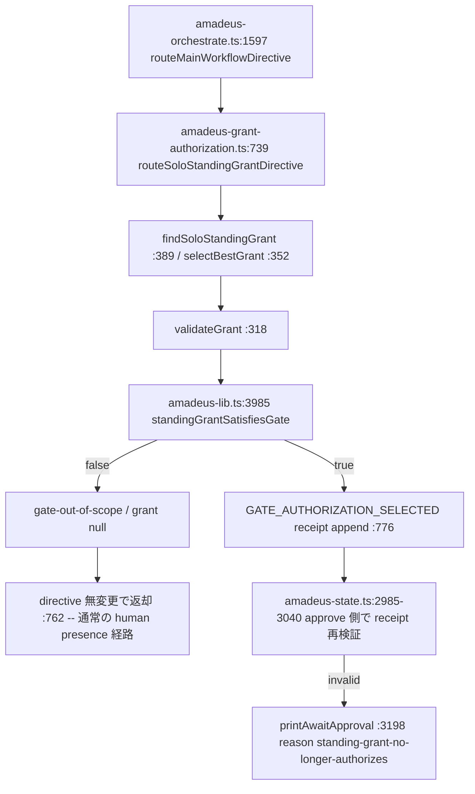
```mermaid
flowchart TD
  A["amadeus-orchestrate.ts:1597 routeMainWorkflowDirective"] --> B["amadeus-grant-authorization.ts:739 routeSoloStandingGrantDirective"]
  B --> C["findSoloStandingGrant :389 / selectBestGrant :352"]
  C --> D["validateGrant :318"]
  D --> E["amadeus-lib.ts:3985 standingGrantSatisfiesGate"]
  E -->|"false"| F["gate-out-of-scope / grant null"]
  F --> G["directive 無変更で返却 :762 -- 通常の human presence 経路"]
  E -->|"true"| H["GATE_AUTHORIZATION_SELECTED receipt append :776"]
  H --> I["amadeus-state.ts:2985-3040 approve 側で receipt 再検証"]
  I -->|"invalid"| J["printAwaitApproval :3198 reason standing-grant-no-longer-authorizes"]
```

テキストフォールバック（上図と同内容）: `routeMainWorkflowDirective`（`amadeus-orchestrate.ts:1597`）→ `routeSoloStandingGrantDirective`（`amadeus-grant-authorization.ts:739`）→ グラント探索（`findSoloStandingGrant :389` / `selectBestGrant :352`）→ `validateGrant :318` → `standingGrantSatisfiesGate`（`amadeus-lib.ts:3985`）。判定 false ならグラント null 扱いで directive 無変更返却（`:762`）＝通常の human presence 経路。true なら `GATE_AUTHORIZATION_SELECTED` receipt を append（`:776`）し、approve 側（`amadeus-state.ts:2985-3040`、`resolveStandingGrantRouteReceipt` による route receipt 解決）が再検証、無効なら `printAwaitApproval`（`:3198`、reason `standing-grant-no-longer-authorizes`）へ落ちる。

### 中核述語 `standingGrantSatisfiesGate` と方式の二重化

`standingGrantSatisfiesGate`（`amadeus-lib.ts:3985-4017`）は state の `Scope` フィールドを読み、**stage graph の `stage.scopes` フロントマター配列を直読**して「次の in-scope ステージ」と「最初の construction ステージ」を決める:

```ts
const inScope = (stage: StageEntry): boolean =>
  stage.scopes === undefined || stage.scopes.includes(scope);
```

判定そのものは純関数 `evaluateStandingGrantGateEligibility`（`:3951-3969`）へ委譲され、`isPhaseBoundary` かつ `!grant.includesPhaseBoundary` なら `ineligible / phase-boundary` を返す。

これに対し**エンジン本体の正規経路は `stage.scopes` を読まず、scope-grid 由来の mapping を読む**:

| 関数 | 所在 | 解決源 |
| --- | --- | --- |
| `nextInScopeStage()` | `amadeus-lib.ts:6828-6866` | `loadScopeMapping()[scope]` → `mapping.stages[slug] === "EXECUTE"` |
| `firstInScopeStageOfPhase()` | `amadeus-lib.ts:6891-6910` | `subgraphForScope(scope)` |
| `subgraphForScope()` | `amadeus-graph.ts:959-974` | `loadScopeGrid()[scope]` の EXECUTE 集合 |

`standingGrantSatisfiesGate` は `stage.scopes` を直読する**唯一の消費者**である（他の読者は `transposeScopeGridForMapping` の fallback 転置 `amadeus-lib.ts:5945-5959` と、`amadeus-orchestrate.ts:2796` の plugin opt-in 判定 `(node.scopes ?? []).length === 0` のみ）。**同一の「このステージはこの scope で実行されるか」という問いに対して、二つの独立した解決方式が併存している**のが本 intent の構造的論点である。

### 非対称は設計上の意図であり語彙の追記漏れではない

observed `e12259ba7` の実測:

- `.claude/tools/data/stage-graph.json` の 32 stages のうち `scopes` キーを持たない stage は **0 件** → `stage.scopes === undefined` の緩和分岐は実運用で不発
- `stage.scopes` の語彙全数 = **10 個**（`bugfix` / `chore` / `enterprise` / `feature` / `infra` / `mvp` / `poc` / `refactor` / `security-patch` / `workshop`）— すべて stock スコープ
- `scope-grid.json` のキー = **15 個**（上記10 + `amadeus` / `amadeus-bugfix` / `amadeus-feature` / `amadeus-refactor` / `installer-distribution`）

この非対称は `amadeus-graph.ts:1350-1359` の doc comment が明示する設計である（verbatim）: 「The transpose derives only the stock scopes (those a stage's `scopes:` frontmatter names); a composed scope's grid entry is appended at approval time by the composer and has no frontmatter producer」。composed scope（`amadeus-*` 系）は composer が承認時に scope-grid へ追記するものであり、**stage frontmatter の `scopes:` には構造上決して現れない**。したがって #1497 は「`amadeus-bugfix` を語彙へ足し忘れた」欠陥ではなく、**解決方式の選択そのものの誤り**である。

### 共有述語であることの含意（team mode への波及）

`standingGrantSatisfiesGate` の呼び出し元は全 4 箇所で、solo 専用ではない:

1. `amadeus-grant-authorization.ts:336` — solo 経路中核（`validateGrant :318-340` 内、false で `gate-out-of-scope`）
2. `amadeus-state.ts:2470` — team mode approve の presence 例外（`assertHumanPresentForGateResolution :2443-2477`）
3. `amadeus-state.ts:3269` — `standingGrantForDelegation`
4. `amadeus-lib.ts:3985` 自身の export（`amadeus-state.ts:80` / `amadeus-grant-authorization.ts:16` が import）

解決方式を差し替える修正は team mode 経路へも波及するため、**stock スコープの現行挙動を parity として固定する回帰テストが不可欠**である。なお `amadeus-graph.ts` は `amadeus-lib.ts` を import しているため、grid 経由へ寄せる場合の循環回避には lazy require の既習様式がある（`firstInScopeStageOfPhase` / `stagesInScope` が同手法、`amadeus-lib.ts:6898-6902`）。

## worktree でのパス／ref 解決の現況（260725-worktree-ref-fixes、履歴: 2026-07-26、Issue #1482 / #1481 / #1455）

測定 ref: observed `11f1ad61f`。以下の file:line はすべて同 commit の実ファイル直読による。

### 1. hook の project-dir 解決 — 4-rung ladder と rung1／rung2 の優先順位（#1482）

正本 `packages/framework/core/tools/amadeus-lib.ts`（配布 `.claude/tools/amadeus-lib.ts` と同一行番号）。

| rung | 行 | verbatim | 内容 |
| --- | --- | --- | --- |
| 1 | `:249` | `  if (process.env.CLAUDE_PROJECT_DIR) return process.env.CLAUDE_PROJECT_DIR;` | env を**無条件**採用 |
| 2 | `:258` / `:259` | `  const markerDir = findWorkspaceMarkerAncestor(process.cwd());` / `  if (markerDir) return markerDir;` | cwd 起点で workspace marker を上向き探索（#641 で挿入） |
| 3 | `:263-265` | `stripHarnessLeaf(scriptDir, "hooks")` | スクリプトパス由来 |
| 4 | `:268-273` | cwd 直下の既知 harness dir | dev repo 向け |

補助関数: `:227` `function hasWorkspaceMarker(dir: string): boolean {`（`amadeus/` と `<harness>/tools/` の**両在**で真）、`:235` `function findWorkspaceMarkerAncestor(startDir: string): string | null {`（非 export）。エントリは `:247` `export function resolveProjectDirFromHook(importMetaUrl: string): string {`。

**機序（Issue 記載からの訂正）**: Issue の推定「`CLAUDE_PROJECT_DIR` 未設定 → rung2 が本線を解決」は誤り。Stop hook の起動行 `.claude/settings.json:154` は verbatim `            "command": "bun $CLAUDE_PROJECT_DIR/.claude/hooks/amadeus-stop.ts"` であり、この `$CLAUDE_PROJECT_DIR` 展開が成立してフックが起動している以上 env は**設定済み**である。実際の機序は「EnterWorktree は cwd だけを worktree へ切り替え、env は本線に固定されたまま → rung1 が本線を無条件採用し、worktree を正しく返せる rung2 に到達しない」。rung2 自体は健全であり、cwd が worktree なら worktree を返す。

**裁定点**: この優先順位は `tests/unit/t202-hook-project-dir-worktree-marker.test.ts:105` の test 2 verbatim `  test("2: CLAUDE_PROJECT_DIR env still outranks the marker rung", () => {`（`:113` で `expect(resolved).toBe("/from/env")`）として**意図的に固定**されている。一方 #641 の設計意図は同ファイル `:1-3` verbatim `// t202-hook-project-dir-worktree-marker: resolveProjectDirFromHook() must` / `// resolve to the WORKTREE, not the main checkout, when a session runs inside` / `// a Claude Code worktree.` である。env 経路が worktree を貫通する現状は、この意図と正面から矛盾する。rung 順序の変更は t202 test 2 の契約変更を伴うため、**要件段での明示的裁定を要する**（実装者の単独判断で反転させない）。

### 2. 波及範囲 — Stop hook 固有ではなく hook 一族全体

`resolveProjectDirFromHook` の呼び出し（import 行を除く実呼び出し）は `grep -rn 'resolveProjectDirFromHook' packages/ --include='*.ts'` 実測で **core hooks 11 ファイル × 各1 = 11 箇所 + kiro-ide adapter 1 箇所 = 計12箇所**:

`amadeus-audit-logger.ts:23` / `amadeus-log-subagent.ts:22` / `amadeus-mint-presence.ts:72` / `amadeus-runtime-compile.ts:45` / `amadeus-sensor-fire.ts:40` / `amadeus-session-end.ts:20` / `amadeus-session-start.ts:46` / `amadeus-statusline.ts:32` / `amadeus-stop.ts:167` / `amadeus-sync-statusline.ts:25` / `amadeus-validate-state.ts:24`（以上 `packages/framework/core/hooks/`）+ `packages/framework/harness/kiro-ide/hooks/amadeus-kiro-adapter.ts:64`。

したがって #1482 は Stop hook 単体の欠陥ではなく、**hook 一族全体が同一の誤解決を共有する**。Stop hook では `amadeus-stop.ts:118`（import）→ `:167`（解決）を経て `projectDir` が下流24箇所（state path、engine 呼び出し、audit、stage dir 等）へ流れるため症状が最も可視になっているにすぎない。修正は解決関数側の1点で全12箇所に及ぶ。

**engine 経路が救われている理由**: 姉妹関数 `resolveProjectDir`（`:170` `export function resolveProjectDir(explicitDir?: string): string {`）は `:172` verbatim `  if (explicitDir) return explicitDir;` により **`--project-dir` 明示引数が第1順位**で、env より上位にある。engine 呼び出しは明示引数を渡すため worktree で正しく解決される。hook 側にはこの上位 rung が無い。

**配布面**: `amadeus-lib.ts` / `amadeus-stop.ts` はいずれも**11コピー**（正本 + harness 表層4 + dist 6）。修正は正本編集 + `bun scripts/package.ts` + `bun run promote:self` の同期を要する。

### 3. テストの git ref 解決 — `currentGitSha` の三重複製（#1481 / #1455）

3つの integration テストが**共有されない同型 helper** を各自に持つ（`grep -n 'function currentGitSha'` 実測）:

| ファイル | helper | throw 行 verbatim |
| --- | --- | --- |
| `tests/integration/t257-status-registry-migration.test.ts` | `:193` | `:214` `  if (!packed) throw new Error(\`cannot resolve Git ref ${ref}\`);` |
| `tests/integration/t258-lifecycle-transaction.test.ts` | `:434` | `:455` `  if (!packed) throw new Error(\`Cannot resolve Git ref ${ref}\`);` |
| `tests/integration/t259-guard-integration.test.ts` | `:77`（`repositoryRoot` 引数版） | `:96` `  if (!line) throw new Error(\`Unable to resolve Git ref ${ref}\`);` |

**共通欠陥**（t257 の行で示す。3件とも同型）: loose ref の探索先が worktree の gitDir 配下に限られ（`:205-206`）、commondir 解決後（`:207-210`）は `packed-refs` しか読まない（`:211`）。worktree のブランチ ref は **common dir の loose ref** として存在するため、この経路は必ず throw に落ちる。

**現場実測**（worktree `.claude/worktrees/bugfix-1482-1481-1455`、observed `11f1ad61f`）:

- `git rev-parse --git-dir` = `<main>/.git/worktrees/bugfix-1482-1481-1455`、`--git-common-dir` = `<main>/.git`
- HEAD ref = `refs/heads/worktree-bugfix-1482-1481-1455`
- worktree gitDir 側の loose ref: **不在**（`ls` が ENOENT）
- common dir 側の loose ref `<main>/.git/refs/heads/worktree-bugfix-1482-1481-1455`: **実在**（41 バイト）
- `packed-refs`: 総 733 行（`wc -l`）だが、**当該 ref に一致するエントリは 0 件**（`grep -c " refs/heads/worktree-bugfix-1482-1481-1455$"` = 0）

※ Developer スキャンの「packed-refs 0件」は「当該 ref のエントリが 0 件」の意であり、ファイル自体は 733 行存在する。本節はその精密化として両数値を記録する。

**既習の正しい様式**: `amadeus-lib.ts:4131` `export function resolveMainCheckout(gitCwd?: string): MainCheckout | null {` は `:4132` の `rev-parse --show-toplevel` と `:4135` の `rev-parse --git-common-dir` という **git plumbing サブプロセス**で解決しており、worktree 安全である。同型の前例に `codex/tools/amadeus-codex-hooks-migration.ts:590`。

**同根棚卸し**: git 内部レイアウトを FS 直読する箇所は上記3ファイルのみで、他はすべて git サブプロセス経由。すなわち修正対象は閉じている。

**テスト番号の生態**: `find tests -name "t257-*" -type f` = 6 件、`t258-*` = 8 件、`t259-*` = 4 件。同一番号が複数ファイルに存在するため、**引用は必ずフルパスで行う**（cid:requirements-analysis:mechanism-cite-verify-at-draft 追補）。

### 4. 導入経緯と現症状

3 helper は同一コミット `2e157d7fe`（2026-07-23、`archived intent statusと誤resume防止を導入 (#1424)`）で導入され、後続修正はない。原因の所在は**実装判断**（git plumbing を使わず FS 直読を選び、かつ3複製した）にある。

worktree での実測（パイプなし exit 捕捉）: t257 exit 1（10 pass / 1 fail）、t258 exit 1（25 pass / 1 fail）、t259 exit 1（9 pass / 1 fail）。本 scan で t259 を再実行して追認（exit 1、`9 pass` / `1 fail`、`error: Unable to resolve Git ref refs/heads/worktree-bugfix-1482-1481-1455`）。失敗するのは helper を通る provenance 記録テスト1件のみで、残りは緑。本線チェックアウトでは loose ref が gitDir 直下にあるため通る = **worktree 限定の false red**。

## Team Mode 起動経路の現況と actas 移行後の構造（260725-teamup-launch-hardening、履歴、Issue #1476 / #1478）

測定 ref: observed HEAD `4a0f91ad07dbe17c6477b7fe9b52a0e9ab4532ba` の実ファイル直読（`packages/framework/core/tools/team-up.sh` は **1497 行**、`wc -l` 実測。前 intent 観測時 `ec624022f` の 1474 行から +23）。外部スキル `~/.agents/skills/agmsg/` は repo 外・非バージョン管理（読取 2026-07-25）。

### PR #1477 で入った適用可否ガードの現況

[PR #1477](https://github.com/amadeus-dlc/amadeus/pull/1477)（実装コミット `294df1281`）は、直下の履歴節が記述した「構造的に成功しえない検証」を**除去せず、発火しないよう門を立てる**形で解消した。`watcher_verification_applies` は runtime/backend の2条件に加えて**初期プロンプトの形**を見る（team-up.sh:1092-1102、verbatim: `  case "$CLAUDE_MONITOR_PROMPT" in` / `  *" actas "*) return 0 ;;`）。

```text
watcher_verification_applies()                       team-up.sh:1092
  ├─ [ "$RUNTIME" = claude ] && [ "$MSG_BACKEND" = agmsg ] || return 1    :1093
  ├─ case "$CLAUDE_MONITOR_PROMPT" in *" actas "*) return 0 ;; esac       :1094-1096
  └─ WATCHER_SKIP_ANNOUNCED ガード付きで stderr へ1行 → return 1          :1097-1101
```

- 新設された可変 `WATCHER_SKIP_ANNOUNCED=0`（:1091）は、launch 経路が本関数を **2回** 呼ぶ（:1461 stale sentinel 除去前、:1478 検証前）ため advisory を run あたり1行に抑える one-shot ラッチ。stdout は一切触らない。
- 出荷既定の `CLAUDE_MONITOR_PROMPT="/agmsg mode monitor"`（:104）は `*" actas "*` に一致しないため、**現在この検証は常にスキップされる**。すなわち Issue #1384 が導入した「プロンプト取りこぼしの検出と再送」の保護は、現時点で**機能していない**（詳細は `code-quality-assessment.md` の同 intent 節）。
- スキップ告知の文言は `#1449` と `#1476` の両方を含み、#1476 の着地が再有効化の条件であることをコード上で宣言している（:1099、verbatim: `    echo "team-up: monitor-mode watcher writes no readiness sentinel — skipping arming verification (#1449/#1476)" >&2`）。

配布同期は完了している: `git ls-files '*tools/team-up.sh'` = **11 面**（正本1 + self-install 4 + dist 6）、全面で `WATCHER_SKIP_ANNOUNCED` が **3 出現**（`grep -c`、測定 ref: `4a0f91ad0`）。

### actas 移行（#1476）後に検証が実際に走る経路

`/agmsg actas <role>` 化は `*" actas "*` case に一致するため、**ガードは自動的に再び真になり、PR #1477 以前の同期ブロッキング構造がそのまま復活する**。検証が「実際に走る」ためには、外部スキル側の前提が2段で満たされる必要がある（本 scan で独立に再実測）。

1. **delivery mode が `monitor` または `both` であること** — claude-code ドライバ `~/.agents/skills/agmsg/scripts/drivers/types/claude-code/template.md:143` step 5d（verbatim: `   d. **Only if the project's delivery mode is \`monitor\` or \`both\`** (check via \`~/.agents/skills/__SKILL_NAME__/scripts/delivery.sh status claude-code "$(pwd)"\`), invoke a fresh Monitor, regardless of whether step b or c applied:`）。`turn` / `off` のときは watcher を起動しない（:147、verbatim: `      Otherwise (mode \`turn\` or \`off\`), leave it stopped — \`actas\` must not start automatic delivery a project wasn't configured for.`）。この前提は **`team-up.sh` 側で既に満たされている**: `claude_member_cmd` が pane 起動前に `bash "$DELIVERY" set monitor claude-code "$wt"` を実行する（:876-878、verbatim: `      bash "$DELIVERY" set monitor claude-code "$wt" >/dev/null 2>&1 ||`）。
2. **actas 起動の watcher が第4引数 `<name>` を伴うこと** — 同 template.md:144（verbatim: `      - command: \`~/.agents/skills/__SKILL_NAME__/scripts/watch.sh $CLAUDE_CODE_SESSION_ID "$(pwd)" claude-code <name>\``）、:148（verbatim: `   The 4th argument to \`watch.sh\` restricts the subscription to messages addressed to \`<name>\` only — other roles' inbound messages stop reaching this session until another \`actas\` or session end.`）。この第4引数が `watch.sh:43` の `ACTIVE_NAME="${4:-}"` を非空にし、`watch.sh:300` の `if [ -n "$ACTIVE_NAME" ]; then` を通して `:307`（verbatim: `    printf '%s\n' "$SESSION_ID" > "$_rp" 2>/dev/null || true`）が sentinel を書く。

**二層構造に注意**: インストール済み `~/.agents/skills/agmsg/SKILL.md:110-115` の actas 節は **codex 向け**の記述で（`identities.sh "$(pwd)" codex` をハードコードし `:114` で FROM 設定に留まる）、watcher 起動を規定しない。claude-code の actas 挙動の正準はドライバテンプレート側である。SKILL.md だけを読むと「actas は watcher を起動しない」と誤読する。

**actas 排他ロックの claim⇔release 対称性**（`cid:requirements-analysis:symmetric-pair-review`、本 scan で追加検証）: actas 化は watcher 起動だけでなく**ロール排他ロックの取得**を伴う。claim 側は template.md:135 step 4（`actas-claim.sh`、`status=held` なら中止）、release 側は `lib/actas-lock.sh:186 actas_lock_release` / `:198 actas_lock_release_all` で、呼び手は `actas-claim.sh` / `reset.sh`（drop 経路 = template.md:154、第4引数がロックを解放）/ `despawn.sh` / `session-end.sh` の4本（`grep -rln actas_lock_release ~/.agents/skills/agmsg/scripts`、読取 2026-07-25）。**対は揃っている。**

`team-up.sh` の teardown（`--kill`）はロックを明示解放しないが、これは欠陥ではない: `_actas_lock_try_claim`（`lib/actas-lock.sh:106-133`）が既存ロックの所有 sid の生存を `actas_lock_sid_alive`（:99）で確認し、死んでいれば `stale` として再取得を許す。したがって pane 強制終了で残ったロックが次回 launch を恒久ブロックすることはない。sentinel 側の生成⇔削除も同様に閉じている（生成 `watch.sh:307`、正常終了時の cleanup が `READY_FILES`（:135 初期化 / :308 追記）を :144-154 で削除、死んだ session の残骸は `session-start.sh:194` が GC）。

実測（feasibility、測定 ref: `c4c9531ee`、隔離環境）: delivery mode = monitor を先に設定したうえで `/agmsg actas leader` を投入すると sentinel は **T+32.2 秒**に出現。mode 未設定（`off`）では 180 秒ポーリングしても未出現。

### `mux_attach` との順序関係 — 移行の主要リスク

launch 末尾の順序は PR #1477 でも**変わっていない**（測定 ref: `4a0f91ad0`）。

```text
:1472-1476  コメント「Completed BEFORE mux_attach so the exit code is meaningful
             (an interactive attach would swallow it)」
:1477       watcher_status=0
:1478       if watcher_verification_applies; then
:1479         verify_watchers_armed || watcher_status=$?     ← 同期・ブロッキング
:1480       fi
:1482       start_safety_wait_supervisors || exit 1
:1483       mux_attach "$S"                                  ← ユーザーが触れる点
```

したがって #1476 の actas 移行を**プロンプト変更だけで**行うと、`verify_watchers_armed` が `WATCHER_READY_TIMEOUT=90`（:108）× `(WATCHER_RESEND_MAX=1)+1 = 2` ラウンド = 最悪 **180 秒**、`mux_attach` の前でブロックする構造が復活する。これは直前の intent `260725-teamup-attach-latency` が 200.85 秒 → 5.87 秒として解消した当の問題である。sentinel 出現の実測が1メンバー 32.2 秒であるため、7メンバー構成では最も遅い1名が全体の attach を律速する。

**構造上の選択肢**（決定は requirements で行う。事実の提示に留める）:

| 案 | 変更点 | 影響 |
| --- | --- | --- |
| A: 検証を `mux_attach` の後ろへ移す | :1478-1480 のブロックを :1483 の後へ | attach を妨げない。**exit code の意味は失われない**（直下「exit code の意味づけ」参照） |
| B: 検証をバックグラウンド化 | 別 supervisor 化（:1482 の `start_safety_wait_supervisors` に既存の同型パターンあり） | 結果通知経路の新設が必要 |
| C: タイムアウトを実測ベースへ縮める | `WATCHER_READY_TIMEOUT` の既定値 | 順序は不変。32.2 秒実測に対し 90 秒は過大だが、コールドスタートのばらつき耐性を失う |

### exit code の意味づけ — 「attach が exit code を飲み込む」前提の実測（本 scan で追加）

feasibility Q1 の確定裁定は **A（検証を `mux_attach` の後ろへ移す）**である。既存コメント（:1474-1476、verbatim: `# mux_attach so the exit code is meaningful (an interactive attach would swallow`）はこの移動を阻む設計意図に読めるが、**現行実装ではこの前提が成立しない**。

- `mux_attach`（:513-515）の実体は1行で、verbatim: `  open -na Ghostty --args -e "$HERDR" session attach "$1"`。`open -na` は新しい Ghostty ウィンドウを起動して**即座に戻る**非ブロッキング呼出であり、attach セッションを team-up.sh の前景に取り込まない。
- 実際、スクリプトは `mux_attach`（:1483）の**後**に run 記録の書き出し（:1484-1492）と launch 告知（:1495）を続け、最終行 :1497（verbatim: `exit "$watcher_status"`）で終了する。すなわち呼出元シェルへの exit code 経路は attach の後ろにも残っている。
- したがって案 A は :1474-1476 のコメント**文言**の更新を要するが、exit code の意味づけを壊さない。争点は「exit code が失われるか」ではなく「`watcher_status` の確定を待って `exit` するために、attach 後に最悪 180 秒スクリプトが生き残ってよいか」（＝呼出元シェルのプロンプトが返る時刻）に移る。

なお `CLAUDE_MONITOR_PROMPT`（:104、verbatim: `CLAUDE_MONITOR_PROMPT="/agmsg mode monitor"`）は `WATCHER_READY_TIMEOUT`（:108）/ `WATCHER_RESEND_MAX`（:114）と異なり `${VAR:-default}` 形を取らない**環境変数から上書き不能なハード定数**である（テストは lib を source して再代入することで上書きしている）。:102-103 のコメントが宣言する「bootstrap プロンプトの単一ソース（launch と再送で共用）」という不変条件は、actas 化でプロンプトが**ロール名を含む**ようになると「単一の定数」では保てず、「単一の導出関数（role → prompt）」へ形を変える必要がある。

`CLAUDE_MONITOR_PROMPT` は**引数を持たない定数**で、参照は **4 箇所**（`grep -n`、測定 ref: `4a0f91ad0`）— `:861`（`claude_member_cmd` の `init_prompt` 初期値）、`:1094`（本 intent で新設された適用可否ガードの case）、`:1202`（`resend_monitor_prompt` への実引数）、`:1211`（失敗時の手動復旧ガイダンス文言）。actas 化はロール名を要するため per-member 化が必須であり、**member 文脈を持たない `:1094` はプロンプト値そのものではなく「actas 形を使う構成か」を判定する形へ書き換えを要する**。`:1211` のガイダンス文言も per-role 化しないと誤った復旧手順を案内する。

### `git worktree add` の直列作成（#1478）

worktree は `create_run()`（:1267）内の単一ループで**逐次**作られる（:1302-1310）。

```text
  for m in $(members_for "$TEAM_SIZE"); do
    wt="$RUN_ROOT/$m"
    branch="team/$RUN_ID/$m"
    git -C "$REPO" worktree add -q -b "$branch" "$wt" "$base_commit"     ← :1305
    CREATED_MEMBERS="$CREATED_MEMBERS $m"                                ← :1306
    mkdir -p "$RUN_RECORD/members/$m"
    ...
  done
```

verbatim（:1305）: `    git -C "$REPO" worktree add -q -b "$branch" "$wt" "$base_commit"`

この位置は launch シーケンス上、pane 起動（:1464-1470）より前の準備段で、watcher 検証面（:1478）とは**非交差**である。構造的裏付け（測定 ref: `4a0f91ad0`、`grep -n` による関数境界の実測）:

| Unit | 触る関数（行域） | 触る行 |
| --- | --- | --- |
| U1（#1476） | `claude_member_cmd`（:860-894）、`watcher_verification_applies`（:1092-1102）、`verify_watchers_armed`（:1174-1213）、launch 末尾（:1471-1483） | :104 / :861 / :1094 / :1202 / :1211 |
| U2（#1478） | `rollback_prepared_run`（:1241-1251）、`create_run`（:1267-1311） | :1244 / :1302-1310（うち :1305 / :1306）/ :1392 |

行域は一切重ならず、共有する可変も存在しない（U1 = `CLAUDE_MONITOR_PROMPT` / `WATCHER_*`、U2 = `CREATED_MEMBERS` / `RUN_*`）。したがって #1476 と #1478 は worktree 隔離で並行実装でき、独立に出荷可能。**唯一の交差点は同一ファイルであることに起因する配布同期**（11 面の再生成）であり、後着 PR 側で `bun scripts/package.ts` / `bun run promote:self` の再実行が要る。

並列化の制約は `CREATED_MEMBERS` の逐次追記（:1306）にある。この変数を読むのは `rollback_prepared_run`（:1241、読み手は :1244 の `for m in $CREATED_MEMBERS; do`）で、`handle_exit`（:1253）が :1259 でこれを呼ぶ。初期化は :1392（`CREATED_MEMBERS=""`）。部分失敗のロールバック対象がこの集合で決まるため、並列化すると**成功集合の集約**（サブシェルからの伝播）が必要になる。

**作成⇔ロールバックの対称性**（`cid:requirements-analysis:symmetric-pair-review`）: 生成側は :1305 の `worktree add`、直後 :1306 で台帳へ登録、除去側は :1247（verbatim: `    git -C "$REPO" worktree remove --force "$wt" >/dev/null 2>&1 || true`）。対は揃っているが、**現行の直列実装では「add 成功 ⇒ 台帳登録」が同一シェルの連続2行で保証されている**のに対し、並列化では add がサブシェルで走るため、この含意関係を維持する機構（成功集合の親への回収、または worktree の実在走査によるロールバック対象の再導出）が新たな設計要求になる。ここが U2 の主要な正しさリスクであり、feasibility では**失敗注入が未実施**である。

並列度別の実測（feasibility、測定 ref: `c4c9531ee`、同一リポ tracked 11,051 ファイル / `.git` 166M、7 worktree、macOS APFS）:

| 並列度 | 所要 | 成功 | stderr |
| --- | --- | --- | --- |
| 1（現行・直列） | 7.39 秒 | 7/7 | 0 bytes |
| 2 | 4.88 秒 | 7/7 | 0 bytes |
| 3 | 4.03 秒 | 7/7 | 0 bytes |
| **4** | **3.32 秒** | 7/7 | 0 bytes |
| 7（無制限） | 7.55 秒 | 7/7 | 0 bytes |

`.git` 設定ロック競合による**失敗は全並列度でゼロ**（git が内部で直列化する）。一方 **無制限並列（7）は直列より遅く**、「全部同時に投げる」実装は退行になる。構造上、**並列度に上限（実測最適 4）を持つワーカープール**が要求される。

## Team Mode ランチャーの watcher 検証と actas/monitor モード不一致（260725-teamup-attach-latency、履歴、Issue #1449）

測定 ref: observed HEAD `ec624022ff65cc8b3912001f768bd66ec41a0e39` の実ファイル直読（`packages/framework/core/tools/team-up.sh` は **1474 行**、`wc -l` 実測）、および repo 外の外部スキル `~/.agents/skills/agmsg/`（読取 2026-07-25）。

### launch シーケンス上の位置

1. `if watcher_verification_applies; then clear_stale_watcher_sentinels; fi`（team-up.sh:1438-1440）— pane 起動前に旧 sentinel を除去。
2. pane レイアウト構築（:1441-1447、`mux_new_session` / `mux_split` / `stack_column`）で全メンバーを spawn。
3. **`verify_watchers_armed`**（:1455-1457、verbatim: `  verify_watchers_armed || watcher_status=$?`）— 同期実行。
4. `start_safety_wait_supervisors || exit 1`（:1459）。
5. **`mux_attach "$S"`（:1460）** — ユーザーが interactive アタッチ可能になる点。

手順 3 が手順 5 の**前**に置かれるのは意図的設計で、コメント（:1449-1454）が「Completed BEFORE mux_attach so the exit code is meaningful (an interactive attach would swallow it)」と明記する。結果として、検証がタイムアウトする限り attach は待ち budget 全量ぶん構造的にブロックされる。

### 構造的失敗の機序（actas/monitor モード不一致）

```text
team-up.sh                     agmsg (外部スキル、repo 外)
  member launch
    init_prompt = "/agmsg mode monitor"   (team-up.sh:104 CLAUDE_MONITOR_PROMPT)
        |
        v
   delivery.sh emit_monitor_directive() :259
     watch_command = printf '%q %q %q %q' watch session_id project type   (:301)
        -> watch.sh へ渡る引数は 3 個 (session_id / project / type)
        -> watch.sh:43  ACTIVE_NAME="${4:-}"   => 空
        |
        v
   watch.sh:300  if [ -n "$ACTIVE_NAME" ]; then
   watch.sh:307    printf '%s\n' "$SESSION_ID" > "$_rp"   <- sentinel を書く唯一の行
        => ACTIVE_NAME が空なので ready sentinel を一切書かない
        |
        x  (sentinel は永遠に現れない)
        |
team-up.sh verify_watchers_armed :1151-1190
   ready_sentinel_path (:1088) が指す path を最大 2 ラウンド × 90 秒ポーリング
   => 常に全員 unarmed => 180 秒待って :1186 の ERROR、return 1
```

要点:

- sentinel を書く条件は `watch.sh:300` の `if [ -n "$ACTIVE_NAME" ]`、実際の書込は `watch.sh:307`（verbatim: `    printf '%s\n' "$SESSION_ID" > "$_rp" 2>/dev/null || true`）。`ACTIVE_NAME` は `watch.sh:43` の第4位置引数（verbatim: `ACTIVE_NAME="${4:-}"`）。
- **書き手の全数（独立再列挙、`cid:requirements-analysis:enumeration-completeness-review`）**: `~/.agents/skills/agmsg/` 全域で `agmsg_ready_path` を参照するのは **3 箇所のみ**（`grep -rn "agmsg_ready_path" ~/.agents/skills/agmsg/`、読取 2026-07-25）— `lib/actas-lock.sh:69`（path 構築関数の定義）、`spawn.sh:564`（**読み手**: :572 で削除、:578 で待機）、`watch.sh:303`（**唯一の書き手**、書込は :307）。path 文字列リテラル `ready.` の出現も 2 箇所のみ（`grep -rnI "ready\." ~/.agents/skills/agmsg/` を `run/` 除外で実行）— `lib/actas-lock.sh:72`（path 組立）と `session-start.sh:194`（**削除側**: 死んだ session の sentinel を `rm -f`）。すなわち書き手は `watch.sh` の actas ガード内の1経路に限られ、「monitor モードでは sentinel が生成されない」という主張に**反証は存在しない**。
- `~/.agents/skills/agmsg/scripts/lib/actas-lock.sh:63` のコメントが所有関係を明示する（verbatim: `# Readiness sentinel path for (team, agent). watch.sh creates this when an`／続く行 `# exclusive (actas) watcher attaches and removes it on exit, ...`）。すなわち sentinel は **exclusive(actas) watcher 専用**の信号である。
- monitor モードの起動経路 `delivery.sh:259 emit_monitor_directive()` は `:301` で 4 個の `%q`（実行ファイル自身 + 3 引数）しか組み立てず、第4引数 `ACTIVE_NAME` を渡さない（verbatim: `  watch_command="$(printf '%q %q %q %q' "$watch" "$session_id" "$project" "$type")"`）。
- 対照として `spawn.sh --wait-ready` が同じ sentinel で機能するのは、`spawn.sh:358` が actas モードで起動するため（verbatim: `ACTAS_PROMPT="${CMD_PREFIX}${CMD_NAME} actas ${NAME}"`）。
- 実測裏付け: agmsg の run ディレクトリ `~/.agents/skills/agmsg/run/` は **251 エントリ**（`ls -1 | wc -l`、読取 2026-07-25）だが `ready.*` は **0 件**（`ls -1 | grep -c '^ready\.'` = 0）。2026-07-09 以降の運用履歴を通じて sentinel が一度も生成されていない。

つまり `team-up.sh` は agmsg spawn.sh から「**待つ側**」だけを移植し、「**書かせる側**（actas 起動）」を移植しなかった。検証は成功しうる条件を持たない。

### 構造的欠陥クラス: 外部 seam の契約を片側だけ移植した（対称性レビュー）

`team-up.sh` の watcher 検証は agmsg `spawn.sh` の readiness ハンドシェイクを写したものだが、写されたのは**消費側の3要素だけ**で、生産側と適用可否ガードが落ちている。`cid:requirements-analysis:symmetric-pair-review` の観点で対を並べると以下になる（測定 ref: HEAD `ec624022f` / agmsg 読取 2026-07-25）。

| ハンドシェイクの構成要素 | agmsg `spawn.sh`（正本） | `team-up.sh`（移植先） | 対称性 |
| --- | --- | --- | --- |
| path 解決 | `:564 READY_PATH="$(agmsg_ready_path ...)"` | `:1088 ready_sentinel_path()`（agmsg の lib を subshell で source し文字列を複製しない） | ✅ 対称 |
| 事前クリア | `:572`（`place_and_launch` 前に `rm -f`） | `:1132 clear_stale_watcher_sentinels`（pane 起動前、:1438-1440 で呼出） | ✅ 対称 |
| 待機ループ | `:578-586`（bounded poll、timeout で exit 3） | `:1151-1190 verify_watchers_armed`（bounded poll + 再送、timeout で return 1） | ✅ 対称 |
| **信号の生産（actas 起動）** | `:358 ACTAS_PROMPT="${CMD_PREFIX}${CMD_NAME} actas ${NAME}"` | **不在** — `:104 CLAUDE_MONITOR_PROMPT="/agmsg mode monitor"` は monitor モードを起動する | ❌ **片側のみ** |
| **適用可否ガード（信号を出さない起動形態の除外）** | `:565-568`（`agmsg_type_get <type> monitor` が `no` の型は `WAIT_READY=0` にして待機自体を skip、理由を stderr に出す） | `:1077 watcher_verification_applies()`（verbatim: `  [ "$RUNTIME" = "claude" ] && [ "$MSG_BACKEND" = "agmsg" ]`）— runtime と backend しか見ず、**その起動経路が実際に sentinel を出すか**を判定しない | ❌ **片側のみ** |

上2行が本欠陥の全体である。とくに5行目は独立に重要で、`spawn.sh` 側には「readiness ハンドシェイクを持たない起動形態では待たない」という fail-open ガードが最初から存在する（`:566-568` が該当型で `--no-wait` 相当へ降格し理由を通知する）のに対し、`team-up.sh` の適用ガードは起動経路のモードを一切参照しない。仮に生産側（actas 起動）を移植せずタイムアウトだけ縮めても、この非対称は残る。

他の対の実装は本ファイル内で確認した範囲では対称である — Codex 用の safety-wait supervisor は起動（`:399 start_safety_wait_supervisors`、`:1394` / `:1459` で呼出）に対して停止・ロック解放（`:304 safety_wait_stop_state`、`:326` / `:395` の `rm -rf -- .../safety-wait.lock`）が存在し、`trap handle_exit EXIT`（`:1373`）と `trap - EXIT`（`:1232`）も対になっている。片側実装は watcher 検証まわりに固有である。

### 修正のアーキテクチャ影響境界

本 intent（#1449、起動レイテンシの解消）でブロッキング呼び出しを除去した場合の影響面:

- **影響する**: launch シーケンス（`:1455-1460`）の1点のみ — 手順3が `mux_attach` の前から外れる。`watcher_status` を exit code に流す経路（`exit "$watcher_status"`）と、`:1186-1188` の診断文言の意味づけがこれに連動する。
- **影響しない**: agmsg 側（repo 外の外部スキル）は無変更。`ready_sentinel_path`（`:1088`）の agmsg lib 委譲、`clear_stale_watcher_sentinels`、pane レイアウト構築、`register_team_members`、Codex safety-wait 経路、`create_run` の worktree 生成はいずれも本修正の対象外で、契約は不変。
- **本修正では解けない**: 上表4行目・5行目の非対称そのもの（= 検証が成功しうる条件を持たないこと）。これは actas 移行 [Issue #1476](https://github.com/amadeus-dlc/amadeus/issues/1476) の領分であり、本 intent は「常に落ちる検証にユーザーの attach を待たせない」ところまでを扱う。したがって修正後も検証の verdict 自体は無意味なままである点を、要件側で明示的に扱う必要がある。

### 混入時点と伝播

- 混入: `42c9341d8`（2026-07-23、PR #1391、`fix(team-up): verify claude watcher arming with resend before mux attach`）。当時のパスは `scripts/team-up.sh`。
- 親 `70cc7c526` には `mux_attach` 前のブロッキング待機が存在しない（`git show 70cc7c526:scripts/team-up.sh | grep -n "verify_watchers_armed\|mux_attach"` → `verify_watchers_armed` 0 hit、`mux_attach` は :452 定義 / :1211・:1260 呼び出しのみ）。
- `0d24c6f93`（2026-07-23、PR #1421）で `packages/framework/core/tools/` へ昇格（ロジック不変）。
- `9b851c5ae`（2026-07-24）で `WATCHER_RESEND_MAX` を 2 → 1 に短縮（worst-case 270 秒 → 180 秒）。**モード不一致は未修正**のため、待ち時間が短くなっただけで検証は依然として常時失敗する。

### 副次的コスト（ブロッキング除去後の支配項）

`create_run` の worktree 作成は直列（team-up.sh:1279-1283、verbatim: `    git -C "$REPO" worktree add -q -b "$branch" "$wt" "$base_commit"`）。conductor 実測（2026-07-25、測定 ref: HEAD `ec624022f`）で 1.153 / 1.068 / 1.013 秒/回。リポジトリ規模は tracked **11,051 ファイル**（`git ls-files | wc -l`）、`.git` **166M**（`du -sh .git`）— 本 scan で再実測。7人構成で約 7.4 秒となり、200 秒に対しては誤差だが、ブロッキング検証を除去すると起動時間の支配項になる。

### 原因の所在

**設計段階の誤り**（実装逸脱ではない）。`cid:application-design:external-seam-vocab-measurement` に該当 — 外部 seam（agmsg ready sentinel）の「存在の実測」は行われたが、「**誰がどのモードで書くか**」の実測を欠いたまま確約された。根治（actas 移行）は [Issue #1476](https://github.com/amadeus-dlc/amadeus/issues/1476) として別途起票済みで、本 intent のスコープ外。

> **訂正（260724-watcher-timeout-fix 節に対して）**: 下記「Team Mode ランチャーの watcher arming 検証と mux_attach ブロッキング（260724…）」節は observed `6d4df9056` 時点の記述であり、(a) 行番号（:1442-1445 / :1448 など）は HEAD `ec624022f` では :1455-1457 / :1460 へ移動、(b) 「再送ループ ×3 / 最大 270 秒」は `9b851c5ae` により ×2 / 180 秒へ短縮済み、(c) 同節は遅延を「タイムアウト長の問題」と捉えているが、本 scan の実測により**タイムアウトは症状であって原因ではなく、モード不一致により検証は原理的に成功しえない**ことが確定した。

## Issue #1466 solo standing grant（260725-solo-standing-grants、2026-07-25、履歴）

base `6d4df90566dcf7aa00980e5f9e85c831ca9108ba`、observed `4491310cc0b432eb404524ef30a7d8a0a3f68f73`。[Issue #1466](https://github.com/amadeus-dlc/amadeus/issues/1466)。[PR #1468](https://github.com/amadeus-dlc/amadeus/pull/1468) は凍結試作で参考のみ、実装前提にしない。

現行 team flow は `handleGrantStandingDelegation` による human-grounded grant 発行（`amadeus-state.ts:3110-3188`）、全 intent / shard からの active grant 探索（`amadeus-lib.ts:3851-3920`）、phase boundary / walking skeleton / ordinary gate 分類（同`:3937-3978`）、必要時の `DELEGATED_APPROVAL`、`approveUnderLock` 内 commit（`amadeus-state.ts:2754-2823`）である。solo は delegation を介さない。

現行 `RunStageDirective` と `ReportFlags` / `approveArgs` に authorization / Grant Id carrier がなく（`amadeus-directive.ts:59-90`、`amadeus-orchestrate.ts:3003-3045,3293-3297`）、route と commit の間で expiry / revoke / 別 grant 選択が変化し得る。gate existence は workflow 境界、authorization source は fresh human turn / delegation / grant のどれで満たすかであり、別概念として維持する。

## Interaction Diagrams

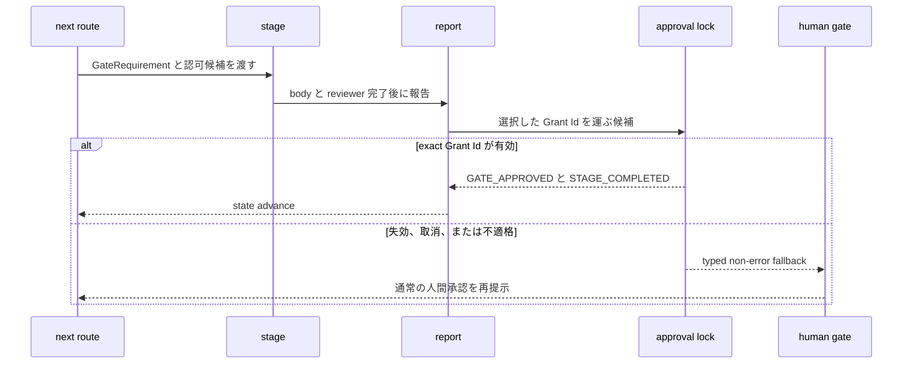
```mermaid
sequenceDiagram
    participant N as next route
    participant S as stage
    participant R as report
    participant L as approval lock
    participant H as human gate
    N->>S: GateRequirement と認可候補を渡す
    S->>R: body と reviewer 完了後に報告
    R->>L: 選択した Grant Id を運ぶ候補
    alt exact Grant Id が有効
        L-->>R: GATE_APPROVED と STAGE_COMPLETED
        R-->>N: state advance
    else 失効、取消、または不適格
        L-->>H: typed non-error fallback
        H-->>N: 通常の人間承認を再提示
    end
```

テキスト fallback: `next` はゲートの有無と認可候補を分けて扱い、stage 実行後の commit lock 内で同じ Grant Id を再検証する候補である。有効なら `GATE_APPROVED` / `STAGE_COMPLETED` と state advance を確定し、不適格なら `ERROR_LOGGED` を含む監査や state mutation を一切行わず通常の人間承認へ戻す。carrier の具体形はまだ確定しない。

## 不変条件と候補 seam

protected audit event の一般 CLI mint 禁止、issuer `HUMAN_TURN` 実在、Grant Id 相関、phase-check、walking skeleton exclusion、per-unit 全成果物着地後の最終 gate を維持する。候補は (A) directive→report→approve へ exact Grant Id を運ぶ、(B) opaque authorization claim を運ぶ、(C) commit-only 再探索を維持する、の3案。fallback は `emitApprovalAudit` より前の typed non-error outcome とする必要があるが、配置と型は後続設計で裁定する。

## Mirror lifecycle とレビュー修正境界（260725-mirror-review-fixes、履歴）

Mirror の正準経路は `amadeus-orchestrate.ts` または lifecycle CLI から境界イベントを作り、coordinator が policy と durable state を照合し、executor が mutation permit・receipt・provenance を維持しながら gateway 経由で GitHub Issue を変更する構造である。PR #1469 の変更は base `6d4df90566dcf7aa00980e5f9e85c831ca9108ba` から observed `70336937529f5be31c011de5d368c0f03e534506` まで49コミット、フォーカス23ファイルで `+10,319/-161`。Mirror の正本は `packages/framework/core/tools/`、`.claude/.codex/.cursor/.opencode` と `dist/*` は生成投影である。

次の相互作用図は回復すべき正準契約を示す。現行実装との差は直後の「確認された破断点」に列挙する。

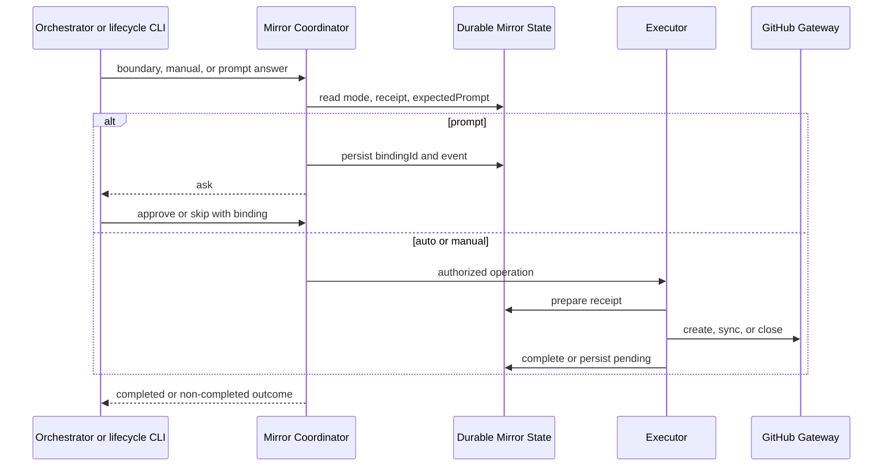
```mermaid
sequenceDiagram
    participant O as Orchestrator or lifecycle CLI
    participant C as Mirror Coordinator
    participant S as Durable Mirror State
    participant E as Executor
    participant G as GitHub Gateway
    O->>C: boundary, manual, or prompt answer
    C->>S: read mode, receipt, expectedPrompt
    alt prompt
        C->>S: persist bindingId and event
        C-->>O: ask
        O->>C: approve or skip with binding
    else auto or manual
        C->>E: authorized operation
        E->>S: prepare receipt
        E->>G: create, sync, or close
        E->>S: complete or persist pending
    end
    C-->>O: completed or non-completed outcome
```

テキスト代替: 呼出元→coordinator→state の順に mode と binding を確定し、許可された場合だけ executor→GitHub を実行する。最終 outcome が `completed` でない限り、呼出元は境界を完了済みにしてはならない。

### 確認された破断点

1. `runMirrorLifecycleMain` は `runMirrorLifecycleBoundary` が `kind: "ok"` なら outcome 内の `pending` / `safety-blocked` / `suppressed` を判定せず exit 0 にする（`amadeus-mirror-lifecycle.ts:898-904`）。`amadeus-orchestrate.ts` の mirror boundary report は子コマンド成功を前提に phase receipt を `completed` へ進めるため、未完了副作用と workflow 前進が分離する。
2. coordinator は prompt を state に保存する（`amadeus-mirror-coordinator.ts:625-668`）が、`MirrorPromptAnswer` と `ask` outcome は `bindingId` を持たない（`:55-82`）。approve の照合は event/operation のみ（`amadeus-mirror-policy.ts:165-192`）、skip はその照合を通らず state 内の binding を transition へ転記する（`amadeus-mirror-coordinator.ts:367-389,507-525`）。加えて `parseMirrorLifecycleArgs` の公開コマンドは boundary/manual/repair のみ（`amadeus-mirror-lifecycle.ts:483-503`）であり、CLI 配線と保存済み binding への回答照合がともに欠ける。
3. legacy CLI は `gh issue create/edit/close` と state field write を直接実行する（`amadeus-mirror.ts:357-456`）。これは lifecycle の execution authorization、atomic state reducer、ownership marker、reconciliation を横断せず、安全境界が二重化している。
4. config reader は `realpathSync(absPath)` の containment 判定後に、解決済み文字列を `openSync(realPath, "r")` する（`amadeus-mirror-config.ts:161-184`）。判定と open が同一 fd に結合されず、置換競合窓が残る。
5. strict JSON parser は未エスケープ CR/LF のみ拒否し（`amadeus-mirror-state-codec.ts:194-195`）、JSON が禁止する他の U+0000–U+001F を文字列へ通す。
6. coverage source 正規化は package harness と root/dist prefix の双方で Claude/Codex/Kiro のみ列挙し、Cursor/OpenCode を欠く（`tests/lib/coverage-source-path.ts:8-13,43-59`）。生成コピーの hit が正本へ畳まれず、project/patch coverage が低く見える。

### 設計上の修正方向

- lifecycle の CLI 成功判定を requested operation の `completed` に限定し、prompt のみは機械判定可能な ask 往復として扱う。
- prompt 回答 surface は `expectedPrompt.bindingId`、event、operation、answerId を一組で受け、coordinator の `approveMirrorPrompt` を binding まで照合する対称な approve/skip 判定へ拡張して接続する。
- legacy mutation verb は lifecycle `manual` へ委譲するか明示拒否し、直接 GitHub mutation を廃止する。read-only `status` は診断面として分離可能。
- config は open descriptor を信頼の起点とし、no-follow、fd identity、workspace containment を同じ検査鎖で確定する。codec は未エスケープ code point `< U+0020` を一律拒否する。coverage は全6 harness の正準→生成投影表を一か所で管理する。

> **2026-07-24 更新（intent `260724-watcher-timeout-fix`、履歴）**: base `a81c11dde83e0059c48ecc912d2d22dd6bca60eb` → observed HEAD `6d4df90566dcf7aa00980e5f9e85c831ca9108ba`（distance 155）の differential refresh（amadeus-bugfix / Minimal、[Issue #1449](https://github.com/amadeus-dlc/amadeus/issues/1449)）。交差面は Team Mode ランチャー(`packages/framework/core/tools/team-up.sh`)の起動シーケンス上の agmsg watcher arming 検証の位置。下記「Team Mode ランチャーの watcher arming 検証と mux_attach ブロッキング」節は同 intent の履歴。以下の 260723 系・260722 系節も履歴。

## Team Mode ランチャーの watcher arming 検証と mux_attach ブロッキング（260724-watcher-timeout-fix、履歴、Issue #1449）

`packages/framework/core/tools/team-up.sh`(HEAD 1462 行)の fresh 起動シーケンス末尾(:1415-1462)は次の順序で並ぶ(測定 ref: observed HEAD `6d4df9056` 実ファイル直読):

1. pane レイアウト構築(:1429-1435、`mux_new_session`/`mux_split`/`stack_column`)で全メンバーを spawn。
2. `if watcher_verification_applies; then verify_watchers_armed || watcher_status=$?; fi`(:1442-1445)。
3. `start_safety_wait_supervisors || exit 1`(:1447)。
4. **`mux_attach "$S"`(:1448)** — ユーザーが team ペインへ interactive アタッチする点。
5. run record 更新(:1449-1457)→ `exit "$watcher_status"`(:1462)。

**アーキテクチャ上の要点**: watcher arming 検証(手順 2)は interactive attach(手順 4)の**前**に同期実行される。これはコメント(:1437-1441)が明記するとおり「exit code を意味あるものに保つため(attach は exit code を飲む)」の意図的設計であり、`260722-teamup-prompt-race` の requirements FR-5 [e5](attach 前完了を前提)に接地する。副作用として、`verify_watchers_armed`(:1139-1178)が unarmed メンバーに対し最大 `WATCHER_READY_TIMEOUT`(90)× `(WATCHER_RESEND_MAX+1)`(3)= 270 秒待つ間、手順 4 の attach が構造的にブロックされる(Issue #1449)。

**agmsg spawn.sh との関係**: 本検証は agmsg の readiness handshake 様式(`~/.agents/skills/agmsg/scripts/spawn.sh` の `READY_TIMEOUT=90` :132 / sentinel clear :572 / `WAIT_READY` ブロッキング :576-588)を team ランチャーへ移植したもの。ただし spawn.sh は**単発待ち**(タイムアウトで `exit 3`)なのに対し、team-up.sh は**再送ループ ×3** を追加した非対称構造。sentinel path は `ready_sentinel_path`(:1078-1085)が agmsg `actas-lock.sh` の `agmsg_ready_path` を subshell source して取得し、path 文字列の二重定義を避ける(NFR-4)。導入は #1391(検証本体)→ #1421(`scripts/` から `packages/framework/core/tools/` へ昇格 + 配布 11 コピー、ロジック不変)。

> **履歴（intent `260724-harness-provenance`、Issue #1452）**: observed HEAD `2d0da11d022565bf4a613da9fbcccf078716f8f4` の differential refresh で得た知識。現在の鮮度ポインタは冒頭の `260724-watcher-timeout-fix` であり、本節の file:line は当時の observed 時点を指す。

## ハーネス provenance の書込経路とハーネス検出アーキテクチャ（260724-harness-provenance、履歴、Issue #1452）

Issue #1452 は「どの AI ハーネス（Claude Code / Kiro / Codex / opencode / Cursor）が intent を実行したか」を `amadeus-state.md` と stage `memory.md` に記録する機能。差分リフレッシュで確定した**書込経路・検出機構・再利用 seam・センサーリスク**の4面を以下に合成する（測定 ref: Observed=HEAD `2d0da11d` 実読、`packages/framework/core/` 正本）。

### 1. `amadeus-state.md` の書込経路 — birth-time 単一書込

- **テンプレート実体**: `amadeus-utility.ts:4092` の `stateContent` テンプレートリテラル。`## Project Information` ブロック（`:4094-4103`、フィールド: Project / Project Type / Scope / Start Date / State Version / Active Agent / Worktree Path / Bolt Refs / Practices Affirmed Timestamp）。
- **書込点は intent birth の1箇所のみ**: `handleIntentBirthStateBuild()`（`:3926`）が `stateContent` を組み立て、`writeStateFile(projectDir, stateContent)`（`:4146`）で書き出す。ステージ完了時の state 再生成経路はなく、`## Project Information` へのフィールド追加は **birth-time にしか自動反映されない**。
- **設計含意**: 新規 `Harness` フィールドを birth 時に埋めるだけならテンプレートへの1行追加で足りる。ただし既存 intent（birth 済み）への後付けは birth 経路を通らない。
- **検証機構**: `validateStateFields()` は `STATE_V7_FIELDS` の各フィールドを exactly once 検査する。`Harness` を V7 集合へ加えると既存 state の欠落が失敗するため、birth-only の optional 追加では V7 集合に触れない選択が低リスク。

### 2. stage `memory.md` の書込経路 — テンプレートのバイトコピー

- `ensureStageDiary()` が `memory-template.md` をバイトコピーする。YAML フロントマターはなく、H2 は `Interpretations` / `Deviations` / `Tradeoffs` / `Open questions` の4見出し。
- テンプレート参照元は `harnessDir()` 経由で、provenance ソースが経路に内在する。
- `tests/unit/t100-memory-template-lifecycle.test.ts` は exactly four headings と fresh template の `total===0` を固定するため、テンプレートへの新規 H2 や YAML 追加は高リスク。

### 3. ハーネス検出機構 — provenance ソース

- `harnessDir()` → `deriveHarnessDir()` の既存解決順序は、`AMADEUS_HARNESS_DIR` env → script path → CWD 上の `KNOWN_HARNESS_DIRS` → `.claude` fallback。
- `KNOWN_HARNESS_DIRS` の5要素は対象5ハーネスと対応するが、既存コメントどおり harness 一覧の source of truth ではないため、provenance 用 canonical mapping は別に定義する必要がある。
- env override は既存の `AMADEUS_*` 命名規約に従う。

### 4. 再利用可能ヘルパーと先例

- フィールド操作には `getField` / `setField` / `setFieldStrict` / `fieldExists` / `setOrInsertField` がある。
- `AUTONOMY_MODE_FIELD` 定数 + `isAutonomousMode()` 述語は、定数・判定・実行時挿入を組み合わせる先例である。

### 5. センサーリスク

- PostToolUse sensor は Edit/Write の `tool_input.file_path` を対象とし、bun の `writeStateFile` / `writeFileSync` では発火しない。
- state.md へのフィールド追加は H2 数を変えないため低リスクだが、memory.md の構造変更は t100 を破壊する高リスクである。

## FR-0 機械実行器の CI-resident 表明とテスト tier 配置の乖離（260723-t241-ci-residency、履歴） `a81c11dde83e0059c48ecc912d2d22dd6bca60eb` → observed `78bce87615b985d0151f604c915c6aab1d6ba9f1`（distance 35）の differential refresh（bugfix / Minimal、[Issue #1294](https://github.com/amadeus-dlc/amadeus/issues/1294)）。本 intent の交差面は CI テスト tier アーキテクチャ（`tests/run-tests.ts` の profile flag × `.github/workflows/` × テスト層配置）に限定。**本バグ面の欠陥コードは base..HEAD で無変更**（`git diff --numstat <base>..HEAD -- tests/e2e tests/run-tests.ts .github/workflows package.json` = 0 行）で、原因所在は intent `260718-election-ts-foundation`（導入 PR #1235）にあり本区間 35 コミットとは無交差（測定 ref: scan-notes @ observed HEAD `78bce876`）。以下「FR-0 機械実行器…（260723）」節も履歴（単一 current view は 260723-marker-heading-exemption — code-quality-assessment と鮮度ポインタを参照）。

## FR-0 機械実行器の CI-resident 表明とテスト tier 配置の乖離（260723-t241-ci-residency）

`tests/e2e/t241-election-machine-executor.test.ts` は選挙 CLI（`scripts/amadeus-election.ts`）を `spawnSync`（bun）で子プロセス起動し、`next` 指令 JSON を字義実行する LLM 無知識の機械実行器で、**FR-0（directive-driven プロトコルの常設保証）の layer (i)** を担う。ヘッダ（:1、verbatim: `// t241 — FR-0 machine executor (ADR-6 layer (i), CI-resident, Bolt 4).`）が「**CI-resident**」を、本文（:4-5）が「strongest **standing** proof of FR-0」を自称する。しかしファイルは `tests/e2e/` に配置されており、自動 CI の実行範囲と乖離する（測定 ref: scan-notes @ observed HEAD `78bce876`）。

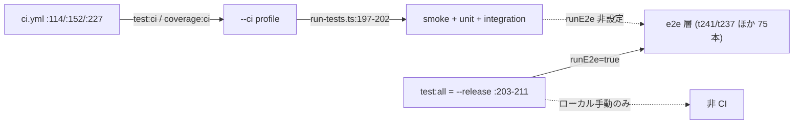
```mermaid
flowchart LR
  CI["ci.yml :114/:152/:227"] -->|test:ci / coverage:ci| PCI["--ci profile"]
  PCI -->|run-tests.ts:197-202| T["smoke + unit + integration"]
  T -.->|runE2e 非設定| E2E["e2e 層 (t241/t237 ほか 75本)"]
  REL["test:all = --release :203-211"] -->|runE2e=true| E2E
  REL -.->|ローカル手動のみ| Manual["非 CI"]
```
<!-- Text fallback: ci.yml は test:ci/coverage:ci=--ci profile を使い、run-tests.ts の --ci 実装(:197-202)は smoke/unit/integration のみ true とし runE2e を立てない。e2e 層(t241 含む 75本)を走らせるのは --release(=test:all)のみで、これはローカル手動起動。release.yml は test 実行ステップなし、formal-verification.yml は workflow_dispatch のみ。よって e2e 層はいずれの自動 CI でも実行されない。 -->

- **--ci tier = e2e 非実行**: `run-tests.ts:197-202` の `--ci` 実装は `runSmoke/runUnit/runIntegration=true` で **runE2e を立てない**（Usage banner :124-127 も `--ci` = smoke+unit+integration と明記）。`test:ci`/`coverage:ci` は共に `--ci`（package.json:14-16）。e2e を走らせるのは `test:all`（=`--release`、:203-211 で runE2e=true）のみで、Usage banner :148 が「All levels (hours)」と重量を明記するローカル手動用。
- **自動 CI 3 ワークフローで e2e 0 ヒット**: `ci.yml`（:114/:152/:227 が `test:ci`/`coverage:ci`、`--e2e`/`--release`/`test:all` 0 ヒット、トリガー :8 push:main + :13 pull_request）、`release.yml`（test 実行ステップなし、publish のみ）、`formal-verification.yml`（:12 `workflow_dispatch` のみ、e2e ランナー無関係）。よって t241 の e2e 層は PR/main push/release のいずれでも実行されない。
- **ADR-6 からの実装逸脱（決定的原因所在）**: ADR-6（`application-design/decisions.md:41-48`）Decision は layer (i) 機械実行器を「**integration テストで固定する**」と明記。t241 ヘッダ自身も「ADR-6 layer (i), CI-resident」を引く（:1）。にもかかわらず実装（#1235）は `tests/e2e/` に配置した。原因所在は **設計（ADR-6）は integration を正しく指定していたが実装が e2e に置いた実装逸脱**（cid:bug-intent-linkage）で、CI 実行範囲（--ci に e2e 非含有）との整合検証が欠落した。
- **正直宣言との対照（t237）**: 同一 e2e tier の `tests/e2e/t237-election-walking-skeleton.test.ts` はヘッダ（:1-5）で「**Layer: e2e**」と正直に宣言し **CI-resident を自称しない**（walking-skeleton 実演は本来 e2e が正配置）。矛盾は t241 単独（e2e 配置 × CI-resident 主張）。
- **integration precedent（回復先の実在）**: `tests/integration/` に `amadeus-election.ts` を spawn する兄弟テストが 6 ファイル既存（t235/t236/t240/t242/t244 + t-formal-verif-arm-s-blind、`grep -rln amadeus-election tests/integration` = 6）。同型の「CLI spawn 選挙テスト」が既に integration tier で `--ci` により CI 実行されている。size purity 上も t241（spawnSync+fs → `classifyTestSize`=medium）は integration MAX=medium（`test-size.ts` :164）に適合（clean）。よって integration 移設は ADR-6 本来の配置への回復であり新規機構を要さない（t241 は `gen-coverage-registry.ts` 未登録、wiring coverage は in-process の t236 が所有）。

> **履歴（260722-teamup-prompt-race）**: base `a326f47bc0146a3b4285552f42b92fd61fb343a7` → observed `a81c11dde83e0059c48ecc912d2d22dd6bca60eb`（distance 101）の differential refresh（bugfix / Minimal）。本 intent の交差面は `scripts/team-up.sh`（+212 −8）の team 起動オーケストレーションに限定。以下「upstream v2.3.0 同期の現行アーキテクチャ」以降はさらに履歴。

## team 起動オーケストレーションの watcher-arming アーキテクチャ（履歴: 260722-teamup-prompt-race）

`scripts/team-up.sh` は Herdr（pane multiplexer）を介して各メンバーの AI CLI（claude / codex）を pane 上に起動する team 起動オーケストレータである。claude メンバーの watcher（agmsg monitor）起動は、次の**一方向・無検証**の経路で成立する（測定 ref: observed HEAD `a81c11dde` 実読）。

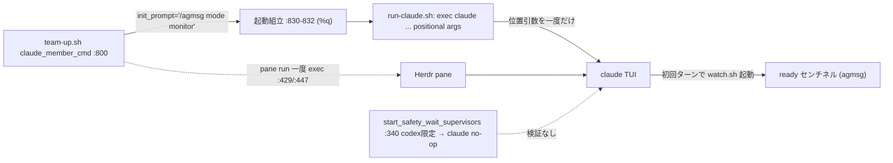
```mermaid
flowchart LR
  TU["team-up.sh claude_member_cmd :800"] -->|init_prompt='/agmsg mode monitor'| CMD["起動組立 :830-832 (%q)"]
  CMD --> RC["run-claude.sh: exec claude ... positional args"]
  RC -->|位置引数を一度だけ| TUI["claude TUI"]
  TU -.->|pane run 一度 exec :429/:447| Herdr["Herdr pane"]
  Herdr --> TUI
  TUI -->|初回ターンで watch.sh 起動| Sentinel["ready センチネル (agmsg)"]
  SW["start_safety_wait_supervisors :340 codex限定 → claude no-op"] -.->|検証なし| TUI
```
<!-- Text fallback: team-up.sh が init_prompt を run-claude.sh の位置引数として一度だけ渡し、pane run も cmd を一度 exec するのみ。start_safety_wait_supervisors は codex 限定で claude では即 return するため、claude の watcher attach を検証する経路が構造的に存在しない。TUI 起動レースで初期プロンプトが消えると watcher は起動せず、再送も検証もない。 -->

**構造的欠陥**: `start_safety_wait_supervisors()`（`:338-395`）が `:340` `[ "$RUNTIME" = "codex" ] || return 0` で claude では即 return するため、claude runtime には起動後の readiness 検証点が存在しない。対照として agmsg `spawn.sh`（repo 外 `~/.agents/skills/agmsg/`）は ready センチネル（`agmsg_ready_path` `lib/actas-lock.sh:69-73`、生成側 `watch.sh:294-310`）出現までブロックする handshake アーキテクチャを持つ（`spawn.sh:576-588`、default timeout 90s `:46-47`）。team-up.sh の claude 経路はこの handshake 相当を欠く。

**設計先例（再利用面）**: 直近 intent `260721-teamup-safety-wait` は「起動後に Herdr 経由で pane readiness を検証する」supervisor を **Codex 専用**に新設した（`team-up.sh:212-395`,`:1259` の lock dir / role-ready / supervise / rollback 構造 + 新規 `team-up-codex-safety-wait.ts` の `resolve`/`readVisible` `:273-338`）。claude 版 readiness 検証はこの構造に倣えるが、`resolve` の `agent === "codex"` フィルタは拡張を要する。

> **履歴（260720-upstream-sync-230）**: base `a326f47bc0146a3b4285552f42b92fd61fb343a7` → observed `545e69c836d46f7bec2fa351c8e668026eb5fad5`（32コミット）の differential refresh。24 ADOPT/ADAPT の主戦場は「stage schema + Unit kind」から graph/parser/directive/sensor、plugin discovery/package、6 harness projection、compose/no-clobber/self-heal compile、dist、4 harness self-install、tests/docs へ流れる変更鏖である。件数は Developer scan 実測（core tools 30、hooks 11、agents 14、stages 32、sensors 5、harness 六面 69 files）に基づく。

## upstream v2.3.0 同期の現行アーキテクチャ（履歴: 260720-upstream-sync-230）

Amadeus は one-core-many-harnesses を維持する。`packages/framework/core/` がエンジン・stage・protocol・knowledge の正本、`packages/framework/harness/{name}/` がホスト固有 adapter の正本、`scripts/package.ts` が六ハーネスの `dist/` を生成する。セルフインストールはうち4ハーネスの closed list であり、packager の6ハーネス open set と区別する（測定 ref: `scripts/package.ts:63-72,166-176,587-729`）。

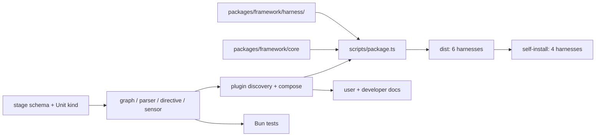
```mermaid
flowchart LR
  Schema["stage schema + Unit kind"] --> Graph["graph / parser / directive / sensor"]
  Graph --> Plugin["plugin discovery + compose"]
  Plugin --> Package["scripts/package.ts"]
  Core["packages/framework/core"] --> Package
  Harness["packages/framework/harness/<name>"] --> Package
  Package --> Dist["dist: 6 harnesses"]
  Dist --> Install["self-install: 4 harnesses"]
  Graph --> Tests["Bun tests"]
  Plugin --> Docs["user + developer docs"]
```
<!-- Text fallback: stage schema と Unit kind が graph/parser/directive/sensor へ波及し、plugin discovery/compose と core/harness 正本を packager が6ハーネス dist へ投影する。dist のうち4面を self-install し、同じ契約を tests/docs が検証する。 -->

### 24項目の構造判定

| # | 識別子 | 判定 | 構造根拠（observed） |
|---:|---|---|---|
| 1 | bolt-dag-selfheal | MISSING | `amadeus-orchestrate.ts:737-750` は null を無音 degrade |
| 2 | gate-revision-backstop | PARTIAL | `:3064-3080` は engine-opened gate のみ回復 |
| 3 | swarm-batch-advance | EQUIVALENT 候補 | `:1961-1972` が全 batch 走査、`amadeus-swarm.ts:724-769` が merge failure 降格 |
| 4 | help-routing | MISSING | `amadeus-utility.ts:3058-3081` は `intent help` を target 扱い |
| 5 | compose-pending-freshness | MISSING | `amadeus-stop.ts:441-465` は marker 存在のみ判定 |
| 6 | recompose-autonomy-guard | MISSING | `amadeus-utility.ts:3460-3503` は Running のみ検査 |
| 7 | unit-kind-pruning | MISSING | `produces_kinds` 契約なし |
| 8 | unit-major-iteration | MISSING | major iteration 契約なし |
| 9 | scope-cost-preview | MISSING | scope 費用 preview なし |
| 10 | gate-next-stage-naming | PARTIAL | state/audit に next stage はあるが directive に非投影 |
| 11 | nested-root-detection | MISSING | workspace scanner に nested root signal なし |
| 12 | submodule-detection | MISSING | `amadeus-utility.ts:2340-2424` に `.gitmodules` advisory なし |
| 13 | execpath-spawn | MISSING | adapter 5サイトが bare `bun` |
| 14 | kiro-ide-hook-context | PARTIAL | adapter `:58-99` に stdin race、IDE payload 分類契約不在 |
| 15 | project-dir-quoting | MISSING | settings example の `$CLAUDE_PROJECT_DIR` 13件が quote 0 |
| 16 | reviewer-date-persona | MISSING | reviewer 指示に `date -u`/persona 契約なし |
| 17 | reviewer-read-scope | MISSING | `stage-protocol.md:866-872` は全 artifact 読み |
| 18 | stage-schema-extensions | MISSING | number/name/bundle/required_sections なし、`when` は予約拒否 |
| 19 | packager-plugin-projection | MISSING | plugin discovery/projection なし |
| 20 | plugin-compose-hook | MISSING | compose hook なし |
| 21 | test-pro-reference-plugin | MISSING | reference plugin なし |
| 22 | plugin-docs | MISSING | plugin/docs/packager seam の契約なし |
| 23 | ported-tests | MISSING | upstream t199-t219/t188 相当の現行再著作なし |
| 24 | docs-updates | PARTIAL | 基盤 docs は広いが採用機能/plugin は未記載 |

## Interaction Diagrams

### plugin 活性化からハーネス投影まで

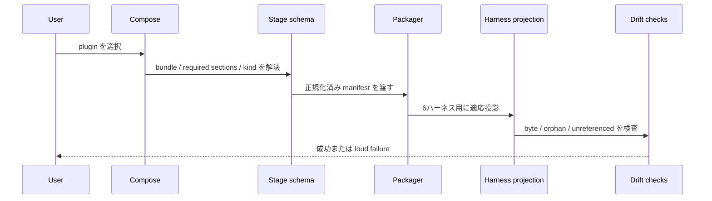
```mermaid
sequenceDiagram
  participant U as User
  participant C as Compose
  participant S as Stage schema
  participant P as Packager
  participant H as Harness projection
  participant V as Drift checks
  U->>C: plugin を選択
  C->>S: bundle / required sections / kind を解決
  S->>P: 正規化済み manifest を渡す
  P->>H: 6ハーネス用に適応投影
  H->>V: byte / orphan / unreferenced を検査
  V-->>U: 成功または loud failure
```
<!-- Text fallback: ユーザーが plugin を選ぶと compose が schema 契約を解決し、packager が6ハーネスに適応投影した後、byte/orphan/unreferenced 検査が結果を返す。 -->

### Construction swarm の現行同等経路

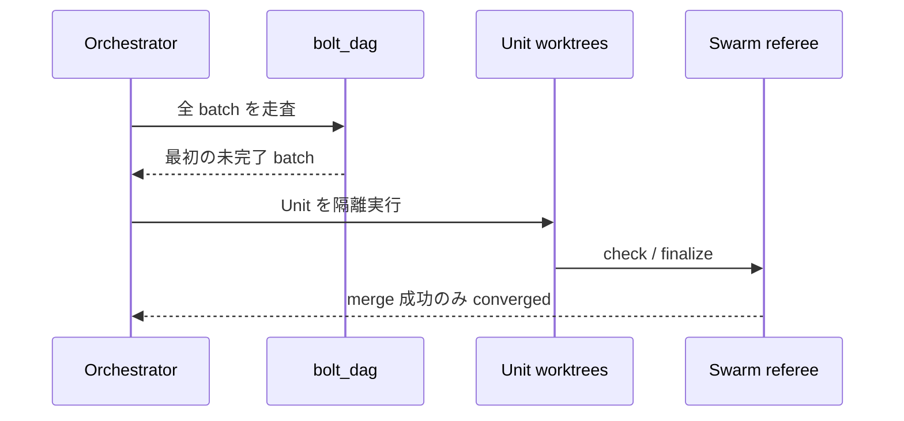
```mermaid
sequenceDiagram
  participant O as Orchestrator
  participant D as bolt_dag
  participant W as Unit worktrees
  participant R as Swarm referee
  O->>D: 全 batch を走査
  D-->>O: 最初の未完了 batch
  O->>W: Unit を隔離実行
  W->>R: check / finalize
  R-->>O: merge 成功のみ converged
```
<!-- Text fallback: orchestrator が bolt DAG の全 batch から未完了分を選び、Unit worktree を実行し、referee が check/finalize と merge 結果を反映する。このため swarm-batch-advance は EQUIVALENT 候補である。 -->

> 以下は過去 intent の履歴であり、今回の current marker ではない。

> **2026-07-19 更新（intent `260719-cursor-complete-clear`、履歴）**: [Issue #1248](https://github.com/amadeus-dlc/amadeus/issues/1248) の「完了 intent シャードへの無期限監査追記」を、base `591b6a2a2` → observed `a326f47bc`(52コミット)で diff-refresh。フォーカス面(カーソルライフサイクル・complete 経路・監査追記チェーン・フック群)の focus ファイル区間コミット13件は全て非交差。根本は active-intent カーソルの **set⇔clear 非対称** と監査ルーティングチェーンの status ゲート不在(下記「active-intent カーソルの set⇔clear 非対称と監査ルーティング」節)。

> **2026-07-19 更新（intent `260718-election-ts-foundation`、履歴）**: 選挙 TS 基盤の配布境界を確定。反証課題「dist 非対象の local overlay チャンネルが存在しない」は反証され、`contrib/skills/` overlay が canonical→dist→self-install の3層に加わる4本目の配布チャンネル(dist バイパス)として実在することを確認(下記「contrib overlay 配布チャンネル」節)。base `e9a001105` → observed `c2e4975ff`(69コミット)で diff-refresh、フォーカス面の区間変更は軽微。

> **2026-07-18 更新（intent `260718-hooks-config-conflict`、履歴）**: [Issue #770](https://github.com/amadeus-dlc/amadeus/issues/770) の Codex hook 設定競合を、base `e9a001105d253e14affb77417423d9f0b0360f9e` から observed `594ba21d636218558b711b371c286f16731fb081` まで8コミットで diff-refresh。フォーカス契約の区間変更は0件で、現行コードと外部 agmsg 1.1.7 の reader／writer を再照合した。技術方針は `【裁定待ち】`。

## active-intent カーソルの set⇔clear 非対称と監査ルーティング(260719-cursor-complete-clear、Issue #1248)

active-intent カーソル(per-user、`ACTIVE_INTENT_POINTER = "active-intent"` `amadeus-lib.ts:400`)は監査シャードのルーティング先を決める単一の状態だが、その**ライフサイクルが片側だけ実装された非対称**になっており、これが完了 intent シャードへの無期限追記(モグラ叩き)の構造的原因である。

- **set は2経路、clear は0経路**: 書き手は `setActiveIntentCursor`(`amadeus-lib.ts:1725-1733`、書込 `:1729`。呼び出し元 = intent 作成ヘルパー `:1921` と intent 切替 verb `amadeus-utility.ts:3083`)と birth 時書込(`amadeus-lib.ts:2147`)の2箇所のみ。カーソルを消す関数(`clearActiveIntent` 等)はコードベースに存在しない(repo 全域 grep で確認)。intent ライフサイクルの終端(complete)に対応する clear が欠落 = symmetric-pair-review が指す「片側だけ実装された非対称」クラスタ。
- **complete はカーソルを触らない**: `handleCompleteWorkflow`(`amadeus-state.ts:1550-1680`)は `Status: Completed` 設定・監査4行 emit・`writeStateFile` の後、registry status 前進のみ(`:1668-1669` `updateIntentStatus(pd, dir, "complete")`)。カーソルは完了 intent を指したまま残留する。
- **監査ルーティングチェーンに status ゲートが無い**: `appendAuditEntry`(`amadeus-audit.ts:281`)→ `ensureAuditFile`(`:237-247`、無条件 dir/ファイル作成)→ `auditFilePath`(`amadeus-lib.ts:2181-2185`)→ `recordDir`(`:1095`)→ `activeIntent`(`:1059-1084`)。`activeIntent` の判定は `records.includes(raw)`(`:1074`)のみで **intents.json の status を参照しない** — record dir が実在する限り Completed でもカーソル値を返す。全段に status 参照が無いため、残留カーソルがある限り監査は完了 intent のシャードへ append され続ける。
- **追記到達フックは7つ**: `mint-presence`(主犯、`:73-74` ゲートは state ファイル存在のみで status ガード無し・毎ターン HUMAN_TURN 追記)、`audit-logger`、`sensor-fire`、`session-start`、`session-end`、`validate-state`、`log-subagent`。すべて共通末端 `appendAuditEntry`→`auditFilePath`→`activeIntent` を通る。非到達4フック(`stop` は読取専用、`statusline`/`runtime-compile`/`sync-statusline`)。

対称性を補う修正方向は2案(complete 時にカーソルを clear するエンジン側修正 / 監査ルーティングで参照先 registry status が `complete` のとき追記を no-op にするフック側防御層)で、選択は requirements/選挙で確定する。欠陥は base `591b6a2a2` 時点から現存し、区間52コミットに退行・再導入はない。

## contrib overlay 配布チャンネル(dist バイパス、260718-election-ts-foundation)

配布境界の従来理解は「canonical(`packages/framework/{core,harness}`)→ `scripts/package.ts` → `dist/<harness>/` → `promote-self.ts` → self-install ツリー(`.claude`/`.codex`/`.agents`/`.cursor`/`.opencode`)」の3層だが、これに **dist を経由しない4本目のチャンネル** が存在する — `contrib/skills/` overlay。`promote-self.ts` が正本 `contrib/skills/<name>/` を **dist に入れず** discovery ツリーへ直接投影する。

- `CONTRIBUTOR_SKILLS_ROOT = "contrib/skills"`(`scripts/promote-self.ts:45`)、`CONTRIBUTOR_SKILL_DESTINATIONS = [".claude/skills", ".agents/skills"]`(:46)。投影ロジック :229-236(`walk` で全ファイル走査、`relFromSkills.split("/")[1] === "evals"` の authoring-only 資産はスキップ)。
- ヘッダコメント(:7-9 verbatim):「Contributor-only skill runtime files under contrib/skills/ are projected into both harness discovery trees without entering dist/. Authoring-only eval assets remain at the canonical contributor path.」
- 実測(`git ls-files`): 唯一の現存例 `contrib/skills/amadeus-upstream-sync/`(tracked 6ファイル)は `.claude/skills/amadeus-upstream-sync/`(3ファイル tracked、投影先)へ反映されるが `dist/claude/.claude/skills/` には **0件** = dist ドリフトガードの対象外。

**設計含意**: 「配布外のチーム内ツール」(W-04)を dist ドリフトガードを汚さずに `.claude`/`.agents` の discovery ツリーへ載せる唯一の user-invocable 経路がこの overlay。決定的 TS ツール本体は `scripts/*.ts`(`amadeus-mirror.ts` 前例、dist・contrib 投影いずれも非対象の repo ローカル)が自然な家。`/amadeus-<name>` の user-invocable SKILL は runner-gen 管轄外(stage/scope runner のみ生成)のため contrib overlay 経由でしか成立しない。この境界は本 intent の設計(TS 本体の置き場所 = contrib 配下 or scripts、決定は application-design へ委任)が依存する。

## Codex hooks の二重所有境界（260718-hooks-config-conflict）

Amadeus は `HOOK_WIRING` から9個の hook command を生成し、配布時は `.codex/hooks.json.example`、このリポジトリの self-install では tracked な `.codex/hooks.json` を正準活性化コピーとして扱う（`packages/framework/harness/codex/emit.ts:25-54,156-172,291-298`）。Codex と trust seed は実体 `.codex/hooks.json` を読む。一方、agmsg 1.1.7 の Codex manifest も同じパスを mutable runtime state に指定し（`~/.agents/skills/agmsg/scripts/drivers/types/codex/type.conf:18-22`）、monitor 起動ごとに既存 JSON を strip→add→SQLite JSON1 で再構築する（`codex-monitor.sh:194`、`delivery.sh:86-150`、`hooks-json.sh:35-158`）。根本機序は「正準 tracked activation」と「ローカル runtime config」という二つの所有者が同一ファイルへ書く責務衝突であり、整形差だけの問題ではない。

`scripts/promote-self.ts:84-97,207-299` は `.codex/hooks.json` を preserve するため、agmsg が追加した絶対 skill／clone path と minify は self-promotion では戻らず Git dirty として残る。[PR #783](https://github.com/amadeus-dlc/amadeus/pull/783) が ignore／preserve した `.codex/agmsg-delivery-mode` は、現行 agmsg source では reader・writer とも0件であり、mode の正の真実源は `delivery.sh status` が読む hooks JSON である。marker 対応だけでは残存競合を解消しない。

設計空間は次の二案に絞られるが、本 stage では選択しない。

| 恒久案 | 成立しやすい条件 | 未解決の代償 |
| --- | --- | --- |
| `【裁定待ち】` A: active `.codex/hooks.json` を untrack／ignore | 現行 agmsg writer と再起動 delivery を維持し、fresh fixture の tracked bytes を不変にできる | canonical 更新を既存 mutable active file へ反映する migration 契約が必要 |
| `【裁定待ち】` B: tracked static dispatcher + ignored sidecar | tracked canonical と runtime state を物理分離できる | Amadeus と外部 agmsg の協調変更、legacy fallback、Windows／turn／restart の広い互換検証が必要 |

pretty-print のみでは agmsg entry と絶対 path の追加が tracked diff のまま残る。Codex が発見・merge する証拠のない local file へ単純移動するだけでも runtime delivery は成立しない。どちらも恒久案にはならない。

## 現行 swarm 実行アーキテクチャ（260713-swarm-driver-migration、履歴）

現行 engine は「swarm を許可するか」と「どの Unit を対象にするか」を決める。`Construction Autonomy Mode` が `autonomous`、runtime graph に未完了 batch があり、対象 stage が Construction の `for_each: unit-of-work` かつ `mode: subagent` である場合に、driver-neutral な `invoke-swarm` directive を返す。directive は `{ kind, units, repo? }` だけを持ち、requested／selected driver、capability evidence、topology は持たない（`packages/framework/core/tools/amadeus-orchestrate.ts:706-742,1744-1830`、`amadeus-directive.ts:142-163,280-292`）。

driver 選択と AI worker の起動は、各 harness の `SKILL.md` prose を実行する live conductor に残る。Claude Code は既定で live `Task`、旧変数が1なら Dynamic `Workflow`、Codex は Unit ごとの別 `codex exec` process、Kiro CLI／IDE は live native `subagent` を使う。現行コードには共通 selector module も `AMADEUS_SWARM_DRIVER` の実装もない。

`amadeus-swarm.ts` は AI dispatcher ではなく、stateless な referee である。`prepare` が worktree と Bolt state を作成し、`check` が convergence command と protected file を検査し、`finalize` が claimed Unit を再検証して成功分を直列 merge する。swarm 監査イベントの発行者も referee に集約されているが、driver 情報は `SWARM_DEGRADED` の旧 `ultracode → subagent` 記録に限られる。

配布の正本は `packages/framework/core/` と `packages/framework/harness/<name>/` であり、`scripts/package.ts` が6 harness の `dist/<name>/` を生成する。Claude／Codex／Cursor／OpenCode の project-local self-install は `scripts/promote-self.ts:37-43,166-175` が同期する。`dist/**` は生成物であり直接編集しない。

## Interaction Diagrams

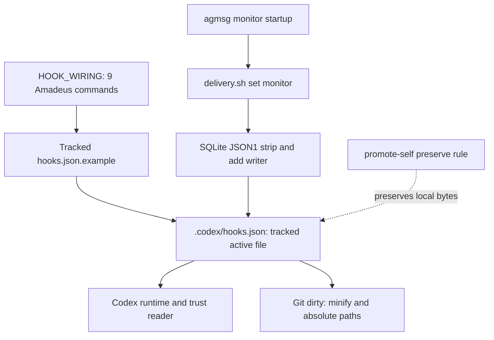
```mermaid
flowchart TD
  Wiring["HOOK_WIRING: 9 Amadeus commands"]
  Example["Tracked hooks.json.example"]
  Active[".codex/hooks.json: tracked active file"]
  Codex["Codex runtime and trust reader"]
  Monitor["agmsg monitor startup"]
  Delivery["delivery.sh set monitor"]
  Writer["SQLite JSON1 strip and add writer"]
  Git["Git dirty: minify and absolute paths"]
  Promote["promote-self preserve rule"]

  Wiring --> Example --> Active --> Codex
  Monitor --> Delivery --> Writer --> Active
  Active --> Git
  Promote -. preserves local bytes .-> Active
```

<!-- Text fallback: HOOK_WIRING から生成された tracked example が active .codex/hooks.json にコピーされ、Codex と trust reader が読む。別経路では agmsg monitor 起動が delivery.sh と SQLite JSON1 writer を通じて同じ active file を書き換える。promote-self はそのローカル bytes を preserve するため、minify と絶対 path が Git dirty として残る。 -->

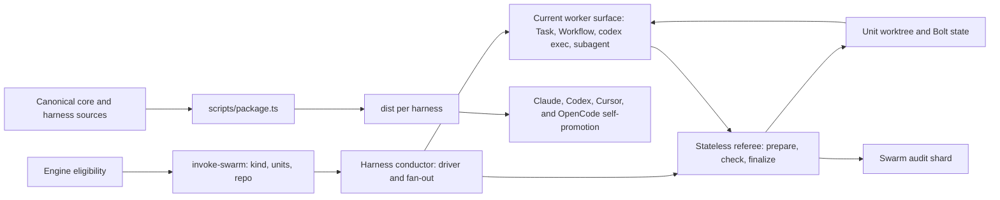
```mermaid
flowchart LR
  Engine["Engine eligibility"]
  Directive["invoke-swarm: kind, units, repo"]
  Conductor["Harness conductor: driver and fan-out"]
  Worker["Current worker surface: Task, Workflow, codex exec, subagent"]
  Referee["Stateless referee: prepare, check, finalize"]
  Isolation["Unit worktree and Bolt state"]
  Audit["Swarm audit shard"]
  Sources["Canonical core and harness sources"]
  Packager["scripts/package.ts"]
  Dist["dist per harness"]
  Promote["Claude, Codex, Cursor, and OpenCode self-promotion"]

  Engine --> Directive --> Conductor --> Worker
  Conductor --> Referee
  Referee --> Isolation --> Worker
  Worker --> Referee --> Audit
  Sources --> Packager --> Dist --> Promote
```

テキスト代替: engine は eligibility 判定後、Unit と任意の repo だけを持つ `invoke-swarm` を conductor へ渡す。conductor はハーネス固有 prose に従って worker surface を選び、referee の `prepare` で作られた Unit worktree 上へ fan-out する。worker 終了後は `check`／`finalize` が収束・保護 spec・merge を再検証し、referee が監査へ記録する。これと独立して、正本 core／harness source は `scripts/package.ts` から各 `dist` へ投影され、Claude／Codex／Cursor／OpenCode が self-promotion される。新 driver 契約は conductor 選択境界と referee 監査境界を明示化する必要がある。

### 現行境界の設計上の含意

- engine の read-only eligibility と referee の verdict／merge／audit 所有は分離されている。selector をどちらへ置く場合も、この責務を崩さず決定入力と監査 payload を渡す必要がある。
- explicit unavailable の hard error は worker 起動前に capability probe を完了させなければならない。`auto` fallback は同じ probe 結果から決定し、requested／selected／reason を同一 execution として監査する必要がある。
- native 利用の証明は CLI flag や環境変数の受理では足りない。Agent Teams、Ultra Code、Codex Ultra、Kiro subagent それぞれの native event／trace を2 Unit以上で捕捉し、referee の batch verdict と相関させる必要がある。
- packaging は source-side unreferenced scan と whole-tree orphan scan を既に持つ（`scripts/package.ts:692-725`）。過去節の #735／#701 は歴史的な設計記録であり、現存ギャップではない。

> **2026-07-11 更新(intent 260711-docs-repair-batch9、履歴)**: docs/harness 修理バッチ第9弾(#812 / #824 / #680 / #885 / #886)の diff-refresh(base `b845478bb`=前回 bughunt-fix-batch observed → observed `13598b752`=origin/main、59コミット)。フォーカスは kiro-ide ハーネスの localize 漏れ(#812 SKILL.md byte-copy / #824 onboarding.fills.ts 部分漏れ)・sensor-type-check の self-contained ヘッダ契約乖離(#680)・**restart 境界で失われた2契約**(#885 normalizeWorktreeSlug の slug 正規化一本化 / #886 phase-check ゲート)。restart-loss 2件のアーキ乖離(旧系譜契約 vs 現行)は末尾「docs-repair-batch9(2026-07-11)の観測面」節に記録。#812/#824/#680 の欠陥3ファイルは区間内無変更、#885/#886 の lib/state/worktree は区間内で #880 flip 配線・#869 jump per-phase の行番号シフトを受けたが欠陥自体は未修復で現存。
>
> **2026-07-11(intent 260710-core-repair-batch3、履歴)**: バッチ3(#746 / #786 / #742 / #743 / #747 / #741 / #751 / #744 / #749 / #750)を対象とする core/setup/tests 横断の内部欠陥修理。焦点は swarm/bolt の worktreePath read/write 非対称(#746)、learnings emitKey の生 NUL バイト(#786)、setup の err swallow(#742)/ 非アトミック書き込み(#743)/ prerelease 順序無視(#747)、t90 test 13 の wallclock フレーク(#741)、codex adapter のレガシー flat root 参照(#751)、orchestrate の PHASE_NUMBERS prototype-chain(#744)/ single skeleton-gate 詰み(#749)/ Branch 0 除外欠落(#750)。**焦点コードは base→observed(`da1611a9a..58f3453ad`、14コミット)でいずれも無変更**(バッチ D #774/#785/#787/#788/#789 が着地したが焦点面に非関与、全件現存)のため下記はすべて現行コード直読に基づく静的分析。主眼は末尾「core-repair-batch3(2026-07-11)の観測面」節。
> **2026-07-11 更新(intent 260711-p3-cleanup-batch8)**: P3 修理7件(#843 / #846 / #850 / #851 / #876 / #877 / #878)を対象とする docs/tools/tests 横断の内部欠陥修理。うち #843/#846/#850/#851 は旧 `.agents/`・`aidlc/` 系譜 → `packages/framework/` 移行境界で復元漏れした restart-loss(差分区間 `9738580ef..60f5e1edf` の**外**)、#876/#877/#878 は区間内で導入・変更された面。構造面の主眼は下記「orchestrate エラー監査経路の部分配線(#879/#878)」節(#879 導入 recordEngineError と default 出口未配線の非対称)。他6件は挙動/docs 欠陥で構造変化を伴わないため code-quality-assessment.md の同名節に接地。
>
> **2026-07-11(intent 260710-core-repair-batch3、履歴)**: バッチ3(#746 / #786 / #742 / #743 / #747 / #741 / #751 / #744 / #749 / #750)を対象とする core/setup/tests 横断の内部欠陥修理。焦点は swarm/bolt の worktreePath read/write 非対称(#746)、learnings emitKey の生 NUL バイト(#786)、setup の err swallow(#742)/ 非アトミック書き込み(#743)/ prerelease 順序無視(#747)、t90 test 13 の wallclock フレーク(#741)、codex adapter のレガシー flat root 参照(#751)、orchestrate の PHASE_NUMBERS prototype-chain(#744)/ single skeleton-gate 詰み(#749)/ Branch 0 除外欠落(#750)。**焦点コードは base→observed(`da1611a9a..58f3453ad`、14コミット)でいずれも無変更**(バッチ D #774/#785/#787/#788/#789 が着地したが焦点面に非関与、全件現存)のため下記はすべて現行コード直読に基づく静的分析。主眼は末尾「core-repair-batch3(2026-07-11)の観測面」節。
>
> **2026-07-10(intent 260710-tools-dispatch-batch、履歴)**: バッチ D(#774 / #785 / #787 / #788 / #789)を対象とする tools ディスパッチ/照合系の内部欠陥修理。焦点は setup version resolver のページング欠落(#774)、runner-gen prune の非対称(#785)、jump execute の direction 非再導出(#787)、graph・runtime の生 object-index dispatch(#788)、state advance の nextSlug 方向盲目(#789)。**焦点5ファイルは base→observed でコード diff 空**(`amadeus-runtime.ts` のみ #781 で改変されたが dispatch site を含む hunk は無し)のため下記はすべて現行コード直読に基づく静的分析。主眼は「tools-dispatch-batch(2026-07-10)の観測面」節。
>
> **2026-07-10(intent 260710-learnings-audit-batch、履歴)**: バッチ C(#754 / #745 / #761)を対象とする §13 learnings 系の内部欠陥修理。焦点は `amadeus-learnings.ts` の persist 判定マトリクス(#754 = cid 衝突で書き込みスキップ + RULE_LEARNED emit、#745 = 複数 destination 同一 cid で二重 emit)と `amadeus-runtime.ts` の per-unit stage learnings 集計の窓(#761)。**両焦点ファイルは base→observed でコード diff 空**(最終変更 `0801d2100`、2026-07-07)のため下記はすべて現行コード直読に基づく静的分析。主眼は末尾「§13 learnings persist 判定マトリクスと audit 整合」「runtime learnings 集計の窓(per-unit)」の2新設節。
>
> **2026-07-10(intent 260710-source-unreferenced-check、履歴)**: packaging の source 側 unreferenced 検査(#735)を対象とした記録。「packaging 入力集合と source 側 unreferenced 検査」節を参照。
>
> **履歴**: 前々 intent 対象の2バグは出荷済み — **#685 delegate-rejection は #729(`14d1146e0`)で解消**(`DELEGATED_REJECTION` イベント + `delegate-rejection` subcommand を追加、verb-scoped presence に分離)、**#670 sibling-worktree guard は #727(`20c2e9674`)で解消**(write パスをメインチェックアウトへアンカーする方式に変更)。以下の「#685」「#670」の相互作用図は**歴史的記録**であり現状コードとは一致しない。

> **2026-07-10 更新(intent 260710-source-unreferenced-check、履歴)**: 前回 intent 対象の2バグは出荷済み — **#685 delegate-rejection は #729(`14d1146e0`)で解消**(`DELEGATED_REJECTION` イベント + `delegate-rejection` subcommand を追加、verb-scoped presence に分離)、**#670 sibling-worktree guard は #727(`20c2e9674`)で解消**(write パスをメインチェックアウトへアンカーする方式に変更)。以下の「#685」「#670」の相互作用図は**歴史的記録**であり現状コードとは一致しない。この直下の packaging source 側 unreferenced 検査(#735)節も修正前の記録である。

## orchestrate エラー監査経路の部分配線(#879/#878、intent 260711-p3-cleanup-batch8、2026-07-11)

`amadeus-orchestrate.ts` のエラー監査経路は #879(observed HEAD `60f5e1edf`)で導入されたが、CLI ディスパッチの全出口には配線されておらず**部分配線**の状態にある。

- **導入**: `recordEngineError`(定義 `:195`)は `runEngineMain` の try/catch(`:3017`)で捕捉した例外を `ERROR_LOGGED` 監査イベントとして記録する。throw 経由でエンジンを抜ける失敗はこの catch を通り監査される。
- **未配線の出口(#878)**: `main()` の `default:` ブロック(`:2995-3001`)は Unknown subcommand を `console.error` + `process.exit(1)` で処理し、**throw しない**。このため `runEngineMain` の catch を通過せず `recordEngineError` が呼ばれない。不正サブコマンド起動が監査に残らない非対称が残る。
- **構造的含意**: エラー監査を「例外を投げて上位 catch で一元記録する」規約に統一するなら、default 出口も throw 化して `runEngineMain` catch へ流すのが対称。あるいは default 出口で `recordEngineError` を直接呼ぶ2案が候補。いずれも process.exit を経由する早期出口が監査経路をバイパスしうる、という一般パターン(検証劇場でない実 result 由来の監査を全出口で保つ)の一事例。

## ゲート系ツールの正準テンプレートと CI ジョブ構成(intent 260710-complexity-gate、2026-07-10)

複雑度ゲート導入(feature スコープ)の diff-refresh(フォーカス5面: `ci.yml`・`tests/coverage-project-gate.ts`・`gen-coverage-registry.ts`・`biome.json`・`package.json`)で確定した、再利用元アーキテクチャ。base `584262c1a` → observed 現 HEAD。

### `coverage-project-gate.ts` が確立した「ゲート系ツールの正準テンプレート」

`tests/coverage-project-gate.ts`(#762 で新規、236行)は自前の PROJECT カバレッジゲートであり、複雑度ゲートを含む後続のゲート系ツールが踏襲すべき構造の完成形として確立している。5つの設計要素が正準テンプレートを成す:

1. **env seam(呼び出し時解決)**: `AMADEUS_COVERAGE_TOTALS` / `AMADEUS_COVERAGE_PROJECT_BASELINE` を `totalsPath()`/`baselinePath()` が module load 時でなく**呼び出し時**に解決する(:38-54)。in-process テストが単一 import を temp ツリーへ差し向けられる(`gen-coverage-registry.ts` の `AMADEUS_COVERAGE_RATCHET` パターンと同型)。
2. **parse-don't-validate**: `parseTotalsText` が `ParseOutcome`(ok/detail 判別ユニオン)を返し(:83-113)、schemaVersion===1・非負整数・hits<=lines を検査。成功パースが不変条件を証明として運ぶ。
3. **fail-closed 5値 FailReason**: `FailReason = DROP_EXCEEDED|MISSING_CURRENT|MISSING_BASELINE|MALFORMED|EMPTY_POPULATION`(:59-77)。`evaluateGate(current, base)` が上から MISSING_CURRENT → MALFORMED → MISSING_BASELINE → EMPTY_POPULATION → DROP_EXCEEDED の順で fail を返し、ファイル欠落・不正はすべて fail(fail-closed、:132-170)。
4. **BigInt 厳密判定**: `passesThreshold` は除算を排した整数比較で float 丸めを排除(:119-126)。表示専用の `pct()` と分離。
5. **`--check`/`--update` CLI 形**: `main(args)` が `--check`(fail で stderr + exit1)/ `--update`(baseline 再書き込み)のみ受理、他は USAGE + exit2(:175-236)。`evaluateGate`/`main`/`runCheck`/`runUpdate`/型をエクスポートして in-process seam でテスト可能。committed baseline は `tests/.coverage-project-baseline.json`。

複雑度ゲート(lizard CCN の baseline ラチェット)はこのテンプレートを直接踏襲する: committed baseline JSON + env seam + `--check` 単調非減少 + `--update` 更新 + fail-closed 診断。`gen-coverage-registry.ts` のクラス別カウント非減少ラチェット(:1242-1266)も同型で、「CCN 上限を上げさせない」用途に最も近い。

### `.github/workflows/ci.yml` の現行4ジョブ構成(#777/#801 の変更点)

現行 ci.yml(238行)は `check` → `coverage` → `codecov-status` → `ci-success` の4ジョブ DAG。

- **`check`**(typecheck・lint・dist:check・promote:self:check・test:ci): 複雑度ゲートの lizard ステップは lint 直後(typecheck/lint の直後)に置く配置が確定(E-CX1 Q3=A)。トップレベル `permissions: contents:read` のまま完結(外部サービス不要)。
- **`coverage`**: `needs:[check]`、`coverage:ci` → 自前 project ゲート(`coverage-project-gate.ts --check`)→ Codecov upload。
- **#777 の変更点(concurrency)**: `concurrency.group` が `main` は per-SHA グループ(`github.sha`)で誰も cancel されず、PR は ref-keyed で `cancel-in-progress` が main=false/PR=true。
- **#801/#791 の変更点(Codecov flags 削除)**: `coverage` ジョブの Codecov upload から flags が削除された(`use_oidc:true`/`disable_search:true`/`fail_ci_if_error:true` は維持、flags なし)。
- **`ci-success`**: `needs:[check,coverage,codecov-status]`、`require_result` で3ジョブ result が全て success かを検査(実 result 由来、検証劇場でない)。新ステップを既存ジョブ内に置けば集約への追加配線は不要。

## packaging 入力集合と source 側 unreferenced 検査(intent 260710、#735 の中核理解)

`scripts/package.ts` は one-core-many-harnesses の唯一の変換器であり、「build が何を入力として読むか」がここで確定する。#735 が塞ごうとする欠陥は「manifest からどの行にも参照されない authored ソースファイルが、build に不可視のまま(dist へ出荷されないまま)残存しても、既存の検査が何も鳴らない」ことである。

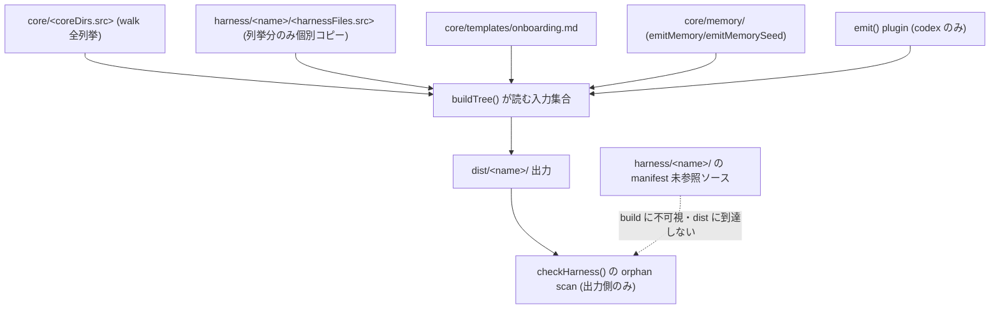
```mermaid
flowchart TD
  Core["core/&lt;coreDirs.src&gt; (walk 全列挙)"]
  HFiles["harness/&lt;name&gt;/&lt;harnessFiles.src&gt; (列挙分のみ個別コピー)"]
  Onb["core/templates/onboarding.md"]
  Mem["core/memory/ (emitMemory/emitMemorySeed)"]
  Emit["emit() plugin (codex のみ)"]
  Build["buildTree() が読む入力集合"]
  DistOut["dist/&lt;name&gt;/ 出力"]
  DistCheck["checkHarness() の orphan scan (出力側のみ)"]
  Unref["harness/&lt;name&gt;/ の manifest 未参照ソース"]

  Core --> Build
  HFiles --> Build
  Onb --> Build
  Mem --> Build
  Emit --> Build
  Build --> DistOut
  DistOut --> DistCheck
  Unref -. build に不可視・dist に到達しない .-> DistCheck
```

<!-- text fallback: buildTree (scripts/package.ts:307) が build の入力集合を確定する。(1) coreDirs の各 src を walk() で全列挙してコピー(L322-344)、(2) harnessFiles の各 src を「列挙された分だけ」個別コピー(L357-363、ディレクトリ全体は walk しない)、(3) onboarding skeleton をレンダリング(L370-376)、(4) core/memory/ を emitMemory/emitMemorySeed で emit(L382-395)、(5) codex のみ emit() プラグイン(L446-458)。checkHarness (L554) の orphan 検出はすべて「committed dist vs 再ビルド dist」の出力側で働く(harness-dir orphan L574-582、#711 で追加された dist 全域 orphan scan L605-628)。harness ソースは harnessFiles に列挙された src だけがコピーされるため、未列挙のソースファイルは build に一切読まれず dist にも現れず、出力側の orphan scan では検出不能。これが #735 の source 側 unreferenced 検査ギャップ。#737(#719)がこのギャップの実害例: kiro CLI harness に7個の .kiro.hook が manifest 未参照のまま残存していた。 -->

### build 入力集合の確定点(file:line)

| 入力 | 確定点 | 備考 |
| --- | --- | --- |
| core dirs(全列挙) | `buildTree` L322-344 `for (const { src, dst } of m.coreDirs)` → `walk(srcDir)` | core は dir 単位で全ファイル walk |
| harness authored files | `buildTree` L357-363 `for (const { src, dst, projectRoot } of m.harnessFiles)` | **列挙された src のみ**。未列挙ソースは不可視 |
| onboarding | `buildTree` L370-376 | skeleton からレンダリング |
| memory(method tree) | `buildTree` L382-383(`emitMemory`)/ L395(`emitMemorySeed`) | 出力は `<harnessDir>` 外 |
| emit プラグイン出力 | `buildTree` L446-458(codex のみ) | 出力パスを返し `--check` で byte-diff |
| **dist 出力側 orphan scan** | `checkHarness` L574-582(harness-dir)/ L605-628(dist 全域、#711) | source 側は検査対象外 |
| harness の発見 | `discoverHarnessNames` L68-73(`harness/*/manifest.ts` の存在で発見)/ CLI L660 | 1 manifest = 1 harness |

### dist 全域 orphan scan(#711、`37b295598`)

`checkHarness` の orphan scan は #711 で「ハードコードされた `[".agents","amadeus"]` ルート限定」から「`dist/<name>/` 全域 walk」へ拡張された(L605-628)。期待出力集合 = harness-dir subtree(L574-582 の pass で `authoredExempt` 込みで検査)+ 宣言済み projectRoot 出力(`harnessFiles`/`onboarding`)+ emit 出力集合(`committedEmitSet`)。これにより `dist/<name>/` 直下や未宣言サブディレクトリに残った stale ファイル(削除/改名された projectRoot 出力など)を検出できる。ただしこれは**出力側**の検査であり、source 側の未参照は依然として守備範囲外。

### 後続ステージ向け合成ビュー(#735 検査の設計空間)

以下は requirements/design が使う事実整理であり、**設計決定は含まない**(どの案を採るかは後続ステージの仕事)。3つの独立した設計軸がある。

**(a) 参照集合の導出点 — buildTree の実読み込み vs manifest 静的導出**

| 案 | 参照集合の作り方 | build 機構3種の扱い | トレードオフ |
| --- | --- | --- | --- |
| A: `buildTree` が実際に読んだ src を記録 | `buildTree`(L307-460)実行中に「コピー対象として列挙・消費した src」を集合化し、`harness/<name>/` の実ファイル walk との差集合を未参照とする | 記録集合に現れないため別途除外が必要 | build の実挙動と定義上一致。write/check の両経路で走る(下記 (c))。ただし `buildTree` に集合記録の副作用を足す侵襲がある |
| B: manifest から参照集合を静的導出 | `m.harnessFiles[].src` + `m.onboarding` + `emit` 宣言を静的に読み、実ファイル walk との差集合を取る | harnessFiles に無いので静的許可リストか import グラフ追跡で除外 | `buildTree` を触らず独立実装可能。ただし「buildTree が実際に読む集合」と manifest 記述が将来乖離すると検査自体がズレる |

事実(誤検出除外の設計根拠): 3種の build 機構ファイルは **harnessFiles に列挙されない(=dist へ非コピー)が、manifest.ts を起点とする import グラフからは到達可能** — `manifest.ts` は `package.ts` が `require()`(L514)、`onboarding.fills.ts` は各 `manifest.ts` が `import`(例 `harness/claude/manifest.ts:18`)、codex `emit.ts` は `package.ts` の `require()`(L651)+ `harness/codex/manifest.ts:19` の `import`。よって除外は「静的ファイル名許可リスト」でも「manifest.ts からの import グラフ追跡」でも実現でき、これ自体が (a) の派生選択肢になる。

**(b) 誤検出リスクの分類**

| 分類 | 例 | 検査上の位置づけ |
| --- | --- | --- |
| build 機構3種 | `manifest.ts` / `onboarding.fills.ts` / codex `emit.ts` | **正当に未参照**(dist 非コピーだが build が import で読む)。恒久的な除外対象 |
| 将来の authored 追加 | harnessFiles へ配線する前の新規ソース | **真の検出対象**(未配線=#735 が鳴らしたい状態)。ただし実装作業中は一時的偽陽性になりうる |
| harness dir 外の fixture/docs 類 | `harness/<name>/` の外(`tests/` 等) | **対象外**(検査範囲を harness-dir subtree に限れば自然に除外) |

**(c) 検査の発火点**

| 発火点 | 経路 | 特性 |
| --- | --- | --- |
| `checkHarness` 内に追加 | `--check`(= `dist:check`)経由でのみ発火(CLI L658/L673) | 既存 drift guard と同一ゲートに乗る。write 単独時は走らない |
| `buildTree` 内に追加 | write(L544)と check(L561)の両方が `buildTree` を呼ぶため常時発火 | 常に走る。ただし write 経路を検査ロジックで汚す |
| 独立サブコマンド新設 | 例 `package.ts --check-source`(新規) | 関心分離が明確。ただし CI/`package.json` script への配線を別途要する |

<!-- text fallback: #735 の検査には3つの独立設計軸がある。(a) 参照集合の導出点: 案A=buildTree が実際にコピー列挙した src を記録して実ファイル walk と差集合、案B=manifest の harnessFiles/onboarding/emit 宣言を静的に読んで差集合。build 機構3種(manifest.ts/onboarding.fills.ts/codex emit.ts)は harnessFiles 非列挙で dist へコピーされないが manifest.ts 起点の import グラフから到達可能(manifest.ts=package.ts が require L514、onboarding.fills.ts=各 manifest.ts が import、emit.ts=package.ts require L651 + codex manifest import)なので、除外は静的許可リストか import 追跡で実現でき、それ自体が派生選択肢。(b) 誤検出リスク3分類: build 機構3種=恒久除外、将来の未配線 authored ソース=真の検出対象(WIP 中は一時偽陽性)、harness dir 外の fixture/docs=検査範囲を harness-dir subtree に限れば対象外。(c) 発火点: checkHarness 内=dist:check 経由のみ(write では走らない)、buildTree 内=write(L544)/check(L561)両方が呼ぶので常時発火だが write を汚す、独立サブコマンド=関心分離だが CI 配線を別途要する。いずれの軸も設計決定は requirements/design ステージが行う。 -->

## 現在の全体構造

Amadeus は one-core-many-harnesses 型の architecture を維持している。`packages/framework/core/` と `packages/framework/harness/<name>/` が物理 source、`scripts/package.ts` が `dist/<name>/` を生成する。独立配布パッケージ `packages/setup/`(`@amadeus-dlc/setup`)は前々回 intent で完成済み。当該スキャン intent(260709-bug-zero-batch)はこの全体構造を変更せず、内部の6件の欠陥を修理する。以降の一連の bugfix intent(バッチ D 含む)もこの全体構造を変更しない。

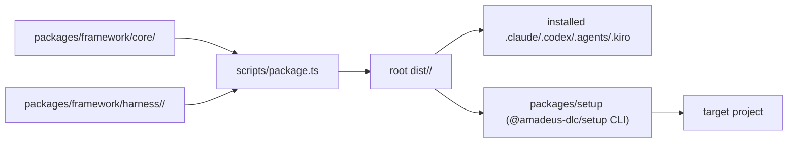
```mermaid
flowchart LR
  FrameworkCore["packages/framework/core/"]
  FrameworkHarness["packages/framework/harness/<name>/"]
  Packager["scripts/package.ts"]
  Dist["root dist/<name>/"]
  Runtime["installed .claude/.codex/.agents/.kiro"]
  Setup["packages/setup (@amadeus-dlc/setup CLI)"]
  TargetProj["target project"]

  FrameworkCore --> Packager
  FrameworkHarness --> Packager
  Packager --> Dist
  Dist --> Runtime
  Dist --> Setup
  Setup --> TargetProj
```

<!-- text fallback: packages/framework/{core,harness} が scripts/package.ts に取り込まれ root dist/<name>/ を生成する。dist はこのリポジトリの自己 install(Runtime)と、packages/setup の CLI が第三者プロジェクトへ配布する内容の両方の元になる。 -->

## 相互作用図 — 260709-gate-mechanics(前 intent、履歴)対象2バグの実装経路

## 差分リフレッシュ(260709-packaging-repair-batch、`a1c79dc12..22e3eb5aa`)

全体構造(one-core-many-harnesses、staged layout)は不変。当該 intent(260709-packaging-repair-batch)の2バグ(#701 `scripts/package.ts`、#702 `scripts/release-version-sync.ts`)は上図の `Packager --> Dist` 検査経路(#701)と `release.yml → after:bump → release-version-sync` バージョン同期経路(#702)に属する既存欠陥であり、この差分区間では両正本とも変更されていない。差分区間で観測されたアーキテクチャ関連の変化は以下。

- **コアツール6件(`packages/framework/core/tools/`、全 M)**: `amadeus-audit.ts`・`amadeus-bolt.ts`・`amadeus-lib.ts`・`amadeus-sensor-type-check.ts`・`amadeus-state.ts`・`amadeus-swarm.ts`。前 intent(bug-zero-batch)の修理に加え、(a) delegated-approval provenance の第一級化(human-presence gate 周辺、テスト `t112-delegated-approval`)、(b) `amadeus-sensor-type-check.ts` の tsc launcher 化(テスト `t202-sensor-type-check-tsc-launcher`)、(c) hook の project-dir/worktree marker 解決(テスト `t202-hook-project-dir-worktree-marker`)が反映されている。これらは `Packager --> Dist --> Runtime` 経路を通じて `dist/{claude,codex,kiro,kiro-ide}/` に再生成反映済み。
- **setup src 3件(`packages/setup/src/`、M)**: `ports/http.ts`・`internal/tar-archive-extractor.ts`・`domain/installation.ts`。`Dist --> Setup` とは独立した npm 配布経路(`@amadeus-dlc/setup`)に属し、`dist:check`/`promote:self:check` の対象外。
- **tests/ の hermeticity 再編(PR #703、class-B 14ファイル)+ test-size ドリフトガード新設**(`tests/lib/test-size.ts`、`tests/unit/t-test-size-drift.test.ts`): テスト資産の決定性を守る品質機構の追加であり、production tree のトポロジには影響しない。

## 相互作用図 — 修理対象6バグの実装経路

### #674 amadeus-swarm.ts finalize の merge-back 失敗と results/audit の分離

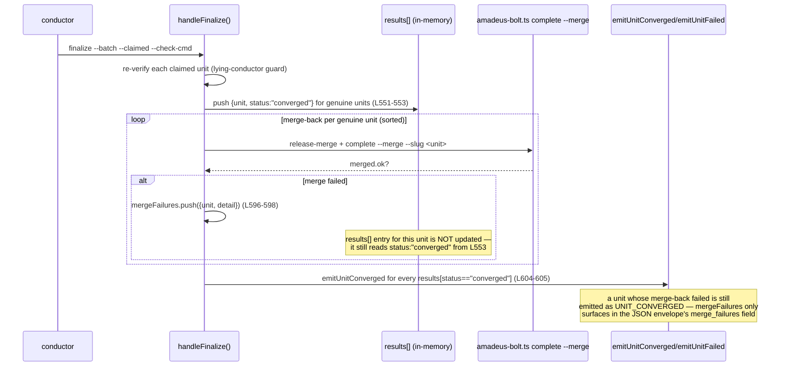
```mermaid
sequenceDiagram
  participant Conductor as conductor
  participant Finalize as handleFinalize()
  participant Results as results[] (in-memory)
  participant Bolt as amadeus-bolt.ts complete --merge
  participant Audit as emitUnitConverged/emitUnitFailed

  Conductor->>Finalize: finalize --batch --claimed --check-cmd
  Finalize->>Finalize: re-verify each claimed unit (lying-conductor guard)
  Finalize->>Results: push {unit, status:"converged"} for genuine units (L551-553)
  loop merge-back per genuine unit (sorted)
    Finalize->>Bolt: release-merge + complete --merge --slug <unit>
    Bolt-->>Finalize: merged.ok?
    alt merge failed
      Finalize->>Finalize: mergeFailures.push({unit, detail}) (L596-598)
      Note over Results: results[] entry for this unit is NOT updated —<br/>it still reads status:"converged" from L553
    end
  end
  Finalize->>Audit: emitUnitConverged for every results[status=="converged"] (L604-605)
  Note over Audit: a unit whose merge-back failed is still<br/>emitted as UNIT_CONVERGED — mergeFailures only<br/>surfaces in the JSON envelope's merge_failures field
```

<!-- text fallback: handleFinalize (amadeus-swarm.ts:484-631) builds `results[]` during the re-verify loop (L531-582), fixing each genuine unit's status to "converged" at L551-553. The merge-back loop (L588-599) runs afterward and only appends to a separate `mergeFailures` array (L596-598) on failure; it never mutates the corresponding `results` entry. The audit-emission loop (L603-610) iterates `results` alone, so a merge failure never demotes a unit to "failed" there, and `emitUnitConverged` (L605) still fires for it. `merge_failures` is exit-code-gated (L630: exit 2 if mergeFailures.length > 0) but the audit trail and per-unit `results` array both misreport the unit as converged. -->

### #675 amadeus-state.ts の approve/reject 非対称な human-presence guard

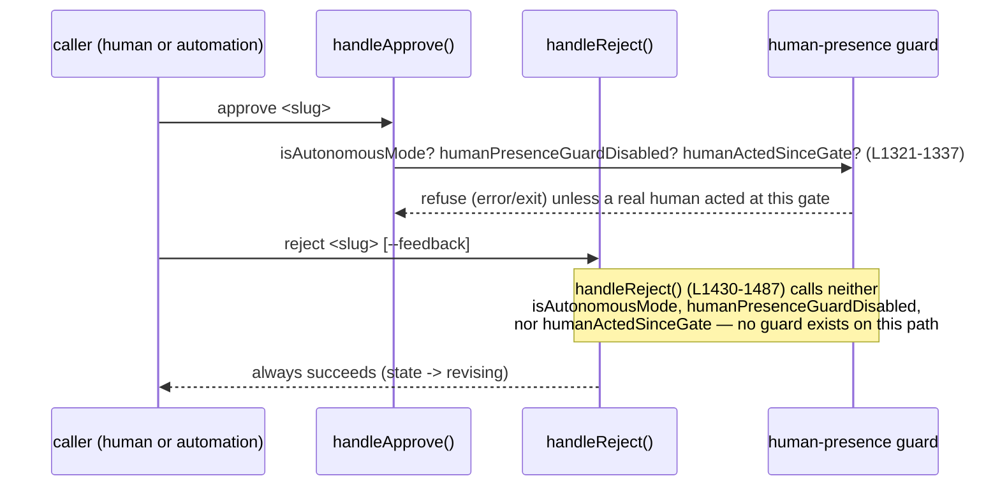
```mermaid
sequenceDiagram
  participant Caller as caller (human or automation)
  participant Approve as handleApprove()
  participant Reject as handleReject()
  participant Guard as human-presence guard

  Caller->>Approve: approve <slug>
  Approve->>Guard: isAutonomousMode? humanPresenceGuardDisabled? humanActedSinceGate? (L1321-1337)
  Guard-->>Approve: refuse (error/exit) unless a real human acted at this gate
  Caller->>Reject: reject <slug> [--feedback]
  Note over Reject,Guard: handleReject() (L1430-1487) calls neither<br/>isAutonomousMode, humanPresenceGuardDisabled,<br/>nor humanActedSinceGate — no guard exists on this path
  Reject-->>Caller: always succeeds (state -> revising)
```

<!-- text fallback: handleApprove (amadeus-state.ts:1286-1379) gates the [x] transition behind isAutonomousMode(content) / humanPresenceGuardDisabled() / humanActedSinceGate(pd) at L1321-1337, refusing via error() when no real human acted at the gate since it opened. handleReject (amadeus-state.ts:1430-1487) performs validateSlugInState, increments Revision Count, and writes STATE_REVISING without calling any of those three guard functions — confirmed by grep: none of isAutonomousMode/humanPresenceGuardDisabled/humanActedSinceGate appear between L1430 and L1487. Anything (or anyone) that can invoke `amadeus-state.ts reject <slug>` can force a stage back into "revising" state with no human-presence check at all. -->

### #676 amadeus-bolt.ts start --worktree と auditFilePath の bare fallback

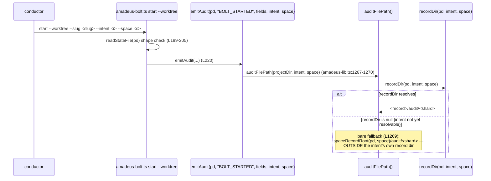
```mermaid
sequenceDiagram
  participant Conductor as conductor
  participant Start as amadeus-bolt.ts start --worktree
  participant EmitAudit as emitAudit(pd, "BOLT_STARTED", fields, intent, space)
  participant AuditPath as auditFilePath()
  participant RecordDir as recordDir(pd, intent, space)

  Conductor->>Start: start --worktree --slug <slug> --intent <i> --space <s>
  Start->>Start: readStateFile(pd) shape check (L199-205)
  Start->>EmitAudit: emitAudit(...) (L220)
  EmitAudit->>AuditPath: auditFilePath(projectDir, intent, space) (amadeus-lib.ts:1267-1270)
  AuditPath->>RecordDir: recordDir(pd, intent, space)
  alt recordDir resolves
    RecordDir-->>AuditPath: <record>/audit/<shard>
  else recordDir is null (intent not yet resolvable)
    Note over AuditPath: bare fallback (L1269):<br/>spaceRecordRoot(pd, space)/audit/<shard> —<br/>OUTSIDE the intent's own record dir
  end
```

<!-- text fallback: amadeus-bolt.ts start (L196-220) validates the state file shape only when --worktree is set (L199-205), then emits BOLT_STARTED via emitAudit(pd, "BOLT_STARTED", fields, flags.intent, flags.space) at L220. emitAudit resolves its write target through auditFilePath (amadeus-lib.ts:1267-1270), which itself calls recordDir(projectDir, intent, space). When recordDir returns null — e.g. the intent named by flags.intent has not yet been created, or resolution is ambiguous — auditFilePath falls back at L1269 to `spaceRecordRoot(projectDir, space)/audit/<shard>`, a location outside any specific intent's record dir. Because intent-scoped readers only glob `<record>/audit/*.md`, a BOLT_STARTED written to the bare space-level fallback is invisible to them. -->

### #677 packages/setup/src/ports/http.ts getJson の json() 未保護

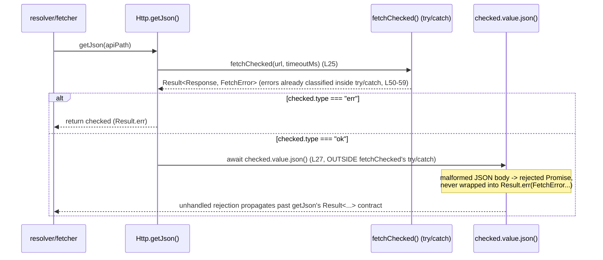
```mermaid
sequenceDiagram
  participant Caller as resolver/fetcher
  participant GetJson as Http.getJson()
  participant FetchChecked as fetchChecked() (try/catch)
  participant Body as checked.value.json()

  Caller->>GetJson: getJson(apiPath)
  GetJson->>FetchChecked: fetchChecked(url, timeoutMs) (L25)
  FetchChecked-->>GetJson: Result<Response, FetchError> (errors already classified inside try/catch, L50-59)
  alt checked.type === "err"
    GetJson-->>Caller: return checked (Result.err)
  else checked.type === "ok"
    GetJson->>Body: await checked.value.json() (L27, OUTSIDE fetchChecked's try/catch)
    Note over Body: malformed JSON body -> rejected Promise,<br/>never wrapped into Result.err(FetchError...)
    Body-->>Caller: unhandled rejection propagates past getJson's Result<...> contract
  end
```

<!-- text fallback: getJson (ports/http.ts:23-28) awaits fetchChecked(url, options.apiTimeoutMs) at L25, which returns a Result already narrowed by its own try/catch (fetchChecked body, L46-59). On the ok branch, getJson immediately does `return Result.ok(await checked.value.json())` at L27 — this second await sits inside getJson's own function body, past fetchChecked's try/catch boundary, and has no try/catch of its own. A 200 response with an invalid JSON body throws inside `.json()`, and that rejection is not caught anywhere in getJson, breaking the Http port's stated contract (`Promise<Result<unknown, FetchError>>`, L10) that every path should resolve to a Result rather than reject. -->

### #678 packages/setup/src/internal/tar-archive-extractor.ts の PAX/GNU longname 状態

```mermaid
sequenceDiagram
  participant Gunzip as gunzip stream (async iterator)
  participant Extract as extractTarGz() outer loop
  participant Drain as drain(final) (closure over carry/pendingLongName/current)
  participant State as pendingLongName / current (module-local closure vars)

  Gunzip->>Extract: chunk 1
  Extract->>Drain: drain(false)
  Drain->>State: parse PAX ('x') or GNU ('L') header, set pendingLongName (L103, L113)
  Note over State: pendingLongName persists across drain() calls<br/>because it is a closure variable, not re-initialised per chunk
  Gunzip->>Extract: chunk 2 (arrives in a LATER for-await iteration)
  Extract->>Drain: drain(false)
  Drain->>State: consume pendingLongName as rawName (L118), reset to null (L119)
  Note over Drain,State: the design relies on carry (Buffer) also spanning chunks (L43: Buffer.concat) —<br/>chunk-boundary loss would only occur if `carry`/`pendingLongName` were re-created per chunk,<br/>which they are not; verification of actual runtime behavior is deferred to code-generation/build-and-test
```

<!-- text fallback: extractTarGz (tar-archive-extractor.ts:33-148) declares `carry`, `pendingLongName`, and `current` (L36-38) OUTSIDE the `for await (const chunk of gunzip)` loop (L41), and `drain()` is an inner function closing over those same three variables. Each incoming chunk is concatenated into `carry` (L43) before drain() runs, and drain() only clears `pendingLongName` once it is actually consumed by a following non-PAX/non-GNU header (L118-119). This means the state that survives a chunk boundary is `carry` and `pendingLongName` together — as coded, they are not reset per chunk. The reported risk (a PAX/GNU header split across two `chunk`s, or a long-name header in one chunk and its associated file-entry header in a later chunk) needs an actual failing-input reproduction to confirm whether the current code handles it correctly or not; this scan confirms the mechanism (module-local closure state, not a per-chunk-local buffer) but does not itself prove a defect. -->

## 相互作用図 — #668 codekb-path の `<repo>` セグメント導出

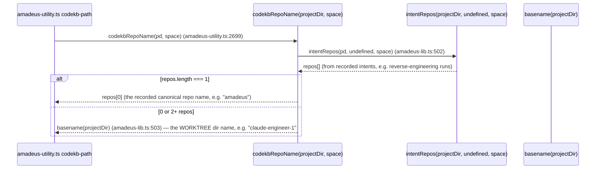
```mermaid
sequenceDiagram
  participant User as amadeus-utility.ts codekb-path
  participant RepoName as codekbRepoName(projectDir, space)
  participant IntentRepos as intentRepos(projectDir, undefined, space)
  participant Basename as basename(projectDir)

  User->>RepoName: codekbRepoName(pd, space) (amadeus-utility.ts:2699)
  RepoName->>IntentRepos: intentRepos(pd, undefined, space) (amadeus-lib.ts:502)
  IntentRepos-->>RepoName: repos[] (from recorded intents, e.g. reverse-engineering runs)
  alt repos.length === 1
    RepoName-->>User: repos[0] (the recorded canonical repo name, e.g. "amadeus")
  else 0 or 2+ repos
    RepoName-->>User: basename(projectDir) (amadeus-lib.ts:503) — the WORKTREE dir name, e.g. "claude-engineer-1"
  end
```

<!-- text fallback: codekbRepoName (amadeus-lib.ts:501-504) prefers the single recorded repo name from intentRepos, but falls back to `basename(projectDir)` whenever intentRepos returns anything other than exactly one entry — including the very first reverse-engineering run in a fresh worktree, before any repo name has been recorded. In a git worktree checkout, `projectDir`'s basename is the worktree directory name (e.g. `claude-engineer-1`, `claude-engineer-2`), not the underlying repository's name (e.g. `amadeus`). codekb-path (amadeus-utility.ts:2690-2699) calls codekbRepoName directly, so its printed `<repo>` segment — and therefore the codekb output directory this reverse-engineering stage writes to — is worktree-name-derived rather than repo-derived on the fallback path. This scan itself writes to `codekb/claude-engineer-1/`, which is direct, reproduced evidence of the fallback in effect. -->

## 修理時の波及範囲 — core→dist→self-install 同期義務の有無

6件のバグは物理的にどちらの source tree に属するかで、修理後に必須となる同期作業が異なる。冒頭の全体構造図のとおり `FrameworkCore --> Packager --> Dist --> Runtime` という経路と `Dist --> Setup` という経路は別の下流を持つため、修理の「正本」がどちらの側かで波及先が変わる。

| バグ | 正本ファイル | 属する tree | 修理後に必須の同期 |
| --- | --- | --- | --- |
| #674 | `packages/framework/core/tools/amadeus-swarm.ts` | `packages/framework/core/` | `bun scripts/package.ts`(全 harness の `dist/<name>/` 再生成)+ `bun run promote:self`(このリポジトリ自身の `.claude/`/`.codex/`/`.agents/` への反映)を同一コミットに含める(team.md Mandated) |
| #675 | `packages/framework/core/tools/amadeus-state.ts` | 同上 | 同上 |
| #676 | `packages/framework/core/tools/amadeus-bolt.ts` + `amadeus-lib.ts` | 同上 | 同上 |
| #668 | `packages/framework/core/tools/amadeus-lib.ts` + `amadeus-utility.ts` | 同上 | 同上 |
| #677 | `packages/setup/src/ports/http.ts` | `packages/setup/`(独立 npm パッケージ `@amadeus-dlc/setup`) | `dist:check`/`promote:self:check` の対象外。`packages/setup/dist/cli.js` を再ビルドしてから検証する(project.md 是正事項の stale-binary 回避)。バージョンバンプ・npm publish は release.yml の workflow_dispatch 一本のみ(当該 intent の PR ではバージョンに触れない) |
| #678 | `packages/setup/src/internal/tar-archive-extractor.ts` | 同上 | 同上 |

4件(#674/#675/#676/#668)は同じ `packages/framework/core/tools/` 配下に集中しており、`amadeus-lib.ts` を共有部品として跨いでいる(前掲の相互作用図参照)。これらは1つの construction Bolt にまとめて実装した場合、`bun scripts/package.ts` と `bun run promote:self` を4件分ではなく1回のパスで済ませられる — ただし個別 Bolt に分割する場合は、Bolt ごとに dist 再生成・self-install 反映を行わないと、直前の Bolt での修理が dist/self-install に反映されないまま次のバグ修理を評価してしまうリスクがある。

残り2件(#677/#678)は `packages/setup/` という別の配布経路(npm 単独 publish)に属し、`dist:check`/`promote:self:check` の対象ではない。この2件を同じ Bolt に混ぜて「4件の dist 再生成」と「2件の npm ビルド確認」を同時にチェックリスト化すると、どちらか一方の検証コマンドを取り違えて省略するリスクがあるため、Bolt 分割時にこの tree の境界を意識する価値がある(delivery-planning 引き継ぎ事項)。

## 正規化の影響(既存の判断の帰結)

architecture の骨格(one-core-many-harnesses、staged layout)自体は変更しない。修理は各コンポーネント内部の実装の是正であり、architecture decision を新たに要さない。#674 と #675 はいずれも `amadeus-state.ts`/`amadeus-swarm.ts` という同じ「監査/ゲートの正確性」を担うコンポーネント群にまたがる欠陥であり、修理方針を requirements-analysis で揃えて検討する価値がある。

---

## 差分リフレッシュ(`a1c79dc12..162553b99`、15コミット・227ファイル)で反映した構造変化

前回スキャン(bug-zero-batch、observed `a1c79dc12`)以降、当該 intent(integrity-batch)の焦点コードは未着手だが、周辺インフラに次の構造変化が入り、うち codekb 一本化は #707 の前提となる。

### codekb ストアの一本化(#693 の後始末)

`codekb/claude-leader/`(9ファイル)と `codekb/claude-engineer-1/`(9ファイル)が削除(D)され、`codekb/amadeus/` 単一ストアに集約された。`codekbRepoName`(`amadeus-lib.ts:556-565`)が origin remote 由来(`originRepoSlug`)に統一されたため、全 worktree/clone が同一 `codekb/amadeus/` を指す。これにより codekb は「per-worktree に分裂した複数ストア」から「origin リポジトリ単位の単一共有ストア」へ変わった。

この単一化は codekb-path の決定性(#668 修正の狙い)を達成する一方、**並行 intent が別ブランチから同一 `codekb/amadeus/` を書く新しい共有面**を生んだ。#707(単一 `reverse-engineering-timestamp.md` の base/observed 相互上書き)はこの共有面の一貫性欠如として顕在化する。

### テストピラミッド整備(#696 Phase A / #700)

`7da09f0c7` で derived-size classifier + drift guard が入り、`tests/` が 66ファイル規模で更新された。テスト層構造は `tests/run-tests.ts:31` の `Level = "smoke" | "unit" | "integration" | "e2e"` を軸に、`levelFiles`(L577-587)が各 Level ディレクトリ直下を tier discovery する構造。**この discovery が `tests/harness/` を含まないことが #705 の「ランナー管理外」の構造的根拠**(下記位置づけ参照)。

### ランナー計測ライフサイクルと #699 Phase D の結合点(dynamic-test-size intent)

#684 Phase D(#699「継続的動的計測」)が土台にする既存アーキテクチャを、現行 HEAD(`24197d755`)の実コードから確定した。テストサイズは3層構造で扱われている:

1. **静的分類層**(`tests/lib/test-size.ts`): `classifyTestSize(source)` が spawn/fs/net/timer API 参照を検出して `SizeClassification { size; signals }`(`:42-45`)を返す Phase A の静的プロキシ。**出力形状は後方安定契約**(`:10-14` が「Phase D layers dynamic observation on top; output shape stays stable」と明言)であり、#699 の動的観測はこの形状を壊さず"重ねる"。
2. **per-file 実行・計測層**(`tests/run-tests.ts`): 1ファイル=1子プロセス(`runBunTestFile` `:685-797`)で `Date.now()` 差分(`:724`/`:762`)と JUnit root `time`(`bun-junit-to-meta.ts:182`、bun 1.2.22 で唯一実 wall-clock を持つ属性)を計測し `.meta`(6行、DURATION フィールド有り)へ書く。**ただし `aggregateTierResults` `:430` が集約後に全 `.meta` を `rmSync` 削除し、非 verbose では `logDir` 一時ディレクトリごと消える** → duration の永続化経路が現状不在。これが #699 が新規永続化を要する構造的理由。
3. **静的レポート層**(`printSizeMatrix` `:895-948`): ディスク走査 → `classifyTestSize` の scope×size マトリクスを出力。**duration 非消費**・`try/catch` で exit-code から隔離(`:882-886`)= t112 の「exit == failed-FILE 数」不変条件を守る。#699 の動的計測を SUMMARY に足す際も同じ隔離が必須。

**アーキテクチャ制約**: run-tests.ts が新たに static import するモジュールは t112(`t112.serial.test.ts:91-94`、`REAL_SIZE` `:52` パターン)の scratch runner copy リストへ伝播必須。coverage registry(`gen-coverage-registry.ts`)は `covers:` join 軸で size/duration と直交するため、#699 のレジストリ化は既存機構への相乗りではなく別アーティファクト新設が現実的。CI は `ubuntu-latest`(`ci.yml:22`)確定で coverage artifact upload(`:75-84`)は既存だが size/duration 専用 artifact は未設置。詳細な file:line は code-quality-assessment.md「dynamic-test-size(intent、履歴)の観測面」節を参照。

### class-B テストの standalone-green 化(#698 / #703)

`611dd1ef8` で class-B テストが standalone で緑になるよう整備された。#705 の `tests/harness/sdk-drive.calibration.test.ts` はこの整備対象と隣接するが、依然として tier discovery の外に置かれている。

## 委任 presence 機構の verb-scoped 構造(#685 実装後 / delegate-answer-consume intent)

差分区間 `24197d755..5e9040cda` の実体は #685(verb-scoped provenance + `DELEGATED_REJECTION`)であり、委任 presence 機構が verb スコープ化された現状構造を現行 HEAD(`5e9040cda`)の実コードから確定した。委任経路は「発行側(リーダー ledger 検査)」と「消費側(conductor gate 判定)」の2面を持ち、両者が共通の `humanActedSinceGate` 述語を使う:

1. **境界述語**(`amadeus-lib.ts` `humanActedSinceGate`、`:1507-1546`): resolution 境界集合 `GATE_RESOLUTION_EVENTS = {GATE_APPROVED, GATE_REJECTED, QUESTION_ANSWERED}`(`:1506`)と human 行為(`HUMAN_TURN` および検証済み委任)を時系列比較し `lastHuman > lastResolution` を返す。委任は verb でスコープされ、`DELEGATED_APPROVAL` は approve verb・`DELEGATED_REJECTION` は reject verb のときだけ `verifyDelegatedProvenance`(`:1585-1611`、両 verb 共用の grounding 真正性検証子)で human として数える(`:1519-1524`)。**verb スコープは委任 type にのみ効き、QUESTION_ANSWERED には直交する**。
2. **消費側(conductor gate)**: `assertHumanPresentForGateResolution`(`amadeus-state.ts:1446-1471`)が approve/reject 双方から呼ばれ、**verb を forward**(`:1456` `humanActedSinceGate(pd, verb)`)。DELEGATED_APPROVAL は approve gate のみ、DELEGATED_REJECTION は reject gate のみを開ける(#685 で approve/reject のドリフト解消)。
3. **発行側(リーダー ledger)**: `handleDelegateApproval`(`amadeus-state.ts:1607-1689`)と `handleDelegateRejection`(`:1701-`)がミラー構造で、issuer 座標(space/intent/shard + 最新 HUMAN_TURN の timestamp)を組んで TARGET intent の audit dir へ委任イベントを append する。両者の grounding gate は **verb 無し** `humanActedSinceGate(pd)`(`:1625` / `:1719`)でリーダー自身の ledger を検査する。

**アーキテクチャ上の非対称**: 消費側(2)は verb-scoped だが発行側(3)は verb 無し。この非対称と QUESTION_ANSWERED の resolution 境界性(1)が交差する点が #736 の機構 — 発行側の verb 無し検査が interview 応答の QUESTION_ANSWERED に先食いされる。詳細な file:line と修理方向は code-quality-assessment.md「delegate-answer-consume intent(260710、#736)の観測面」節を参照。audit event の正本レジストリは `packages/framework/core/knowledge/amadeus-shared/audit-format.md`(DELEGATED_APPROVAL `:78` / DELEGATED_REJECTION `:79`)、`t28-audit-event-sync` が2ファイル間 taxonomy sync を強制する。

## 機械注入ターン分類カタログの非共有(#755 / mint-presence-vectors intent)

human-presence 判定に関わる「機械注入ターンの分類」ロジックは 2 箇所に分散し、注入シグネチャのカタログが共有されていない構造事実がある(現行 HEAD `fc5a34cf1` 直読で確定):

- **mint hook**(`amadeus-mint-presence.ts` `isMachineInjectedTurn` `:51-66`): `prompt.startsWith("<task-notification>")`(prefix `:47`、判定 `:62`)の**単一プレフィックス**のみを抑止シグネチャに持つ。teammate-message(`Another Claude session sent a message:` 開頭、形式 D)は一致せず素通りして `HUMAN_TURN` を鋳造する。
- **stop.ts tier-3**(`amadeus-stop.ts` `transcriptIsConversational` `:581-737`): 除外ヘルパ `isInjectedHookFeedback`(`:568-`)は `"Stop hook feedback:"` の自己注入のみを弾き、注入 marker チェックを**一切持たない**。形式 A(task-notification)・D(teammate-message)の双方を「genuine human prompt」に採用する(`:721-728`)。

両者は「注入ターンを人間ターンと誤認する」同根の欠陥で、抑止カタログ(最低でも task-notification と teammate-message)を共有する単一ソースが存在しない。mint 側が消費される gate 経路(`humanActedSinceGate` `:1544` → `assertHumanPresentForGateResolution` `amadeus-state.ts:1456`、および #671 委任 provenance grounding `:1645`)への波及を含む詳細な file:line と修理方向は code-quality-assessment.md「mint-presence-vectors の観測面(前 intent、履歴)」節を参照。

## 4バグ焦点領域のアーキテクチャ上の位置づけ

| バグ | 焦点領域(アーキテクチャ層) | 正本ファイル | 前提機構 |
| --- | --- | --- | --- |
| #708 | **presence 機構**(hook → audit → gate 判定) | `packages/framework/core/hooks/amadeus-mint-presence.ts`(mint)+ `amadeus-lib.ts` `humanActedSinceGate`/`verifyDelegatedApproval`(gate) | #671 delegate provenance(`1289608c6`) |
| #707 | **codekb 永続化**(単一共有ストアの並行書き込み) | `.claude/amadeus-common/stages/inception/reverse-engineering.md` + `amadeus-lib.ts` `codekbRepoName` | #693 origin 由来 repo 名(`909e590d4`) |
| #705 | **テストハーネス**(tier discovery / substrate skip / trust anchor) | `tests/harness/sdk-drive.calibration.test.ts` + `tests/run-tests.ts` + `amadeus-utility.ts`(doctor) | #696/#700 pyramid 整備 |
| #706 | **knowledge 配布**(agent ロードパスと tree 外参照) | `packages/framework/core/knowledge/amadeus-delivery-agent/workflow-planning-guide.md` | core→dist→self-install 伝播 |

#708 と #705 は「検証機構の正しさ」(偽陽性ゲート / trust anchor drift)、#707 と #706 は「共有ストア/参照の一貫性」に分類できる。詳細な file:line と修理方向は code-quality-assessment.md「既知の欠陥 — integrity-batch(intent 260709-integrity-batch、履歴)」節を参照。

## §13 learnings persist 判定マトリクスと audit 整合(intent 260710-learnings-audit-batch、#754 / #745)

`amadeus-learnings.ts` の `handlePersist`(`:411-608`)は §13 learnings ritual の決定論的 WRITER で、`withAuditLock` の**単一ボディ内**(`:429-577`)で「method file への practice 行追記」と「RULE_LEARNED audit 行の emit」を行う。#754 と #745 は**この同じ dedup 判定マトリクスの2つの穴**であり、共通根は「重複判定の入力が実装の書き込みと乖離している」ことにある。

### dedup 判定の2入力(実データフロー)

selection ごとに2つの真偽値で書き込み/emit を決める(`:474-504`):

- **`hasRow`** = `priorAuditRow(auditContent, "RULE_LEARNED", stageSlug, sel.candidate_id)`(`:474`)。`auditContent` は**ロック取得直後に1回だけ読んだ静的スナップショット**(`:431`)。`priorAuditRow`(`:348-358`)は audit 行を `(Stage, Candidate-ID)` の2フィールドのみで照合し、**Destination(scope / heading)は見ない**。ループ内の `appendAuditEntryUnlocked`(`:492`)がディスクへ行を書いても、この `auditContent` スナップショットは**再読込されない**。
- **`hasLine`** = `content.includes(marker)`(`:475`)。`marker` = `cidMarker(stageSlug, candidate_id)` = `<!-- cid:<slug>:<cid> -->`(`:407-409`)。`content` は宛先 method file ごとに `ensureFile` が返す**その file の累積内容**(`fileContent` Map、`:449-461`)。同一 file への先行 selection の書き込みは反映されるが、**別 file への書き込みは反映されない**。

### 真理値表(1 selection あたり、`:478-504`)

| `hasRow`(静的 snapshot) | `hasLine`(file 累積) | 実行される動作 | 整合性 |
| --- | --- | --- | --- |
| T | T | no-op(`continue`、`:478`) | ✅ 正 |
| T | F | 行のみ書き込み(recovery: 行欠落を補完)、emit なし | ✅ 正 |
| F | F | 行書き込み + RULE_LEARNED emit(fresh) | ✅ 正 |
| **F** | **T** | **行書き込みスキップ(`if (!hasLine)` `:483`)+ RULE_LEARNED emit(`if (!hasRow)` `:491`)** | ❌ **#754 の穴** — audit 行のみ増え、対応する新規 practice 行がない(row/line 不一致) |

### #754 の穴(同一 file・cid 衝突 → 書き込みスキップ + emit)

同一 persist 呼び出し内で**同じ `candidate_id` かつ同じ scope(= 同じ method file)**を持つ2 selection、または既存の practice 行と cid が衝突する selection では、2番目の `hasLine=T`(marker が既にその file に存在)で行書き込みが `if (!hasLine)` によりスキップされる一方、`hasRow` は静的スナップショット由来で `F` のままなので **RULE_LEARNED を emit する**。結果、cid が指すテキストは最初の1行しか残らないのに audit 行だけが増える(#754「cid 衝突で書き込みスキップ + RULE_LEARNED emit」)。

### #745 の穴(別 file・同一 cid → 二重 emit)

同一 cid を**異なる scope(project と team = 別 file)**へ振り分けた2 selection では:

1. Selection A(`scope=project`): `hasRow=F`(snapshot)、`hasLine=F`(project file に marker なし)→ project へ行書き込み + emit。`auditContent` は更新されない。
2. Selection B(`scope=team`、同一 cid): `hasRow=F`(snapshot は依然 A の emit を見ない)、`hasLine=F`(team file は別 file で A の marker を持たない)→ team へ行書き込み + **再び emit**。

同一 `(Stage, Candidate-ID)` に対し RULE_LEARNED が**2行** emit される(#745「複数 destination への同一 cid で二重 emit」)。`hasLine` は per-file なので cross-file の cid 再利用を捕捉できず、静的スナップショットも同一ループ内の先行 emit を捕捉できないため、両盲点が重なる。

**共通根**: `auditContent` が `:431` の静的スナップショットのまま(in-loop emit で更新されない)+ `priorAuditRow` が Destination を無視する + `hasLine` が per-file。フラッシュは全 selection 処理後に file ごと1回 `writeFileAtomic`(`:508-511`)。要求で凍結すべき不変条件は「1 (Stage, Candidate-ID) につき RULE_LEARNED は最大1行、かつ audit 行があれば必ず対応する practice 行が存在する」。

### テスト面(現状カバレッジと欠落)

- `tests/integration/t99-learnings-gate-flow.test.ts`: surface→persist ラウンドトリップを実 CLI で駆動。Case 1 は project + team の**異なる cid**(`cid:user-stories:c1` / `c2`)で2 RULE_LEARNED を pin(`:294-323`)、Case 5 は**逐次 concurrent persist が直列化して1行1行**(同一 selection の再実行)を pin。**同一 cid を複数 destination へ振る #745 / cid 衝突 #754 の経路は未カバー**。
- `tests/unit/t112-learnings-distribution-guard.test.ts`: sensor manifest の framework-distribution guard のみ(`isFrameworkDistributionPath`)。learnings dedup 判定は非対象。

## runtime learnings 集計の窓(per-unit、intent 260710-learnings-audit-batch、#761)

`amadeus-runtime.ts` の `learnings_captured` は compile が runtime-graph.json に materialise し、summary(session-cost / replay / outcomes-pack)が集計消費する(`:974-976`)。#761 は **per-unit(instance-bearing)construction stage の `learnings_captured` が常に `{0,0}` になる**欠陥で、根は集計窓の終端時刻の取得経路にある。

### 親 stage `completed_at` の3段データフロー(実測)

1. **rollup**(`:364-386`): stage 行を作り `completed_at = entry.completed_at`(`pairStartedCompleted` が返す親 slug の **STAGE_COMPLETED タイムスタンプ**)。`learnings_captured` は `approved ? {0,0} : null`(`:382-385`)。
2. **BoltInstance populator**(`:461-560`): construction phase かつ window 内に STATE_FORKED の distinct slug が **≥2** ある stage で、親行の `started_at` / **`completed_at` を `null` に上書き**(`:550-551`)。`learnings_captured` は `parentOutcome !== "approved"` のときだけ null 化(`:556-558`)、approved のときは `{0,0}` のまま残る。**この時点で親の STAGE_COMPLETED 時刻は行から失われ、`RuntimeStage` スキーマ上どこにも保存されない**(`:83-105` のスキーマに保持フィールドなし)。
3. **sensor_firings + learnings populator**(`:702-755`):
   - **instance-bearing 分岐**(`:703-739`): `parentStart` = 最早 instance の `started_at`、`parentEnd` = 最遅 instance の `completed_at`(全 open なら null)を**sensor_firings 用にのみ**算出(`:717-738`)。`learnings_captured` は **`countLearnings` で再計算されず**、「rollup が残したまま」= approved 親では `{0,0}` 固定(`:739` のコメントが明示)。→ **per-unit stage は実際に RULE_LEARNED 行があっても learnings を数えない(#761)**。
   - **single-instance 分岐**(`:740-753`): approved なら `learnings_captured = countLearnings(slug, started_at, completed_at)`(`:747-752`)。窓 = `[started_at, completed_at)`(`completed_at` = STAGE_COMPLETED)。

### `countLearnings` の窓境界(`:684-700`)

`ev.timestamp < windowStart` を除外(`:692`)、`windowEnd !== null && ev.timestamp >= windowEnd` を除外(`:693`)。すなわち**窓終端は半開区間の上限**で、`windowEnd` に該当時刻以降の RULE_LEARNED は集計から落ちる。

### e6 レビュー訂正の妥当性(親 STAGE_COMPLETED or null が正、parentEnd は誤り)

per-unit stage の §13 learnings ritual は**親 stage の承認ゲート**(全 Bolt マージ後、親 slug に STAGE_COMPLETED が付く時点)で走り、RULE_LEARNED 行は `Stage=<親 slug>` で **STAGE_COMPLETED 近傍**にタイムスタンプされる。これは最後の STATE_MERGED(= `parentEnd`)より**後**。よって窓終端を `parentEnd`(instance 由来)にすると、ゲート承認時に emit された RULE_LEARNED が `ev.timestamp >= windowEnd` で**全て除外**され、集計は 0 のまま是正されない。したがって e6 訂正のとおり**窓終端は親 stage の STAGE_COMPLETED 時刻(まだ mid-flight なら null = open)**が正しい。

**実装上の含意(要求へ引き継ぐ)**: 正しい窓終端(親 STAGE_COMPLETED)は現状 `:551` で `null` 上書きされ**行に残らない**。`maxInstanceCompletedAt`(`:1034-1043`、summarize が `:978` で使用)は instances の `completed_at` 最大値を返す = **parentEnd と同じく instance 由来**(開区間の扱いだけ差がある — parentEnd は `anyOpen` で null、maxInstanceCompletedAt は open を無視して最大値を返す)。どちらもゲート承認時刻ではなく instance 完了時刻なので、e6 が誤りと断じたソースと同型であり、#761 修理でこれを窓終端に流用してはならない。親 STAGE_COMPLETED は現状 `pairStartedCompleted` の `entry.completed_at`(`slugsByStartTime`)にのみ存在し、null 上書き前に別途保持するか行スキーマに保存フィールドを足す必要がある。

## 修理の設計空間(要求へ引き継ぐ・事実ベース、決定は requirements/選挙で行う)

> 本節は Architect 合成の観測事実のみ。**どの案を採るかは決めない** — 各軸の選択肢・トレードオフ・実測制約を列挙し、requirements の選挙質問の種を確定するためのもの。

### 軸1 — #754/#745: 同一実行内の emit 追跡(`hasRow` の盲点の閉じ方)

共通根は「`auditContent` が `:431` の静的スナップショットのまま in-loop emit を見ない」+「`priorAuditRow` が Destination を無視」+「`hasLine` が per-file」。追跡方式の観測される選択肢は2系統:

- **(A-1) in-memory Set で実行内 emit を追跡** — ループ手前で `emittedThisRun = new Set<string>()` を用意し、emit 時に dedup キーを add、判定を `hasRow || emittedThisRun.has(key)` に拡張する。コスト事実: Set 参照は O(1)、ロック保持時間への追加負荷は無視可能。`withAuditLock` は既に**単一ボディ**(`:429-577`)なので実行内 emit は必ず同一ロック内で観測でき、追加の再読込 I/O は発生しない。
- **(A-2) 各 selection の後に `auditContent` を再読込** — `appendAuditEntryUnlocked`(`:492`)の直後に `readAllAuditShards`(`amadeus-lib.ts:1763`)を呼び直してスナップショットを更新する。コスト事実: `readAllAuditShards` は**全 per-clone シャードを毎回 `readFileSync`** する(`:1767-1773`)ため、selection 数 × シャード数の再読込を**ロック内**で行う。共通ケースはシャード1枚だが、監査肥大時はロック保持時間が selection 数に比例して伸びる。A-1 と同じ整合を得るのに I/O コストだけ高い。

いずれの方式でも「dedup キーに何を含めるか」は軸2で決まる(Set のキー / 再読込後の照合キーが同一問題)。

### 軸2 — dedup キーへの Destination 組込みの意味論(cid の粒度)

現行キーは `(Stage, Candidate-ID)` の2フィールドのみ(`priorAuditRow` `:355-357`、Destination 非参照)。**「1学習 = 1 cid」か「1学習 × 宛先 = 1行」か**は、live method ファイルの cid 運用実態から観察できる:

- **観測: live corpus では 1 cid marker = 1 method file = 1 行**。`org.md` に marker 0、`team.md` に 51、`project.md` に 26。**同一 cid marker が2つの異なる method ファイルに現れる例は皆無**(cross-file 重複 grep = 0)。同一ファイル内の marker 重複も皆無(`team.md` の見かけ上の `cid:code-generation:c2` 2件は、片方が別ルール本文中の**散文クロス参照** `(cid:code-generation:c2)` であり marker ではない)。
- **観測: 汎用連番 cid(`c1`/`c6` 等)は intent をまたいで再利用される**が、`priorAuditRow` が読む `readAllAuditShards` は **active-intent の record 配下のシャードのみ**(`auditShards(projectDir, intent, space)` `:1764`)を対象とするため、cid の一意性スコープは**アクティブ intent の record 単位**。よって過去 intent での `requirements-analysis:c1` 再利用は現行判定に衝突しない。
- **発火証跡の実測(結論: 静的経路のみ確定、実発火は非確定)**: 全 intent record の RULE_LEARNED 68 行を走査。#745 のシグネチャ(単一 persist 呼び出しで同一 (Stage,Candidate-ID) を2宛先へ二重 emit)は**検出されず** — 見つかった (Stage,cid) 重複ペア(`requirements-analysis:c1`、`code-generation:c6`)はいずれも**別 record・別 clone**(engineer-2 / installer-distribution / engineer-3 の team.md・project.md)由来の正規な再利用で、単一呼び出しの二重 emit ではない。#754 のシグネチャ(audit 行に対応する marker が Destination file に不在)の走査は**確定判定不能** — audit の Destination は**他 clone の record 絶対パス**(claude-leader 等)を指し、かつ 2026-07-09 のノルム整理が live marker を audit と独立に書き換えているため、cross-record の marker 照合は本バグ由来の欠落と手動整理由来の乖離を区別できない。したがって「アクティブ intent の record 単位」では #745/#754 の実発火は**未確認**であり、修理の根拠は**静的コード経路**(真理値表の `F×T` セル、cross-file `hasLine` 盲点)に置く。
- **含意(決定せず提示)**: 「1学習 = 1 cid」を不変条件とするなら dedup キーは現行の `(Stage, Candidate-ID)` のままでよく、#745 の cross-file 二重 emit は**「同一 cid を2宛先へ振ること自体を禁止/是正」**する方向になる。「1学習 × 宛先 = 1行」を許すなら dedup キーに Destination(scope/heading)を**加える**方向になり、`priorAuditRow` と `hasLine` の両方を宛先込みキーへ揃える必要がある。両者は #745 の望ましい振る舞い(1宛先へ畳むのか、複数宛先を正規に許すのか)を分岐させる。

### 軸3 — #754 衝突時の挙動(cid 衝突で `hasLine=T` ∧ `hasRow=F` に至った場合)

真理値表の `F×T` セル(`:354`)に落ちたとき、現状は「行スキップ + emit」で row/line 不一致を作る。是正方向の選択肢(観測されるもの、決定せず):

- **(C-1) エラー化** — 同一 record 内で同一 cid が別テキスト/別宛先に衝突したら persist を fail させ、orchestrator に cid の振り直しを要求する。`handlePersist` は既に fail 経路(`:585` 系)を持つ。
- **(C-2) 一意 cid 強制** — 衝突検知時に cid を自動サフィックスして一意化し、行と audit を新規 cid で揃える。live の doubled-slug 形(`cid:code-generation:code-generation:bolt-pr-taskization`)が示すとおり cid 文字列は任意長セグメントを許容するため、サフィックス付与はフォーマット上可能。
- **(C-3) emit を書込に従属させる** — emit 条件を `!hasRow` から **「今回この行を実際に書いた場合のみ」**(= `wrote && !hasRow`)へ変更し、`hasLine=T` でスキップした selection は emit しない。row/line 不一致は原理的に消えるが、「既存行に対応する audit 行が欠落しているケースの recovery」(現行の `T×F` セル `:352`)との相互作用を要求で確認する必要がある。

3案は「衝突を異常として弾く(C-1)/一意化して両方残す(C-2)/emit を書込に一致させる(C-3)」で不変条件の表現が異なる。凍結すべき不変条件は共通: **「1 (record, Stage, Candidate-ID) につき RULE_LEARNED は最大1行、かつ audit 行があれば必ず対応する practice 行が存在する」**。

### 軸4 — #761: 親 STAGE_COMPLETED の保持方法とスキーマ波及

窓終端(親 STAGE_COMPLETED)を instance-bearing 分岐に届ける手段の選択肢:

- **(D-1) null 上書き前にローカル変数へ退避** — `:551` の `stage.completed_at = null` の**前**に親の `entry.completed_at` を別変数(またはローカル Map)へ退避し、`:702-739` の instance-bearing 分岐で `countLearnings(slug, parentStart?, savedParentCompletedAt)` に渡す。**`RuntimeStage` スキーマ不変** → **docs への波及なし**。窓始端をどう採るか(親 started_at も `:550` で null 化済み)は別途要確認だが、`countLearnings` の窓始端は「その stage 最初の instance start」= `parentStart`(`:717-719`)で足りる(§13 emit は STAGE_COMPLETED 近傍なので始端の緩さは無害)。
- **(D-2) `RuntimeStage` にフィールド追加** — 例 `parent_completed_at: string | null` を足して `:375` で設定・`:551` で温存し、populator と summarize が読む。**スキーマ変更は `docs/reference/13-runtime-graph.md` と `13-runtime-graph.ja.md` の `interface RuntimeStage` 定義(英 `:55-74` / ja `:39-58`)へ波及する**(両ファイルがスキーマをフィールド単位で pin している — 実測確認済み)。runtime-graph.json はバイト等価性契約(doc `:144` 系)を持つため、フィールド追加は既存スナップショットの再 compile 差分も生む。

**付随観測(doc 約束との齟齬)**: 現行 doc は `learnings_captured` を「null on pending rows; **populated on transition to approved**」と記す(英 `:70` / ja `:54`)。しかし instance-bearing の**approved 親**は `{0,0}` に固定される(#761)ため、doc の約束と実挙動が既に乖離している。#761 修理が「approved 親でも実カウントする」挙動を回復するなら doc 文言は追随可能だが、D-1/D-2 いずれを採っても**この doc 記述の正誤は要確認**(修理で真になる/ならないが分岐)。

### テスト面の引き継ぎ(#761 の t99 ギャップ)

`t99-learnings-gate-flow.test.ts` は #745(同一 cid × 複数宛先)/#754(cid 衝突)/#761(instance-bearing 親の learnings カウント)の3経路をいずれも未カバー(前掲「テスト面」節 + `:294-323`/Case 5)。#761 は integration では BoltInstance を持つ construction stage の runtime-graph populate を要するため、t99 の CLI ラウンドトリップだけでは届かず、`amadeus-runtime.ts` の compile populator に対する unit 級テスト(instance-bearing 分岐で approved 親が実 RULE_LEARNED をカウントすること、窓終端が STAGE_COMPLETED 近傍の emit を取りこぼさないこと)が要求で必要になる。

## tools-dispatch-batch(2026-07-10)の観測面 — caller 供給パラメータの照合欠落と dispatch/prune の非対称(#774 / #785 / #787 / #788 / #789)

現行 HEAD で確定(焦点5ファイルは base→observed でコード diff 空。詳細な file:line 一次記録は intent `260710-tools-dispatch-batch`(2026-07-10)の `inception/reverse-engineering/scan-notes.md`)。バッチ D の5欠陥は「caller が供給した遷移/ディスパッチ/ページング境界のパラメータを、enum・SKIP・存在チェックのみで受理し、index・方向・prototype-own・全件走査の照合をしない」という共通クラスに整理でき、いずれも導出版(権威経路)が併存するのに実際の経路がそれを迂回する非対称として現れる。

### (a) caller 供給遷移パラメータの照合欠落 — #787(jump direction)/ #789(state advance nextSlug)

`amadeus-jump.ts` の `handleExecute`(`:220-`)は `direction = flags.direction`(`:228`)を **enum メンバーシップのみ**(`:229-235`、`forward`/`backward`/`redo` 以外を弾く)で受理し、target と current の **index 関係を再検証しない**。同ハンドラ内で scope 側は `findStageBySlug`(`:250`)+ `effectiveAction === "SKIP"` 拒否(`:256`)で再検証しており、**scope は再検証するのに direction は再導出しない非対称**が生じている(コメント `:253-255` は "mirrors resolve" と主張するが direction 面は mirror していない)。対照的に `handleResolve`(`:173-180`)は direction を index から導出(`targetIdx > currentIdx → forward` / `< → backward` / `=== → redo`、`:177-180`)= 権威経路。orchestrator が resolve を迂回して `--target <過去stage> --direction forward` を渡すと、実際は後退なのに前進の skip 副作用(`:289-297` の in-flight `[S]` 化・`:301-311` の current skip)が走る。

`amadeus-state.ts` の advance ハンドラは同型で、2 引数 `nextSlug = positional[1]`(`:1006-1007`)を **`nextAction === "SKIP"` の拒否のみ**(`:1010-1018`)で受理し、forward 隣接性・index 関係を検証しない。引数省略時は `nextInScopeStage(...)`(`:1019-1028`)で導出する権威経路が併存する。さらに `crossesPhaseBoundary = completedStage.phase !== nextStage.phase`(`:1077`)は **方向(前進/後退)を見ない**単なる phase 不一致判定で、真だと `PHASE_COMPLETED`/`PHASE_VERIFIED`/`PHASE_STARTED`(`:1103-1126`)を emit する。caller が別 phase(たとえ前 phase)の nextSlug を渡すと、後退/横断でも**前進の phase 完了として phase 境界イベントを鋳造**する。#787 と #789 は resolve / 単一引数 advance という導出版を持つ点まで含めて同型。

### (b) CLI dispatch の prototype-chain lookup — #788(graph / runtime、全 tools 中2サイトのみ)

`amadeus-graph.ts` の `COMMANDS: Record<string, Handler>`(`:1670`、プレーンオブジェクト)を `const handler = COMMANDS[cmd]`(`:1901`、`cmd` はユーザー供給の生文字列)で引くブラケット index は **prototype chain を辿る**。`cmd === "constructor"` / `"toString"` / `"hasOwnProperty"` 等で Object.prototype のメンバー(truthy な関数)が返り、`if (!handler)` ガード(`:1902`)を通過して `await handler(args)`(`:1910`)で非ハンドラ関数を呼ぶ。`amadeus-runtime.ts` の `SUBCOMMANDS`(`:1412`)を `SUBCOMMANDS[cmd]`(`:1453`)で引く経路も同型(`:1454` ガード → `:1459` 呼び出し)。**この生 object-index dispatch は全 tools 中この2サイトのみ**で、他ツール(`amadeus-jump.ts:71`・`amadeus-state.ts:228`/`:2406`・`amadeus-orchestrate.ts:2869`・`amadeus-swarm.ts:694`・`amadeus-runner-gen.ts:565`)はすべて **switch 方式**(prototype 汚染に無縁)。防御手法の候補は `Object.hasOwn(COMMANDS, cmd)` / `Object.create(null)` マップ / switch 化で、いずれも現状未適用。なお同型の `PHASE_NUMBERS[…]` 生 index が `amadeus-orchestrate.ts:2194`・`amadeus-jump.ts:148`・`amadeus-state.ts:2481` に実在するが、これは #744 として既知でバッチ D スコープ外。

### (c) runner-gen write/check の走査源非対称 — #785(prune=graph 現存限定 vs check=FS 走査)

`amadeus-runner-gen.ts` の `handleWrite`(`:279-302`)末尾の prune ループ(`:295-300`)は `loadGraph()` の**現存ノードのみを走査**し、非 runnable(init 系)ノードの stale dir は消せるが、**graph から完全に消えたステージ(loadGraph に含まれない slug)の orphan runner dir は反復対象にすら入らず write では永久に到達不能**。一方 `handleCheck`(`:343-365`)は `onDiskRunnerSlugs()`(`:324-336`、`--single` 署名を持つ dir を FS 走査で収集)を `compiledSet` と突き合わせ `orphans = onDisk − compiledSet`(`:349`)を**正しく検出**し flag する(`:361`)。その修復案内(`:363`)は `... amadeus-runner-gen.ts write` を指すが、その write は上記 prune 制約で当該 orphan を消せない → **ドリフトガードが赤のまま解消できない詰み**。走査源(prune=graph 現存 / orphan 定義=FS 実在 − compiled)の非対称が核。

### (d) setup version resolver のページネーション欠落と BR-F09 の設計緊張 — #774

`packages/setup/src/modules/resolver.ts` は `RELEASES_PATH`/`TAGS_PATH`(`:13-14`)に **`?per_page=…` クエリを持たず**、GitHub API 既定ページサイズ(releases/tags とも30件)で最初の1ページしか取得しない。`fetchNames()`(`:22-37`)は `http.getJson(apiPath)` を**1回だけ**呼び、戻り配列を filter/map するのみで **Link ヘッダ追従・ページ番号ループが一切ない**。`resolveVersion()`(`:57-79`)は `exact`(`:59-64`、tags の31件目以降にある狙った版を notFound で誤失敗)・`latest`(`:66-77`、最新安定版がページ1の外だと取りこぼす)とも単一ページ制約を継承する。ポート側 `packages/setup/src/ports/http.ts` の `Http` 型(`:9-12`)は `getJson` が **JSON body のみ返しヘッダを露出しない**(`:23-33` は `checked.value.json()` を返すだけ)ため、呼び出し側は Link ヘッダを読めずページング機構を実装できない。欠陥の核は (i) URL に per_page がなく既定30件、(ii) getJson がヘッダ非露出で Link 追従不能、(iii) **BR-F09(`:12` コメント、1 resolve 当たり最大2 API call)が全件走査より優先**され、リポの版数が30を超えると新版を発見できない。BR-F09 と全件走査要件の緊張が設計上の争点(修理は requirements で「上限を保ったページングの再定義」か「上限緩和」かを確定する)。

→ **横断結論**: prototype-chain dispatch の新規サイトは #788 の2件で網羅、caller 供給遷移パラメータの照合欠落は #787/#789 の2ハンドラ、走査源非対称は #785、外部ページング境界の欠落は #774。いずれも導出版/正しい対称物が同一ツール内に併存しており、修理は「権威経路への合流(direction/nextSlug を index から導出)」「prototype-own 検査への切替」「prune 走査源を FS 側へ拡張」「ヘッダ露出 + per_page/Link の再設計」という既存機構への配線で局所化できる見込み。決定は requirements/選挙で行う。

## core-repair-batch3(2026-07-11)の観測面 — read/write 非対称・prototype-chain 残余・非アトミック書き込み・時間依存テスト(#746 / #786 / #742 / #743 / #747 / #741 / #751 / #744 / #749 / #750)

現行 HEAD `58f3453ad` で確定(焦点コードは base `da1611a9a`→observed でいずれも無変更。差分区間14コミットはバッチ D と周辺 hooks/presence 修理が着地したが焦点面に非関与、10 Issue 全件現存)。詳細な file:line 一次記録は core-repair-batch3 intent の `inception/reverse-engineering/scan-notes.md`、品質観点整理は code-quality-assessment.md の同名節。バッチ3の10欠陥は単一クラスに収斂しないが、**書き手と読み手の規則が食い違う非対称**(#746 の anchor 対応 write / 生 read)・**prototype-chain 残余サイト**(#744、バッチ D #788 の未完部分)・**統合境界のエラー握りつぶし/非アトミック性**(#742/#743)・**時間依存の脆さ**(#741 の wallclock / #747 の prerelease 順序)・**レガシー定数への stale 参照**(#751)という既知アンチパターンの再発として分類できる。

### (a) #746 — worktreePath の read/write 非対称(anchor 概念の片側適用)

swarm/bolt の worktree 解決は**書き側が anchor 対応済みなのに読み側が生 `projectDir` 基準のまま**という非対称欠陥。`amadeus-lib.ts:1905-1907` の `worktreePath(projectDir, boltSlug)` は素朴に `join(projectDir, ".amadeus", "worktrees", "bolt-<slug>")` を組み anchor 概念を持たない(Issue の :1694-1696 から presence/audit 領域の #779/#775 改変で行番号のみ移動、本体無変更)。読み手 `amadeus-swarm.ts:233`(`verdictFor` 内、呼び出しは :489 check / :608 finalize)はこの生 `worktreePath(projectDir, unit)` を使う。対して write 側 `amadeus-worktree.ts:316/403/621` は `worktreePath(worktreeBaseDir(pd, gitCwd, anchored, …), slug)` と **anchor 対応済み**(`resolveMainCheckout` :155 / `worktreeBaseDir` :214)。sibling セッションから駆動すると write は main checkout の sibling を作るが read は駆動元 `projectDir` 基準を見るため両者が乖離する。同型の生呼び出し消費者は `amadeus-bolt.ts:653`・`amadeus-audit.ts:456/:570`・`amadeus-runtime.ts:1200/:1291`・`amadeus-state.ts:2600/:2754`(いずれも `flags["target-dir"] ?? worktreePath(pd, slug)` で target-dir 明示時のみ回避可)・`amadeus-utility.ts:960/:1074`。修理方向は write/read を単一 anchor 規則へ統一(`worktreeBaseDir` 規則を lib へ昇格して共有、または prepare の `worktree_path` を下流へ引き回す)だが、**lib への昇格は下記 (b) の U6/U1 交差に直結する**ため設計選択が並行度を左右する。

### (b) #744 — PHASE_NUMBERS の prototype-chain 参照(#788 前例とローカルガード方式の設計含意)

`canonicalisePhase` が非 phase 入力で crash する欠陥で、**バッチ D #788 が graph/runtime に施した own-key ガードの未適用部分**。`PHASE_NUMBERS`(`amadeus-lib.ts:86`、object literal)への生インデックスアクセスが3サイト現存し、いずれも `Object.hasOwn` ガードなし: `amadeus-orchestrate.ts:2194`(`canonicalisePhase` :2191-2197)・`amadeus-jump.ts:176`(#787 でシフト)・`amadeus-state.ts:2512`(#789 でシフト)。クラッシュ経路は orchestrate: `:2040` init-jump ガード通過 → `:2090` `canonicalisePhase(flags.phase)` が `constructor`/`__proto__` で truthy な Object/proto を返し `!canonical` ガードすり抜け → `:2097` `firstInScopeStageOfPhase(canonical, scope)` → `amadeus-lib.ts:4124` `phase.toLowerCase()` で **TypeError: phase.toLowerCase is not a function**。`input.toLowerCase()`(:2192)により大文字含みメンバーは回避され、全小文字 `constructor`/`__proto__` のみ漏れる。

**設計含意(#788 前例との整合と並行度への波及)**: #788(`bfbf7fe69`)は `resolveOwnHandler(table, cmd) = Object.hasOwn(table, cmd) ? table[cmd] : undefined` を導入したが、そのコメントは「Kept local to this tool rather than shared via amadeus-lib.ts to avoid cross-file churn with concurrent work」と明記し、**lib への共有化を意図的に避けてローカル保持した**。#744 も同型の values 面欠陥であり、この前例に倣うなら**各サイト(orchestrate/jump/state)にローカルな own-key ガードを置く**のが整合する。この設計選択は並行度に直結する: #744 の対処を lib 内 helper でなく各呼び出しサイトにローカル適用すれば **U6(#744/#749/#750)は `amadeus-lib.ts` を触らずに済み、U1(#746)の lib.ts 編集面との交差(§4 交差表)が消えて両者を並行ディスパッチ可能になる**。逆に `PHASE_NUMBERS` の own-key 化を lib helper へ昇格すると U1/U6 が `amadeus-lib.ts` で確実に交差し直列化を強いる。この設計トレードオフは delivery-planning へ引き継ぐ。

### (c) #749 / #750 — orchestrate の single/Kiro 境界欠陥(#744 と同一 Unit・別領域)

いずれも `amadeus-orchestrate.ts` 内で #744 とは別領域の分岐欠陥。**#749**(`--single` が skeleton-gate ステージで詰み): `computeGate`(`:1017-1031`)は `:1024` `readSkeletonStance(stateContent)` → `:1027` `if (stance === null) return GATE_UNRESOLVED`。`emitSingleRunStage`(`:1948-`)は `:1970` で第5引数 stateContent=null を明示的に渡す(コメント :1968-1969「stateContent: null → no skeleton round-trip」)ため、single で construction 先頭(skeleton-gate)ステージ → stance=null → `GATE_UNRESOLVED` を emit するが、single には解決往復(`report --skeleton-stance`)が state 不在で存在しない → 詰み。対象は feature の functional-design / bugfix の code-generation 等、各スコープ construction 先頭。修理方向は single では skeleton ゲート概念不適用として determinate boolean(素直には `true`)を emit。**#750**(Branch 0 除外リストから `--new-intent` が漏れ、Kiro 限定): `:1115-1117`(Branch 0、Kiro read-only latch no-op ガード)の除外条件が13フラグを列挙するが `!flags.newIntent` が不在。`flags.newIntent` 実在(`:258` 型 / `:313` パース / `:1355` Branch 4a birth 分岐)にもかかわらず、Kiro で latch がターン一致時に素の `next --new-intent` が birth に至らず `done` へ飲まれる(`--new-intent --scope feature` は `flags.scope` で除外され正常 birth = 対照)。修理方向は除外条件に `!flags.newIntent` を追加。3 Issue とも同一ファイルの別領域で Unit 内直列 or 慎重な region 分割が要る。

### (d) #742 / #743 / #747 — setup の統合境界3欠陥(err swallow / 非アトミック / prerelease 境界、#774 による #747 参照 stale 化)

setup パッケージの3欠陥は独立ファイルだが manifest read/write の連鎖で相互作用する。**#742**(`Installation.detect` が manifest 読み取りエラーを握りつぶす): `packages/setup/src/domain/installation.ts:28-45` で `:29` `manifestIo.read(target)` の結果を `:30` `if (manifestResult.type === "ok" && manifestResult.value !== null)` でのみ分岐し、**`err` は分岐に入らずフォールスルー**(`type !== "ok"` の err と absent を同一視)→ `:42` `scanEvidence` へ落ち `:44` paths 空なら `noneInstallation()`(=「install してください」誤案内)。`manifest-io.ts:19-30` は absent→`ok(null)` / I/O・malformed→`err` を区別しているのに detect でその区別が消滅する(err チャネルは detect 戻り型 `Installation` に存在しない)。現行 ok 分岐は FR-656-2 の `missingRequiredFiles` チェックを含むが err swallow とは無関係。**#743**(manifest 書き込みが非アトミック): `packages/setup/src/ports/fsops.ts:63-71` `createFsWrite().writeText` の `:66` `await writeFile(path, content, "utf8")` は mkdir 後の直接 writeFile で temp→rename なし。**本行は #773 の区間変更で無変更**(#773 は同ファイルの `TmpWrite`/`resolveUnderRootPath` traversal guard 側のみ改変)。`manifest-io.ts:33-38` の `write()` が唯一の manifest 書き込み経路でこの port を使い、kill-mid-write で truncated JSON が残ると **#742 がちょうど誤処理する入力を生成**(2件連鎖)。**#747**(upgrade 境界判定が prerelease 順序を無視、潜在): `packages/setup/src/domain/upgrade.ts:42` `UpgradeAssessment.of` が `resolved.semver.isLaterThan(installed)` で分岐するが、`internal/semver-factory.ts:15-21` `isLaterThan` は major/minor/patch のみ比較し `:20` `return false`(prerelease 順序は out of scope)。結果 installed=`1.0.0-rc.1`, resolved=`1.0.0` で非 proceed → latest は "installed-newer-than-latest"(事実と逆)、exact は "downgrade-unsupported"。リポに prerelease タグ非存在(v0.1.0/v0.1.1 のみ)ゆえ現時点は潜在、prerelease タグ発行時に顕在化。**#774 による参照 stale 化注記**: バッチ D の #774(`5f468832e`)が `resolver.ts` の exact 解決経路を全面書き換え(旧 `parseAllStable(tagNames).find(admits)` :60-65 → 新 `spec.exactTag()` → `http.getJson(git/ref/tags/…)` → `SemVer.parse(tag)` :64-74)したため、**#747 Issue 本文が引用する「resolver.ts:60-65 の parseAllStable が prerelease を解決対象に含む」は現行コードで stale**。ただし #747 の**根本原因(`semver-factory.ts:15-21` の isLaterThan)は無変更で完全現存**し、prerelease pin install 可能性も新 exact 経路が `SemVer.parse`(stability チェックなし)で成立するため維持される。修理の主戦場は依然 semver-factory / upgrade で、resolver 変更は参照面にのみ影響する。

### (e) #751 — codex adapter の SESSION_ENDED reconcile がレガシー flat root を参照

`packages/framework/harness/codex/hooks/amadeus-codex-adapter.ts`(dist/codex 同一内容)の D-4 SESSION_ENDED reconcile が**マイグレーション専用レガシー定数を参照して常に不発**。`:193` `heartbeatFile = join(projectDir, "amadeus-docs", ".amadeus-hooks-health", "codex-session.json")` と `:198` `if (!existsSync(join(projectDir, "amadeus-docs"))) return;` は、現行レイアウト(`amadeus/spaces/...`)では常に真 → **常に early-return、reconcile 不発**(`:200-217` の heartbeat read/write も同 stale パス)。`amadeus-docs` は `FLAT_MIGRATION_ROOT`(`amadeus-lib.ts:850`)= マイグレーション専用レガシー定数で、正準は `hooksHealthDir()` = `docsRoot()/.amadeus-hooks-health`(`amadeus-lib.ts:2120`)。**内部不整合の証左**: `:59` `import { stateFilePath } from "../tools/amadeus-lib.ts"` は存在するが reconcile では未使用(HUMAN_TURN mint :354 側でのみ使用)。実害は全 codex セッションの SESSION_ENDED が監査から欠落(観測性のみ、ゲート正しさ無影響)。修理方向はガード+heartbeat パスを正準解決へ更新。

### (f) #786 / #741 — 生 NUL バイト混入と wallclock 依存フレークの機序

**#786**(learnings emitKey に生 NUL): `amadeus-learnings.ts:571` `const emitKey = ` + "`${stageSlug}\\x00${sel.candidate_id}`"。**python 実測で blob 内 NUL は1個(offset 22828、line 571)**、grep -a では NUL が空白様に表示され不可視。emitKey は同ファイル :574(`emittedKeys.has`)/ :603(`emittedKeys.add`)で **in-memory Set 専用**に使用され永続化されず、bun/tsc は受理(typecheck/テスト green)→ **ランタイム実害なし・検証規律(grep binary 誤判定)への実害あり**。全7コピー(core / .claude / .codex / dist×4)へ dist:check のバイト一致強制で伝播。導入は PR #780(`3770c7f51`)、intent `260710-learnings-audit-batch` Unit 1。修理方向は区切りを可視表記(半角スペース or `JSON.stringify([stageSlug, sel.candidate_id])`)へ、挙動不変。**#741**(t90 test 13 のフルスイート並列負荷フレーク): `tests/integration/t90.test.ts:503` `test("13: re-approve still-empty -> fresh MEMORY_EMPTY …")` の機序は、本体で **`setTimeout(2000)` を2回**(compile#1 の MEMORY_EMPTY Timestamp を跨ぐ wallclock 前進待ち)+ `new Date().toISOString()` の秒精度比較。並列負荷下でスケジューラ遅延が絡むと `prior MEMORY_EMPTY @ T < new completed_at` の境界が不安定化 → 間欠 fail(timeout 30000ms)。**プロダクト側(runtime compile の MEMORY_EMPTY 計数)か、テストの決定性欠如(wallclock 依存)かは未切り分け**でテスト本体無変更。

→ **横断結論(delivery-planning への含意)**: バッチ3の fix site は core tools(#746 lib/swarm、#744/#749/#750 orchestrate+jump+state、#786 learnings)・setup(#742/#743/#747)・codex(#751)・tests(#741)に分散し、CI 設定/biome/root package.json のいずれにも触れない(別 intent の complexity-gate 面と非交差)。**U1(#746)と U6(#744/#749/#750)は `amadeus-lib.ts` で file 交差**する唯一の直列化圧力だが、上記 (b) のとおり #744 を各サイトへローカル own-key ガード適用(#788 前例)すれば U6 は lib を触らず交差が消えて並行可能になる。他 Unit(#786 / setup / #741 / #751)は相互に file 非交差で隔離並行ディスパッチ可(cid:code-generation:c6)。

## docs-repair-batch9(2026-07-11)の観測面 — restart 境界で失われた2契約(#885 slug 正規化 / #886 phase-check ゲート)

現行 HEAD `13598b752`(base `b845478bb`→observed、59コミット)で確定。出典は本 intent の `inception/reverse-engineering/scan-notes.md`(全 file:line 実測付き)。#885/#886 はいずれも **restart-loss** クラスタ — restart 前の旧系譜 `.agents/amadeus/tools/` に実在した契約が、現行正本 `packages/framework/core/tools/` へ移植されずに失われ、区間内の #880/#869 再構築でも復元されなかった欠陥。「旧系譜契約 vs 現行」の乖離を系統として1節に記録する(修理は旧パス移植不可 → 現行正本への再適用が方向)。

### (a) #885 — normalizeWorktreeSlug の slug 境界一本化が喪失(E-L53 3点法)

- **旧系譜契約**(元修正 `63314bc82` = #478 gap2「worktree slug の小文字正規化」): `.agents/amadeus/tools/amadeus-lib.ts:77` に `export function normalizeWorktreeSlug(slug)` を新設し、`worktreePath`(:81-83)が `bolt-${normalizeWorktreeSlug(boltSlug)}` を経由、`validateBoltSlug`(:87-95)が `BOLT_SLUG_REGEX.test(normalizeWorktreeSlug(slug))` へ変更(`Unnn-` 形式 Unit 名を**寛容受理して派生物を小文字化**)、worktree の `validateSlug`(:145-153)/ state の `validateSlug`(:176-181)を同一チョークポイント関数へ**一本化**していた。
- **現行の乖離**(restart 後系譜、grep `normalizeWorktreeSlug` = **0件**): 一本化が存在しない。`packages/framework/core/tools/amadeus-lib.ts:2099` `worktreePath` は `bolt-${boltSlug}` を**そのまま補間**(正規化なし)、`:2430` `BOLT_SLUG_REGEX = /^[a-z][a-z0-9-]*$/` + `:2580` `validateBoltSlug` は大文字混じり slug を**受理せず reject**(`:2588`)、`amadeus-worktree.ts:39` `SLUG_RE` + `:195` `validateSlug` / `amadeus-state.ts:248` `SLUG_RE` + `:250` `validateSlug` も同様に非マッチを reject。旧修正の「大文字混じり slug(例 `U001-registry-issues-field`)を寛容受理+小文字正規化」挙動が喪失し、現行は正規表現が大文字を弾いて即エラー。
- **区間帰属**: `63314bc82` は現行 HEAD の**非祖先**かつ base..HEAD 区間外。修理対象は旧 `.agents/amadeus/tools/`(restart 前系譜)で `packages/framework/` へ未移植 = restart 境界での復元漏れ。**batch8(#850 gap2)と同一 archive の分割**であり、両者が lib.ts の slug 境界を触るため c6 非交差判定では交差(先着 PR の実 diff で再接地要、cid:code-generation:base-advance-regrounding)。

### (b) #886 — phase-check ゲートが喪失(E-L56 交差検証)

- **旧系譜契約**(`8cf816138:.agents/amadeus/tools/amadeus-state.ts`): `:135` `PHASE_CHECK_REQUIRED_PHASES: ReadonlySet<string>` + `:145` `verifyPhaseCheckArtifact(pd, phase)` が `verification/phase-check-<phase>.md` の実在を **PHASE_VERIFIED 前に強制**し、境界完了3経路 — `handleAdvance`(:1003)/ `handleCompleteWorkflow`(:1215)/ `handleApprove`(:1454)— から呼ばれていた。
- **現行の乖離**(grep 交差 `phase-check|PHASE_CHECK|verifyPhaseCheck|PHASE_CHECK_REQUIRED` = **core 全域 0件**、ゲート完全不在): 現行 `amadeus-state.ts` の境界完了4経路 — `handleAdvance`(:1104: markPhaseVerified :1292 / PHASE_VERIFIED emit :1299)/ `handleFinalize`(:1333: markPhaseVerified :1399,:1409)/ `handleCompleteWorkflow`(:1428: markPhaseVerified :1495 / emit :1521)/ `handleApprove`(:1670: PHASE_VERIFIED+WORKFLOW_COMPLETED :1761)— の**いずれも `verifyPhaseCheckArtifact` を呼ばず**、PHASE_VERIFIED / roll-up "Verified" が phase-check アーティファクトの precondition なしに発火する。jump 側(#869 の `amadeus-jump.ts` / `amadeus-orchestrate.ts`)にも phase-check ゲート = 0件。
- **区間内再構築との関係**: `8cf816138`(実装元)は HEAD 非祖先(restart 前系譜)。base..HEAD 区間では **#880(`c4304edf4`)が advance/finalize/complete-workflow の Phase Progress roll-up を配線**(flip 本体 `setPhaseProgress` :101 / `markPhaseVerified` :114 の薄いラッパ)し、**#869(`aac1869e4`)が jump の per-phase VERIFIED/SKIPPED を再構築**したが、**どちらも flip のみを配線し phase-check アーティファクト前提を復元しなかった**。よって #886 = restart 境界で失われた phase-check ゲートが #880/#869 の再構築でも未復元(gate は区間外喪失、flip は区間内導入)。修理は現行4経路 + jump へ phase-check precondition を再適用。

**系統の含意**: #885/#886 はともに「restart で旧系譜の契約が落ち、区間内の再構築(#880/#869)が flip/正規表現の**機能面だけ**を作り直して**ゲート/正規化の precondition を復元しなかった**」同型。cid:requirements-analysis:symmetric-pair-review(対操作の対称性: emit⇔precondition / 受理⇔正規化)の restart 版であり、修理は旧系譜 diff を参照実装としつつ現行正本へ再適用する(旧パス cherry-pick は系譜断絶で不可)。batch8(#850 audit-fork reentrant / #851 issue-ref-contract)と record 面で並走するため、lib.ts(#885⇔#850 gap2)と kiro-ide SKILL.md(#812⇔#851)の交差は先着 PR の実 diff で再評価する。

## Issue #857 差分スキャン（2026-07-23）

`handleDoctor` は既に export され、6ファイル104ケースの monkeypatch 型 in-process テストが成功している。LCOV は437/771行 hit であり、旧「全行0」は失効した。一方、spawn 契約を検証する t37/t83/t210 は41ケース成功でも LCOV 1/771行 hit に留まり、別プロセス実行によるカバレッジ盲点は残る。

現状の `handleDoctor` はおよそ830–2200行の約1,371行を占め、utility 全体も5,205行ある。正式な戻り値 seam がないため、テストは `process.exit`・stdout・env の monkeypatch を重複して持つ。さらに `worktreeBaseDir → resolveMainCheckout` は session cwd に依存し、stage graph/harness の検査は env と cache に結合している。

推奨する可逆的な最小分割は、dispatch を担う `runUtilityMain`、終了と表示だけを担う薄い CLI wrapper、診断を編成する doctor core、既存 checks/dependencies の4境界である。stdout 診断と集計、exit 0/1、audit 追記、stale lock cleanup、spawn CLI/cwd 契約は外部契約として維持する。全 check の純関数化は行わず、Functional Design で `runDoctor(): number` と `{results, output, exitCode}` のどちらを正式 seam とするか決定する。

## Interaction Diagrams

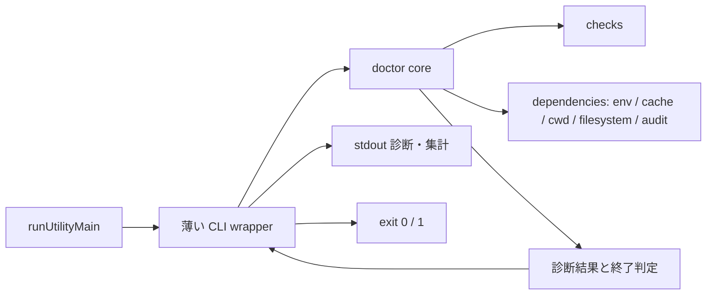
```mermaid
flowchart LR
  Main["runUtilityMain"] --> Wrapper["薄い CLI wrapper"]
  Wrapper --> Core["doctor core"]
  Core --> Checks["checks"]
  Core --> Deps["dependencies: env / cache / cwd / filesystem / audit"]
  Core --> Result["診断結果と終了判定"]
  Result --> Wrapper
  Wrapper --> Stdout["stdout 診断・集計"]
  Wrapper --> Exit["exit 0 / 1"]
```
<!-- text fallback: runUtilityMain が doctor コマンドを薄い CLI wrapper へ dispatch し、wrapper が doctor core を呼ぶ。doctor core は checks と env・cache・cwd・filesystem・audit などの dependencies を編成し、診断結果と終了判定を返す。wrapper は既存契約どおり stdout に診断と集計を出力し、終了コード0または1へ変換する。 -->
