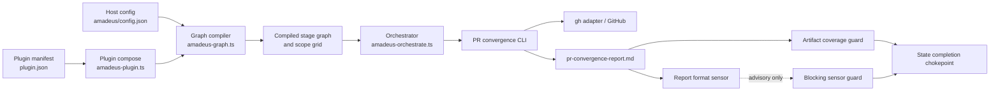
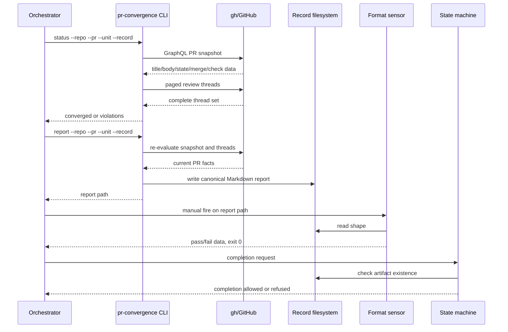
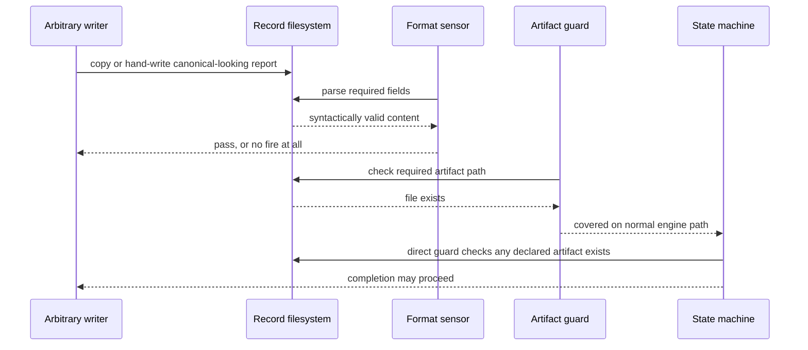

# アーキテクチャ

## System Overview

Amadeus は単一リポジトリから複数ハーネス向け配布物を生成する、layered modular monolith 型の CLI フレームワークである。source of truth は `packages/framework/core/` と `packages/framework/harness/<name>/` にあり、plugin は `plugins/<name>/` から compose される。workflow state、audit、stage artifacts は `amadeus/spaces/<space>/` 配下へ永続化される。

Issue #2838 の変更面は4つの境界に分かれる。

1. **Selection boundary** — host config と compiled scope grid が self-* workflow に `pr-convergence` stage を含める。
2. **Delivery boundary** — plugin CLI が `gh` process boundary を通じて PR を作成・観測する。
3. **Evidence boundary** — CLI が per-unit `code-generation/pr-convergence-report.md` を生成する。
4. **Completion boundary** — orchestrator と state machine が required artifacts と blocking sensors を検査して stage/workflow completion を許可する。

現行実装は 1 と通常 engine path の 4 を部分的に閉じるが、2→3→4 を不可偽造の一連の証拠として結合していない。

## Architectural Style and Boundaries

- **Core layer**: graph compile、scope binding、orchestration、state transition、artifact/sensor guards。plugin 固有の GitHub 意味論を import しない。
- **Plugin layer**: GitHub I/O、PR lifecycle、review ledger、convergence predicate、report rendering、provenance parsingを所有する。
- **Harness layer**: core/plugin の同じ stage graph と tools を各 AI host の filesystem convention へ投影する。
- **Record layer**: Intent state、audit、per-unit artifacts を append/read する永続化境界。
- **External adapter**: `gh` CLI を shell なし argv で spawn し、GitHub GraphQL/PR create を呼び出す。

この依存方向は妥当である。問題は component boundary ではなく、report writer と completion verifier の contract が shape validation に留まり、execution provenance を所有する component が存在しない点にある。

## Component Relationships

```mermaid
flowchart LR
  HC["Host config\namadeus/config.json"] --> GC["Graph compiler\namadeus-graph.ts"]
  PM["Plugin manifest\nplugin.json"] --> PC["Plugin compose\namadeus-plugin.ts"]
  PC --> GC
  GC --> SG["Compiled stage graph\nand scope grid"]
  SG --> OR["Orchestrator\namadeus-orchestrate.ts"]
  OR --> CLI["PR convergence CLI"]
  CLI --> GH["gh adapter / GitHub"]
  CLI --> RP["pr-convergence-report.md"]
  RP --> AG["Artifact coverage guard"]
  RP --> FS["Report format sensor"]
  FS -. "advisory only" .-> BG["Blocking sensor guard"]
  AG --> ST["State completion chokepoint"]
  BG --> ST
```

テキスト代替: host config と plugin manifest を graph compiler が統合し、orchestrator が compiled plan に従って plugin CLI を起動する。CLI は GitHub を読み、report を書く。report は artifact guard と format sensor に読まれるが、format sensor は advisory のため blocking guard へ実効的に接続されず、state completion は report の真正性を保証しない。

## Interaction Diagrams

### 正常な convergence report 生成

```mermaid
sequenceDiagram
  participant O as Orchestrator
  participant C as pr-convergence CLI
  participant G as gh/GitHub
  participant R as Record filesystem
  participant S as Format sensor
  participant M as State machine

  O->>C: status --repo --pr --unit --record
  C->>G: GraphQL PR snapshot
  G-->>C: title/body/state/merge/check data
  C->>G: paged review threads
  G-->>C: complete thread set
  C-->>O: converged or violations
  O->>C: report --repo --pr --unit --record
  C->>G: re-evaluate snapshot and threads
  G-->>C: current PR facts
  C->>R: write canonical Markdown report
  C-->>O: report path
  O->>S: manual fire on report path
  S->>R: read shape
  S-->>O: pass/fail data, exit 0
  O->>M: completion request
  M->>R: check artifact existence
  M-->>O: completion allowed or refused
```

テキスト代替: status の後、report verb は GitHub を再評価して Markdown を書く。orchestrator は sensor を手動 fire し、最後に state completion を要求する。現状、sensor failure は data でしかなく、state machine は CLI が report を書いたという receipt を検証しない。

### 手書き report bypass

```mermaid
sequenceDiagram
  participant W as Arbitrary writer
  participant R as Record filesystem
  participant F as Format sensor
  participant A as Artifact guard
  participant M as State machine

  W->>R: copy or hand-write canonical-looking report
  F->>R: parse required fields
  R-->>F: syntactically valid content
  F-->>W: pass, or no fire at all
  A->>R: check required artifact path
  R-->>A: file exists
  A-->>M: covered on normal engine path
  M->>R: direct guard checks any declared artifact exists
  M-->>W: completion may proceed
```

テキスト代替: 任意の writer が正規 field を模倣すると、format sensor は writer identity を区別できない。sensor が未実行でも blocking precondition はなく、artifact guard は path existence を見る。direct state guard は全成果物ではなく少なくとも1件の存在で通り得るため、bypass が残る。

## Key Design Decisions Observed

- plugin stage は `scopes: []` を維持し、host-owned `plugin.scope-bindings` で self-* にだけ加算する。非 self scope の opt-in を壊さない可逆な設計である。
- report artifact は `pr-convergence` stage の own produce ではなく、plugin seam で先行 `code-generation.produces` に overlay される。既存 per-unit coverage を再利用できる一方、責任の所在が stage と artifact owner で分離する。
- plugin は core を import せず、`gh` と `amadeus-log` を process boundary で呼ぶ。配布独立性を守るが、attestation verification をどこに置くか明示的な契約が必要になる。
- GitHub snapshot は title/body/state/merge/check を1 queryで取得し、Intent/Bolt/Unit provenance を同じ snapshot から検証する。PR content provenance は閉じているが report writer provenance は別問題として未解決である。

## Architectural Risks

- **BLOCKER**: report に execution receipt、content digest、audit identity、signature がなく、正規 content の copy/tamper/replay を識別できない。
- **BLOCKER**: sensor manifest は `default_severity: advisory`、stage は `sensors: []`、手動 fire、failure exit 0 であり completion boundary に接続されていない。
- **BLOCKER**: direct state completion guard は declared artifacts の全件ではなく最低1件の存在を検査するため、orchestrator の per-unit all-artifact coverage と強度が一致しない。
- **FOLLOW-UP**: stage `produces: []` / `requires_stage: []` と code-generation overlay の分離は、責任・順序・resume semantics を下流設計で明文化する必要がある。
- **FOLLOW-UP**: `create` は `--head` を gh に渡すだけで、clean branch、local commit、push、remote head SHA 一致を検証しない。
