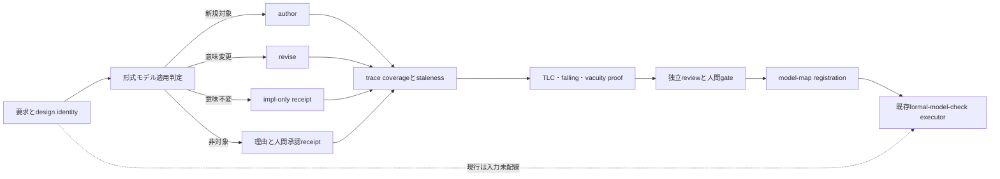
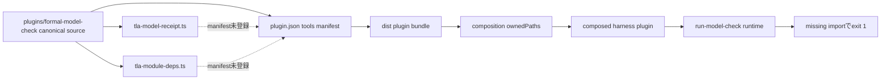
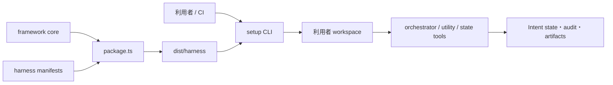
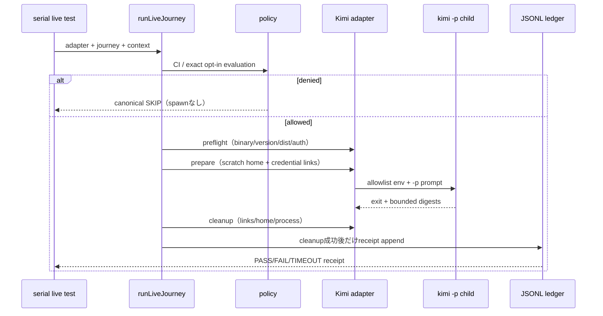
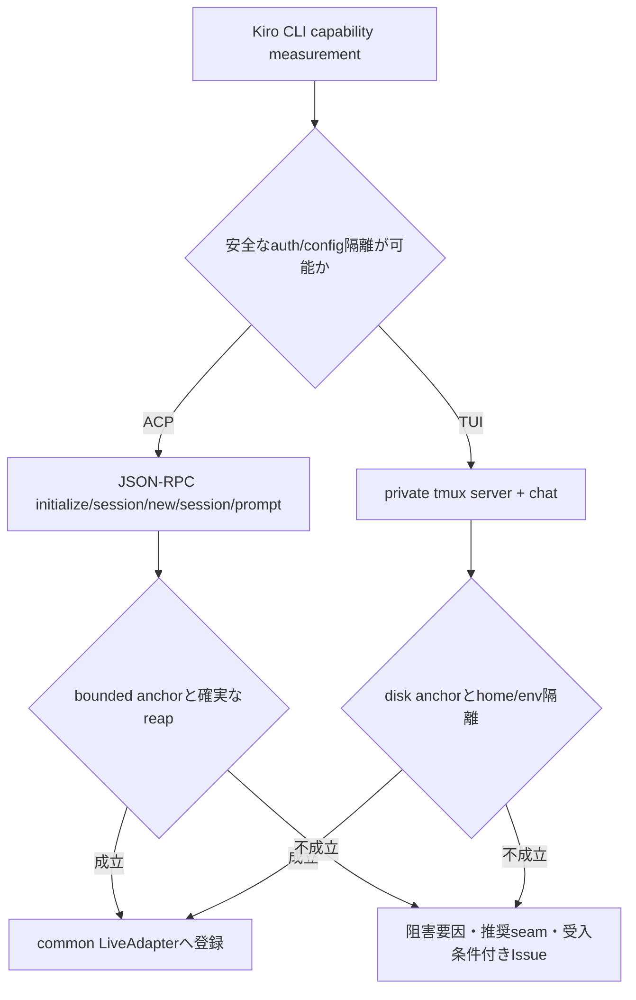

# Amadeus アーキテクチャ

## TLA+ authoring value chain の現行断面（260804-tla-authoring、現在、observed `7172aea8d`）

### 境界と責務

| 境界 | 現行責務 | #2161に対する空白 |
| --- | --- | --- |
| Requirements / Design | Markdown成果物とidentityを生成 | 形式モデル適用判定へ渡す正規入力がない |
| activation / advisory | `specs/tla/**` のhash変化を3 checkpointで通知（`amadeus-plugin-activation.ts:42`、`amadeus-orchestrate.ts:1378,1401`） | 要求本文・design identityを判定せず、authoringを起動しない |
| model completeness | 既存rowのsource/impl driftと`--impl-only`を検査 | 新規model row、要求→invariant trace、proof/review receiptを作れない |
| `formal-model-check` | model-map登録済みモデルをTLC実行しverdictを正規化 | `consumes` / `produces` / upstream ownerがなく、供給責務を持たない |
| plugin composition | manifestのclosed tools一覧をhostへ複製。structured config化後もprojection責務は不変 | `plugin-projection.ts:208-226`は掲載済みfileの存在/安全性だけを検査し、import closureを検査しない |

### Interaction Diagram: 要求からexecutorまで

実線は#2161が要求する価値鎖、破線の注記は現行断線である。配置方式（新規stage / overlay）は未裁定であり、この図は責務順序だけを示す。

```mermaid
flowchart LR
  R[要求とdesign identity] --> A[形式モデル適用判定]
  A -->|新規対象| N[author]
  A -->|意味変更| V[revise]
  A -->|意味不変| I[impl-only receipt]
  A -->|非対象| X[理由と人間承認receipt]
  N --> T[trace coverageとstaleness]
  V --> T
  I --> T
  X --> T
  T --> P[TLC・falling・vacuity proof]
  P --> G[独立reviewと人間gate]
  G --> M[model-map registration]
  M --> E[既存formal-model-check executor]
  R -. 現行は入力未配線 .-> E
```

テキスト代替: 要求/設計 → 適用判定 → author / revise / impl-only / non-target → trace・staleness → proof → review・人間gate → registration → 既存executor。

### Interaction Diagram: canonicalからcomposed runtimeまで

```mermaid
flowchart LR
  C[plugins/formal-model-check canonical source] --> J[plugin.json tools manifest]
  J --> B[dist plugin bundle]
  B --> O[composition ownedPaths]
  O --> H[composed harness plugin]
  H --> R[run-model-check runtime]
  C --> D[tla-model-receipt.ts]
  C --> M[tla-module-deps.ts]
  D -. manifest未登録 .-> J
  M -. manifest未登録 .-> J
  R --> F[missing importでexit 1]
```

テキスト代替: canonical sourceはmanifestに列挙されたtoolだけがbundle、ownedPaths、composed runtimeへ到達する。`tla-model-receipt.ts` と `tla-module-deps.ts` はcanonical treeに存在して依存されるがmanifestにないため、composed runtimeから欠落する。

### 設計判断へ送る事項

- authoring ownerの配置、requirement/design identity粒度、trace/reduction/proof receipt schema、登録の原子性は未裁定。Reverse Engineeringでは方式を固定しない。
- import-closure欠陥はM7/M8の `BLOCKER` 候補としてRequirements Analysisへ送る。最小選択肢は同Intent内の同根修復、または別Issueをhard dependency化すること。単なる見送りはMustと矛盾する。
- 既存executor、verdict normalization、FormalElection / MirrorLifecycle identityは保護境界であり、authoring責務との分離を維持する。

## 観測メタデータ

- 観測日: 2026-08-04
- Base commit: `9458bbda85eb7257310a80882b4858dc6ce3d1fc`
- Observed commit: `499d706a25f3cc2cc0c2b1671dc4b282e3a818e1`
- 証跡: common live E2E kernel は commit `12bf94ea6`（PR #2159）で導入され、Observed HEAD に含まれる。

## 全体アーキテクチャ

Amadeus は常駐サービスではなく、Bun で直接実行する短命CLI群からなるモジュラーモノリスである。`packages/framework/core/` がハーネス中立の状態機械・監査・stage graph・method knowledgeを所有し、`packages/framework/harness/<name>/` が各CLIのネイティブ設定、hook adapter、agent/skill表層を所有する。`scripts/package.ts` はmanifest駆動で `dist/<harness>/` を組み立て、`packages/setup/` がRelease Assetから利用者プロジェクトへtransactionalに適用する。

```mermaid
flowchart LR
  U[利用者 / CI] --> S[setup CLI]
  C[framework core] --> P[package.ts]
  H[harness manifests] --> P
  P --> D[dist/harness]
  D --> S
  S --> W[利用者 workspace]
  W --> O[orchestrator / utility / state tools]
  O --> R[Intent state・audit・artifacts]
```

## Common live E2E サブシステム

`tests/harness/live-e2e/adapter.ts` が adapter port、`policy.ts` が opt-in/CI/env policy、`lifecycle.ts` が preflight→prepare→execute→assert→cleanup→ledger の順序、`contract.ts` が閉じた outcome taxonomy、`ledger.ts` がJSONL receipt、`registry.ts` がcapability正本、`projector.ts` が文書matrix投影を担う。実adapterは `tests/harness/live-e2e/codex.ts`、`claude.ts`、`claude-sdk.ts`、`claude-tui.ts` に分離される。

重要な不変条件は、skip時にprobe/lease/scratch/spawn/ledgerを呼ばないこと、child environmentをallowlistから新規構築すること、cleanup barrierが閉じる前にPASSを台帳へ記録しないこと、raw credential・prompt・full output・source pathを永続化しないことである。

## Kimi/Kiro 接続 seam

| 対象 | 現行driver | 共通kernelとの接続点 | 現行ギャップ |
|---|---|---|---|
| Kimi print | `tests/harness/kimi-print-drive.ts` | `LiveAdapter.preflight/prepare/execute/cleanup` | `process.env`全体をchildへ展開、symlink resource未登録、canonical code/ledger未使用 |
| Kiro ACP | `tests/harness/kiro-acp-drive.ts` | JSON-RPC tool updateを`AdapterExecution.structured`へ投影可能 | `Bun.spawn`がambient env/homeを継承、binary固定、cleanup receipt/ledger未使用 |
| Kiro TUI | `tests/harness/tui-drive.ts` + `tui-client.ts` | disk/file/state anchorとtmux cleanup | shell経由でambient env/homeを継承、既存private tmux labelはrun単位resource登録ではない |

Kimiのcredential symlinkは「コピーしない」という既存利点を持つが、共通kernelの短命credential lease/cleanup resourceとして明示管理する必要がある。Kiro ACPは非対話・構造化境界が強く第一候補だが、現行コードだけではKiro認証をscratch homeへ安全に投影する正式seamが確定していない。Kiro TUIは現実のユーザー経路を覆うが、home/config隔離とpainted outputのbounded evidence化が追加課題である。

## Interaction Diagrams

### 共通 lifecycle とKimi adapter候補

```mermaid
sequenceDiagram
  participant T as serial live test
  participant L as runLiveJourney
  participant P as policy
  participant K as Kimi adapter
  participant C as kimi -p child
  participant G as JSONL ledger
  T->>L: adapter + journey + context
  L->>P: CI / exact opt-in evaluation
  alt denied
    P-->>T: canonical SKIP（spawnなし）
  else allowed
    L->>K: preflight（binary/version/dist/auth）
    L->>K: prepare（scratch home + credential links）
    K->>C: allowlist env + -p prompt
    C-->>K: exit + bounded digests
    L->>K: cleanup（links/home/process）
    L->>G: cleanup成功後だけreceipt append
    G-->>T: PASS/FAIL/TIMEOUT receipt
  end
```

### Kiro ACP/TUI の選択面

```mermaid
flowchart TD
  A[Kiro CLI capability measurement] --> B{安全なauth/config隔離が可能か}
  B -->|ACP| C[JSON-RPC initialize/session/new/session/prompt]
  B -->|TUI| D[private tmux server + chat]
  C --> E{bounded anchorと確実なreap}
  D --> F{disk anchorとhome/env隔離}
  E -->|成立| G[common LiveAdapterへ登録]
  F -->|成立| G
  E -->|不成立| H[阻害要因・推奨seam・受入条件付きIssue]
  F -->|不成立| H
```

## 設計判断とトレードオフ

1. 推奨方向は共通policy/lifecycleを変更せず、Kimi/Kiro adapterを追加することである。安全不変量を一箇所に保てるが、既存legacy journeyとの一時的重複を後続実装で解消する必要がある。
2. Kiro ACP優先は構造化出力とdeterministic cancelに有利である。TUI優先は実利用経路の忠実度が高いが、terminal描画・tmux・home隔離の複雑性が増す。
3. 認証済みambient homeをそのまま渡す案は実装が小さいが、source auth/config path非漏洩契約に反するため不採用である。認証seamを実測できなければ無理に共通contractを弱めず、後続Issueへ送る。

## セキュリティと信頼境界

課金・外部モデル呼び出しはexact opt-in `1` のみで許可し、`GITHUB_ACTIONS=true` はopt-inより先にhard denyする。childには宣言済みkeyだけを渡し、`HOME`、`KIMI_CODE_HOME`、Kiroのsource config path、API keyなどをambient継承しない。symlink、tmux server/session、child process、scratch dir、credential bindingは全てcleanup resourceとして登録し、残存時はPASSを抑止する。
