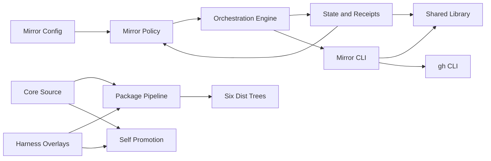

# 依存関係

## 内部依存グラフ

<!-- Text fallback: config と state が policy の入力となり、policy を orchestration engine が利用する。engine は state と mirror CLI を調整し、CLI と state は shared library に依存する。CLI だけが gh を呼ぶ。core と harness overlay は package と promote-self により dist と self-install 面へ投影される。 -->

## Mirror の内部依存

| 依存元 | 依存先 | 契約 |
|---|---|---|
| `amadeus-mirror-config.ts` | `amadeus-lib.ts` | workspace root 解決 |
| `amadeus-orchestrate.ts` | mirror config | mode 解決 |
| `amadeus-orchestrate.ts` | state file / state CLI | receipt 読取・遷移 |
| `amadeus-orchestrate.ts` | mirror CLI | create/sync/close 指令 |
| `amadeus-mirror.ts` | `amadeus-lib.ts` | Intent、record、field 操作 |
| `amadeus-mirror.ts` | `gh` | auth、create、edit、close、view |
| `amadeus-state.ts` | `amadeus-lib.ts` | project/record 解決、lock、audit |
| tests | exported pure functions / injected runners | decision、I/O、process 境界 |

`amadeus-lib.ts` は高 fan-in の共有依存である。mirror 固有の変更を共有 lib へ広げる場合は、既存 `resolveProjectDir()` の再利用のように正準化へ限定し、新しい mirror transport abstraction を置かない。

## 外部依存

Mirror の外部依存は GitHub と `gh` CLI である。`gh` は optional で、未導入、未認証、権限不足、network/API failure が起こり得る。目標契約ではこれらを外部同期の失敗として記録するが、AI-DLC workflow 本体の進行依存にはしない。

GitHub Issue の body は record から生成する派生ビューであり、GitHub 側は正本データストアではない。逆方向の依存や双方向同期はない。

## 配布依存

core tool/skill の変更は harness manifest を通じて6つの `dist` へ伝播し、self-install 面にも反映される。したがって source の green だけでは完成せず、package と promote-self の両 drift guard が必要である。

日英文書は実装契約に依存する。3モード、既定値、boolean 非互換、lifecycle boundary、warning/retry、provenance を、実装確定後に同一変更で同期する。

## 今回の依存リスク

- pending receipt が config より先に解決され、`off` へ変更した設定を迂回する可能性がある。
- mirror CLI 独自の root 算出が配布 layout に依存し、core source と配布面で結果が変わる。
- Issue 番号だけに依存する close は ownership を証明できない。
- create の GitHub 成功と state write が別操作であり、部分成功時に重複防止が成立しない。
- park、complete、Intent Capture 承認 seam が既存 phase-boundary helper に依存しておらず、個別配線が必要である。
- default space 固定の record path は、space selector と mirror state の依存を分断する。
