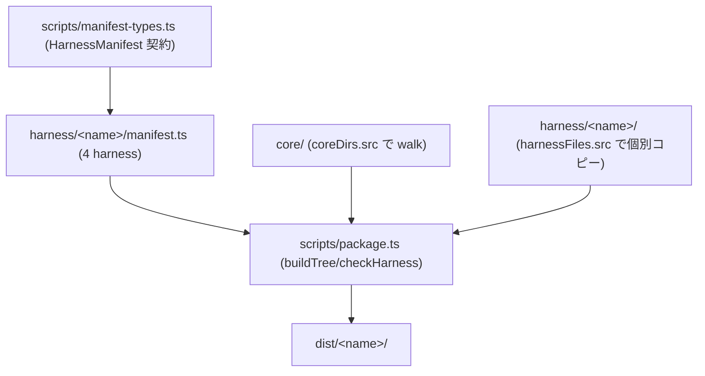
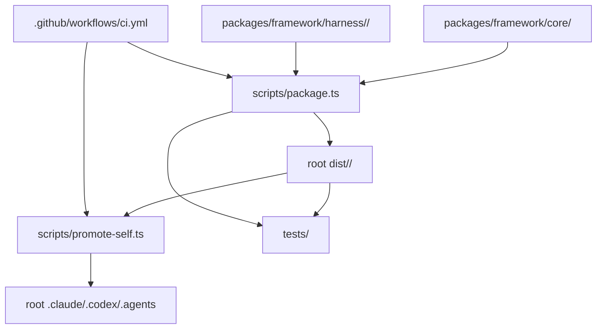
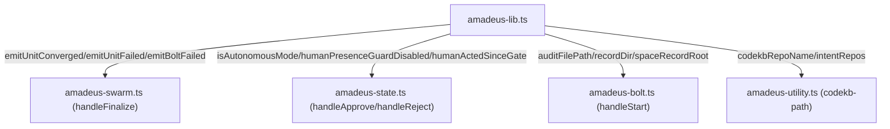
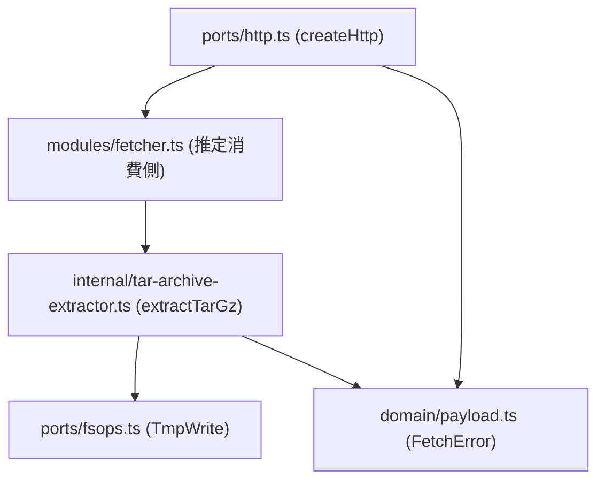

# 依存関係

## packaging の入力依存(intent 260710、#735)



<!-- text fallback: scripts/package.ts は scripts/manifest-types.ts の HarnessManifest 契約を各 harness/<name>/manifest.ts が実装したデータとして require() し、core/(coreDirs で全 walk)と harness/<name>/(harnessFiles の列挙分のみ)を入力として dist/<name>/ を生成する。#735 の観点では、harnessFiles に列挙されない harness ソースは入力依存グラフに現れず build 不可視になる — この「参照されないソース」を検出する source 側の依存整合チェックが現状存在しない。 -->

外部依存: source-unreferenced-check intent 区間(38コミット)で開発依存に **`fast-check ^4.9.0`**(PBT、#722)が追加された(`package.json` L32、`bun.lock`)。property-based test(setup の manifest roundtrip / semver / audit escape 等、#697 Phase B)と動的 test-size 計測(#732、`tests/lib/test-size.ts`)、codecov 導入(`codecov.yml`、`.github/workflows/ci.yml` 更新)が主な追加。packaging 自体の外部依存に変更はない。

## 複雑度ゲートの外部依存追加予定(intent 260710-complexity-gate、2026-07-10)

複雑度ゲート導入(feature スコープ)で加わる外部依存:

- **lizard 1.23.0(Python パッケージ、CI に pip 固定インストール予定)**: CCN 計測器。既存の CI(`.github/workflows/ci.yml` の `check` ジョブ、`oven-sh/setup-bun@v2` ベース)へ Python + pip 固定バージョンの lizard を新たな供給チェーンとして追加する(E-CX1 Q3=A、typecheck/lint 直後のステップ)。R3(CI の Python 供給変化)の一次緩和はバージョン固定、最悪時は純 Python 単一パッケージの vendoring。Biome `noExcessiveCognitiveComplexity` の有効化は既存 Biome 2.4系の範囲内で完結し新規パッケージ依存を要さない。CCN baseline(現存42関数)は `tests/` 配下の committed JSON として持つ想定(`.coverage-ratchet.json` と同型)で、開発依存の追加はない。

## 260709-gate-mechanics(前 intent、履歴)の内部依存(#685・#670)

```mermaid
flowchart TD
  Lib["amadeus-lib.ts (humanActedSinceGate/verifyDelegatedApproval/auditShardDir)"]
  State["amadeus-state.ts (handleApprove/handleDelegateApproval/handleReject)"]
  Audit["amadeus-audit.ts (VALID_EVENT_TYPES)"]
  Mint["amadeus-mint-presence.ts (HUMAN_TURN hook)"]
  Worktree["amadeus-worktree.ts (assertNotSiblingWorktree)"]
  Bolt["amadeus-bolt.ts (--worktree)"]

  Lib -->|humanActedSinceGate/verifyDelegatedApproval| State
  State -->|appendAuditEntry(DELEGATED_APPROVAL, ...)| Audit
  Mint -->|HUMAN_TURN written to own shard| Lib
  Bolt -->|--worktree 経路で create/release/merge を呼ぶ| Worktree
```

<!-- text fallback: amadeus-lib.ts's humanActedSinceGate and verifyDelegatedApproval are consumed by amadeus-state.ts's gate handlers (handleApprove, handleDelegateApproval, handleReject); handleDelegateApproval writes a DELEGATED_APPROVAL event whose validity as an event type is enforced by amadeus-audit.ts's VALID_EVENT_TYPES set. amadeus-mint-presence.ts (the UserPromptSubmit hook) is the sole writer of HUMAN_TURN events that humanActedSinceGate and verifyDelegatedApproval both read. amadeus-worktree.ts's assertNotSiblingWorktree is a separate, unrelated dependency chain reached both directly (amadeus-worktree.ts create) and via amadeus-bolt.ts's --worktree flag. #685 and #670 are independent defects in two unrelated subsystems that happen to be bundled in the same bugfix batch. -->

外部依存に変更はない(前回スキャンの確認内容を維持)。#685 の修理(新規 delegated-rejection 機構)・#670 の修理(worktree 判定基準の追加)はいずれも既存モジュール内の分岐追加で完結し、新規パッケージ依存を要求しない見込み。

## 内部依存グラフ(既存 framework 配布経路、変更なし)



<!-- text fallback: packages/framework/{core,harness} が scripts/package.ts に取り込まれ root dist/<name>/ を生成し、promote-self 経由で root .claude/.codex/.agents に反映される。CI がこの一連を実行する。この経路は一連の bugfix intent(バッチ D 含む)で変更しない。 -->

## #674/#675/#676/#668 の内部依存(`amadeus-lib.ts` 中心)



<!-- text fallback: amadeus-lib.ts is the shared library consumed by amadeus-swarm.ts (audit emitters used by #674's finalize), amadeus-state.ts (the guard functions asymmetrically wired between approve and reject, #675), amadeus-bolt.ts (auditFilePath's bare fallback, #676), and amadeus-utility.ts (codekbRepoName's basename fallback, #668). All four bugs in this cluster trace back to logic living in this one shared file, though each bug is a distinct function within it. -->

## `@amadeus-dlc/setup` の内部依存(#677・#678 に関連)



<!-- text fallback: ports/http.ts defines the Http port (getJson/downloadArchive) consumed by modules/fetcher.ts (not read in this scan; inferred from directory layout in component-inventory.md). downloadArchive's returned stream feeds into internal/tar-archive-extractor.ts's extractTarGz, which depends on the TmpWrite port (fsops.ts) for writes and shares the FetchError domain type (domain/payload.ts) with the Http port for uniform error classification. #677 and #678 sit at two different points along this same download→extract pipeline. -->

## 外部依存関係

Framework 本体・`packages/setup` に新規の外部依存追加はない。CI が依存する外部要素も変更なし(`oven-sh/setup-bun@v2` 等)。6件のバグ修理はいずれも既存モジュール内の分岐・try/catch 追加で完結し、新規パッケージ依存を要求しない見込み。

## Sibling intent 依存関係

前々回 intent `260708-installer-distribution` は完了済み。前回 intent `260709-framework-repair-batch` は requirements-analysis ゲートで park された状態(#656/#657/#641/#661 を対象)。intent `260709-bug-zero-batch` は対象コード領域が異なる独立バッチであり、前回バッチの完了を前提としない。#656(`LegacyLayout` の配線)は当時のスキャン時点で `upgrade.ts:192` から `Installation.detect` の evidence が消費されており解消済みと確認できたが、#657(`bunx tsc` の無条件使用)は `amadeus-sensor-type-check.ts:157,174` の時点でも未修理のまま残存している。#641・#661 は当時のスキャンの重点対象外のため状態未確認。bug-zero-batch のスコープはあくまで #674/#675/#676/#677/#678/#668 の6件。
