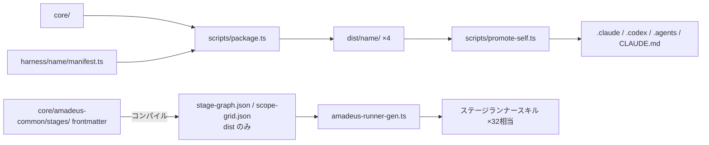

# Dependencies

> Reverse Engineering 成果物 — 分析対象: main @ 14c40c9c(現 HEAD 8d73e463)

## 外部依存

ランタイム依存(dependencies)は**ゼロ**。以下はすべて devDependencies:

| パッケージ | バージョン | 用途 | リスク |
|---|---|---|---|
| @anthropic-ai/claude-agent-sdk | 0.3.158(固定) | e2e テスト駆動 | 0.x のため破壊的変更の可能性。テスト専用で配布物に非混入 |
| node-pty | 1.1.0 | e2e ターミナル駆動 | ネイティブバインディング(bun 互換性に注意) |
| @xterm/headless | ^5.5.0 | e2e ターミナルエミュレーション | 低 |
| typescript | ^6.0.3 | 型検査 | 低 |
| Biome | 2.4系 | lint(tests/ のみ) | 低 |

環境前提: **bun**(ユーザー環境の唯一の実行時前提)。監査ロックは mkdir ベースで外部依存なし。

## 内部パッケージ間依存(ビルド時)

**テキストフォールバック**: `core/` と各 `harness/<name>/manifest.ts` が `scripts/package.ts` の入力となり、4つの `dist/<name>/` を生成する。dist/claude は `promote-self.ts` を経てリポジトリルートのセルフインストール(`.claude/` 等)へ昇格される。ステージ frontmatter はコンパイルで stage-graph.json / scope-grid.json(dist のみ)になり、runner-gen がそこからステージランナースキルを生成する。

## 内部依存(ランタイム)

- **SKILL.md(コンダクター)→ amadeus-orchestrate.ts**: directive JSON 契約(amadeus-directive.ts)経由のみ
- **hooks → tools**: stop / mint-presence / sensor-fire は audit.ts・状態ファイル・questions ファイルに依存
- **amadeus-log.ts → 監査台帳**: answer の在席ゲートは監査イベント列(HUMAN_TURN / QUESTION_ANSWERED)への時系列依存
- **read-only スキル → amadeus-runtime.ts summary --json**: 数値の唯一のソース(一方向依存)
- **sensor-fire → stage-graph の `sensors_applicable`**: コンパイル時解決済み配列への依存(実行時のステージファイル参照なし)
- **memory 5層(org→team→project→phase→stage)**: strict-additive。狭い層の矛盾は §13 ゲートが依存関係を保護

## 依存管理上の注意点

1. **dist はソースの完全な派生物**: core / harness の変更は必ず dist 再生成 + 昇格を同一コミットで伴う(4種ドリフトガードが強制)
2. **manifest の coreDirs は手動列挙**: read-only スキル追加時に4ハーネス分の行追加が必要(N×M 抜け漏れリスク — grilling スキル新設時の要注意点)
3. **VALID_EVENT_TYPES はクローズド**: 新監査イベント型の導入は amadeus-audit.ts の編集を要し、既存台帳との互換に注意
4. **directive JSON は凍結契約**: kind の追加は予約枠の消費として扱う
