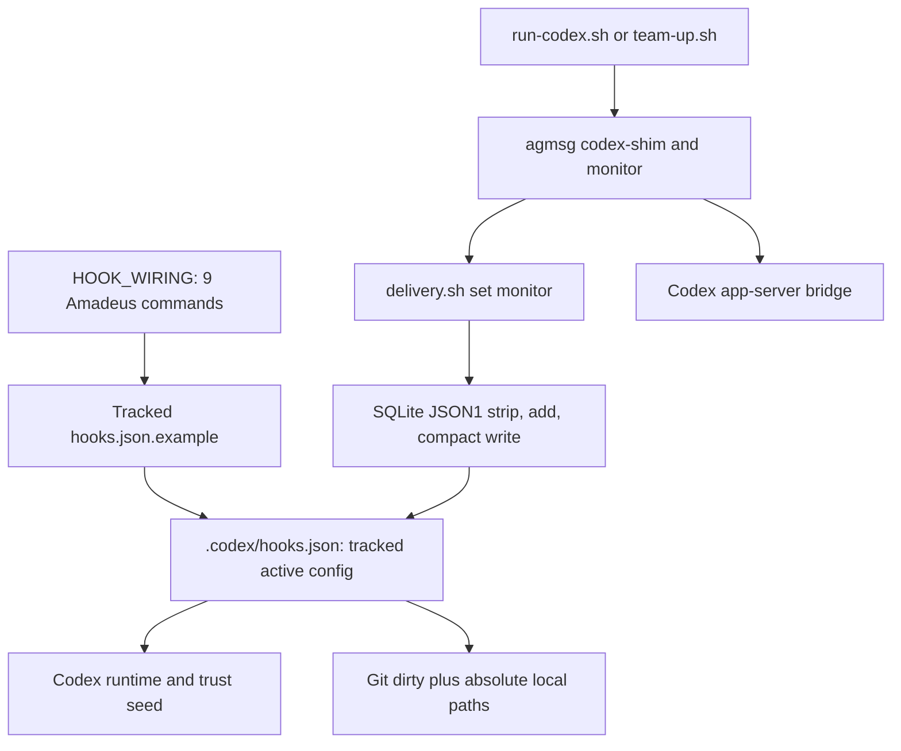
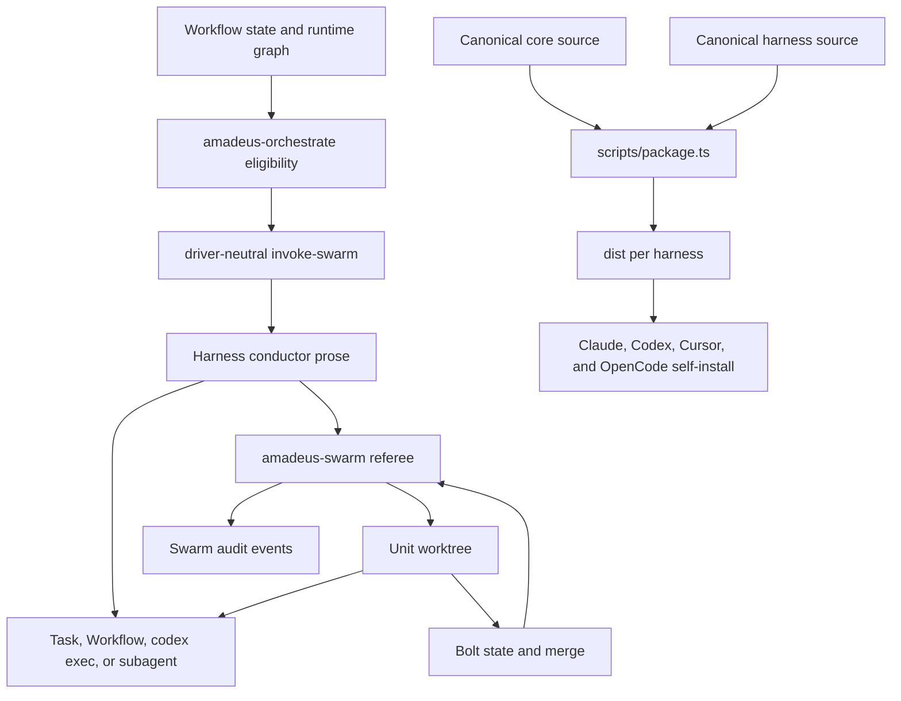
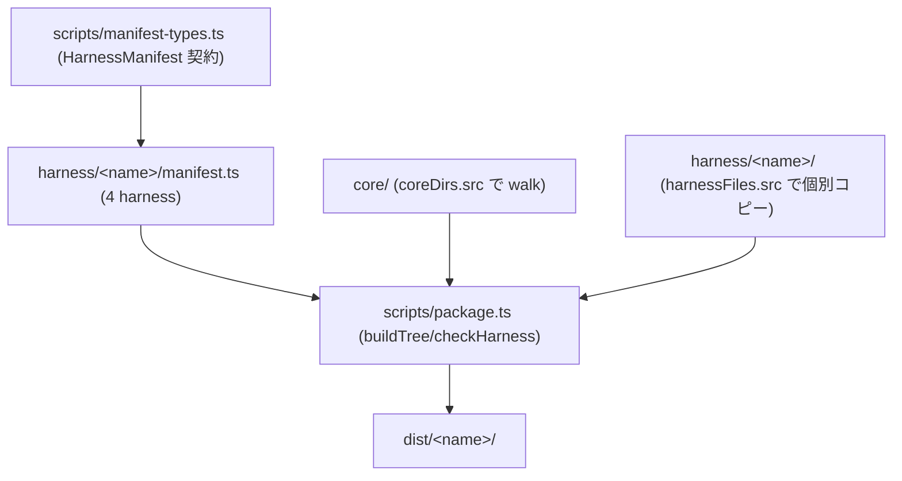
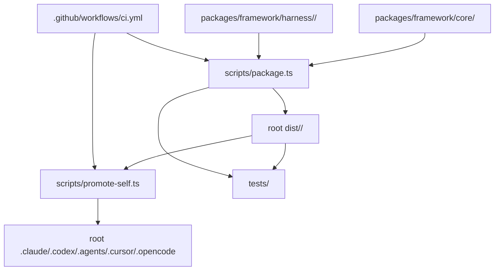
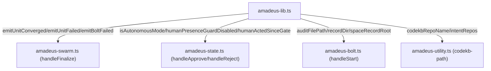
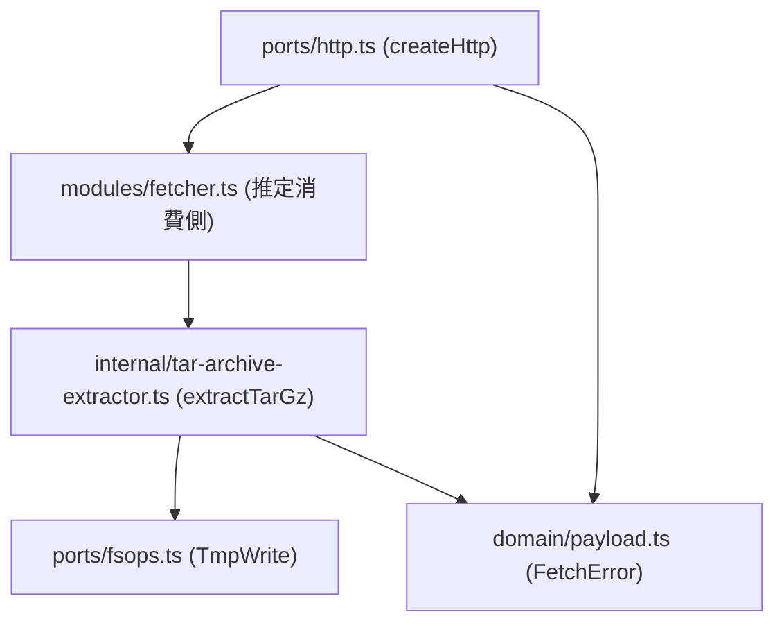

# 依存関係

## 260722-teamup-prompt-race の依存境界（2026-07-22、現在）

bugfix / Minimal（observed `a81c11dde`）。本バグの依存境界:

```text
scripts/team-up.sh (claude_member_cmd)
  -> scripts/run-claude.sh (exec claude "$@")   # init_prompt を位置引数で委譲
  -> Herdr pane run/send-text/send-keys          # pane 起動・再注入経路
  -> agmsg spawn.sh handshake / ready センチネル   # 対照契約（repo 外、read-only）
     agmsg_ready_path (lib/actas-lock.sh) <- watch.sh (touch)
```

最重要の依存事実は、claude の watcher 起動が「team-up.sh の init_prompt 一発 → claude 初回ターン → watch.sh 起動 → センチネル生成」という**一方向の連鎖**に依存し、初期プロンプト消失時に連鎖全体が不成立になる点（SessionStart hook 経由の `emit_monitor_directive` `delivery.sh:302-311` も初回ターン未到達で未実行）。修正は `scripts/` に閉じ、core/harness 正本・dist/self-install への従属依存は想定薄（実装時に実 diff で再評価、cid:code-generation:c6）。

> 以下は過去 intent の履歴。

## upstream-sync-230 の依存境界（2026-07-20、履歴）

```text
stage-schema + unit-kind
  -> graph/parser/directive/sensor
  -> plugin discovery/package
  -> 6 harness projection
  -> compose/no-clobber/self-heal compile
  -> dist
  -> 4 harness self-install
  -> tests/docs
```

最重要の内部依存は、`stage-schema-extensions` と `unit-kind-pruning` が同じ schema/graph blast radius を共有する点である。両者を別々に先行着地させると中間状態で parser/directive/sensor の契約が割れるため、共有設計を先に確定する。plugin 依存順は `stage-schema-extensions` → `packager-plugin-projection` → `plugin-compose-hook` → `test-pro-reference-plugin` / `plugin-docs` である。

| 依存種別 | 境界 |
|---|---|
| Core → harness | upstream の4面前提を6ホストへ ADAPT |
| Source → dist | `scripts/package.ts` が唯一の投影経路。手修正禁止 |
| Dist → self-install | `promote-self.ts` の4ハーネス closed list。packager の6面 discovery と混同しない |
| Plugin source → host | source、`dist/plugins`、host projection の所有権を分離し no-clobber を検査 |
| Tests/docs → feature | D7/D8 は各採用項目と同じ着地単位に従属 |

外部 package の主要依存は SDK 0.3.158、xterm `^5.5.0`、node-pty 1.1.0、fast-check `^4.9.0`、TypeScript `^6.0.3`、Biome 2.4.16。plugin 機構はこの集合へ新しい runtime dependency を追加しない。

> 以下は過去 intent の履歴。

## Codex hooks／agmsg の依存境界（intent 260718-hooks-config-conflict、2026-07-18、履歴）



テキスト代替: Amadeus の `HOOK_WIRING` は tracked example を生成し、active `.codex/hooks.json` へコピーされた後に Codex runtime／trust seed が読む。別経路では `run-codex.sh` または `team-up.sh` が外部 agmsg shim／monitor を起動し、`delivery.sh set monitor` と SQLite JSON1 writer が同じ active file を書き換える。bridge delivery は成立する一方、tracked file には compact rewrite と絶対 skill／clone path が残る。

agmsg 1.1.7 は package dependency ではなく `~/.agents/skills/agmsg/` にある外部 runtime dependency である。mode reader と writer はともに active hooks を真実源とし、monitor 起動ごとに再設定する（`type.conf:18-22`、`delivery.sh:63-220`、`codex-monitor.sh:194`）。[PR #783](https://github.com/amadeus-dlc/amadeus/pull/783) が防御した `.codex/agmsg-delivery-mode` は現行 source の reader／writer双方で不在であり、残件の依存境界ではない。

恒久案は active file の untrack／ignore、または tracked static dispatcher + ignored sidecar の二案が `【裁定待ち】`。前者は外部 agmsg を変更せず現行 bridge 経路を維持できるが canonical migration が必要、後者は tracked canonical を維持できるが Amadeus／agmsg の協調変更と互換検証を要する。新規 package 依存の要否も裁定後に決める。

## swarm driver の現行依存グラフ（intent 260713-swarm-driver-migration、2026-07-13、履歴）



テキスト代替: workflow state と runtime graph を engine が読み、driver-neutral な `invoke-swarm` を harness conductor へ渡す。conductor はハーネス固有 worker surface を選び、referee が準備した Unit worktree 上で実行する。Bolt は worktree lifecycle と merge を担い、referee が収束を再検証して監査へ記録する。別の生成依存として core／harness 正本を `scripts/package.ts` が各 `dist` へ投影し、Claude／Codex／Cursor／OpenCode を self-install へ反映する。

新契約で追加される依存は、core の deterministic selector、harness の capability probe／driver adapter、referee が受け取る driver-aware audit metadata、native event／trace classifier である。外部 package 追加は現時点で不要で、既存ローカル CLI と live tool を利用する。依存方向は selector→adapter→worker、選択結果→referee audit とし、referee から AI provider へ依存させないことが現行境界を保つ条件である。

> 以下は過去 intent の依存記録。#735 の source-side unreferenced scan は現行 `scripts/package.ts:711-725` で解消済み。

## packaging の入力依存(intent 260710、#735)



<!-- text fallback: scripts/package.ts は scripts/manifest-types.ts の HarnessManifest 契約を各 harness/<name>/manifest.ts が実装したデータとして require() し、core/(coreDirs で全 walk)と harness/<name>/(harnessFiles の列挙分のみ)を入力として dist/<name>/ を生成する。#735 の観点では、harnessFiles に列挙されない harness ソースは入力依存グラフに現れず build 不可視になる — この「参照されないソース」を検出する source 側の依存整合チェックが現状存在しない。 -->

外部依存: source-unreferenced-check intent 区間(38コミット)で開発依存に **`fast-check ^4.9.0`**(PBT、#722)が追加された(`package.json` L32、`bun.lock`)。property-based test(setup の manifest roundtrip / semver / audit escape 等、#697 Phase B)と動的 test-size 計測(#732、`tests/lib/test-size.ts`)、codecov 導入(`codecov.yml`、`.github/workflows/ci.yml` 更新)が主な追加。packaging 自体の外部依存に変更はない。

## 複雑度ゲートの外部依存追加予定(intent 260710-complexity-gate、2026-07-10)

複雑度ゲート導入(feature スコープ)で加わる外部依存:

- **lizard 1.23.0(Python パッケージ、CI に pip 固定インストール予定)**: CCN 計測器。既存の CI(`.github/workflows/ci.yml` の `check` ジョブ、`oven-sh/setup-bun@v2` ベース)へ Python + pip 固定バージョンの lizard を新たな供給チェーンとして追加する(E-CX1 Q3=A、typecheck/lint 直後のステップ)。R3(CI の Python 供給変化)の一次緩和はバージョン固定、最悪時は純 Python 単一パッケージの vendoring。Biome `noExcessiveCognitiveComplexity` の有効化は既存 Biome 2.4系の範囲内で完結し新規パッケージ依存を要さない。CCN baseline(現存42関数)は `tests/` 配下の committed JSON として持つ想定(`.coverage-ratchet.json` と同型)で、開発依存の追加はない。

## 260709-gate-mechanics(前 intent、履歴)の内部依存(#685・#670)

```mermaid
flowchart TD
  Lib["amadeus-lib.ts (humanActedSinceGate/verifyDelegatedApproval/auditShardDir)"]
  State["amadeus-state.ts (handleApprove/handleDelegateApproval/handleReject)"]
  Audit["amadeus-audit.ts (VALID_EVENT_TYPES)"]
  Mint["amadeus-mint-presence.ts (HUMAN_TURN hook)"]
  Worktree["amadeus-worktree.ts (assertNotSiblingWorktree)"]
  Bolt["amadeus-bolt.ts (--worktree)"]

  Lib -->|humanActedSinceGate/verifyDelegatedApproval| State
  State -->|appendAuditEntry(DELEGATED_APPROVAL, ...)| Audit
  Mint -->|HUMAN_TURN written to own shard| Lib
  Bolt -->|--worktree 経路で create/release/merge を呼ぶ| Worktree
```

<!-- text fallback: amadeus-lib.ts's humanActedSinceGate and verifyDelegatedApproval are consumed by amadeus-state.ts's gate handlers (handleApprove, handleDelegateApproval, handleReject); handleDelegateApproval writes a DELEGATED_APPROVAL event whose validity as an event type is enforced by amadeus-audit.ts's VALID_EVENT_TYPES set. amadeus-mint-presence.ts (the UserPromptSubmit hook) is the sole writer of HUMAN_TURN events that humanActedSinceGate and verifyDelegatedApproval both read. amadeus-worktree.ts's assertNotSiblingWorktree is a separate, unrelated dependency chain reached both directly (amadeus-worktree.ts create) and via amadeus-bolt.ts's --worktree flag. #685 and #670 are independent defects in two unrelated subsystems that happen to be bundled in the same bugfix batch. -->

外部依存に変更はない(前回スキャンの確認内容を維持)。#685 の修理(新規 delegated-rejection 機構)・#670 の修理(worktree 判定基準の追加)はいずれも既存モジュール内の分岐追加で完結し、新規パッケージ依存を要求しない見込み。

## 内部依存グラフ(既存 framework 配布経路、変更なし)



<!-- text fallback: packages/framework/{core,harness} が scripts/package.ts に取り込まれ root dist/<name>/ を生成し、promote-self 経由で Claude／Codex／Cursor／OpenCode の project-local tree に反映される。CI がこの一連を実行する。 -->

## #674/#675/#676/#668 の内部依存(`amadeus-lib.ts` 中心)



<!-- text fallback: amadeus-lib.ts is the shared library consumed by amadeus-swarm.ts (audit emitters used by #674's finalize), amadeus-state.ts (the guard functions asymmetrically wired between approve and reject, #675), amadeus-bolt.ts (auditFilePath's bare fallback, #676), and amadeus-utility.ts (codekbRepoName's basename fallback, #668). All four bugs in this cluster trace back to logic living in this one shared file, though each bug is a distinct function within it. -->

## `@amadeus-dlc/setup` の内部依存(#677・#678 に関連)



<!-- text fallback: ports/http.ts defines the Http port (getJson/downloadArchive) consumed by modules/fetcher.ts (not read in this scan; inferred from directory layout in component-inventory.md). downloadArchive's returned stream feeds into internal/tar-archive-extractor.ts's extractTarGz, which depends on the TmpWrite port (fsops.ts) for writes and shares the FetchError domain type (domain/payload.ts) with the Http port for uniform error classification. #677 and #678 sit at two different points along this same download→extract pipeline. -->

## 外部依存関係

Framework 本体・`packages/setup` に新規の外部依存追加はない。CI が依存する外部要素も変更なし(`oven-sh/setup-bun@v2` 等)。6件のバグ修理はいずれも既存モジュール内の分岐・try/catch 追加で完結し、新規パッケージ依存を要求しない見込み。

## Sibling intent 依存関係

前々回 intent `260708-installer-distribution` は完了済み。前回 intent `260709-framework-repair-batch` は requirements-analysis ゲートで park された状態(#656/#657/#641/#661 を対象)。intent `260709-bug-zero-batch` は対象コード領域が異なる独立バッチであり、前回バッチの完了を前提としない。#656(`LegacyLayout` の配線)は当時のスキャン時点で `upgrade.ts:192` から `Installation.detect` の evidence が消費されており解消済みと確認できたが、#657(`bunx tsc` の無条件使用)は `amadeus-sensor-type-check.ts:157,174` の時点でも未修理のまま残存している。#641・#661 は当時のスキャンの重点対象外のため状態未確認。bug-zero-batch のスコープはあくまで #674/#675/#676/#677/#678/#668 の6件。

## Issue #857 差分スキャン（2026-07-23）

doctor core の明示すべき依存は、個別 checks、env、cache、session cwd、filesystem、audit である。特に `worktreeBaseDir → resolveMainCheckout` は session cwd に依存し、stage graph/harness の検査は env と cache に結合している。これらを即座に純粋化するのではなく、doctor core から見える dependencies として境界化する。

## 依存方向の判断

依存方向は `runUtilityMain → 薄い CLI wrapper → doctor core → checks/dependencies` とする。CLI wrapper から checks を直接呼ばず、checks から stdout や `process.exit` を参照させない。新規外部パッケージは追加せず、既存の Bun/TypeScript/Node 標準機能と現在の audit・filesystem 実装を使う。
