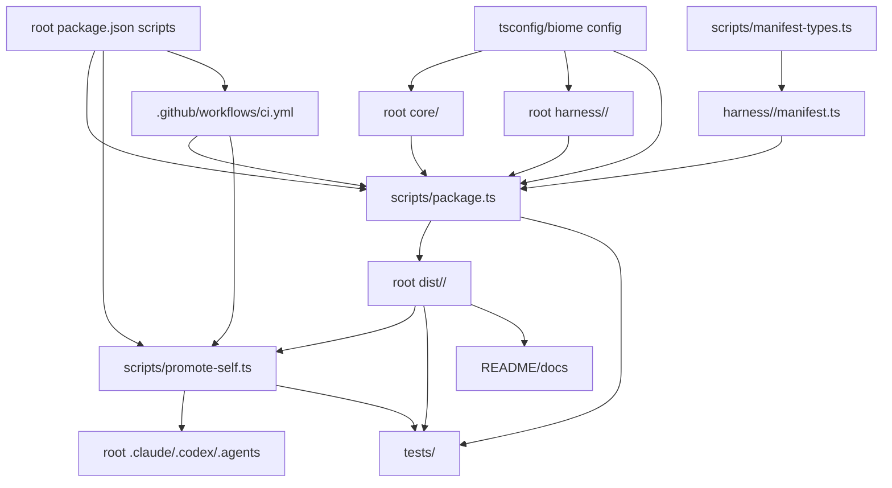

# 依存関係

## 内部依存グラフ

## レイアウト正規化に重要な依存関係

| 依存関係 | 現在の形 | 重要な理由 |
| --- | --- | --- |
| `scripts/package.ts` -> `core/` | direct relative import and root constants | breaks if scripts or core move independently |
| `scripts/package.ts` -> `harness/` | manifest discovery by root directory scan | defines harness registry |
| manifests -> `core/` and `harness/<name>/` | relative `src` projection semantics | all 配布物 mappings rely on this contract |
| `scripts/promote-self.ts` -> `dist/` | hardcoded managed dirs | dogfood install and preservation risk |
| tests -> `dist/` | fixture の anchor と assertion | CI とローカルテストへの影響範囲 |
| docs -> `dist/` | install commands and contributor guide | public/user-facing contract |
| CI -> root scripts | package.json commands | release/drift guard continuity |

## 外部依存関係

External library dependencies are not the primary risk for Issue #610. The practical external dependency is GitHub Actions running Bun-based root scripts. Any layout change must preserve or deliberately replace these checks:

- `bun run dist:check`
- `bun run promote:self:check`

## Sibling intent 依存関係

`packages/setup` is not present in this checkout and is scheduled as a separate intent. For this intent, it is an external sibling dependency with two implications:

- The design comparison should allow `packages/setup` to exist without forcing framework code into the same package shape.
- If full workspace normalization is chosen, it must define how framework package boundaries coexist with setup package boundaries.

This dependency should not block reverse engineering or requirements analysis for Issue #610.
