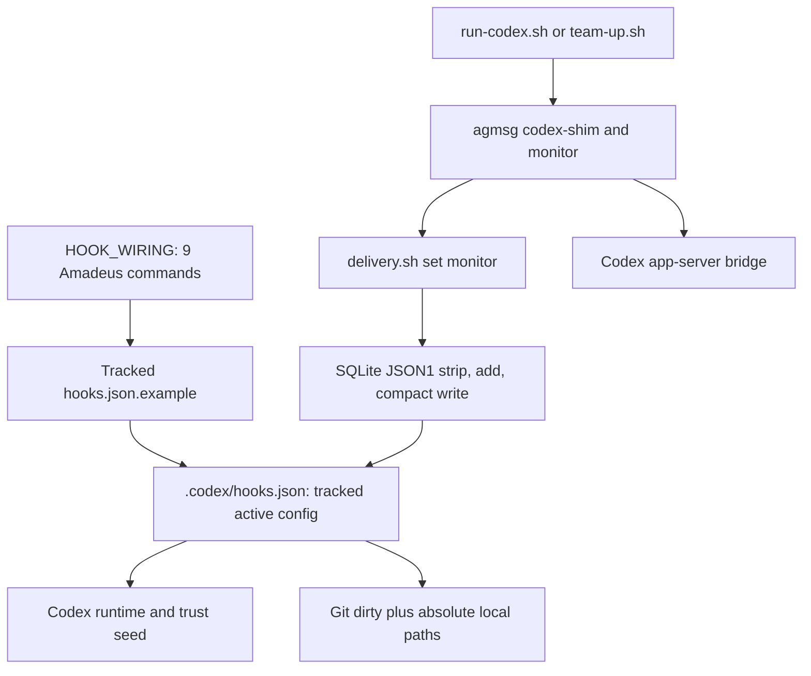
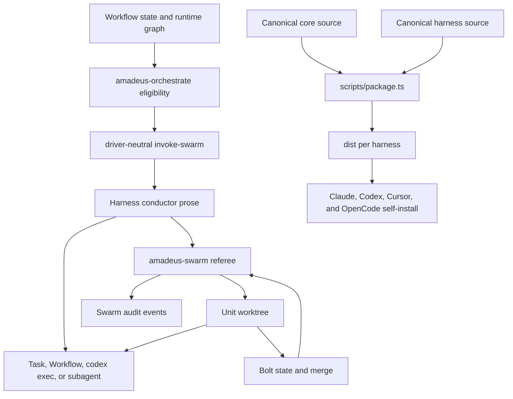
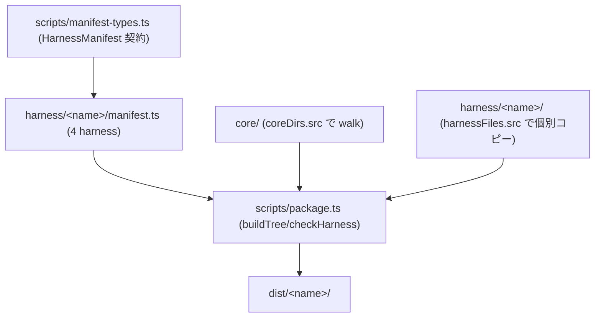
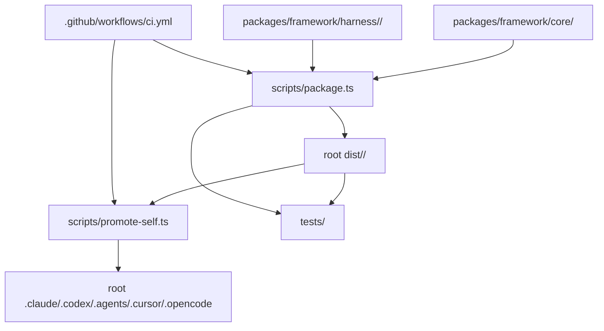
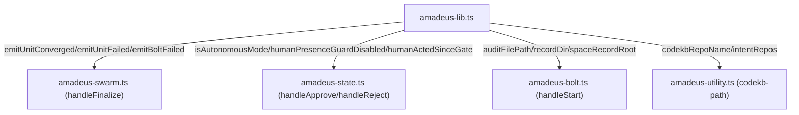
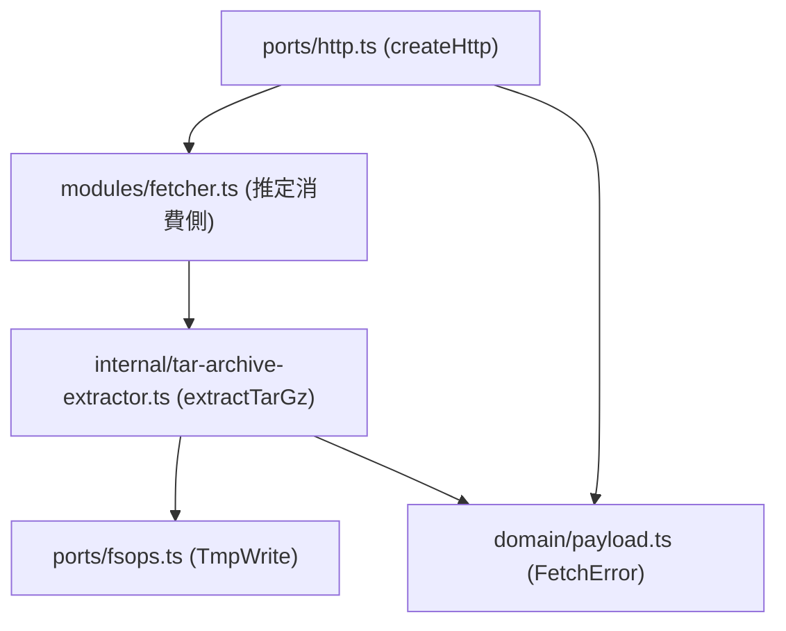

# 依存関係

## オープンバグ3件の依存関係（260730-open-bug-batch-3、現在、observed `3f73823b1`）

**判断: 外部依存の変化なし。ただし Bolt 間にファイル交差が1組ある。** 区間 `a38a1f4d3..3f73823b1` で `package.json` の依存追加・削除・更新はない（ルート依存は Bun types / TypeScript / Biome / fast-check / Agent SDK / release-it の既存集合のまま）。

### Bolt 間の交差判定

前 intent までと異なり、**3件すべてが非交差ではない**。

| 組 | 交差 | 判定 |
| --- | --- | --- |
| #1773 × #1772 | **交差する** — 両者とも `packages/framework/core/tools/amadeus-election-model.ts` を触る（#1773 は `OriginalBallot` の `:134-136`、#1772 は `Choice` `:48` と `DistributionView` `:306-310`） | 直列化するか、実 diff で行レンジの非交差を確認してから並行させる（`cid:code-generation:c6`。静的目録でなく実 diff で再評価する） |
| #1773 × #1752 | 非交差（`amadeus-election-*.ts` vs `amadeus-orchestrate.ts`） | 並行可 |
| #1772 × #1752 | 非交差 | 並行可 |

3件とも `packages/framework/core/` を正本とするため、`bun scripts/package.ts` → `dist/` 7ハーネス → `bun run promote:self` → self-install 5面という**同一の再生成チェーン**を通る。ファイル単位で非交差でも生成面が競合するため、着地順は実 diff で再評価する。

### 内部依存（#1773 / #1772 の修正が触る方向）

```
amadeus-election-model.ts   (型 — Choice :48 / DistributionView :306-310 / OriginalBallot :134-136)
        │  型定義を供給
        ▼
amadeus-election-store.ts   (格納 — appendBallot :464-465 / materialize :500 / timeline :468-472)
        │  ledger.json / timeline.json / ballots/<voter>.json
        ▼
選挙ディレクトリ（git tracked、非 ignore）
        │  voter subagent が直接読む運用（SKILL.md:51）
        ▼
配布ビュー（shuffleView :338 — 設計上は健全な唯一の配布面）
```

依存方向は model → store の一方向。#1772（model の型拡張）は store・tally（`choiceCounts` `:488-496`）・record render へ**下流伝播**する。#1773 の格納分離案は store 層に閉じるが、`.gitignore` という **core の外側**へ影響が出る唯一の経路を持つ。

### #1752 の依存

`amadeus-orchestrate.ts` 内で閉じる。修正候補 (b)（ask 時 binding の永続化）を採る場合、`amadeus-mirror-coordinator.ts` の `expectedPrompt` 照合様式（`:320` / `:560` / `:622` / `:742-746`）を参照するが、これは**既存様式の踏襲であり新規依存の追加ではない**。候補 (a)（create receipt の存在判定）は `classifyReceipt` 語彙の再利用で同様に閉じる。

### 区間で変化した依存方向（本 intent の患部外）

`gh` の呼出依存が**集約された**。従来 mirror 系3モジュールに分散していた GitHub 呼出が `amadeus-github-gateway.ts` へ、プロセス起動が `amadeus-process-runner.ts` へ移り、抽出元は `amadeus-mirror-config.ts` −689 / `amadeus-mirror-gateway.ts` −911 / `amadeus-mirror-runner.ts` −310 と縮小した。`hooks/amadeus-sensor-fire.ts` は新たに `tools/amadeus-sensor-invocation.ts` へ依存する（`:27` の import）— hook → tools 方向の依存であり既存の層順を保つ。

## オープンバグ5件の依存関係（260730-open-bug-batch-2、履歴、observed `c42ef4d77`）

**判断: 外部依存の変化なし。Bolt 間の順序制約もなし。** 区間 `8b8016f62..c42ef4d77` で `package.json` の依存追加・削除・更新はない。5件は所有機構が互いに独立で、実装上の依存関係を持たない。

ただし**投影チェーンの競合**が1点ある: #1735（`stage-protocol.md`）・#1742（`amadeus-sensor-fire.ts`）・#1750（`amadeus-mirror-lifecycle.ts` / `amadeus-orchestrate.ts`）はいずれも `packages/framework/core/` を正本とし、`bun scripts/package.ts` → `dist/` 7ハーネス → `bun run promote:self` → self-install 5面という同一の再生成チェーンを通る。ファイル単位では非交差だが生成面が競合するため、並行実装時は着地順を実 diff で再評価する（`cid:code-generation:c6`）。#1749（散文のみ、同じチェーンだが正本1行）と #1734（`scripts/` のみ、チェーン外）は独立。

なお #1742 の修正が `{unit-name}` 解決を要する場合、hook から `amadeus-orchestrate.ts` への依存が新設されうる（現状そのような依存は無い）。`amadeus-lib.ts` への seam 抽出であれば依存方向は既存のまま保てる（**仮説** — 修正方式は未裁定）。

## SKILL/reviewer 2件の依存関係（260730-skill-reviewer-fixes、履歴、observed `278d61d8e`）

測定 ref: observed `278d61d8e`。新規外部パッケージは追加しない（ルート依存は Bun types / TypeScript / Biome / fast-check / Agent SDK / release-it の既存集合のまま）。

### 内部依存（#1711 の修正が触る方向）

```
amadeus-orchestrate.ts  (directive 発行 — degrade 分岐 :3050-3057)
        │  produces: 解決済みパスの配列（degrade 時は {unit-name} 入り）
        ▼
amadeus-reviewer-runtime.ts  (:224-246 scopeForDirective → onDisk 判定付与)
        │  unit.produces: { path, present, optional }
        ▼
amadeus-reviewer.ts  (:71-75 実在検査 → :74 throw)
        │  throw
        ▼
amadeus-reviewer-runtime.ts  (:623-641 runReviewerCommand → stderr 1行 + exitCode 1)
```

依存方向は一方向で、reviewer 層は「produces は解決済み」という前提に立つ。この前提を破っているのは上流の degrade 分岐であり、修正候補 A（engine 側解決）はこの依存方向を保つ。候補 B（reviewer-runtime 側解決）は解決責務を下流へ移すため層の逆転になる。

`stage-protocol.md:898` の「unchanged directive JSON」規定は、conductor が中間で directive を書き換えないことを要求する。すなわちプロトコルもこの一方向依存を前提としている。

### 依存の非対称（#1711 の核心）

`amadeus-orchestrate.ts` 内部で、consumes と produces が同じ `resolveArtifactPath`（`:1645`、注入は `:1661-1663`）を通るにもかかわらず、実在検査の扱いが分かれる:

- consumes → `splitConsumesByPresence`（`:1762`）が `:1771-1774` でプレースホルダを exempt
- produces → exempt なし。そのまま下流の reviewer 実在検査に到達する

### #1736 の依存（投影チェーン）

```
packages/framework/harness/<name>/skills/amadeus/SKILL.md   (正本5面、互いに独立)
        │  manifest.ts:73 の harnessFiles エントリ
        ▼
scripts/package.ts:396  ({{HARNESS_DIR}} 置換のみ — :11-14)
        ▼
dist/<name>/<harnessDir>/skills/amadeus/SKILL.md   (5面)
        │  bun run promote:self
        ▼
.claude / .agents / .kimi-code の各 skills/amadeus/SKILL.md   (3面)
```

正本間に共有はないため、5面すべてを個別に編集しなければ全ハーネスへ波及しない。

### Bolt 間の順序制約

**なし**。2件はファイル単位で非交差（#1736 = `skills/amadeus/SKILL.md`、#1711 = `tools/` + `amadeus-common/protocols/`）であり、`cid:code-generation:c6` の非交差判定を満たすため並行実装可能。ただし両件とも 13コピー同期（#1736 は SKILL.md 13ファイル、#1711 は core tools の正本1 + dist 7 + self-install 5）を伴うため、`dist:check` / `promote:self:check` の緑は各 Bolt で個別に確認する。

### 外部依存

CLI・Shell・Git/GitHub の既存境界のみ。本 intent は HTTP・database・常駐 service に触れない。

## Open bug 6件の依存関係（260729-open-bug-batch、履歴、observed `22ee27dbe`）

### 外部依存

| 依存 | 消費境界 | 関連 Issue | 制約 |
| --- | --- | --- | --- |
| Bun | CLI/test execution、child spawn、coverage | 全件 | 1.3.13以上。Node runtime fallback は追加しない |
| git | worktree registration/checkout、three-dot diff | #1663 / #1662 | worktree add は直列、checkout は個別結果を集約。coverage は snapshot identity を固定 |
| Bash / POSIX process | book-pack verifier、Team Mode launcher | #1667 / #1336 / #1663 | `wait`・PID 生存だけを成功証拠にしない |
| herdr | Team Mode pane/session | #1336 | role-ready と supervisor-ready を分離 |
| GitHub / `gh` | Intent Mirror remote operation | #1607 | remote effect と local durable receipt を別結果として扱う |
| filesystem / LCOV | coverage measurement | #1662 | diff と coverage を同一 working-tree/commit 断面へ結ぶ |

### 内部依存グラフ

- `tests/run-tests.ts` → individual `bun test` child → `book-pack-verify.test.ts` → `book-pack/scripts/verify-dummy.sh`。#1667 は外側から内側へ timeout budget が単調増加する必要がある。
- `team-up.sh` → `team-up-codex-safety-wait.ts` → herdr pane。#1336 の readiness receipt は launcher が所有し、#1663 の worktree worker result ledger と混同しない。
- coverage runner → `coverage/lcov.info`、`coverage-patch-gate.ts` → `git diff <base>...HEAD`。#1662 はこの2入力へ共通 snapshot identity を導入する。
- orchestrate `report` → state `complete-workflow` → audit journal / intent registry → mirror completion boundary → mirror state store。#1607 は現状の依存順序を「mirror durable commit が audit seal より前」に組み替える。
- mirror coordinator → Project completion gate → executor → state store/outbox。区間で Project 同期スタックが増えたため、#1607 は単一 Issue の close だけでなく全 Project row の done 条件も保持する。

### Bolt 間・並行 Intent 間の依存

| 先行 | 後続 | 理由 |
| --- | --- | --- |
| #1336 | #1663 | `team-up.sh` の起動・並行 worker 制御を同時編集しない |
| #1607 | OTel [#1679](https://github.com/amadeus-dlc/amadeus/issues/1679) Construction | completion transaction と audit seal が Critical 共有境界 |
| #1664 | OTel [#1679](https://github.com/amadeus-dlc/amadeus/issues/1679) Journal v2 | t224 の journal/audit expectation を診断可能にしてから変更 |
| #1662 / #1667 | 横断 Build and Test | 実装は分離可能だが CI 負荷と coverage 生成を同じ最終条件で検証 |

各 Issue は独立 Bolt とし、個別の [GitHub Pull Request](https://github.com/amadeus-dlc/amadeus/pulls) に閉じる。共有ファイルの変更は stack せず、先行 Bolt 着地後の observed main へ rebase してから後続を作る。

## Slop cleanup の依存断面（260728-slop-cleanup、履歴、observed `ca8ff0af4`）

外部依存・パッケージ依存・モジュール依存の追加や削除はない。Journal codec の現行依存をコメントへ正しく反映するだけで、実コード上の 5 import edge（audit / state / lib / journal-convert / otel-projector）は不変である。Observability の `registered` は依存されないフィールドで、削除後も `_processObservation !== null` が登録状態の唯一の判定となる。core 正本変更の生成依存として 7 `dist` 面と 5 self-install 面の同期が必要である。直後の `260727-plugin-verb-skills` 断面は履歴として保持する。

### 履歴: 260727-plugin-verb-skills

> **2026-07-28（intent `260727-plugin-verb-skills`、amadeus-feature / Brownfield）: 区間に新規外部依存なし。前区間が「欠落していた依存エッジ」として記録した 4 件は解消し、内部エッジが 2 本追加された（測定 ref: observed `afb93a825`、base `0c4709102`（祖先 exit 0）、距離 **16**）。** **(1) 新設エッジ: `scripts/promote-self.ts` → `scripts/plugin-projection.ts`** — `:37` verbatim `import { SELF_INSTALL_HARNESSES } from "./plugin-projection.ts";`、消費点 `:186`。同名 `PACKAGE_HARNESSES` の独立定義は撤去され、5 面集合の canonical は `plugin-projection.ts:56` 一箇所（#1575 の是正形）。**これは `scripts/` 内の消費者統合であり、配布面には現れない**（両ファイルとも repo-local）。 (2) **既存エッジの確認: `scripts/plugin-projection.ts` → `packages/framework/core/tools/amadeus-plugin.ts`** — `:64` verbatim `import { PLUGIN_SOURCE_DIR_NAME } from "../packages/framework/core/tools/amadeus-plugin.ts";` が INSTALL doc の案内先（`:598`）を discovery 定数から導出する。案内先と走査先のドリフトは構造的に不能（#1569 の封鎖）。**依存方向は packager → core の一方向で、core が `scripts/` を import する逆向きは無い**（dist に載るエンジンが `scripts/` へ依存しない境界の維持）。 (3) **新設エッジ: `spawnRecompile` → 2 ツール** — `amadeus-plugin.ts:253-263` が `amadeus-graph.ts` と `amadeus-runtime.ts` を**この順序で** spawn する（#1592）。順序自体が依存関係の表明（stage graph の再構築が runtime graph に先行しないと合成ステージが到達不能）。 (4) **解消した「欠落エッジ」**: standalone doctor → `doctorPluginRows`（`renderPluginCliResult:657` で結線、#1585）、`writeHost` の `mkdir(recursive)` ⇔ 除去側の対称化（判定を `pluginArtifactsAbsent:432` / `hasEmptyAncestorDir:443` の FS 実測へ寄せて封鎖、#1586）、テスト → 出荷面（`t341` が `dist/claude` を駆動、#1589）。 (5) **残る「欠落エッジ」= 本 intent の設計対象**: (a) `amadeus-utility.ts` → plugin CLI の**委譲エッジが無い**（`switch (subcommand)` `:5945` に `case "plugin"` 不在、`grep -n '"plugin"'` = 0 hit。先例は `handleMigrate:5900` の 1 件） (b) `amadeus-runner-gen.ts` → plugin 識別語彙の**依存が無い**（`isRunnableStage:88-90` が `phase` のみを見る一方、`amadeus-graph.ts:1675-1678` は `PluginStageFile` に `pluginName` を持たせない設計 — 両者の間に情報経路が存在しないのが #1598 の構造要因） (c) `core/skills/amadeus-mirror/SKILL.md:14-16` のハーネス面列挙が投影行列（`harness/projections.ts:300` ほか）から**導出されず手書き**（5 面記載 vs 7 面投影の陳腐化、ドリフトガード対象外）。 **修正時の同期対象**: `core/tools/` / `core/hooks/` / `core/skills/` を触るなら 7 ハーネス dist + 5 面 self-install の再生成（cid:build-and-test:bt-dist-regen-seven-harnesses）、統合 CLI の動詞を足すなら case・`die` usage 文字列（`:6033`）・`HELP_TEXT_TAIL`（`:216`、`t67` が pin）の 3 面、新スキルなら正本 + 対象面の投影列挙 3 系統のいずれか。新規パッケージ依存の追加なし。詳細は本 scan の `architecture.md` / `code-quality-assessment.md` 新節。

> **2026-07-27（intent `260727-e2e-plugin-conformance`、Issue #1575 / #1585 / #1586 / #1589、Brownfield）: 区間に新規外部依存なし。欠陥はいずれも「あるべき依存エッジの欠落」（測定 ref: observed `0c4709102`、base `1673c433`（祖先 exit 0）、距離 **60**）。** 4 Issue の依存観点での性格: **#1575** — `scripts/promote-self.ts:184` が `scripts/plugin-projection.ts:56` `SELF_INSTALL_HARNESSES`（5 値の canonical）へ **依存せず同名 `PACKAGE_HARNESSES` を独立定義**している（同一集合の 3 重管理: promote-self `:184` / plugin-projection `:56` / `t-plugin-projection-packaging.ts:48` のハードコード 7 値、加えて `promote-self.ts:47-54` の `managedDirs` が 4 つ目の同義列挙）。**#1585** — standalone doctor（`amadeus-plugin.ts:591-593`）が 0 件 degrade を持つ純関数 `doctorPluginRows`（`:534-536`）へ依存していない一方、統合 doctor（`amadeus-utility.ts:2890`）は依存する。**#1586** — `amadeus-plugin-compose.ts` の `writeHost:1150`（`mkdirSync recursive`）と `removeHost:1154`（`rmSync` ファイルのみ）が対称の逆操作として結び付いていない。**#1589** — テスト側が出荷面（`dist/<harness>/<dir>/tools/amadeus-plugin.ts`）へ依存を持たず、全て正本 `packages/framework/core/tools/` を import / spawn する（唯一の spawn `t299:206` も正本パス）。既存の正しい依存エッジ: hook `core/hooks/amadeus-plugin-compose.ts` → `handlePluginCli`（合成ロジック非再実装、BR-U2-1）、CLI → 合成エンジン、`amadeus-orchestrate.ts:913` → composition record、`amadeus-graph.ts:2011-2013` → `readPluginStageFiles`。いずれも一方向で循環なし。修正時の同期対象は #1575 の展開後リテラル 2 箇所（`t209-...:152` / `t-plugin-projection-packaging.ts:161`）と、#1585 / #1586 に伴う 7 ハーネス dist + 5 面 self-install の再生成。新規パッケージ依存の追加なし。詳細は本 scan の `architecture.md` / `code-quality-assessment.md` 新節。

> **2026-07-27（intent `260727-install-doc-mismatch`、[Issue #1569](https://github.com/amadeus-dlc/amadeus/issues/1569)、amadeus-bugfix / Brownfield）: 区間に新規外部依存なし。ただし内部の「非依存」が欠陥の温床（測定 ref: observed `46a75f2e7c53aaa475a19cc217d10c9172ad4129`、base `0d83aa48b`、距離 70）。** `git diff --name-only 0d83aa48b..HEAD -- package.json bun.lock` は本 intent の対象ではなく、#1569 の核は**依存エッジの欠落**である — install bundle を生成する `scripts/plugin-projection.ts`（`installDoc:593`）は、discovery の staging root 定数 `pluginSourceRootOf`（`packages/framework/core/tools/amadeus-plugin.ts:278`、`.amadeus-plugin-src`）に**依存していない**（`grep -c ".amadeus-plugin-src" scripts/plugin-projection.ts` = **0**、実測）。両モジュールが独立管理のため、案内先（`<harnessDir>/plugins/<name>/`）と走査先（`.amadeus-plugin-src/<name>/`）がドリフトした。加えて docs（`docs/guide/19-plugins.md:183` / `19-plugins.ja.md:175`）が installDoc の内容を手書き複製しており、これらも installDoc への「明示依存」を持たない（ドリフトガード非対象）。修正の同期対象は installDoc 正本 → dist 6 面 INSTALL.md（`package.ts:832` の機械ガードあり）+ docs EN/JA（手動同期）。plugin ホスト配信のコンポーネント間依存（`amadeus-plugin.ts` → `amadeus-plugin-compose.ts` → 3面 atomic transaction）は本区間で新規着地（前 intent `260726-plugin-host-delivery` の Construction）。詳細は本 scan の `architecture.md` / `code-structure.md` / `component-inventory.md` 新節。

> **2026-07-27（intent `260727-docs-impl-sync`、amadeus-document / Brownfield）: 外部依存の追加なし。区間内で内部依存エッジが 3 本追加・1 本反転した。** 測定 ref: observed `aabc0527d`、base `1673c4332`（祖先 exit 0 / 距離 **47**）。利用者側 Bun-only 前提は不変（project.md § Forbidden の runtime dependency 追加禁止に抵触なし）。内部エッジの変化: (1) **新設** `core/hooks/amadeus-plugin-compose.ts` → `core/tools/amadeus-plugin.ts`（`handlePluginCli`、`:9` import）および → `core/tools/amadeus-lib.ts`（`readHookStdin` / `resolveProjectDirFromHook`、`:8` import）。hook は CLI の薄いラッパで合成ロジックを再実装しない（BR-U2-1）ため、依存方向は hook → CLI → エンジンの一方向で循環なし。 (2) **新設** `core/tools/amadeus-plugin.ts` → `core/tools/amadeus-plugin-compose.ts`。 (3) **反転** `scripts/plugin-composition.ts` が `core/tools/amadeus-plugin-compose.ts` へ移設されたことで、従来「dist 同梱面 → `scripts/`」だった依存が消え、`scripts/plugin-projection.ts` が **core 側の単一定義を re-export する消費者**へ降格した（`:38-40` の設計コメントが「packager 自身の既定ターゲットは manifest-DISCOVERED のまま」と境界を明示）。 (4) `scripts/metrics-visualize.ts` → `scripts/metrics-timeseries.ts`（共有検証済みリーダ seam）+ `scripts/metrics-retention.ts` — private parser を持たず、writer/reader/pruner/renderer が「妥当なスナップショット」の定義で合意する構造。**docs 面の依存**: `README.{md,ja.md}` / `docs/guide/19-plugins.{md,ja.md}` / JA hook 記述 4 ファイルは、それぞれ `packages/framework/harness/*/`・`scripts/plugin-projection.ts:41-49`/`:55`・`packages/framework/core/hooks/*.ts` に**論理的に依存**するが、この依存は手書き複製であり機械的な導出・検査エッジを持たない（= 本 intent の乖離の構造要因）。詳細は `code-quality-assessment.md` / `architecture.md` / `code-structure.md` の同 intent 節、`re-scans/260727-docs-impl-sync.md`。

> **2026-07-27（intent `260726-answer-manual-binding`、[Issue #1548](https://github.com/amadeus-dlc/amadeus/issues/1548) bug、amadeus-bugfix / Brownfield）: 本 intent 断面は対象外（依存エッジに変化なし）。** 測定 ref: observed `ad1ff5de9`、base `09c669901`、距離 2。区間 2 コミットは record-only で mirror answer/guard スタックの source 変更ゼロ。#1548 は mirror lifecycle 内の欠陥（answer 転送 `amadeus-mirror-lifecycle.ts:969-985` + guard `:257-265`）で、外部依存・パッケージ依存・モジュール間依存エッジの新設はない（adapter→coordinator の既存呼び出し関係のみ）。修正は runtime dependency を追加しない。詳細は上流入力 `re3-dev-scan-result.md` と本 scan の `architecture.md` / `code-quality-assessment.md` 新節、`re-scans/260726-answer-manual-binding.md`。

> **2026-07-27（intent `260726-t258-p95-flake`、[Issue #1511](https://github.com/amadeus-dlc/amadeus/issues/1511) bug/P2/S3-MAJOR、amadeus-bugfix / Brownfield）: 本 intent 断面は対象外（依存グラフに変化なし）。** 測定 ref: observed `09c669901`、base `f9a0fb86a`、距離 2。区間 32 ファイルはすべて `amadeus/` record で `package.json` / `bun.lock` の変更なし。#1511 の患部はテスト（`tests/integration/t258` / `t257`、child helper）と CI 設定のみで、新規パッケージ依存も内部依存エッジの追加もない。詳細は上流入力 `re2-dev-scan-result.md` と本 scan の `code-quality-assessment.md` / `architecture.md` 新節、`re-scans/260726-t258-p95-flake.md`。

> **2026-07-26（intent `260726-mirror-state-split`、[Issue #1547](https://github.com/amadeus-dlc/amadeus/issues/1547) + [Issue #1534](https://github.com/amadeus-dlc/amadeus/issues/1534)、amadeus-bugfix / Brownfield）: 区間に新規パッケージ依存なし。内部依存エッジも無変化（測定 ref: observed `f9a0fb86a`、base `1673c4332`、距離 38）。** 区間で `package.json` / `bun.lock` の依存グラフに変化なし。本 intent が触る内部依存エッジはいずれも区間内で無変更（mirror スタック 8 モジュール各 `git log --oneline 1673c4332..HEAD -- <path>` = 0 行）— Write 経路 `amadeus-mirror.ts`（`runLegacyMutation:533`）→ `amadeus-mirror-lifecycle.ts:629` → `amadeus-mirror-executor.ts:71` → `amadeus-mirror-state-store.ts:158` → `amadeus-mirror-state-codec.ts`（sentinel）、Read 経路 status（`amadeus-mirror.ts:169`）と orchestrate 境界（`amadeus-orchestrate.ts:314` / `:3522`）が同じ `amadeus-state.md` を `getField` で読む、marker 経路 `amadeus-mirror-lifecycle.ts:30` → `amadeus-mirror-provenance.ts`（`renderMirrorMarker:47` / `verifyOwnership:149`）。**分裂の本体は「同一 record を read/write が別フィールドで参照する」データ依存の非対称**であり、モジュール import グラフの欠陥ではない。read を v1 codec（`parseMirrorStateDocument:1301`）へ寄せる修正は `amadeus-mirror.ts` / `amadeus-orchestrate.ts` から state-codec への新規エッジを 1 本足す方向（既存の write 側が既にこのエッジを持つため既習様式）。詳細は上流入力 `inception/reverse-engineering/scan-notes.md`。

> **2026-07-26（intent `260726-plugin-host-delivery`、amadeus-feature / Brownfield）260726-plugin-host-delivery 差分リフレッシュ: 区間に新規外部依存なし（測定 ref: observed `0d83aa48b886fe85cd977569c0e7b3015b84d3e5`、base `1673c4332`、距離 43）。** `git diff --name-only 1673c4332..HEAD -- package.json bun.lock` は**出力 0 件**。区間で追加された内部依存エッジは (1) `scripts/metrics-visualize.ts`（新規） → `./metrics-retention`（`METRICS_RETENTION_KEEP_LAST`）+ `./metrics-timeseries`（import `:15-19` 直読 — 前 intent 節が予告した「独自 parser を持たず既存 reader へ張る」既習様式どおり） (2) kimi ハーネス面 — `packages/framework/harness/kimi/`（8 ファイル）と `packages/setup/src/{domain,modules}/kimi-hooks.ts`、および `scripts/plugin-projection.ts:60` `SELF_INSTALL_HARNESSES` への `"kimi"` 追加（closed four → closed five） (3) `tests/lib/plugin-discovery-overhead-gate.ts`（新規、[PR #1535](https://github.com/amadeus-dlc/amadeus/pull/1535)）。opencode の `plugin/amadeus-opencode-vocab.ts` は `lib/` へ改名され（R089）、参照元 `manifest.ts` / `plugin/amadeus-opencode-plugin.ts` が同一変更で追従。CI 面は lizard `==1.23.0` の pin（外部ツール依存の固定化）と metrics render/drift-check ジョブの追加（`.github/workflows/ci.yml` diff 直読）。plugin-composition / formal-model-check / `dist/plugins` / トップレベル `plugins/` への依存エッジは区間内で無変化（該当パスの diff 0 件）。
> **2026-07-26（intent `260726-mirror-envelope-lf`、[Issue #1498](https://github.com/amadeus-dlc/amadeus/issues/1498) P1/S2、amadeus-bugfix / Brownfield）: 区間に新規パッケージ依存なし。ただし外部 CLI 依存 `gh` の実出力形式が本 intent の中心論点（測定 ref: observed `e39402224`、base `1673c4332`、距離 27）。** `gh` は optional dependency として `cid:practices-discovery:gh-scripts-boundary` で許容済みだが、本 scan は**その出力形式への依存が未実測仮定のまま焼き込まれている**ことを実測した — 実測環境は `gh version 2.96.0 (nixpkgs)`（`gh --version` 出力）で、`--include` のステータス行は LF 終端・ヘッダ行は CRLF。区間で `package.json` / `bun.lock` の依存グラフに変化はなく、区間の実装変更（前 intent の 6 修正 + CI ジョブ分割 + metrics ダッシュボード）も新規エッジを追加していない。内部依存エッジも無変化 — `amadeus-mirror-lifecycle.ts:29` → `amadeus-mirror-gateway.ts`、`packages/framework/harness/projections.ts:26` の投影宣言、`tests/unit/t272`（`:11`）/ `t270`（`:10`）の import はいずれも区間内で無変更。詳細は上流入力 `inception/reverse-engineering/scan-notes.md`。

> **2026-07-26（intent `260726-crossreviewed-bug-batch`、クロスレビュー済みバグ7件、amadeus-bugfix / Brownfield）: 区間に新規依存エッジなし（測定 ref: observed `1673c4332`、base `e12259ba7`、距離 2）。** 区間の正本変更は `amadeus-lib.ts` 1ファイル（35 insertions / 3 deletions）のみで、外部パッケージ依存の追加も無い。本 intent の7件が触る依存境界は既報のもの — election サブシステム内で **`amadeus-election.ts` が [#1457](https://github.com/amadeus-dlc/amadeus/issues/1457) と [#1458](https://github.com/amadeus-dlc/amadeus/issues/1458) の交差点**（`amadeus-election-record.ts` / `amadeus-election-transport.ts` へそれぞれ依存）であり、[#1459](https://github.com/amadeus-dlc/amadeus/issues/1459) の `amadeus-election-model.ts` は他2件と非交差。[#1377](https://github.com/amadeus-dlc/amadeus/issues/1377) は `amadeus-lib.ts` → `amadeus-audit.ts` → emitter（`amadeus-learnings.ts` ほか）の扇状依存に触れる。詳細は上流入力 `inception/reverse-engineering/scan-notes.md` と本 scan の `architecture.md` / `component-inventory.md` 新節。

> **2026-07-26（intent `260726-metrics-visualization`、amadeus-feature / Standard）: 変更なし、確認済み（測定 ref: observed `1c43438df`、base `11f1ad61f`、距離 5）。** 区間内で `package.json` / `bun.lock` の diff は空。**可視化の依存方針も追加ゼロ**（外部チャートライブラリの導入なし、inline SVG で完結 — 詳細は `technology-stack.md` の同 intent 節）。
>
> **既存 metrics サブシステムの依存グラフ（observed 実測）**: `metrics-snapshot.ts → ../tests/complexity-gate.ts（runLizard）/ ../tests/lib/test-size.ts`、`metrics-retention.ts → metrics-timeseries.ts（parseSnapshot、:17）`。後者は「pruner が reader の妥当性定義を import する」明文契約（`metrics-retention.ts:6-9`）であり、**可視化も独自 parser を持たず同じエッジを張るのが既習様式**。追加されるエッジは `metrics-visualize（新規） → metrics-timeseries` の1本のみで足りる見込み。
>
> **重要な独立性**: `scripts/metrics-*.ts` の3ファイルはいずれも `amadeus-lib` を import しない（`grep -c 'amadeus-lib' scripts/metrics-*.ts` = 各 **0**）。したがって区間の実装2系統（PR #1483 の grant/presence 新規2モジュール +1,388 行、PR #1493 の全11フック + `resolveProjectDirFromHook:269` シグネチャ変更）はいずれも可視化の依存前提に影響しない。**逆方向の注意**: 可視化が framework core（`packages/framework/core/`）へエッジを張ると、`dist/` 6ハーネス投影と self-install の同期対象になる。`scripts/` 直下に留める限りその負担は生じない（`scripts/*.ts` は dist・contrib いずれの投影対象でもない repo ローカル層。既存の `scripts/amadeus-election-migrate.ts` / `scripts/distribution-transaction.ts` / `scripts/formal-verif/*.ts` が同層の実例。**なお過去の codekb 節が「`scripts/amadeus-mirror.ts` 前例」と記す箇所があるが、本 scan の実測では `scripts/amadeus-mirror.ts` は存在せず、mirror 系は `packages/framework/core/tools/amadeus-mirror-*.ts`（配布 `.claude/tools/`）である — 履歴節の当該引用は失効している**）。
> **2026-07-26（intent `260726-grant-scope-gate`、[#1497](https://github.com/amadeus-dlc/amadeus/issues/1497)、amadeus-bugfix / Brownfield）: 最小追記（測定 ref: observed `e12259ba7`、base `11f1ad61f`、距離 4）。** 区間の [PR #1483](https://github.com/amadeus-dlc/amadeus/pull/1483) が **core 中立層に新規モジュール 2 本**（`amadeus-grant-authorization.ts` 876 行 / `amadeus-presence-reservation.ts` 512 行）を追加し、依存グラフに新規エッジが入った。外部パッケージ依存は追加されていない（`package.json` / `bun.lock` の区間 diff は空）。

> 新規エッジ（`grep -n` 実測、observed `e12259ba7`）: `amadeus-grant-authorization.ts:16` → `amadeus-lib.ts` の `standingGrantSatisfiesGate` ほか / `amadeus-orchestrate.ts:1597` `routeMainWorkflowDirective` → `amadeus-grant-authorization.ts:739` `routeSoloStandingGrantDirective` / `amadeus-state.ts:80` → `amadeus-lib.ts` の同述語。すなわち **`standingGrantSatisfiesGate` は solo 経路（`amadeus-grant-authorization.ts:336`）と team 経路（`amadeus-state.ts:2470` / `:3269`）の双方が扇状に依存する共有述語**であり、その解決方式を差し替える修正は両経路へ一様に波及する。

> 既存の非対称エッジ（本 intent の論点）: 同述語だけが `stage-graph.json` の `stage.scopes` へ依存し、engine の他の scope 解決（`nextInScopeStage` `amadeus-lib.ts:6828` / `firstInScopeStageOfPhase` `:6891` / `subgraphForScope` `amadeus-graph.ts:959`）は `scope-grid.json` + `.claude/scopes/*.md` へ依存する。**同一の問いに対する依存源が二系統に分かれている**。grid 側へ寄せる修正は `amadeus-graph.ts` → `amadeus-lib.ts` の既存 import と循環するため、lazy require の既習様式（`amadeus-lib.ts:6898-6902`）を要する。

> **2026-07-26（intent `260725-worktree-ref-fixes`、[#1482](https://github.com/amadeus-dlc/amadeus/issues/1482) / [#1481](https://github.com/amadeus-dlc/amadeus/issues/1481) / [#1455](https://github.com/amadeus-dlc/amadeus/issues/1455)、amadeus-bugfix / Minimal）: 変更なし、確認済み（測定 ref: observed `11f1ad61f`、base `ec624022f`、距離 10）。** 依存グラフに新規エッジなし。本 intent が扱う3欠陥はいずれも**既存エッジの性質**に起因する — #1482 は `core hooks → amadeus-lib.resolveProjectDirFromHook → process.env` のエッジが env の鮮度を検証せず無条件採用すること（実呼び出し12箇所が同一の解決関数に扇状依存するため、単一欠陥が一様に波及する）、#1481 / #1455 は `t257 / t258 / t259 → git 内部レイアウト（FS 直読）` という**3本の重複エッジ**が git worktree の ref 配置（loose ref が common dir 側にある）を織り込んでいないこと。**修正はいずれも依存を追加せず、#1482 は解決関数内の rung 順序、#1481 は FS 直読エッジを既存の git サブプロセス様式（`amadeus-lib.ts:4131` `resolveMainCheckout`）へ付け替えて3本を1本へ集約する方向に閉じる。** 区間内で `package.json` / `bun.lock` の diff は空。

> **2026-07-25（intent `260725-teamup-launch-hardening`、[#1476](https://github.com/amadeus-dlc/amadeus/issues/1476) / [#1478](https://github.com/amadeus-dlc/amadeus/issues/1478)、amadeus-feature / Standard）: 変更なし、確認済み（測定 ref: observed `4a0f91ad0`、base `ec624022f`、距離 9）。** 依存グラフに新規エッジなし。本 intent が扱う2欠陥はいずれも**既存エッジの性質**に起因する — U1（#1476）は `team-up.sh → agmsg ready sentinel` の書き手側（actas モードの `watch.sh`）が repo 外にあり repo 内テスト・センサーから到達不能であること、U2（#1478）は `team-up.sh → git worktree` が同一 `.git` の内部ロックを共有すること（実測で失敗はゼロだが並列度7でスループット劣化）。**PR #1477 は依存を1本も追加せず、既存エッジの利用可否を判定するガードのみを足した。**

> **2026-07-25（intent `260725-teamup-attach-latency`、[#1449](https://github.com/amadeus-dlc/amadeus/issues/1449)、amadeus-bugfix / Minimal）: 変更なし、確認済み（測定 ref: observed `ec624022f`、base `6d4df9056`、距離 125）。** 依存グラフに新規エッジなし。ただし本 intent の欠陥は既存エッジ `team-up.sh → agmsg ready sentinel` の**片側（書き手 = actas モードの watch.sh）が repo 外**にあることに起因する。この境界は repo 内のテスト・センサーから到達不能である。

## Issue #1466 solo standing grant（260725-solo-standing-grants、2026-07-25、履歴）

base `6d4df90566dcf7aa00980e5f9e85c831ca9108ba`、observed `4491310cc0b432eb404524ef30a7d8a0a3f68f73`。[Issue #1466](https://github.com/amadeus-dlc/amadeus/issues/1466)。[PR #1468](https://github.com/amadeus-dlc/amadeus/pull/1468) は凍結試作で参考のみ、実装前提にしない。

現行鎖は `HUMAN_TURN → GRANT_ISSUED → 全 intent audit 探索（失効 / 取消 / provenance）→ standingGrantSatisfiesGate → DELEGATED_APPROVAL（Grant Id）→ lock 内 approve authorization → GATE_APPROVED（Grant Id）→ STAGE_COMPLETED → state advance`。phase boundary は include flag が必要で、walking skeleton 有効時は対象外である。solo はこの remote delegation dependency を必要としない。

## 欠落依存と候補

route の `RunStageDirective` と commit の `report → approve` の間に Grant Id の依存辺がない。候補は exact ID transport、opaque claim resolver、commit-only 再探索。gate existence は graph / scope / skeleton / per-unit artifacts、authorization は presence / provenance / expiry / revoke に依存し、混同しない。fallback は audit / state / advance より前で、既存 `error() → ERROR_LOGGED` に依存しない。

## Mirror レビュー修正の依存グラフ（260725-mirror-review-fixes、履歴）

観測 HEAD は `70336937529f5be31c011de5d368c0f03e534506`、差分 base は `6d4df90566dcf7aa00980e5f9e85c831ca9108ba`。

```text
amadeus-orchestrate.ts / amadeus-mirror-lifecycle.ts
  -> amadeus-mirror-coordinator.ts
     -> amadeus-mirror-policy.ts
     -> amadeus-mirror-executor.ts
        -> amadeus-mirror-gateway.ts -> gh / GitHub API
        -> amadeus-mirror-state-store.ts
           -> state-codec.ts -> state-reducer.ts -> provenance.ts

amadeus-mirror.ts legacy mutation
  -> gh direct + amadeus-state.md direct write  [正準鎖を迂回]

tests/run-tests.ts
  -> coverage-normalize.ts
     -> coverage-source-path.ts
        -> packages/framework/core/* canonical source
```

修正の依存方向は、legacy mutation を正準 lifecycle 鎖へ向け、coordinator から CLI 表現への逆依存を作らない。prompt binding の domain 判定は coordinator/policy に維持し、CLI は保存済み `bindingId` を含む回答の parse と exit/result 表現だけを所有する。現行の回答型には `bindingId` がなく、skip は policy 照合を迂回するため、表現層の追加だけでなく domain 境界の対称な照合が必要である。config reader と state codec は GitHub や workflow state に依存しない入力境界であり、独立 unit/integration test が可能である。

配布依存は `packages/framework/core/` 正本→root harness (`.claude/.codex/.cursor/.opencode`)→`dist/{claude,codex,kiro,kiro-ide,cursor,opencode}` の一方向。coverage 正規化はこの6 harness mapping と同じ集合を共有すべきで、現行の Claude/Codex/Kiro だけの手書き部分集合が drift 原因である。

> **2026-07-25（intent `260725-kimi-harness`、amadeus-feature）: 変更なし、確認済み。** 内部依存の交差は `amadeus-lib.ts` → 新規 `amadeus-harness.ts`（ハーネス検出の移管先、lib は compat facade）のみで、パッケージ依存に変化なし。plugin-composition の `node:crypto` は stdlib で依存追加ではない（base `6d4df9056` → observed `d31b8a5db`）。

> **2026-07-24（intent `260724-watcher-timeout-fix`、[#1449](https://github.com/amadeus-dlc/amadeus/issues/1449)、amadeus-bugfix / Minimal）: 変更なし、確認済み。** 内部依存の交差は `team-up.sh` → agmsg `actas-lock.sh`（`agmsg_ready_path` を subshell source）と herdr CLI で、いずれも既存の外部スキル依存。パッケージ依存に変化なし（base `a81c11dde` → observed `6d4df9056`）。

## 260723-t241-ci-residency の依存境界（履歴: 2026-07-23）

差分リフレッシュ（base `a81c11dde` → observed `78bce876`、距離 35、bugfix / Minimal、[#1294](https://github.com/amadeus-dlc/amadeus/issues/1294)）。パッケージ依存に変化なし。内部依存の交差は t241 → `scripts/amadeus-election.ts`（spawnSync 子プロセス）、テスト tier 判定 → `tests/lib/test-size.ts`（`classifyTestSize`）、CI → `package.json` test scripts。t241 の e2e→integration 移設候補は `tests/integration/` の election spawn 兄弟 6 本（t235/t236/t240/t242/t244 + t-formal-verif-arm-s-blind）と同一依存様式（測定 ref: scan-notes @ observed HEAD `78bce876`）。

## 260722-teamup-prompt-race の依存境界（2026-07-22、履歴）

bugfix / Minimal（observed `a81c11dde`）。本バグの依存境界:

```text
scripts/team-up.sh (claude_member_cmd)
  -> scripts/run-claude.sh (exec claude "$@")   # init_prompt を位置引数で委譲
  -> Herdr pane run/send-text/send-keys          # pane 起動・再注入経路
  -> agmsg spawn.sh handshake / ready センチネル   # 対照契約（repo 外、read-only）
     agmsg_ready_path (lib/actas-lock.sh) <- watch.sh (touch)
```

最重要の依存事実は、claude の watcher 起動が「team-up.sh の init_prompt 一発 → claude 初回ターン → watch.sh 起動 → センチネル生成」という**一方向の連鎖**に依存し、初期プロンプト消失時に連鎖全体が不成立になる点（SessionStart hook 経由の `emit_monitor_directive` `delivery.sh:302-311` も初回ターン未到達で未実行）。修正は `scripts/` に閉じ、core/harness 正本・dist/self-install への従属依存は想定薄（実装時に実 diff で再評価、cid:code-generation:c6）。

> 以下は過去 intent の履歴。

## upstream-sync-230 の依存境界（2026-07-20、履歴）

```text
stage-schema + unit-kind
  -> graph/parser/directive/sensor
  -> plugin discovery/package
  -> 6 harness projection
  -> compose/no-clobber/self-heal compile
  -> dist
  -> 4 harness self-install
  -> tests/docs
```

最重要の内部依存は、`stage-schema-extensions` と `unit-kind-pruning` が同じ schema/graph blast radius を共有する点である。両者を別々に先行着地させると中間状態で parser/directive/sensor の契約が割れるため、共有設計を先に確定する。plugin 依存順は `stage-schema-extensions` → `packager-plugin-projection` → `plugin-compose-hook` → `test-pro-reference-plugin` / `plugin-docs` である。

| 依存種別 | 境界 |
|---|---|
| Core → harness | upstream の4面前提を6ホストへ ADAPT |
| Source → dist | `scripts/package.ts` が唯一の投影経路。手修正禁止 |
| Dist → self-install | `promote-self.ts` の4ハーネス closed list。packager の6面 discovery と混同しない |
| Plugin source → host | source、`dist/plugins`、host projection の所有権を分離し no-clobber を検査 |
| Tests/docs → feature | D7/D8 は各採用項目と同じ着地単位に従属 |

外部 package の主要依存は SDK 0.3.158、xterm `^5.5.0`、node-pty 1.1.0、fast-check `^4.9.0`、TypeScript `^6.0.3`、Biome 2.4.16。plugin 機構はこの集合へ新しい runtime dependency を追加しない。

> 以下は過去 intent の履歴。

## Codex hooks／agmsg の依存境界（intent 260718-hooks-config-conflict、2026-07-18、履歴）


```mermaid
flowchart TD
  Wiring["HOOK_WIRING: 9 Amadeus commands"]
  Example["Tracked hooks.json.example"]
  Active[".codex/hooks.json: tracked active config"]
  Codex["Codex runtime and trust seed"]
  Run["run-codex.sh or team-up.sh"]
  Shim["agmsg codex-shim and monitor"]
  Delivery["delivery.sh set monitor"]
  Json1["SQLite JSON1 strip, add, compact write"]
  Bridge["Codex app-server bridge"]
  Dirty["Git dirty plus absolute local paths"]

  Wiring --> Example --> Active --> Codex
  Run --> Shim --> Delivery --> Json1 --> Active
  Shim --> Bridge
  Active --> Dirty
```

テキスト代替: Amadeus の `HOOK_WIRING` は tracked example を生成し、active `.codex/hooks.json` へコピーされた後に Codex runtime／trust seed が読む。別経路では `run-codex.sh` または `team-up.sh` が外部 agmsg shim／monitor を起動し、`delivery.sh set monitor` と SQLite JSON1 writer が同じ active file を書き換える。bridge delivery は成立する一方、tracked file には compact rewrite と絶対 skill／clone path が残る。

agmsg 1.1.7 は package dependency ではなく `~/.agents/skills/agmsg/` にある外部 runtime dependency である。mode reader と writer はともに active hooks を真実源とし、monitor 起動ごとに再設定する（`type.conf:18-22`、`delivery.sh:63-220`、`codex-monitor.sh:194`）。[PR #783](https://github.com/amadeus-dlc/amadeus/pull/783) が防御した `.codex/agmsg-delivery-mode` は現行 source の reader／writer双方で不在であり、残件の依存境界ではない。

恒久案は active file の untrack／ignore、または tracked static dispatcher + ignored sidecar の二案が `【裁定待ち】`。前者は外部 agmsg を変更せず現行 bridge 経路を維持できるが canonical migration が必要、後者は tracked canonical を維持できるが Amadeus／agmsg の協調変更と互換検証を要する。新規 package 依存の要否も裁定後に決める。

## swarm driver の現行依存グラフ（intent 260713-swarm-driver-migration、2026-07-13、履歴）


```mermaid
flowchart TD
  State["Workflow state and runtime graph"]
  Engine["amadeus-orchestrate eligibility"]
  Directive["driver-neutral invoke-swarm"]
  Conductor["Harness conductor prose"]
  Worker["Task, Workflow, codex exec, or subagent"]
  Referee["amadeus-swarm referee"]
  Worktree["Unit worktree"]
  Bolt["Bolt state and merge"]
  Audit["Swarm audit events"]
  Core["Canonical core source"]
  Harness["Canonical harness source"]
  Package["scripts/package.ts"]
  Dist["dist per harness"]
  Promote["Claude, Codex, Cursor, and OpenCode self-install"]

  State --> Engine --> Directive --> Conductor --> Worker
  Conductor --> Referee
  Referee --> Worktree --> Worker
  Worktree --> Bolt --> Referee --> Audit
  Core --> Package
  Harness --> Package --> Dist --> Promote
```

テキスト代替: workflow state と runtime graph を engine が読み、driver-neutral な `invoke-swarm` を harness conductor へ渡す。conductor はハーネス固有 worker surface を選び、referee が準備した Unit worktree 上で実行する。Bolt は worktree lifecycle と merge を担い、referee が収束を再検証して監査へ記録する。別の生成依存として core／harness 正本を `scripts/package.ts` が各 `dist` へ投影し、Claude／Codex／Cursor／OpenCode を self-install へ反映する。

新契約で追加される依存は、core の deterministic selector、harness の capability probe／driver adapter、referee が受け取る driver-aware audit metadata、native event／trace classifier である。外部 package 追加は現時点で不要で、既存ローカル CLI と live tool を利用する。依存方向は selector→adapter→worker、選択結果→referee audit とし、referee から AI provider へ依存させないことが現行境界を保つ条件である。

> 以下は過去 intent の依存記録。#735 の source-side unreferenced scan は現行 `scripts/package.ts:711-725` で解消済み。

## packaging の入力依存(intent 260710、#735)


```mermaid
flowchart TD
  ManifestTypes["scripts/manifest-types.ts (HarnessManifest 契約)"]
  Manifests["harness/&lt;name&gt;/manifest.ts (4 harness)"]
  CoreTree["core/ (coreDirs.src で walk)"]
  HarnessSrc["harness/&lt;name&gt;/ (harnessFiles.src で個別コピー)"]
  Package["scripts/package.ts (buildTree/checkHarness)"]
  Dist["dist/&lt;name&gt;/"]

  ManifestTypes --> Manifests
  Manifests --> Package
  CoreTree --> Package
  HarnessSrc --> Package
  Package --> Dist
```

<!-- text fallback: scripts/package.ts は scripts/manifest-types.ts の HarnessManifest 契約を各 harness/<name>/manifest.ts が実装したデータとして require() し、core/(coreDirs で全 walk)と harness/<name>/(harnessFiles の列挙分のみ)を入力として dist/<name>/ を生成する。#735 の観点では、harnessFiles に列挙されない harness ソースは入力依存グラフに現れず build 不可視になる — この「参照されないソース」を検出する source 側の依存整合チェックが現状存在しない。 -->

外部依存: source-unreferenced-check intent 区間(38コミット)で開発依存に **`fast-check ^4.9.0`**(PBT、#722)が追加された(`package.json` L32、`bun.lock`)。property-based test(setup の manifest roundtrip / semver / audit escape 等、#697 Phase B)と動的 test-size 計測(#732、`tests/lib/test-size.ts`)、codecov 導入(`codecov.yml`、`.github/workflows/ci.yml` 更新)が主な追加。packaging 自体の外部依存に変更はない。

## 複雑度ゲートの外部依存追加予定(intent 260710-complexity-gate、2026-07-10)

複雑度ゲート導入(feature スコープ)で加わる外部依存:

- **lizard 1.23.0(Python パッケージ、CI に pip 固定インストール予定)**: CCN 計測器。既存の CI(`.github/workflows/ci.yml` の `check` ジョブ、`oven-sh/setup-bun@v2` ベース)へ Python + pip 固定バージョンの lizard を新たな供給チェーンとして追加する(E-CX1 Q3=A、typecheck/lint 直後のステップ)。R3(CI の Python 供給変化)の一次緩和はバージョン固定、最悪時は純 Python 単一パッケージの vendoring。Biome `noExcessiveCognitiveComplexity` の有効化は既存 Biome 2.4系の範囲内で完結し新規パッケージ依存を要さない。CCN baseline(現存42関数)は `tests/` 配下の committed JSON として持つ想定(`.coverage-ratchet.json` と同型)で、開発依存の追加はない。

## 260709-gate-mechanics(前 intent、履歴)の内部依存(#685・#670)

```mermaid
flowchart TD
  Lib["amadeus-lib.ts (humanActedSinceGate/verifyDelegatedApproval/auditShardDir)"]
  State["amadeus-state.ts (handleApprove/handleDelegateApproval/handleReject)"]
  Audit["amadeus-audit.ts (VALID_EVENT_TYPES)"]
  Mint["amadeus-mint-presence.ts (HUMAN_TURN hook)"]
  Worktree["amadeus-worktree.ts (assertNotSiblingWorktree)"]
  Bolt["amadeus-bolt.ts (--worktree)"]

  Lib -->|humanActedSinceGate/verifyDelegatedApproval| State
  State -->|appendAuditEntry(DELEGATED_APPROVAL, ...)| Audit
  Mint -->|HUMAN_TURN written to own shard| Lib
  Bolt -->|--worktree 経路で create/release/merge を呼ぶ| Worktree
```

<!-- text fallback: amadeus-lib.ts's humanActedSinceGate and verifyDelegatedApproval are consumed by amadeus-state.ts's gate handlers (handleApprove, handleDelegateApproval, handleReject); handleDelegateApproval writes a DELEGATED_APPROVAL event whose validity as an event type is enforced by amadeus-audit.ts's VALID_EVENT_TYPES set. amadeus-mint-presence.ts (the UserPromptSubmit hook) is the sole writer of HUMAN_TURN events that humanActedSinceGate and verifyDelegatedApproval both read. amadeus-worktree.ts's assertNotSiblingWorktree is a separate, unrelated dependency chain reached both directly (amadeus-worktree.ts create) and via amadeus-bolt.ts's --worktree flag. #685 and #670 are independent defects in two unrelated subsystems that happen to be bundled in the same bugfix batch. -->

外部依存に変更はない(前回スキャンの確認内容を維持)。#685 の修理(新規 delegated-rejection 機構)・#670 の修理(worktree 判定基準の追加)はいずれも既存モジュール内の分岐追加で完結し、新規パッケージ依存を要求しない見込み。

## 内部依存グラフ(既存 framework 配布経路、変更なし)


```mermaid
flowchart TD
  FWCore["packages/framework/core/"]
  FWHarness["packages/framework/harness/<name>/"]
  PackageScript["scripts/package.ts"]
  Promote["scripts/promote-self.ts"]
  Dist["root dist/<name>/"]
  Runtime["root .claude/.codex/.agents/.cursor/.opencode"]
  Tests["tests/"]
  CI[".github/workflows/ci.yml"]

  FWCore --> PackageScript
  FWHarness --> PackageScript
  PackageScript --> Dist
  Dist --> Promote
  Promote --> Runtime
  Dist --> Tests
  PackageScript --> Tests
  CI --> PackageScript
  CI --> Promote
```

<!-- text fallback: packages/framework/{core,harness} が scripts/package.ts に取り込まれ root dist/<name>/ を生成し、promote-self 経由で Claude／Codex／Cursor／OpenCode の project-local tree に反映される。CI がこの一連を実行する。 -->

## #674/#675/#676/#668 の内部依存(`amadeus-lib.ts` 中心)


```mermaid
flowchart TD
  Lib["amadeus-lib.ts"]
  Swarm["amadeus-swarm.ts (handleFinalize)"]
  State["amadeus-state.ts (handleApprove/handleReject)"]
  Bolt["amadeus-bolt.ts (handleStart)"]
  Utility["amadeus-utility.ts (codekb-path)"]

  Lib -->|emitUnitConverged/emitUnitFailed/emitBoltFailed| Swarm
  Lib -->|isAutonomousMode/humanPresenceGuardDisabled/humanActedSinceGate| State
  Lib -->|auditFilePath/recordDir/spaceRecordRoot| Bolt
  Lib -->|codekbRepoName/intentRepos| Utility
```

<!-- text fallback: amadeus-lib.ts is the shared library consumed by amadeus-swarm.ts (audit emitters used by #674's finalize), amadeus-state.ts (the guard functions asymmetrically wired between approve and reject, #675), amadeus-bolt.ts (auditFilePath's bare fallback, #676), and amadeus-utility.ts (codekbRepoName's basename fallback, #668). All four bugs in this cluster trace back to logic living in this one shared file, though each bug is a distinct function within it. -->

## `@amadeus-dlc/setup` の内部依存(#677・#678 に関連)


```mermaid
flowchart TD
  HttpPort["ports/http.ts (createHttp)"]
  Fetcher["modules/fetcher.ts (推定消費側)"]
  Extractor["internal/tar-archive-extractor.ts (extractTarGz)"]
  TmpWrite["ports/fsops.ts (TmpWrite)"]
  Payload["domain/payload.ts (FetchError)"]

  HttpPort --> Fetcher
  HttpPort --> Payload
  Extractor --> TmpWrite
  Extractor --> Payload
  Fetcher --> Extractor
```

<!-- text fallback: ports/http.ts defines the Http port (getJson/downloadArchive) consumed by modules/fetcher.ts (not read in this scan; inferred from directory layout in component-inventory.md). downloadArchive's returned stream feeds into internal/tar-archive-extractor.ts's extractTarGz, which depends on the TmpWrite port (fsops.ts) for writes and shares the FetchError domain type (domain/payload.ts) with the Http port for uniform error classification. #677 and #678 sit at two different points along this same download→extract pipeline. -->

## 外部依存関係

Framework 本体・`packages/setup` に新規の外部依存追加はない。CI が依存する外部要素も変更なし(`oven-sh/setup-bun@v2` 等)。6件のバグ修理はいずれも既存モジュール内の分岐・try/catch 追加で完結し、新規パッケージ依存を要求しない見込み。

## Sibling intent 依存関係

前々回 intent `260708-installer-distribution` は完了済み。前回 intent `260709-framework-repair-batch` は requirements-analysis ゲートで park された状態(#656/#657/#641/#661 を対象)。intent `260709-bug-zero-batch` は対象コード領域が異なる独立バッチであり、前回バッチの完了を前提としない。#656(`LegacyLayout` の配線)は当時のスキャン時点で `upgrade.ts:192` から `Installation.detect` の evidence が消費されており解消済みと確認できたが、#657(`bunx tsc` の無条件使用)は `amadeus-sensor-type-check.ts:157,174` の時点でも未修理のまま残存している。#641・#661 は当時のスキャンの重点対象外のため状態未確認。bug-zero-batch のスコープはあくまで #674/#675/#676/#677/#678/#668 の6件。

## Issue #857 差分スキャン（2026-07-23）

doctor core の明示すべき依存は、個別 checks、env、cache、session cwd、filesystem、audit である。特に `worktreeBaseDir → resolveMainCheckout` は session cwd に依存し、stage graph/harness の検査は env と cache に結合している。これらを即座に純粋化するのではなく、doctor core から見える dependencies として境界化する。

## 依存方向の判断

依存方向は `runUtilityMain → 薄い CLI wrapper → doctor core → checks/dependencies` とする。CLI wrapper から checks を直接呼ばず、checks から stdout や `process.exit` を参照させない。新規外部パッケージは追加せず、既存の Bun/TypeScript/Node 標準機能と現在の audit・filesystem 実装を使う。
