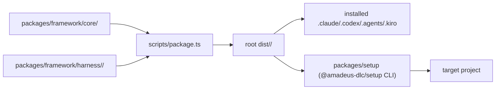
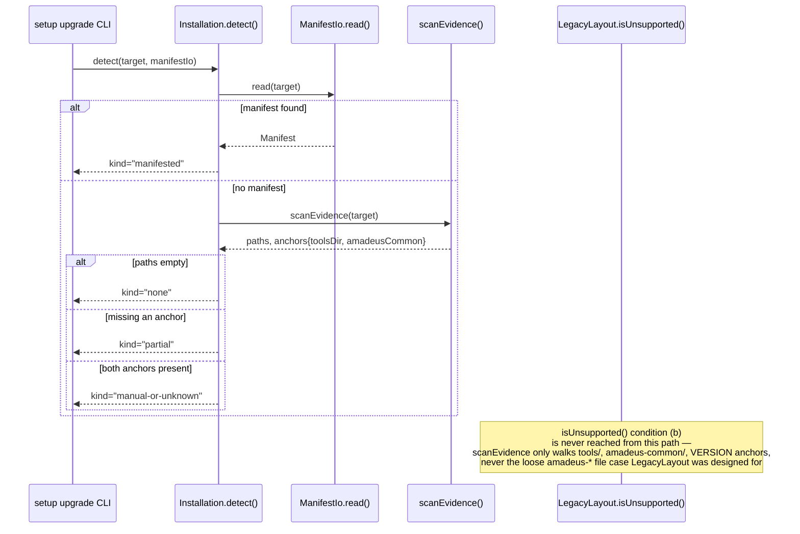
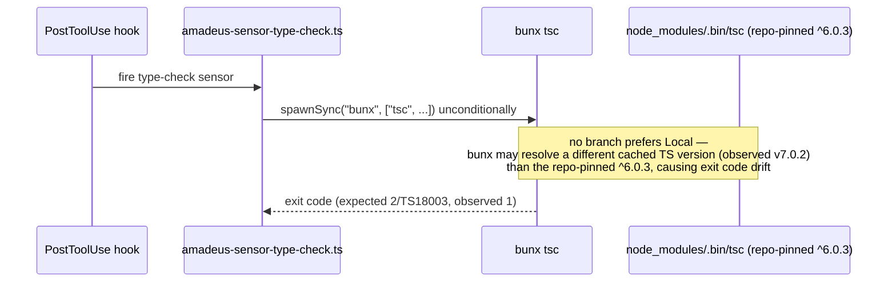

# アーキテクチャ

## 現在の全体構造

Amadeus は one-core-many-harnesses 型の architecture を維持している。`packages/framework/core/` と `packages/framework/harness/<name>/` が物理 source、`scripts/package.ts` が `dist/<name>/` を生成する。前回 intent `260708-installer-distribution` により、この構造の外側に独立配布パッケージ `packages/setup/`(`@amadeus-dlc/setup`)が完成した。本 intent はこの全体構造を変更せず、内部の4件の欠陥を修理する。



<!-- text fallback: packages/framework/{core,harness} が scripts/package.ts に取り込まれ root dist/<name>/ を生成する。dist はこのリポジトリの自己 install(Runtime)と、packages/setup の CLI が第三者プロジェクトへ配布する内容の両方の元になる。 -->

## 相互作用図 — 修理対象4バグの実装経路

### #656 installation.ts の evidence 検出と LegacyLayout 判定



<!-- text fallback: Installation.detect(packages/setup/src/domain/installation.ts:28-47)はmanifest読取→scanEvidence→3分岐(none/partial/manual-or-unknown)で完結し、LegacyLayout.isUnsupported(upgrade.ts:95-114)の条件(b)を呼ぶ経路が存在しない。scanEvidence(installation.ts:114-151)はengineDirごとにtools/・amadeus-common/・VERSIONの3アンカーのみ検査し、loose なamadeus-*ファイルは一切見ない。 -->

### #657 sensor-type-check.ts の tsc 起動経路



<!-- text fallback: core/tools/amadeus-sensor-type-check.ts:173-174 は無条件で spawnSync("bunx", ["tsc", ...]) を呼ぶ。repo がピンする typescript ^6.0.3 の node_modules/.bin/tsc を優先する分岐がなく、bunx が別バージョンを解決すると tests/integration/t92.test.ts:1147-1172(Group N test 44)が期待する exit 2(TS18003)ではなく exit 1 になり赤くなる。同一ファイルは core 正本 + .claude/.codex self-install + dist/* に4重複製されている。 -->

### #641 hooks の worktree cwd アンカードリフト

```mermaid
sequenceDiagram
  participant Hook as .claude hook script
  participant Lib as amadeus-lib.ts resolveProjectDirFromHook()
  participant Env as CLAUDE_PROJECT_DIR env
  participant PathCalc as hook script path 逆算
  participant CwdProbe as cwd probe
  participant Engine as amadeus-orchestrate.ts (engine)

  Hook->>Lib: resolveProjectDirFromHook()
  Lib->>Env: check CLAUDE_PROJECT_DIR
  alt env set and valid
    Env-->>Lib: launch dir (may be stale for worktree)
  else fallback
    Lib->>PathCalc: derive from hook script path
    PathCalc-->>Lib: launch dir
  end
  Lib-->>Hook: resolved project dir (often launch dir)
  Engine->>Engine: runs with worktree cwd
  Note over Hook,Engine: hooks write audit shard/state under launch-dir-derived path;<br/>engine writes/reads record dir under worktree cwd —<br/>two trees diverge, human-presence gate rejects
```

<!-- text fallback: .claude/tools/amadeus-lib.ts:240-259 resolveProjectDirFromHook() は (1)CLAUDE_PROJECT_DIR env (2)hookスクリプトパス逆算 (3)cwd probe (4)cwd の優先順で解決するが、worktree セッションでは(2)がlaunch dirを返しやすく、engine 側はworktree cwdで走るため、hooksが書くshard/stateとengineが読むrecord dirが別ツリーに分岐する。CLAUDE_PROJECT_DIR がworktree切替に追従する保証はライブラリ内にない。 -->

## 正規化の影響(既存の判断の帰結)

`packages/setup` は前回 intent で完成し、上記4バグは完成後の運用フェーズで見つかった欠陥である。architecture の骨格(one-core-many-harnesses、staged layout)自体は変更しない。修理は各コンポーネント内部の実装の是正であり、architecture decision を新たに要さない。ただし #657 の修理は「正本1箇所を直し、`scripts/package.ts`・`promote:self` で全複製先へ伝播する」という既存の配布規律を必ず踏襲する必要がある。
