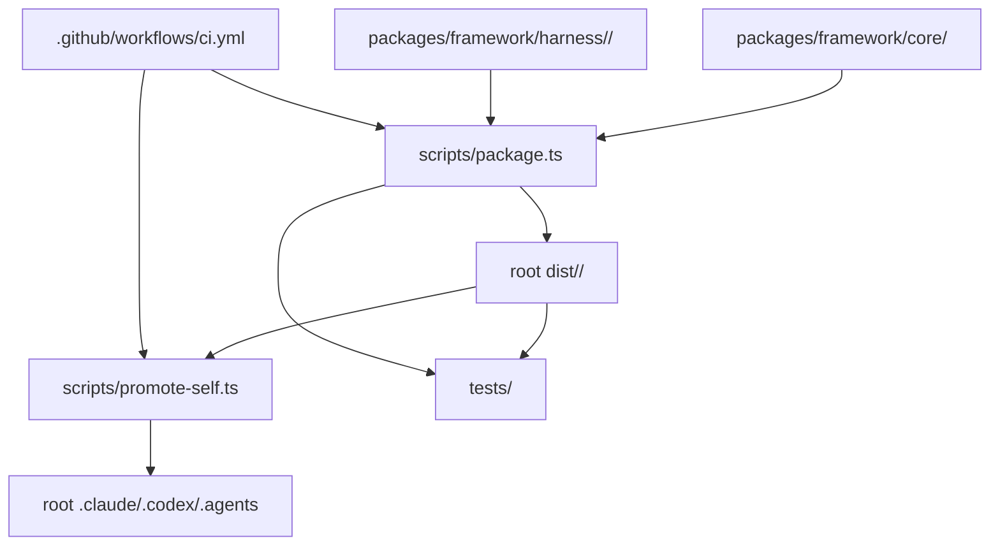
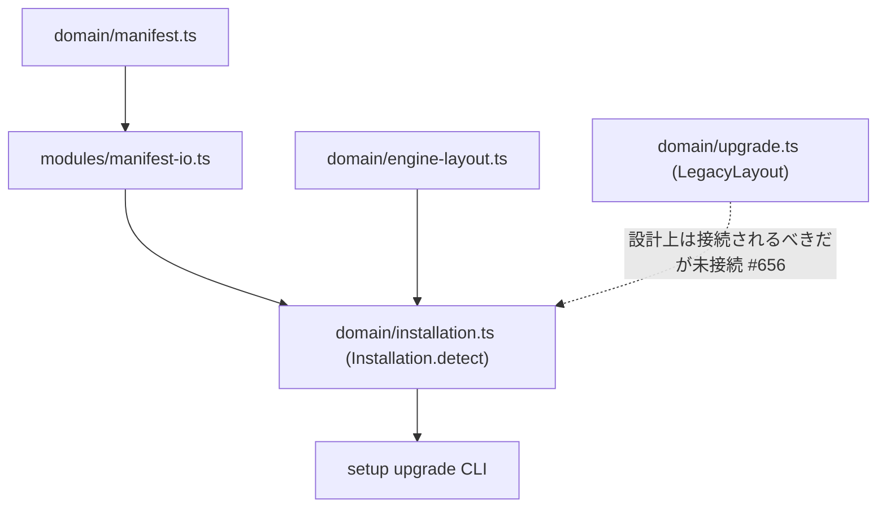
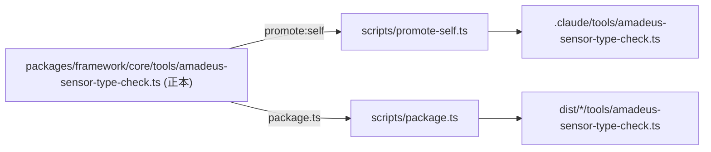
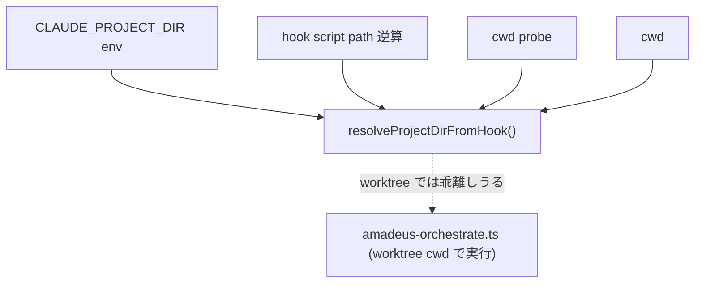

# 依存関係

## 内部依存グラフ(既存 framework 配布経路、変更なし)

<!-- text fallback: packages/framework/{core,harness} が scripts/package.ts に取り込まれ root dist/<name>/ を生成し、promote-self 経由で root .claude/.codex/.agents に反映される。CI がこの一連を実行する。この経路は本 intent で変更しない。 -->

## `@amadeus-dlc/setup` の内部依存(完成済み、#656 に関連)

<!-- text fallback: Installation.detect は ManifestIo と EngineLayout に依存して4分岐(none/manifested/manual-or-unknown/partial)を返すのみで、domain/upgrade.ts の LegacyLayout には依存していない。この欠落した依存が #656 の構造的原因である。 -->

## センサー複製の依存関係(#657 に関連)

<!-- text fallback: 正本(core)の修正は scripts/package.ts と scripts/promote-self.ts の両方を経由しないと .claude コピーと dist コピーに反映されない。#657 の修理コミットはこの3ステップを同一コミットに含める必要がある。 -->

## hooks の cwd 依存関係(#641 に関連)

<!-- text fallback: resolveProjectDirFromHook() は4段フォールバックのいずれも worktree cwd を正として保証しないため、engine の実行 cwd と分岐しうる。 -->

## 外部依存関係

Framework 本体・`packages/setup` に新規の外部依存追加はない(前回 intent で完成した状態を維持)。CI が依存する外部要素も変更なし(`oven-sh/setup-bun@v2` 等)。

## Sibling intent 依存関係

前回 intent `260708-installer-distribution` は完了済み(commit 8510281ae 時点でマージ)。本 intent `260709-framework-repair-batch` はその成果物(`packages/setup` の完成)を前提として、無関係な4件のバグを修理する独立バッチである。4件は互いに独立したコード領域(setup CLI、センサー、hooks、ドキュメント)にあり、修理順序に依存関係はない。
