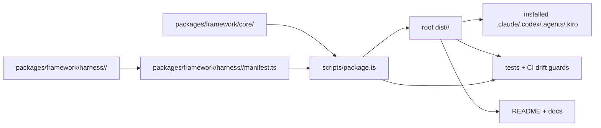
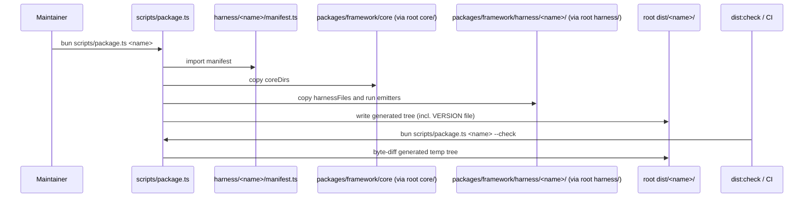
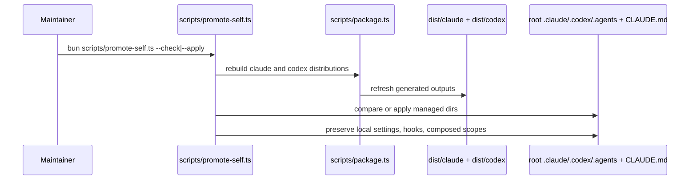
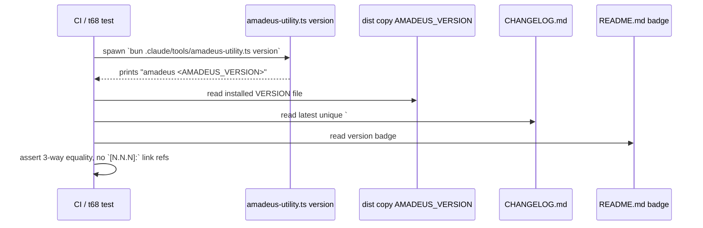
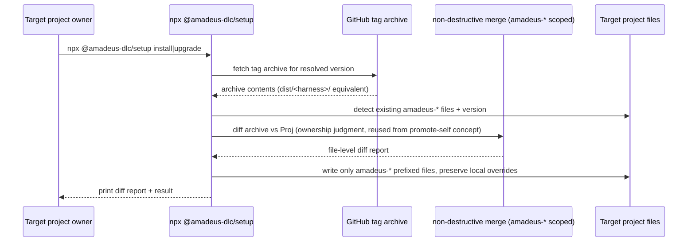

# アーキテクチャ

## 現在の全体構造

Amadeus は one-core-many-harnesses 型の architecture である。物理的な source は `packages/framework/core/` と `packages/framework/harness/<name>/` に置かれる(かつて互換のため存在した root `core/`・`harness/` シンボリックリンクは PR #644(2026-07-08)で削除され、現在は `packages/framework/` 配下が唯一の参照先)。`scripts/package.ts`(root にとどまる実行可能な source of truth)が `harness/<name>/manifest.ts` を走査して harness 一覧を解決し、`dist/<name>/` を生成する。

<!-- text fallback: packages/framework/core と packages/framework/harness/<name> が唯一の物理 source(root symlink は PR #644 で削除)。scripts/package.ts は packages/framework/harness/<name>/manifest.ts を読み、packages/framework/core/ から coreDirs を、packages/framework/harness/<name>/ から harnessFiles を projection して root dist/<name>/ を書く。dist は runtime install 先、tests、docs から参照される。 -->

`packages/framework/package.json`(`@amadeus-dlc/framework`, private:true, version 0.0.0)は独自のビルドロジックを持たず、`dist`/`dist:check`/`promote:self`/`promote:self:check` スクリプトはすべて `../../scripts/*.ts` への薄い委譲である。root `scripts/` が実行可能な source of truth という位置づけは layout-normalization intent 後も変わっていない。

## レイアウト結合

- `scripts/package.ts` は `REPO_ROOT`、`FRAMEWORK_ROOT = join(REPO_ROOT, "packages", "framework")`、`CORE_ROOT = join(FRAMEWORK_ROOT, "core")`、`HARNESS_ROOT = join(FRAMEWORK_ROOT, "harness")` を定義する。
- `scripts/package.ts` は `../packages/framework/core/tools/amadeus-version.ts` から `AMADEUS_VERSION` を直接 import する。
- `scripts/package.ts` は `harness/<name>/manifest.ts` の存在で harness を検出し、出力を `<root>/dist/<name>` に書き込む。
- `scripts/promote-self.ts` は `dist/claude/.claude` → root `.claude`、`dist/codex/.codex` → root `.codex`、`dist/codex/.agents` → root `.agents` を compare/apply する。local settings・hooks・composed scopes などの preservation rule を持つ。
- tests・docs は root `dist/` を user-visible install source として参照し続けている(`tests/harness/fixtures.ts` の `AMADEUS_SRC = <REPO_ROOT>/dist/claude/.claude` など)。

`packages/setup` はこの構造の外側に追加される新規パッケージであり、上記の layer には依存するが、上記 layer からは依存されない一方向の関係になる想定である。

## 相互作用図

### パッケージ生成トランザクション

<!-- text fallback: Maintainer が bun scripts/package.ts <name> を実行すると、script が manifest を import し、core/harness の内容を coreDirs/harnessFiles に従ってコピー・emitter 実行し、dist/<name>/ に書き込む(AMADEUS_VERSION から VERSION ファイルも生成)。--check では同じ処理を一時ツリーに対して行い、commit 済み dist との byte diff を取って drift を検出する。 -->

### 自己昇格トランザクション

<!-- text fallback: promote-self は package.ts を再実行して dist/claude, dist/codex を最新化し、その内容を root .claude/.codex/.agents/CLAUDE.md と比較(--check)または適用(--apply)する。settings.json、settings.local.json、worktrees/、config.toml など preservation rule 対象は上書きしない。 -->

### バージョン同期(t68)トランザクション

<!-- text fallback: t68 は amadeus-utility.ts version の実出力、dist コピーの VERSION、CHANGELOG の最新見出し、README バッジの4点が一致することを検証する実行結果ベースのゲートである。CHANGELOG の見出しに対応する git tag はまだ一つも存在しない。 -->

### 計画中のインストーラ導入/更新トランザクション

<!-- text fallback: これは requirements-analysis / functional-design で確定させる計画上のフローである。setup CLI は GitHub の tag アーカイブを fetch し、対象プロジェクト内の amadeus-* prefix ファイルのみを対象に、promote-self.ts の ownership 判定・diff・preservation の考え方を再利用した non-destructive merge を行い、file-level diff report をユーザーに提示する。 -->

## 正規化の影響(既存の判断の帰結)

前回 intent `260707-layout-normalization` の判断は「staged layout 継続」に相当する結果として実装された。framework source は `packages/framework/{core,harness}` に物理配置されたが、`dist/`・`scripts/`・`tests/` は root にとどまる。root `core`/`harness` の互換シンボリックリンクは一時的に存在したが PR #644 で削除され、全消費者(scripts/tsconfig/biome/knip/tests)が `packages/framework/` を直接参照する。この intent はこの決定を変更せず、その外側に `packages/setup` を独立パッケージとして追加する。

`packages/setup` を追加するにあたり必要になる architecture decision は次の通り。

- setup パッケージが GitHub から取得する対象は tag アーカイブか、`dist/<harness>/` 相当の生成物を含む形か(現状 `dist/` は commit 済みなので tag アーカイブに同梱される)。
- non-destructive merge のロジックを `scripts/promote-self.ts` から抽出・共有するか、setup 側で独立実装するか。
- `packages/setup` 自身のバージョンと `AMADEUS_VERSION` の関係(独立 semver か、連動か)。
- publish workflow・tag 発行の自動化をこの intent の scope に含めるか、別途整備するか。
