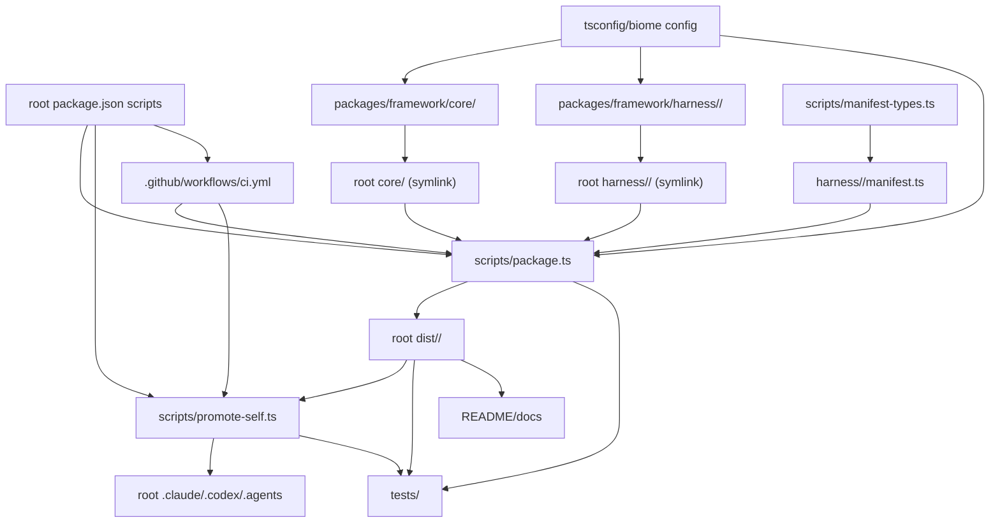
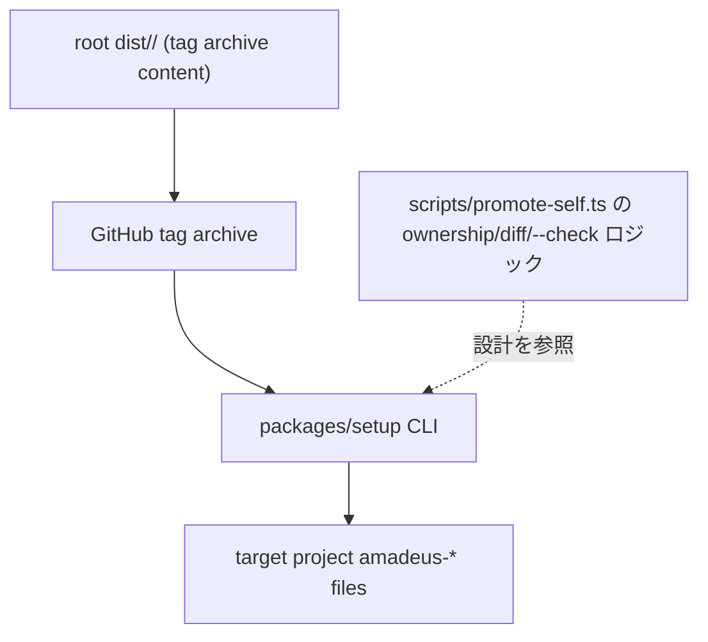

# 依存関係

## 内部依存グラフ(既存 framework 配布経路)

<!-- text fallback: packages/framework/core, packages/framework/harness/<name> が root core/harness シンボリックリンク経由で scripts/package.ts に取り込まれ、manifest.ts の projection に従って root dist/<name>/ を生成する。dist は promote-self 経由で root .claude/.codex/.agents に反映され、tests・docs からも参照される。CI は package.json のスクリプトを通じて package.ts と promote-self.ts を実行する。 -->

## installer が追加する依存関係(計画)

<!-- text fallback: setup CLI は dist/<name>/ を内容とする GitHub tag archive を fetch し、target project の amadeus-* prefix ファイルへ書き込む。non-destructive merge の設計は scripts/promote-self.ts の ownership 判定・diff・--check ロジックを参照するが、直接の実行時依存関係にはならない(概念の再利用)。 -->

## レイアウトと配布に重要な既存依存関係

| 依存関係 | 現在の形 | installer への含意 |
| --- | --- | --- |
| `scripts/package.ts` → `packages/framework/core` | `FRAMEWORK_ROOT`/`CORE_ROOT` 定数経由の直接 import | installer には影響しない(生成後の dist を消費するため) |
| `scripts/package.ts` → `packages/framework/harness` | manifest discovery による root directory scan | installer には影響しない |
| manifests → `packages/framework/{core,harness/<name>}` | 相対 `src` projection semantics | installer は関与しない |
| `scripts/promote-self.ts` → `dist/` | hardcoded managed dirs、preservation rules | **installer の non-destructive merge 設計が直接参照するロジック** |
| tests → `dist/` | fixture の anchor(`AMADEUS_SRC` 等） | installer テストも同様の anchor パターンを踏襲すべき |
| docs → `dist/` | install commands と contributor guide | installer 追加後、README/docs に npm/npx/bunx の記述が新規に必要 |
| CI → root scripts | `package.json` commands | installer 用の publish/lint ワークフローは現状皆無で新設が必要 |

## 外部依存関係

Framework 本体(`packages/framework`, `scripts/`）に実行時依存はない。CI が依存する外部要素は次の通り。

- `bun run dist:check`
- `bun run promote:self:check`
- GitHub Actions(`oven-sh/setup-bun@v2`、bun 1.3.13 pin）

installer(`packages/setup`）は次の新規外部依存を持つ可能性が高い。

- GitHub の tag アーカイブ取得先(API または生アーカイブ URL）— 現状 `git tag -l` は0件で、フェッチ対象となる tag が存在しない。tag 発行の仕組みをこの intent の前提として整備する必要がある。
- npm publish 先(npm registry）— 現状このリポジトリからの publish 実績はゼロ。

## Sibling intent 依存関係

`packages/framework` への layout 正規化は前 intent `260707-layout-normalization` で完了済み(commit `bc9a6043` 時点の判断が実装された状態）。この intent `260708-installer-distribution` はその成果を前提として `packages/setup` を追加する、まさに `packages/setup` を対象とする intent である。

project.md の是正事項「`packages/setup` は別 intent の sibling dependency として扱い、この intent の実装スコープに吸収しない」は前 intent(`260707-layout-normalization`)の実装スコープを対象に affirm されたものであり、その intent が `packages/setup` を自スコープに取り込まないよう歯止めをかけた記録である。本 intent はその sibling 先そのものにあたるため、この是正事項は「他の intent が `packages/setup` を勝手に実装しない」という境界として今後も維持しつつ、`packages/setup` の実装自体は本 intent の正当なスコープとして扱う。なお本 reverse-engineering(stage 2.1)自体はスキャン/synthesis 段階であり、setup パッケージの実装は次工程(requirements-analysis 以降)で行う。
