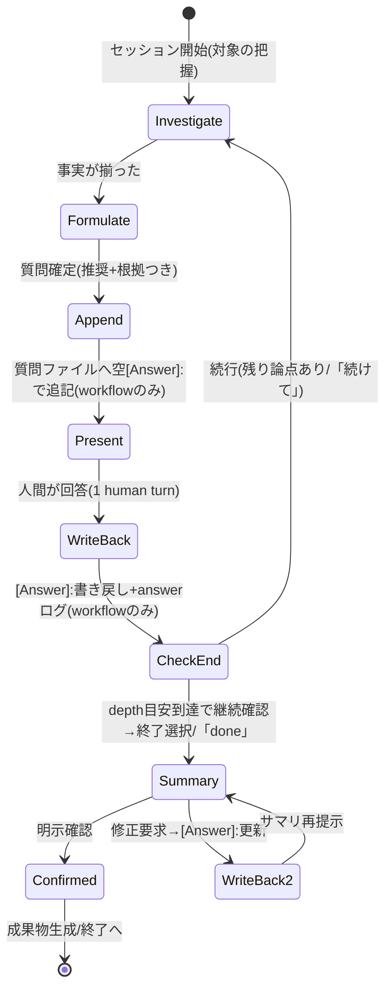

# Business Logic Model — Amadeus Grilling 統合

**Intent**: Amadeus Grilling 統合 / **Stage**: functional-design (3.1)
**Upstream**: `../../inception/requirements-analysis/requirements.md`。OQ-1 / OQ-2 の検証結果を本書で確定する。

## OQ 検証結果(requirements の Open Questions への回答)

### OQ-1: 「1問ずつ+推奨」は question-rendering annex の枠内か → **成立(annex 拡張不要)**

検証方法: 4ハーネスの annex と claude 版の実レンダリングを検査。

- annex のバッチング制約は「**最大**4問/呼び出し」— 上限であって下限ではなく、**1問だけの提示は既存仕様の範囲内**。スペックブロック(```question```)は元々1ブロック=1質問。
- 推奨表記は「質問文に根拠+先頭選択肢に (推奨)」— 既存の AskUserQuestion 運用(推奨を先頭に置く)と同型で、スペックの `prompt` / `options[].label` に載る。annex のフィールドマッピングに変更不要。
- 実証: 本ワークフロー自身が1問だけの構造化質問(scope-definition Q5 等)を既存機構で提示済み。

**結論**: 規律はプロトコル層(新設 Step 3d)で定義し、annex には一切手を入れない。NFR-2 / Out of Scope 3 と整合。

### OQ-2: 1問ごとの監査ログは在席ゲートと衝突しないか → **成立(設計変更不要)**

検証方法: `core/tools/amadeus-log.ts` の実装読解(L121-140)+本ワークフローでの実測。

- ゲートの実装は「最後の QUESTION_ANSWERED **以降**に HUMAN_TURN が台帳に1つあれば次の answer を受理」(consume-once)。
- grilling は1問提示→人間が回答(mint-presence フックが HUMAN_TURN を記録)→ answer ログ、の厳密な 1:1:1 交互列になるため、**ゲートの設計意図と完全に一致する**。むしろバッチ回答(1 human turn で複数回答)より自然。
- 実測: 本ワークフローで answer を1ターン1回ペースで連続記録し、全件受理を確認。

**結論**: FR-3.1(1問ごとログ)はそのまま実装可能。人間ゲートへの差し戻し不要。

## grilling 対話ループ(中核ロジック)



テキストフォールバック(番号順):
1. **Investigate** — 対象(ステージ文脈/スキル引数)と関連事実をコードベース・成果物・codekb から自己調査。事実確認の質問は生成しない(FR-1.4)。
2. **Formulate** — 次の1問を組み立てる: 判断質問(kind=judgement)または確度つき推定確認(kind=estimate-confirm)。質問文に推奨の根拠、先頭選択肢に「(推奨)」(FR-1.3)。
3. **Append** — (workflow のみ)質問ファイルに空 `[Answer]:` タグつきで追記(FR-1.5)。**提示より先に書く**(中断時の Stop フック規約 — AC-4.4)。提示前に `amadeus-log.ts decision` を記録。
4. **Present** — annex 経由で1問だけ提示(FR-1.2)。estimate-confirm で不同意なら judgement 質問に降格して再提示(FR-1.4)。
5. **WriteBack** — 回答を `[Answer]:` に即時書き戻し、`amadeus-log.ts answer` を1問ごとに記録(FR-1.5, FR-3.1)。
6. **CheckEnd** — 「done」→ 7 へ短絡。depth 目安(askedCount ≥ 目安上限)→ 継続確認を1問として提示(「続けて」なら 1 へ)。残り論点があれば 1 へ(FR-1.6)。
7. **Summary** — 全決定事項の合意サマリを提示し明示確認を要求(FR-1.7)。修正要求は該当 `[Answer]:` を更新して再提示(AC-4.2)。確認が取れるまで生成フローへ遷移しない(AC-4.3)。
8. **Confirmed** — workflow: ステージの成果物生成へ引き渡す。standalone: 端末にサマリ表示して終了(明示要求時のみ指定パスへ書き出し — FR-2.3)。

## 2つの実行文脈の差分

| 観点 | Grill me モード(workflow) | /amadeus-grilling(standalone) |
|---|---|---|
| 開始 | ステージのモード選択で「Grill me」(FR-1.1) | スキル起動+引数で対象指定(FR-2.2) |
| 質問ファイル | 必須(追記+書き戻し) | なし(端末のみ) |
| 監査ログ | decision/answer を1問ごと(FR-3.1) | なし(read-only 分類 — FR-2.1) |
| 終了後 | ステージ成果物生成へ | 端末サマリ(+明示要求時の書き出し) |
| 共通 | 1問ずつ/推奨+根拠/事実自己調査/推定降格/ハイブリッド終了/合意確認 — **規律定義は単一ソースを共有** | 同左 |

## 規律定義の配置(単一ソース)

共有規律は **新設 `amadeus-common/protocols/grilling-protocol.md`** に置く(MIT 帰属コメントもここ — FR-4.1):
- stage-protocol.md Step 3d は本プロトコルを参照する薄い節(モード選択への配線+workflow 固有の質問ファイル/監査義務)
- スキル `core/skills/amadeus-grilling/SKILL.md` も同プロトコルを参照(standalone 固有の入出力のみ定義)。配布経路はハーネスで異なる: claude/kiro/kiro-ide は manifest coreDirs、codex は emit.ts のセッションスキル配列(詳細は business-rules BR-P3)

これにより規律の二重定義を避け(不可分1パッケージ — scope-document)、4ハーネスへは package.ts の既存コピーで配布される(NFR-2: protocols/ は全ハーネス共通配布)。
