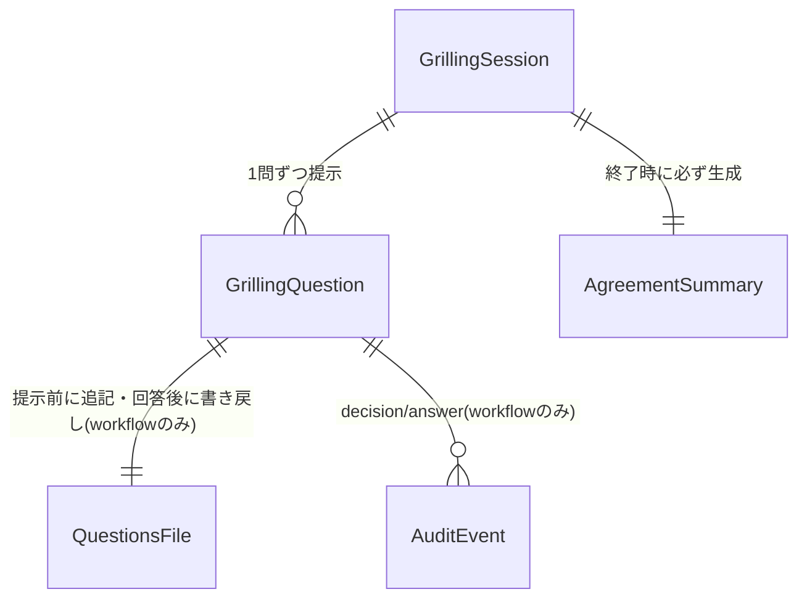

# Domain Entities — Amadeus Grilling 統合

**Intent**: Amadeus Grilling 統合 / **Stage**: functional-design (3.1)
**Upstream**: `../../inception/requirements-analysis/requirements.md`(FR-1〜FR-4)。units-generation / application-design はスコープ SKIP のため、codekb `architecture.md` / `component-inventory.md` の既存アーキテクチャに直接設計する。

## エンティティ一覧

### GrillingSession(概念エンティティ — 永続化しない)

grilling 対話の1回の実行。ワークフローモード(Grill me)とスタンドアロン(/amadeus-grilling)の両文脈で同一の規律を持つ。

| 属性 | 型 | 説明 |
|---|---|---|
| context | `workflow \| standalone` | 実行文脈。監査義務(FR-3)は workflow のみ |
| subject | string | 深掘り対象(ステージの質問トピック、またはスキル引数の対象) |
| depthTarget | `minimal \| standard \| comprehensive` | 質問量の目安(stage-protocol §3 の既存 depth 契約を参照) |
| askedCount | number | 提示済み質問数(継続確認の判定に使用) |
| state | 下記状態機械 | セッション状態 |

**状態機械**: `investigating`(事実の自己調査)→ `questioning`(1問提示中)→ `confirming`(合意サマリ確認中)→ `closed`(確認済み終了)。`questioning` ⇄ `investigating` は質問ごとに循環。任意の `questioning` 時点から「done」で `confirming` へ短絡(FR-1.6)。`confirming` から修正要求で `questioning` へ戻れる(AC-4.2)。

### GrillingQuestion

1つの深掘り質問。**必ず1問ずつ提示される**(FR-1.2)。

| 属性 | 型 | 説明 |
|---|---|---|
| prompt | string | 質問文。**推奨の根拠を含む**(FR-1.3) |
| options | Option[] | 選択肢。**先頭が推奨案で「(推奨)」を明記**(FR-1.3)。「X. Other」は**質問ファイル表現の属性**として常に末尾(既存契約)。対話提示時の Other はハーネスのビルトイン/annex 規定に委譲し、スペック options には含めない(frontend-components C-2 参照) |
| kind | `judgement \| estimate-confirm` | 判断を問う通常質問か、推定(確度つき)の確認か(FR-1.4) |
| confidence | `high \| medium \| low`(estimate-confirm のみ) | 自己調査による推定の確度 |
| answerTag | `[Answer]:` 行 | 質問ファイル上の書き戻し先。**提示前に空タグで追記される**(FR-1.5、Stop フックの human-wait 判別規約) |

### AgreementSummary(合意サマリ)

セッションの全決定事項の一覧。`confirming` 状態で提示され、**明示確認を得るまで成果物生成/終了をブロックする**(FR-1.7)。

| 属性 | 説明 |
|---|---|
| decisions | 質問→回答の対応リスト(質問ファイルの `[Answer]:` と1:1) |
| confirmed | ユーザーの明示確認(これが true になるまで生成フローへ遷移しない — AC-4.3) |
| exportPath | standalone のみ・ユーザーが明示要求したときのみ設定(FR-2.3) |

### QuestionsFile(既存エンティティ — 変更なし、契約の再確認)

`<record>/<phase>/<stage>/<stage>-questions.md`。**唯一の権威レコード**。grilling は動的に質問を追記するが、ファイル形式(A-E + X、`[Answer]:` タグ)と「空タグ=未回答」の規約を完全に継承する。standalone 文脈ではファイルを作らない(端末のみ — FR-2.3)。

### 監査イベント(既存エンティティ — 変更なし)

`DECISION_RECORDED`(提示前)/ `QUESTION_ANSWERED`(回答後、1問ごと — FR-3.1)。新イベント型は追加しない(FR-3.2)。standalone は監査対象外(read-only 分類)。

## エンティティ関係

テキストフォールバック: GrillingSession は複数の GrillingQuestion を1問ずつ持ち、終了時に必ず1つの AgreementSummary を生成する。workflow 文脈では各 GrillingQuestion が QuestionsFile への追記/書き戻しと監査イベント(DECISION_RECORDED / QUESTION_ANSWERED)を伴う。standalone 文脈では QuestionsFile と AuditEvent への関係が消える(端末のみ)。

## 設計上の不変条件

1. `questioning` 状態で同時に提示される質問は常に1つ(FR-1.2)
2. QuestionsFile 上の空 `[Answer]:` タグ数 = 未回答質問数(中断安全性 — AC-4.4)
3. `closed` に至る唯一のパスは `confirming` の明示確認経由(FR-1.7)
4. standalone セッションはワークフロー状態・監査ログ・ファイルシステム(明示要求の書き出しを除く)に副作用を持たない(FR-2.1, FR-2.3)
