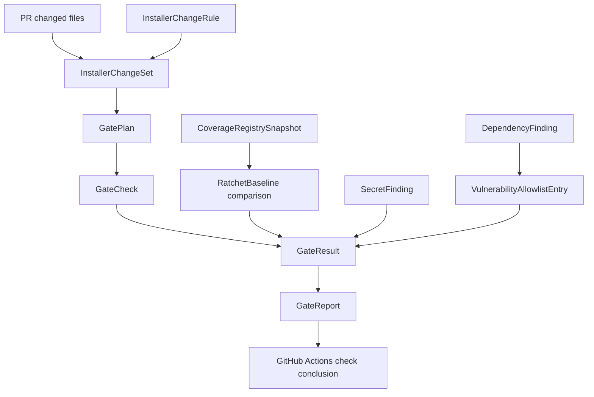

# Domain Entities — U7 CI And Package Gates

> Stage: construction / functional-design  
> Unit: U7 CI And Package Gates  
> Upstream: `unit-of-work.md`, `unit-of-work-story-map.md`, `requirements.md`, `components.md`, `component-methods.md`, `services.md`

## Entity Catalog

| Entity | Type | Owner | Purpose |
|---|---|---|---|
| InstallerChangeSet | value object | CI gate | PR changed files and matched installer scopes |
| InstallerChangeRule | value object | CI gate | path pattern and rationale for installer-related detection |
| GatePlan | aggregate | CI gate | ordered/parallelizable list of required checks |
| GateCheck | entity | CI gate | one executable validation gate |
| GateResult | value object | CI gate | result, logs, diagnostics, and failure classification |
| CoverageRegistrySnapshot | value object | U6/U7 | `covers:` registry state at baseline and PR head |
| RatchetBaseline | value object | U7 | main branch baseline used to prevent coverage regression |
| DependencyFinding | value object | security gate | vulnerability or advisory finding |
| SecretFinding | value object | security gate | normalized secret scanner finding without secret value |
| VulnerabilityAllowlistEntry | entity | security gate | explicit exception with rationale and expiry |
| PackageMetadataCheck | entity | package gate | `checkPackageMetadata` result item |
| GateReport | aggregate | CI gate | human-readable and machine-readable gate summary |

## Type Sketch

```ts
type InstallerChangeScope =
  | "setup-package"
  | "installer-test"
  | "installer-docs"
  | "release-workflow"
  | "package-metadata"
  | "installer-ci";

type InstallerChangeSet = {
  files: string[];
  installerRelated: boolean;
  scopes: InstallerChangeScope[];
  matchedRules: Array<{ file: string; ruleId: string; scope: InstallerChangeScope }>;
};

type InstallerChangeRule = {
  id: string;
  pattern: string;
  scope: InstallerChangeScope;
  reason: string;
};

type GateName =
  | "package-dry-run"
  | "installer-smoke"
  | "installer-integration"
  | "coverage-registry"
  | "typecheck"
  | "lint"
  | "dist-check"
  | "promote-self-check"
  | "dependency-audit"
  | "secret-scan"
  | "package-metadata";

type GatePlan = {
  changeSet: InstallerChangeSet;
  status: "required" | "skipped";
  gates: GateCheck[];
};

type GateCheck = {
  name: GateName;
  command: string;
  cwd: string;
  checkName: string;
  inputs: string[];
  outputArtifact?: string;
  blocking: true;
  dependsOn: GateName[];
  pathCondition: string;
  timeoutMinutes?: number;
};

type GateResult =
  | { name: GateName; status: "passed"; durationMs: number; summary: string }
  | { name: GateName; status: "skipped"; reason: string }
  | { name: GateName; status: "passed-with-exception"; exceptionId: string; summary: string }
  | { name: GateName; status: "failed"; reason: string; diagnosticsPath?: string };

type CoverageRegistrySnapshot = {
  ref: string;
  entries: Array<{
    coverageKey: string;
    requirementOrStory: string;
    testFile: string;
    testName?: string;
  }>;
};

type RatchetBaseline = {
  baseRef: string;
  coverageKeys: string[];
  generatedAt: string;
};

type DependencyFinding = {
  advisoryId: string;
  packageName: string;
  affectedRange: string;
  severity: "low" | "medium" | "high" | "critical";
  reachable: boolean;
  surface: "installer-runtime" | "publish-tooling" | "dev-only" | "unknown";
};

type DependencyFindingsFile = {
  schemaVersion: 1;
  scanner: string;
  generatedAt: string;
  findings: DependencyFinding[];
};

type SecretFinding = {
  ruleId: string;
  fingerprint: string;
  path: string;
  line?: number;
  verified: boolean;
  severity?: "low" | "medium" | "high" | "critical";
};

type SecretFindingsFile = {
  schemaVersion: 1;
  scanner: string;
  generatedAt: string;
  findings: SecretFinding[];
};

type VulnerabilityAllowlistEntry = {
  id: string;
  advisoryId: string;
  packageName: string;
  affectedRange: string;
  reason: string;
  owner: string;
  expiresAt: string; // YYYY-MM-DD, UTC
};

type VulnerabilityAllowlistFile = {
  schemaVersion: 1;
  entries: VulnerabilityAllowlistEntry[];
};

type GateReport = {
  installerRelated: boolean;
  changeScopes: InstallerChangeScope[];
  results: GateResult[];
  blockingFailureCount: number;
  u8HandoffReady: boolean;
};
```

## Entity Relationships



## Lifecycle States

### GatePlan

| State | Meaning |
|---|---|
| skipped | PR is not installer-related; package-specific U7 gates are not required |
| required | PR is installer-related; all blocking gates must execute |
| completed | every executable gate produced a GateResult |

### GateResult

| State | Meaning |
|---|---|
| passed | gate succeeded without exception |
| passed-with-exception | only vulnerability allowlist with valid rationale/expiry can use this |
| skipped | gate was not applicable because GatePlan was skipped or dependency was intentionally absent |
| failed | PR must not merge until fixed |

## Persistence And Ownership

- `InstallerChangeRule` is repository source, likely workflow config plus a small CI helper.
- `CoverageRegistrySnapshot` is derived from U6 test files and `covers:` entries.
- `RatchetBaseline` is derived from main branch or a checked-in registry baseline.
- `DependencyFindingsFile` and `SecretFindingsFile` are CI artifacts produced by scanner adapters.
- `VulnerabilityAllowlistEntry` is repository source at `packages/setup/security/vulnerability-allowlist.json` and must be reviewed like code.
- `GateReport` is CI output, not long-lived application state.

## Upstream Coverage

- `unit-of-work.md`: U7 primary boundary is represented by `GatePlan`, `GateCheck`, and `GateReport`.
- `unit-of-work-story-map.md`: US-010 maps to `InstallerChangeSet` and required `GateCheck` list.
- `requirements.md`: FR-016 maps to `GateName`, `DependencyFinding`, and `VulnerabilityAllowlistEntry`.
- `components.md`: Package Check maps to `PackageMetadataCheck`; Release Workflow Contract maps to `u8HandoffReady`.
- `component-methods.md`: `PackageCheckResult` is refined into `PackageMetadataCheck` / `GateResult`; `ReleaseWorkflowContract` remains a downstream consumer.
- `services.md`: GitHub Actions PR Gates own the lifecycle of `GatePlan` and `GateReport`.
