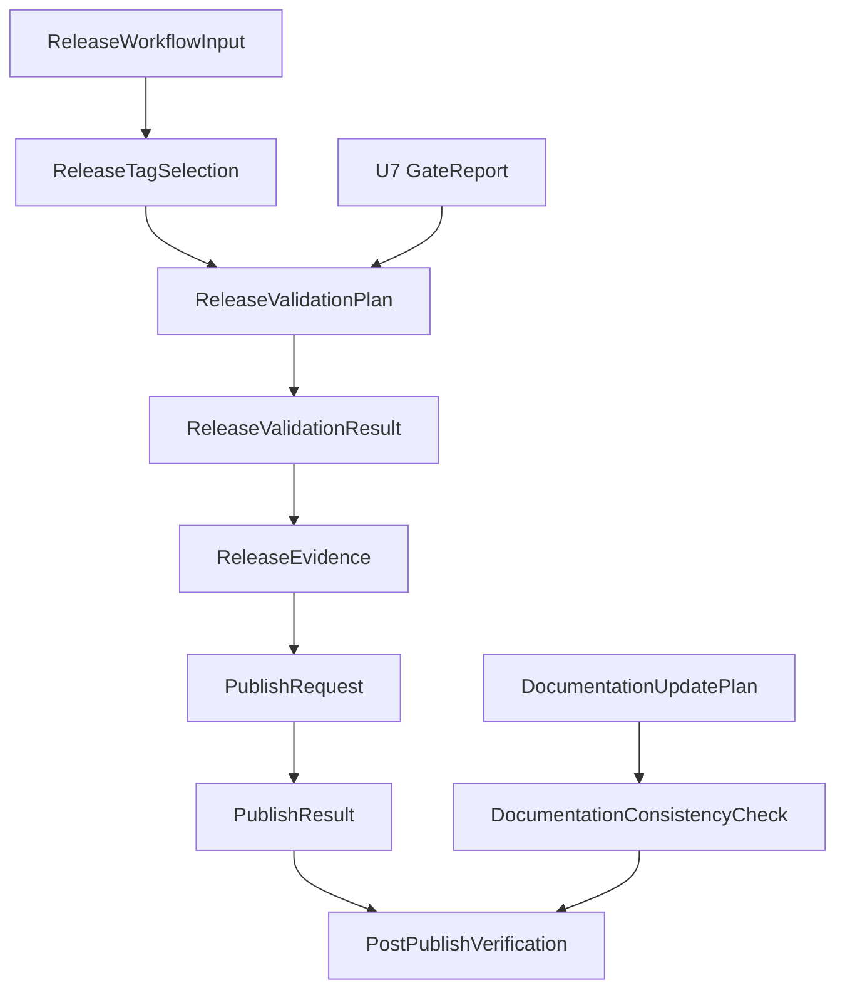

# Domain Entities — U8 Manual Release And Docs

> Stage: construction / functional-design  
> Unit: U8 Manual Release And Docs  
> Upstream: `unit-of-work.md`, `unit-of-work-story-map.md`, `requirements.md`, `components.md`, `component-methods.md`, `services.md`, U7 functional design

## Entity Catalog

| Entity | Type | Owner | Purpose |
|---|---|---|---|
| ReleaseWorkflowInput | value object | release workflow | `workflow_dispatch` input values |
| ReleaseTagSelection | value object | tag selector | selected tag, version, and ignored duplicates |
| ReleaseValidationPlan | aggregate | release workflow | ordered release validation and publish steps |
| ReleaseValidationResult | value object | release workflow | pass/fail result for each validation step |
| ReleaseEvidence | aggregate | release workflow | SBOM/provenance and package dry-run evidence |
| PublishRequest | value object | release workflow | guarded publish parameters |
| PublishResult | value object | release workflow | published/dry-run/failed outcome |
| PostPublishVerification | aggregate | release workflow | npm/package/docs verification after publish |
| DocumentationUpdatePlan | aggregate | docs owner | user-facing docs files and required topics |
| DocumentationConsistencyCheck | value object | docs owner | package/command/version consistency result |

## Type Sketch

```ts
type ReleaseWorkflowInput = {
  tag?: string;
  dryRun: boolean;
  npmDistTag: string;
  confirmPackage: string;
};

type ReleaseTagSelection = {
  sourceRepo: "https://github.com/amadeus-dlc/amadeus";
  sourceTag: string;
  distributionVersion: string;
  explicit: boolean;
  prerelease: boolean;
  ignoredTags: Array<{ tag: string; reason: string }>;
};

type ReleaseStepName =
  | "release-preflight"
  | "package-metadata"
  | "package-dry-run"
  | "installer-smoke"
  | "installer-integration"
  | "coverage-registry"
  | "typecheck"
  | "lint"
  | "dist-check"
  | "promote-self-check"
  | "dependency-audit"
  | "secret-scan"
  | "build"
  | "sbom-provenance"
  | "publish-validation"
  | "publish"
  | "post-publish";

type ReleaseValidationPlan = {
  input: ReleaseWorkflowInput;
  tagSelection: ReleaseTagSelection;
  preflightMode: "release-unconditional";
  steps: Array<{
    name: ReleaseStepName;
    command: string;
    required: true;
    outputArtifact?: string;
  }>;
};

type ReleaseValidationResult =
  | { name: ReleaseStepName; status: "passed"; artifact?: string; summary: string }
  | { name: ReleaseStepName; status: "failed"; reason: string; artifact?: string }
  | { name: ReleaseStepName; status: "skipped"; reason: string };

type ReleaseEvidence = {
  packageName: "@amadeus-dlc/setup";
  packageVersion: string;
  sourceTag: string;
  dryRunTarballReport: string;
  sbomArtifact: string;
  provenanceArtifact: string;
};

type PublishRequest = {
  packageName: "@amadeus-dlc/setup";
  packageVersion: string;
  npmDistTag: string;
  dryRun: boolean;
  confirmPackage: string;
  cwd: "packages/setup";
  command: "npm publish --tag <npm_dist_tag> --access public --provenance";
  versionAlreadyPublished: boolean;
  sbomArtifact: string;
  provenanceArtifact: string;
  environmentApproved: boolean;
  credentialPresent: boolean;
};

type PublishResult =
  | { status: "dry-run"; packageName: string; packageVersion: string; summary: string }
  | { status: "published"; packageName: string; packageVersion: string; npmDistTag: string; registryUrl?: string }
  | { status: "failed"; phase: "validation" | "credential" | "registry"; reason: string };

type PostPublishVerification = {
  packageName: "@amadeus-dlc/setup";
  packageVersion: string;
  checks: Array<{
    name: "npm-metadata" | "bin" | "tarball-contents" | "docs-consistency" | "bunx-help";
    status: "passed" | "failed" | "skipped";
    reason?: string;
  }>;
};

type DocumentationUpdatePlan = {
  files: ["README.md", "packages/setup/README.md"];
  requiredTopics: Array<
    | "bunx install"
    | "npx bun-required caveat"
    | "supported harnesses"
    | "install command"
    | "upgrade command"
    | "target and version flags"
    | "yes and force safety"
    | "manifest path"
    | "manual copy fallback"
    | "manual release workflow"
  >;
};

type DocumentationConsistencyCheck = {
  packageName: "@amadeus-dlc/setup";
  bin: "amadeus-setup";
  forbiddenTerms: ["amadeus-setup init", "init alias"];
  checks: Array<{ file: string; status: "passed" | "failed"; reason?: string }>;
};
```

## Entity Relationships



## Lifecycle States

### ReleaseValidationPlan

| State | Meaning |
|---|---|
| planned | inputs and tag selection are valid |
| validating | required validation steps are running |
| ready-to-publish | all required validation steps passed and dryRun is false |
| dry-run-complete | validation passed but publish intentionally skipped |
| failed | at least one required validation step failed |

### PublishResult

| State | Meaning |
|---|---|
| dry-run | validation completed without publish |
| published | npm registry accepted the package |
| failed | validation, credential, or registry failure prevented publish or completed with failure |

## Persistence And Ownership

- `ReleaseWorkflowInput` exists only in GitHub Actions run context.
- `ReleaseTagSelection`, `ReleaseValidationResult`, `ReleaseEvidence`, `PublishResult`, and `PostPublishVerification` are CI artifacts under `.amadeus-ci/setup/`.
- `DocumentationUpdatePlan` is implemented in repository docs.
- `DocumentationConsistencyCheck` is run in CI/release validation and does not become user runtime state.

## Upstream Coverage

- `unit-of-work.md`: U8 primary boundary maps to release workflow entities and docs entities.
- `unit-of-work-story-map.md`: US-009 maps to `ReleaseWorkflowInput` through `PublishResult`; US-011 maps to `DocumentationUpdatePlan`; US-013 maps to `PostPublishVerification`.
- `requirements.md`: FR-015 maps to docs entities; FR-017 maps to release entities.
- `components.md`: Release Workflow Contract and Documentation Update Owner become first-class entities.
- `component-methods.md`: `ReleaseValidationPlan` type is refined without changing U1-U7 runtime contracts.
- `services.md`: npm Registry Publication owns `PublishResult`; GitHub Actions owns workflow input and validation lifecycle.
- U7 functional design: `U7 GateReport` feeds `ReleaseValidationPlan`.
