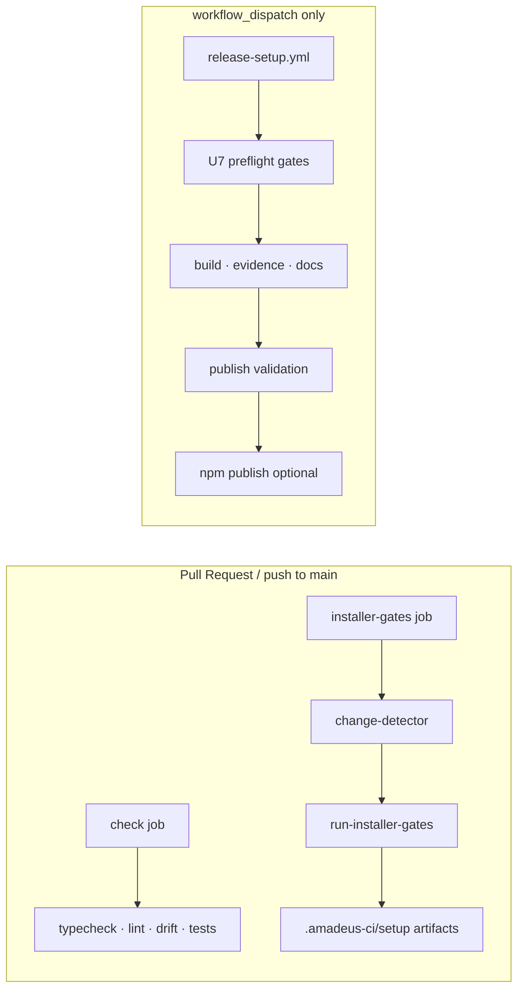

# CI Configuration — インストーラ実装

## Upstream Inputs

本設定は U1–U8 の `code-generation/code-summary.md`、`build-and-test-summary.md`、`build-test-results.md` を入力として、U7 で実装済みの GitHub Actions 配線を文書化する。

## Pipeline Overview



## Workflow: CI (`.github/workflows/ci.yml`)

### Job: `check`

| Step | Command | Purpose |
|------|---------|---------|
| Install | `bun install --frozen-lockfile` | lockfile 整合 |
| Typecheck | `bun run typecheck` | TS 型安全（repo + tests tsconfig） |
| Lint | `bun run lint` | Biome |
| Dist drift | `bun run dist:check` | `core/` + `harness/` → `dist/` 再生成一致 |
| Self-install drift | `bun run promote:self:check` | dist と self-install targets 同期 |
| Tests | `bash tests/run-tests.sh --ci` | smoke + unit + integration tier |

- **Runner**: `ubuntu-latest`
- **Bun**: 1.3.13（`oven-sh/setup-bun@v2`）
- **Concurrency**: `ci-${{ github.ref }}`、in-progress cancel

### Job: `installer-gates`

installer-related 変更のみ U7 gate plan を実行。non-installer PR は skip 成功。

```yaml
# 変更検出（PR base..head または push HEAD^..HEAD）
bun packages/setup/src/maintainer/change-detector.ts --file <path> ... \
  --report .amadeus-ci/setup/change-set.json

# レジストリ駆動 gate 実行
bun packages/setup/src/maintainer/run-installer-gates.ts \
  --change-set .amadeus-ci/setup/change-set.json \
  --summary .amadeus-ci/setup/gate-summary.json
```

- **fetch-depth: 0** — change-detector が diff 範囲を正しく取得
- **Artifact upload**: `.amadeus-ci/setup/`（`if: always()`）

## Workflow: Release Setup (`.github/workflows/release-setup.yml`)

U8 所有。`workflow_dispatch` のみ。

| Job | 役割 |
|-----|------|
| `input-and-tag` | tag 選択、`selected-tag.json` |
| `release-preflight` | U7 全 gate を選択 tag で再実行 |
| `build-and-evidence` | tarball build、SBOM/provenance evidence |
| `docs-consistency` | README / init 禁止など docs gate |
| `publish-validation` | dry-run / confirm_package 検証 |
| `publish` | `dry_run=false` かつ confirm 一致時のみ npm publish |
| `post-publish` | registry 上の package 検証 |
| `release-summary` | artifact + step summary |

## Branch Triggers

| Event | Branches | Workflows |
|-------|----------|-----------|
| `pull_request` | all | CI |
| `push` | `main` | CI |
| `workflow_dispatch` | — | Release Setup |

## Artifact Outputs

| Path | Producer | Consumer |
|------|----------|----------|
| `.amadeus-ci/setup/change-set.json` | change-detector | run-installer-gates |
| `.amadeus-ci/setup/gate-summary.json` | run-installer-gates | PR review / U8 preflight |
| `.amadeus-ci/setup/*.json` | 各 gate script | release preflight、post-mortem |

## Operational Notes

- CI は live model-provider / claude CLI なしでも green（integration self-skip）
- installer gate は **GATE_REGISTRY** SSOT — workflow に gate コマンドを直書きしない（U7 registry-driven リファクタ後）
- `build-test-results.md` 時点: typecheck 122 unit + 8 integration/smoke 全 pass
