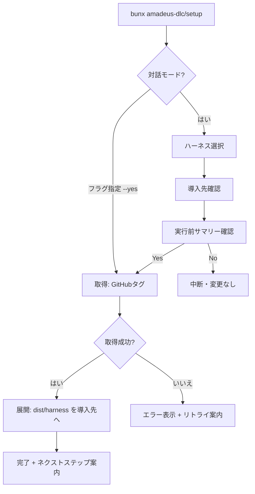
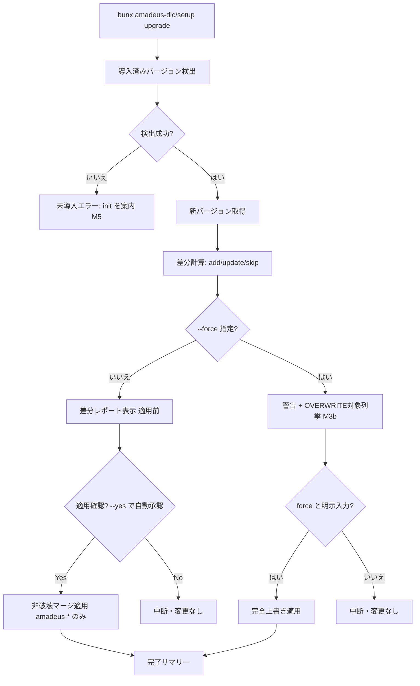

# User Flow — インストーラの実装

> ステージ: rough-mockups (Ideation) / 作成: 2026-07-07
> 上流入力: `../scope-definition/scope-document.md`(IN: init/upgrade)、`../intent-capture/intent-statement.md`(顧客: 新規+既存ユーザー)、`../scope-definition/intent-backlog.md`(Must P1〜P5 / Won't W1〜W7 の境界)

## フロー 1: 新規導入(init)

<!-- Text fallback: initは対話(ハーネス選択→導入先確認→サマリー確認)またはフラグ指定でGitHubから取得し、展開して完了案内。取得失敗はエラー+リトライ案内、サマリーでNoなら変更なしで中断 -->

## フロー 2: 更新(upgrade)

<!-- Text fallback: upgradeは導入済みバージョンを検出(未導入ならinitを案内=M5)、新バージョンを取得して差分を計算。--forceなしは適用前レポート→確認(--yesで自動承認)→非破壊マージ。--forceありは警告とOVERWRITE対象列挙の後「force」の明示入力による二段階確認を経て完全上書き。どちらも拒否なら変更なしで中断 -->

## タッチポイントと感情曲線(要約)

| 段階 | ユーザーの状態 | 設計上のケア |
|------|----------------|--------------|
| コマンド実行前 | README を読んでいる | ワンライナーをコピペするだけにする(成功指標2) |
| ウィザード中 | 選択に迷いうる | 選択肢は4ハーネスのみ・デフォルト値を常に提示 |
| 待機中 | 不安(何が起きている?) | 進行を1行ずつ表示、1分以内に完了(成功指標1) |
| upgrade 確認時 | 上書きへの恐れ | 差分テーブル + 「ユーザーファイルには触れない」明言(成功指標3) |
| 完了後 | 次に何を? | ネクストステップ(/amadeus の起動)を必ず表示 |
