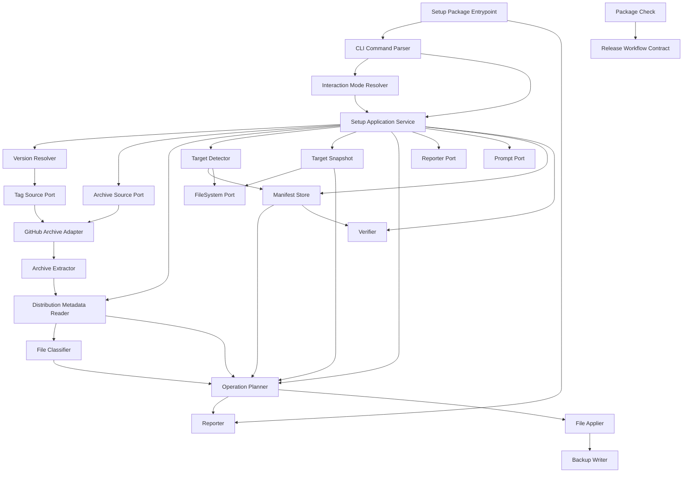

# Component Dependency — インストーラの実装

> Stage: application-design / Intent: `260706-installer-impl`  
> Upstream: `requirements.md`, `stories.md`, `architecture.md`, `component-inventory.md`, `team-practices.md`, refined CLI/DX mockups

## Dependency Principles

- Domain planning components do not depend on filesystem, network, process, or prompt libraries.
- Adapters depend inward on ports, never the reverse.
- `scripts/package.ts` is an upstream producer of distribution artifacts, not a runtime dependency of `packages/setup`.
- `FileOperationPlan` is the main boundary object between policy, reporting, and writes.
- Manifest schema is the only persistent installer-owned target contract.

## Component Graph

## Dependency Matrix

| Component | Parser | Version | Distribution | Metadata | Target | Planner | Applier | Manifest | Reporter | Verifier |
|---|---|---|---|---|---|---|---|---|---|---|
| Entrypoint | Uses | - | - | - | - | - | - | - | Uses | - |
| Setup Application Service | Uses | Uses | Uses | Uses | Uses | Uses | Uses | Uses | Uses | Uses |
| Version Resolver | - | Self | Port only | - | - | - | - | - | - | - |
| Distribution Adapter | - | - | Self | - | - | - | - | - | - | - |
| Metadata Reader | - | - | Reads | Self | - | - | - | - | - | - |
| Target Detector | - | - | - | - | Self | - | - | Reads | - | - |
| Target Snapshot | - | - | - | Reads | Reads | Feeds | - | - | - | - |
| Operation Planner | - | - | - | Reads | Reads snapshot | Self | - | Reads | - | - |
| File Applier | - | - | - | - | - | Reads plan | Self | - | - | - |
| Reporter | - | - | - | - | - | Reads plan | - | - | Self | Reads result |
| Verifier | - | - | - | - | - | - | - | Reads | - | Self |

## Data Flow

### Install Data Flow

| Step | Input | Output | Owner |
|---|---|---|---|
| Parse | argv | `SetupCommand` | CLI Command Parser |
| Mode | TTY/flags | `InteractionMode` | Interaction Mode Resolver |
| Resolve | version request | `ResolvedVersion` | Version Resolver |
| Load | source tag + harness | `LoadedDistribution` | Archive Source Port + Archive Extractor |
| Metadata | distribution root | `DistributionFile[]` | Metadata Reader |
| Target snapshot | target + detection + metadata | `TargetSnapshot` | Target Snapshot |
| Plan | metadata + target + flags | `FileOperationPlan` | Operation Planner |
| Apply | approved plan | copied files/backups | File Applier |
| Manifest | apply result | JSON manifest | Manifest Store |
| Verify | manifest + target | `VerificationResult` | Verifier |

### Upgrade Data Flow

| Step | Input | Output | Owner |
|---|---|---|---|
| Detect | target + optional requested harness + manifest store | `TargetDetection` | Target Detector |
| Snapshot | target + detection + metadata | `TargetSnapshot` | Target Snapshot |
| Read manifest | manifest path | `InstallerManifest` | Manifest Store |
| Compare versions | installed + resolved | version-state outcome | Operation Planner |
| Conservative plan | manual/unknown target | backup-heavy plan | Operation Planner |
| Partial plan | partial target + force policy | no-write or force plan | Operation Planner |

## Shared Resources

| Resource | Access | Components | Notes |
|---|---|---|---|
| Target filesystem | read/write | Target Detector, File Applier, Manifest Store, Verifier | Writes only after approved plan |
| GitHub network | read | GitHub Archive Adapter | retry once; no target writes before success |
| Temp archive dir | read/write | Archive Extractor | adapter-owned lifecycle |
| `amadeus/.installer/amadeus-setup-manifest.json` | read/write | Manifest Store, Target Detector, Verifier | schema-owned by setup package |
| `dist/<harness>/` in archive | read | Archive Extractor, Metadata Reader | produced by existing packager |
| CI workflow | execute | GitHub Actions | release/PR validation, not CLI runtime |
| README/docs | read/write in repo | Documentation Update Owner | installer-first guidance, manual copy no longer primary |

## Coupling Controls

| Risk | Control |
|---|---|
| Planner depends on filesystem details | Target snapshot and distribution metadata are value objects |
| Reporter changes break tests | Plain-text output is canonical and snapshot-testable |
| `scripts/package.ts` becomes runtime dependency | Installer consumes release archive only |
| Backup policy duplicated in applier | Planner emits backup rows; applier enforces rows before overwrite |
| Manifest schema drifts from report | Plan and manifest share `DistributionFile` / operation result mapping |
| Release workflow hides package failures | Package check component and package dry-run are blocking gates |
| Upgrade harness detection requires `--harness` unnecessarily | Target detector reads manifest first; no-manifest ambiguous sentinels prompt or fail no-write |
| Version resolver/archive fetch contract is muddled | Tag listing and archive fetch are separate ports |

## Forbidden Dependencies

- Domain components must not import Node/Bun filesystem APIs directly.
- Version Resolver must not write target files.
- File Applier must not perform version resolution or prompt decisions.
- Reporter must not decide whether an operation can apply.
- Setup package must not import `scripts/package.ts` as runtime logic.
- Root package must not become the publishable installer package.

## Traceability

Dependency boundaries are driven by `requirements.md` FR-003, FR-008, FR-009, FR-010, FR-013, and NFR-003; `stories.md` US-004, US-005, US-007, and US-010; brownfield constraints from `architecture.md` / `component-inventory.md`; and `team-practices.md` around generated dist/self-install drift.
