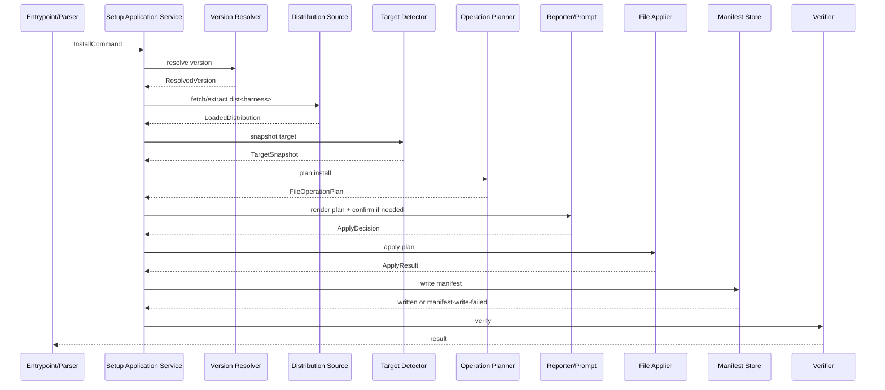
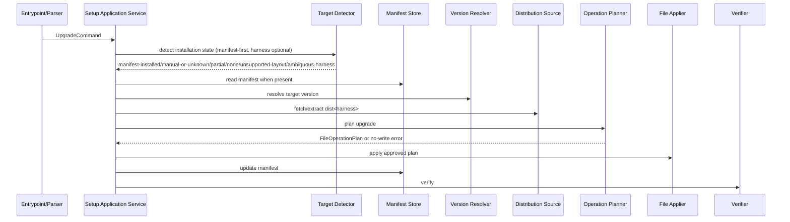

# Services — インストーラの実装

> Stage: application-design / Intent: `260706-installer-impl`  
> Upstream: `requirements.md`, `stories.md`, `architecture.md`, `component-inventory.md`, `team-practices.md`, refined CLI/DX mockups

## Service Model

This intent introduces no long-running backend service and no AWS runtime infrastructure. The application is a local CLI package plus external service interactions:

- Local in-process application services inside `packages/setup/`.
- External GitHub tag/archive service consumed at install/upgrade time.
- npm registry publication through manually triggered GitHub Actions release workflow.
- GitHub Actions CI checks for installer-related PRs.

The design therefore uses application-service orchestration, not microservices, serverless, or event-driven runtime services.

## In-Process Services

| Service | Responsibility | Lifecycle | Scaling |
|---|---|---|---|
| Setup Application Service | install/upgrade orchestration | one process invocation | one target per process |
| Version Resolution Service | tag list filtering and explicit version mapping | one process invocation | network-bound |
| Distribution Loading Service | fetch/extract selected release archive | one process invocation | temp-dir scoped |
| Planning Service | target snapshot + metadata -> operation plan | pure/in-memory | unit-testable |
| Apply Service | execute approved file plan | one process invocation | filesystem-bound |
| Verification Service | post-apply readiness checks | one process invocation | filesystem/process-bound |
| Reporting Service | render canonical plain text | one process invocation | deterministic snapshots |

## External Services And Contracts

### GitHub Tag / Archive Source

| Attribute | Contract |
|---|---|
| Endpoint | canonical repo `https://github.com/amadeus-dlc/amadeus` |
| Used for | stable SemVer tag resolution and archive download |
| Reliability | archive fetch retries once for transient failure |
| Failure behavior | no target files modified before source load succeeds |
| Security | no credentials required for public release path in first release |

### npm Registry Publication

| Attribute | Contract |
|---|---|
| Trigger | GitHub Actions `workflow_dispatch` |
| Package | `@amadeus-dlc/setup` from `packages/setup/` |
| Validation | package build, package dry-run, smoke/integration, dependency review, SBOM/provenance, publish validation |
| Default tag | latest stable SemVer tag when no explicit input |
| Credential details | deferred to CI Pipeline / Deployment Pipeline |

### GitHub Actions PR Gates

| Attribute | Contract |
|---|---|
| Trigger paths | `packages/setup/**`, installer docs/tests, release workflow, package metadata, installer-owned CI config |
| Blocking gates | package dry-run, installer smoke/integration, coverage registry/ratchet, typecheck/lint, `dist:check`, `promote:self:check`, OSV/audit, secret scan |
| Failure behavior | merge blocked |
| Allowlist | High/Critical vulnerability allowlist requires explicit rationale |

## Orchestration Patterns

### Install

### Upgrade

## Communication Contracts

| Producer | Consumer | Contract | Pattern |
|---|---|---|---|
| Parser | Application Service | `SetupCommand` | sync in-process |
| Version Resolver | Application Service | `ResolvedVersion` or classified error | async boundary, sync result |
| Tag Source Port | Version Resolver | tag list | async boundary |
| Archive Source Port | Distribution Loader | archive path | async boundary with one retry |
| Archive Extractor | Metadata Reader / Planner | `LoadedDistribution` | async boundary |
| Target Detector | Planner | `TargetDetection` / `TargetSnapshot` | sync filesystem read |
| Planner | Reporter / Applier | `FileOperationPlan` | sync pure object |
| Application Service | Manifest Store | manifest content after successful apply | sync filesystem write |
| Manifest Store | Future upgrade | `InstallerManifest` | JSON file contract |
| Verifier | Reporter | `VerificationResult` | sync checks |

## Data Ownership

| Data | Owner | Storage |
|---|---|---|
| Installer package metadata | `packages/setup/package.json` | repo source |
| Distribution version and source tag | Version Resolver / Manifest Store | manifest |
| File class and md5 | Distribution Metadata Reader / Manifest Store | source metadata + manifest |
| Target installation state | Target Detector | derived from target files |
| Operation plan | Operation Planner | in-memory + printed report |
| User runtime memory/audit/intents | target Amadeus runtime | user project; `user-preserved` |

## Lifecycle Characteristics

- No daemon state is retained between invocations.
- Manifest is the only installer-owned persistent state in the target.
- Manifest writes are owned by the Application Service calling Manifest Store after File Applier succeeds. The write is atomic and classified separately from file-copy failures; if manifest write fails after copy, the command exits non-zero with applied-operation diagnostics and future upgrade falls back to manual/partial detection.
- Backups are file-level artifacts with operation-start timestamp.
- Backup names use Windows-safe UTC basic timestamps: `YYYYMMDDTHHMMSSZ`, with numeric collision suffixes.
- Temporary archive extraction directories are deleted after operation unless failure diagnostics require preservation in tests.
- Release workflow has human-triggered lifecycle; ordinary `main` merge does not publish.

## Out Of Scope For This Stage

- Exact per-harness required file list.
- Concrete OSV/audit/secret scanning tool selection.
- npm credential storage and protected environment configuration.
- Offline installer service or bundled distribution.

## Traceability

The service model follows `architecture.md` and `component-inventory.md`: installer consumes generated `dist/<harness>/` archives and does not replace the existing packager. Requirements FR-007, FR-012, FR-016, and FR-017 define external service contracts; `team-practices.md` defines manual release and blocking gate posture.
