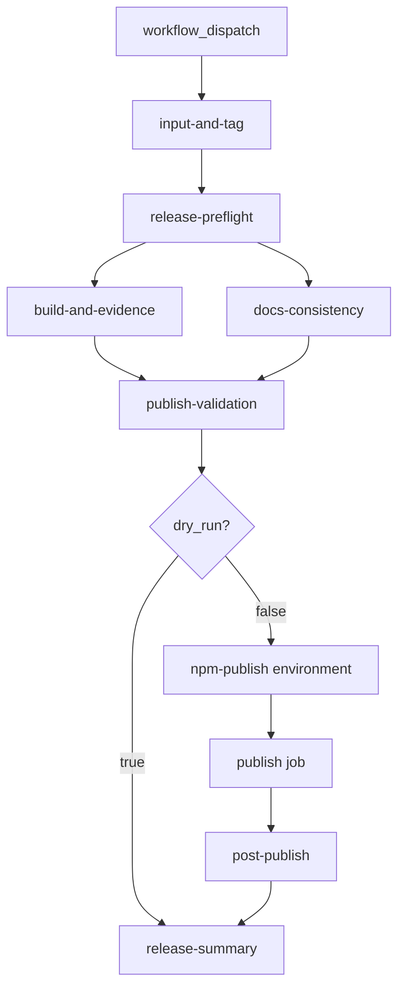

# CD Configuration — @amadeus-dlc/setup

## Upstream Inputs

- `ci-config.md`: PR CI（`ci.yml`）と release workflow の分離
- `quality-gates.md`: release preflight で unconditional 実行する gate 集合
- U8 `deployment-architecture.md`: workflow topology、protected environment 境界
- U8 `cicd-pipeline.md`: job 契約、publish command、dry-run contract

## CD Pipeline Overview



## Workflow File

**Path**: `.github/workflows/release-setup.yml`

| Setting | Value |
|---------|-------|
| Trigger | `workflow_dispatch` only |
| Concurrency | `release-setup-${{ github.ref }}`, cancel-in-progress: false |
| Permissions | `contents: read`, `id-token: write`（provenance 用） |
| Publish environment | `npm-publish`（secrets: `NPM_TOKEN`） |

## Workflow Inputs

| Input | Default | CD role |
|-------|---------|---------|
| `tag` | empty | 空 = latest stable SemVer tag 自動選択 |
| `dry_run` | `true` | CD 安全デフォルト — publish 経路に入らない |
| `npm_dist_tag` | `latest` | npm 公開チャネル |
| `confirm_package` | empty | 実 publish 時 `@amadeus-dlc/setup` 必須 |

## Job Configuration

| Job | needs | timeout | Artifact output |
|-----|-------|---------|-------------------|
| input-and-tag | — | 5m | `.amadeus-ci/setup/selected-tag.json` |
| release-preflight | input-and-tag | 30m | U7 gate reports |
| build-and-evidence | input-and-tag, preflight | 10m | `build.json`, `evidence.json` |
| docs-consistency | input-and-tag, preflight | 5m | `docs-consistency.json` |
| publish-validation | input-and-tag, build, docs | 10m | `publish-validation.json` |
| publish | input-and-tag, publish-validation | 10m | npm registry |
| post-publish | input-and-tag, publish | 10m | `post-publish.json` |
| release-summary | all | 5m | artifact upload + step summary |

## Release Preflight Gates

`release-preflight` job は `quality-gates.md` の installer gate を **changed-file skip なし** で実行:

- package-metadata / dry-run
- installer-smoke / integration
- coverage-registry
- typecheck / lint
- dist-check / promote-self-check
- scanner-findings → dependency-audit / secret-scan

## Publish Command

```text
working-directory: packages/setup
npm publish --tag <npm_dist_tag> --access public --provenance
env:
  NODE_AUTH_TOKEN: ${{ secrets.NPM_TOKEN }}
```

## CI vs CD Boundary

| Concern | CI (`ci.yml`) | CD (`release-setup.yml`) |
|---------|---------------|--------------------------|
| Trigger | push / PR | manual dispatch |
| Publish | Never | optional guarded |
| Tag selection | N/A | ReleaseTagSelector |
| Evidence | gate JSON only | SBOM + provenance |

## Operational Commands (local pre-CD)

```bash
bun packages/setup/src/maintainer/release-tag-selector.ts --report /tmp/selected-tag.json
bun packages/setup/src/maintainer/release-preflight.ts --dry-run true --report /tmp/preflight.json
bun packages/setup/src/maintainer/publish-validate.ts --dry-run true --package-dir packages/setup
```
