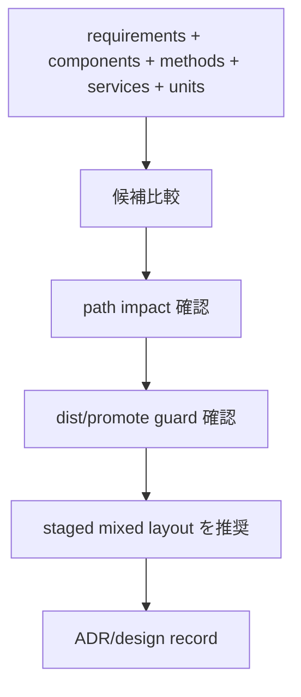

# Business Logic Model — U1 Layout Decision Record

## Upstream Trace

この設計は `unit-of-work`, `unit-of-work-story-map`, `requirements`, `components`, `component-methods`, `services` を入力とする。U1 は Issue #610 に対応する ADR または同等 design record を作成し、staged mixed layout の decision source of truth を提供する。

## Workflow

1. 既存 artifact から design record の根拠を集める。
2. `requirements` の FR-1 から FR-6 を見出しまたは acceptance criteria に反映する。
3. `components` の root framework zone / setup package boundary を decision context に反映する。
4. `component-methods` の `compareLayoutCandidates()`, `recordLayoutDecision()`, `inventoryPathImpact()` を design record の構成へ変換する。
5. `services` の design-first orchestration を前提に、runtime service 追加ではないことを明記する。
6. status quo, staged mixed layout, full workspace normalization, source root abstraction first を比較する。
7. 推奨 decision と alternatives rejected を記録する。

## Decision Flow

## Output Contract

Design record は次を含む。

- Context: Issue #610 の背景と `packages/setup` sibling intent。
- Decision: root framework layout 維持 + `packages/setup` sibling package。
- Consequences: docs 更新、future migration seam、guard preservation。
- Alternatives Rejected: full workspace normalization の即時採用、説明なしの status quo。
- Validation: `dist:check`, `promote:self:check`, docs impact。
