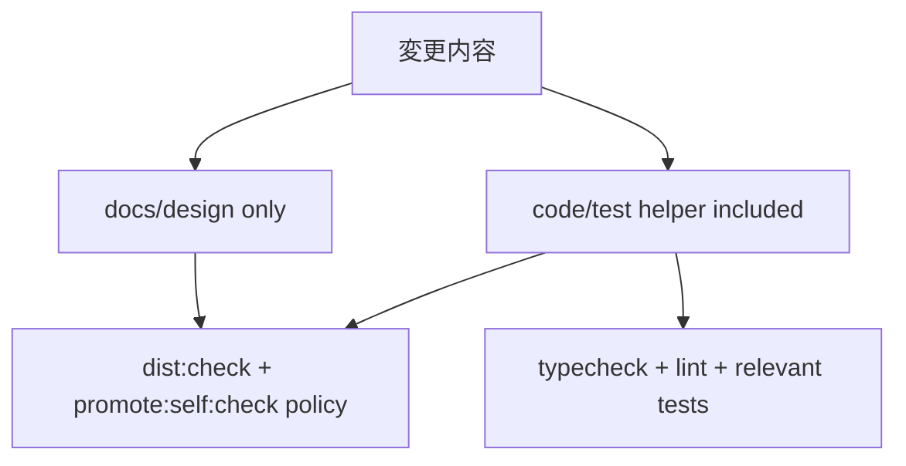

# Business Logic Model — U3 Guard Validation Plan

## Upstream Trace

この設計は `unit-of-work`, `unit-of-work-story-map`, `requirements`, `components`, `component-methods`, `services` を入力とする。U3 は layout decision が release/drift guard を壊さないことを validation plan として定義する。

## Workflow

1. U1 design record の selected decision を読む。
2. U2 docs update の path impact を確認する。
3. 変更が docs/design only か、code/test helper を含むかを分類する。
4. docs/design only でも `dist:check` と `promote:self:check` の維持方針を記録する。
5. code/test helper を含む場合は `bun run typecheck`, `bun run lint`, relevant `tests/run-tests.sh` を追加する。
6. Validation result または command plan を design record/docs/PR description に残す。

## Decision Tree

## Output Contract

Validation plan は、Issue #610 の conclusion が release/drift guard を弱めないことを説明する。実行結果がある場合は command と outcome を記録する。
