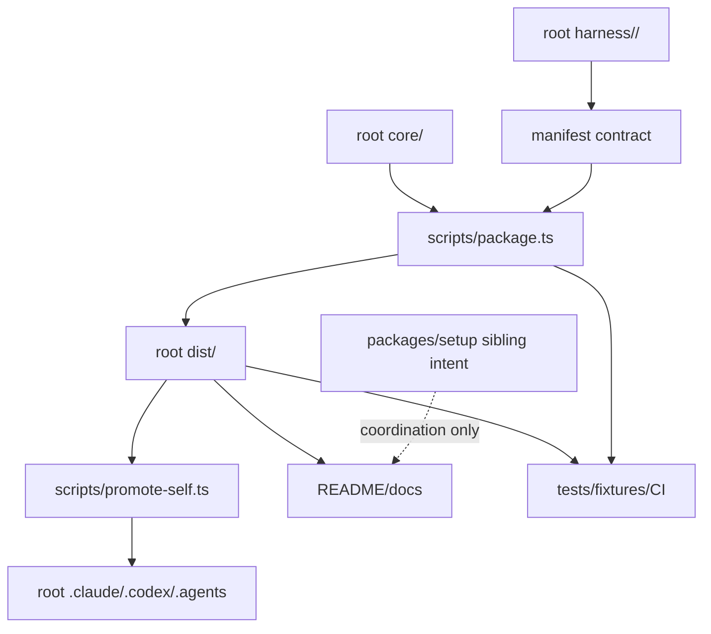

# Component Dependency

## Upstream Trace

この依存関係設計は `requirements` の path impact 要求、`architecture` の transaction diagram、`component-inventory` の component sensitivity、`team-practices` の drift guard posture を反映する。

## Dependency Matrix

| Component | Depends on | Downstream dependents | Layout risk |
| --- | --- | --- | --- |
| root `core/` | none | `scripts/package.ts`, manifests, docs/tests references | 高 |
| root `harness/<name>/` | `scripts/manifest-types.ts` | `scripts/package.ts`, `dist/<name>` | 高 |
| `scripts/package.ts` | root `core/`, root `harness/`, manifests | `dist/*`, `dist:check`, CI, docs/tests | 非常に高 |
| `scripts/promote-self.ts` | root `dist/claude`, root `dist/codex` | `.claude`, `.codex`, `.agents`, `promote:self:check` | 非常に高 |
| root `dist/*` | packager output | README/docs, tests, self-promotion, users | 非常に高 |
| runtime dirs | `dist/claude`, `dist/codex` | dogfood repository behavior | 高 |
| docs/tests/CI | root scripts and root `dist/*` | maintainer confidence and release readiness | 高 |
| `packages/setup` | separate intent | future setup/install workflow | この intent では外部依存 |

## Data Flow

## Communication Patterns

すべて repository-local の synchronous workflow である。event-driven runtime や network service は存在しない。

- Maintainer は source を編集する。
- Packaging は distribution output を生成する。
- Drift guard は generated output と committed output を比較する。
- Self-promotion は dogfood runtime target を同期する。
- Documentation は chosen layout decision を contributor mental model として公開する。

## Shared Resources

- root `dist/*`: generated output かつ public install source。
- root `.claude/.codex/.agents`: local dogfood runtime target。
- `amadeus/spaces/default/*`: workflow state, CodeKB, intent artifacts。
- `.github/workflows/ci.yml`: release/drift guard entry point。

## Design Implication

`dist/` を package-local に移す案は、単一 component の移動ではなく shared resource relocation である。したがって現時点の推奨は、root `dist/*` を維持し、`packages/setup` との MECE 性は documentation と ADR で明文化することである。
