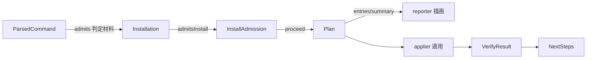

# Domain Entities — install-flow

> ステージ: functional-design (3.1) / Unit: install-flow / 作成: 2026-07-08
> 出典: `../../../inception/application-design/component-methods.md`(Rev.3)、`../../../inception/requirements-analysis/requirements.md`(CLI Contract、FR-003/004/007/010/011/013/016)、`../../setup-foundation/functional-design/domain-entities.md`(U1 前方共有型: SemVer / ResolvedVersion / ExtractedPayload / Manifest / ManifestError / HarnessName / Disposition)、team knowledge `software-design/functional-domain-modeling-ts`
> スタイル: Rev.3 確認済みの役割分担(type = インスタンスメソッド契約 / 内部ファクトリ+クロージャ / コンパニオンは static のみ / 全コンパニオン namespace は `Object.freeze`)

## エンティティ定義

### ParsedCommand / UsageError(cli の解析結果)

```ts
export type ParsedCommand = {
  readonly subcommand: "install" | "upgrade" | "help";
  readonly harness: HarnessName | null;      // 未指定は対話モードでのみ許容
  readonly target: string | null;
  readonly version: VersionSpec;             // 省略時 VersionSpec.latest()
  readonly yes: boolean;
  readonly force: boolean;
  isNonInteractive(stdinIsTty: boolean): boolean;   // --yes または非 TTY(CLI Contract)— モード判定は自身が答える
  missingRequiredFor(mode: "interactive" | "non-interactive"): readonly ("harness" | "target")[]; // FR-011
};

export namespace ParsedCommand {
  export function parse(argv: readonly string[]): Result<ParsedCommand, UsageError>;  // スマートコンストラクタ。サブコマンドなし→ subcommand:"help"
}

export type UsageError =
  | { readonly type: "unknown-subcommand"; readonly raw: string }
  | { readonly type: "unknown-flag"; readonly raw: string }
  | { readonly type: "invalid-harness"; readonly raw: string }                 // HarnessName.parse 失敗(FR-003。U1/U2 所有分割どおり検証は本 Unit)
  | { readonly type: "multiple-harnesses"; readonly raws: readonly string[] }  // FR-003: 複数指定非対応
  | { readonly type: "missing-required"; readonly fields: readonly string[] }  // 非対話の必須欠落(FR-011)
  | { readonly type: "invalid-version"; readonly cause: VersionError };

export namespace UsageError {
  export function invalidHarness(raw: string): UsageError;
  export function multipleHarnesses(raws: readonly string[]): UsageError;
  export function missingRequired(fields: readonly string[]): UsageError;
  // ... variant ごとのファクトリ
}
```

- **`HarnessName.parse(raw): Result<HarnessName, UsageError>` は本 Unit が所有・定義する**(U1 はブランド型+`all` を前方共有 — U1 domain-entities の所有関係注記どおり)

### Installation(導入状態 — 判別ユニオン、FR-004/005 の検出結果)

```ts
export type Installation =
  | { readonly kind: "none"; admitsInstall(force: boolean): InstallAdmission }
  | { readonly kind: "manifested"; readonly manifest: Manifest; admitsInstall(force: boolean): InstallAdmission }
  | { readonly kind: "manual-or-unknown"; readonly evidence: readonly string[]; admitsInstall(force: boolean): InstallAdmission }
  | { readonly kind: "partial"; readonly missing: readonly string[]; admitsInstall(force: boolean): InstallAdmission };

export type InstallAdmission =
  | { readonly type: "proceed" }
  | { readonly type: "proceed-forced" }                                   // --force 付き強制再導入(FR-004)
  | { readonly type: "refuse-suggest-upgrade"; readonly detected: string }; // 導入済み検出 → 中断+upgrade 案内

export namespace Installation {
  export function detect(target: string, manifestIo: ManifestIo): Promise<Installation>;  // VERSION/マニフェスト/ハーネスファイルの証跡から分類
}
```

- **FR-004 の「導入済みなら中断して upgrade 案内」判断は `installation.admitsInstall(force)` が所有**する。cli は kind を取り出して分岐しない(Tell, Don't Ask)

### Plan / PlanEntry(install プラン — First-Class Collection)

```ts
export type PlanAction = "add" | "update" | "skip" | "backup" | "conflict";
export type PlanEntry = {
  readonly path: string;
  readonly action: PlanAction;
  readonly class: FileClass;                 // U1 前方共有(owned/shared/user-preserved)
  readonly forced: boolean;                  // FR-009: force 適用の監査印
};

export type Plan = {
  readonly backupTimestamp: string;          // 操作開始時刻 — 全退避ファイル名で共有(FR-008)
  entries(): ReadonlyArray<PlanEntry>;       // レポート描画用の明示的列挙(FR-007)
  entriesBy(action: PlanAction): ReadonlyArray<PlanEntry>;
  hasConflicts(): boolean;                   // 「確認が要るか」を plan 自身が答える(FR-010 の分岐材料)
  isNoop(): boolean;                         // 適用対象ゼロ
  summary(): PlanSummary;                    // 件数集計(reporter の素材)
};

export namespace Plan {
  export function forInstall(payload: ExtractedPayload, harness: HarnessName, target: string, opts: PlanOptions): Result<Plan, PlanRefusal>;
  // upgrade 側ファクトリ(forUpgrade)は U3 で規定 — Plan 型自体は本 Unit が定義し U3 が再利用する(units-generation の統合契約)
}

export type PlanOptions = { readonly force: boolean; readonly startedAt: string };
export type PlanSummary = { readonly add: number; readonly update: number; readonly skip: number; readonly backup: number; readonly conflict: number };
```

### PlanRefusal(型付き拒否 — 判別ユニオン)

```ts
export type PlanRefusal =
  | { readonly type: "already-installed"; readonly admission: InstallAdmission }   // FR-004(install 側)
  | { readonly type: "harness-not-in-payload"; readonly harness: HarnessName };    // 配布物に該当 dist/<harness>/ がない

export namespace PlanRefusal { /* variant ファクトリ */ }
```

- upgrade 固有の拒否(ダウングレード等)は U3 が variant を拡張定義する(判別ユニオンの和集合として)

### WizardAnswers(対話ウィザードの結果)

```ts
export type WizardAnswers = {
  readonly harness: HarnessName;
  readonly target: string;
  confirmed(): boolean;                      // 最終確認プロンプトの結果
};

export namespace WizardAnswers { /* runWizard 内部ファクトリのみ(公開コンストラクタなし) */ }
```

### VerifyResult / Check(導入後検証、FR-013)

```ts
export type Check = {
  readonly name: "required-files" | "harness-dir" | "tools-dir" | "memory-shell" | "state-absence";
  readonly ok: boolean;
  readonly detail: string;
};

export type VerifyResult = {
  allPassed(): boolean;                      // 成否判断は自身が答える
  failures(): ReadonlyArray<Check>;
  checks(): ReadonlyArray<Check>;
};

export namespace VerifyResult {
  export function of(checks: readonly Check[]): VerifyResult;
}
```

### NextSteps(完了案内の素材、US-A6)

```ts
export type NextSteps = {
  readonly harness: HarnessName;
  readonly version: ResolvedVersion;
  readonly target: string;
  lines(): readonly string[];                // /amadeus の始め方を含む案内行(描画は reporter)
};
```

## エンティティ関係



<!-- text fallback: ParsedCommand の解析結果を受け、Installation.detect が導入状態を分類し installation.admitsInstall(force) が InstallAdmission を返す。proceed なら Plan.forInstall がプランを作り、plan.entries()/summary() を reporter が描画、確認後 applier が適用する。適用結果は VerifyResult で検証され、NextSteps が完了案内の素材になる。 -->

## U1/U3 との契約

- U1 から: SemVer / VersionSpec / VersionError / ResolvedVersion / ExtractedPayload / Manifest / ManifestFiles / ManifestError / Disposition / HarnessName(型+`all`)/ FetchError
- 本 Unit が定義し U3 へ提供: `Plan` / `PlanEntry` / `PlanAction` / `PlanRefusal`(拡張可能ユニオン)/ `Installation` / applier・verifier・reporter の各契約
