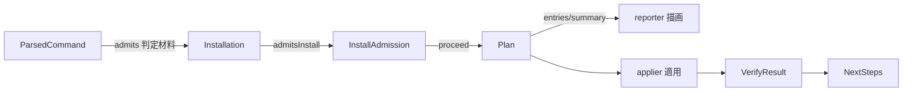

# Domain Entities — install-flow

> ステージ: functional-design (3.1) / Unit: install-flow / 作成: 2026-07-08
> 出典: `../../../inception/application-design/component-methods.md`(Rev.3)、`../../../inception/requirements-analysis/requirements.md`(CLI Contract、FR-003/004/007/010/011/013/016)、`../../setup-foundation/functional-design/domain-entities.md`(U1 前方共有型: SemVer / ResolvedVersion / ExtractedPayload / Manifest / ManifestError / HarnessName / Disposition)、team knowledge `software-design/functional-domain-modeling-ts`
> スタイル: Rev.3 確認済みの役割分担(type = インスタンスメソッド契約 / 内部ファクトリ+クロージャ / コンパニオンは static のみ / 全コンパニオン namespace は `Object.freeze`)

## エンティティ定義

### ParsedCommand / UsageError(cli の解析結果)

```ts
export type ParsedCommand = {
  readonly subcommand: "install" | "upgrade" | "help";
  readonly harness: HarnessName | null;      // 未指定は対話モードでのみ許容
  readonly target: string | null;
  readonly version: VersionSpec;             // 省略時 VersionSpec.latest()
  readonly yes: boolean;
  readonly force: boolean;
  isNonInteractive(stdinIsTty: boolean): boolean;   // --yes または非 TTY(CLI Contract)— モード判定は自身が答える
  missingRequiredFor(mode: "interactive" | "non-interactive"): readonly ("harness" | "target")[]; // FR-011
};

export namespace ParsedCommand {
  export function parse(argv: readonly string[]): Result<ParsedCommand, UsageError>;  // スマートコンストラクタ。サブコマンドなし→ subcommand:"help"
}

export type UsageError =
  | { readonly type: "unknown-subcommand"; readonly raw: string }
  | { readonly type: "unknown-flag"; readonly raw: string }
  | { readonly type: "invalid-harness"; readonly raw: string }                 // HarnessName.parse 失敗(FR-003。U1/U2 所有分割どおり検証は本 Unit)
  | { readonly type: "multiple-harnesses"; readonly raws: readonly string[] }  // FR-003: 複数指定非対応
  | { readonly type: "missing-required"; readonly fields: readonly string[] }  // 非対話の必須欠落(FR-011)
  | { readonly type: "invalid-version"; readonly cause: VersionError };

export namespace UsageError {
  export function invalidHarness(raw: string): UsageError;
  export function multipleHarnesses(raws: readonly string[]): UsageError;
  export function missingRequired(fields: readonly string[]): UsageError;
  // ... variant ごとのファクトリ
}
```

- **`HarnessName.parse(raw): Result<HarnessName, UsageError>` は本 Unit が所有・定義する**(U1 はブランド型+`all` を前方共有 — U1 domain-entities の所有関係注記どおり)

### Installation(導入状態 — 判別ユニオン、FR-004/005 の検出結果)

```ts
export type InstallationEvidence = {
  readonly paths: readonly string[];         // 検出した既存 Amadeus 関連ファイル(相対パス列挙)
  readonly versionFileContent: string | null; // <engine-dir>/VERSION の生内容(不在なら null)— SemVer 解釈可否の判定材料
  readonly anchors: { readonly toolsDir: boolean; readonly amadeusCommon: boolean }; // 現行レイアウト必須アンカーの存在
};

export type Installation =
  | { readonly kind: "none"; admitsInstall(force: boolean): InstallAdmission }
  | { readonly kind: "manifested"; readonly manifest: Manifest; admitsInstall(force: boolean): InstallAdmission }
  | { readonly kind: "manual-or-unknown"; readonly evidence: InstallationEvidence; admitsInstall(force: boolean): InstallAdmission }
  | { readonly kind: "partial"; readonly missing: readonly string[]; admitsInstall(force: boolean): InstallAdmission };

export type InstallAdmission =
  | { readonly type: "proceed" }
  | { readonly type: "proceed-forced" }                                   // --force 付き強制再導入(FR-004)
  | { readonly type: "refuse-suggest-upgrade"; readonly detected: string }; // 導入済み検出 → 中断+upgrade 案内

export namespace Installation {
  export function detect(target: string, manifestIo: ManifestIo): Promise<Installation>;
  // VERSION/マニフェスト/ハーネスファイルの証跡から分類。manual-or-unknown のときは
  // InstallationEvidence(パス列挙+VERSION 生内容+現行アンカー存在)を構造化して封入する
  // — U3 の LegacyLayout.isUnsupported の入力契約(旧レイアウト判定に必要な材料をここで収集)
}
```

- **FR-004 の「導入済みなら中断して upgrade 案内」判断は `installation.admitsInstall(force)` が所有**する。cli は kind を取り出して分岐しない(Tell, Don't Ask)

### Plan / PlanEntry(install プラン — First-Class Collection)

```ts
export type PlanAction = "add" | "update" | "skip" | "backup" | "conflict";
export type PlanEntry = {
  readonly path: string;
  readonly action: PlanAction;
  readonly class: FileClass;                 // U1 前方共有(owned/shared/user-preserved)
  readonly forced: boolean;                  // FR-009: force 適用の監査印
  readonly md5: string;                      // 配布物側内容の md5(プラン時に planner が計算 — マニフェスト期待値の源、FR-016)
  readonly required: boolean;                // 導入後検証の必須ファイル判定(planner が配布物構造から設定)
};

export type Plan = {
  readonly startedAtIso: string;             // 操作開始時刻の拡張 ISO 8601(Manifest.installedAt へそのまま入る表現)
  readonly backupTimestamp: string;          // 同一瞬間のファイル名トークン: コロンなし ISO 8601 basic 形式
                                             //   (全退避ファイル名で共有 — FR-008。U1 REL-F05 / BR-F14: Windows 予約文字回避)
  entries(): ReadonlyArray<PlanEntry>;       // レポート描画用の明示的列挙(FR-007)
  entriesBy(action: PlanAction): ReadonlyArray<PlanEntry>;
  hasConflicts(): boolean;                   // 「確認が要るか」を plan 自身が答える(FR-010 の分岐材料)
  isNoop(): boolean;                         // 適用対象ゼロ
  summary(): PlanSummary;                    // 件数集計(reporter の素材)
};

export namespace Plan {
  export function forInstall(payload: ExtractedPayload, harness: HarnessName, target: string, opts: PlanOptions): Result<Plan, PlanRefusal>;
  // upgrade 側ファクトリ(forUpgrade)は U3 で規定 — Plan 型自体は本 Unit が定義し U3 が再利用する(units-generation の統合契約)
}

export type PlanOptions = { readonly force: boolean; readonly startedAt: string };
export type PlanSummary = { readonly add: number; readonly update: number; readonly skip: number; readonly backup: number; readonly conflict: number };
```

### PlanRefusal(型付き拒否 — 判別ユニオン)

```ts
export type PlanRefusal =
  | { readonly type: "already-installed"; readonly admission: InstallAdmission }   // FR-004(install 側)
  | { readonly type: "harness-not-in-payload"; readonly harness: HarnessName };    // 配布物に該当 dist/<harness>/ がない

export namespace PlanRefusal { /* variant ファクトリ */ }
```

- upgrade 固有の拒否(ダウングレード等)は U3 が variant を拡張定義する(判別ユニオンの和集合として)

### InstallInputs(確定済み入力 — ウィザード/フラグ両経路の合流点)

```ts
export type InstallInputs = {
  readonly harness: HarnessName;
  readonly target: string;
};

export namespace InstallInputs {
  export function fromFlags(parsed: ParsedCommand): InstallInputs;   // 非対話経路。必須充足は事前に missingRequiredFor で検査済みであることが前提(BR-I03)
  // ウィザード経路は runWizard 内部ファクトリで生成(公開コンストラクタなし)
}
```

- **最終確認(BR-I18)は状態ではなくフローの結果**: `runWizard` は確認拒否時に `err("wizard-aborted")` を返し、承諾時のみ `ok(InstallInputs)` を返す(ワークフロー3参照)。`confirmed()` フラグを持ち回らない

### ApplyResult / ApplyFailure(applier の契約)

```ts
export type ApplyFailure = {
  readonly path: string;
  readonly operation: "copy" | "backup" | "mkdir";
  readonly detail: string;                   // I/O 例外は境界で捕捉して型付き値へ(サイレント失敗禁止)
};

export type ApplyResult = {
  hasFailures(): boolean;                    // 成否判断は自身が答える
  failures(): ReadonlyArray<ApplyFailure>;
  appliedEntries(): ReadonlyArray<PlanEntry>;
  backupPaths(): ReadonlyArray<string>;
  manifestFiles(): Result<ManifestFiles, ManifestError>;  // 適用結果 → ManifestFile{path, class, required, md5} への正準射影(FR-016)。md5 は PlanEntry が運ぶ(下記)
};

export namespace ApplyResult { /* applier 内部ファクトリのみ */ }
```

- **md5 の計算時点と所有**: `Plan.forInstall` が**プラン作成時に配布物側ファイルの md5 を計算**し `PlanEntry.md5` として運ぶ(planner は読み取りのみ — 純粋方針と両立)。`required` も planner が配布物構造から設定(`class == "owned"` の必須ファイル)。applier は運ばれた値を `manifestFiles()` で射影するだけで再計算しない

### VerifyResult / Check(導入後検証、FR-013)

```ts
export type Check = {
  readonly name: "required-files" | "harness-dir" | "tools-dir" | "memory-shell" | "state-absence";
  readonly ok: boolean;
  readonly detail: string;
};

export type VerifyResult = {
  allPassed(): boolean;                      // 成否判断は自身が答える
  failures(): ReadonlyArray<Check>;
  checks(): ReadonlyArray<Check>;
};

export namespace VerifyResult {
  export function of(checks: readonly Check[]): VerifyResult;
}
```

### NextSteps(完了案内の素材、US-A6)

```ts
export type NextSteps = {
  readonly harness: HarnessName;
  readonly version: ResolvedVersion;
  readonly target: string;
  lines(): readonly string[];                // /amadeus の始め方を含む案内行(描画は reporter)
};

export namespace NextSteps {
  export function of(harness: HarnessName, version: ResolvedVersion, target: string): NextSteps;
}
```

### Applier / Verifier の公開契約(本 Unit で正式化 — component-methods.md のベア関数スケッチを置換)

```ts
export type Applier = {
  apply(plan: Plan, target: string): Promise<ApplyResult>;
};
export namespace Applier {
  export function create(fsops: FsOps): Applier;    // ファクトリ+ポート注入(component-methods の apply(plan, target, fsops) ベア関数形を置換)
  // ※U2 nfr-design(logical-components)がポート分割版 Applier.create(fsWrite) へさらに置換(書き込みポートの単独保持が SEC-I01/REL-I01 の構造保証 — U1 の分割注記と同じ流儀)
}

export type Verifier = {
  verify(target: string, manifest: Manifest): Promise<VerifyResult>;
};
export namespace Verifier {
  export function create(fsops: FsOps): Verifier;   // 同上(verify(target, manifest) ベア関数形を置換)
  // ※U2 nfr-design(logical-components)がポート分割版 Verifier.create(fsRead) へさらに置換(検証は読み取り専用 — 書き込み能力を持たないことの構造化)
}
```

### Reporter API(本 Unit で正式化 — component-methods.md の3関数スケッチを置換)

```ts
export type ClassifiedError = UsageError | ResolveError | FetchError | ManifestError | PlanRefusal | UpgradeRefusal;  // UpgradeRefusal は U3 定義(U3 の是正で合流 — renderError の単一入口を維持)

// reporter の公開 API(application-design/component-methods.md の renderPlanReport/renderError/renderSuccess を本設計で拡張・確定)
renderHelp(): string
renderPlanReport(plan: Plan): string                                   // FR-007(force 印込み)
renderError(err: ClassifiedError): string                              // 分類別の表示+guidance(FR-012)
renderAlreadyInstalled(admission: InstallAdmission): string            // FR-004 の upgrade 案内(専用 UX)
renderApplyFailure(applied: ApplyResult): string                       // 部分適用失敗の列挙(サイレント失敗禁止)
renderVerifyFailure(verify: VerifyResult): string                      // FR-013
renderSuccess(applied: ApplyResult, verify: VerifyResult, next: NextSteps): string  // US-A6
```

- 判別ユニオンの合併である `ClassifiedError` により、U1 のエラー型群(ResolveError/FetchError/ManifestError)と U2 のエラー型群(UsageError/PlanRefusal)の描画が単一の入口に集まる

## エンティティ関係



<!-- text fallback: ParsedCommand の解析結果を受け、Installation.detect が導入状態を分類し installation.admitsInstall(force) が InstallAdmission を返す。proceed なら Plan.forInstall がプランを作り、plan.entries()/summary() を reporter が描画、確認後 applier が適用する。適用結果は VerifyResult で検証され、NextSteps が完了案内の素材になる。 -->

## U1/U3 との契約

- U1 から: SemVer / VersionSpec / VersionError / ResolvedVersion / ExtractedPayload / Manifest / InstallMeta / ManifestFiles / ManifestFile / ManifestError / Disposition / **FileClass** / HarnessName(型+`all`)/ FetchError
- 本 Unit が定義し U3 へ提供: `Plan` / `PlanEntry` / `PlanAction` / `PlanRefusal`(拡張可能ユニオン)/ `Installation` / applier・verifier・reporter の各契約


---

## 置換注記(§12a コードレビュー裁定 2026-07-08)

- **Plan**: `harnessRoot(): string` をインスタンスメソッドとして追加(Plan.forInstall が解決済みの配布物ルートを運ぶ)。Applier は `join(plan.harnessRoot(), entry.path)` でコピー元を組み立てる。**PlanEntry は6フィールドの正準形を維持**(実装が一時追加した `source` フィールドはレビュー裁定で除去)
- **Reporter API**: 7関数に加え、SEC-I04(文言の reporter 一元化)の完全化のため `renderWizardAborted()` / `renderUpgradeNotImplemented()` / `renderTmpDirFailure(detail)` を追加し10関数となったが、U3 の upgrade 実装で `renderUpgradeNotImplemented()` は孤児化し削除(§12a U3 レビュー裁定 ACCEPTED)— **確定形は9関数**。cli.ts は自前の文言を一切組み立てない
- **HarnessName.parse**(U1 harness.ts への U2 増分): 戻り値は UsageError ではなく軽量ローカルエラー(`UsageError.invalidHarness` への変換は ParsedCommand.parse 側)— 依存方向の確定は nfr-design/logical-components.md の置換注記を参照
