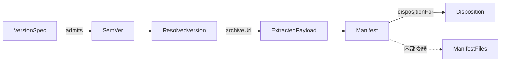

# Domain Entities — setup-foundation

> ステージ: functional-design (3.1) / Unit: setup-foundation / 作成: 2026-07-08(Rev.3 — ユーザー確認済みの役割分担: **type = インスタンスメソッドを含む契約、内部ファクトリ+クロージャが実装、コンパニオン namespace は static 相当のみ**)
> 出典: `../../../inception/application-design/component-methods.md`(Rev.3 で同時改訂)、`../../../inception/requirements-analysis/requirements.md`、team knowledge `software-design/functional-domain-modeling-ts`(正準: event-store-adapter-js)・`tell-dont-ask`・`parse-dont-validate`・`first-class-collection`

## 設計方針(Rev.3、ユーザー確認済み)

1. **type はメソッドシグネチャを持つ契約** — インスタンスメソッド(振る舞い)はドメインオブジェクト自身が持つ。呼び出し側は `manifest.dispositionFor(path, md5)` と**インスタンスへ告げる**(Tell, Don't Ask)
2. **実装は内部ファクトリ関数+クロージャ** — `create*` が `Object.freeze` したオブジェクトリテラルを返す。class は使わない。ファクトリは `internal/` に置き公開しない
3. **コンパニオン namespace = static 相当のみ** — スマートコンストラクタ(`parse`)、ファクトリ(`build`/`of`)、コレクションレベル演算(`latestStableOf`)。第一引数にインスタンスを取る振る舞い関数をここへ置かない(Rev.2 の誤り)
4. **イミュータブル更新** — 更新メソッドは新インスタンスを返す(`upgradedTo`)
5. **Result/エラーは判別ユニオン+コンパニオンファクトリ** — エラーにも所有すべき振る舞い(`isTransient()` 等)はインスタンスメソッドとして持たせる。`type` フィールドでの網羅 switch は維持

## エンティティ定義

### SemVer(値オブジェクト)

```ts
export type SemVer = {
  readonly major: number;
  readonly minor: number;
  readonly patch: number;
  readonly prerelease: string | null;
  isStable(): boolean;                       // prerelease === null(BR-F02)
  isLaterThan(other: SemVer): boolean;       // 数値順序(BR-F03)— 比較判断はインスタンスが所有
  equals(other: SemVer): boolean;
  format(): `v${string}`;                    // タグ表記への射影(表示・URL 用)
};

export namespace SemVer {
  export function parse(raw: string): Result<SemVer, VersionError>;      // "v" 正規化込み(BR-F05)。無効値の SemVer は作れない
  export function latestStableOf(list: readonly SemVer[]): SemVer | undefined; // コレクションレベル演算(BR-F01〜F03)
}
Object.freeze(SemVer);

// internal/semver.ts — 非公開ファクトリ
function createSemVer(major: number, minor: number, patch: number, prerelease: string | null): SemVer {
  return Object.freeze({
    major, minor, patch, prerelease,
    isStable() { return prerelease === null; },
    isLaterThan(other: SemVer) { /* major→minor→patch の数値比較 */ },
    equals(other: SemVer) { /* ... */ },
    format() { /* v{major}.{minor}.{patch}[-prerelease] */ },
  });
}
```

### VersionSpec(値オブジェクト)

```ts
export type VersionSpec = {
  readonly kind: "latest" | "exact";
  admits(candidate: SemVer): boolean;        // 適合判定(プレリリース規則 BR-F02/F04 を内包)— spec 自身が答える
  describe(): string;                        // エラーメッセージ用の自己記述
};

export namespace VersionSpec {
  export function latest(): VersionSpec;
  export function exact(raw: string): Result<VersionSpec, VersionError>;  // 生成時に SemVer 検証(スマートコンストラクタ)
}
```

### ResolvedVersion(値オブジェクト)

```ts
export type ResolvedVersion = {
  readonly tag: `v${string}`;
  readonly semver: SemVer;
  readonly source: "release" | "tag";
  archiveUrl(): URL;                         // codeload URL 構築は取得元情報の持ち主(ADR-003)
  isSameAs(other: SemVer): boolean;          // upgrade 境界判定(US-B4)の意図明示メソッド
};

export namespace ResolvedVersion {
  export function fromRelease(semver: SemVer): ResolvedVersion;
  export function fromTag(semver: SemVer): ResolvedVersion;
}
```

### ResolveError / FetchError(判別ユニオン — 振る舞い付き)

```ts
export type ResolveError =
  | { readonly type: "no-stable-version"; readonly detail: string }
  | { readonly type: "not-found"; readonly requested: string };

export namespace ResolveError {
  export function noStableVersion(detail?: string): ResolveError;
  export function notFound(spec: VersionSpec): ResolveError;
}

export type FetchErrorType = "dns" | "conn" | "timeout" | "http" | "rate-limit" | "payload-invalid";
export type FetchError = {
  readonly type: FetchErrorType;
  readonly detail: string;
  isTransient(): boolean;                    // 「リトライしてよいか」を自身が答える(BR-F06/F07)
  guidance(): string;                        // 再実行案内の素材(描画は reporter/U2)
};

export namespace FetchError {
  export function classify(cause: unknown, meta?: HttpMeta): FetchError;  // 分類ファクトリ(BR-F06〜F08)
}
```

- `type` フィールドでの網羅 switch(+never 検査)は維持 — U1↔U2 の凍結契約
- 変種ごとの追加データ(`status`、`retryAfterHint`)は該当変種の readonly フィールドとして持つ

### ExtractedPayload(エンティティ)

```ts
export type ExtractedPayload = {
  readonly version: ResolvedVersion;
  harnessRoot(harness: HarnessName): Result<string, FetchError>;  // 「このハーネスの配布物ルートをくれ」
  availableHarnesses(): readonly HarnessName[];
};

export namespace ExtractedPayload {
  export function locate(extractedDir: string, version: ResolvedVersion): Result<ExtractedPayload, FetchError>; // dist/<harness> 検出+payload-invalid(BR-F10)
}
```

- 展開先の実パスはクロージャに閉じる(呼び出し側にファイルシステム走査をさせない)
- ライフサイクル: fetch で生成 → planner が読む → プロセス終了時に一時領域ごと破棄

### ManifestFiles(First-Class Collection)

```ts
export type ManifestFiles = {
  requiredPaths(): readonly string[];                                    // 導入後検証(FR-013)の入力
  dispositionFor(path: string, actualMd5: string | null): Disposition;  // ★FR-008 の判定所有(Tell, Don't Ask の中核)
  entries(): ReadonlyArray<ManifestFile>;                               // 永続化射影用の明示的列挙
};
export type ManifestFile = { readonly path: string; readonly class: FileClass; readonly required: boolean; readonly md5: string };
export type FileClass = "owned" | "shared" | "user-preserved";

export namespace ManifestFiles {
  export function fromEntries(entries: readonly ManifestFile[]): Result<ManifestFiles, ManifestError>; // path 重複を拒否(不変条件の一元化)
}

export type Disposition =
  | { readonly type: "overwrite" }            // owned、または shared で期待 md5 一致
  | { readonly type: "backup-then-copy" }     // shared で md5 相違 or 期待値なし
  | { readonly type: "preserve" };            // user-preserved
```

- planner は md5 と class を取り出して if を書かない。「このファイルの処遇は?」と**コレクションに告げる**

### Manifest(集約ルート — 永続、FR-016)

```ts
export type Manifest = {
  readonly schemaVersion: 1;
  readonly installerPackageVersion: string;   // setup 自身の semver(FR-017)
  readonly distributionVersion: SemVer;
  readonly sourceTag: `v${string}`;
  readonly installedAt: string;               // ISO 8601 = 操作開始時刻 = backup $timestamp(BR-F14)
  readonly harness: HarnessName;
  dispositionFor(path: string, actualMd5: string | null): Disposition;  // ManifestFiles へ内部委譲(Law of Demeter — 呼び出し側に files を歩かせない)
  isNewerThan(candidate: SemVer): boolean;    // バージョン境界判定(US-B4)
  requiredPaths(): readonly string[];         // verifier の入力
  upgradedTo(next: BuildInput): Manifest;     // イミュータブル更新 — 新インスタンスを返す
  toJSON(): ManifestJson;                     // 永続化への明示的射影(DTO 例外を明示)
};

export namespace Manifest {
  export function parse(json: unknown): Result<Manifest, ManifestError>;   // schemaVersion 検査込み(BR-F12)— Parse, Don't Validate
  export function build(payload: ExtractedPayload, files: ManifestFiles, meta: InstallMeta): Manifest;
}
Object.freeze(Manifest);
```

- 永続先: `<target>/amadeus/.installer/amadeus-setup-manifest.json`(ManifestIo が `Manifest.parse`/`manifest.toJSON()` 経由で読み書き)
- `ManifestFiles` はクロージャに保持し公開フィールドにしない — 到達経路は `dispositionFor`/`requiredPaths` の意図明示メソッドのみ

### HarnessName(ブランド型 — プリミティブを包む判断の適用例)

```ts
declare const harnessBrand: unique symbol;
export type HarnessName = ("claude" | "codex" | "kiro" | "kiro-ide") & { readonly [harnessBrand]: "HarnessName" };

export namespace HarnessName {
  export function parse(raw: string): Result<HarnessName, UsageError>;   // FR-003 の4値検証を型で運ぶ
  export const all: readonly HarnessName[];
}
```

- 文字列リテラル直和のみで足りるが、未検証文字列の取り違え防止(FR-003 の非対話バリデーション)が正しさを変えるため包む

## エンティティ関係



<!-- text fallback: VersionSpec が SemVer 候補を admits で判定し ResolvedVersion が確定する。resolved.archiveUrl() から ExtractedPayload が取得され、install 完了時に Manifest が生成される。Manifest は ManifestFiles をクロージャに内包し、upgrade 時は manifest.dispositionFor(path, md5) がインスタンスメソッドとして処遇(Disposition)を答える。 -->
