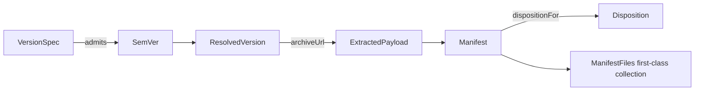

# Domain Entities — setup-foundation

> ステージ: functional-design (3.1) / Unit: setup-foundation / 作成: 2026-07-08(Rev.2 — ユーザー指摘によりドメインオブジェクトへ振る舞いを付与: Tell, Don't Ask+`functional-domain-modeling-ts` スタイル採用)
> 出典: `../../../inception/application-design/component-methods.md`(Rev.2 で同時改訂)、`../../../inception/requirements-analysis/requirements.md`、team knowledge `software-design/functional-domain-modeling-ts`・`tell-dont-ask`・`parse-dont-validate`・`first-class-collection`

## 設計方針(Rev.2)

- **データ = 型、振る舞い = コンパニオン**: 各ドメイン型は同名 `namespace` との宣言マージで意図を表す振る舞いを持つ(class は使わない)。namespace と生成物は `Object.freeze`
- **Tell, Don't Ask**: 呼び出し側が状態を取り出して外側で分岐しない。判断はデータの持ち主のコンパニオンに置く(例: 上書き可否は Manifest が Disposition として答える)
- **スマートコンストラクタ**: 検証済みであることを型で運ぶ(`SemVer.parse` が `Result` を返す。無効値の `SemVer` は作れない)
- **判別ユニオン+コンパニオンファクトリ**: エラーは `Error` 継承ではなく判別ユニオン。ケースごとのファクトリを namespace に置く

## エンティティ定義

### SemVer(ブランド付き値オブジェクト)

```ts
declare const semverBrand: unique symbol;
export type SemVer = {
  readonly major: number; readonly minor: number; readonly patch: number;
  readonly prerelease: string | null;
  readonly [semverBrand]: "SemVer";
};

export namespace SemVer {
  export function parse(raw: string): Result<SemVer, VersionError>;   // "v" 有無を正規化(BR-F05)。無効は err — Parse, Don't Validate
  export function isStable(v: SemVer): boolean;                        // prerelease === null(BR-F02)
  export function laterOf(a: SemVer, b: SemVer): SemVer;               // 数値順序(BR-F03)。呼び出し側に比較分岐を書かせない
  export function latestStableOf(list: readonly SemVer[]): SemVer | undefined; // 既定解決の中核(BR-F01〜F03)
  export function format(v: SemVer): `v${string}`;                     // タグ表記へ(表示・URL 用の明示的射影)
}
```

- Tell, Don't Ask: resolver は「一覧から最新安定を選べ」と**告げる**(`latestStableOf`)。major/minor/patch を取り出して外で比較しない

### VersionSpec(値オブジェクト)

```ts
export type VersionSpec =
  | { readonly kind: "latest" }
  | { readonly kind: "exact"; readonly semver: SemVer; readonly allowPrerelease: true };

export namespace VersionSpec {
  export function latest(): VersionSpec;
  export function exact(raw: string): Result<VersionSpec, VersionError>;  // スマートコンストラクタ(exact は生成時点で SemVer 検証済み)
  export function admits(spec: VersionSpec, candidate: SemVer): boolean;  // 「この候補は仕様に適合するか」を spec 自身が答える(プレリリース規則 BR-F02/F04 を内包)
}
```

### ResolvedVersion(値オブジェクト)

```ts
export type ResolvedVersion = {
  readonly tag: `v${string}`; readonly semver: SemVer; readonly source: "release" | "tag";
};

export namespace ResolvedVersion {
  export function fromRelease(semver: SemVer): ResolvedVersion;
  export function fromTag(semver: SemVer): ResolvedVersion;
  export function archiveUrl(v: ResolvedVersion): URL;   // codeload URL の構築は取得元情報の持ち主が行う(ADR-003)
  export function isSameAs(v: ResolvedVersion, other: SemVer): boolean;  // upgrade 境界判定(US-B4)が使う意図明示メソッド
}
```

### ResolveError / FetchError(判別ユニオン+ファクトリ)

```ts
export type ResolveError =
  | { readonly type: "no-stable-version"; readonly detail: string }
  | { readonly type: "not-found"; readonly requested: string };

export type FetchError =
  | { readonly type: "dns" | "conn" | "timeout"; readonly detail: string }
  | { readonly type: "http"; readonly status: number; readonly detail: string }
  | { readonly type: "rate-limit"; readonly retryAfterHint: string }
  | { readonly type: "payload-invalid"; readonly detail: string };

export namespace FetchError {
  export function classify(cause: unknown, response?: HttpMeta): FetchError; // 分類判断はエラー型の持ち主に集約(BR-F06〜F08)
  export function isTransient(e: FetchError): boolean;                       // 「リトライしてよいか」を fetcher に代わって答える
  export function userGuidance(e: FetchError): string;                       // 案内文の材料(描画は reporter/U2)
}
```

- U1↔U2 の凍結契約。cli/reporter は `type` で網羅分岐(switch+never 検査)

### ExtractedPayload(エンティティ)

```ts
export type ExtractedPayload = {
  readonly root: string; readonly version: ResolvedVersion;
  readonly harnesses: ReadonlyArray<HarnessName>;
};

export namespace ExtractedPayload {
  export function locate(extractedDir: string, version: ResolvedVersion): Result<ExtractedPayload, FetchError>; // dist/<harness> 検出込み(BR-F10)
  export function harnessRoot(p: ExtractedPayload, harness: HarnessName): Result<string, FetchError>;           // 「このハーネスの配布物ルートをくれ」
}
```

- ライフサイクル: fetch で生成 → planner が読む → プロセス終了時に一時領域ごと破棄

### ManifestFiles(First-Class Collection)

```ts
export type ManifestFiles = {
  readonly entries: ReadonlyArray<ManifestFile>;
  readonly [manifestFilesBrand]: "ManifestFiles";
};
export type ManifestFile = { readonly path: string; readonly class: FileClass; readonly required: boolean; readonly md5: string };
export type FileClass = "owned" | "shared" | "user-preserved";

export namespace ManifestFiles {
  export function fromEntries(entries: readonly ManifestFile[]): Result<ManifestFiles, ManifestError>; // path 重複を拒否(不変条件の一元化)
  export function requiredPaths(f: ManifestFiles): readonly string[];                                   // 導入後検証(FR-013)の入力
  export function dispositionFor(f: ManifestFiles, path: string, actualMd5: string | null): Disposition; // ★Tell, Don't Ask の中核
}

export type Disposition =
  | { readonly type: "overwrite" }            // owned、または shared で期待 md5 一致(BR: FR-008)
  | { readonly type: "backup-then-copy" }     // shared で md5 相違 or 期待値なし
  | { readonly type: "preserve" };            // user-preserved
```

- **`dispositionFor` が FR-008 の判定を所有する**。planner は md5 と class を取り出して外側で if を書かず、「このファイルの処遇は?」と告げて Disposition を受け取る。コレクション固有ルール(重複禁止・検索)もここに集約(First-Class Collection)

### Manifest(集約ルート — 永続、FR-016)

```ts
export type Manifest = {
  readonly schemaVersion: 1;
  readonly installerPackageVersion: string;   // setup 自身の semver(FR-017)
  readonly distributionVersion: SemVer;
  readonly sourceTag: `v${string}`;
  readonly installedAt: string;               // ISO 8601 = 操作開始時刻 = backup $timestamp(BR-F14)
  readonly harness: HarnessName;
  readonly files: ManifestFiles;
};

export namespace Manifest {
  export function parse(json: unknown): Result<Manifest, ManifestError>;      // schemaVersion 検査込み(BR-F12)— Parse, Don't Validate
  export function build(payload: ExtractedPayload, applied: AppliedFiles, meta: InstallMeta): Manifest;
  export function upgradedTo(m: Manifest, next: BuildInput): Manifest;        // イミュータブル更新(新インスタンスを返す)
  export function dispositionFor(m: Manifest, path: string, actualMd5: string | null): Disposition; // files へ委譲(Law of Demeter — 呼び出し側に m.files を歩かせない)
  export function isNewerThan(m: Manifest, candidate: SemVer): boolean;       // バージョン境界判定(US-B4)の意図明示 API
}
```

- 永続先: `<target>/amadeus/.installer/amadeus-setup-manifest.json`(manifest モジュールが Result で読み書き)
- Law of Demeter: 呼び出し側は `m.files.entries.find(...)` の列車事故を書かない — `Manifest.dispositionFor` が委譲する

### HarnessName(ブランド型)

```ts
export type HarnessName = ("claude" | "codex" | "kiro" | "kiro-ide") & { readonly [harnessBrand]: "HarnessName" };
export namespace HarnessName {
  export function parse(raw: string): Result<HarnessName, UsageError>;   // FR-003 の4値検証を型で運ぶ
  export const all: readonly HarnessName[];
}
```

## エンティティ関係



<!-- text fallback: VersionSpec が SemVer 候補を admits で判定し、ResolvedVersion が確定する。ResolvedVersion の archiveUrl から ExtractedPayload が取得され、install 完了時に Manifest が生成される。Manifest は ManifestFiles(first-class collection)を内包し、upgrade 時は dispositionFor が各ファイルの処遇(Disposition)を答える。 -->
