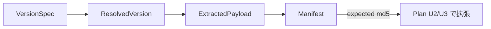

# Domain Entities — setup-foundation

> ステージ: functional-design (3.1) / Unit: setup-foundation / 作成: 2026-07-08
> 出典: `../../../inception/application-design/component-methods.md`(型シグネチャの凍結契約)、`../../../inception/requirements-analysis/requirements.md`

## エンティティ定義

### VersionSpec(値オブジェクト)

```ts
type VersionSpec = { kind: "latest" } | { kind: "exact"; raw: string };
```

- CLI の `--version` 有無から構築。exact の `raw` は BR-F05 の正規化を経て使用

### SemVer(値オブジェクト)

```ts
type SemVer = { major: number; minor: number; patch: number; prerelease: string | null };
```

- 不変条件: 各フィールド非負整数。`prerelease !== null` は「安定でない」(BR-F02)
- 比較は `compareSemver`(数値順序、BR-F03)。無効文字列はパース時に拒否(Parse, Don't Validate)

### ResolvedVersion(値オブジェクト)

```ts
type ResolvedVersion = { tag: `v${string}`; semver: SemVer; source: "release" | "tag" };
```

### FetchError / ResolveError(型付きエラー、US-A7 の凍結契約)

```ts
type FetchError = { kind: "dns" | "conn" | "http" | "rate-limit" | "payload-invalid"; detail: string; retryHint: string };
type ResolveError = { kind: "no-stable-version" | "not-found"; detail: string };
```

- U2(cli/reporter)が表示を所有する。U1 は分類と事実のみを運ぶ

### ExtractedPayload(エンティティ)

```ts
type ExtractedPayload = { root: string; version: ResolvedVersion; harnesses: string[] };
```

- `root` = 展開済み一時ディレクトリ内の配布物ルート。`harnesses` = 検出された `dist/<name>` 一覧
- ライフサイクル: fetch で生成 → planner が読む → プロセス終了時に一時領域ごと破棄

### Manifest(集約ルート — 永続、FR-016)

```ts
type Manifest = {
  schemaVersion: 1;
  installerPackageVersion: string;   // setup 自身の semver(FR-017)
  distributionVersion: string;       // 導入した framework 版
  sourceTag: string;                 // 取得元タグ(vX.Y.Z)
  installedAt: string;               // ISO 8601 — 操作開始時刻(= backup $timestamp)
  harness: "claude" | "codex" | "kiro" | "kiro-ide";
  files: ManifestFile[];
};
type ManifestFile = { path: string; class: FileClass; required: boolean; md5: string };
type FileClass = "owned" | "shared" | "user-preserved";
```

- 永続先: `<target>/amadeus/.installer/amadeus-setup-manifest.json`
- ライフサイクル: install 完了で生成 → upgrade が読み(期待 md5)、完了で更新
- 不変条件: BR-F11〜F15

## エンティティ関係



<!-- text fallback: VersionSpec から ResolvedVersion が解決され、それを使って ExtractedPayload が取得される。install 完了時に ExtractedPayload から Manifest が生成され、次回 upgrade では Manifest の期待 md5 が Plan(U2/U3 の planner が定義)の判定材料になる。 -->
