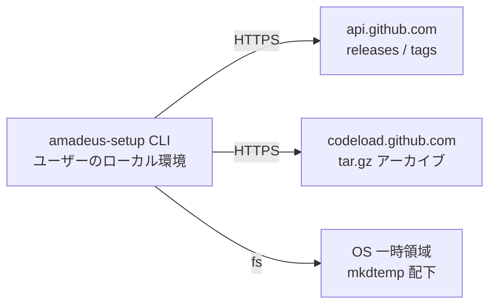

# Deployment Architecture — setup-foundation

> ステージ: infrastructure-design (3.4) / Unit: setup-foundation / 作成: 2026-07-08
> 出典: `../nfr-design/performance-design.md`・`security-design.md`(ホスト固定)・`scalability-design.md`、ADR-003、services.md

## 配置トポロジー(本 Unit が依存する実行時外部面)

<!-- text fallback: CLI はユーザーのローカル環境で動き、api.github.com(バージョン解決)と codeload.github.com(アーカイブ取得)へ HTTPS でアクセスし、OS 一時領域に展開する。所有インフラはゼロ。 -->

- **所有インフラなし**: サーバ・CDN・ストレージを持たない(feasibility の AWS 観点どおり)。可用性は GitHub の SLA に従属し、障害時は FR-012 のエラー分類が唯一の緩和
- ホワイトリスト2ホストのみ(security-design のホスト固定)。プロキシ環境は標準の HTTPS_PROXY 等ランタイム既定に従う(独自プロキシ設定は導入しない — 依存ゼロ)
