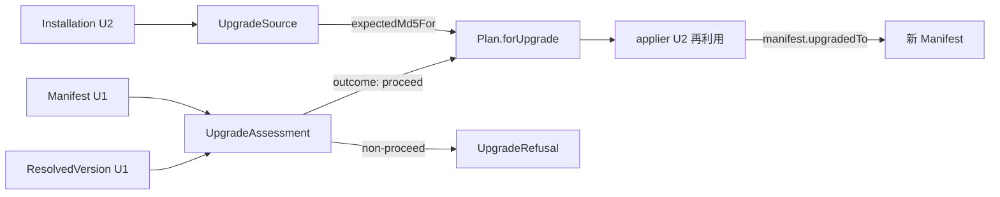

# Domain Entities — upgrade-flow

> ステージ: functional-design (3.1) / Unit: upgrade-flow / 作成: 2026-07-08
> 出典: `../../../inception/requirements-analysis/requirements.md`(FR-005/007/008/009/016)、`../../setup-foundation/functional-design/domain-entities.md`(U1: SemVer / ResolvedVersion / VersionSpec / Manifest / ManifestFiles / ManifestError / Disposition / FileClass / FetchError)、`../../install-flow/functional-design/domain-entities.md`(U2: Plan / PlanEntry / PlanRefusal / Installation / ApplyResult / Reporter API / ClassifiedError)、team knowledge `software-design/functional-domain-modeling-ts`
> スタイル: Rev.3 確認済みの役割分担(type = インスタンスメソッド契約 / 内部ファクトリ+クロージャ / コンパニオンは static のみ / 全コンパニオン namespace は `Object.freeze`)

## エンティティ定義

### UpgradeAssessment(バージョン境界の判定 — FR-005 の5ケースを所有)

```ts
export type UpgradeOutcome =
  | { readonly type: "proceed"; readonly to: ResolvedVersion }
  | { readonly type: "already-up-to-date"; readonly installed: SemVer }
  | { readonly type: "downgrade-unsupported"; readonly installed: SemVer; readonly requested: SemVer }
  | { readonly type: "installed-newer-than-latest"; readonly installed: SemVer; readonly latest: SemVer };

export type UpgradeAssessment = {
  outcome(): UpgradeOutcome;                 // 境界判断は assessment 自身が答える(Tell, Don't Ask)
  isActionable(): boolean;                   // outcome().type === "proceed" の意図明示版
};

export namespace UpgradeAssessment {
  export function of(installed: SemVer, resolved: ResolvedVersion, spec: VersionSpec): UpgradeAssessment;
  // スマートコンストラクタ: installed×resolved×spec(明示/latest)の組を検証済み判定として封入。
  // 判定素材は U1 のインスタンスメソッド(semver.isLaterThan / resolved.isSameAs)を内部で使う
}
```

- 呼び出し側(runUpgrade)は installed と resolved を取り出して比較しない — `assessment.outcome()` の網羅 switch のみ

### UpgradeRefusal(U2 PlanRefusal の upgrade 側拡張 — 判別ユニオン)

```ts
export type UpgradeRefusal =
  | { readonly type: "no-installation" }                                         // install を案内(FR-005)
  | { readonly type: "unsupported-layout"; readonly detail: string }             // 非対応旧レイアウト — 無変更終了
  | { readonly type: "partial-refused"; readonly missing: readonly string[] }    // 部分導入×非対話×非force(FR-005)
  | UpgradeOutcome_NonProceed;                                                   // already-up-to-date / downgrade / installed-newer(無変更終了系)

export namespace UpgradeRefusal { /* variant ファクトリ。U2 の ClassifiedError には UpgradeRefusal を合流させる(Reporter API 拡張) */ }
```

- U2 の `PlanRefusal`(install 側)とは独立の判別ユニオンとし、`ClassifiedError` の合併に `UpgradeRefusal` を追加する(U2 Reporter API の `renderError` が単一入口のまま描画できる)

### UpgradeSource(更新元の分類 — 導入状態からの処遇戦略)

```ts
export type UpgradeSource = {
  readonly kind: "manifested" | "manual-or-unknown" | "partial-forced";
  expectedMd5For(path: string): string | null;   // manifested: マニフェスト期待値 / manual-or-unknown: 常に null(保守的 — 全共有ファイル退避)
  strategyNote(): string;                        // レポートに載せる戦略説明(保守的プラン等)
};

export namespace UpgradeSource {
  export function fromInstallation(installation: Installation, force: boolean): Result<UpgradeSource, UpgradeRefusal>;
  // Installation(U2)から更新元戦略へ: none → no-installation、partial×非force → partial-refused、
  // unsupported layout → unsupported-layout。判定は Installation の証跡を封入して行う
}
```

- **FR-005 の「manual-or-unknown は保守的に」の実体**: `expectedMd5For` が null を返す → U1 の `manifest.dispositionFor` 相当の判定が「期待値なし=退避してからコピー」に落ちる(FR-008 の既定)

### Plan.forUpgrade(U2 Plan の upgrade 側ファクトリ — 本 Unit が規定)

```ts
export namespace Plan {
  // U2 で予告済み(「forUpgrade は U3 で規定」)。Plan / PlanEntry 型は U2 定義を再利用
  export function forUpgrade(
    payload: ExtractedPayload,
    source: UpgradeSource,
    harness: HarnessName,
    target: string,
    opts: PlanOptions,
  ): Result<Plan, UpgradeRefusal>;
}
```

- エントリ分類の対応(FR-007/008): `Disposition` → `PlanAction` の写像は **overwrite→update / backup-then-copy→backup / preserve→skip**、配布物のみに存在→add。衝突(conflict)は install 固有で upgrade では発生しない(既存ファイルは Disposition が全処遇を決める)
- 各エントリの `md5` は配布物側の新しい期待値(プラン時計算 — U2 と同じ規約)。適用後マニフェストの正準射影は U2 の `ApplyResult.manifestFiles()` を再利用

## エンティティ関係



<!-- text fallback: U2 の Installation から UpgradeSource が作られ(none/partial は UpgradeRefusal へ)、U1 の Manifest の導入版と ResolvedVersion から UpgradeAssessment が境界判定を返す。proceed のときだけ Plan.forUpgrade が UpgradeSource.expectedMd5For を使ってプランを作り、U2 の applier で適用され、manifest.upgradedTo で新 Manifest が書かれる。 -->

## U1/U2 との契約

- U1 から: SemVer / VersionSpec / ResolvedVersion / ExtractedPayload / Manifest(`dispositionFor` / `isNewerThan` / `upgradedTo`)/ ManifestFiles / ManifestError / Disposition / FileClass / FetchError / HarnessName / InstallMeta / BuildInput
- U2 から: Plan / PlanEntry / PlanAction / PlanOptions / Installation / ApplyResult / Applier / Verifier / Reporter API(`ClassifiedError` に `UpgradeRefusal` を合流)/ InstallInputs / ParsedCommand
- 本 Unit が定義: UpgradeAssessment / UpgradeOutcome / UpgradeRefusal / UpgradeSource / `Plan.forUpgrade`
