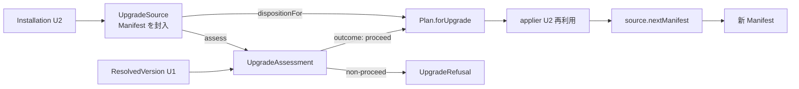

# Domain Entities — upgrade-flow

> ステージ: functional-design (3.1) / Unit: upgrade-flow / 作成: 2026-07-08
> 出典: `../../../inception/requirements-analysis/requirements.md`(FR-005/007/008/009/016)、`../../setup-foundation/functional-design/domain-entities.md`(U1: SemVer / ResolvedVersion / VersionSpec / Manifest / ManifestFiles / ManifestError / Disposition / FileClass / FetchError)、`../../install-flow/functional-design/domain-entities.md`(U2: Plan / PlanEntry / PlanRefusal / Installation / ApplyResult / Reporter API / ClassifiedError)、team knowledge `software-design/functional-domain-modeling-ts`
> スタイル: Rev.3 確認済みの役割分担(type = インスタンスメソッド契約 / 内部ファクトリ+クロージャ / コンパニオンは static のみ / 全コンパニオン namespace は `Object.freeze`)

## エンティティ定義

### UpgradeAssessment(バージョン境界の判定 — FR-005 の5ケースを所有)

```ts
export type UpgradeOutcome =
  | { readonly type: "proceed"; readonly to: ResolvedVersion }
  | { readonly type: "already-up-to-date"; readonly installed: SemVer }
  | { readonly type: "downgrade-unsupported"; readonly installed: SemVer; readonly requested: SemVer }
  | { readonly type: "installed-newer-than-latest"; readonly installed: SemVer; readonly latest: SemVer };

export type UpgradeOutcomeNonProceed = Exclude<UpgradeOutcome, { readonly type: "proceed" }>;
// = already-up-to-date | downgrade-unsupported | installed-newer-than-latest(無変更終了系の3変種)

export type UpgradeAssessment = {
  outcome(): UpgradeOutcome;                 // 境界判断は assessment 自身が答える(Tell, Don't Ask)
  isActionable(): boolean;                   // outcome().type === "proceed" の意図明示版
};

export namespace UpgradeAssessment {
  export function of(installed: SemVer, resolved: ResolvedVersion, spec: VersionSpec): UpgradeAssessment;
  // スマートコンストラクタ: installed×resolved×spec(明示/latest)の組を検証済み判定として封入。
  // 判定素材は U1 のインスタンスメソッド(semver.isLaterThan / resolved.isSameAs)を内部で使う
}
```

- 呼び出し側(runUpgrade)は installed と resolved を取り出して比較しない — `assessment.outcome()` の網羅 switch のみ

### UpgradeRefusal(U2 PlanRefusal の upgrade 側拡張 — 判別ユニオン)

```ts
export type UpgradeRefusal =
  | { readonly type: "no-installation" }                                         // install を案内(FR-005)
  | { readonly type: "unsupported-layout"; readonly detail: string }             // 非対応旧レイアウト — 無変更終了
  | { readonly type: "partial-refused"; readonly missing: readonly string[] }    // 部分導入×非対話×非force(FR-005)
  | UpgradeOutcomeNonProceed;                                                    // 上記で定義済みの無変更終了系3変種

export namespace UpgradeRefusal {
  export function fromOutcome(outcome: UpgradeOutcomeNonProceed): UpgradeRefusal;  // 境界判定の非 proceed を描画用 Refusal へ(旧 toRefusal の正式化)
  export function noInstallation(): UpgradeRefusal;
  export function unsupportedLayout(detail: string): UpgradeRefusal;
  export function partialRefused(missing: readonly string[]): UpgradeRefusal;
}
```

- U2 の `PlanRefusal`(install 側)とは独立の判別ユニオン。**`ClassifiedError` の拡張は型として U2 側に宣言済み**(U2 domain-entities の Reporter API 節を本 Unit の是正で改訂: `ClassifiedError = UsageError | ResolveError | FetchError | ManifestError | PlanRefusal | UpgradeRefusal`)— `renderError` が単一入口のまま描画できる

### UpgradeSource(更新元の分類 — 導入状態からの処遇戦略)

```ts
export type UpgradeSource = {
  readonly kind: "manifested" | "manual-or-unknown" | "partial-forced";
  dispositionFor(path: string, cls: FileClass, actualMd5: string): Disposition;
  // manifested: 封入した Manifest の manifest.dispositionFor(path, actualMd5) へ**そのまま委譲**(判定の二重実装なし — BR-U11)
  // manual-or-unknown / partial-forced: 委譲先マニフェストが存在しないため独自の保守的判定
  //   (owned→overwrite / user-preserved→preserve / shared→backup-then-copy。期待 md5 を持たないので shared は常に退避)
  assess(resolved: ResolvedVersion, spec: VersionSpec): UpgradeAssessment | null;
  // manifested: 封入マニフェストの distributionVersion を installed として UpgradeAssessment.of を構築
  // manual-or-unknown / partial-forced: 導入版不明のため null(境界判定なし — BR-U05)
  nextManifest(input: BuildInput): Manifest;
  // manifested: manifest.upgradedTo(input)(U1 のイミュータブル更新)/ それ以外: Manifest.build(...)(初回マニフェスト化)— BR-U14 の分岐を持ち主が所有
  strategyNote(): string;                        // レポートに載せる戦略説明(保守的プラン等)
};

export namespace UpgradeSource {
  export function fromInstallation(installation: Installation, force: boolean): Result<UpgradeSource, UpgradeRefusal>;
  // Installation(U2)からの変換: none → err(no-installation)、partial×--force なし → err(partial-refused)
  //   (モードを問わず一様に拒否 — 部分導入の続行には --force の明示を必須とする安全側統一。BR-U08 参照)、
  // manual-or-unknown で LegacyLayout.isUnsupported(evidence) → err(unsupported-layout)。
  // manifested のときは installation.manifest(U2 の manifested 変種が持つフィールド)を封入する — 呼び出し側にマニフェストを晒さない
}
```

- **委譲の実体(BR-U11)**: manifested の処遇判定は `manifest.dispositionFor` の呼び出しそのものであり、UpgradeSource は経路(Law of Demeter の遮蔽)のみを提供する。独自ロジックは「委譲先が存在しない」manual-or-unknown 系だけに限定し、その理由を型コメントに明記

### LegacyLayout(非対応旧レイアウトの判定規則 — FR-005)

```ts
export namespace LegacyLayout {
  export function isUnsupported(evidence: InstallationEvidence): { unsupported: boolean; detail: string };
  // 入力は U2 の構造化 InstallationEvidence(paths+versionFileContent+anchors — Installation.detect が収集)
  // 判定規則(テスト可能に固定):
  //   (a) evidence.versionFileContent が非 null かつ SemVer.parse で解釈不能(現行規約以前の内容)、または
  //   (b) evidence.paths に amadeus-* プレフィックスのファイルが存在するのに、
  //       evidence.anchors.toolsDir と evidence.anchors.amadeusCommon が両方 false
  // → 「現行 dist 形状より古い認識可能レイアウト」= unsupported-layout(無変更終了)。
  //    アンカーが揃っていれば カスタマイズ済みでも manual-or-unknown(保守的プラン)に留まる
}
```

### Plan.forUpgrade(U2 Plan の upgrade 側ファクトリ — 本 Unit が規定)

```ts
export namespace Plan {
  // U2 で予告済み(「forUpgrade は U3 で規定」)。Plan / PlanEntry 型は U2 定義を再利用
  export function forUpgrade(
    payload: ExtractedPayload,
    source: UpgradeSource,
    harness: HarnessName,
    target: string,
    opts: PlanOptions,
  ): Result<Plan, UpgradeRefusal>;
}
```

- エントリ分類の対応(FR-007/008): `Disposition` → `PlanAction` の写像は **overwrite→update / backup-then-copy→backup / preserve→skip**、配布物のみに存在→add。衝突(conflict)は install 固有で upgrade では発生しない(既存ファイルは Disposition が全処遇を決める)
- 各エントリの `md5` は配布物側の新しい期待値(プラン時計算 — U2 と同じ規約)。適用後マニフェストの正準射影は U2 の `ApplyResult.manifestFiles()` を再利用

## エンティティ関係



<!-- text fallback: U2 の Installation から UpgradeSource が作られ(none/partial/旧レイアウトは UpgradeRefusal へ)、source.assess が封入マニフェストの導入版と ResolvedVersion から UpgradeAssessment(境界判定)を返す。proceed のときだけ Plan.forUpgrade が source.dispositionFor(manifested は manifest.dispositionFor へ委譲)を使ってプランを作り、U2 の applier で適用され、source.nextManifest(manifested は manifest.upgradedTo)で新 Manifest が書かれる。 -->

## U1/U2 との契約

- U1 から: SemVer / VersionSpec / ResolvedVersion / ExtractedPayload / Manifest(`dispositionFor` / `isNewerThan` / `upgradedTo`)/ ManifestFiles / ManifestError / Disposition / FileClass / FetchError / HarnessName / InstallMeta / BuildInput
- U2 から: Plan / PlanEntry / PlanAction / PlanOptions / Installation / **InstallationEvidence**(本 Unit の是正で構造化 — LegacyLayout の入力契約)/ ApplyResult / Applier / Verifier / Reporter API(`ClassifiedError` に `UpgradeRefusal` を合流)/ InstallInputs / ParsedCommand
- 本 Unit が定義: UpgradeAssessment / UpgradeOutcome / UpgradeOutcomeNonProceed / UpgradeRefusal / UpgradeSource / LegacyLayout / `Plan.forUpgrade`
