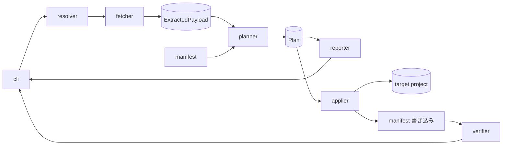

# Component Dependency — `@amadeus-dlc/setup`(installer-distribution)

> ステージ: application-design (2.6) / 作成: 2026-07-08
> 上流入力: `components.md`、`component-methods.md`、`../requirements-analysis/requirements.md`

## 依存マトリクス

依存方向は「行 → 列」。すべて同期呼び出し(単一プロセス内)。循環依存なし。

| ↓依存元 \ 依存先→ | resolver | fetcher | planner | applier | manifest | verifier | reporter |
|---|---|---|---|---|---|---|---|
| **cli** | ✓ | ✓ | ✓ | ✓ | ✓ | ✓ | ✓ |
| **resolver** | — | ✓(Http 基盤) | — | — | — | — | — |
| **planner** | — | — | — | — | ✓(読み取り) | — | — |
| **applier** | — | — | —(Plan を受領) | — | — | — | — |
| **verifier** | — | — | — | — | ✓(読み取り) | — | — |

- cli がオーケストレーター(唯一の全モジュール依存)。下位モジュール同士の横依存は resolver→fetcher(HTTP 基盤共有)と planner/verifier→manifest(読み取り)のみ
- ポート(`Http` / `FsOps` / `TtyIO` / `ManifestIo`)は cli が実装を注入する(テストシーム)

## データフロー

<!-- text fallback: cli が resolver でバージョンを解決し、fetcher がアーカイブを取得・展開して ExtractedPayload を作る。planner は payload と manifest(あれば)から Plan を作り、reporter が差分レポートとして cli に返す。確認後 applier が Plan を target project へ適用し、manifest を書き込み、verifier が検証して cli に結果を返す。 -->

## 共有リソース

| リソース | 所有 | 共有者 |
|----------|------|--------|
| `amadeus/.installer/amadeus-setup-manifest.json` | manifest モジュール | planner(期待 md5 読み)、verifier(必須ファイルリスト読み) |
| 一時ディレクトリ(アーカイブ展開先) | fetcher | planner(読み取り)、applier(コピー元) |
| バックアップタイムスタンプ(操作開始時刻) | planner(Plan に埋め込み) | applier(ファイル名生成)— FR-008 の単一値保証 |
