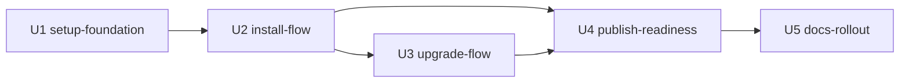

# Unit of Work Dependency — `@amadeus-dlc/setup`(installer-distribution)

> ステージ: units-generation (2.7) / 作成: 2026-07-08
> 出典: `unit-of-work.md`、`../application-design/component-dependency.md`、`units-generation-questions.md` Q2

## 依存 DAG(循環なし)

機械可読エッジブロック(runtime compile の bolt_dag 入力 — この YAML が正、以下の図は可視化):

```yaml
units:
  - name: setup-foundation
    depends_on: []
  - name: install-flow
    depends_on: [setup-foundation]
  - name: upgrade-flow
    depends_on: [install-flow]
  - name: publish-readiness
    depends_on: [install-flow, upgrade-flow]
  - name: docs-rollout
    depends_on: [publish-readiness]
```



<!-- text fallback: U1 が最初。U2 は U1 に依存。U3 は U2 に依存(planner/applier 基盤と検証パスの再利用)。U4 は U2 と U3 に依存(同梱物確定後にパッケージング検証)。U5 は U4 に依存(publish 可能になってから README 刷新)。 -->

| 依存(A depends on B) | 統合ポイント |
|------------------------|--------------|
| U2 → U1 | resolver/fetcher/manifest の公開 API(component-methods.md のシグネチャ)、ビルド設定 |
| U3 → U2 | planner/applier/reporter の共有基盤、verifier の検証パス |
| U4 → U2, U3 | 同梱物(dist/cli.js の最終形)が pack 契約テストの対象 |
| U5 → U4 | ワンライナーが publish 手順込みで成立してから README を刷新 |

## 並列開発の機会

- **原則直列**(Q2 決定): U1 → U2 → U3 → U4 → U5。単一メンテナ体制で調整コストを最小化
- 例外: U4 のうち **publish 手順書のドラフト**(コード非依存)は U2/U3 実装中に先行着手可能
- 複数の有効なトポロジカル順序は存在しない(直列決定により一意)

## 統合契約

- U1 の公開 API(`resolveVersion` / `fetchArchive` / `readManifest` 等)が U2/U3 への唯一の契約 — シグネチャ変更は U2/U3 着手前に凍結する
- U2 が確立する `Plan`/`PlanEntry` データ構造は U3 が拡張して再利用(action/class の語彙は FR-007/FR-016 で固定済み)
