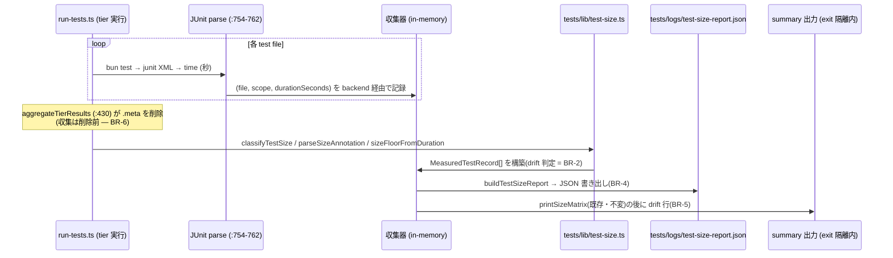

# Business Logic Model — dynamic-size-observation(#699)

> 上流: `../../../inception/requirements-analysis/requirements.md`(FR-1〜FR-6、NFR-1〜5)、`business-rules.md`(BR-1〜8)、`domain-entities.md`。
> units-generation / application-design は refactor scope でスキップ — 既存 runner 構造(codekb/architecture.md「ランナー計測ライフサイクル」)をデファクト設計として統合点を定める。

## 1. 全体ワークフロー



テキストフォールバック: (1) tier 実行中、per-file の JUnit `time` を wall-clock backend(seam)経由でメモリ収集(`.meta` 削除前)。(2) 全 tier 完了後、各ファイルの source を静的分類・注釈 parse し、duration の floor と突き合わせて `MeasuredTestRecord` を構築。(3) レコード群から `TestSizeReport` を組み、JSON を書き出し。(4) 既存 matrix の後に drift サマリ行を出力。(3)(4) は try/catch 隔離内。

## 2. 処理ステップ詳細

### Step A: duration 収集(FR-1、BR-6)

- 統合点: per-file 実行の JUnit parse 直後(`run-tests.ts:754-762` の `time` 取得箇所)。既存の `buildMeta`/`renderMeta` 経路(`bun-junit-to-meta.ts`)は変更しない。
- 収集器はモジュールスコープの配列ではなく、runner main から引き回す明示的な collector(関数引数)とする — テストで独立構築できる seam(NFR-5)。
- 収集値: `(file, scope/tier, durationSeconds)`。`durationSeconds` の実出所は2系統: (a) root JUnit `time`(通常)、(b) Bun が root time を省略した場合の runner 計算 wall-clock 代替(`run-tests.ts:762` の `Date.now()` 由来フォールバック — 既存挙動)。いずれも drift 目的には正当な wall-clock 信号であり、区別せず保持する(丸めない)。なお `meta.duration` は文字列(`bun-junit-to-meta.ts:114`)のため、収集点で `Number()` parse を行い、NaN は §3 のエラー表に従い除外する(parse 点はこの Step A の収集器)。
- backend 経由: collector は `SizeObservationBackend`(wall-clock 実装)から `SizeObservation` を受け取る(BR-7 の seam 初回消費 — FR-6 付帯条件)。

### Step B: レコード構築(FR-2、BR-1/BR-2)

決定木(per file):

```
source 読める?
├─ no → レコードは duration + scope のみで構築不可 → スキップし件数を summary に "unclassified" として計上しない(素直に除外、レポートに含めない)※理由: 実行できた test file の source が読めない状況は runner 前提の崩壊であり、advisory 経路で偽データを作らない
└─ yes
   ├─ staticSize/staticSignals = classifyTestSize(source)
   ├─ declaredSize = parseSizeAnnotation(source).declared
   ├─ effectiveDeclared = declaredSize ?? staticSize
   ├─ dynamicFloor = sizeFloorFromDuration(durationSeconds)
   └─ drift = SIZE_ORDER[dynamicFloor] > SIZE_ORDER[effectiveDeclared]
        ? { kind: "wall-clock", declared: effectiveDeclared, measured: dynamicFloor }
        : { kind: "none" }
```

- 純関数として `test-size.ts` に置く(例: `buildMeasuredRecord(input)`)。ファイル I/O は行わず、source 文字列と duration を受け取る(parse-dont-validate、in-process テスト可能)。

### Step C: レポート書き出し(FR-3、BR-4)

- `buildTestSizeReport(records)` が `summary.driftCount` / `totalFiles` を導出(first-class collection)。
- 書き出しは runner 側(`tests/run-tests.ts`)で `tests/logs/test-size-report.json` へ。`tests/logs/` が無ければ作成。
- 部分実行(tier/ファイル指定)ではその実行分のみ。レポートは「この実行の実測」であり、全ファイル台帳ではない(BR-4)。

### Step D: summary 出力(FR-3、BR-5)

- 既存 `printSizeMatrix`(`run-tests.ts:895-948`)呼び出しの直後、同じ best-effort wrap(`:882-886`)の内側で drift 行を出力。
- 出力例:
  ```
  wall-clock drift: 2 file(s)
    tests/unit/foo.test.ts: declared=small measured=medium (3.2s)
    tests/integration/bar.test.ts: declared=medium measured=large (31.0s)
  ```
  0 件時: `wall-clock drift: 0 file(s)` の1行のみ。

### Step E: CI artifact 化(FR-3、BR-4)

- `ci.yml` のテスト実行ジョブに upload-artifact ステップを追加:
  - `name: amadeus-test-size-report`、`path: tests/logs/test-size-report.json`、`if: always()`、`if-no-files-found: warn`、`retention-days: 14`(coverage の既存値 `ci.yml:75-84` に合わせる)。

## 3. エラーハンドリング(構築フェーズガードレール準拠)

| 異常 | 分類 | 処理 |
|---|---|---|
| JUnit `time` が欠落/NaN | 回復可能(advisory 経路) | 該当ファイルをレコードから除外し、stderr に1行 note(サイレント失敗にしない) |
| source 読み取り失敗 | 回復可能(advisory 経路) | 同上(Step B 決定木) |
| レポート書き出し失敗(EACCES 等) | 回復可能 | try/catch 隔離内で stderr に note、runner の exit code に影響させない(BR-6) |
| 分類器/floor 関数の内部バグ | 欠陥(defect) | 隔離 wrap が捕捉し note — runner は続行。修正は通常のバグフローへ |

- 「エラーを握りつぶさない」と「runner 契約の不可侵」の両立: 隔離はするが必ず stderr に痕跡を残す(ログ記録による伝播)。

## 4. テスト設計への引き渡し(BR-8)

- in-process(第一): `sizeFloorFromDuration` 境界値(0.999/1.0/29.999/30.0)、`buildMeasuredRecord` の drift 成立/不成立、注釈あり/なし/無効、`buildTestSizeReport` の集計。
- 赤/緑 fixture(落ちる実証): 赤=`// size: small` + 1s 超の実測を与えて drift 検出、緑=帯内で非検出。fixture は使用バックエンド(wall-clock)で検出可能な形態に限定。
- 退行固定: 既存 export のシグネチャ不変、printSizeMatrix 既存出力の不変、exit code 契約(t112 が既に固定 — 新規テストで重複させず t112 の通過を確認)。

## 5. スコープ外の再確認

- strace/eBPF バックエンド実装(seam のみ — FR-6)。
- 動的 drift の CI 赤化(advisory — BR-3)。
- coverage registry / `.meta` ライフサイクル / 静的 drift guard の変更(BR-6/BR-7)。
